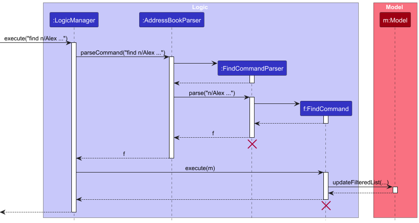
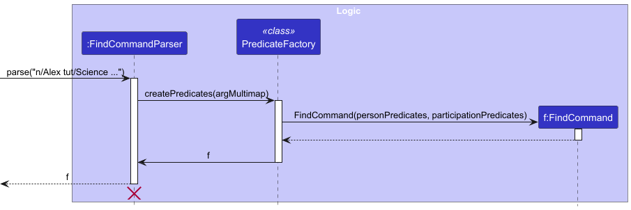
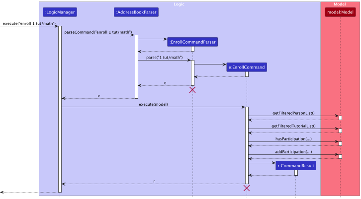
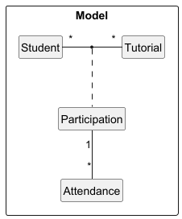
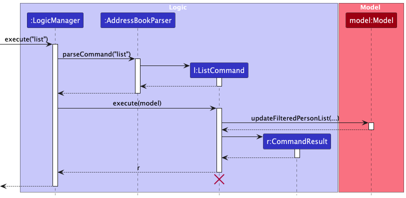
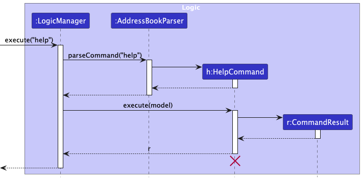

This **EduVault Developer Guide** provides a comprehensive overview for developers who wishes to build on the current EduVault system, or anyone who is interested to learn about the internal structure of EduVault. It includes details on the architectural structure, key classes, and design patterns used to support EduVault’s functionalities, such as student and tutorial management.  This guide also covers some planned enhancements that our team have in mind.

---

* Table of Contents
{:toc}

--------------------------------------------------------------------------------------------------------------------

## **Acknowledgements**

This project, EduVault, builds upon the Address Book Level 3 (AB3) project, originally developed by the [SE-EDU initiative](https://se-education.org/). Our team would like to extend our gratitude to the developers of AB3 for their work, which has significantly contributed to the structure and functionality of this project.

In addition, we acknowledge and thank the creators of the following resources, libraries, and tools that were instrumental in the development of EduVault:

* [AB3 Codebase](https://github.com/se-edu/addressbook-level3)
* [JavaFX](https://openjfx.io/)
* [JUnit](https://junit.org/junit5/)
* [Jackson Library](https://github.com/FasterXML/jackson)
* Other code segments and ideas that we have adopted from Stack Overflow, YouTube, and other online sources

We deeply appreciate the contributions of these resources and their developers, which made our work possible and helped us bring EduVault to life.

--------------------------------------------------------------------------------------------------------------------

## **Setting up, getting started**

Refer to the guide [_Setting up and getting started_](SettingUp.md).

--------------------------------------------------------------------------------------------------------------------

## **Design**

<div markdown="span" class="alert alert-success">

:bulb: **Tip:** The `.puml` files used to create diagrams in this document `docs/diagrams` folder. Refer to the [_PlantUML Tutorial_ at se-edu/guides](https://se-education.org/guides/tutorials/plantUml.html) to learn how to create and edit diagrams.
</div>

### Architecture


The ***Architecture Diagram*** given above explains the high-level design of the App.

Given below is a quick overview of main components and how they interact with each other.

**Main components of the architecture**

**`Main`** (consisting of classes [`Main`](https://github.com/AY2425S1-CS2103T-W08-2/tp/blob/master/src/main/java/seedu/address/Main.java) and [`MainApp`](https://github.com/AY2425S1-CS2103T-W08-2/tp/blob/master/src/main/java/seedu/address/MainApp.java)) is in charge of the app launch and shut down.
* At app launch, it initializes the other components in the correct sequence, and connects them up with each other.
* At shut down, it shuts down the other components and invokes cleanup methods where necessary.

The bulk of the app's work is done by the following four components:

* [**`UI`**](#ui-component): The UI of the App.
* [**`Logic`**](#logic-component): The command executor.
* [**`Model`**](#model-component): Holds the data of the App in memory.
* [**`Storage`**](#storage-component): Reads data from, and writes data to, the hard disk.

[**`Commons`**](#common-classes) represents a collection of classes used by multiple other components.

**How the architecture components interact with each other**

The *Sequence Diagram* below shows how the components interact with each other for the scenario where the user issues the command `delete 1`.


Each of the four main components (also shown in the diagram above),

* defines its *API* in an `interface` with the same name as the Component.
* implements its functionality using a concrete `{Component Name}Manager` class (which follows the corresponding API `interface` mentioned in the previous point.

For example, the `Logic` component defines its API in the `Logic.java` interface and implements its functionality using the `LogicManager.java` class which follows the `Logic` interface. Other components interact with a given component through its interface rather than the concrete class (reason: to prevent outside component's being coupled to the implementation of a component), as illustrated in the (partial) class diagram below.


The sections below give more details of each component.

### UI component

The **API** of this component is specified in [`Ui.java`](https://github.com/AY2425S1-CS2103T-W08-2/tp/blob/master/src/main/java/seedu/address/ui/Ui.java)


The UI consists of a `MainWindow` that is made up of parts e.g.`CommandBox`, `ResultDisplay`, `PersonListPanel`, `StatusBarFooter` etc. All these, including the `MainWindow`, inherit from the abstract `UiPart` class which captures the commonalities between classes that represent parts of the visible GUI.

The `UI` component uses the JavaFx UI framework. The layout of these UI parts are defined in matching `.fxml` files that are in the `src/main/resources/view` folder. For example, the layout of the [`MainWindow`](https://github.com/AY2425S1-CS2103T-W08-2/tp/blob/master/src/main/java/seedu/address/ui/MainWindow.java) is specified in [`MainWindow.fxml`](https://github.com/AY2425S1-CS2103T-W08-2/tp/blob/master/src/main/resources/view/MainWindow.fxml)

The `UI` component,

* executes user commands using the `Logic` component.
* listens for changes to `Model` data so that the UI can be updated with the modified data.
* keeps a reference to the `Logic` component, because the `UI` relies on the `Logic` to execute commands.
* depends on some classes in the `Model` component, as it displays `Person` object residing in the `Model`.

### Logic component

**API** : [`Logic.java`](https://github.com/AY2425S1-CS2103T-W08-2/tp/blob/master/src/main/java/seedu/address/logic/Logic.java)

Here's a (partial) class diagram of the `Logic` component:


<br>

#### General Interaction

The general interactions within the `Logic` component is shown in the sequence diagram below, taking `execute("delete 1")` API call as an example.


<div markdown="span" class="alert alert-primary">:pushpin: **Note:** The lifeline for `DeleteCommandParser` and `DeleteCommand` should end at the destroy marker (X) but due to a limitation of PlantUML, the lifeline continues till the end of diagram.
</div>

How the `Logic` component works:

1. When `Logic` is called upon to execute a command, it is passed to an `AddressBookParser` object which in turn creates a parser that matches the command (e.g., `DeleteCommandParser`) and uses it to parse the command.
1. This results in a `Command` object (more precisely, an object of one of its subclasses e.g., `DeleteCommand`) which is executed by the `LogicManager`.
1. The command can communicate with the `Model` when it is executed (e.g. to delete a person and his/her [participation](#participation-class)).<br>
   Note that although this is shown as a single step in the diagram above (for simplicity), in the code it can take several interactions (between the command object and the `Model`) to achieve.
1. The result of the command execution is encapsulated as a `CommandResult` object which is returned back from `Logic`.

Here are the other classes in `Logic` (omitted from the class diagram above) that are used for parsing a user command:


How the parsing works:
* When called upon to parse a user command, the `AddressBookParser` class creates an `XYZCommandParser` (`XYZ` is a placeholder for the specific command name e.g., `AddCommandParser`) which uses the other classes shown above to parse the user command and create a `XYZCommand` object (e.g., `AddCommand`) which the `AddressBookParser` returns back as a `Command` object.
* All `XYZCommandParser` classes (e.g., `AddCommandParser`, `DeleteCommandParser`, ...) inherit from the `Parser` interface so that they can be treated similarly where possible e.g, during testing.

<div markdown="span" class="alert alert-primary">:pushpin: **Note:** 

For more information on the interactions of features with the Logic Component, please refer [here](#implementation).
</div>


### Model component
**API** : [`Model.java`](https://github.com/AY2425S1-CS2103T-W08-2/tp/blob/master/src/main/java/seedu/address/model/Model.java)


The `Model` component,

* stores the currently ‘selected’ `Person` objects (e.g., results of a search query) as a separate *filtered* list which is exposed to outsiders as an unmodifiable `ObservableList<Person>` that can be ‘observed’ e.g. the UI can be bound to this list so that the UI automatically updates when the data in the list change.
* stores `Tutorial` objects as a separate list which is exposed to outsiders as an unmodifiable `ObservableList<Tutorial>` that can be observed.
* stores `Participation` objects as a separate list which is exposed to outsiders as an unmodifiable `ObservableList<Participation>` that can be observed.
* Each `Participation` object is also composed of a `Tutorial` object, a `Person` object, and a `List<Attendance>` object. More information on this [here](#storage-feature).
* stores a `UserPref` object that represents the user’s preferences. This is exposed to the outside as a `ReadOnlyUserPref` objects.
* does not depend on any of the other three components (as the `Model` represents data entities of the domain, they should make sense on their own without depending on other components

<div markdown="span" class="alert alert-primary">:pushpin: **Note:** 
Some of our classes are still named AddressBook instead of EduVault to honor the legacy code. Additionally,
the name AddressBook aligns with the current functionality of the class.
</div>

<div markdown="span" class="alert alert-primary">:pushpin: **Note:** An alternative (arguably, a more OOP) model is given below. It has a `Tag` list in the `AddressBook`, which `Person` references. This allows `AddressBook` to only require one `Tag` object per unique tag, instead of each `Person` needing their own `Tag` objects.<br>


</div>


### Storage component

**API** : [`Storage.java`](https://github.com/AY2425S1-CS2103T-W08-2/tp/blob/master/src/main/java/seedu/address/storage/Storage.java)


The `Storage` component,
* can save both address book data and user preference data in JSON format, and read them back into corresponding objects.
* inherits from both `AddressBookStorage` and `UserPrefStorage`, which means it can be treated as either one (if only the functionality of only one is needed).
* depends on some classes in the `Model` component (because the `Storage` component's job is to save/retrieve objects that belong to the `Model`)

### Common classes

Classes used by multiple components are in the `seedu.address.commons` package.

--------------------------------------------------------------------------------------------------------------------

## **Implementation**

This section describes some noteworthy details on how certain features are implemented.

<div markdown="span" class="alert alert-primary">:pushpin: **Note:**
`Students` are named as `Persons` due to Legacy code.
</div>


### Storage feature

EduVault stores data in JSON file using the Jackson library.

EduVault stores four types of objects:
* `Student` (`Person`)
* `Tutorial`
* `Participation`
* `Attendance`

An overarching structure of the JSON file is as shown below:

```dtd
{
    "persons" : [...],
    "tutorials" : [...],
    "participations" : [...]
}
```

<br>

Within each of the different objects (`Student`, `Tutorial`, `Participation`), data is stored in the following format as shown below. Conditions for storage are also included.

`Student`
```dtd
"persons" :
[
    {
        "name" : "Alex Yeoh",
        "phone" : "87438807",
        "email" : "alexyeoh@example.com",
        "address" : "Blk 30 Geylang Street 29, #06-40",
        "payment" : "189",
        "tags" : [ "Scholar" ]
    },
    ...
]
```
**Condition:** There may be no duplicate `Students`.
Two `Students` are considered to be duplicates if they have matching `name` and `phone`.

`Tutorial`
```dtd
"tutorials" :
[
    {
        "subject" : "Mathematics"
    },
    ...
]
```
**Condition:** There may be no duplicate `Tutorials`.
Two `Tutorials` are considered to be duplicates if they have matching `subject`.

`Participation`
```dtd
"participations" :
[
    {
        "student" : "Alex Yeoh",
        "phone" : "87438807",
        "tutorial" : "Mathematics",
        "attendances" : [...]
    },
]
```
**Condition:**
1. Each `Participation` must have a `Student` with matching `Name` and `Phone`, and `Tutorial` with matching `Subject`, to be considered valid.

2. There may be no duplicate `Participations`.
Two `Participations` are considered to be duplicates if the `Student` and `Tutorial` are the same.

`Attendance`
```dtd
"attendances" :
[
    {
        "attendanceDate" : "02/02/2024"
    }
]
```

**Condition:** There may be no duplicate `Attendances`.
1. Two `Attendances` are considered to be duplicates if the `attendanceDate` occurs in the same week of week-based-year.

2. EduVault selects the first `Attendance` of duplicate `Attendance` entries as defined above to load from storage.

##### Uniqueness of objects
For the purposes of storage into JSON format, EduVault defines two objects as distinct based on these factors:

* Two `Students` are considered to be duplicates if they have matching `name` and `phone`.
* Two `Tutorials` are considered to be duplicates if they have matching `subject`.
* Two `Participations` are considered to be duplicates if the `name`, `phone` and `subject` are the same (`Student` and `Tutorial` identifiers).
* Two `Attendances` are considered to be duplicates if the `attendanceDate` occurs in the same week of week-based-year.

##### Loading Order
The order which storage loads `Person`, `Tutorial` and `Participation` is shown below. 


`Person` and `Tutorial` objects are loaded into the `AddressBook` first.

The `Participation` objects are created using corresponding `Person` and `Tutorial` objects in the `AddressBook`
based on [uniqueness](#uniqueness-of-objects).


### Find feature


The implementation of the Find feature follows closely with the general format provided in the Logic Component [above](#logic-component).


Due to the complexity of the command, there is an extra helper class `PredicateFactory` when `AddressBookParser` calls `parse("n/Alex ...")`


The main steps for this execution are:

1. The user inputs the command `find n/Alex tut/Science ...` to find students with these properties
2. **LogicManager** receives the command and calls `parseCommand("find n/Alex tut/Science ...")` on AddressBookParser to interpret the input.
3. **AddressBookParser** receives the command and identifies that it’s a find command. It calls `parse("n/Alex tut/Science ...")` on FindCommandParser to parse the specific details.
4. **FindCommandParser** processes the arguments `("n/Alex tut/Science ...")` into an argument map, and passes it to `PredicateFactory`.
5. **PredicateFactory** processes the given argument map into `personPredicates` of type `Predicate<Person>` and `participationPredicates` of type `Predicate<Participation>`, and creates an instance of FindCommand
5. **LogicManager** then calls `execute(model)` on the created FindCommand to carry out the find operation.
6. **FindCommand** proceeds to filter the relevant data from the Model instance.


### Enroll and Unenroll feature

The implementation of the Enroll and Unenroll feature follows closely with the general format provided in the Logic Component [above](#logic-component). The implementation of these two commands are also similar to each other. So as an example, only the sequence diagram for Enroll feature when the user inputs `enroll 1 tut/math` will be shown below.




The main steps for this execution are:

1. The user inputs the command `enroll 1 tut/math` to enroll the student at index 1 into a math tutorial.
2. **LogicManager** receives the command and calls `parseCommand("enroll 1 tut/math")` on AddressBookParser to interpret the input.
3. **AddressBookParser** receives the command and identifies that it’s an enrollment command. It calls `parse("1 tut/math")` on EnrollCommandParser to parse the specific details.
4. **EnrollCommandParser** processes the arguments `("1 tut/math")` and creates an instance of EnrollCommand, which is configured to enroll the specified student in the math tutorial.
5. **LogicManager** then calls `execute(model)` on the created EnrollCommand to carry out the enrollment operation.
6. **EnrollCommand** proceeds to retrieve the relevant data from the Model instance, and then adding the student to the math tutorial, by creating a `Participation` object. 


<div markdown="span" class="alert alert-success">:bulb: **Tip:**

Details of the Participation class are included [below](#participation-class).
</div>

<ol start="7">
    <li>Once the enrollment is completed, EnrollCommand returns a <b>CommandResult</b> with a message indicating the successful enrollment.</li>
    <li>The result then flows back through <b>LogicManager</b>.</li>
</ol>


<br>

<div markdown="span" class="alert alert-primary">:pushpin: **Note:** 

The implementation of the Unenroll feature is similar to that of the example given above, but instead of `addParticipation(...)` method of the Model Component being called, `deleteParticipation(...)` is called.

</div>

<br>

#### Participation Class
`Participation` is an **association** class used to represent the relationship between a student and a tutorial, as well as his/her attendance, which is stored in a List. Below is a class diagram denoting such a relationship.



When storing data, each `Participation` object is stored separately from `Student` and `Tutorial`. Please refer to the [Storage Feature](#storage-feature) for more information of how the `Participation` objects are being stored.

### Add Student and Create Tutorial feature

The implementation of the Add Student and Create Tutorial feature follows closely with the general format provided in the Logic Component [above](#logic-component). The implementation of these two commands are also similar to each other. So as an example, only the sequence diagram for **Add Student** feature when the user inputs `add n/John Doe p/98765432 e/johnd@example.com a/John street, block 123, #01-01`  will be shown below.   

<div markdown="span" class="alert alert-primary">:pushpin: **Note:** 

For simplicity's sake, we use `add n/…` to represent the user input in the sequence diagram below.
</div>


The main steps for execution are similar to the Enroll and Unenroll feature documented [above](#enroll-and-unenroll-feature). The main difference is that **AddCommandParser** does not process the index and the `tut` prefix, but instead, it processes other prefixes like `n/` and  `e/`.

<div markdown="span" class="alert alert-primary">:pushpin: **Note:** 

Between Add Student and Create Tutorial feature, the main difference is with regard to how they access the Model Component. Create Tutorial calls `hasTutorial(...)` and `createTutorial(...)`  method from the Model Component instead.
</div>

### Delete Student and Close Tutorial feature

The implementation of the Delete Student and Close Tutorial feature follows closely with the general format provided in the Logic Component [above](#logic-component). The implementation of these two commands are also similar to each other. So as an example, only the sequence diagram for Delete Student feature when the user inputs `delete 1` will be shown below. 

Note that this sequence diagram is the same as the one used in [Logic Component](#logic-component), but it is added here for easier referencing.


The main steps for execution are similar to the Enroll and Unenroll feature documented [above](#enroll-and-unenroll-feature), ignoring the difference in parsers and commands being executed.

<div markdown="span" class="alert alert-primary">:pushpin: **Note:**

Between Delete Student and Close Tutorial feature, the main difference is with regard to how they access the Model Component. Instead of calling student-related methods such as `getFilteredPersonList()` and `deletePerson(...),` Close Tutorial calls tutorial-related methods like `getTutorialList()` and `deleteTutorial(...)` instead.
</div>

<div markdown="span" class="alert alert-primary">:pushpin: **Note:**
`Student` are named as `Person` due to Legacy code.
</div>

### List and Clear feature

The implementation of the List and Clear feature **deviates** slightly from the general format provided in the Logic Component [above](#logic-component). Since there are no arguments used when executing these commands, they will not require a `Parser` to check the inputs. As these two commands are similar to each other, so only the sequence diagram for List feature when the user inputs `list` will be shown below.



The main steps for this execution are:

1. The user inputs the command `list` to display all students.
2. **LogicManager** receives the command and calls `parseCommand("list")` on AddressBookParser to interpret the input.
3. **AddressBookParser** receives the command and identifies that it is a list command. It directly creates an instance of **ListCommand**, since there are no arguments to parse.
4. **LogicManager** then calls `execute(model)` on the created **ListCommand** to perform the listing operation.
5. **ListCommand** then retrieves and update the list.
6. After updating the list, **ListCommand** returns a **CommandResult** with a message indicating that the list operation has been completed successfully.
7. The result then flows back to **LogicManager**.


<div markdown="span" class="alert alert-primary">:pushpin: **Note:** 

The implementation of the Clear feature is similar to that of the example given above, but instead of `updateFilteredPersonList(...)` method of the Model Component being called, `setAddressBook(...)` is called.

</div>


### Help and Exit feature

The implementation of the Help and Exit feature **deviates** from the general format provided in the Logic Component [above](#logic-component). Since there are no arguments used when executing these commands, they will not require a `Parser` to check the inputs. In addition, they will not be accessing the `Model` Component, since these two features are not updating or retrieving data. As these two commands are similar to each other, so only the sequence diagram for **Help** feature when the user inputs `help` will be shown below.



Tha main steps of execution are similar to the [List and Clear feature](#list-and-clear-feature), excluding Step 5.

<div markdown="span" class="alert alert-primary">:pushpin: **Note:** 

The implementation of the Exit feature is similar to that of the example given above.

</div>

---

### \[Proposed\] Undo/redo feature

#### Proposed Implementation

The proposed undo/redo mechanism is facilitated by `VersionedAddressBook`. It extends `AddressBook` with an undo/redo history, stored internally as an `addressBookStateList` and `currentStatePointer`. Additionally, it implements the following operations:

* `VersionedAddressBook#commit()` — Saves the current address book state in its history.
* `VersionedAddressBook#undo()` — Restores the previous address book state from its history.
* `VersionedAddressBook#redo()` — Restores a previously undone address book state from its history.

These operations are exposed in the `Model` interface as `Model#commitAddressBook()`, `Model#undoAddressBook()` and `Model#redoAddressBook()` respectively.

Given below is an example usage scenario and how the undo/redo mechanism behaves at each step.

Step 1. The user launches the application for the first time. The `VersionedAddressBook` will be initialized with the initial address book state, and the `currentStatePointer` pointing to that single address book state.


Step 2. The user executes `delete 5` command to delete the 5th person in the address book. The `delete` command calls `Model#commitAddressBook()`, causing the modified state of the address book after the `delete 5` command executes to be saved in the `addressBookStateList`, and the `currentStatePointer` is shifted to the newly inserted address book state.


Step 3. The user executes `add n/David …​` to add a new person. The `add` command also calls `Model#commitAddressBook()`, causing another modified address book state to be saved into the `addressBookStateList`.


<div markdown="span" class="alert alert-primary">:pushpin: **Note:** If a command fails its execution, it will not call `Model#commitAddressBook()`, so the address book state will not be saved into the `addressBookStateList`.

</div>

Step 4. The user now decides that adding the person was a mistake, and decides to undo that action by executing the `undo` command. The `undo` command will call `Model#undoAddressBook()`, which will shift the `currentStatePointer` once to the left, pointing it to the previous address book state, and restores the address book to that state.


<div markdown="span" class="alert alert-primary">:pushpin: **Note:** If the `currentStatePointer` is at index 0, pointing to the initial AddressBook state, then there are no previous AddressBook states to restore. The `undo` command uses `Model#canUndoAddressBook()` to check if this is the case. If so, it will return an error to the user rather
than attempting to perform the undo.

</div>

The following sequence diagram shows how an undo operation goes through the `Logic` component:


<div markdown="span" class="alert alert-primary">:pushpin: **Note:** The lifeline for `UndoCommand` should end at the destroy marker (X) but due to a limitation of PlantUML, the lifeline reaches the end of diagram.

</div>

Similarly, how an undo operation goes through the `Model` component is shown below:


The `redo` command does the opposite — it calls `Model#redoAddressBook()`, which shifts the `currentStatePointer` once to the right, pointing to the previously undone state, and restores the address book to that state.

<div markdown="span" class="alert alert-primary">:pushpin: **Note:** If the `currentStatePointer` is at index `addressBookStateList.size() - 1`, pointing to the latest address book state, then there are no undone AddressBook states to restore. The `redo` command uses `Model#canRedoAddressBook()` to check if this is the case. If so, it will return an error to the user rather than attempting to perform the redo.

</div>

Step 5. The user then decides to execute the command `list`. Commands that do not modify the address book, such as `list`, will usually not call `Model#commitAddressBook()`, `Model#undoAddressBook()` or `Model#redoAddressBook()`. Thus, the `addressBookStateList` remains unchanged.


Step 6. The user executes `clear`, which calls `Model#commitAddressBook()`. Since the `currentStatePointer` is not pointing at the end of the `addressBookStateList`, all address book states after the `currentStatePointer` will be purged. Reason: It no longer makes sense to redo the `add n/David …​` command. This is the behavior that most modern desktop applications follow.


The following activity diagram summarizes what happens when a user executes a new command:


#### Design considerations:

**Aspect: How undo & redo executes:**

* **Alternative 1 (current choice):** Saves the entire address book.
  * Pros: Easy to implement.
  * Cons: May have performance issues in terms of memory usage.

* **Alternative 2:** Individual command knows how to undo/redo by
  itself.
  * Pros: Will use less memory (e.g. for `delete`, just save the person being deleted).
  * Cons: We must ensure that the implementation of each individual command are correct.

_{more aspects and alternatives to be added}_


--------------------------------------------------------------------------------------------------------------------

## **Documentation, logging, testing, configuration, dev-ops**

* [Documentation guide](Documentation.md)
* [Testing guide](Testing.md)
* [Logging guide](Logging.md)
* [Configuration guide](Configuration.md)
* [DevOps guide](DevOps.md)

--------------------------------------------------------------------------------------------------------------------

## **Appendix: Requirements**

### Product scope

**Target user profile**:

This product is for admins at tuition centres who have to track a large number of student records. Besides requiring to manage a large number of records, the admin also:

* prefers desktop apps over other types
* can type fast
* prefers typing to mouse interactions
* is reasonably comfortable using CLI apps

**Value proposition**:

Enable easy management and fast access to student records for administrators working at tuition centres. We aim to provide easy tracking of payments and attendance, along with classes enrollment. This also helps tuition centres save time by reducing administrative burdens on their staff.


### User stories

Priorities: High (must have) - `* * *`, Medium (nice to have) - `* *`, Low (unlikely to have) - `*`

| Priority | As a …​     | I want to …​                                                                                                                                                          | So that I can…​                                                                                                                |
|----------|-------------|-----------------------------------------------------------------------------------------------------------------------------------------------------------------------|--------------------------------------------------------------------------------------------------------------------------------|
| `* * *`  | admin       | list all students in the system                                                             <br/><br/><br/><br/>                                                      | show all students, can look through everyone's information at once, and allow other commands to reference the list index       |
| `* * *`  | admin       | delete ex-students' information from the address book                                                    <br/>                                                        | clean and organise the database                                                                                                |
| `* * *`  | admin       | edit students' information in the address book                                                    <br/><br/><br/><br/>                                                | Edit a student's information without having to remove and adding them in again                                                 |
| `* * *`  | admin       | check for student's attendance for past weeks                                                        <br/><br/><br/>                                                  | arrange for make up classes and calculate payment                                                                              |
| `* * *`  | admin       | record how much a student have paid                                                                                                                                   | track the overdue fees or advance payment                                                                                      |
| `* * *`  | admin       | log monthly/term fees for students                                                                                                                                    | increment the tutorial fees for student                                                                                        |
| `* * *`  | admin       | see the students' contacts(phone, email)                                                                                                                              | contact the students for adminstrative issues                                                                                  |
| `* * *`  | admin       | add a new student and his/her related information                                                                                                                     | keep track of new students joining the center                                                                                  |
| `* * *`  | admin       | mark attendance of the students                                                                                                                                       | keep track of students' attendance                                                                                             |
| `* * *`  | new admin   | be disallowed from keying in invalid grade                                                                                                                            | not enter invalid information                                                                                                  |
| `* * *`  | new admin   | be disallowed from keying in invalid student contact information                                                                                                      | not enter invalid information                                                                                                  |
| `* * *`  | new admin   | see all students' contact information under their profile                                                                                                             | easily contact students when required without having to learn how the database is organised and searching for required details |
| `* *`    | admin       | search for a student using their profile information                                               <br/><br/>              <br/>                                      | quickly locate students' information based on their phone number, email address etc.                                           |
| `* *`    | admin       | search for students using their attendance                                                           <br/>                                                            | quickly locate students' information based on their attendnace                                                                 |
| `* *`    | admin       | search for students using their payment status                                                       <br/>         <br/>  <br/>                                       | quickly locate student information based on their payment status                                                               |
| `* *`    | admin       | search for student using their tutroial enrollment status                                                              <br/><br/>                                     | quickly locate student information based on their enrolled tutorial                                                            |
| `* *`    | admin       | check the number of students referred by a student                                                                                                                    | determine which referral reward the student is entitled to if the maximum limit has not been reached                           |
| `* *`    | admin       | Creating a new tutorial class                                                                                                                                         | Track the various tutorials within the center                                                                                  |
| `* *`    | admin       | Closing a tutorial class                                                                              <br/> <br/>                                                     | Maintain only opened tutorials in the system, keep the system organised. Also can undo mistakenly opened tutorial              |
| `* *`    | admin       | enroll students into the tutorials                                                                                                     <br/>                          | Track which student is in which tutorial                                                                                       |
| `* *`    | admin       | unenrolling students from the tutorials                                                                <br/><br/><br/><br/>                                     <br/> | remove student from tutorial if student want to change class or quit, or tutorial is closing                                   |
| `* *`    | admin       | record the grades of students                                                                                                                                         | Keep track of student's grades                                                                                                 |
| `* *`    | admin       | track the homework submitted by each students                                                                                                                         | keep track of their progress and inform tutor's easily as required                                                             |
| `* *`    | admin       | archive records of past students                                                                                                                                      | make the data cleaner and easier to manage                                                                                     |
| `* *`    | admin       | see which student have the most overdue amount                                                                                                                        | chase/remind the students for payment                                                                                          |
| `* *`    | expert admin | have a way to mass input new students into the system                                                                                                                 | enter a bigger influx of students more easily                                                                                  |
| `* *`    | admin       | do mass marking for students' attendance based on tutorial                                                 <br/>  <br/>       <br/>                                   | reduce time required to mark everyone's attendance                                                                             |
| `* *`    | admin | unmark students' attendance                                                  <br/>  <br/>       <br/><br/><br/>                                                       | undo the attendance just in case I made a mistake                                                                              |
| `* *`    | expert admin | clear all entries with one command                                                              <br/><br/>                                <br/>                       | reset the entries                                                                                                              |
| `* *`    | tutor       | filter student by their grades                                                               <br/>                                                                    | flag out students that need help                                                                                               |
| `* *`    | tutor       | check the availability of the classrooms                                                                                                                              | schedule makeup lessons or consultations                                                                                       |
| `* *`    | new admin   | have a link to user guide                                                 <br/>            <br/>                       <br/>                                          | easy access guide to use the system                                                                                            |
| `*`      | admin       | see the availability of slots per class for a subject                                                                                                                 | easily shift students around to different available time slots if they were to make requests to attend different slots         |
| `*`      | admin       | see all available classes for different subjects and the respective availabilities                                                                                    | inform new students of available classes easily                                                                                |
| `*`      | admin       | view the week's class schedule and which student is inside                                                                                                            | be clear on who is attending class and when, know who I am teaching, and if there are any conflicts in scheduling              |
| `*`      | admin       | check students who are entitled to but have not received referral rewards                                                                                             | keep track and give out referral rewards to students more easily                                                               |
| `*`      | expert admin | can categorise students' profiles into different groups for different actions to be taken like those who need to pay fees, take tests, submit homework, etc           | send appropriate reminders in a more organised manner                                                                          |
| `*`      | expert admin | automate admin tasks like sending reminders for payment, homework, etc                                                                                                | saved time from not doing these repetitive tasks every month                                                                   |
| `*`      | expert admin | do mass tracking for student count                                                           <br/><br/><br/>                                                          | have a general statictic of the size of the tuition center                                                                     |


*{More to be added}*

### Use cases

(For all use cases below, the **System** refers to the `Eduvault` application and the **Actor** is the `Administrators` at tuition centers, unless specified otherwise)

<br><br>
**UC01 - View all students’ details**

**Actor: Admin**

**MSS:**
1. Admin prompts the system to list all students' details.
2. System returns a list of all students with their respective details with their names.

Use case ends.

<br><br>
**UC02 - Add student**

**Actor: Admin**

**MSS:**
1. Admin prompts the system to add a student.
2. Admin inputs details.
3. System adds the student and display success status.

Use case ends.

**Extensions:**
* 2a. Admin inputs information in the wrong format.
    * 2a1. System display wrong format status.
    * 2a2. System prompt admin to key in information again.
    * 2a3. Admin inputs information again.

        Repeat 2a1 to 2a3 until Admin inputs the right information.
    * 2a4. System adds the student and displays success status.

    Use case ends.

<br><br>
**UC03 - Mark payment of students**

**Actor: Admin**

**MSS:**

1. Admin prompts the system to mark payment.
2. Admin inputs details.
3. System marks the payment for the student and returns a success message.

Use case ends.

**Extensions:**

* 2a. Admin inputs the information in the wrong format.
  * 2a1. System display wrong format status.
  * 2a2. System prompt admin to key in information again.
  * 2a3. Admin inputs information again.

    Repeat 3a1 to 3a3 until Admin inputs the right information.
  * 2a4. System adds the student and displays success status

  Use case ends.

* 3a. Payment of the student has already being marked.
  * 3a1. System returns a message on payment of student being marked already.
  * 3a2. System returns a fail status.

  Use case ends.

<br><br>
**UC04 - Delete student from system**

**Actor: Admin**

**MSS:**

1. Admin decides student to be deleted from the system.
2. Admin inputs student to be deleted.
3. System deletes the student information.

Use case ends.

**Extensions**

* 2a. Admin inputs the information in the wrong format.
    * 2a1. System display wrong format status.
    * 2a2. System prompt admin to key in information again.
    * 2a3. Admin inputs information again.

      Repeat 2a1 to 2a3 until Admin inputs the right information.
    * 2a4. System deletes the student and displays success status.
    
    Use case ends.


<br><br>

**UC05 - Create new tutorial**

**Actor: Admin**

**MSS:**

1. Admin decides tutorial to add to system.
2. Admin adds the tutorial.
3. System records the tutorial and displays success status.

Use case ends.

**Extensions:**

* 2a. Admin inputs the information in the wrong format.
    * 2a1. System display wrong format status.
    * 2a2. System prompt admin to input information again.
    * 2a3. Admin inputs information again.

      Repeat 2a1 to 2a3 until Admin inputs the right information.
    * 2a4. System records the tutorial and displays success status.

  Use case ends.

<br><br>

**UC06 - Enroll student in tutorial**

**Actor: Admin**

**MSS:**

1. Admin decides student to be added to a tutorial.
2. Admin enrolls the student in the tutorial.
3. System records student as enrolled in tutorial and displays success status.

Use case ends.

**Extensions:**

* 2a. Admin inputs the information in the wrong format.
    * 2a1. System display wrong format status.
    * 2a2. System prompts admin to input information again.
    * 2a3. Admin inputs information again.

      Repeat 2a1 to 2a3 until Admin inputs the right information.
    * 2a4. System enrolls the student and displays success status.

  Use case ends.


* 2b. Admin inputs student or tutorial that do not exist.
  * 2b1. System displays errors status.
  * 2b2. System prompts admin to key in information again.
  * 2b3. Admin inputs information again.
    
    Repeat 2b1 to 2b3 until Admin inputs student and/or tutorial that exist.
  * 2b4. System enrolls the student and displays success status.
  
  Use case ends.

<br><br>

**UC07 - Unenroll student from tutorial**

**Actor: Admin**

**MSS:**

1. Admin decides student to be removed from a tutorial.
2. Admin unenrolls the student from the tutorial.
3. Systems records student as no longer part of the tutorial and displays success status.

Use case ends.

**Extensions:**

* 2a. Admin keyed in the information in the wrong format.
    * 2a1. System display wrong format status.
    * 2a2. System prompt admin to input information again.
    * 2a3. Admin inputs information again.

      Repeat 2a1 to 2a3 until Admin inputs the right information.
    * 2a4. System unenrolls the student and displays success status.

  Use case ends.


* 2b. Admin keys in student or tutorial that do not exist.
    * 2b1. System displays errors status.
    * 2b2. System prompts admin to input information again.
    * 2b3. Admin inputs information again.
  
        Repeat 2b1 to 2b3 until Admin inputs student and/or tutorial that exist.
    * 2b4. System enrolls the student and displays success status. 
  
  Use case ends.

<br><br>

**UC08 - Edit student information**

**Actor: Admin**

**MSS:**

1. Admin decides student and information to be edited.
2. Admin inputs information to be edited for student.
3. System records edited information for student and shows success status.

Use case ends.

**Extensions:**

* 2a. Admin inputs the information in the wrong format.
    * 2a1. System display wrong format status.
    * 2a2. System prompt admin to input information again.
    * 2a3. Admin inputs information again.

      Repeat 2a1 to 2a3 until Admin inputs the right information.
    * 2a4. System edits the student and displays success status.

  Use case ends.


* 2b. Admin inputs student that does not exist.
    * 2b1. System displays errors status.
    * 2b2. System prompts admin to input information again.
    * 2b3. Admin inputs information again.

      Repeat 2b1 to 2b3 until Admin inputs student that exists.
    * 2b4. System edits the student and displays success status.

  Use case ends.

<br><br>

**UC09 - Search for a student in system**

**Actor: Admin**

**MSS:**

1. Admin decides student or criteria to search for.
2. Admin inputs criteria to be searched for.
3. System displays search results that match inputted criteria.

Use case ends.

**Extensions:**

* 2a. Admin inputs the information in the wrong format.
    * 2a1. System display wrong format status.
    * 2a2. System prompt admin to input information again.
    * 2a3. Admin inputs information again.

      Repeat 2a1 to 2a3 until Admin inputs the right information.
    * 2a4. System shows search results and displays success status.

  Use case ends.


<br><br>

**UC10 - Delete tutorial**

**Actor: Admin**

**MSS:**

1. Admin decides tutorial to delete from system.
2. Admin inputs the tutorial.
3. System deletes the tutorial and displays success status.

Use case ends.

**Extensions:**

* 2a. Admin inputs the information in the wrong format.
    * 2a1. System display wrong format status.
    * 2a2. System prompt admin to input information again.
    * 2a3. Admin inputs information again.

      Repeat 2a1 to 2a3 until Admin inputs the right information.
    * 2a4. System deletes the tutorial and displays success status.

  Use case ends.

<br><br>

**UC11 - Add fees to student**

**Actor: Admin**

**MSS:**

1. Admin decides student to add fees for.
2. Admin inputs information of student and fees.
3. System adds fees to student's information.

Use case ends.

**Extensions:**

* 2a. Admin inputs the information in the wrong format.
    * 2a1. System display wrong format status.
    * 2a2. System prompt admin to input information again.
    * 2a3. Admin inputs information again.

      Repeat 2a1 to 2a3 until Admin inputs the right information.
    * 2a4. System records the tutorial and displays success status.

  Use case ends.

* 2b. Admin inputs student that does not exist.
    * 2b1. System displays errors status.
    * 2b2. System prompts admin to input information again.
    * 2b3. Admin inputs information again.

      Repeat 2b1 to 2b3 until Admin inputs student that exists.
    * 2b4. System adds fees for the student and displays success status.

  Use case ends.

<br><br>

**UC12 - Marking attendance of student**

**Actor: Admin**

**MSS:**

1. Admin decides student for whom attendance is to be marked.
2. Admin inputs information about student and date.
3. System marks attendance for student for specified date.

Use case ends.

**Extensions:**

* 2a. Admin inputs the information in the wrong format.
    * 2a1. System display wrong format status.
    * 2a2. System prompt admin to input information again.
    * 2a3. Admin inputs information again.

      Repeat 2a1 to 2a3 until Admin inputs the right information.
    * 2a4. System records the attendance and displays success status.

  Use case ends.

* 2b. Admin inputs student that does not exist.
    * 2b1. System displays errors status.
    * 2b2. System prompts admin to input information again.
    * 2b3. Admin inputs information again.

      Repeat 2b1 to 2b3 until Admin inputs student that exists.
    * 2b4. System marks attendance for the student and displays success status.

  Use case ends.

<br><br>

**UC13 - Marking attendance of tutorial**

**Actor: Admin**

**MSS:**

1. Admin decides tutorial for whom attendance is to be marked.
2. Admin inputs information about tutorial and date.
3. System marks attendance for all students in tutorial for specified date.

Use case ends.

**Extensions:**

* 2a. Admin inputs the information in the wrong format.
    * 2a1. System display wrong format status.
    * 2a2. System prompt admin to input information again.
    * 2a3. Admin inputs information again.

      Repeat 2a1 to 2a3 until Admin inputs the right information.
    * 2a4. System records the attendance and displays success status.

  Use case ends.

* 2b. Admin inputs tutorial that does not exist.
    * 2b1. System displays errors status.
    * 2b2. System prompts admin to input information again.
    * 2b3. Admin inputs information again.

      Repeat 2b1 to 2b3 until Admin inputs student that exists.
    * 2b4. System marks attendance for the tutorial and displays success status.

  Use case ends.

<br><br>

**UC14 - Unmarking attendance of student**

**Actor: Admin**

**MSS:**

1. Admin decides student for whom attendance is to be unmarked.
2. Admin inputs information about student and date.
3. System unmarks attendance for student for specified date.

Use case ends.

**Extensions:**

* 2a. Admin inputs the information in the wrong format.
    * 2a1. System display wrong format status.
    * 2a2. System prompt admin to input information again.
    * 2a3. Admin inputs information again.

      Repeat 2a1 to 2a3 until Admin inputs the right information.
    * 2a4. System unmarks the attendance and displays success status.

  Use case ends.

* 2b. Admin inputs student that does not exist.
    * 2b1. System displays errors status.
    * 2b2. System prompts admin to input information again.
    * 2b3. Admin inputs information again.

      Repeat 2b1 to 2b3 until Admin inputs student that exists.
    * 2b4. System unmarks attendance for the student and displays success status.

  Use case ends.

<br><br>

**UC015 - Clearing all students and tutorials**

**Actor: Admin**

**MSS:**
1. Admin prompts the system to clear all students and tutorials from system.
2. System deletes all students and tutorials.

Use case ends.

<br><br>
### Non-Functional Requirements

1.  Should work on any _mainstream OS_ as long as it has Java `17` or above installed.
2.  Should be able to hold up to 400 students' information without a noticeable sluggishness in performance for typical usage.
3.  A user with above average typing speed for regular English text (i.e. not code, not system admin commands) should be able to accomplish most of the tasks faster using commands than using the mouse.
4. The system should retrieve and display student information for typical queries within 2 seconds.
6. Data should be stored in a local human text editable file.
7. Should contain an easy-to-read and detailed User and Developer Guides.
8. The System should be run on the user's own computer.
9. The system should only be accessible after the user have logged into their computer.
9. Users should be able to run the application directly from the downloaded JAR file without an installer.
10. The code should follow coding standard and be well-documented with clear comments for ease of understanding.
11. The code architecture should allow for the addition of new features without restructuring components.


### Glossary

* **Mainstream OS**: Windows, Linux, Unix, MacOS
* **Admin**: Admin at the tuition center who is in charge of all administrative processes
* **System**: The Eduvault application
* **Student**: Current students who attend the tuition centre


--------------------------------------------------------------------------------------------------------------------

## **Appendix: Instructions for manual testing**

Given below are instructions to test the app manually.

<div markdown="span" class="alert alert-primary">:pushpin: **Note:** These instructions only provide a starting point for testers to work on;
testers are expected to do more *exploratory* testing.
</div>

### Launch and shutdown

1. Initial launch

   1. Download the jar file and copy into an empty folder

   2. Use the terminal and type java -jar eduvault.jar in the folder with the jar file. Shows the GUI with a set of sample contacts. The window size may not be optimum.
   
2. Saving window preferences 
   
   1. Resize the window to an optimum size. Move the window to a different location. Close the window.
     
   2. Re-launch the app by double-clicking the jar file.

   3. Expected result: The most recent window size and location is retained.


### Saving data

1. Dealing with missing data files

  * Prerequisites: Save file exists (the default location and name is `[JAR file location]/data/eduvault.json`)

  * Test case: Rename, move, or delete the save file

    - Expected: Launching EduVault creates a new save file with default entries.

2. Dealing with corrupt data files

  * Prerequisites: Save file exists (the default location and name is `[JAR file location]/data/eduvault.json`)

  * Test case: Edit the save file to be an invalid JSON format (eg. removing the closing brace `}` at the end of the file), 
or adding an invalid object as outlined in [Storage feature](#storage-feature).

    - Expected: Launching EduVault creates a new empty address book.

### Adding a student

1. Adding a student that does not exist

   * Prerequisites: Student with name ‘Alex’ and phone number ‘98765432’ exist

   * Test case: `add n/Bernice p/87654321 e/bernice@example.com a/Blk 30 Clementi Street 20 #10-10`

      - Expected: Student is added to the list. Details of the added student are shown in the message box.

   * Test case: `add n/Alex Yeoh p/98765432 e/alexyeoh@example.com a/Blk 20 Jurong Street 76 #11-11`

      - Expected: Same as previous

2. Adding a student that already exist

   * Prerequisites: Student with name ‘Alex’ and phone number ‘98765432’ exist

   * Test case: `add n/Alex p/98765432 e/alexyeoh@example.com a/Blk 20 Jurong Street 76 #11-11`

      - Expected: Student is not added to the list. Error message is shown in the message box.

### Editing a student

1. Editing one or more details of a student

   * Prerequisites: Student with name ‘Alex’ and phone number ‘98765432’ does not exist

   * Test case: `edit 1 a/Blk 20 Jurong Street 76 #11-11`

      - Expected: Address of first student is changed to ‘Blk 20 Jurong Street 76 #11-11’. Details of the edited student are shown in the message box.

   * Test case: `edit 1 n/Alex p/98765432`

      - Expected: Name and phone number of first student is changed to ‘Alex’ and ‘98765432’ respectively. Details of the edited student are shown in the message box.

2. Editing details of a student to match another student in EduVault

   * Prerequisites: Student with name “Alex” and phone number “98765432” exist

   * Test case: `edit 1 n/Alex p/98765432`

      - Expected: Details of first student are not updated. Error message is shown in the message box.

### Deleting a student

1. Deleting a student while all students are being shown

   * Prerequisites: List all students using the list command. Multiple students in the list.

   * Test case: `delete 1`

      - Expected result: First student is deleted from the list. Details of the deleted student shown in the message box.

   * Test case: `delete 0`

      - Expected result: No student is deleted. Error message shown in the message box.

   * Other incorrect delete commands to try: `delete`, `delete x`, `...` (where x is larger than the list size)
   Expected: Similar to previous.


### Creating a tutorial

1. Creating a new tutorial

   * Prerequisites: Tutorial with name ‘Math’ does not exist.

   * Test case: `createtut tut/Math`

      - Expected: Tutorial with name ‘Math’ is created. Name of the tutorial created is shown in the message box.
      Dashboard shows newly created tutorial with 0 students enrolled under classes offered.

   * Test case: `createtut tut/Math 1pm`

      - Expected: Same as previous except tutorial with name ‘Math 1pm’ is created.

2. Creating a tutorial that already exist

   * Prerequisites: Tutorial with name ‘Math’ exists.

   * Test case: `createtut tut/Math`

      - Expected: No tutorial is created. Error message shown in the message box.

   * Test case: `createtut tut/math`

      - Expected: Same as previous.

3. Creating a tutorial with non-alphanumeric characters in name

   * Test case: `createtut tut/Math-secondary`

      - Expected: No tutorial is created. Error message shown in the message box.

   * Test case: `createtut tut/Math O’Lvl`

      - Expected: Same as previous

### Closing a tutorial

1. Closing an existing tutorial

   * Prerequisites: Tutorial with name ‘Math’ exists.

   * Test case: `closetut tut/Math`

      - Expected: Tutorial with name ‘Math’ is closed. Name of the tutorial that is closed is shown in the message box.
         Dashboard no longer shows the tutorial under classes offered. All students who are still enrolled in the tutorial
         are unenrolled from the tutorial and the attendance card for that tutorial will no longer be shown.

2. Closing a tutorial that does not exist

   * Prerequisites: Tutorial with name ‘Math’ does not exist.

   * Test case: `closetut tut/Math`

      - Expected: Error message shown in the message box.

### Enrolling students in tutorial

1. Enrolling a student in a tutorial that exists

   * Prerequisites: Tutorial with name ‘Math’ exists.

   * Test case: `enroll 1 tut/Math`
   
      - Expected: First student is enrolled in ‘Math’ tutorial.
      Dashboard shows the updated number of students enrolled in ‘Math’ tutorial.
      Attendance card is created for the first student for ‘Math’ tutorial.

2. Enrolling a student in a tutorial that does not exist

   * Prerequisites: Tutorial with name ‘Math’ does not exist.

   * Test case: `enroll 1 tut/Math`

      - Expected: First student is not enrolled in ‘Math’ tutorial. Error message is shown in the message box.

3. Enrolling a student in a tutorial that they are already taking

   * Prerequisites: Student 1 is already taking ‘Math’ tutorial.

   * Test case: `enroll 1 tut/Math`

      - Expected: First student is not enrolled in ‘Math’ tutorial. Error message is shown in the message box.

### Unenrolling students from tutorial

1. Unenrolling a student from a tutorial that the student takes

   * Prerequisites: Student is taking ‘Math’ tutorial.

   * Test case: `unenroll 1 tut/Math`

      - Expected: First student is unenrolled from ‘Math’ tutorial. Dashboard shows the updated number of students enrolled in ‘Math’ tutorial.
      Attendance card is removed for the first student for ‘Math’ tutorial.

2. Unenrolling a student from a tutorial that the student is not taking

   * Prerequisites: Student is not taking ‘Math’ tutorial.

   * Test case: `unenroll 1 tut/Math`

      - Expected: Error message is shown in the message box.

### Marking attendance of student

1. Marking attendance of a student for a tutorial the student takes

   * Prerequisites: Student is taking ‘Math’ tutorial and does not have attendance marked for the week of 10/10/2024 for ‘Math’ tutorial

   * Test case: `mas 1 tut/Math attend/10/10/2024`

      - Expected: Attendance of first student is marked for ‘Math’ tutorial on 10/10/2024.
      Dashboard shows the marked attendance if the attendance marked is for the current week.

   * Test case: `mas 1 attend/10/10/2024 tut/Math`
   
      - Expected: Same as previous

2. Marking attendance of a student for a tutorial the student does not take

   * Prerequisites: Student is not taking ‘Math’ tutorial

   * Test case: `mas 1 tut/Math attend/10/10/2024`

      - Expected: Attendance of first student is not marked. Error message is shown in the message box.

3. Marking attendance of a student for a tutorial that has attendance marked for the corresponding week

   * Prerequisites: Student has attendance marked for any date in the week of 10/10/2024 for ‘Math’ tutorial.

   * Test case: `mas 1 tut/Math attend/10/10/2024`

      - Expected: Attendance of first student is not marked. Error message is shown in the message box.

4. Marking attendance of a student for a future date

   * Prerequisites: Student is taking ‘Math’ tutorial.

   * Test case: `mas 1 tut/Math attend/FUTURE_DATE`

   - Expected: Attendance of first student is not marked. Error message is shown in the message box.

### Marking attendance of tutorial

1. Marking attendance of a tutorial that exists

   * Prerequisites: ‘Math’ tutorial exists and at least one student is enrolled in the tutorial.
   There must also be at least one student who does not have attendance marked for the week of 10/10/2024 for ‘Math’ tutorial.

   * Test case: `mat tut/Math attend/10/10/2024`

      - Expected: Attendance of all students who do not have corresponding weekly attendance is marked for ‘Math’ tutorial on 10/10/2024.
      Dashboard shows the marked attendance for marked students if the attendance marked is for the current week.

   * Test case: `mat attend/10/10/2024 tut/Math`

      - Expected: Same as previous

2. Marking attendance of a tutorial that does not exist

   * Prerequisites: ‘Math’ tutorial does not exist

   * Test case: `mat tut/Math attend/10/10/2024`

      - Expected: Attendance is not marked. Error message is shown in the message box.

   * Test case: `mat tut/math attend/10/10/2024`

      - Expected: Same as previous

3. Marking attendance of a tutorial where all students already have attendance marked for the corresponding week

   * Prerequisites: All students have attendance marked for any date in the week of 10/10/2024 for ‘Math’ tutorial.

   * Test case: `mat tut/Math attend/10/10/20241`

      - Expected: Attendance of all students are not marked. Error message is shown in the message box.

4. Marking attendance of a tutorial for a future date

   * Prerequisites: ‘Math’ tutorial exists.

   * Test case: `mat tut/Math attend/FUTURE_DATE`

      - Expected: Attendance of students are not marked. Error message is shown in the message box.

### Unmarking attendance of student

1. Unmarking attendance of a student for a tutorial the student takes

   * Prerequisites: Student is taking ‘Math’ tutorial and has attendance marked for 10/10/2024 for ‘Math’ tutorial

   * Test case: `umas 1 tut/Math attend/10/10/2024`

      - Expected: Attendance of first student is unmarked for ‘Math’ tutorial on 10/10/2024.
      Dashboard no longer shows marked attendance if the attendance unmarked is for the current week.

   * Test case: `umas 1 attend/10/10/2024 tut/Math`

      - Expected: Same as previous

2. Unmarking attendance of a student for a tutorial the student does not take

   * Prerequisites: Student is not taking ‘Math’ tutorial

   * Test case: `umas 1 tut/Math attend/10/10/2024`

      - Expected: Error message is shown in the message box.

3. Unmarking attendance of a student for a future date

   * Prerequisites: Student is taking ‘Math’ tutorial.

   * Test case: `umas 1 tut/Math attend/FUTURE_DATE`

      - Expected: Error message is shown in the message box.

### Marking payment

1. Marking payment of a student

   * Test case: `markpaid 1 pay/100`

      - Expected: Payment due decreases by 100 for the first student. If the amount paid is equal to payment due, the UI updates to show the fees are paid. If the amount paid is greater than the payment due, the advance amount will also be shown.

### Logging payment

1. Adding payment for a student

   * Prerequisites: Student is enrolled in at least one tutorial

   * Test case: `addfees 1 pay/100`

      - Expected: If there is no advance, the payment due increases by 100. If there is an advance amount greater than 100, the advance amount decreases by 100. If the advance is less than 100, the payment due increases by the excess amount after deducting the advance. If the advance is equal to 100, the payment due will be marked as 0.

2. Adding payment of a student that is not enrolled in any tutorial

   * Prerequisites: Student is not enrolled in any tutorial

   * Test case: `markpaid 1 pay/100`

      - Expected: Payment is not updated for the first student. Error message is shown in the message box.

### Searching students

1. Searching for students who have overdue payment

   * Test case: `find pay/false`

     - Expected: List of students who have overdue payment is shown.

2. Searching for students who have attended any tutorial within a given period

   * Test case: `find attend/10/10/2024:17/10/2024`

      - Expected: List of students who have attended any tutorial within the period 10/10/2024 - 17/10/2024.

3. Searching for students with a specific name who have attended any tutorial within a given period

   * Test case: `find n/alex attend/10/10/2024:17/10/2024`

      - Expected: List of students, with name matching ‘Alex’, who have attended any tutorial within the period 10/10/2024 - 17/10/2024.

4. Searching for students with specific name enrolled in a given tutorial with overdue payment

   * Test case: `find n/alex tut/Math pay/false`

      - Expected: List of students, with name matching ‘Alex’, who is enrolled in ‘Math’ tutorial and has overdue payment.

---------------------------------------------------------------------------------------------------------------------
## **Appendix: Effort**

**Effort Report for Project**

**Difficulty Level**:
The project was moderately challenging due to the integration of additional entities and the complexity of building and maintaining relationships between them.

**Challenges Faced**:

* **Entity Expansion**: Unlike AB3, which manages a single entity type (Person), our project introduces a new entity,
*Tutorial*, and connects it with the existing *Person* entity through an intermediary *Participation* entity.
This additional entity required designing and implementing a relationship model that could effectively manage student
enrollment and attendance across multiple tutorials.
* **Feature Development**: To fully support the new *Tutorial* entity, we had to build several new core features, such
as *enrollment*, *payment*, and *attendance tracking*. Additionally, we enhanced existing features, including the *find*
functionality, to work seamlessly across both *Person* and *Tutorial* entities.
* **Data Storage**: The introduction of *Tutorial* and *Participation* entities required an update to the JSON storage
architecture. We modified the storage layer to accommodate both the *tutorial list* and *participation list*
while ensuring data consistency and easy retrieval.
* **User Interface Enhancements**: To make the system more intuitive and user-friendly, we upgraded the GUI,
introducing new elements for tutorial management and enhancing the overall design.

**Effort Required**:
We estimate that the project required more than double the expected effort due to the additional entities and feature
expansions. We prioritized extensive testing and compliance with coding standards to ensure the robustness and
maintainability of our code. We went the extra mile for passion and our own learning.

---------------------------------------------------------------------------------------------------------------------
## **Appendix: Planned Enhancements**

Team size: 5
1. **Improve Responsiveness of User Interface**: Our current application uses JavaFX for the GUI. However, as the application
has grown in complexity, users may occasionally experience lag and need to refresh the GUI to view updated information.
To address this issue, we plan to implement an automatic refresh functionality for our GUI after every command to 
improve its responsiveness.
2. **Fee Limit Warning**: Currently, there is no cap on the total fees that can be added for a student. To enhance user
awareness, we plan to introduce a warning message if a student’s total fees exceed $2,000, allowing the user to confirm
before proceeding. This will help prevent unintentional overcharging or overpaying. This will also prevent user from
accidentally entering a number that is too large.
3. **Integrate Tutorial Fees with Payment**: Currently, tutorial fees are not directly connected to a student’s payment
status. We aim to integrate tutorial fees with the payment system, so any fees associated with a tutorial will
automatically update a student’s overdue amount through enhancement 1, simplifying the tracking process for administrators.
4. **Add Timing for Tutorials**: Tutorials currently lack a time attribute, making scheduling difficult. We plan to add
a “Timing” attribute to tutorials, enabling administrators to view and manage class schedules more effectively.
5. **Support for Education Levels in Tutorials**: Tutorials currently do not distinguish between education levels. To
improve categorization and management, we plan to add an “Education Level” (eg, Secondary 1-Math, Junior College
2-Chemistry), allowing administrators to group tutorials by levels such as primary, secondary, or advanced.
6. **Support For Special Characters in Names**: Currently, special characters such as '/' are not allowed in the name
field.
In the future, we plan to enhance the application to allow such characters in name inputs.
7. **Batch Enroll/Unenroll for Multiple Students**: The current system allows enrolling or unenrolling one
student into one tutorial at a time. We plan to add functionality for batch enrollments and unenrollments, allowing
administrators to enroll or unenroll multiple students from a tutorial at once
8. **Enhance Error Message specificity**: Currently, certain error messages related to invalid user input are either too
vague or not displayed at all. Specifically, if a user includes a prefix that does not fall within the command's scope,
the command will not return an error message. Instead, it might process the prefix as a string input and passes it to
other fields, potentially causing additional errors. Moving forward, we plan to restrict the use of invalid prefixes based on
the specific command to ensure more precise error handling.
9. **Allowing Multiple Attendance Records**: Currently, attendance can only be recorded once per tutorial per week.
This is to ensure user do not accidentally key in the wrong attendance, which results in duplicate weekly attendance. We plan to allow multiple attendance within the
same week for the same tutorial, but the system will show a warning message. This is to give users more flexibility
to plan additional classes.
10. **Enhance Find Command with list sorted by relevance**: The current “Find” command uses AND logic to combine multiple
conditions, which can limit search results when looking for students that only satisfy one of the conditions. We plan to enhance
this command by allowing OR logic. Results that matches the OR command would be displayed below results that matches
the AND logic. Basically, the list would be sorted by their relevance to the search.
