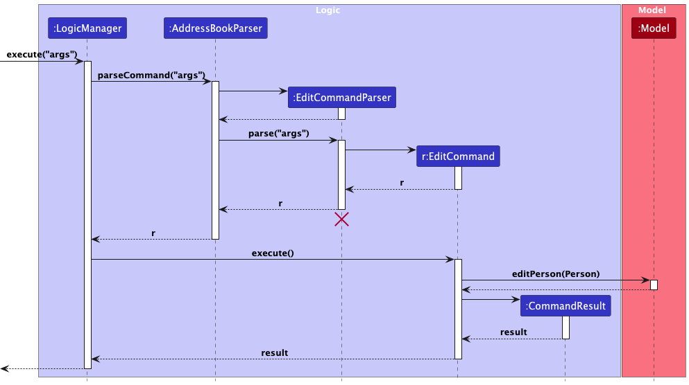

# **Table of Contents**
{:toc}
1. [Introduction to TalentSG](#talentsg)
2. [Purpose of this guide](#purpose-of-this-guide)
3. [How to use this guide](#how-to-use-this-guide)
4. [Acknowledgements](#acknowledgements)
5. [Setting up and getting started](#setting-up-getting-started)
6. [Design](#design)
    1. [Architecture](#architecture)
    2. [UI Component](#ui-component)
    3. [Logic Component](#logic-component)
    4. [Model Component](#model-component)
    5. [Storage Component](#storage-component)
7. [Implementation](#implementation)
    1. [Add Person Feature](#add-person-feature)
    2. [Delete Person Feature](#delete-person-feature)
    3. [Edit Person Feature](#edit-person-feature)
    4. [List Feature](#list-feature)
    5. [Find Person Feature](#find-person-feature)
    6. [Filter Person Featuer](#filter-person-feature)
    7. [View Person Feature](#view-person-feature)
    8. [Summary Feature](#summary-feature)
    9. [Help Feature](#help-feature)
8. [Proposed](#proposed)
    1. [Reminder Feature](#reminder-feature)
    2. [Multidelete Feature](#multidelete-feature)
9. [Documentation, logging, testing, configuration, dev-ops](#documentation-logging-testing-configuration-dev-ops)
10. [Appendix: Requirements](#appendix-requirements)
    1. [Product Scope](#product-scope)
    2. [User Stories](#user-stories)
    3. [Use Cases](#use-cases)
    4. [Non-functional requirements](#non-functional-requirements)
    5. [Glossary](#glossary)
11. [Appendix: Instructions for manual testing](#appendix-instructions-for-manual-testing)
    1. [Launch and Shut Down](#launch-and-shutdown)
    2. [Saving Data](#saving-data)
12. [Planned Enhancements](#planned-enhancements)
13. [Effort](#effort)
---

## **TalentSG**

TalentSG is an easy-to-use recruitment management desktop application designed for HR professionals and recruiters working
in mid-sized companies to streamline and speed up the hiring process. With a combination of a Command Line Interface
(CLI) and Graphical User Interface (GUI), our app provides a user-friendly and efficient way manage candidate and
employee information in fast-paced environments.

---

## **Purpose of this guide**

The purpose of this guide is to give you an overarching insight into developing and maintaining TalentSG.

If you are a developer, this guide will give you an overview of the high-level architecture and design of TalentSG.
It also delves into the implementation details and design considerations of TalentSG's features, allowing you to
become well-versed in the functionality and structure the of the application.

To learn more about TalentSG's user experience considerations, take a look at the [requirements](#appendix-requirements)
section where we cover the product scope, user stories, as well as use cases.

If you are lost, please refer to the [set-up](#setting-up-getting-started) section of the guide.

---

## How to use this guide

Here are some notations used in this guide.

### Format

- `Command` is used to label commands and components.
- {Placeholder} are used to label placeholders.
- [Optional], square brackets are used to notate optional fields.
- :information_source: **Note** is used to provide additional information that you should know.

--------------------------------------------------------------------------------------------------------------------

## **Acknowledgements**

* TalentSG is based on the existing AddressBook3 (AB3) project created by the [SE-EDU Initiative](https://se-education.org).
* Libraries used:
  * [JavaFX](https://se-education.org)
  * [JUnit5](https://se-education.org)

--------------------------------------------------------------------------------------------------------------------

## **Setting up, getting started**

Refer to the guide [_Setting up and getting started_](SettingUp.md).

--------------------------------------------------------------------------------------------------------------------

## **Design**

This section gives an overview of the different components of TalentSG and how they interact with one another.

:bulb: **Tip:** The `.puml` files used to create diagrams in this document `docs/diagrams` folder. Refer to the [_PlantUML Tutorial_ at se-edu/guides](https://se-education.org/guides/tutorials/plantUml.html) to learn how to create and edit diagrams.

### Architecture

The ***Architecture Diagram*** given below explains the high-level design of TalentSG and how the components work
together.

**Main components of the architecture**

**`Main`** consists of two classes: [`Main`](https://github.com/se-edu/addressbook-level3/tree/master/src/main/java/seedu/address/Main.java) and [`MainApp`](https://github.com/se-edu/addressbook-level3/tree/master/src/main/java/seedu/address/MainApp.java)). It is in charge of the app launch and shut down.
* At app launch: it initializes the other components in the correct sequence, and connects them up with each other.
* At shut down: it shuts down the other components and invokes cleanup methods where necessary.

The bulk of the app's work is done by the following four components:

* [**`UI`**](#ui-component): The UI of the App.
* [**`Logic`**](#logic-component): The command executor.
* [**`Model`**](#model-component): Holds the data of the App in memory.
* [**`Storage`**](#storage-component): Reads data from, and writes data to, the hard disk.

[**`Commons`**](#common-classes) represents a collection of classes used by multiple other components.

**How the architecture components interact with each other**

The *Sequence Diagram* below shows how the components interact with each other for the scenario where the user issues the command `delete 1`.

Each of the four main components (also shown in the diagram above),

* defines its *API* in an `interface` with the same name as the Component.
* implements its functionality using a concrete `{Component Name}Manager` class (which follows the corresponding API `interface` mentioned in the previous point.

For example, the `Logic` component defines its API in the `Logic.java` interface and implements its functionality using the `LogicManager.java` class which follows the `Logic` interface. Other components interact with a given component through its interface rather than the concrete class (reason: to prevent outside component's being coupled to the implementation of a component), as illustrated in the (partial) class diagram below.

The sections below give more details of each component.

### UI component

This component is responsible for displaying the graphical elements of TalentSG's GUI to the user.

The **API** of this component is specified in [`Ui.java`](https://github.com/se-edu/addressbook-level3/tree/master/src/main/java/seedu/address/ui/Ui.java)

The UI consists of a `MainWindow` that is made up of the following parts:

- `Help Window`
- `OverviewPanel`
  - `OverviewListCard`
- `ReportBugWindow`
- `ResultDisplay`
- `PersonListPanel`
  - `PersonCard`
- `CommandBox`
- `StatusBarFooter` 

All these, including the `MainWindow`, inherit from the abstract `UiPart` class which captures the commonalities between classes that represent parts of the visible GUI.

The `UI` component uses the JavaFx UI framework. The layout of these UI parts are defined in matching `.fxml` files that are in the `src/main/resources/view` folder. For example, the layout of the [`MainWindow`](https://github.com/se-edu/addressbook-level3/tree/master/src/main/java/seedu/address/ui/MainWindow.java) is specified in [`MainWindow.fxml`](https://github.com/se-edu/addressbook-level3/tree/master/src/main/resources/view/MainWindow.fxml)

The `UI` component,

* executes user commands using the `Logic` component.
* listens for changes to `Model` data so that the UI can be updated with the modified data.
* keeps a reference to the `Logic` component, because the `UI` relies on the `Logic` to execute commands.
* depends on some classes in the `Model` component, as it displays `Person` object residing in the `Model`.

### Logic component

This component is responsible for processing and executing user commands

**API** : [`Logic.java`](https://github.com/se-edu/addressbook-level3/tree/master/src/main/java/seedu/address/logic/Logic.java)

Here's a (partial) class diagram of the `Logic` component:

How the `Logic` component works:

1. When `Logic` is called upon to execute a command, it is passed to an `HRPlatformParser` object which in turn creates a parser that matches the command (e.g., `DeleteCommandParser`) and uses it to parse the command.
1. This results in a `Command` object (more precisely, an object of one of its subclasses e.g., `DeleteCommand`) which is executed by the `LogicManager`.
1. The command can communicate with the `Model` when it is executed (e.g. to delete a person). 
   Note that although this is shown as a single step in the diagram above (for simplicity), in the code it can take several interactions (between the command object and the `Model`) to achieve.
1. The result of the command execution is encapsulated as a `CommandResult` object which is returned back from `Logic`.

The sequence diagram below illustrates the interactions within the `Logic` component, taking `execute("delete 1")` API call as an example.

:information_source: **Note:** The lifeline for `DeleteCommandParser` should end at the destroy marker (X) but due to a limitation of PlantUML, the lifeline continues till the end of diagram.

Here are the other classes in `Logic` (omitted from the class diagram above) that are used for parsing a user command:

How the parsing works:
* When called upon to parse a user command, the `HRPlatformParser` class creates an `XYZCommandParser` (`XYZ` is a placeholder for the specific command name e.g., `AddCommandParser`) which uses the other classes shown above to parse the user command and create a `XYZCommand` object (e.g., `AddCommand`) which the `AddressBookParser` returns back as a `Command` object.
* All `XYZCommandParser` classes (e.g., `AddCommandParser`, `DeleteCommandParser`, ...) inherit from the `Parser` interface so that they can be treated similarly where possible e.g, during testing.

### Model component

This component is responsible for storing and managing TalentSG’s data

**API** : [`Model.java`](https://github.com/se-edu/addressbook-level3/tree/master/src/main/java/seedu/address/model/Model.java)

The `Model` component,

* stores the address book data i.e., all `Person` objects (which are contained in a `UniquePersonList` object).
* stores the currently 'selected' `Person` objects (e.g., results of a search query) as a separate _filtered_ list which is exposed to outsiders as an unmodifiable `ObservableList<Person>` that can be 'observed' e.g. the UI can be bound to this list so that the UI automatically updates when the data in the list change.
* stores a `UserPref` object that represents the user’s preferences. This is exposed to the outside as a `ReadOnlyUserPref` objects.
* does not depend on any of the other three components (as the `Model` represents data entities of the domain, they should make sense on their own without depending on other components)

:information_source: **Note:** An alternative (arguably, a more OOP) model is given below. It has a `Tag` list in the `HRPlatform`, which `Person` references. This allows `HRPlatform` to only require one `Tag` object per unique tag, instead of each `Person` needing their own `Tag` objects. 

### Storage component

This component is responsible for saving and retrieving TalentSG's data

**API** : [`Storage.java`](https://github.com/se-edu/addressbook-level3/tree/master/src/main/java/seedu/address/storage/Storage.java)

The `Storage` component,
* can save both address book data and user preference data in JSON format, and read them back into corresponding objects.
* inherits from both `HRPlatformStorage` and `UserPrefStorage`, which means it can be treated as either one (if only the functionality of only one is needed).
* depends on some classes in the `Model` component (because the `Storage` component's job is to save/retrieve objects that belong to the `Model`)

### Common classes

Classes used by multiple components are in the `seedu.address.commons` package.

--------------------------------------------------------------------------------------------------------------------

## **Implementation**

This section describes some noteworthy details on how certain features are implemented.

### Add Person Feature

#### **Command Feature**

`add n/NAME p/PHONE NUMBER e/EMAIL ADDRESS a/ADDRESS s/SKILLS st/STATUS ex/EXPERIENCE dr/DESIRED ROLE note/[NOTE] t/[TAG]`,
where note and tag are optional fields

#### **Command Feature Purpose**

The `add` command allows users to add a `Person` to the `HRPlatform`.

#### Key Components
- `AddCommand`: Executes the addition operation based on the user's input.
- `AddCommandParser`: Parses user input to create an `AddCommand` object.
- `LogicManager`: Invokes the `AddCommand` to execute the addition operation.
- `ModelManager`: Implements the `Model` interface and contains the internal list of persons.
- `Person`: Represents a person in TalentSG, encapsulating their personal information.
- `HRPlatformParser`: Creates an `AddCommand` object based on the user input.

### **Sequence of action**

To help you understand how the `add` command works, here is a list of steps illustrating what occurs when [`LogicManager#execute()` is invoked](#logic-component):

We will be using the user input `add n/John Doe p/98765432 e/johnd@example.com a/123 Main St s/Java,Python st/Active note/Great candidate ex/5 years in HR dr/Software Engineer` as an example.

1. The user inputs the command `add n/John Doe p/98765432 e/johnd@example.com a/123 Main St s/Java,Python st/Active note/Great candidate ex/5 years in HR dr/Software Engineer`, intending to add a person with the specified details.
2. The `AddCommandParser` interprets the input.
3. An `AddCommand` object is created.
4. The `LogicManager` invokes the execute method of AddCommand.
5. The execute method of `AddCommand` invokes the `addPerson` method in `Model` property to create new contact with the new `Person` object.
6. The execute method of `AddCommand` returns a `CommandResult` object which stores the data regarding the completion of the `AddCommand`.
7. The UI reflects this new list with added `Person`.

:information_source: **Note**:

- For step 2, if the user does not have any arguments, the `AddCommand` object will NOT be created!

#### `AddCommand` Implementation Sequence Diagram
The sequence diagram below illustrates the above process of adding a person into TalentSG.

---

### Delete Person Feature

#### **Command Feature**

`delete INDEX`

#### **Command Feature Purpose**

The `delete` command allows users to delete a `Person` from the `HRPlatform`.

#### Key Components
- `DeleteCommand`: Executes the deletion operation based on the user's input.
- `AddCommandParser`: Parses user input to create a `DeleteCommand` object.
- `LogicManager`: Invokes the `DeleteCommand` to execute the deletion operation.
- `ModelManager`: Implements the `Model` interface and contains the internal list of persons.
- `Person`: Represents a person in TalentSG, encapsulating their personal information.
- `AddressBookParser`: Creates an `DeleteCommand` object based on the user input.

### **Sequence of action**

To help you understand how the `delete` command works, here is a list of steps illustrating what occurs when [`LogicManager#execute()` is invoked](#logic-component):

We will be using the user input `delete 1` as an example.

1. The user inputs the command `delete 2`, intending to delete a person with index 2 in the contact list.
2. The `DeleteCommandParser` interprets the input.
3. A `DeleteCommand` object is created.
4. The `LogicManager` invokes the execute method of DeleteCommand.
5. The execute method of `DeleteCommand` invokes the `deletePerson` method in `Model` property to delete the contact of the `Person` object.
6. The execute method of `DeleteCommand` returns a `CommandResult` object which stores the data regarding the completion of the `DeleteCommand`.
7. The UI reflects this new list with deleted `Person`.

:information_source: **Note**:

- At step 2, if input is detected as invalid, an error will be shown on the screen and the sequence of action is terminated.

#### `Delete Command` Implementation Sequence Diagram
The sequence diagram below illustrates the above process of deleting a person from TalentSG.

---

### Edit Person Feature

#### **Command Feature**

`edit INDEX n/[NAME] p/[PHONE NUMBER] e/[EMAIL ADDRESS] a/[ADDRESS] s/[SKILLS] st/[STATUS] ex/[EXPERIENCE] dr/[DESIRED ROLE] note/[NOTE] t/[TAG]`
where all the fields are optional.

#### **Command Feature Purpose**

The `edit` command allows users to edit a `Person` in the `HRPlatform`.

#### Key Components
- `EditCommand`: Executes the edit operation based on the user's input.
- `EditCommandParser`: Parses user input to create an `EditCommand` object.
- `LogicManager`: Invokes the `EditCommand` to execute the edit operation.
- `ModelManager`: Implements the `Model` interface and contains the internal list of persons.
- `Person`: Represents a person in TalentSG, encapsulating their personal information.
- `AddressBookParser`: Creates an `EditCommand` object based on the user input.

### **Sequence of action**

To help you understand how the `delete` command works, here is a list of steps illustrating what occurs when [`LogicManager#execute()` is invoked](#logic-component):

We will be using the user input `edit 1 n/John Doe p/98765432 e/johnd@example.com a/123 Main St s/Java,Python st/Active note/Great candidate ex/5 years in HR dr/Software Engineer` as an example, whereby the original `Expense` object has a `EXPENSE_NAME` of `Milk`.

1. The user executes the command `edit 1 n/John Doe p/98765432 e/johnd@example.com a/123 Main St s/Java,Python st/Active note/Great candidate ex/5 years in HR dr/Software Engineer`, intending to edit the details of the person at index 1.
2. The `EditCommandParser` interprets the input.
3. An `EditCommand` object is created.
4. The `LogicManager` invokes the execute method of `EditCommand`.
5. The execute method of `EditCommand` invokes the `setPerson` method in the `Model` to update the details of the existing `Person` object with the new values.
6. The execute method of `EditCommand` returns a `CommandResult` object which stores the data regarding the completion of the `EditCommand`.
7. The UI reflects this updated list with the edited `Person`.

:information_source: **Note**:

- At step 2, if the input is detected as invalid (either index is invalid or no arguments provided other than index), a matching error will be shown on the screen and the sequence of action is terminated.
- At step 3, if the user provides a category to edit to, and it is found that there is no such category in FastTrack, an error will be shown and the sequence of action is terminated.

#### `EditCommand` Implementation Sequence Diagram
The sequence diagram below illustrates the above process of editing a person's details in TalentSG.

---

### List Feature

#### **Command Feature**

`list`

#### **Command Feature Purpose**

The `list` command allows users to view all people in the `HRPlatform`.

#### Key Components
- **`ListCommand`**: Executes the listing operation to show all persons in the address book.
- **`HRPlatformParser`**: Parses user input to create a `ListCommand` object.
- **`LogicManager`**: Invokes the `ListCommand` to execute the list operation.
- **`ModelManager`**: Implements the `Model` interface and contains the internal list of persons.
- **`CommandResult`**: Encapsulates the result of the command execution, including any feedback to the user.

### **Sequence of action**

To help you understand how the `list` command works, here is a list of steps illustrating what occurs when [`LogicManager#execute()` is invoked](#logic-component):

We will be using the user input `list` as an example.

1. The user executes the command `list`, intending to list all persons in the address book.
2. The `AddressBookParser` interprets the input and creates a `ListCommand` object.
3. The `LogicManager` invokes the execute method of `ListCommand`.
4. The execute method of `ListCommand` calls `updateFilteredPersonList` in the `Model` to apply a filter to show all persons.
5. The execute method of `ListCommand` returns a `CommandResult` object, indicating the command was successful with the message "Listed all persons".
6. The UI reflects the updated list of persons.

:information_source: **Note**:

- At step 2, if an invalid input is detected after `list` (e.g. `list xxxxxx`), an error will be shown and the sequence of action is terminated.

#### `ListCommand` Implementation Sequence Diagram
The sequence diagram below illustrates the above process of executing the `list` command in TalentSG, which lists all persons in the address book.

---

### Find Person Feature ###

#### **Command Feature**

`find KEYWORD`

#### **Command Feature Purpose**

The `find` command allows users to find specific people in the `HRPlatform` based on a keyword.

#### Key Components
- `FindCommand`: Executes the find operation based on the user's input.
- `FindCommandParser`: Parses user input to create an `FindCommand` object.
- `LogicManager`: Invokes the `FindCommand` to execute the find operation.
- `ModelManager`: Implements the `Model` interface and contains the internal list of persons.
- `Predicate`: Represents the keyword for finding persons whose name contains any of the argument keyword in TalentSG.
- `AddressBookParser`: Creates an `FindCommand` object based on the user input.

### **Sequence of action**

To help you understand how the `find` command works, here is a list of steps illustrating what occurs when [`LogicManager#execute()` is invoked](#logic-component):

We will be using the user input `find John` as an example.

1. The user executes the command `find john`, intending to find all persons whose name contains the keyword.
2. The `FindCommandParser` interprets the input.
3. An `FindCommand` object is created.
4. The `LogicManager` invokes the execute method of FindCommand.
5. The execute method of `FindCommand` invokes the `updateFilteredPersonList` method in `Model` property to update the filter of the filtered person list.
6. The execute method of `FindCommand` returns a `CommandResult` object which stores the data regarding the completion of the `FindCommand`.
7. The UI reflects this updated filtered `Person` list.

:information_source: **Note**:

- At step 2, if an invalid input is detected after `list` (e.g. `list xxxxxx`), an error will be shown and the sequence of action is terminated.

#### `FindCommand` Implementation Sequence Diagram
The sequence diagram below illustrates the process of finding all persons based on keyword in TalentSG.

---

### Filter Person Feature ###

#### **Command Feature**

`filter STATUS`

#### **Command Feature Purpose**

The `filter` command allows users to filter specific people in the `HRPlatform` based on their application status.

#### Key Components
- `FilterCommand`: Executes the filter operation based on the user's input.
- `FilterCommandParser`: Parses user input to create an `FilterCommand` object.
- `LogicManager`: Invokes the `FilterCommand` to execute the filter operation.
- `ModelManager`: Implements the `Model` interface and contains the internal list of persons.
- `Predicate`: Represents the status for finding persons whose status matches in TalentSG.
- `HRPlatformParser`: Creates an `FilterCommand` object based on the user input.

### **Sequence of action**

To help you understand how the `filter` command works, here is a list of steps illustrating what occurs when [`LogicManager#execute()` is invoked](#logic-component):

We will be using the user input `filter Interviewed` as an example.

1. The user executes the command `filter Interviewed`, intending to find all persons whose name contains the keyword.
2. The `FilterCommandParser` interprets the input.
3. An `FilterCommand` object is created.
4. The `LogicManager` invokes the execute method of FindCommand.
5. The execute method of `FilterCommand` invokes the `updateFilteredPersonList` method in `Model` property to update the filter of the filtered person list.
6. The execute method of `FilterCommand` returns a `CommandResult` object which stores the data regarding the completion of the `FindCommand`.
7. The UI reflects this updated filtered `Person` list.

:information_source: **Note**:

- At step 2, if an invalid status is detected after `filter` (e.g. `filter Helloo`), an error will be shown and the sequence of action is terminated.

#### `FindCommand` Implementation Sequence Diagram
The sequence diagram below illustrates the process of finding all persons based on keyword in TalentSG.

---

### View Person Feature

#### **Command Feature**

`view INDEX`

#### **Command Feature Purpose**

The `view` command allows users to view a `Person` in the `HRPlatform`.

#### Key Components
- `ViewCommand`: Executes the viewing operation based on the user's input.
- `ViewCommandParser`: Parses user input to create a `ViewCommand` object.
- `PersonDataReceiver`: Updates the overview panel with the correct `Person` data
- `Person`: Represents a person in TalentSG, encapsulating their personal information.
- `HRPlatformParser`: Creates an `DeleteCommand` object based on the user input.

### **Sequence of action**

To help you understand how the `view` command works, here is a list of steps illustrating what occurs when [`LogicManager#execute()` is invoked](#logic-component):

We will be using the user input `delete 2` as an example.

1. The user inputs the command `view 2`, intending to view a person with index 2 in the contact list.
2. The `ViewCommandParser` interprets the input.
3. A `ViewCommand` object is created.
4. The execute method of `ViewCommand` causes the `MainWindow` to invoke the `receivePersonData` method in `PersonDataReceiver` property to view the contact of the `Person` object.
5. The execute method of `ViewCommand` returns a `CommandResult` object which stores the data regarding the completion of the `ViewCommand`.
6. The UI reflects the `OverviewPanel` with the selected `Person`.

:information_source: **Note**:

- At step 2, if input is detected as invalid, an error will be shown on the screen and the sequence of action is terminated.

#### `View Command` Implementation Sequence Diagram
The sequence diagram below illustrates the above process of deleting a person from TalentSG.

---

### Summary Feature

#### **Command Feature**

`summary`

#### **Command Feature Purpose**

The `summary` command provides a breakdown of the application statuses of all the people in the `HRPlatform`.

#### Key Components
- **`SummaryCommand`**: Executes the summarization operation to display the counts for each application status in the `HRPlatform`.
- **`HRPlatformParser`**: Parses user input to create a `SummaryCommand` object.
- **`LogicManager`**: Invokes the `SummaryCommand` to execute the summary operation.
- **`ModelManager`**: Implements the `Model` interface and contains the internal list of persons.
- **`CommandResult`**: Encapsulates the result of the command execution, including any feedback to the user.

### **Sequence of action**

To help you understand how the `summary` command works, here is a list of steps illustrating what occurs when [`LogicManager#execute()` is invoked](#logic-component):

We will be using the user input `summary` as an example:

1. The user executes the command `summary`, intending to view a breakdown of all application statuses for candidates in the `HRPlatform`
2. The `HRPlatformParser` interprets the input and creates a `SummaryCommand` object.
3. The `LogicManager` invokes the execute method of `SummaryCommand`.
4. The execute method of `SummaryCommand` initializes a map of all possible statuses with counts set to 0.
5. `SummaryCommand` collects the list of all candidates in the address book via `Model` and computes the count for each application status using a grouping and counting operation.
6. The execute method of `SummaryCommand` formats these counts into a summary message, displaying each status count and the total number of applicants.
7. The execute method of `SummaryCommand` returns a `CommandResult` object, encapsulating the summary message for display to the user.
8. The UI then reflects this summarized breakdown of application statuses.

:information_source: **Note**:

- At step 2, if an invalid input is detected after `summary` (e.g. `summary abc`), an error will be shown and the sequence of action is terminated.

#### `SummaryCommand` Implementation Sequence Diagram
The sequence diagram below illustrates the above process of executing the `summary` command in TalentSG, which lists all persons in the address book.

---

### \[Proposed\] Undo/redo feature

#### Proposed Implementation

The proposed undo/redo mechanism is facilitated by `VersionedAddressBook`. It extends `AddressBook` with an undo/redo history, stored internally as an `addressBookStateList` and `currentStatePointer`. Additionally, it implements the following operations:

* `VersionedAddressBook#commit()` — Saves the current address book state in its history.
* `VersionedAddressBook#undo()` — Restores the previous address book state from its history.
* `VersionedAddressBook#redo()` — Restores a previously undone address book state from its history.

These operations are exposed in the `Model` interface as `Model#commitAddressBook()`, `Model#undoAddressBook()` and `Model#redoAddressBook()` respectively.

Given below is an example usage scenario and how the undo/redo mechanism behaves at each step.

Step 1. The user launches the application for the first time. The `VersionedAddressBook` will be initialized with the initial address book state, and the `currentStatePointer` pointing to that single address book state.

Step 2. The user executes `delete 5` command to delete the 5th person in the address book. The `delete` command calls `Model#commitAddressBook()`, causing the modified state of the address book after the `delete 5` command executes to be saved in the `addressBookStateList`, and the `currentStatePointer` is shifted to the newly inserted address book state.

Step 3. The user executes `add n/David …​` to add a new person. The `add` command also calls `Model#commitAddressBook()`, causing another modified address book state to be saved into the `addressBookStateList`.

:information_source: **Note:** If a command fails its execution, it will not call `Model#commitAddressBook()`, so the address book state will not be saved into the `addressBookStateList`.

Step 4. The user now decides that adding the person was a mistake, and decides to undo that action by executing the `undo` command. The `undo` command will call `Model#undoAddressBook()`, which will shift the `currentStatePointer` once to the left, pointing it to the previous address book state, and restores the address book to that state.

:information_source: **Note:** If the `currentStatePointer` is at index 0, pointing to the initial AddressBook state, then there are no previous AddressBook states to restore. The `undo` command uses `Model#canUndoAddressBook()` to check if this is the case. If so, it will return an error to the user rather
than attempting to perform the undo.

The following sequence diagram shows how an undo operation goes through the `Logic` component:

:information_source: **Note:** The lifeline for `UndoCommand` should end at the destroy marker (X) but due to a limitation of PlantUML, the lifeline reaches the end of diagram.

Similarly, how an undo operation goes through the `Model` component is shown below:

The `redo` command does the opposite — it calls `Model#redoAddressBook()`, which shifts the `currentStatePointer` once to the right, pointing to the previously undone state, and restores the address book to that state.

:information_source: **Note:** If the `currentStatePointer` is at index `addressBookStateList.size() - 1`, pointing to the latest address book state, then there are no undone AddressBook states to restore. The `redo` command uses `Model#canRedoAddressBook()` to check if this is the case. If so, it will return an error to the user rather than attempting to perform the redo.

Step 5. The user then decides to execute the command `list`. Commands that do not modify the address book, such as `list`, will usually not call `Model#commitAddressBook()`, `Model#undoAddressBook()` or `Model#redoAddressBook()`. Thus, the `addressBookStateList` remains unchanged.

Step 6. The user executes `clear`, which calls `Model#commitAddressBook()`. Since the `currentStatePointer` is not pointing at the end of the `addressBookStateList`, all address book states after the `currentStatePointer` will be purged. Reason: It no longer makes sense to redo the `add n/David …​` command. This is the behavior that most modern desktop applications follow.

The following activity diagram summarizes what happens when a user executes a new command:

#### Design considerations:

**Aspect: How undo & redo executes:**

* **Alternative 1 (current choice):** Saves the entire address book.
  * Pros: Easy to implement.
  * Cons: May have performance issues in terms of memory usage.

* **Alternative 2:** Individual command knows how to undo/redo by
  itself.
  * Pros: Will use less memory (e.g. for `delete`, just save the person being deleted).
  * Cons: We must ensure that the implementation of each individual command are correct.

_{more aspects and alternatives to be added}_

### \[Proposed\] Data archiving

_{Explain here how the data archiving feature will be implemented}_

--------------------------------------------------------------------------------------------------------------------

## **Documentation, logging, testing, configuration, dev-ops**

* [Documentation guide](Documentation.md)
* [Testing guide](Testing.md)
* [Logging guide](Logging.md)
* [Configuration guide](Configuration.md)
* [DevOps guide](DevOps.md)

--------------------------------------------------------------------------------------------------------------------

## **Appendix: Requirements**

### Product scope

**Target user profile**:

Our primary target users are Recruiters and HR professionals who are responsible for managing job candidates and employee information.

**Value proposition**: simplify and enhance the recruitment process for HR professionals and recruiters.

### User stories

Priorities: High (must have) - `* * *`, Medium (nice to have) - `* *`, Low (unlikely to have) - `*`

| Priority | As a …​          | I want to …​                                                      | So that I can…​                                                             |
| ------ | ---------------- | ----------------------------------------------------------------- | --------------------------------------------------------------------------- |
| `* * *` | recruiter         | add new candidate profiles                                        | keep track of all candidates applying for positions                         |
| `* * *` | recruiter         | edit candidate profiles                                           | update candidate information as new details become available                |
| `* * *` | recruiter         | delete candidate profiles                                         | remove candidates who are no longer considered for positions                |
| `* * *` | HR professional   | view a list of all candidates                                     | easily access any candidate’s details on demand                             |
| `* * *` | recruiter         | search for candidates by specific criteria (e.g., skills)         | quickly find suitable candidates for various roles                          |
| `* * *` | HR professional   | schedule and manage interviews                                    | organise the recruitment process efficiently                                |
| `* * *` | recruiter         | set reminders for interviews                                      | ensure no interview is missed                                               |
| `* *`  | recruiter         | track the status of a candidate through different recruitment stages | maintain an organised overview of the recruitment pipeline                  |
| `* *`  | HR professional   | import candidate data from external sources                       | streamline the process of adding new candidates                             |
| `* *`  | recruiter         | export data on candidates                                         | prepare reports or share data with colleagues                               |
| `* *`  | recruiter         | record notes during or after interviews                           | have detailed records and observations to refer back to                     |
| `* *`  | recruiter         | see a dashboard of recruitment activities                         | get a quick overview of all current recruitment efforts                     |
| `* *`  | HR professional   | manage and view employment details for hired candidates           | keep track of all employment-related information in one place               |
| `*`    | recruiter         | receive notifications about upcoming tasks                       | stay on top of all recruitment-related tasks without having to constantly check the app |
| `*`    | HR professional   | customise the fields in candidate profiles                        | tailor the application to fit the specific needs and focus areas of my organisation |
| `*`    | recruiter         | archive candidate profiles                                        | keep our current database up-to-date without losing past data               |
| `*`    | recruiter         | view analytics on recruitment efforts (e.g., time to hire)        | assess the effectiveness of current recruitment strategies                  |
| `*`    | HR professional   | undo/redo changes in the application                              | correct mistakes without needing to manually revert changes                 |
| `*`    | recruiter         | create and manage job postings                                    | advertise new job openings directly from the application                    |
| `*`    | recruiter         | receive automated suggestions for potential candidates            | speed up the process of candidate selection                                 |
| `*`    | recruiter         | categorise candidates into different job pools                    | organize candidates based on their skill sets and roles                     |
| `*`    | HR professional   | bulk upload candidate profiles via a CSV or Excel file            | quickly import a large number of candidate profiles                         |
| `*`    | recruiter         | assign tags/labels to candidates                                  | quickly identify candidates based on specific characteristics               |
| `*`    | HR professional   | generate candidate summary reports for hiring managers            | provide concise and relevant candidate data to stakeholders                 |
| `*`    | recruiter         | log communication history with candidates                         | track all interactions with candidates throughout the recruitment process   |
| `*`    | recruiter         | set priorities for candidates in the pipeline                     | focus on high-priority candidates first                                     |
| `*`    | recruiter         | track the reason for rejecting a candidate                        | maintain clear records of why candidates were not selected                  |
| `*`    | recruiter         | add links to candidates’ online profiles (e.g., LinkedIn, GitHub) | have quick access to additional candidate information                       |
| `*`    | HR professional   | integrate the app with job portals or LinkedIn                    | streamline candidate sourcing from multiple platforms                       |
| `*`    | recruiter         | send automated follow-up emails to candidates                     | save time by automating routine communication tasks                         |

### Use cases

#### Use Case 1: Add a New Candidate Profile
**Actor**: Recruiter

**Preconditions**: The system is running, and the recruiter is logged into the application.

**Main Success Scenario**:
1. Recruiter selects the "Add Candidate" option.
2. System prompts recruiter to input candidate details (name, phone, email, address, role).
3. Recruiter enters candidate details.
4. System confirms that the details are valid and adds the candidate profile.
5. System displays a success message: "Candidate profile added successfully."

**Extensions**:
- 3a. Recruiter inputs invalid phone number or email.
    - System shows an error message: "Invalid phone number or email. Please enter valid information."
- 4a. A duplicate candidate profile is detected.
    - System shows an error message: "Duplicate candidate detected. Profile not added."

#### Use Case 2: Schedule an Interview
**Actor**: Recruiter

**Preconditions**: Recruiter is logged in, and a candidate profile exists.

**Main Success Scenario**:
1. Recruiter selects the "Schedule Interview" option for a specific candidate.
2. System prompts recruiter to input the date and time for the interview.
3. Recruiter inputs valid date and time.
4. System saves the interview schedule for the candidate.
5. System displays a success message: "Interview scheduled for [Candidate Name] on [Date and Time]."

**Extensions**:
- a. Recruiter inputs invalid date or time.
    - System shows an error message: "Invalid date or time format. Please follow the format YYYY-MM-DD and HH:MM."
- b. The selected time slot is already booked for another interview.
    - System shows an error message: "Time slot is already booked. Please select a different time."

#### Use Case 3: Search for Candidates by Criteria
**Actor**: HR Professional

**Preconditions**: Candidate profiles exist in the system.

**Main Success Scenario**:
1. HR professional selects the "Search" option.
2. System prompts HR professional to input search criteria (e.g., candidate name, role, or skill).
3. HR professional enters search criteria (e.g., role: Software Engineer).
4. System retrieves and displays a list of candidates matching the criteria.
5. HR professional selects a candidate from the list to view detailed information.

**Extensions**:
- 3a. No candidates match the search criteria.
    - System displays a message: "No candidates found for the given criteria."

### Non-Functional Requirements

1. **Performance**:
- The system should be able to handle up to 100 simultaneous users without a significant decrease in performance.
- System response time for any operation should not exceed 1 second.

2. **Scalability**:
- The system should support the management of up to 10,000 candidate profiles without performance degradation.
- The system should be able to integrate with external recruitment systems (e.g., LinkedIn, job portals) to import candidate data.

3. **Usability**:
- The system should be intuitive for users with basic computer skills.
- The user interface should provide clear navigation, with minimal need for user training.

4. **Reliability**:
- The system should have a 99.9% uptime, ensuring availability for recruiters and HR professionals during business hours.
- Data should be backed up every 24 hours to prevent data loss.

5. **Security**:
- The system must comply with GDPR regulations and ensure that candidate data is securely stored and handled.
- All user data (including candidate information) should be encrypted both at rest and in transit.

6. **Portability**:
- The system should be compatible with Windows, macOS, and Linux operating systems.
- The system should be able to run on machines with at least 4GB of RAM and 2GHz processors.

7. **Accessibility**:
- The system should comply with WCAG 2.1 standards for web accessibility, ensuring that users with disabilities can use the system effectively.

### Glossary

1. **Recruiter**:
- A professional responsible for managing job applicants and their application process.

2. **HR Professional**:
- A Human Resources professional responsible for managing employee information and candidate data during the recruitment process.

3. **Candidate Profile**:
- A record containing all relevant details about a job applicant, including contact information, skills, experience, and interview notes.

4. **MVP (Minimum Viable Product)**:
- The minimum version of a product that meets the basic requirements to be usable by the target audience.

5. **Interview Schedule**:
- The process of setting a date and time for a job applicant to be interviewed by the recruiter or hiring manager.

6. **NFR (Non-functional Requirements)**:
- Requirements that specify the quality and performance characteristics of the system (e.g., performance, security, usability).

7. **CRUD**:
- Refers to the basic operations of Create, Read, Update, and Delete, typically applied to data management within an application.

8. **GDPR (General Data Protection Regulation)**:
- A European regulation on data protection and privacy for individuals within the EU, applicable to the handling of personal data.

--------------------------------------------------------------------------------------------------------------------

## **Appendix: Instructions for manual testing**

Given below are instructions to test the app manually.

:information_source: **Note:** These instructions only provide a starting point for testers to work on;
testers are expected to do more *exploratory* testing.

### Launch and shutdown

1. Initial launch

   1. Download the jar file and copy into an empty folder

   1. Double-click the jar file Expected: Shows the GUI with a set of sample contacts. The window size may not be optimum.

1. Saving window preferences

   1. Resize the window to an optimum size. Move the window to a different location. Close the window.

   1. Re-launch the app by double-clicking the jar file. 
       Expected: The most recent window size and location is retained.

1. _{ more test cases …​ }_

### Deleting a person

1. Deleting a person while all persons are being shown

   1. Prerequisites: List all persons using the `list` command. Multiple persons in the list.

   1. Test case: `delete 1` 
      Expected: First contact is deleted from the list. Details of the deleted contact shown in the status message. Timestamp in the status bar is updated.

   1. Test case: `delete 0` 
      Expected: No person is deleted. Error details shown in the status message. Status bar remains the same.

   1. Other incorrect delete commands to try: `delete`, `delete x`, `...` (where x is larger than the list size) 
      Expected: Similar to previous.

1. _{ more test cases …​ }_

### Saving data

1. Dealing with missing/corrupted data files

   1. _{explain how to simulate a missing/corrupted file, and the expected behavior}_

1. _{ more test cases …​ }_
