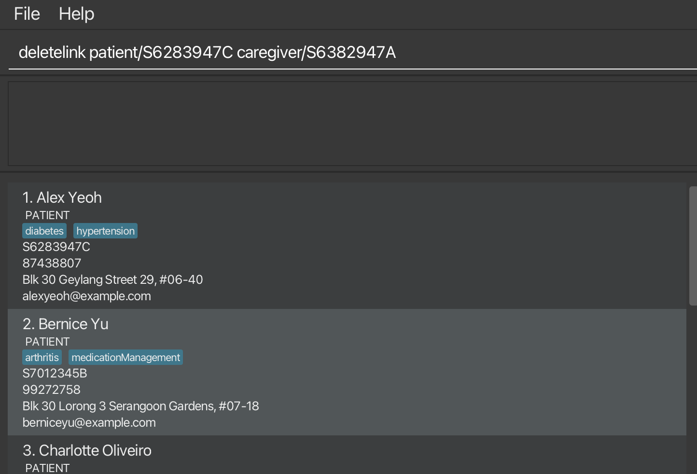
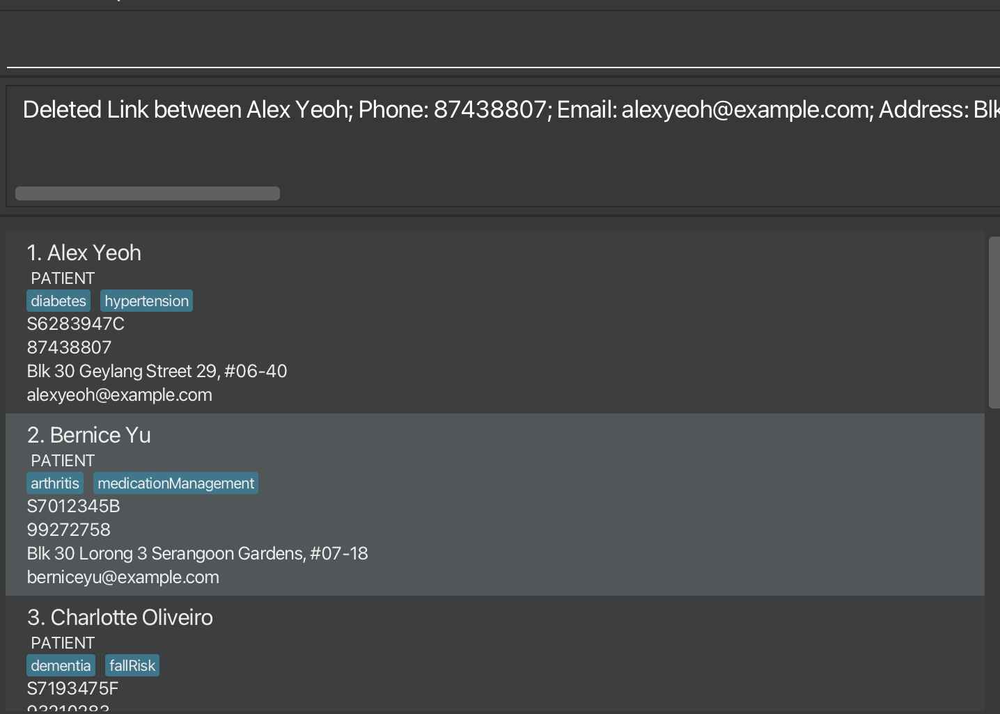
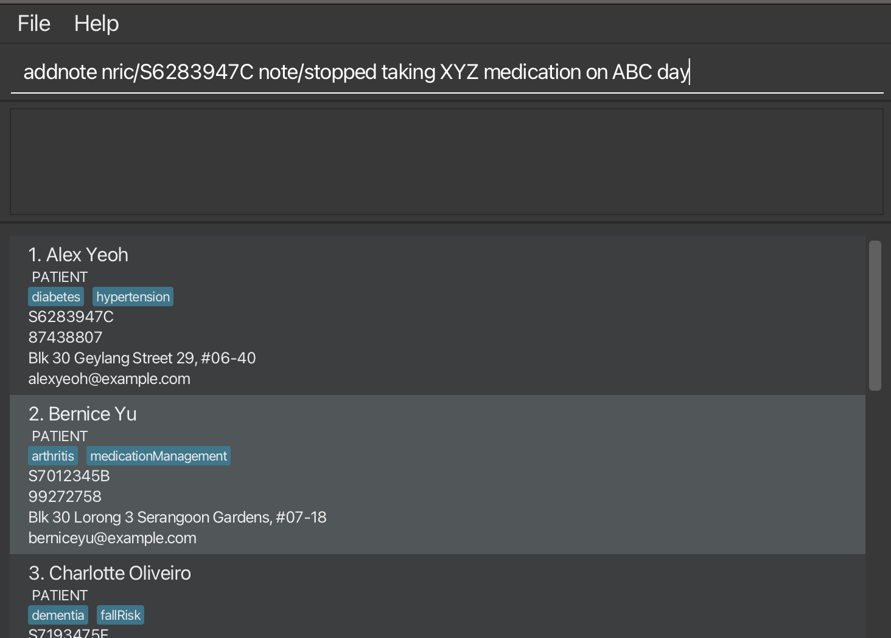
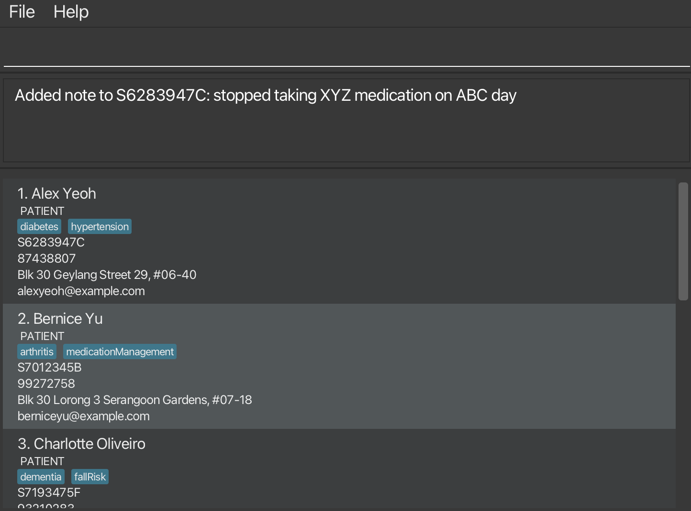
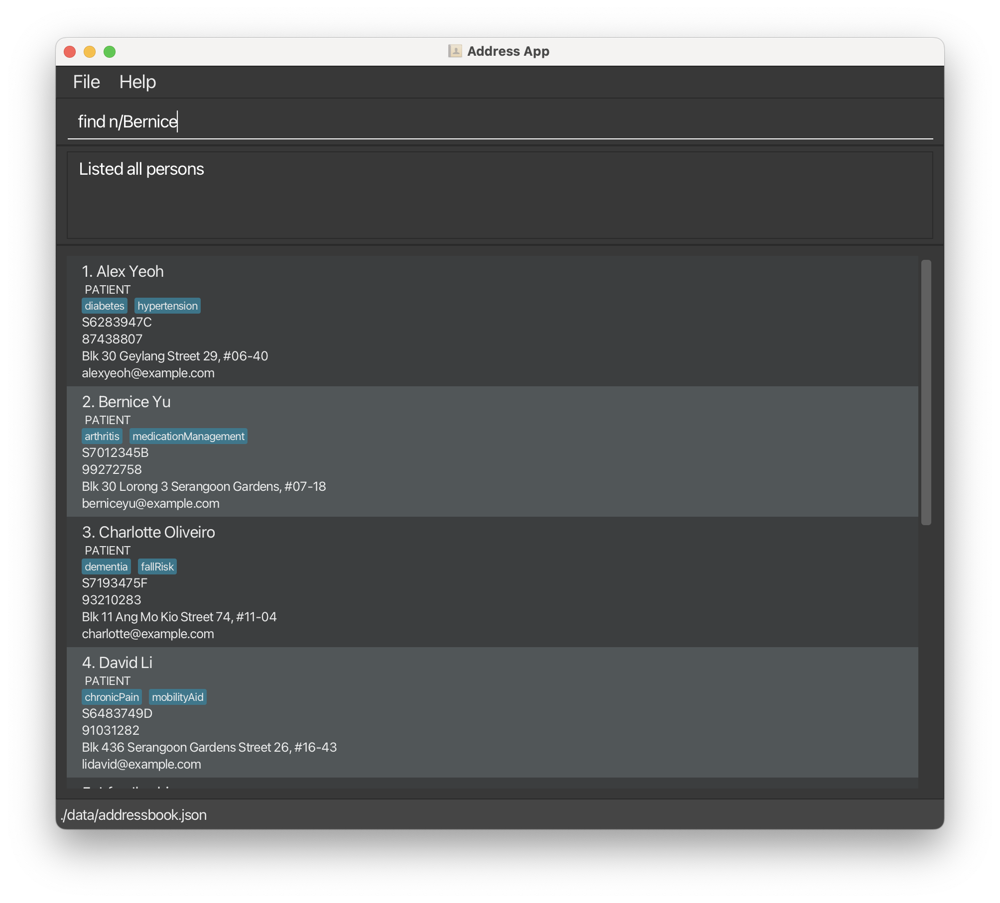
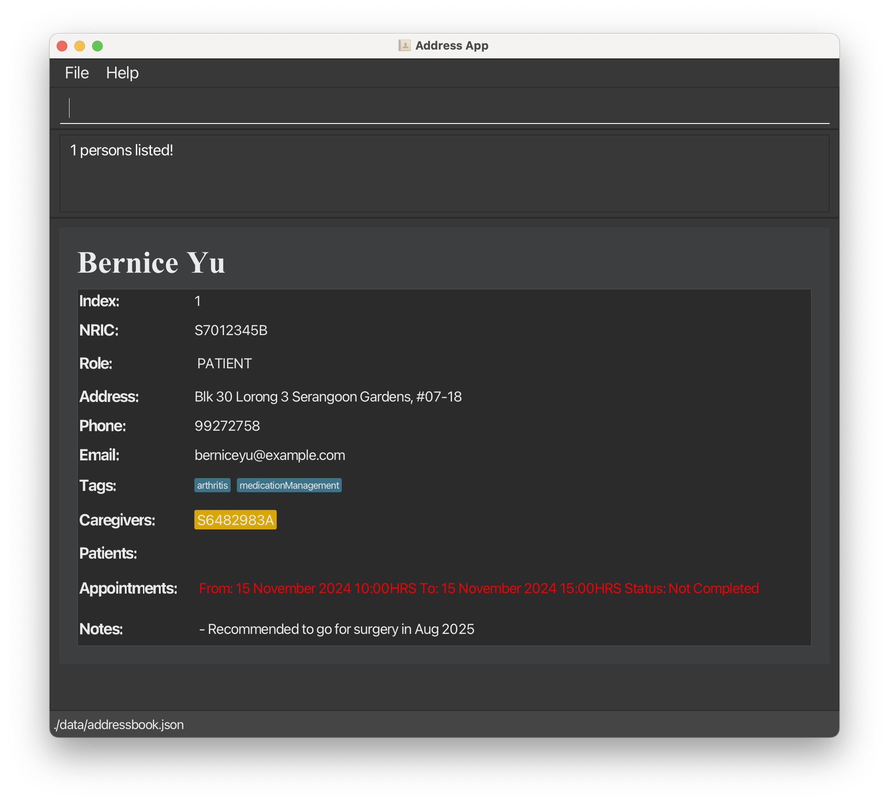
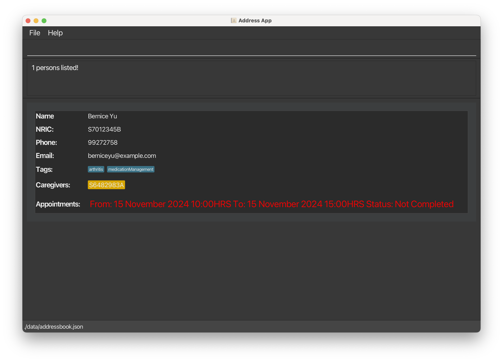
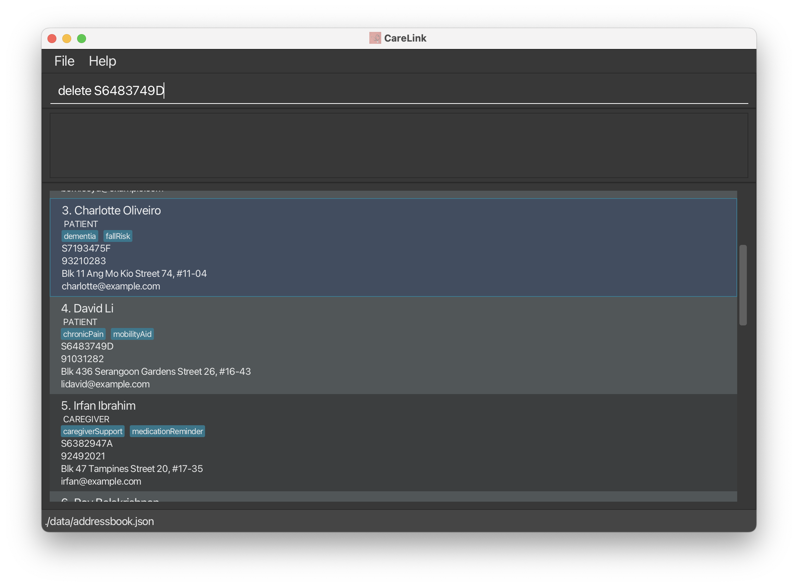
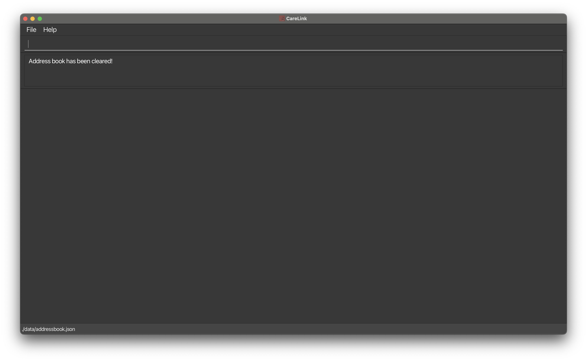
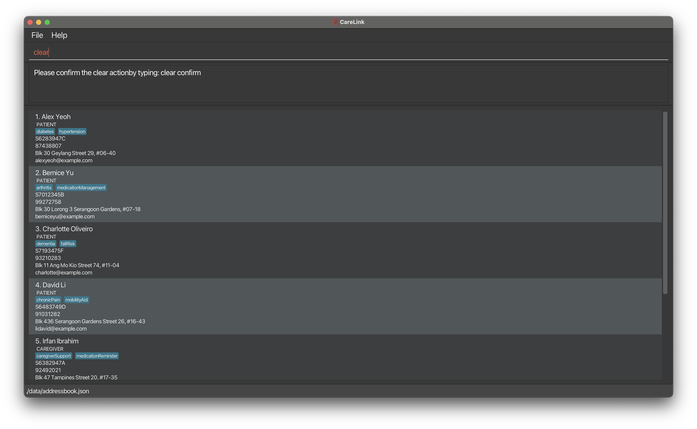

# CareLink User Guide
* Table of Contents
{:toc}


## Introduction

Welcome to CareLink, your comprehensive patient management solution. As a Command Line Interface (CLI) application with a Graphical User Interface (GUI), CareLink helps independent  geriatricians streamline patient care management, appointment scheduling, and caregiver coordination.


### What is CareLink?

CareLink simplifies healthcare management through four core capabilities:
* Efficient patient information tracking
* Seamless caregiver coordination
* Smart appointment scheduling
* Comprehensive medical note management

### Key Features

* **Patient Management**
  * Store and update patient records
  * Track medical histories
  * Search patient information
  * Manage patient-caregiver relationships

* **Appointment System**
  * Schedule and track appointments
  * Manage scheduling conflicts
  * Set appointment reminders
  * Monitor appointment status

* **Caregiver Coordination**
  * Link patients with caregivers
  * Maintain caregiver contact information
  * Track caregiver assignments
  * Enable efficient communication

* **Data Organization**
  * Secure data storage
  * Quick information retrieval
  * Automated backups
  * Advanced search capabilities


### Who is CareLink For?

CareLink is designed specifically for independent geriatricians who:
* Manage multiple elderly patients with chronic conditions
* Need to coordinate with caregivers
* Require efficient appointment scheduling
* Want to track patient histories and medical notes

### How This Guide Helps You

This user guide will walk you through:
1. Setting up CareLink
2. Managing patients and caregivers
3. Scheduling appointments
4. Recording medical notes
5. Using advanced features

For immediate setup, proceed to [Quick Start](#quick-start). For detailed feature information, visit the [Features](#features) section.

## Quick Start

1. Ensure you have Java `17` or above installed on your computer.

2. Download the latest CareLink `.jar` file from [here](https://github.com/AY2425S1-CS2103T-T13-4/tp/releases).

3. Copy the file to your desired CareLink **home folder**.
4. Open a command terminal, navigate to your home folder, and run:<br>
```
java -jar carelink.jar
```
The CareLink application window will appear with sample data:<br>

_Figure 1: CareLink main window with sample data_

5. Type commands in the command box and press Enter to execute them. Try these basic commands:

* View all records:<br>
  ```
  list
  ```

* Add a new record:<br>
  ```
  add n/John Lee p/91234567 e/johnlee@email.com a/123 Medical Drive nric/S9876543A role/patient
  ```


* View help:<br>
  ```
  help
  ```

* Exit CareLink:<br>
  ```
  exit
  ```

6. For detailed instructions on all commands, proceed to the [Features](#features) section.

> **Tip:** Type `help` at any time to view the command guide.

---

## Features

<div markdown="block" class="alert alert-info">

**:information_source: Notes about the command format:**<br>

- Words in `UPPER_CASE` are the parameters to be supplied by the user.<br>
  e.g. in `add n/NAME`, `NAME` is a parameter which can be used as `add n/John Doe`.

- Items in square brackets are optional.<br>
  e.g `n/NAME [t/TAG]` can be used as `n/John Doe t/friend` or as `n/John Doe`.

- Items with `…`​ after them can be used multiple times including zero times.<br> e.g. `[t/TAG]…​` means you can add: no tags (i.e. 0 times), one tag (`t/friend`), or multiple tags where each tag must have its own `t/` prefix (`t/friend t/family t/elderly`)


- Parameters can be in any order.<br>
  e.g. if the command specifies `n/NAME p/PHONE_NUMBER`, `p/PHONE_NUMBER n/NAME` is also acceptable.

- Extraneous parameters for commands that do not take in parameters (such as `help`, `list`, `exit` and `clear`) will be ignored.<br>
  e.g. if the command specifies `help 123`, it will be interpreted as `help`.

- If you are using a PDF version of this document, be careful when copying and pasting commands that span multiple lines as space characters surrounding line-breaks may be omitted when copied over to the application.
</div>

### Viewing help : `help`

Shows a message explaning how to access the help page.


Format: `help`

### Adding a person: `add`

Adds a person to the address book.

Format: `add n/NAME nric/NRIC p/PHONE_NUMBER e/EMAIL a/ADDRESS role/ROLE [t/TAG]…`

Field Constraints:
- `NAME`: Must start with an alphanumeric character, followed by alphanumeric characters and spaces
- `PHONE`: Must contain only numbers and be at least 3 digits long
- `EMAIL`: Must be of the format local-part@domain where:
  1. Local-part can contain alphanumeric characters and these special characters: + _ . -
  2. Local-part cannot start or end with special characters
  3. Domain must:
     - End with a domain label at least 2 characters long
     - Have domain labels that start and end with alphanumeric characters
     - Have domain labels with alphanumeric characters, separated only by hyphens
- `ADDRESS`: Must not start with a whitespace and cannot be blank
- `ROLE`: Must be either 'PATIENT' or 'CAREGIVER'
- `NRIC`: NRIC constraints are in NRIC constraints section

**The role must be either a patient or a caregiver or both**

<div markdown="span" class="alert alert-primary">:bulb: **Tip:**
A person can have any number of tags (including 0)
</div>

Examples:

- `add n/John Doe nric/S8484131E p/98765432 e/johnd@example.com a/311, Clementi Ave 2, #02-25 t/backPain t/diabetic role/patient`

An example for adding a patient to the address book is given below.


Once the command succeeds, the person will be added to the address book and the following message will be displayed.


Possible Errors:
- `This person already exists in the address book` - Displayed when trying to add a person with an NRIC that already exists
- `Roles should only be 'PATIENT' or 'CAREGIVER'` - When an invalid role is provided

- `Missing required field:` - Displayed when any required field is not provided (name, NRIC, phone, email, address, or role)

NRIC should adhere to the following format and constraints:
1. The NRIC must be 9 characters long.
2. The first character must be one of the following letters: 'S', 'T', 'F', or 'G'. (case-insensitive)
  - 'S' and 'T' are for Singapore Citizens and Permanent Residents.
  - 'F' and 'G' are for Foreigners.
3. The next 7 characters must be digits.
4. The last character must be an uppercase letter, which serves as a checksum to validate the NRIC.
5. The checksum is computed based on a specific algorithm using the 7 digits of the NRIC.


### Linking a patient and a caregiver: `link`

Links a patient to the caregiver in CareLink.

Format: `link patient/PATIENT_NRIC caregiver/CAREGIVER_NRIC`

Examples:

- `link patient/S6283947C caregiver/S6382947A`
- `link caregiver/S6382947A patient/S7193475F`

An example of using CareLink to link a patient and a caregiver is given below.


Once the command succeeds, the patient will be linked with the caregiver and the following message will be displayed.


Possible Errors:
- `This link already exists in CareLink` - When attempting to create a link that already exists
- `Cannot link same people` - When trying to link a person to themselves
- `Incorrect NRIC. Caregiver and Patient not found` - When both NRICs cannot be found in CareLink
- `Incorrect NRIC. Patient not found` - When the patient's NRIC cannot be found
- `Incorrect NRIC. Caregiver not found` - When the caregiver's NRIC cannot be found
- `Incorrect roles. The patient NRIC must correspond to a patient, and the caregiver NRIC must correspond to a caregiver.` - When the roles don't match the specified NRICs


### Deleting a link between patient and a caregiver: `deletelink`

Removes the link between patient and caregiver in CareLink.

Format: `deletelink patient/PATIENT_NRIC caregiver/CAREGIVER_NRIC`

Examples:

- `deletelink patient/S6283947C caregiver/S6382947A`
- `deletelink caregiver/S6382947A patient/S7193475F`

An example of using CareLink to delete a link between a patient and a caregiver is given below.


Once the command succeeds, the link will be removed and the following message will be displayed.


### Adding Notes to a Person: `addnote`

Adds notes to existing person in the CareLink app.

Format: `addnote nric/NRIC note/NOTES`

Examples:

- `addnote nric/S6283947C note/stopped taking XYZ medication on ABC day`
- `addnote nric/S7012345B note/is caregiver for patient XYZ only until ABC day`

<div class="alert alert-warning">
<i>:warning:</i> <b>Warning:</b> CareLink does not check for duplicate notes. Please verify existing notes before adding new ones to avoid redundant medical information.
</div>


<div markdown="span" class="alert alert-primary">:bulb: **Tip:**
To view all notes for a person, use the `find` command with their NRIC or name. Notes are shown only in the search results to keep the main display clean and focused.
</div>


An example of using CareLink to add notes to a person is given below.


Once the command succeeds, the notes will be added to the person and the following message will be displayed.


Possible Errors:
- `This link does not exist in CareLink` - When trying to delete a link that doesn't exist
- `Incorrect NRIC. Person not found` - When either the patient's or caregiver's NRIC cannot be found

### Listing all persons : `list`

Shows a list of all persons in Care Link App.

Format: `list`

### Editing a person : `edit`

Edits an existing person in the address book.

Format: `edit NRIC [n/NAME] [p/PHONE] [e/EMAIL] [a/ADDRESS] [t/TAG]…​`

- Edits the person with the specified `NRIC`. The `NRIC` must be a valid Singapore National Identification Card Number.
- At least one of the optional fields must be provided.
- Existing values will be updated to the input values.
- When editing tags, the existing tags of the person will be removed i.e adding of tags is not cumulative.
- You can remove all the person’s tags by typing `t/` without
  specifying any tags after it.

Examples:

- `edit S1234567D p/91234567 e/johndoe@example.com` Edits the phone number and email address of the person with `S1234567D` to be `91234567` and `johndoe@example.com` respectively.
- `edit S6483749D n/Betsy Crower t/` Edits the person with NRIC `S6483749D` to be `Betsy Crower` and clears all existing tags.

Possible Errors:
- `Incorrect NRIC. Person not found` - When the specified NRIC doesn't exist in CareLink
- `At least one field to edit must be provided.` - When no fields to edit are specified
- `This person already exists in the address book.` - When editing would result in a duplicate person

### Locating persons by name, NRIC, phone, email, role, or tags: `find`

Finds persons based on the specified criteria using the provided prefixes.

<div class="alert alert-warning">
<i>:warning:</i> <b>Warning:</b> All search parameters (NRIC, phone, email, role) must exactly match the stored data, except for name which allows partial matches. For example:
- NRIC 'S1234567D' will match 'S1234567D' only
- Phone '91234567' will match '91234567' only
- Name 'John' will match 'John Doe', 'Johnny'
- The NRIC must be a valid Singapore NRIC that follows the official format ('S/T' for citizens/PRs, 'F/G' for foreigners, followed by 7 digits and a checksum letter)

</div>


**Format**: `find [n/NAME] [nric/NRIC] [p/PHONE] [e/EMAIL] [role/ROLE] [t/TAG]…​`

- The search is case-insensitive. e.g `n/alex` will match `Alex`.
- The order of the prefixes and keywords does not matter. e.g `n/Alex nric/S1234567D` is equivalent to `nric/S1234567D n/Alex`.
- Persons matching any of the provided criteria will be returned (i.e., `OR` search). For example, `n/Alex t/friend` will return persons whose name contains "Alex" or have the tag "friend".

### Prefixes:

- `n/NAME`: Searches by name.
- `nric/NRIC`: Searches by Singapore National ID.
- `role/ROLE`: Searches by role (e.g `role/patient` or `role/caregiver`).
- `t/TAG`: Searches by tag (e.g `t/friend`, `t/family`).
- `p/PHONE`: Searches by phone number.
- `e/EMAIL`: Searches by email address.
- `role/ROLE`: Searches by role (e.g `role/patient` or `role/caregiver`).

### Examples:

- `find n/John` returns `John`, `John Doe`.
- `find n/Alex nric/S1234567D` returns persons whose name contains `Alex` or with NRIC `S1234567D`.
- `find role/patient t/friend` returns all patients or persons with the tag `friend`.
- `find role/caregiver` returns all caregivers.
- `find p/1234567 e/johndoe@example.com` returns persons with phone number `1234567` or email address `johndoe@example.com`.

An example of using the find command in CareLink is given below.


Once the command succeeds, the persons found will be displayed providing comprehensive information about the persons.


Possible Errors:
- `Invalid command format! `
find: Finds all persons based on the specified criteria and displays them as a list with index numbers. Search is case-insensitive.
Parameters: [n/NAME] [nric/NRIC] [role/ROLE] [t/TAG]...
At least one parameter must be provided. You do not need to include all parameters.

### Managing Appointments

#### Adding an appointment: `addapp`

**Adds an appointment for a person in CareLink.**


Format: `addapp nric/NRIC d/DATE start/START_TIME end/END_TIME`

- The `NRIC` must belong to a person already in CareLink
- `DATE` must be in the format DD/MM/YYYY (e.g. 01/01/2025)
- `START_TIME` and `END_TIME` must be in 24-hour format HH:MM (e.g 14:30)
- The appointment must follow these rules:
  - Start time must be before end time
  - Appointment must be in the future
  - Must not overlap with existing appointments

**Examples:**

- `addapp nric/S1234567D d/01/01/2025 start/10:00 end/11:00` adds a one-hour appointment on January 1st, 2025
- `addapp nric/S9876543B d/15/03/2025 start/14:30 end/16:00` adds a 90-minute appointment on March 15th, 2025

<div class="alert alert-warning">
<i>:warning:</i> <b>Warning:</b> CareLink is designed for independent geriatricians' office hours. All appointments must start and end on the same day. For patient safety and doctor work-life balance, overnight appointments are not supported.
</div>

**Common errors and their meanings:**

- `Incorrect NRIC. Person not found` - Check that the NRIC exists in CareLink
- `Invalid date` - Make sure to use DD/MM/YYYY format (e.g 01/01/2025)
- `Invalid time` - Make sure to use HH:MM format in 24-hour time (e.g 14:30)
- `Start time must be before end time` - Check your appointment times
- `Start time must be in the future` - Can't schedule appointments in the past
- `An appointment already exists at this date and time` - The person or another person already has an appointment that overlaps with this time slot

#### Editing an appointment: `editapp`

**Edits an existing appointment for a person in CareLink**

Format: `editapp nric/NRIC d/DATE start/START_TIME [newd/DATE] [newstart/START_TIME] [newend/END_TIME]`

**Constraints**
- The `NRIC` must belong to a person already in CareLink
- `DATE` must be in the format DD/MM/YYYY (e.g 01/01/2025)
- `START_TIME` and `END_TIME` must be in 24-hour format HH:MM (e.g 14:30)
  The edited appointment follows the same rules as add appointment:
  - Start time must be before end time
  - Appointment must be in the future
  - Must not overlap with existing appointments

**Examples:**

- `editapp nric/S1234567D d/01/01/2025 start/10:00 end/11:00 newd/02/01/2025` changes the appointment date, timings remain the same
- `editapp nric/S1234567D d/02/01/2025 start/10:00 end/11:00 newstart/08:00  newend/09:00` Shifts the appointment timing forward, appointment remains on the same day.


**Common errors and their meanings:**
- `Incorrect NRIC. Person not found` - Check that the NRIC exists in CareLink
- `This appointment does not exist in CareLink` - The specified appointment cannot be found
- `At least one field to edit must be provided.` - You must specify at least one field to change
- `Invalid date` - Make sure to use DD/MM/YYYY format (e.g 01/01/2025)
- `Invalid time` - Make sure to use HH:MM format in 24-hour time (e.g 14:30)
- `Start time must be before end time` - Check your edited appointment times
- `Start time must be in the future` - Can't schedule appointments in the past
- `An appointment already exists at this date and time` - The person or another person already has an appointment that overlaps with this time slot

#### Updating Status of an appointment: `updatestatus`

**Updates the status of an existing appointment. The status can be `PENDING` or `COMPLETED`.**

Format: `updatestatus nric/NRIC d/DATE start/START_TIME status/STATUS`

- The `NRIC` must belong to a person with an existing appointment
- `DATE` must be in the format DD/MM/YYYY (e.g 01/01/2025)
- `START_TIME` must be in 24-hour format HH:MM (e.g 14:30)
- The `STATUS` must be either `PENDING` or `COMPLETED`. It is case insensistive.
- The appointment must exist at the specified date and time for the person

**Examples:**

- `updatestatus nric/S1234567D d/01/01/2025 start/10:00 status/completed` updates the status to completed for the appointment on January 1st, 2025 at 10:00
- `updatestatus nric/S1234567D d/01/01/2025 start/10:00 status/pending` updates the status to pending for the appointment on January 1st, 2025 at 10:00

<div markdown="span" class="alert alert-primary">:bulb: **Tip:**
To change the status of an appointment, you only need the start time. The end time is not required since CareLink can identify the appointment uniquely by the person, date, and start time.
</div>


**Common errors and their meanings:**

- `Incorrect NRIC. Person not found` - Check that the NRIC exists in CareLink
- `Invalid date` - Make sure to use DD/MM/YYYY format (e.g. 01/01/2025)
- `Invalid time` - Make sure to use HH:MM format in 24-hour time (e.g. 14:30)
- `This appointment does not exist in CareLink` - There is no appointment at the specified date and time for this person
- `Status should only be 'COMPLETED' or 'PENDING'` - The status can only take in 2 options, completed or pending.

#### Deleting an appointment: `deleteapp`

**Deletes an existing appointment for a person in CareLink.**

Format: `deleteapp nric/NRIC d/DATE start/START_TIME`

- The `NRIC` must belong to a person with an existing appointment
- `DATE` must be in the format DD/MM/YYYY (e.g 01/01/2025)
- `START_TIME` must be in 24-hour format HH:MM (e.g 14:30)
- The appointment must exist at the specified date and time for the person

Examples:

- `deleteapp nric/S1234567D d/01/01/2025 start/10:00` deletes the appointment on January 1st, 2025 at 10:00
- `deleteapp nric/S9876543B d/15/03/2025 start/14:30` deletes the appointment on March 15th, 2025 at 14:30

<div markdown="span" class="alert alert-primary">:bulb: **Tip:**
To delete an appointment, you only need the start time. The end time is not required since CareLink can identify the appointment uniquely by the person, date, and start time.
</div>

**Common errors and their meanings:**

- `Incorrect NRIC. Person not found` - Check that the NRIC exists in CareLink
- `Invalid date` - Make sure to use DD/MM/YYYY format (e.g. 01/01/2025)
- `Invalid time` - Make sure to use HH:MM format in 24-hour time (e.g. 14:30)
- `This appointment does not exist in CareLink` - There is no appointment at the specified date and time for this person

#### Locating appointments by date-time range: `findapp`

**Finds and lists appointment that falls within the specified date-time range**. The command displays detailed information about the appointments such as the patient's name, phone, email, NRIC, caregivers, tags, and the appointment's start and end dates and times.

**Format**: `findapp sdate/START_DATE start/START_TIME edate/END_DATE end/END_TIME​`

- `sdate/01/01/2024` sets the search start date to January 1, 2024.
- `start/10:00` sets the search start time to 10:00 AM.
- `edate/30/10/2024` sets the search end date to October 30, 2024.
- `end/12:00` sets the search end time to 12:00 PM.
- `findapp sdate/01/01/2024 start/10:00 edate/30/10/2024 end/12:00` does not list an appointment that starts before 12:00 PM and ends after 12:00 PM on 30/10/2024.
- `findapp sdate/01/01/2024 start/10:00 edate/30/10/2024 end/12:00` does not list an appointment that starts before 10:00 AM and ends after 10:00 PM on 01/01/2024.

#### Examples:

- `findapp sdate/01/01/2024 start/10:00 edate/30/10/2024 end/12:00` finds and lists appointments that starts and ends within the specified date-time range.

An example of the result obtained from the `findapp` command is given below.


**Possible Errors:**
- `Invalid date. Please use the DD/MM/YYYY format` - When the date format is incorrect
- `Invalid time. Please use the HH:MM format` - When the time format is incorrect


### Deleting a person : `delete`

**Deletes the specified person from the address book.**

Format: `delete NRIC`

- Deletes the person with the specified `NRIC`.
- The NRIC **must be a valid Singapore National ID** (eg. S1234567D)​

Examples:

- `find n/David` returns `David LI` with NRIC `S6483749D`
- `delete S6483749D` deletes the person with the NRIC `S6483749D` in the address book.

An example of using the delete command in CareLink is given below.
Notice the NRIC used in the example belongs to `David LI`.


Once the command succeeds, notice that David is removed and hence no longer displayed.


**Possible Errors:**
- `The patient NRIC provided is not found` - When the specified NRIC does not exist in CareLink


### Clearing all entries: `clear`  `confirm`

**Clears all entries from the address book after receiving confirmation.**

**Warning**: This command will permanently delete all entries from the address book. Ensure that you want to proceed before executing this command.

**Format**: `clear` `confirm`

- You must type `confirm` explicitly to execute this command. Any other input will not clear the address book.

**Example**:

- `clear confirm` clears all entries from the address book.
  
- `clear` without `confirm` will prompt the user to include the confirmation keyword.
  

### Exiting the program : `exit`

**Exits the program.**

Format: `exit`

### Saving the data

 Carelink data are saved in the hard disk automatically after any command that changes the data. There is no need to save manually.

### Editing the data file

Carelink data are saved automatically as a JSON file `[JAR file location]/data/addressbook.json`. Advanced users are welcome to update data directly by editing that data file.

<div markdown="span" class="alert alert-warning">:exclamation: **Caution:**
If your changes to the data file makes its format invalid, CareLink will discard all data and start with an empty data file at the next run. Hence, it is recommended to take a backup of the file before editing it.<br>
Furthermore, certain edits can cause the AddressBook to behave in unexpected ways (e.g if a value entered is outside of the acceptable range). Therefore, edit the data file only if you are confident that you can update it correctly.
</div>


---

## FAQ

**Q**: How do I transfer my data to another Computer?<br>
**A**: Install the app in the other computer and overwrite the empty data file it creates with the file that contains the data of your previous AddressBook home folder.

---

## Known Issues

1. **Multiple Monitor Setup**: The GUI may open off-screen when switching from multi-monitor to single-monitor setup.
   - Solution: Delete `preferences.json` and restart the application.

2. **Help Window**: After minimizing the Help Window, using the `help` command, `Help` menu, or `F1` shortcut will not open a new window.
   - Solution: Manually restore the minimized Help Window.

---

## Command summary

| Action                 | Format, Examples                                                                                                                                                                                                |
| ---------------------- | --------------------------------------------------------------------------------------------------------------------------------------------------------------------------------------------------------------- |
| **Add**                | `add n/NAME p/PHONE_NUMBER e/EMAIL a/ADDRESS [t/TAG]…` <br> e.g `add n/John Doe nric/S8484131E p/98765432 e/johnd@example.com a/311, Clementi Ave 2, #02-25 t/backPain role/patient`                            |
| **Link**               | `link patient/PATIENT_NRIC caregiver/CAREGIVER_NRIC` <br> e.g. `link patient/S7193475F caregiver/S6482983A`                                                                                                     |
| **Deletelink**         | `deletelink patient/PATIENT_NRIC caregiver/CAREGIVER_NRIC` <br> e.g. `deletelink patient/S7193475F caregiver/S6482983A`                                                                                         |
| **Addnote**            | `addnote nric/NRIC note/NOTES` <br> e.g. `addnote nric/S6283947C note/stopped taking XYZ medication on ABC day`                                                                                                 |
| **Clear**              | `clear`                                                                                                                                                                                                         |
| **Delete**             | `delete NRIC`<br> e.g `delete S6483749D`                                                                                                                                                                        |
| **Edit**               | `edit NRIC [n/NAME] [p/PHONE_NUMBER] [e/EMAIL] [a/ADDRESS] [t/TAG]…` <br> e.g`edit S1234567D n/James Lee e/jameslee@example.com`                                                                                |
| **Find**               | `find [n/NAME] [nric/NRIC] [role/ROLE] [t/TAG]...`<br> e.g `find n/Alex nric/S1234567D`                                                                                                                         |
| **Find Appointment**   | `findapp [sdate/START_DATE] [start/START_TIME] [edate/END_DATE] [end/END_TIME]`<br> e.g `findapp sdate/01/01/2024 start/10:00 edate/30/10/2024 end/12:00`                                                       |
| **Add Appointment**    | `addapp nric/NRIC d/DATE start/START_TIME end/END_TIME`<br> e.g `addapp nric/S1234567D d/01/01/2025 start/10:00 end/11:00`                                                                                      |
| **Edit Appointment**   | `editapp nric/NRIC d/DATE start/START_TIME [newd/DATE] [newstart/START_TIME] [newend/END_TIME]`<br> e.g `editapp nric/S1234567D d/01/01/2025 start/10:00 end/11:00 newd/02/01/2025 newstart/08:00 newend/09:00` |
| **Update Appointment** | `updatestatus nric/NRIC d/DATE start/START_TIME status/STATUS` <br> e.g `updatestatus nric/S1234567D d/01/01/2025 start/10:00 status/completed`                                                                 |
| **Delete Appointment** | `deleteapp nric/NRIC d/DATE start/START_TIME`<br> e.g `deleteapp nric/S9876543B d/15/03/2025 start/14:30`                                                                                                       |
| **List**               | `list`                                                                                                                                                                                                          |
| **Help**               | `help`                                                                                                                                                                                                          |
