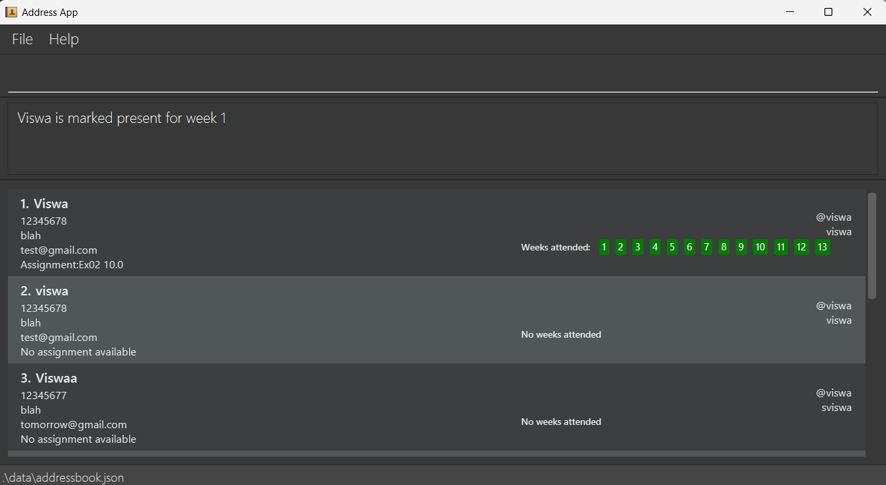
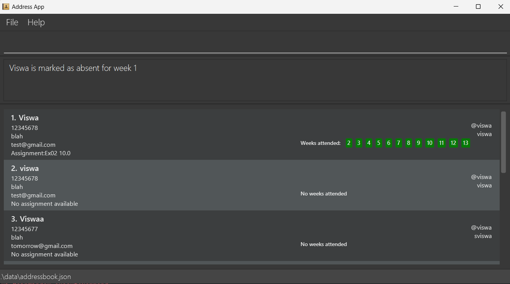

# KonTActs User Guide

konTActs is a **desktop app for managing contacts, optimized for use via a Command Line Interface** (CLI) while still having the benefits of a Graphical User Interface (GUI). If you can type fast, konTActs can get your contact management tasks done faster than traditional GUI apps.

<!-- * Table of Contents -->
<page-nav-print />

--------------------------------------------------------------------------------------------------------------------

## Quick start

1. Ensure you have Java `17` or above installed in your Computer. Refer [here](https://nus-cs2103-ay2425s1.github.io/website/admin/programmingLanguages.html) for the specific version.

1. Download the latest `.jar` file from [here](https://github.com/AY2425S1-CS2103T-T11-2/tp/releases).

1. Copy the file to the folder you want to use as the _home folder_ for your AddressBook.

1. Open a command terminal, `cd` into the folder you put the jar file in, and use the `java -jar addressbook.jar` command to run the application.<br>
   A GUI similar to the below should appear in a few seconds. Note how the app contains some sample data.<br>
   

1. Type the command in the command box and press Enter to execute it. e.g. typing **`help`** and pressing Enter will open the help window.<br>
   Some example commands you can try:

   * `list` : Lists all contacts.

   * `add n/James Ho p/22224444 e/jamesho@example.com telegram/@James t/friend t/colleague github/james-cool` : Adds a contact named `James Ho` to the Address Book.

   * `delete n/James Ho` : Deletes the contact with name `James Ho` if it is shown in the current list.

   * `clear` : Deletes all contacts.

   * `exit` : Exits the app.

1. Refer to the [Features](#features) below for details of each command.
   <br><br>
--------------------------------------------------------------------------------------------------------------------

## Summary of commands

| Action                                                | Format, Examples                                                                                                                                                                                                                      |
|-------------------------------------------------------|---------------------------------------------------------------------------------------------------------------------------------------------------------------------------------------------------------------------------------------|
| [**Add**](#adding-a-person-add)                       | `add n/NAME p/PHONE_NUMBER e/EMAIL telegram/TELEGRAM [t/TAG]…​ github/GITHUB` <br> e.g., `add n/James Ho p/22224444 e/jamesho@example.com telegram/@James t/friend t/colleague github/james-cool` |
| [**Clear**](#clearing-all-entries-clear)              | `clear`                                                                                                                                                                                                                               |
| [**Delete**](#deleting-a-person-delete)               | `delete n/NAME`<br> e.g., `delete n/James`                                                                                                                                                                                            |
| [**Edit**](#editing-a-person-edit)                    | `edit INDEX [n/NAME] [p/PHONE] [e/EMAIL] [telegram/TELEGRAM] [t/TAG]…​ [github/GITHUB]`<br> e.g.,`edit 2 n/James Lee e/jameslee@example.com`                                                                               |
| [**Find**](#finding-persons-by-name-find)             | `find KEYWORD [MORE_KEYWORDS]`<br> e.g., `find James Jake`                                                                                                                                                                            |
| [**Filter**](#filtering-persons-by-tag-filter)        | `filter t/[TAG] t/[MORE_TAG]…​`<br> e.g., `filter t/friends t/family`                                                                                                                                                                 |
| [**List**](#listing-all-persons-list)                 | `list`                                                                                                                                                                                                                                |
| [**Help**](#viewing-help-help)                        | `help`                                                                                                                                                                                                                                |
| [**View**](#viewing-a-contact-s-full-details-view)    | `view [n/NAME]` <br> e.g., `view n/JohnDoe`                                                                                                                                                                                           |
| [**Github**](#launching-github-repository-github)     | `github n/NAME`  <br> e.g., `github n/Harry`                                                                                                                                                                                          |
| [**Mark**](#marking-a-student-as-present-mark)        | `mark n/NAME w/WEEK NUMBER` <br> e.g. `mark n/John Doe w/1`                                                                                                                                                                           |
| [**Unmark**](#unmarking-a-student-as-present-unmark)  | `unmark n/NAME w/WEEK NUMBER` <br> e.g. `unmark n/John Doe w/1`                                                                                                                                                                       |
| [**Sort**](#sorting-the-displayed-list-sort)          | `sort FIELD order/ORDER` <br> e.g. `sort name order/asc`                                                                                                                                                                              |
| [**Import**](#importing-data-from-csv-file-import)    | `import path/CSV FILE PATH` <br> e.g `import path/user/data/xxx.csv`                                                                                                                                                                  |
| [**Export**](#exporting-data-into-csv-file-export)    | `export path/DESIRED FILE DESTINATION` <br> e.g `export path/user/data/xxx.csv`                                                                                                                                                       |
| [**Command History**](#accessing-command-history-and) | <kbd>↑</kbd> and <kbd>↓</kbd>                                                                                                                                                   |## Features
| [**Add grade**](#adding-grades-to-a-contact-addgrade) | `addGrade n/NAME asgn/ASSIGNMENT_NAME s/SCORE` <br> e.g. `addGrade n/JohnDoe asgn/Ex01 s/5`                                                                                                                                     

<br><br>

## <i class="fa-solid fa-address-book"></i> Features

<box type="info" icon=":fa-solid-circle-info:" light>

**Notes about the command format:**<br>

* Words in `UPPER_CASE` are the parameters to be supplied by the user.<br>
  e.g. in `add n/NAME`, `NAME` is a parameter which can be used as `add n/John Doe`.

* Items in square brackets are optional.<br>
  e.g `n/NAME [t/TAG]` can be used as `n/John Doe t/friend` or as `n/John Doe`.

* Items with `…`​ after them can be used multiple times including zero times.<br>
  e.g. `[t/TAG]…​` can be used as ` ` (i.e. 0 times), `t/friend`, `t/friend t/family` etc.

* Parameters can be in any order.<br>
  e.g. if the command specifies `n/NAME p/PHONE_NUMBER`, `p/PHONE_NUMBER n/NAME` is also acceptable.

* Extraneous parameters for commands that do not take in parameters (such as `help`, `list`, `exit` and `clear`) will be ignored.<br>
  e.g. if the command specifies `help 123`, it will be interpreted as `help`.

* If you are using a PDF version of this document, be careful when copying and pasting commands that span multiple lines as space characters surrounding line-breaks may be omitted when copied over to the application.
  </box>

--------------------------------------------------------------------------------------------------------------------
### <i class="fa-solid fa-circle-question"></i> Viewing help : `help`

The help command opens the help window that shows the link to this user guide. The window adds access to copy the url to the clipboard or directly launch this user guide from the browser.

A compact reference guide is also provided for quick reference.

<box type="definition" icon=":fa-solid-spell-check:" light>

<md>**Format: `help`**</md>
</box>

<box type="info" icon=":fa-solid-circle-info:" light>
<md>**The help window is launched in a separate window.**</md><br><br>

<br><br>
</box>

--------------------------------------------------------------------------------------------------------------------
### <i class="fa-solid fa-user-plus"></i> Adding a person: `add`

Adds a person to KonTActs.

<box type="definition" icon=":fa-solid-spell-check:" light>

<md>**Format: `add n/NAME p/PHONE_NUMBER e/EMAIL telegram/TELEGRAM [t/TAG]…​ github/GITHUB`**</md>
</box>
<box type="success" icon=":fa-solid-lightbulb:" light>

A person can have any number of tags (including 0)
  </box>

<box type="warning" icon=":fa-solid-circle-exclamation:" light>

<md>**GitHub username restrictions**</md>
* Length of username must between 1 and 39 characters
* Can contain only alphanumeric characters and hyphens ('-').
* Hyphens cannot appear at the start or end, nor consecutively within the username

**Valid examples**

`user123`, `user-name`, `username456`

**Invalid examples**

`very-mega-ultra-super-duper-long-username`, `-username`, `username-`, `user--name`, `username_with_special$chars`
</box>


<box type="definition" icon=":fa-solid-book:" light>

<md>**Examples:**</md>
* `add n/John Doe p/98765432 e/johnd@example.com telegram/@john github/swag-john33`
* `add n/Betsy Crowe t/friend e/betsycrowe@example.com p/1234567 telegram/@Betsy t/criminal github/betsy-29`
</box>


--------------------------------------------------------------------------------------------------------------------

### <i class="fa-solid fa-list"></i> Listing all persons : `list`

Displays all persons in KonTActs.

<box type="definition" icon=":fa-solid-spell-check:" light>

<md>**Format: `list`**</md>
</box>

--------------------------------------------------------------------------------------------------------------------

### <i class="fa-solid fa-pen"></i> Editing a person : `edit`

Edits an existing person detail in KonTActs.

<box type="definition" icon=":fa-solid-spell-check:" light>

<md>**Format: `edit INDEX [n/NAME] [p/PHONE] [e/EMAIL] [telegram/TELEGRAM] [t/TAG]…​ [github/GITHUB]`**</md>
</box>

<box type="warning" icon=":fa-solid-circle-exclamation:" light>

* Edits the person at the specified `INDEX`. The index refers to the index number shown in the displayed person list. The index **must be a positive integer** 1, 2, 3, …​
* At least one of the optional fields must be provided.
* Existing values will be updated to the input values.
* When editing tags, the existing tags of the person will be removed i.e adding of tags is not cumulative.
* You can remove all the person’s tags by typing `t/` without
    specifying any tags after it.
</box>


<box type="definition" icon=":fa-solid-book:" light>

<md>**Examples:**</md>
*  `edit 1 p/91234567 e/johndoe@example.com` Edits the phone number and email address of the 1st person to be `91234567` and `johndoe@example.com` respectively.
*  `edit 2 n/Betsy Crower t/` Edits the name of the 2nd person to be `Betsy Crower` and clears all existing tags.
*  `edit 1 github/cool-james12 n/James` Edits the name of the 1st person to `James` and github username to `cool-james12`.
*  `edit 2 telegram/@Mary n/Mary` Edits the name of the 2nd person to `Mary` and telegram ID to `@Mary`.
</box>


--------------------------------------------------------------------------------------------------------------------

### <i class="fa-solid fa-magnifying-glass"></i> Finding persons by name: `find`

Find all persons whose names contains any of the given keywords.

<box type="definition" icon=":fa-solid-spell-check:" light>

<md>**Format: `find KEYWORD [MORE_KEYWORDS]`**</md>
</box>
<box type="warning" icon=":fa-solid-circle-exclamation:" light>

* The search is case-insensitive. e.g `hans` will match `Hans`
* The order of the keywords does not matter. e.g. `Hans Bo` will match `Bo Hans`
* Only the name is searched.
* Only full words will be matched e.g. `Han` will not match `Hans`
* Persons matching at least one keyword will be returned (i.e. `OR` search).
  e.g. `Hans Bo` will return `Hans Gruber`, `Bo Yang`
  </box>

<box type="definition" icon=":fa-solid-book:" light>

<md>**Examples:**</md>
* `find John` returns `john` and `John Doe`
* `find alex david` returns `Alex Yeoh`, `David Li`<br>
  
</box>

--------------------------------------------------------------------------------------------------------------------

### <i class="fa-solid fa-filter"></i> Filtering persons by tag: `filter`

Finds persons whose names contain any of the given tag keywords.

<box type="definition" icon=":fa-solid-spell-check:" light>

<md>**Format: `filter t/TAG [t/MORE_TAG]...`**</md>
</box>

<box type="warning" icon=":fa-solid-circle-exclamation:" light>

* The search is case-sensitive. e.g `friends` will not match `Friends`
* At least one tag must be provided.
* The order of the keywords does not matter. e.g. `t/friends t/family` will match `t/family t/friends`
* Only the tags is searched.
* Only full tag name will be matched e.g. `friend` will not match `friends`
* Persons matching at least one keyword will be returned (i.e. `OR` search).
  e.g. `t/friends t/family` will return any contact tagged with `friend` or `family`.
</box>

<box type="definition" icon=":fa-solid-book:" light>

<md>**Examples:**</md>
* `filter t/friend t/family` returns any contact tagged with `friend` or `family`<br>
  
</box>

--------------------------------------------------------------------------------------------------------------------

### <i class="fa-solid fa-user-slash"></i> Deleting a person : `delete`

Deletes the specified person from the address book.

<box type="definition" icon=":fa-solid-spell-check:" light>

<md>**Format: `delete n/NAME`**</md>
</box>

<box type="warning" icon=":fa-solid-circle-exclamation:" light>

* Deletes the person with the specified name.
* The name refers to the full name of the person shown in the displayed person list.
* If a person matches the name but is not shown in the list, it will not be deleted.
  </box>

<box type="definition" icon=":fa-solid-book:" light>

<md>**Examples:**</md>
* `list` followed by `delete n/Betsy` deletes the person with the name `Betsy`.
* `find Betsy` followed by `delete Alex` will not delete the person named `Alex`.
* `delete n/Betsy` deletes the person named `Betsy` if it is shown on the filtered list.
</box>

--------------------------------------------------------------------------------------------------------------------

### <i class="fa-brands fa-github"></i> Launching GitHub repository : `github`

Launches GitHub repository of the specified person on the browser from the address book.

<box type="definition" icon=":fa-solid-spell-check:" light>

<md>**Format: `github n/NAME`**</md>
</box>

<box type="warning" icon=":fa-solid-circle-exclamation:" light>

* Launches the GitHub repository of the specified person.
* Person specified needs to have a GitHub username assigned in the Address Book.
* The name refers to the full name of the person shown in the Address Book.
  </box>

<box type="definition" icon=":fa-solid-book:" light>

<md>**Examples:**</md>

* `github n/Betsy` launches the GitHub repository of the person named `Betsy`, using the GitHub username assigned to `Betsy`.
</box>

--------------------------------------------------------------------------------------------------------------------

### <i class="fa-solid fa-eye"></i> Viewing a contact's full details : `view`

Opens a window at the side with the full details of the specified person from the address book.

<box type="definition" icon=":fa-solid-spell-check:" light>

<md>**Format: `view [n/NAME]`**</md>
</box>

<box type="warning" icon=":fa-solid-circle-exclamation:" light>

* View the full details of the selected contact.
* The name refers to the full name of the person shown in the displayed person list.
* Calling `view` without any name parameter closes any windows previously opened by `view`.
  </box>

<box type="definition" icon=":fa-solid-book:" light>

<md>**Examples:**</md>

* `view n/JohnDoe` opens a window at the side showing the full details of the person named `JohnDoe`.
* Calling `view n/JohnDoe` followed by `view` closes the window showing the full contact details of `JohnDoe`.
  </box>

--------------------------------------------------------------------------------------------------------------------

### <i class="fa-solid fa-square-check"></i> Marking a student as present : `mark`

Marks a student as present for a particular week.

<box type="definition" icon=":fa-solid-spell-check:" light>

<md>**Format: `mark n/NAME w/[WEEK_NUMBER]`**</md>
</box>

<box type="warning" icon=":fa-solid-circle-exclamation:" light>

* Marks the particular student as present in that week.
* The name and week number is compulsory.
* The name is case-sensitive.
* The range of the WEEK NUMBER is between 0 and 13, both inclusive. Rationale being there are 13 weeks per semester.
  </box>

<box type="definition" icon=":fa-solid-book:" light>

<md>**Examples:**</md>

* `mark n/Viswa w/1` marks the student named `Viswa` as present for week 1.
    
</box>

--------------------------------------------------------------------------------------------------------------------

### <i class="fa-solid fa-square-xmark"></i> Unmarking a student as present : `unmark`

Unmarks a student as present for a particular week.

<box type="definition" icon=":fa-solid-spell-check:" light>

<md>**Format: `unmark n/NAME w/[WEEK_NUMBER]`**</md>
</box>

<box type="warning" icon=":fa-solid-circle-exclamation:" light>

* Unmarks the particular student as present in that week.
* The name and week number is compulsory.
* The name is case-sensitive. 
* The range of the WEEK NUMBER is between 0 and 13, both inclusive. Rationale being there are 13 weeks per semester.
</box>

<box type="definition" icon=":fa-solid-book:" light>

<md>**Examples:**</md>

* `unmarks n/John Doe w/1` unmarks the student named `JohnDoe` as present for week 1.
  
  </box>

--------------------------------------------------------------------------------------------------------------------

### <i class="fa-solid fa-arrow-up-wide-short"></i> Sorting the displayed list : `sort`

Sorts the displayed list based on the given field and order.

<box type="definition" icon=":fa-solid-spell-check:" light>

<md>**Format: `sort FIELD order/ORDER`**</md>
</box>

<box type="warning" icon=":fa-solid-circle-exclamation:" light>

* Current FIELD that can be sorted by: `github`, `name`, `telegram`.
* Current ORDER that is accepted: `asc`, `desc`.
* The sort order will persist between commands.
* The sorting is case-insensitive: upper and lower case are treated as the same values.
  </box>

<box type="definition" icon=":fa-solid-book:" light>

<md>**Examples:**</md>

* `sort name order/asc` will sort the displayed list based on their name in ascending order.
  </box>

--------------------------------------------------------------------------------------------------------------------

### <i class="fa-solid fa-broom"></i> Clearing all entries : `clear`

Clears all entries from the address book.

<box type="definition" icon=":fa-solid-spell-check:" light>

<md>**Format: `clear`**</md>
</box>

--------------------------------------------------------------------------------------------------------------------

### <i class="fa-solid fa-file-import"></i> Importing data from CSV file `import`

Imports contacts based on CSV file

<box type="definition" icon=":fa-solid-spell-check:" light>

<md>**Format: `import path/CSV_FILE_PATH`**</md>
</box>

<box type="warning" icon=":fa-solid-circle-exclamation:" light>

* File path can be relative or absolute
  </box>

<box type="definition" icon=":fa-solid-book:" light>

<md>**Examples:**</md>

* `import path/data/tutorial12.csv` will import the contacts found from the comma separated file (tutorial12.csv from relative path given)
  </box>

--------------------------------------------------------------------------------------------------------------------

### <i class="fa-solid fa-file-export"></i> Exporting data into CSV file `export`

Exports contacts based on contacts and their details stored in KonTActs.

<box type="definition" icon=":fa-solid-spell-check:" light>

<md>**Format: `export path/DESIRED_FILE_DESTINATION`**</md>
</box>

<box type="warning" icon=":fa-solid-circle-exclamation:" light>

* File path can be relative or absolute
  </box>

<box type="definition" icon=":fa-solid-book:" light>

<md>**Examples:**</md>

* `export path/data/tutorial12.csv` will export the contacts in the Address book as a csv file (tutorial12.csv at the relative path given)
  </box>

--------------------------------------------------------------------------------------------------------------------

### <i class="fa-solid fa-clock-rotate-left"></i> Accessing command history <kbd>↑</kbd> and <kbd>↓</kbd>

KonTActs automatically saves every (valid or invalid) command entered which can then be retrieved later by using the <kbd>↑</kbd> and <kbd>↓</kbd> arrow keys.

<box type="definition" icon=":fa-solid-spell-check:" light>

<md>**Format: <kbd>↑</kbd> and <kbd>↓</kbd> arrow keys**</md>
</box>

<box type="warning" icon=":fa-solid-circle-exclamation:" light>

* Current input in the text field is erased when accessing the command history.
* If the current session of KonTActs has no commands added, pressing the <kbd>↑</kbd> and <kbd>↓</kbd> arrow keys will not have any effect.

  </box>

<box type="definition" icon=":fa-solid-book:" light>

<md>**Examples:**</md>

1. `github n/Harry` launches the github account of Harry on the browser
2. The command text field box is now empty.
3. Pressing <kbd>↑</kbd> will retrieve the last input command which will populate the command text field box with `github n/Harry`
4. Continuously pressing <kbd>↑</kbd> will scroll through all commands that have been previously input.
5. Pressing <kbd>↓</kbd> will scroll down to the more recent commands that was last input.
  </box>

--------------------------------------------------------------------------------------------------------------------
### Adding grades to a contact `addGrade`

Add an assignment and its grades to a contact.

<box type="definition" icon=":fa-solid-spell-check:" light>

<md>**Format: `addGrade n/NAME asgn/ASSIGNMENT_NAME s/SCORE`**</md>
</box>

<box type="warning" icon=":fa-solid-circle-exclamation:" light>

* Assignments that can be added to a contact are specified in path `data/assignment.json`.

  </box>

<box type="definition" icon=":fa-solid-book:" light>

<md>**Examples:**</md>

Example with the following assignment.json file:
```
{
  "assignments" : [
    {
      "name": "Assignment01",
      "maxScore": 5
    }, {
      "name": "Assignment02",
      "maxScore": 6
    }, {
      "name": "Assignment03",
      "maxScore": 7
    }
  ]
}
```
`addGrade n/JohnDoe asgn/Assignment01 s/5` will add an assignment name
Assignment01 with score 5 to contact JohnDoe.

`addGrade n/JohnDoe asgn/Assignment01 s/6` will not add the assignment to contact JohnDoe
as the input score is greater than the max, as specified in the `assignment.json` file.

`addGrade n/JohnDoe asgn/Assignment01 s/6` will not add the assignment to contact JohnDoe
as the input score is greater than the max, as specified in `assignment.json`.

`addGrade  n/JohnDoe asgn/Assignment05 s/5` will not add the assignment to contact JohnDoe
as the assignment is not specified `assignment.json`
   </box>

<box type="success" icon=":fa-solid-lightbulb:" light>

Calling `addGrade` without any fields will show the list of assignments in `assignment.json`.
</box>

### <i class="fa-solid fa-right-from-bracket"></i> Exiting the program : `exit`

Exits the program.

<box type="definition" icon=":fa-solid-spell-check:" light>

<md>**Format: `exit`**</md>
</box>

--------------------------------------------------------------------------------------------------------------------

### <i class="fa-solid fa-floppy-disk"></i> Saving the data

AddressBook data are saved in the hard disk automatically after any command that changes the data. There is no need to save manually.

--------------------------------------------------------------------------------------------------------------------

### <i class="fa-solid fa-pen"></i> Editing the data file

AddressBook data are saved automatically as a JSON file `[JAR file location]/data/addressbook.json`. Advanced users are welcome to update data directly by editing that data file.

<box type="warning" icon=":fa-solid-circle-exclamation:" light>

If your changes to the data file makes its format invalid, AddressBook will discard all data and start with an empty data file at the next run.  Hence, it is recommended to take a backup of the file before editing it.<br>
Furthermore, certain edits can cause the AddressBook to behave in unexpected ways (e.g., if a value entered is outside the acceptable range). Therefore, edit the data file only if you are confident that you can update it correctly.

</box>

--------------------------------------------------------------------------------------------------------------------

## <i class="fa-solid fa-question"></i> FAQ

**Q**: How do I transfer my data to another Computer?<br>
**A**: Install the app in the other computer and overwrite the empty data file it creates with the file that contains the data of your previous AddressBook home folder. Alternatively, you can use the export command to export the data into a CSV file and import the CSV file into your other device.

--------------------------------------------------------------------------------------------------------------------

## Known issues

1. **When using multiple screens**, if you move the application to a secondary screen, and later switch to using only the primary screen, the GUI will open off-screen. The remedy is to delete the `preferences.json` file created by the application before running the application again.
2. **If you minimize the Help Window** and then run the `help` command (or use the `Help` menu, or the keyboard shortcut `F1`) again, the original Help Window will remain minimized, and no new Help Window will appear. The remedy is to manually restore the minimized Help Window.

--------------------------------------------------------------------------------------------------------------------
