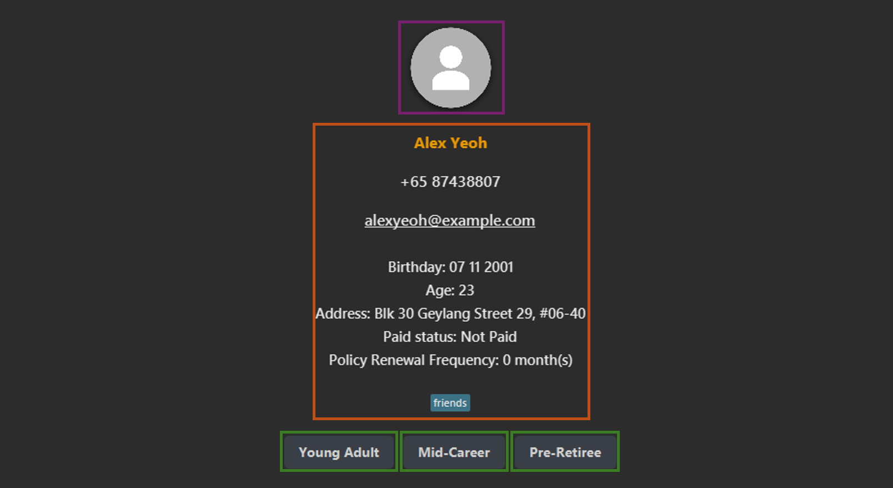
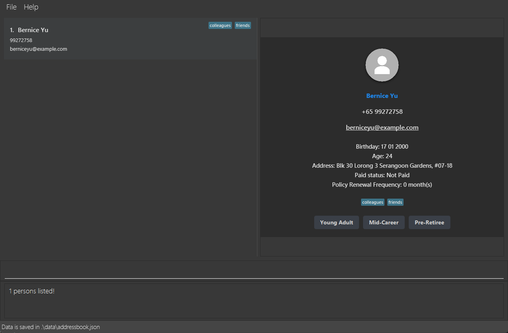

Financial Assurance Revolutionary Telemarketer (F.A.R.T) is a **desktop app for managing clients just for you Financial Advisors, optimized for use via a Command Line Interface** (CLI) while still having the benefits of a Graphical User Interface (GUI). If you can type fast, F.A.R.T can get your client management tasks done faster than traditional GUI apps.

* Table of Contents
{:toc}

--------------------------------------------------------------------------------------------------------------------

## Quick start

1. Ensure you have Java `17` or above installed in your Computer.
   1. You can check which version of Java you are currently running by entering `java -version` into a command terminal.
   1. Should you require help, [here](https://www.oracle.com/java/technologies/downloads/#java17) is the download link to Java 17
   1. After accessing the website, please choose the right download link for your operating system (Linux, macOS or Windows)

1. Download the latest `.jar` file from [here](https://github.com/AY2425S1-CS2103T-F14b-4/tp/releases/tag/v1.6).

1. Copy the file to the folder you want to use as the _home folder_ for your F.A.R.T.
   1. A good home folder would be the Downloads folder as it makes the next step easier.

1. Open a command terminal, `cd` into the folder you put the jar file in, and use the `java -jar fart_in_a.jar` command to run the application. 
   1. To open the command terminal, open the terminal app for Linux/macOS users, and Windows Powershell for Windows Users.
   1. If you followed step 3i, type `cd Downloads` in the terminal window to navigate to the Downloads folder.
   1. Alternatively, you may navigate to the folder using File Explorer, then right click it and select `Open in Terminal`
1. A GUI similar to the below should appear in a few seconds. Starting the F.A.R.T. book for the first time will automatically load some sample data. 
    Do note that for the best experience, we recommend using F.A.R.T. in _full-screen mode_.

1. The F.A.R.T. book is divided into four main sections. Referencing the above:

   1. The `Client List`, highlighted by the purple box. This shows you a simple list of all clients that have been added to the book.
   1. The `Detailed View`, highlighted by the orange box. This shows you a detailed view of one client when you select it from the `Client List` by double-clicking or pressing `Enter` on the appropriate client.
   1. The `Command Input Window`, highlighted by the green box. This is where you input commands to interact with the F.A.R.T. book. Do so by selecting the `Command Input Window` and typing the relevant command. Press `Enter` to execute it.
   1. The `Response Window`, highlighted by the blue box. Once a command is inputted, this is where the F.A.R.T. book informs you of the result of your command.
1. Some example commands you can try:
   * `help`: Opens the help window.
   * `list` : Lists all clients.
   * `add n/John Doe p/98765432 e/johnd@example.com a/John street, block 123, #01-01 b/11 09 2001` : Adds a client named `John Doe` to the F.A.R.T book and automatically marks them as unpaid.
   * `delete 3` : Deletes the 3rd client shown in the current list.
   * `paid 3 f/6` : Marks the 3rd client shown in the current list as paid and sets the policy renewal frequency to 6 months.
   * `unpaid 3` : Marks the 3rd client shown in the current list as unpaid and changes the policy renewal frequency to 0.
   * `clear` : Deletes all clients.
   * `find n/john`  : Displays all clients with name(s) matching "john"
   * `exit` : Exits the app.

1. Refer to the [Features](#features) below for details of each command.

--------------------------------------------------------------------------------------------------------------------

## Features

**:information_source: Notes about the command format:** 

* Words in `UPPER_CASE` are the parameters to be supplied by the user. 
  e.g. in `add n/NAME`, `NAME` is a parameter which can be used as `add n/John Doe`.

* Items in square brackets `[]` are optional. 
  e.g. `n/NAME [a/ADDRESS] [t/TAG]` can be used as `n/John Doe t/friend` or as `n/John Doe`.

* Items with `…`​ after them can be used multiple times including zero times. 
  e.g. `[t/TAG]…​` can be used as ` ` (i.e. 0 times), `t/friend`, `t/friend t/family` etc.

* Parameters can be in any order. 
  e.g. if the command specifies `n/NAME p/PHONE_NUMBER`, `p/PHONE_NUMBER n/NAME` is also acceptable.

* Extraneous parameters for commands that do not take in parameters (such as `help`, `list`, `exit` and `clear`) will be ignored. 
  e.g. if the command specifies `help 123`, it will be interpreted as `help`.

* If you are using a PDF version of this document, be careful when copying and pasting commands that span multiple lines as space characters surrounding line-breaks may be omitted when copied over to the application.

--------------------------------------------------------------------------------------------------------------------

## Accepted formats for parameters

Do note these rules when attempting to interact with the various commands below. Inputs that do not follow the rules will not be accepted by the F.A.R.T. address book and the inputted data will not be added to the client list. Note that for all commands, spaces at the start of any input will be cut off e.g. inputting `n/        John Doe`will result in F.A.R.T. reading it as `n/John Doe`.

### Name

* Valid inputs: Alphanumeric characters, with or without spaces e.g. `Martin`, `Martin Luther King`, `John`, `J0hn`
* Common invalid inputs:
  * The slash character `/`, e.g. `S/O`
  * The period character `.`, e.g. `Jr.`

### Phone Number

* Valid inputs: Numerical characters starting with either 3, 6, 8 or 9 (Singaporean numbers). The input must be exactly 8 characters long e.g. `91234567`, `81234567`
* Common invalid inputs:
  * A non-Singaporean phone number e.g. `51234567`
  * A phone number exceeding 8 digits in length e.g. `6581234567`
  * Adding the country code at the beginning e.g. `+6581234567`
  * Adding a space in between the numbers e.g. `8123 4567`

### Email

For all parts of the input that accept special characters, they cannot be placed at the start or at the end. Special characters can only appear at most once consecutively.
* Valid inputs: `local-part@domain`, e.g. `john.doe@example.com`, `j_ohn@example.edu.org`, `john123@e-mail.com`, where:
  * `local-part`: Alphanumeric characters, in addition to these special characters: `+`, `_`, `.`, `-`.
  * `@`: This character must be present.
  * `domain`: Alphanumeric characters, in addition to these special characters: `.`, `-`. The last two characters must be alphanumeric.
* Common invalid inputs:
  * Special characters at the start or at the end e.g. `.john@example.com`, `john@example.com.`
  * More than one consecutive special character e.g. `john..doe@example.com`, `john@example..com`
  * Disallowed special characters e.g. `john!@example.com`
  * Missing `@` character e.g. `johnexample.com`
  * Last two characters not being alphanumeric e.g. `john@example.c`

### Birthday

* Valid inputs: Numerical characters in the format `DD MM YYYY`. Valid dates should be used e.g. `01 01 2000`, `02 03 2004`
* Common invalid inputs:
  * Incorrect format e.g. `01/01/2000`, `01 31 2000`, `01 01 04`
  * Invalid dates e.g. `31 02 2000`, `32 01 2000`

### Address

* Valid inputs: This field accepts a string of any characters as its input e.g. `John Street, Block 123, #01-01`, `Pro+fessional Building, Level 3, Unit 30`, `東京都豊島区東池袋1-22-10　ヒューマックスパビリオン`

### Tag(s)

Aside from normal tags, F.A.R.T. also provides specialised tags. For more information, refer to the [Visual Features](#visual-features) below.
* Valid inputs: Alphanumeric characters. To include multiple tags, repeat the `t/` label e.g. `t/friend`, `t/colleague t/neighbour`
* Invalid inputs:
  * Dropping of the `t/` label e.g. `t/colleague neighbour`
  * Non-alphanumeric characters e.g. `t/#1friend`

--------------------------------------------------------------------------------------------------------------------

## Viewing help : `help`

Need help navigating F.A.R.T? This command opens a window that has all you need.

Format: `help`

--------------------------------------------------------------------------------------------------------------------

## Viewing a client's details
* When the app starts, a placeholder on the right panel will prompt you to select a client on the list.
* You may use your arrow keys to traverse the client list, then **double-click** on a client in the client list to bring up a more detailed view of the client, including information like address and birthday. This will bring up something similar to the below.

* The detailed view can be broken down into three main sections:
  * The client's profile picture, highlighted by the purple box. A default profile picture is given to all clients. This can be updated via the `upload` command.
  * The client's details, highlighted by the orange box. This can be updated by various commands, including `edit`, `paid,` `unpaid`.
  * Three template messages, highlighted by the green boxes. These are predetermined messages that have been categorised by the different life phases that a client could be in. Clicking on one of the buttons will copy the relevant message to your clipboard, allowing you to quickly send a message to your client via your preferred messaging app. The message will automatically use the **name provided in the F.A.R.T. book**. A successful copy will result in `Template Message copied to clipboard!` being shown in the `Response Window`.

  **:information_source: Note!** 
The displayed client will persist and edits will not be reflected until you select another client or close the F.A.R.T book.If you made any changes to the current client on display, kindly double-click on the same client to refresh the detailed view.

--------------------------------------------------------------------------------------------------------------------

## Adding a client: `add`

Met a potential client or someone new? This command adds a client to the F.A.R.T book.

Format: `add n/NAME p/PHONE_NUMBER e/EMAIL b/BIRTHDAY [a/ADDRESS] [t/TAG]…​`

:bulb: **Tip:**
A client can have any number of tags (including 0) but only maximum of 1 address!

Examples:
* `add n/John Doe p/98765432 e/johnd@example.com b/11 09 2001 a/John street, block 123, #01-01`
* `add n/Betsy Crowe t/friend e/betsycrowe@example.com a/Newgate Prison p/81234567 b/11 09 2001 t/criminal`
* `add n/Charlie Chen Cao Cong p/88888888 b/01 02 2003 e/charliechen88@huat.com t/mahjong`

**Note:**
1. As mentioned in the Acceptable Formats, only **Singapore** phone numbers and valid email addresses (in the form `local-part@domain`) are accepted.
2. Birthdays should be added in DD MM YYYY format.
3. You may add duplicate clients (i.e., clients with the same name, case-insensitive) but the F.A.R.T book will prompt you to confirm that you are adding a duplicate client. If you select `No` in the prompt window, the operation will be aborted and the client will not be added. Else, select `Yes` to add the new client.

--------------------------------------------------------------------------------------------------------------------

## Listing all clients : `list`

Need to have a quick view of everyone in your F.A.R.T book or reset it after filtering? This command displays a list of all clients in the F.A.R.T book.

Format: `list`

--------------------------------------------------------------------------------------------------------------------

## Editing a client : `edit`

Need to update a client's details? This command edits an existing client in the F.A.R.T book.

Format: `edit INDEX [n/NAME] [p/PHONE_NUMBER] [e/EMAIL] [b/BIRTHDAY] [a/ADDRESS] [t/TAG]…​`

* Edits the client at the specified `INDEX`. The index refers to the index number shown in the displayed client list. The index **must be a positive whole number** 1, 2, 3, …​
* At least one of the optional fields must be provided.
* Existing values will be updated to what you have currently typed in.
* When editing tags, the existing tags of the client will be removed i.e. adding of tags is not cumulative.
* You can **remove all** the client’s tags by typing `t/` without specifying any tags after it.
* Similarly, a client's address can be removed by typing `a/` without specifying anything after it.
* If you edit a client's name to be the same of that of another client in the F.A.R.T. book, a prompt will appear asking you to confirm the edit action. If you select `No` in the prompt window, the operation will be aborted and the name will not be changed. Else, select `Yes` to proceed with the edit.

Examples:
*  `edit 1 p/91234567 e/johndoe@example.com` Edits the phone number and email address of the 1st client to be `91234567` and `johndoe@example.com` respectively.
*  `edit 2 n/Betsy Crower t/` Edits the name of the 2nd client to be `Betsy Crower` and clears all existing tags.

--------------------------------------------------------------------------------------------------------------------

## Locating clients by attribute: `find`

Need to quickly find a client by their address or something other than their name? Use this command to find clients whose attributes contain any of the given keywords.

Format: `find [n/NAME] [p/PHONE_NUMBER] [e/EMAIL] [b/BIRTHDAY] [a/ADDRESS] [t/TAG]…​`

* The search is case-insensitive. e.g. `hans` will match `Hans`.
* At least one of the optional fields must be provided.
* Keywords are matched against the attribute that you specified (i.e. searching for names will match against all names).
* Partial matches of a keyword will also be returned. e.g. ``9123`` will return clients with the phone number ``91234567``.

:bulb: **Note:**
When searching with more than one attribute, it will find clients who satisfy ALL keywords. e.g. ``find n/Alice a/Clementi`` will return clients named Alice **AND** has an address in Clementi.

Examples:
* `find n/John` returns clients with **names** `john` and `John Doe`.
* `find a/serangoon` returns ``Bernice Yu``, ``David Li``.

* `find n/bernice a/serangoon` returns ``Bernice Yu``

--------------------------------------------------------------------------------------------------------------------

## Deleting a client : `delete`

Need to remove someone from your list? This command deletes the specified client from the F.A.R.T book.

Format: `delete INDEX`

* Deletes the client at the specified `INDEX`.
* The index refers to the index number shown in the displayed client list.
* The index **must be a positive whole number** 1, 2, 3, …​

Examples:
* `list` followed by `delete 2` deletes the 2nd client in the F.A.R.T book.
* `find n/Betsy` followed by `delete 1` deletes the 1st client in the results of the `find` command.

**Note:**
1. A `delete` command cannot be undone, and deleted clients cannot be retrieved.
1. When a `delete` command is inputted, the F.A.R.T Book will first prompt you to confirm if the client that you want to delete is correct. If you select `No`, the operation will be aborted and the client will not be deleted. Else, select `Yes` to delete the client.
You may use your arrow keys and `Enter` to traverse the `Yes` and `No` options.

--------------------------------------------------------------------------------------------------------------------

## Clearing all entries : `clear`

Want to get rid of all clients or the sample data we've provided? This command clears all entries from the F.A.R.T book.

Format: `clear`

**Note:**
1. A `clear` command cannot be undone, and cleared clients cannot be retrieved.
1. When a `clear` command is inputted, the F.A.R.T Book will first prompt you to confirm that you wish to clear the book. If you select `No`, the operation will be aborted and the book will not be cleared. Else, select `Yes` to clear the book.
1. If you do change your mind after clearing the F.A.R.T book, you can retrieve only the sample data by deleting the `addressbook.json` file in the `data` folder, then launching F.A.R.T again.

--------------------------------------------------------------------------------------------------------------------

## Marking a client as paid: `paid`

Need to track client policy payments for the current period? This command marks the specified client from the F.A.R.T book as paid.

Format: `paid INDEX f/FREQUENCY`

* Marks the client at the specified `INDEX` as paid.
* The index refers to the index number shown in the displayed client list.
* The index **must be a positive whole number** 1, 2, 3, …​
* The frequency is the number of months between policy renewals, and it can only be 1, 3, 6, or 12.
* The frequency will indicate which month the client will be **automatically** updated to unpaid.

Examples:
* `list` followed by `paid 2 f/6` marks the 2nd client in the F.A.R.T book as paid and sets their policy renewal frequency to 6 months.
* `find n/Betsy` followed by `paid 1 f/6` marks the 1st client in the results of the `find` command as paid and sets their policy renewal frequency to 3 months.

**Note:**
1. All policies are assumed to begin and end on the **first** of the month.
1. As of now, each frequency only supports tracking for specific months. More specifically,
   1. 1 Month Frequency: The client will be automatically updated to unpaid on the first of each month.
   1. 3 Month Frequency: The client will be automatically updated to unpaid on the first of January, April, July and October.
   1. 6 Month Frequency: The client will be automatically updated to unpaid on the first of January and July.
   1. 12 Month Frequency: The client will be automatically updated to unpaid on the first of January. For example, should a client begin a policy with yearly renewals in February, they will still be automatically marked unpaid next January, not February.

--------------------------------------------------------------------------------------------------------------------

## Marking a client as unpaid: `unpaid`

Need to manually mark a client that has yet to pay? This command marks the specified client from the F.A.R.T book as unpaid.

Format: `unpaid INDEX`

* Marks the client at the specified `INDEX` as unpaid.
* The index refers to the index number shown in the displayed client list.
* The index **must be a positive whole number** 1, 2, 3, …​
* Changes the policy renewal frequency to 0

Examples:
* `list` followed by `unpaid 2` marks the 2nd client in the F.A.R.T book as unpaid.
* `find n/Betsy` followed by `unpaid 1` marks the 1st client in the results of the `find` command as unpaid.

**Note:**
1. As clients will be automatically marked as unpaid based on their policy renewal frequency, this command should only be used in special cases. A good example would be if a client wishes to change their renewal frequency, thus requiring you to update the new frequency into the F.A.R.T. book.

--------------------------------------------------------------------------------------------------------------------

## Uploading a client's profile picture: `upload` \[WINDOWS ONLY\]

Too many clients? Keep track of their faces by uploading a profile picture of them.

Format: `upload INDEX`

* This opens a file browser which you can choose **PNG images** for the client at the specified `INDEX`.
* The index refers to the index number shown in the displayed client list.
* The index **must be a positive whole number** 1, 2, 3, …​

**:bulb: Note!:** 

* This feature is for Windows users only. Mac and Linux users may encounter errors if they use this feature. Support for the other OSes will be released in future versions!
* The profile picture may look weird if the image chosen is extremely small, too wide or too thin. For best results, we recommend square images approximately 300px x 300px. You can achieve this by cropping with your computer's image editor or an online one like this one from [Adobe](https://www.adobe.com/express/feature/image/crop).
* Only **PNG** images are supported. Please ensure your chosen image is in **PNG** format.

--------------------------------------------------------------------------------------------------------------------

## Exiting the program : `exit`

Done with F.A.R.T.? This command closes the program. Your data is automatically saved.

Format: `exit`

--------------------------------------------------------------------------------------------------------------------

## Visual Features
F.A.R.T has some handy visual cues that highlight certain clients.

| Feature                   | Details                                                                                                                                                                                                                                                                                                                  | Examples                                                                                                                       |
|---------------------------|--------------------------------------------------------------------------------------------------------------------------------------------------------------------------------------------------------------------------------------------------------------------------------------------------------------------------|--------------------------------------------------------------------------------------------------------------------------------|
| **Net Worth Tagging**     | You can add tags to clients that say `"highnetworth"`, `"midnetworth"`, `"lownetworth"` that will be highlighted.    Each client can only have one net worth tag at a time.  (e.g. if you add a `"highnetworth"` tag to a client who already has a "midnetworth" tag, then the existing tag will be removed) |    |
| **Birthday Highlighting** | When a client's birthday is approaching or has recently passed (**7 days** before and after   the current date), their name will turn orange. It will also remind you if you mouse over their name.   Take this chance to wish them a happy birthday!                                                           |                                                                                     |

If you would like to disable these visual features, click on the `File` tab at the top and uncheck `Enable Visuals`.

--------------------------------------------------------------------------------------------------------------------

## Saving the data

F.A.R.T data is saved in your computer automatically after any command that changes the data. There is no need to save manually. The location of where the data is stored is specified at the bottom status bar of the app.

--------------------------------------------------------------------------------------------------------------------

## Editing the data file

F.A.R.T data is saved automatically as a JSON file `[JAR file location]/data/addressbook.json`. Advanced users are welcome to update data directly by editing that data file.

:exclamation: **Caution:**
If your changes to the data file makes its format invalid, F.A.R.T will discard all data and start with an empty data file at the next run. Hence, it is recommended to take a backup of the file before editing it. Furthermore, certain edits can cause F.A.R.T to behave in unexpected ways (e.g., if a value entered is outside the acceptable range). Therefore, edit the data file only if you are confident that you can update it correctly.

--------------------------------------------------------------------------------------------------------------------

## FAQ

**Q**: How do I transfer my data to another Computer? 
**A**: Install this app in the other computer and overwrite the empty data file it creates, with the file that contains the data of your previous F.A.R.T home folder.

--------------------------------------------------------------------------------------------------------------------

## Known Issues

1. **When using multiple screens**, if you move the application to a secondary screen, and later switch to using only the primary screen, the GUI will open off-screen. The remedy is to delete the `preferences.json` file created by the application before running the application again.
2. **If you minimize the Help Window** and then run the `help` command (or use the `Help` menu, or the keyboard shortcut `F1`) again, the original Help Window will remain minimized, and no new Help Window will appear. The remedy is to manually restore the minimized Help Window.
3. **If you are unable to see the command input or result panels**, resize the window to a larger size by hovering over the window outline on your screen. A two-sided arrow should appear, which you can click and drag to resize to an appropriate size. This issue may be especially prevalent on smaller monitor sizes. We recommend using F.A.R.T. in full-screen mode.
4. As mentioned in the Viewing a client's details section, a client's detailed view **does not automatically update to reflect changes**. Once changes are made, double-click on the same client to refresh said changes. Else, the changes will be updated upon restarting the F.A.R.T. book.
5. If you are using arrow keys to navigate the client list, then enter a command in the command box, you need to move your cursor back to the client list to select it again.
    
--------------------------------------------------------------------------------------------------------------------

## Command summary

| Action     | Format, Examples                                                                                                                                                                                |
|------------|-------------------------------------------------------------------------------------------------------------------------------------------------------------------------------------------------|
| **Add**    | `add n/NAME p/PHONE_NUMBER e/EMAIL b/BIRTHDAY [a/ADDRESS] [t/TAG]…​`   e.g., `add n/James Ho p/91234567 e/jamesho@example.com a/123, Clementi Rd, 1234665 b/11 09 2001 t/friend t/colleague` |
| **Clear**  | `clear`                                                                                                                                                                                         |
| **Delete** | `delete INDEX`  e.g., `delete 3`                                                                                                                                                             |
| **Edit**   | `edit INDEX [n/NAME] [p/PHONE_NUMBER] [e/EMAIL] [b/BIRTHDAY] [a/ADDRESS] [t/TAG]…​`  e.g.,`edit 2 n/James Lee e/jameslee@example.com`                                                        |
| **Find**   | `find [n/NAME] [p/PHONE_NUMBER] [e/EMAIL] [b/BIRTHDAY] [a/ADDRESS] [t/TAG]…​`  e.g.,`find e/jameslee@example.com`                                                                            |
| **List**   | `list`                                                                                                                                                                                          |
| **Help**   | `help`                                                                                                                                                                                          |
| **Paid**   | `paid INDEX f/FREQUENCY`  e.g., `paid 3 f/ 3`                                                                                                                                                |
| **Unpaid** | `unpaid INDEX`  e.g., `unpaid 3`                                                                                                                                                             |
| **Upload** | `upload INDEX`  e.g., `upload 3`                                                                                                                                                             |

--------------------------------------------------------------------------------------------------------------------
## Glossary

* Command Line Interface (CLI): All instructions are done via typing into a textbox at the bottom of your screen
* Command Terminal:
    * If you are a Windows user, press the Windows key and in the search bar, type in Powershell. Click on it and that will be your Command Terminal
    * For Mac/Linux users, look for Terminal under applications and that will be your Command Terminal
* Graphical User Interface (GUI): A visual platform for you to interact with the F.A.R.T. book. i.e., the window that opens upon starting the book.
* Parameter: Something that must be typed into the Command Line for the command to be properly recognised
* Index: The number found beside the client's name in the F.A.R.T book
