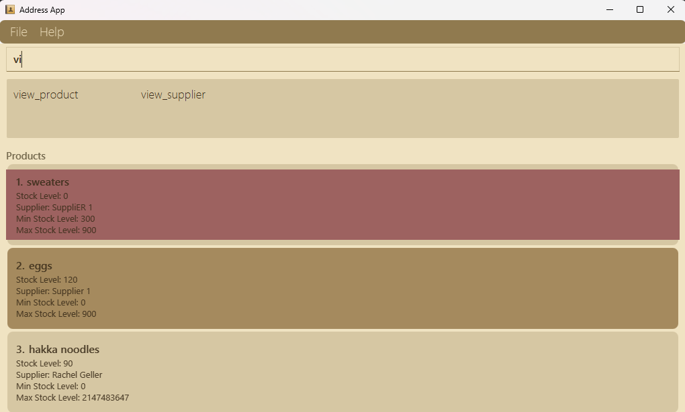
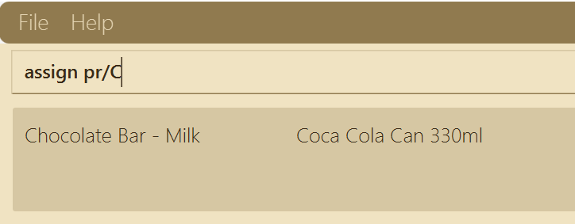
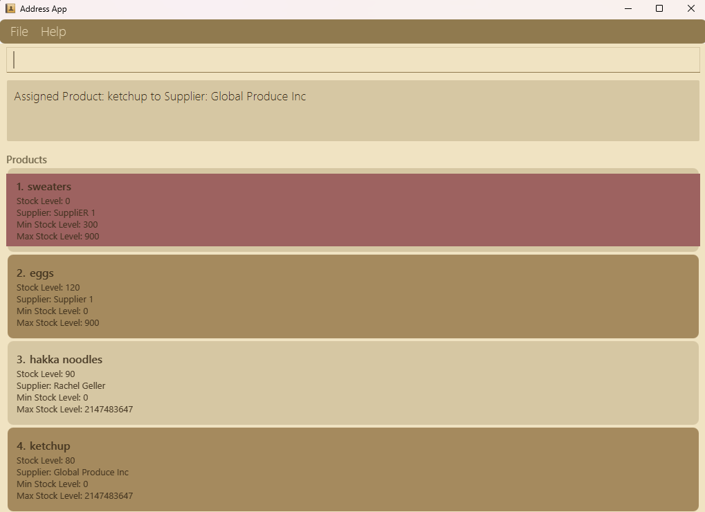
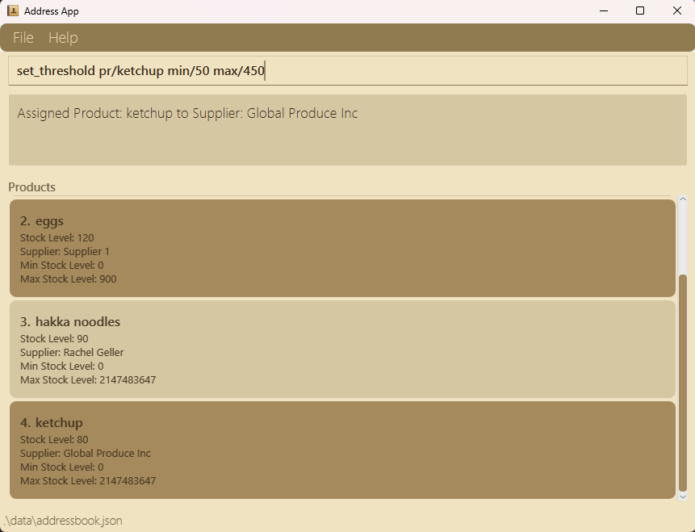
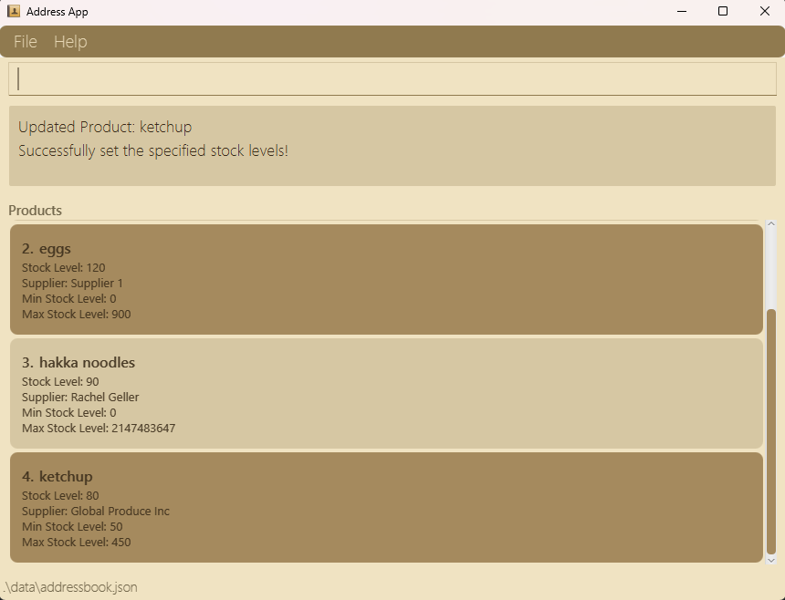
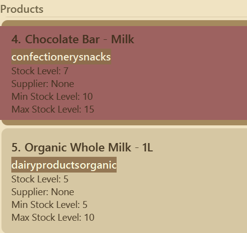

# InvenTrack User Guide

Your Journey to Easier Inventory Management Starts Here! 📦

As an inventory manager, advanced technical skills aren’t necessary to use Inventrack effectively. This guide will help you quickly understand and apply its essential features, making it easier to streamline your daily tasks. Since your main goal is accurate, efficient inventory tracking, we’ve kept instructions clear and practical, focusing on what you need to manage your store’s stock seamlessly.

🎯 **Fast and Easy to Use:** If you’re comfortable with typing, navigating Inventrack will be especially intuitive!

With InvenTrack, you can:

- Add and manage suppliers and products in your inventory.
- Keep track of which suppliers provide which products.
- Monitor and update stock levels of the products in the system.

---

## Table of Contents
1. [Quick Start](#quick-start)
2. [Notes about command format](#notes-about-the-command-format-and-other-information)
3. [Prefixes Glossary](#prefixes-glossary)
4. [Features](#features)
   - [Viewing Help](#viewing-help--help-)
   - [Autocomplete](#autocomplete--)
   - [Adding a supplier](#adding-a-supplier-add_supplier-)
   - [Adding a product](#adding-a-product--add_product-)
   - [Assigning a product to supplier](#assigning-a-product-to-supplier-assign---)
   - [Unassigning product from a supplier](#un-assigning-a-product-to-supplier-unassign---)
   - [Setting threshold for a product](#setting-threshold-for-a-product-set_threshold--)
   - [Updating stock level of a product](#updating-stock-level-for-a-product-update_stock-)
   - [Locating all suppliers](#locating-all-suppliers-view_supplier-)
   - [Locating all products](#locating-all-products-view_product-)
   - [Deleting a supplier](#deleting-a-supplier-delete_supplier-)
   - [Deleting a product](#deleting-a-product-delete_product-)
   - [Clearing all entries](#clearing-all-entries--clear-)
   - [Exiting the app](#exiting-the-program--exit-)
4. [Saving the data](#saving-the-data-)
5. [Editing the data file](#editing-the-data-file-)
6. [Upcoming features](#upcoming-features)
7. [FAQ](#faq)
8. [Known Issues](#known-issues)
9. [Command Summary](#command-summary-)

<page-nav-print />

---

## Quick Start
### Step 1: Install Java
Before you can use InvenTrack, ensure you have Java version `17` or above installed in your Computer. Java helps you to run our app in your desktop.
To check if Java is installed:
  1. Open a command terminal using `cmd` in search (Command Prompt on Windows, Terminal on macOS/Linux). <br> Alternate way to open terminal: right-click on the opened folder or desktop, select `Open in terminal` option.
  2. Type the following command and press Enter:
      ```
      java -version
      ```
If Java is installed, you should see the version number. <br> If Java is not installed, download it from the [official website](https://www.oracle.com/java/technologies/downloads/#java17?er=221886).

### Step 2: Download InvenTrack
1. Get the latest version of InvenTrack by downloading the `.jar` file from [here](https://github.com/AY2425S1-CS2103T-T17-3/tp/releases).
2. Move the .jar file into the folder where you want to store your InvenTrack data (this will be your "home folder").

### Step 3: Navigate to the Folder
To run InvenTrack, you need to open your command terminal and navigate to the folder where you saved the .jar file:
1. Open a terminal (Command Prompt on Windows or Terminal on macOS/Linux).
2. Use the `cd` command to change to the folder containing the `.jar` file. For example:
   - On **Windows:**
     ```
     cd Desktop\InvenTrack
     ```
   - On **macOS/Linux:**
     ```
     cd ~/Desktop/InvenTrack
     ```
   Verify that your terminal is now pointing to the correct directory. The terminal prompt should show the folder name `(e.g. InvenTrack)`

### Step 4: Run the Application
To launch the application:
1. After step 3, type the following command and press Enter:
    ```
    java -jar inventrack.jar
    ```
2. After a few seconds, the InvenTrack application should open. A window similar to the one below should appear (note that some sample data may be pre-loaded in the app):
   

### Step 5: Start Using InvenTrack
You can now start using the application by typing commands into the command box. For example:

   * `add_supplier n/Kayla Beauty p/98136450 e/kaylab@hotmail.com a/Phoenix Cross Road, Hilton Avenue 6` : Adds a supplier named Kayla Beauty with respective phone, email and address.

   * `add_product n/Corn flour stk/50` Adds product named Corn flour with current stock level as 50

   * `view_product` : Helps you to view the current products in the system.

   * `view_supplier` : Lets you see the list of suppliers currently in the system.

   * `delete_supplier n/Kayla Beauty` : Deletes the supplier with the name 'Kayla Beauty'

   * `clear` : Deletes all the information about the suppliers and products in the system completely.

   * `exit` : Helps you to exit the app.

Refer to the [Features](#features) below to know more about the commands you could use in this app.

## **Notes about the command format and other information:**
> #### ⚠️ Placeholders in UPPER_CASE
> Words like `PRODUCT_NAME` and `SUPPLIER_NAME` are placeholders for information you need to provide.
> - **Example**: For `add_product n/PRODUCT_NAME`, replace the placeholder with actual values, such as `add_product n/Apples`.
> #### 📘 Optional Items in Square Brackets
> Items in square brackets are optional.
> - **Example**: `add_product n/PRODUCT_NAME [stk/STOCK_LEVEL]` can be used as `add_product n/Apples` or as `add_product n/Apples stk/50`.
> #### 🔁 Repeating Items with `…`
> Items followed by **`…`** can be used multiple times or omitted.
> - **Example**: `[t/TAG]…` can be used as ` ` (0 times), `t/beverage`, or `t/beverage t/important`, etc.
> #### ❗ Extraneous Parameters Ignored
> Commands that do not require parameters (such as `help`, `exit`, and `clear`) will ignore any extra inputs.
> - **Example**: Typing `help 123` or `help -10` will be interpreted as `help`.
> #### 📦 Setting Current Stock to be Greater than Maximum Threshold
> - MAX_STOCK_LEVEL is the maximum number of products you would like to have in your store for a particular product, so it might happen that CURRENT_STOCK_LEVEL maybe greater than the former because of greater number of purchase order. This helps to suit real world implementation.

<div style="background-color: #f0f8ff; padding: 15px; border-left: 6px solid #2196F3; margin-bottom: 15px;">
    <strong>📝 Note:</strong> 
</div>

<div style="background-color: #f0f8ff; padding: 15px; border-left: 6px solid #2196F3; margin-bottom: 15px; ">
    <strong>📝 Note:</strong> 
    <ul>
        <li><strong>Parameter Order:</strong> Parameters can be entered in any order.</li>
        <li><strong>Commands are Case-Insensitive:</strong> Commands such as <code>help</code> and <code>HELP</code> are recognized as the same.</li>
    </ul>
</div>

<div style="background-color: #fff3e0; padding: 15px; border-left: 6px solid #FF9800; margin-bottom: 15px;">
    <strong>⚠️ Caution:</strong>
    <p><strong>🖨️ Copying Commands from PDFs:</strong> If you’re copying commands from a PDF, note that spaces at line breaks may be omitted when pasted, so double-check the spacing.</p>
</div>

### Prefixes Glossary:

- **`n/`**: Represents the **name** of a supplier or product.

- **`pr/`**: Refers to **product**.

- **`su/`**: Represents a **supplier**.

- **`p/`**: Used for the **phone number** of a supplier.

- **`e/`**: Represents the **email address** of a supplier.

- **`a/`**: Used for the **address** of a supplier.

- **`t/`**: Stands for **tags** that can be added to either suppliers or products.

- **`stk/`**: Indicates the **stock level** of a product.

- **`min/`**: Represents the **minimum stock level** of a product.

- **`max/`**: Represents the **maximum stock level** of a product.
---

## Features

### Viewing help : `help` 🤝

Stuck on how to use the app?

The Help command simplifies the process for you!

It opens a pop-up window containing a message to copy the link to the user guide, allowing you to learn more about the application.

Format: `help`


---

### Autocomplete : 🤖

Want the app to automatically complete the commands, supplier name or the product names you want?

- Just press tab button on your keyboard to see the information.
- If there is exactly one matching autocomplete option, it'll perform the completion automatically!

<div style="background-color: #f0f8ff; padding: 15px; border-left: 6px solid #2196F3; margin-bottom: 15px;">
    <strong>📝 Note:</strong> It works only if you press tab button from your keyboard and only for the command names, after <code>pr/</code> or <code>su/</code> currently.
</div>



---

### Adding a supplier: `add_supplier` 🙋‍♂️🙋‍♀️

First let us add your suppliers into the system. 
<br> To do this, use the given command format:

Format: `add_supplier n/NAME p/PHONE_NUMBER e/EMAIL a/ADDRESS [t/TAG]…​`

Here are a few examples to help you:
* `add_supplier n/Fresh Farms Ltd p/98765432 e/contact@freshfarms.com a/23 Orchard Street, Suite 5`
* `add_supplier n/Global Produce Inc e/globalproduce@example.com p/1234567 a/789 Harvest Ave, Level 2 t/Organic`

<div style="background-color: #f0f8ff; padding: 15px; border-left: 6px solid #2196F3; margin-bottom: 15px;">
    <strong>📝 Note:</strong>
    <ul>
         <li>A supplier can have any number of tags (including 0).</li>
         <li>Currently, there is no restriction in phone number format, so you can use numbers like (+65) 97136544 or even +91-97664 23668, according to any country-specific format you prefer.</li>
         <li>Email can be the same if different people from same company use same work email hence we don't check for duplicate in emails and phone number too, It is intended for future enhancements.</li>
         <li>No value allows usage of "/", so if you want to use "S/O" in names, it's better to use alternatives like "son of," as there is no length restriction for names.</li>
         <li>If you want to see the supplier you have added, use view_supplier to switch panel, as currently the UI would not show newly added supplier information.</li>
    </ul>
</div>

<div style="background-color: #e8f5e9; padding: 15px; border-left: 6px solid #4CAF50; margin-bottom: 15px;">
    <strong>💡 Tip:</strong> If you made a mistake while entering a supplier's information, you can delete the supplier and add them again with the correct details.
</div>

---

### Adding a product : `add_product` 🧶

Now, let us add the products supplied in your store. 
This command will help you add the product information into the system.

Format: `add_product n/NAME [stk/STOCK_LEVEL] [su/SUPPLIER_NAME] [t/TAG]…`

Here are a few examples to help you:
- `add_product n/sweaters` Adds product named sweaters
- `add_product n/eggs stk/120` Adds product named eggs with current stock level as 120
- `add_product n/hakka noodles stk/90 su/Rachel Geller` Adds product named hakka noodles with current stock level as 90 and is assigned to supplier Rachel Geller

<div style="background-color: #fff3e0; padding: 15px; border-left: 6px solid #FF9800; margin-bottom: 15px;">
    <strong>⚠️ Important:</strong> If SUPPLIER_NAME is specified, supplier with that name must exist in system before product can be added.
</div>

<div style="background-color: #f0f8ff; padding: 15px; border-left: 6px solid #2196F3; margin-bottom: 15px;">
    <strong>📝 Note:</strong> MAX_STOCK_LEVEL is the intended number of products you would like to have in your store for a particular product when you restock. This is to help tell the supplier what quantity is required. It might happen that CURRENT_STOCK_LEVEL maybe greater than this number because of greater number of purchase order. This helps to suit real world implementation.
</div>

---

### Assigning a product to supplier: `assign` ➡️ 🙋‍♀️

This feature allows you to connect products with their current supplier. This makes it easier to track which supplier is responsible for supplying each product in your store.

Format: `assign pr/PRODUCT_NAME su/SUPPLIER_NAME`

Here are a few examples to help you:
- `assign pr/Tissue Paper su/Jacob Smith` assigns product named Tissue paper to supplier named Jacob Smith

<div style="background-color: #fff3e0; padding: 15px; border-left: 6px solid #FF9800; margin-bottom: 15px;">
    <strong>⚠️ Important:</strong> The product and supplier must already exist in the system before you can assign them.
</div>

<div style="background-color: #f0f8ff; padding: 15px; border-left: 6px solid #2196F3; margin-bottom: 15px;">
    <strong>📝 Note:</strong> If product has already been assigned to a supplier, the system will notify you. If you want to assign this product to another supplier, unassign the product first.
</div>

<div style="background-color: #e8f5e9; padding: 15px; border-left: 6px solid #4CAF50; margin-bottom: 15px;">
    <strong>💡 Tip: Want to speed up your typing?</strong>
    <p>After typing the prefixes <code>pr/</code> or <code>su/</code>, press the Tab key on your keyboard. Typing some characters after <code>pr/</code> or <code>su/</code> will display matching supplier or product names, helping you complete entries quickly and accurately.</p>
    
</div>

- After executing the command you can scroll down to see the supplier for product has been assigned <br> <br>

---

### Un-assigning a product to supplier: `unassign` ❌ 🙋‍♀️

This feature allows you to remove the assigned supplier from the previously connected product. Useful if the store manager decides to stop sourcing a particular product from a supplier or switch to a new one.

Format: `unassign pr/PRODUCT_NAME`

Here are a few examples to help you:
- `unassign pr/Tissue Paper` Unassigns product named `Tissue paper`.

<div style="background-color: #fff3e0; padding: 15px; border-left: 6px solid #FF9800; margin-bottom: 15px;">
    <strong>⚠️ Important:</strong> The product to be unassigned from each other must exist in the system.
</div>

---

### Setting threshold for a product: `set_threshold` ➖➕ 

To allocate specified space for your products,you would want to update the minimum and maximum stock level for a product, this feature does that for you!

Format: `set_threshold pr/PRODUCT_NAME [min/MIN_STOCK_LEVEL] max/MAX_STOCK_LEVEL` OR `set_threshold pr/PRODUCT_NAME min/MIN_STOCK_LEVEL [max/MAX_STOCK_LEVEL]`

Here are a few examples to help you:
* `set_threshold pr/potato chips min/100`
* `set_threshold pr/chocolates max/230`
* `set_threshold pr/sweater min/380 max/900`

<div style="background-color: #fff3e0; padding: 15px; border-left: 6px solid #FF9800; margin-bottom: 15px;">
    <strong>⚠️ Important:</strong>
    <ul>
        <li>At least one of the prefixes is mandatory: <code>min/</code> OR <code>max/</code>.</li>
        <li><code>min/</code> AND <code>max/</code> can be used together as well.</li>
    </ul>
</div>

<div style="background-color: #f0f8ff; padding: 15px; border-left: 6px solid #2196F3; margin-bottom: 15px;">
    <strong>📝 Note:</strong> MAX_STOCK_LEVEL is the intended number of products you would like to have in your store for a particular product when you restock. This is to help tell the supplier what quantity is required. It might happen that CURRENT_STOCK_LEVEL maybe greater than this number because of greater number of purchase order. This helps to suit real world implementation.
</div>

- Before executing the command


- After executing the command successfully

---

### Updating stock level for a product: `update_stock` 📈📦📉

Stock level always seem to change after the purchases are done for the day, hence this feature lets you update the current stock level for the product.

Format: `update_stock pr/PRODUCT_NAME stk/STOCK_LEVEL`

Here are a few examples to help you:
* `update_stock pr/sweater stk/1000`
* `update_stock pr/chocolates stk/2623900`

<div style="background-color: #fff3e0; padding: 15px; border-left: 6px solid #FF9800; margin-bottom: 15px;">
    <strong>⚠️ Important:</strong>
    <ul>
        <li>Stock levels must be a number equal to or above 0 (zero).</li>
        <li>Products should already exist in the system, otherwise errors will be displayed.</li>
    </ul>
</div>

<div style="background-color: #e8f5e9; padding: 15px; border-left: 6px solid #4CAF50; margin-bottom: 15px;">
    <strong>💡 Tip:</strong> If the stock level is below the minimum stock level, the system will highlight these products in red to alert you that they need restocking.
    <br>
    
</div>

---

### Locating all suppliers: `view_supplier` 🔎🙋‍♀️

If you want to look through your current list of suppliers, view feature helps you to do it in 3-4 ways - 
1. See All the suppliers currently present in the supplier list.
2. See the specified suppliers with the keyword provided.
3. Suppliers filtered by tags.

Format:

` view_supplier ` (For displaying details of all suppliers)

` view_supplier n/KEYWORD ` (For displaying specified suppliers matched with the keyword)

` view_supplier t/TAG... ` (For displaying details about filtered suppliers with specified tags)

` view_supplier n/KEYWORD t/TAG... ` (For displaying details about filtered suppliers with specified tag(s) and matched with the keyword)

Here are a few examples to help you:
- `view_supplier`
- `view_supplier n/Sussane`
- `view_supplier t/reliable`
- `view_supplier n/Sussane t/reliable`

---

### Locating all products: `view_product` 🔎📦

If you want to look through your current list of products, view feature helps you to do it in 5 ways -
1. See All the products currently present in the product list.
2. See the specified products with the keyword provided.
3. Products filtered by tags.
4. Products filtered by supplier.
5. Products sorted by proximity of stock level from minimum threshold (stockLevel - minStockLevel) in increasing or decreasing order.

Format:

` view_product ` (For displaying details of all products)

` view_product [n/NAME] [t/TAG]... [su/SUPPLIER_NAME] [sort/i|sort/d] ` (For displaying details about specified products)

Here are a few examples to help you:
- `view_product`
- `view_product su/Best Supplier`
- `view_product n/chocolate`
- `view_product n/chocolate t/dessert`
- `view_product n/chocolate t/dessert su/Best Supplier`
- `view_product n/chocolate t/dessert su/Best Supplier sort/d`
- `view_product t/dessert`
- `view_product t/dessert sort/i`
- `view_product t/dessert su/Best Supplier`

<div style="background-color: #e8f5e9; padding: 15px; border-left: 6px solid #4CAF50; margin-bottom: 15px;">
    <strong>💡 Tip:</strong> The <code>sort</code> functionality can be used to easily see which products require immediate restocking, or if done in reverse, the products which are well above the minimum stock and aren't selling well.
    <br>
</div>

---

### Deleting a supplier: `delete_supplier` ⛔🙋‍♀️

If a supplier does not supply products anymore, you can delete their information from the Supplier List, using this delete feature.

Format: `delete_supplier su/SUPPLIER_NAME`

Examples:
* `delete_supplier su/Jack Molly`
* `delete_supplier su/Kayla Beauty`

<div style="background-color: #fff3e0; padding: 15px; border-left: 6px solid #FF9800; margin-bottom: 15px;">
    <strong>⚠️ Important:</strong>
    <ul>
        <li>Suppliers should already exist in the system, otherwise errors are displayed.</li>
        <li>When deleting an existing supplier, any products that have been assigned this deleted supplier will have their assigned supplier removed. However, you will need to use the `view_product` command for the application to reflect this change.</li>
    </ul>
</div>

---

### Deleting a product: `delete_product` ⛔🧶

If you want to delete a product from the Product List, this command will help you do that.

Format: `delete_product pr/PRODUCT_NAME`

Here are a few examples to help you:
* `delete_product pr/sweater`
* `delete_product pr/ramen noodles`

<div style="background-color: #fff3e0; padding: 15px; border-left: 6px solid #FF9800; margin-bottom: 15px;">
    <strong>⚠️ Important:</strong>
    <ul>
        <li>Products should already exist in the system, otherwise errors are displayed.</li>
    </ul>
</div>

---

### Clearing all entries : `clear` 🧹🗂️

Clears all information about products and suppliers from the system permanently.

Format: `clear`

<div style="background-color: #fff3e0; padding: 15px; border-left: 6px solid #FF9800; margin-bottom: 15px;">
    <strong>⚠️ Caution:</strong>
    <ul>
        <li>There is no way to restore the information once cleared, so kindly think twice before executing this action!</li>
    </ul>
</div>

---

### Exiting the program : `exit` 🚪👋

Exits from the program once all your tasks related to updating stocks, editing suppliers and product info etc. are done!

Format: `exit`

---

### Saving the data 🔐

InvenTrack data are saved in the hard disk automatically after executing any command that changes the data. There is no need to save manually. <br>

<div style="background-color: #f0f8ff; padding: 15px; border-left: 6px solid #2196F3; margin-bottom: 15px;">
    <strong>📝 Note:</strong> The location of where the data is stored is specified at the bottom status bar of the app.
</div>

---

### Editing the data file 📝

AddressBook data are saved automatically as a JSON file `[JAR file location]/data/addressbook.json`. Advanced users are welcome to update data directly by editing that data file.

<div style="background-color: #fff3e0; padding: 15px; border-left: 6px solid #FF9800; margin-bottom: 15px;">
    <strong>⚠️ Caution:</strong>
    <ul>
        <li>If your changes to the data file make its format invalid, AddressBook will discard all data and start with an empty data file at the next run. It is recommended to take a backup of the file before editing it.</li>
        <li>Certain edits can cause the AddressBook to behave in unexpected ways (e.g., if a value entered is outside the acceptable range). Therefore, edit the data file only if you are confident that you can update it correctly.</li>
    </ul>
</div>

---

### Upcoming Features

- Update Max Stock Level for a particular supplier's products
`[coming in v2.0]`

_Details coming soon ..._

---

## FAQ

**Q**: How do I transfer my data to another Computer?<br>
**A**: Install the app in the other computer and overwrite the empty data file it creates the file that contains the data of your previous AddressBook home folder.

**Q**: Why can we add stock level more than the maximum stock level(maximum threshold)?<br>
**A**: MAX_STOCK_LEVEL is the intended number of products you would like to have in your store for a particular product when you restock. This is to help tell the supplier what quantity is required. <br> It might happen that CURRENT_STOCK_LEVEL maybe greater than this number because of greater number of purchase order. This helps to suit real world implementation.

**Q**: Why do we have n/ and pr/ and su/ prefixes if they almost fulfill the same purpose?<br>
**A**: n/ prefix is used for the products and supplier names who are to be newly added to the system. But pr/ and su/ prefixes are for the commands for which the products and suppliers already exist in the system. This differentiating value helps in abstraction!

---

## Known issues

1. **When using multiple screens**, if you move the application to a secondary screen, and later switch to using only the primary screen, the GUI will open off-screen. The remedy is to delete the `preferences.json` file created by the application before running the application again.
2. **If you minimize the Help Window** and then run the `help` command (or use the `Help` menu, or the keyboard shortcut `F1`) again, the original Help Window will remain minimized, and no new Help Window will appear. The remedy is to manually restore the minimized Help Window.

---

## Command summary 📋

| Action               | Format, Examples                                                                                                                                                                                                  |
|----------------------|-------------------------------------------------------------------------------------------------------------------------------------------------------------------------------------------------------------------|
| **Add Supplier**     | `add_supplier n/NAME p/PHONE_NUMBER e/EMAIL a/ADDRESS [t/TAG]…​`<br> e.g., `add_supplier n/Fresh Farms Ltd p/98765432 e/contact@freshfarms.com a/Orchard St, Suite 5`                                             |
| **Add Product**      | `add_product n/NAME [st/STOCK_LEVEL] [su/SUPPLIER_NAME] [t/TAG]…`<br> e.g., `add_product n/Tissue Paper st/500 su/Global Produce`                                                                                 |
| **Assign Product**   | `assign pr/PRODUCT_NAME su/SUPPLIER_NAME`<br> e.g., `assign pr/Tissue Paper su/Fresh Farms Ltd`                                                                                                                   |
| **Unassign Product** | `unassign pr/PRODUCT_NAME `<br> e.g., `unassign pr/Tissue Paper`                                                                                                                                                  |
| **Set Threshold**    | `set_threshold pr/PRODUCT_NAME [min/MIN_STOCK_LEVEL] max/MAX_STOCK_LEVEL` or `set_threshold pr/PRODUCT_NAME min/MIN_STOCK_LEVEL [max/MAX_STOCK_LEVEL]`<br> e.g., `set_threshold pr/Tissue Paper min/100 max/1000` |
| **Update Stock**     | `update_stock pr/PRODUCT_NAME stk/STOCK_LEVEL`<br> e.g., `update_stock pr/Tissue Paper stk/300`                                                                                                                   |
| **View Suppliers**   | `view_supplier [n/KEYWORD] [t/TAG]...`<br> e.g., `view_supplier` or `view_supplier Fresh`                                                                                                                         |
| **View Products**    | `view_product [n/NAME] [t/TAG]... [su/SUPPLIER_NAME] [sort/i\|sort/d]` <br> e.g., `view_product Tissue` or `view_product t/household sort/i`                                                                      |
| **Delete Supplier**  | `delete_supplier su/SUPPLIER_NAME`<br> e.g., `delete_supplier su/Global Produce`                                                                                                                                  |
| **Delete Product**   | `delete_product pr/PRODUCT_NAME`<br> e.g., `delete_product pr/Tissue Paper`                                                                                                                                       |
| **Autocomplete**     | Press tab to execute this feature while writing commands.                                                                                                                                                         |
| **Clear All**        | `clear`                                                                                                                                                                                                           |
| **Help**             | `help`                                                                                                                                                                                                            |
| **Exit**             | `exit`                                                                                                                                                                                                            
