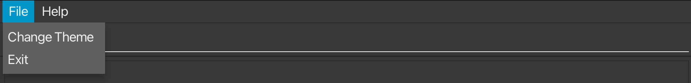

Welcome to EduConnect – a tool designed to help teachers manage student and teacher details with speed and simplicity. EduConnect streamlines your everyday tasks, allowing you to organize important information in a fast, efficient way. By typing commands, you can quickly update, search, and handle details with minimal effort, making it a valuable companion for busy school environments.

* Table of Contents
{:toc}

--------------------------------------------------------------------------------------------------------------------
## How to Use this User Guide
This section provides tips on how to effectively navigate through the user guide to find and understand the information you need quickly.
### Glossary

This section defines key terms and concepts used throughout the user guide.

- **Command**: A text instruction that you type into the command box to perform a specific action in EduConnect.
- **Parameter**: A value that you provide to a command to specify details about the action to be performed.
- **Index**: A number that refers to the position of an item in a list.
- **Attribute**: A specific characteristic or property of a person, such as name, class, or attendance.
- **Format**: The required structure for entering commands in EduConnect.
- **Syntax**: The specific arrangement of characters and parameters required to execute a command correctly.
- **Constraints**: The rules or conditions that a parameter must meet.

### Annotated Box Conventions

This section explains the different types of annotated boxes used in the user guide to highlight important information.

{: .alert .alert-info}
> :information_source: **Note:**
>
> This box contains additional information that can help you use EduConnect more effectively.

{: .alert .alert-success}
> :bulb: **Tip:**
>
> This box contains helpful tips to enhance your experience with EduConnect.

{: .alert .alert-warning}
> :exclamation: **Warning:**
>
> This box contains warnings about potential issues or important things to be aware of.

--------------------------------------------------------------------------------------------------------------------

## Quick start

1. Check that Java is installed:
   - EduConnect requires **Java 17 or higher** to run. If you're not sure if you have the correct Java version installed, you can click [here for the relevant instructions](https://www.oracle.com/java/technologies/javase/jdk17-archive-downloads.html).

2. Download EduConnect onto your computer:
   - Download the latest version of EduConnect by clicking [here](https://github.com/AY2425S1-CS2103T-F12-2/tp/releases).

3. Move the file to a folder:
   - After downloading, place the `educonnect.jar` file in any folder on your computer where you'd like to store the app.

4. Open EduConnect:
   - Open the "Command Prompt" (for Windows) or "Terminal" (for Mac/Linux).
   - Type `cd` followed by the folder location where you saved the EduConnect file. For example:
     - On Windows: `cd C:\Users\YourName\Documents\EduConnect`
     - On Mac/Linux: `cd /Users/YourName/Documents/EduConnect`
   - Then type this command to start the app:
   
        `java -jar educonnect.jar`
   - After a few seconds, the EduConnect window will appear with some sample data to help you get started.
   

5. Enter a command:
   - Type a command in the command box and press **Enter** to send it. For example, typing `help` and pressing Enter will open a help window.

    Here are some commands you can try:
    - `list`: Displays all the student and teacher details.

    - `student /name John Doe /gender male /contact 98765432 /email johnd@example.com /address 311, Clementi Ave 2, #02-25 /subject Physics /classes 7A,7B /attendance 0 /nok Bob Doe /emergency 87654321`: Adds a new student with the specified details

    - `delete 3`: Deletes the 3rd contact shown in the current list.

    - `clear`: Deletes all contacts.

    - `exit`: Exits the app.

    For more detailed explanations of each command, see the [Features](#features) section below.

--------------------------------------------------------------------------------------------------------------------

## Features

### Parameter Details
The table below provides a brief explanation of each parameter associated with a Teacher/ Student in EduConnect. It also details the constraints of each parameter when used in a command.

{: .alert .alert-warning}
> :exclamation: **Warning:**
> Ensure that the constraints for each parameter are met when entering the command. Failure to adhere to these constraints may result in an error.

| Parameter           | Definition                                                        | Constraints                                                                                                            | Examples                                                                   |
|---------------------|-------------------------------------------------------------------|------------------------------------------------------------------------------------------------------------------------|----------------------------------------------------------------------------|
| `NAME`              | The name of the person.                                           | - Must only contain alphanumeric characters and spaces   - Compulsory field                                        | `John Doe`, `Elizabeth Chua`                                               |
| `GENDER`            | The gender of the person.                                         | - Must be either `male` or `female`  - Compulsory field                                                            | `male`, `female`                                                           |
| `PHONE_NUMBER`      | The contact number of the person.                                 | - Must be exactly 8 digits long as according to Singapore's phone numbers - Compulsory field                           | `98765432`, `12345678`                                                     |
| `EMAIL`             | The email address of the person.                                  | - Must be in the format `example@domain.com`  - Compulsory field                                                   | `johnd@example.com`, `elizchua@yahoo.com`                                  |
| `ADDRESS`           | The residential address of the person.                            | - Any value is allowed   - Compulsory field                                                                        | `311, Clementi Ave 2, #02-25`, `Blk 30 Lorong 3 Serangoon Gardens, #07-18` |
| `SUBJECT`           | The subject taught by the teacher or taken by the student.        | - Must only contain alphanumeric characters and spaces   - Compulsory field                                        | `Physics`, `English`                                                       |
| `CLASSES`           | The classes associated with the person.                           | - Must only contain alphanumeric characters   - Multiple classes are separates by a comma   - Compulsory field | `7A`, `5A, 8C`                                                             |
| `ATTENDANCE`        | The attendance count of the student.                              | - Must be a non-negative integer   - Compulsory field                                                              | `0`, `5`                                                                   |
| `INDEX`             | The position of the person in the displayed list.                 | - Must be a positive integer and less than or equal to the largest index displayed on the GUI                          | `1`, `2`, `3`                                                              |
| `ATTRIBUTE`         | The attribute by which the list is to be sorted.                  | - Must be one of `name`, `subject`, `class` or `attendance`.                                                           | `name`, `subject`, `class`, `attendance`                                   |
| `TAG`               | A label assigned to a person for categorization.                  | - Must be a non-empty string.                                                                                          | `friend`, `family`                                                         |
| `NEXT_OF_KIN`       | The next of kin of the student.                                   | - Follows the same specifications as `NAME`                                                                            | `John Doe`, `Elizabeth Chua`                                               |
| `EMERGENCY_CONTACT` | The contact to use in cases of emergencies involving the student. | - Follows the same specifications as `PHONE_NUMBER`                                                                    | `98765432`, `12345678`                                                     |

{: .alert .alert-info}

> **:information_source: Notes about the command format:** 
>
> * Words in `UPPER_CASE` are the parameters to be supplied by the user. 
  e.g. in `add /name NAME`, `NAME` is a parameter which can be used as `add /name John Doe`.
>
>* Items in square brackets are optional. 
  e.g `edit [/name NAME] [/contact PHONE_NUMBER]` can be used as `edit /name John` or as `edit /contact 94567732` or as `edit /name John /contact 94567732`.
>
> * Items with `…`​ after them can be used multiple times including zero times. 
  e.g. `[/tag TAG]…​` can be used as ` ` (i.e. 0 times), `/tag friend`, `/tag friend /tag family` etc.
>
> * Parameters can be in any order. 
  e.g. if the command specifies `/name NAME /contact PHONE_NUMBER`, `/contact PHONE_NUMBER /name NAME` is also acceptable.
>
> * Extraneous parameters for commands that do not take in parameters (such as `help`, `list`, `exit` and `clear`) will be ignored. 
  e.g. if the command specifies `help 123`, it will be interpreted as `help`.
>
> * If you are using a PDF version of this document, be careful when copying and pasting commands that span multiple lines as space characters surrounding line-breaks may be omitted when copied over to the application.

### Viewing help : `help`

Shows a message explaining how to access the help page.

Format: `help`

### Changing themes:

Allows changing of a theme from Light Mode to Dark Mode and vice versa

Under the `File` menu, select `Change Theme` button to switch between the 2 different themes

### Adding a student: `student`

Adds a student to EduConnect.

Format: `student /name NAME /gender GENDER /contact PHONE_NUMBER /email EMAIL [/address ADDRESS] /subject SUBJECT /classes CLASSES [/attendance ATTENDANCE] /nok NEXT_OF_KIN /emergency EMERGENCY_CONTACT`

{: .alert .alert-success}
> :bulb: **Tip:**
>
> The parameters need not be specified in that order

{: .alert .alert-info}
> :information_source: **Note:**
>
> The address and attendance fields are optional when creating a student.
> If not specified, attendance will default to 0.

Example:
* `student /name John Doe /gender male /contact 98765432 /email johnd@example.com /address 311, Clementi Ave 2, #02-25 /subject Physics /classes 7A,7B /attendance 0 /nok Bob Doe /emergency 87654321` Adds a student with:
  * the name John Doe
  * the gender male
  * the contact number 9876 5432
  * the email address johnd@example.com
  * the address 311, Clementi Ave 2, #02-25
  * the subject taken as Physics
  * the classes 7A and 7B
  * a starting attendance of 0 days
  * the next of kin whose name is Bob Doe
  * an emergency contact 8765 4321

### Adding a teacher: `teacher`

Adds a teacher to EduConnect.

Format: `teacher /name NAME /gender GENDER /contact PHONE_NUMBER /email EMAIL [/address ADDRESS] /subject SUBJECT /classes CLASSES`

{: .alert .alert-success}
> :bulb: **Tip:**
>
> The parameters need not be specified in that order

{: .alert .alert-info}
> :information_source: **Note:**
>
> The address field is optional when creating a teacher.

Example:
* `teacher /name Elizabeth Chua /gender female /contact 95673211 /email elizchua@yahoo.com /address Blk 30 Lorong 3 Serangoon Gardens, #07-18 /subject English /classes 5A, 8C` Adds a teacher with:
    * the name Elizabeth Chua
    * the gender female
    * the contact number 9567 3211
    * the email address elizchua@yahoo.com
    * the address Blk 30 Lorong 3 Serangoon Gardens, #07-18
    * the subject she teaches as English
    * the classes she teaches 5A and 8C

### Listing all persons : `list`

Shows a list of all students and teachers in EduConnect.

Format: `list`

### Editing a person : `edit`

Edits an existing student or teacher in EduConnect.

Format: `edit INDEX [/name NAME] [/gender GENDER] [/contact PHONE] [/email EMAIL] [/address ADDRESS] [/subject SUBJECT] [/classes CLASSES] [/tags TAGS] [/nok NEXT_OF_KIN] [/emergency EMERGENCY_CONTACT]`

* Edits the person at the specified `INDEX`. The index refers to the index number shown in the displayed person list. The index **must be a positive integer** 1, 2, 3, …​
* At least one of the optional fields must be provided.
* Existing values will be updated to the input values.

Examples:
*  `edit 1 /contact 91234567 /email johndoe@example.com` Edits the phone number and email address of the 1st person in the displayed list to be `91234567` and `johndoe@example.com` respectively.
*  `edit 2 /name Betsy Crower` Edits the name of the 2nd person in the displayed list to be `Betsy Crower`.

### Locating persons by name: `find`

Finds persons whose names contain any of the given keywords.

Format: `find [/name NAME] [/gender GENDER] [/contact PHONE] [/email EMAIL] [/address ADDRESS] [/subject SUBJECT] [/classes CLASSES]`

* At least one of the optional fields must be provided.
* The search is case-insensitive. e.g `hans` will match `Hans`
* The order of the keywords does not matter. e.g. `/name Hans Bo` will match `Bo Hans`
* Only full words will be matched e.g. `/name Han` will not match `Hans`
* Persons matching at least one field will be returned (i.e. `OR` search).
  e.g. `/name Hans Bo` will return `Hans Gruber`, `Bo Yang`

Examples:
* `find /name John` returns `John` and `John Doe`
* `find /name Mary /classes 7A` returns `Mary Tan` (who has the name "Mary") and `David Lee` (who teaches or is in class 7A)  

### Sorting persons : `sort`

Sorts the list of people by name, subject, class, or attendance.

Format: `sort [ATTRIBUTE]`

* Sorts the results based on the specified `ATTRIBUTE`. The available attributes are `name`, `subject`, `class`, `attendance`.
* `sort name` Sorts the results by name in alphabetical order.
* `sort subject` Sorts the results by the subjects they take in alphabetical order. Only the **first subject** in each person's list of subjects is considered when sorting.
* `sort class` Sorts the results by class in alphanumerical order. Only the **first class** in each person's list of classes is considered when sorting. 
* `sort attendance` Sorts the results by the number of days attended by students in descending order. Teachers, who do not have an attendance count, are placed at the end of the list
* The command applies to the current list of displayed results. 
* Sorting is case-insensitive.

Examples:
* `list` followed by `sort name` sorts all students in the address book by name.

{: .alert .alert-info}
> :information_source: **Note:**
> Explanation on Sorting by First Item: 
> When sorting by attributes such as subject or class, only the first item in the list of subjects or classes is considered. For instance:
> * If a student has subjects listed as "Math, Physics, Chemistry", the `sort subject` command will use "Math" as the primary sorting key. 
> * Similarly, if a teacher is associated with classes "5A, 7C, 8B", the `sort class` command will use "5A" as the sorting key.
### Undoing the last command : `undo`

Reverts the most recent change made to the address book.

Format: `undo`

* Reverts the last modification command, restoring the address book to its previous state.
* Only commands that modify the data (e.g., add, delete, edit, clear) can be undone.
* Multiple undo commands can be used consecutively to revert multiple changes, one step at a time.

Examples:
* `add John Doe` followed by `undo` removes John Doe from the address book.
* `delete 3` followed by `undo` restores the deleted student back to the list.

### Redoing the last command : `redo`

Restores the most recently undone change in the address book.

Format: `redo`

* Reapplies the last undone modification command, returning the address book to the state before the `undo`.
* Only commands that were undone can be redone.
* Multiple `redo` commands can be used consecutively to reapply multiple changes, one step at a time.

Examples:
* `add John Doe` followed by `undo` and then `redo` adds John Doe back to the address book.
* `delete 3` followed by `undo` and then `redo` removes the student at position 3 from the list

### Deleting a person : `delete`

Deletes the specified person or persons from EduConnect.

Format: `delete INDEX…​`

* You can delete one or more people by specifying their `INDEX`(es) in the list.
* The index refers to the index number shown in the displayed person list.
* The index **must be a positive integer** 1, 2, 3, …​

Examples:
* `list` followed by `delete 2` deletes the 2nd person in EduConnect.
* `find /name Betsy` followed by `delete 1` deletes the 1st person in the results of the `find` command.
* `delete 1 2 3` deletes the 1st, 2nd and 3rd persons in the list in one command.

### Clearing entries : `clear`

Clears all entries from EduConnect or specific entries based on the provided criteria.

Format: `clear [/name NAME] [/gender GENDER] [/contact PHONE] [/email EMAIL] [/address ADDRESS] [/subject SUBJECT] [/classes CLASSES]`

* If no fields are provided, all entries will be cleared.
* If one or more optional fields are provided, only entries matching **at least one** of those fields will be cleared.

Examples:
* `clear` clears all entries in EduConnect.
* `clear /classes 7A` clears all entries related to class 7A (students or teachers).
* `clear /name John /subject Physics` clears entries for all persons named John or anyone associated with the subject Physics.

### Marking attendance of students : `mark`

Increases the attendance of all students in EduConnect by 1.

Format: `mark`

### Unmarking attendance of a particular student : `unmark`

Reduces the attendance of one or more students in EduConnect by 1.

Format: `unmark INDEX…​`

* You can unmark attendance for one or more students by specifying their INDEX(es) in the list.
* The index refers to the index number shown in the displayed person list.
* The index **must be a positive integer** 1, 2, 3, …​
* The person corresponding to the index must be a student.
* The student must have attended at least one day to be unmarked.
* the indexes entered must be unique.

Example:
* `unmark 2` educes the attendance of the student at index 2 in EduConnect by 1.
* `unmark 1 2 3` reduces the attendance of the 1st, 2nd, and 3rd students in the list by 1.

### Reset attendance of all students : `resetAttendance`

Resets the attendance of all students in EduConnect to 0.

Format: `resetAttendance`

### Exiting the program : `exit`

Exits the program.

Format: `exit`

### Saving the data

EduConnect data are saved in the hard disk automatically after any command that changes the data. There is no need to save manually.

### Editing the data file

EduConnect data are saved automatically as a JSON file `[JAR file location]/data/addressbook.json`. Advanced users are welcome to update data directly by editing that data file.

{: .alert .alert-warning}
> :exclamation: **Warning:**
> If your changes to the data file makes its format invalid, EduConnect will discard all data and start with an empty data file at the next run. Hence, it is recommended to take a backup of the file before editing it. 
  Furthermore, certain edits can cause the EduConnect to behave in unexpected ways (e.g., if a value entered is outside of the acceptable range). Therefore, edit the data file only if you are confident that you can update it correctly.

--------------------------------------------------------------------------------------------------------------------

## FAQ

**Q**: How do I transfer my data to another Computer? 
**A**: First, install EduConnect on the new computer. Then, copy the data file from your old computer and replace the empty data file in the new installation folder with your existing one. This will transfer all your previous data to the new computer.

--------------------------------------------------------------------------------------------------------------------

## Known issues

1. **When using multiple screens**, if you move the application to a secondary screen, and later switch to using only the primary screen, the GUI will open off-screen. The remedy is to delete the `preferences.json` file created by the application before running the application again.
2. **If you minimize the Help Window** and then run the `help` command (or use the `Help` menu, or the keyboard shortcut `F1`) again, the original Help Window will remain minimized, and no new Help Window will appear. The remedy is to manually restore the minimized Help Window.

--------------------------------------------------------------------------------------------------------------------

## Command summary

| Action                | Format, Examples                                                                                                                                                                                                                                                                                                                                                    |
|-----------------------|---------------------------------------------------------------------------------------------------------------------------------------------------------------------------------------------------------------------------------------------------------------------------------------------------------------------------------------------------------------------|
| **Add Student**       | `student /name NAME /contact PHONE_NUMBER /email EMAIL /address ADDRESS [/tag TAG]…​ /attendance ATTENDANCE /nok NEXT_OF_KIN /emergency EMERGENCY_CONTACT`   e.g., `student /name John Doe /gender male /contact 98765432 /email johnd@gmail.com /address 311, Clementi Ave 2, #02-25 /subject Physics /classes 7A /attendance 0 /nok Bob Doe /emergency 87654321` |
| **Add Teacher**       | `teacher /name NAME /gender GENDER /contact PHONE_NUMBER /email EMAIL /address ADDRESS /subject SUBJECT /classes CLASSES`   e.g., `teacher /name Elizabeth Chua /gender female /contact 95673211 /email elizchua@yahoo.com /address Blk 30 Lorong 3 Serangoon Gardens, #07-18 /subject English /classes 5A, 8C`                                                 |
| **Clear**             | `clear [/name NAME] [/gender GENDER] [/contact PHONE] [/email EMAIL] [/address ADDRESS] [/subject SUBJECT] [/classes CLASSES]`  e.g., `clear`, `clear /name Jacob`                                                                                                                                                                                              |
| **Delete**            | `delete INDEX...`  e.g., `delete 3`, `delete 1 2 4`                                                                                                                                                                                                                                                                                                              |
| **Sort**              | `sort ATTRIBUTE` e.g.,`sort name`,`sort subject`                                                                                                                                                                                                                                                                                                                |
| **Undo**              | `undo`                                                                                                                                                                                                                                                                                                                                                              |
| **Redo**              | `redo`                                                                                                                                                                                                                                                                                                                                                              |
| **Edit**              | `edit INDEX [/name NAME] [/contact PHONE_NUMBER] [/email EMAIL] [/address ADDRESS]…​`  e.g.,`edit 2 /name James Lee /email jameslee@example.com`                                                                                                                                                                                                                 |
| **Find**              | `find [/name NAME] [/gender GENDER] [/contact PHONE] [/email EMAIL] [/address ADDRESS] [/subject SUBJECT] [/classes CLASSES]`  e.g., `find /name James /classes 8B`                                                                                                                                                                                              |
| **List**              | `list`                                                                                                                                                                                                                                                                                                                                                              |
| **Mark Attendance**   | `mark`                                                                                                                                                                                                                                                                                                                                                              |
| **Unmark Attendance** | `unmark INDEX…​`   e.g., `unmark 1`, `unmark 1 2 3`                                                                                                                                                                                                                                                                                                             |
| **Reset Attendance**  | `resetAttendance`                                                                                                                                                                                                                                                                                                                                                   |
| **Help**              | `help`                                                                                                                                                                                                                                                                                                                                                              |
