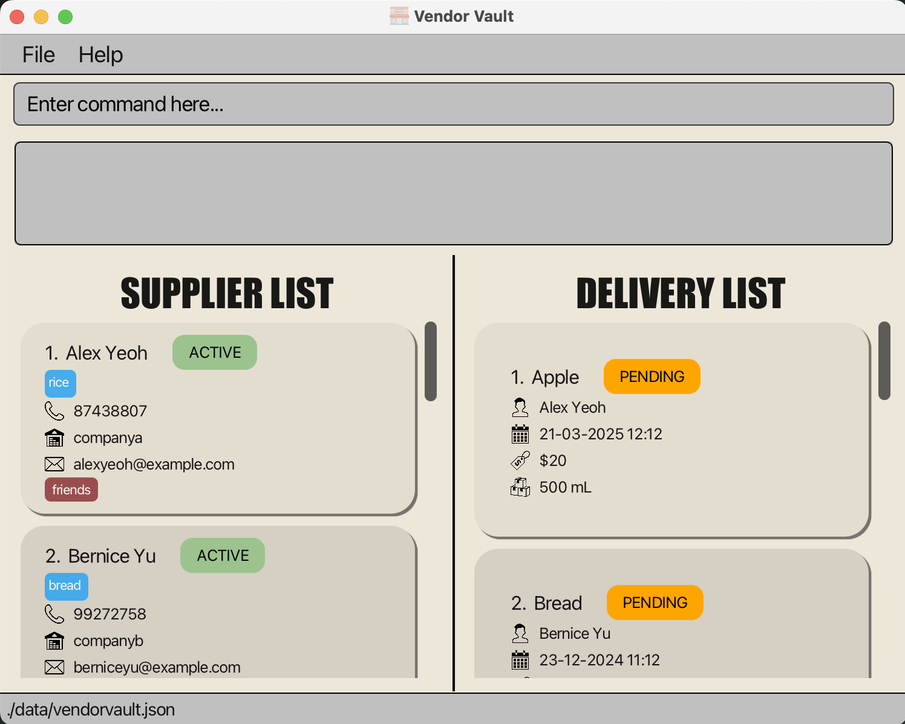

# VendorVault User Guide

VendorVault is a **desktop app for managing supplier contact information and deliveries, optimized for use via a Command Line Interface** (CLI). If you can type fast, VendorVault can get your contact management tasks done faster than traditional GUI apps. VendorVault specifically targets small convenience/grocery stores and aims to help them achieve higher efficiency!

--- 
# Table of Contents
<!-- * Table of Contents -->
1. [How to get started](#1-how-to-get-started)
2. [Setting up VendorVault](#2-setting-up-vendorvault)
3. [Features](#3-features)
    - 3.1. [Understanding the Command Syntax](#3-1-understanding-the-command-syntax)
    - 3.2. [General commands](#3-2-general-commands)
        - 3.2.1. [Viewing help](#3-2-1-viewing-help-help)
        - 3.2.2. [Viewing all deliveries and suppliers](#3-2-2-viewing-all-deliveries-and-suppliers-list-a)
        - 3.2.3. [Clearing all suppliers and deliveries](#3-2-3-clearing-all-suppliers-and-deliveries-clear)
        - 3.2.4. [Exiting the program](#3-2-4-exiting-the-program-exit)
    - 3.3. [Supplier commands](#3-3-supplier-commands)
        - 3.3.1. [Adding a supplier](#3-3-1-adding-a-supplier-add-s)
        - 3.3.2. [Listing all suppliers](#3-3-2-listing-all-suppliers-list-s)
        - 3.3.3. [Deleting a supplier](#3-3-3-deleting-a-supplier-delete-s)
        - 3.3.4. [Marking a supplier with a status](#3-3-4-marking-a-supplier-with-a-status-mark-s)
        - 3.3.5. [Finding suppliers](#3-3-5-finding-suppliers-find-s)
        - 3.3.6. [Sorting suppliers](#3-3-6-sorting-suppliers-sort-s)
    - 3.4. [Delivery commands](#3-4-delivery-commands)
        - 3.4.1. [Adding a delivery](#3-4-1-adding-a-delivery-add-d)
        - 3.4.2. [Listing all deliveries](#3-4-2-listing-all-deliveries-list-d)
        - 3.4.3. [Deleting a delivery](#3-4-3-deleting-a-delivery-delete-d)
        - 3.4.4. [Marking a delivery](#3-4-4-marking-a-delivery-mark-d)
        - 3.4.5. [Finding deliveries](#3-4-5-finding-deliveries-find-d)
        - 3.4.6. [Sorting deliveries](#3-4-6-sorting-deliveries-sort-d)
        - 3.4.7. [Upcoming deliveries](#3-4-7-upcoming-deliveries-upcoming)
    - 3.5. [Extended valid format guidelines](#3-5-extended-valid-format-guidelines)
        - 3.5.1. [Valid email address format](#3-5-1-valid-email-address-format)
        - 3.5.2. [Valid company name format](#3-5-2-valid-company-name-format)
4. [Managing my data](#4-managing-your-data)
   - 4.1. [Saving your data](#4-1-saving-the-data)
   - 4.2. [Editing your data directly](#4-2-editing-the-data-file)
   - 4.3. [Archiving your data files](#4-3-archiving-data-files-coming-in-v2-0)
5. [FAQ](#5-faq)
6. [Known Issues](#6-known-issues)
7. [Command Summary](#7-command-summary)
    - 7.1. [General Commands](#7-1-general-commands)
    - 7.2. [Supplier-specific Commands](#7-2-supplier-specific-commands)
    - 7.3. [Delivery-specific Commands](#7-3-delivery-specific-commands)
8. [Glossary](#8-glossary)

--------------------------------------------------------------------------------------------------------------------

# 1 How to get started

1. If you are new to Vendor Vault, we suggest starting from the [Setting up VendorVault section](#setting-up-vendorvault).

2. If you have already set up Vendor Vault and are looking for information of our commands and features, take a look at our [Features](#features) or [Command Summary](#command-summary) sections. 

3. If you’re unsure about any of the terms used in this User Guide, please refer to the [Glossary](#glossary) section for definitions and explanations.

[[Back to Table of Contents]](#table-of-contents)

--------------------------------------------------------------------------------------------------------------------

# 2 Setting up VendorVault 

1. Java is the toolset that will allow you to use VendorVault on your system. Hence, first you need to ensure that you have Java `17` or above installed on your Computer. If you are unsure, you can check by following the steps below:
   - 1a. Open up your command terminal. 
     * Windows users can open the terminal by typing in `Command Prompt` in the search bar located at the bottom left of the screen. 
     * Mac users can open the terminal by typing in `Terminal` using the spotlight search bar (accessed by pressing Command + Space).
     * Linux users can open for the command terminal by searching for the `Terminal` or `Console` in the Applications Menu.
   
   - 1b. Type in java -version to check if you have Java installed. If you have java installed you should see something like this:
     
   
   - 1c. If you do not have Java installed, you can download it from [here](https://www.oracle.com/java/technologies/downloads/#java17?er=221886).

2. Download the latest `vendorvault.jar` file from [here](https://github.com/AY2425S1-CS2103T-W14-1/tp/releases).
   

3. Upon downloading the `vendorvault.jar` file, copy the file to the folder you want to use as the _home folder_ for your VendorVault Application.

4. Open the command terminal (same as step 1a), type `cd [path-to-your-folder]` (path to the folder you put the jar file in) and use the `java -jar vendorvault.jar` command to run the application. 
   

A GUI similar to the below should appear in a few seconds. Note how the app contains some sample data.

 

5. Type commands in the command box and press Enter to execute it. e.g. typing **`help`** and pressing Enter will open the help window. 
   Some example commands you can try:

   * `list -a` : Lists all suppliers and deliveries.

   * `add -s n/John Doe p/98765432 e/johnd@example.com com/John street, block 123, #01-01 pro/iPhone` : Adds a supplier named `John Doe` to VendorVault.

   * `delete -d 3` : Deletes the 3rd delivery shown in the current delivery list.

   * `exit` : Exits the app.

6. Refer to the [Features](#features) below for details of each command.
 

[[Back to Table of Contents]](#table-of-contents)

--------------------------------------------------------------------------------------------------------------------

# 3 Features

## 3.1 Understanding the Command Syntax
<box type="info" seamless>

**Notes about the command format:** 

* Words in `UPPER_CASE` are the parts of the parameters to be supplied by the user. 
  e.g. in `add n/NAME`, `NAME` is a parameter which can be used as `add n/John Doe`.

* Items in square brackets are optional. 
  e.g `n/NAME [t/TAG]` can be used as `n/John Doe t/friend` or as `n/John Doe`.

* Items with `…`​ after them can be used multiple times including zero times. 
  e.g. `[t/TAG]…​` can be used as ` ` (i.e. 0 times), `t/friend`, `t/friend t/family` etc.

* Parameters can be in any order. 
  e.g. if the command specifies `n/NAME p/PHONE_NUMBER`, `p/PHONE_NUMBER n/NAME` is also acceptable.

* For the commands `help` `clear` and `exit`, extra information/words following the command after a space will be ignored. 
  e.g. if the command specifies `exit 123 `, it will be interpreted as `exit`. However, `exit1` will not be recognized as a command.

* For all parameters, starting and ending spaces will be trimmed.

* For all commands except `find`, `sort` and `upcoming`, the displayed list of suppliers/deliveries will be the unfiltered and unsorted list of all suppliers/deliveries after executing the command. 
  For `find`, `sort` and `upcoming` commands, the displayed list will be the corresponding filtered/sorted list of supplier/deliveries. 

* If you are using a PDF version of this document, be careful when copying and pasting commands that span multiple lines as space characters surrounding line-breaks may be omitted when copied over to the application.
</box>

[[Back to Table of Contents]](#table-of-contents)

---

## 3.2 General Commands

### 3.2.1 Viewing help : `help`

Shows a message explaining how to access the help page.

Format: `help`

##### Here's how it would look like in the app:

[[Back to Table of Contents]](#table-of-contents)

---

### 3.2.2 Viewing all deliveries and suppliers : `list -a`

Lists all suppliers and deliveries in the VendorVault.

Format: `list -a`

<box type="caution" seamless>
Warnings:
- No other parameters should be given for this command.
- Give at least one space between list and -a.
</box>

[[Back to Table of Contents]](#table-of-contents)

---

### 3.2.3 Clearing all suppliers and deliveries : `clear`

Clears all data regarding suppliers and deliveries in vendor vault.

Format: `clear`

[[Back to Table of Contents]](#table-of-contents)

---

### 3.2.4 Exiting the program : `exit`

Exits the program.

Format: `exit`

[[Back to Table of Contents]](#table-of-contents)

---

## 3.3 Supplier Commands 

### 3.3.1 Adding a supplier: `add -s`

Adds a supplier to VendorVault.

Format: `add -s n/NAME p/PHONE e/EMAIL com/COMPANY [t/TAG]…​ [pro/PRODUCT]…​`

<box type="details" seamless>

Parameters:

- `n/NAME`: `NAME` is the supplier's name. It must be alphanumeric, and cannot be blank.
- `p/PHONE`: `PHONE` is the supplier's phone number. It must be numeric, and contain at least 3 digits.
- `e/EMAIL`: `EMAIL` is the supplier's email address. It must be in a valid email address format, and cannot be blank.
  - Please see [below](#valid-email-address-format) for more information on what constitutes a valid email address format.
- `com/COMPANY`: `COMPANY` is the company associated with the supplier. It must be in a valid company name format, and cannot be blank.
  - Please see [below](#valid-company-name-format) for more information on what constitutes a valid company name format.
- `[t/TAG]`: `TAG` is the tag(s) associated with the supplier. It must be alphanumeric, and only contain between 1 and 50 (inclusive) characters.
- `[pro/PRODUCT]`: `PRODUCT` is the product(s) associated with the supplier. It must be alphanumeric, only contain between 1 and 50 (inclusive) characters, and spaces are also allowed.
  - One space is counted as one character.
  - A product name cannot be made up of only spaces.

**Tip:** A supplier can have any number of `TAG` and `PRODUCT` (including 0).
- To include multiple `TAG`, use multiple `t/TAG`.

</box>

<box type="warning" seamless>

**Warnings**:
- At least one space is needed between `add` and `-s`.
- A warning will be given if the user tries to add a duplicate supplier.
- A supplier is considered duplicate if they have the same `NAME` and `COMPANY`.
  - Comparison between different `NAME`is case-sensitive.
  - Comparison between different `COMPANY` is case-insensitive.
- Adding duplicate `TAG`/`PRODUCT` will result in only one copy being added to the supplier.
  - Comparison between different `TAG`/`PRODUCT` is case-sensitive.
- A supplier has a default `STATUS` of `active`.

</box>

Examples:
- `add -s n/John Doe p/98765432 e/johnd@example.com com/companyA t/friends t/owesMoney pro/rice pro/bread`
- `add -s n/Betsy Crowe p/98223232 e/betsycrowe@example.com com/Newgates t/urgent pro/soap`

Expected output:
- `New supplier added: John Doe; Phone: 98765432; Email: johnd@example.com; Company: companya; Tags: [owesMoney][friends]; Products: [bread][rice]; Status: active`
- `New supplier added: Betsy Crowe; Phone: 98223232; Email: betsycrowe@example.com; Company: newgates; Tags: [urgent]; Products: [soap]; Status: active`

#### Here's how it would look like in the app:
TO UPDATE IMAGE AFTER FINAL UPDATE TO APPLICATION!!!

[[Back to Table of Contents]](#table-of-contents)

---

### 3.3.2 Listing all suppliers: `list -s`

Shows a list of all suppliers in VendorVault. The delivery list will not be affected.

Format: `list -s`

<box type="warning" seamless>

**Warnings**:
- At least one space is needed between `list` and `-s`.
- No other parameters should be given for this command.

</box>

[[Back to Table of Contents]](#table-of-contents)

---

### 3.3.3 Deleting a supplier : `delete -s`

Deletes a supplier from the list of suppliers in VendorVault.

Format: `delete -s INDEX`

<box type="details" seamless>

Parameters:

- `INDEX`: The index of the supplier to be deleted in the displayed list. Must be a positive numeric number.

</box>

<box type="warning" seamless>

**Warnings**:
- At least one space is needed between `list` and `-s`.
- Only one supplier can be deleted by one command.

</box>

Example:
`delete -s 3`

Expected output:
Supplier at index 3 is deleted, assuming it existed initially. Otherwise, an error message will be shown.

#### Here's how it would look like in the app:
TO UPDATE IMAGE AFTER FINAL UPDATE TO APPLICATION!!!

[[Back to Table of Contents]](#table-of-contents)

---

### 3.3.4 Marking a supplier with a status : `mark -s`

The `mark` command is used to mark a supplier as either **active** or **inactive**.
in VendorVault. This helps you keep track of which suppliers are currently active for deliveries and which are not.

Format: `mark -s INDEX STATUS`

<box type="details" seamless>

Parameters:
- `INDEX`: The index of the supplier in the list. Must be a number greater than 0 and must not be blank.
- `STATUS`: Must be one of the following: `active`, `inactive` and must not be blank.

</box>

<box type="warning" seamless>

**Warnings**:
- At least one space between `mark` and `-s` is needed.
- At least one space between `-s` and `INDEX` is needed.
- At least one space between `INDEX` and `STATUS` is needed.
- Both parameters must be given.
- `INDEX` and `STATUS` used are case-sensitive.
- A supplier has a default status of `active`.
- A supplier with an `inactive` status signifies that the supplier is not currently active for deliveries.
  However, marking an `active` supplier as `inactive` will not delete the delivery associated with the supplier from the delivery list
  or affect the delivery status in any way.
</box>

#### Example
To mark the supplier at index 3 as active:

    mark -s 3 active

A success message will be displayed if the supplier is successfully marked as active.

#### Here's how it would look like in the app:

[[Back to Table of Contents]](#table-of-contents)

---

### 3.3.5 Finding suppliers: `find -s`

The `find -s` command is used to find a supplier in VendorVault. 
This helps you to search for a supplier based on the supplier name, company, or product. 

Format: `find -s n/NAME com/COMPANY pro/PRODUCT`

Parameters:

- `n/NAME`: Must be alphanumeric, and must not be blank.
- `com/COMPANY`: `COMPANY` is the company associated with the supplier. It must be in a valid company name format, and cannot be blank.
    - Please see [below](#valid-company-name-format) for more information on what constitutes a valid company name format.
- `pro/PRODUCT`: Must be alphanumeric, can include spaces but must not start with a space, 
and must be between 1 and 50 (inclusive) characters long.

<box type="tip" seamless>

**Tip:**
- The find result(s) will contain/satisfy all the given parameters.
- eg: If you execute the command `find -s n/link com/NU`, 
the result will contain suppliers whose name contains "link" and company contains "NU" if any.
</box>

<box type="warning" seamless>

**Warnings**:
- At least one non-empty parameter must be given.
- No duplicate parameters can be used.
- At least one space between `find` and `-s` is needed.
- At least one space between '-s' and the next parameter is needed.
- When more than one parameter is used, at least one space between each parameter is needed.
- `NAME`, `COMPANY` and `PRODUCT` are case-insensitive.
</box>

#### Example
To find the supplier whose name contains "link" and company contains "NU":

    find -s n/link com/NU

#### Here's how it would look like in the app:

[[Back to Table of Contents]](#table-of-contents)

---

### 3.3.6 Sorting suppliers: `sort -s`

The `sort -s` command is used to sort suppliers according to the supplier name in VendorVault.
This helps you to view the suppliers in a different order (ascending or descending).

Format: `sort -s so/SORT_ORDER sb/SORT_BY`

Parameters:
- `SORT_ORDER`: Must be either 'a' for ascending or 'd' for descending.
- `SORT_BY`: Must be 'n' for name. (Current version of VendorVault only supports sorting by name)

<box type="warning" seamless>

**Warnings**:
- At least one space between `sort` and `-s` is needed.
- At least one space between `-s` and `so` is needed.
- At least one space between `SORT_ORDER` and `sb` is needed.
- All parameters must be given.
- No duplicate parameters can be used.
- `SORT_ORDER` and `SORT_BY` are case-sensitive.
- The sort command will only sort all suppliers in VendorVault.
- i.e.
    - If you have searched for a supplier using the `find` command,
      the sort command will not sort the previous results of the `find` command, but will sort all suppliers in VendorVault.
</box>

#### Example
To sort suppliers by name in descending order:

    sort -s so/d sb/n

A success message will be displayed if the suppliers are successfully sorted.
#### Here's how it would look like in the app:

[[Back to Table of Contents]](#table-of-contents)

---

## 3.4 Delivery Commands 

### 3.4.1 Adding a delivery: `add -d`

Adds a delivery to VendorVault.

Format: `add -d on/DELIVERY_DATE_TIME s/SUPPLIER_INDEX pro/PRODUCT q/QUANTITY c/COST`

<box type="details" seamless>

Parameters:

- `on/DELIVERY_DATE_TIME`: `DELIVERY_DATE_TIME` is the date and time of delivery. It must be in dd-MM-yyyy hh:mm format, and cannot be blank.
- `s/SUPPLIER_INDEX`:`SUPPLIER_INDEX` is the index of supplier currently displayed. It must be a number between 1 and the total number of suppliers currently displayed (inclusive), and cannot be blank.
- `pro/PRODUCT`: `PRODUCT` is the product associated with the delivery. It must be alphanumeric, only contain between 1 and 50 (inclusive) characters, and spaces are also allowed.
    - One space is counted as one character.
    - `PRODUCT` cannot be made up of only spaces.
- `q/QUANTITY`: `QUANTITY` is the amount of product to be delivered with units. It must be a number greater than 0 followed by a space, and a unit, and must not be blank.
    - `QUANTITY` cannot have decimal places.
    - `QUANTITY` units are case sensitive.
    - Accepted units for `QUANTITY` are `kg`, `g`, `L`, `mL`, `units`. 
- `c/COST`: `COST` is the total cost for the delivery. It must be a number greater than 0 with up to 2 decimal places allowed, and cannot be blank.

**Tips:** 
- Day, month, hour and minute of DELIVERY_DATE_TIME must be in double digits!
  - example: 03-03-2024 02:01

</box>

<box type="warning" seamless>

**Warnings**:
- At least one space is needed between `add` and `-d`.
- At least one space is needed between `-d` and the first parameter.
- At least one space is needed between parameters.
- A warning will be given if the user tries to add a duplicate delivery.
  - A delivery is considered duplicate and will not be added again if it has the same `DELIVERY_DATE_TIME`, `SUPPLIER`, `PRODUCT`, `QUANTITY`, `COST` and `STATUS` as an existing delivery.
      - Comparison between different `PRODUCT`is case-sensitive.
- A delivery has a default `STATUS` of `PENDING`.
- A delivery cannot be added if the supplier of the chosen `SUPPLIER_INDEX` has status `INACTIVE`.

</box>

Examples:
- `add -d on/18-06-2024 17:00 s/1 pro/bread q/500 g c/25.50`
- `add -d on/19-12-2022 08:00 s/2 pro/rice q/50 kg c/50.20 `

Expected output:
- Delivery details is shown and paired to supplier at index 1, assuming there is at least one supplier displayed. Otherwise, an error message will be shown.
- Delivery details is shown and paired to supplier at index 2, assuming there is at least two suppliers displayed. Otherwise, an error message will be shown.

#### Here's how it would look like in the app:
TO UPDATE IMAGE AFTER FINAL UPDATE TO APPLICATION!!!

[[Back to Table of Contents]](#table-of-contents)

---

### 3.4.2 Listing all deliveries: `list -d`

Shows a list of all deliveries in VendorVault. The supplier list will not be affected.

Format: `list -d`

<box type="warning" seamless>

**Warnings**:
- At least one space is needed between `list` and `-d`.
- No other parameters should be given for this command.

</box>

[[Back to Table of Contents]](#table-of-contents)

---

### 3.4.3 Deleting a delivery : `delete -d`

Deletes the specified delivery from the address book.

Format: `delete -d INDEX`

<box type="details" seamless>

Parameters:
- `INDEX`: The index of the delivery to be deleted in the displayed list. Must be a positive numeric number.

</box>

<box type="warning" seamless>

**Warnings**:
- At least one space is needed between `delete` and `-d`.
- Spacing between `-d` and `INDEX` is not compulsory.
- Only one delivery can be deleted one command.
  - `delete -d 1 3 5` is not allowed.

</box>

Examples:
- `delete -d 2`
- `find -d pro/ bread` followed by `delete -d 1` deletes the 1st delivery in the results of the `find` command.

Expected output:
- Delivery at index 2 of the displayed list will be deleted, assuming there are at least 2 deliveries in the displayed list. Otherwise, an error message will be shown.
- Delivery at index 1 of the displayed list will be deleted, assuming there is at least 1 delivery in the displayed list after the find command is executed. Otherwise, an error message will be shown.

#### Here's how it would look like in the app:

[[Back to Table of Contents]](#table-of-contents)

---

### 3.4.4 Marking a delivery : `mark -d`

Marks the specified delivery in VendorVault with the specified `STATUS`.

Format: `mark -d INDEX STATUS`

<box type="details" seamless>

Parameters:

- `INDEX`: The index of the delivery to be marked in the displayed list. It must be a number between 1 and the total number of deliveries displayed (inclusive), and cannot be blank.
- `STATUS`: The status of delivery. It must be one of the following values: `PENDING`, `DELIVERED`, `CANCELLED`, and cannot be blank.

</box>

<box type="warning" seamless>

**Warnings**:
- At least one space is needed between `mark` and `-d`.
- At least one space is needed between `-d` and `INDEX`.
- At least one space is needed between `INDEX` and `STATUS.
- `STATUS` is not case-sensitive. `pending`, `delivered`, `cancelled` can be accepted as well.
- An error message will be given if the user tries to mark a delivery with a status that is the same as the existing status.

</box>

Examples:
- `mark -d 2 DELIVERED`
- `find -d pro/ bread` followed by `mark -d 1 cancelled`

Expected output:
- Delivery at index 2 of the displayed list has status shown as DELIVERED, assuming it has a different status initially. Otherwise, an error message will be shown.
- Delivery at index 1 of the displayed list has status shown as CANCELLED, assuming it has a different status initially and there is at least one delivery in the displayed list after the find command is executed. Otherwise, an error message will be shown.

#### Here's how it would look like in the app:

[[Back to Table of Contents]](#table-of-contents)

---

### 3.4.5 Finding deliveries: `find -d`

Find deliveries based on attributes of the delivery, like the delivery date and time, status, supplier and product.

Format: `find -d on/DELIVERY_DATE_TIME stat/STATUS s/SUPPLIER_INDEX pro/PRODUCT`

<box type="details" seamless>

Parameters:

- `on/DELIVERY_DATE_TIME`: `DELIVERY_DATE_TIME` must be in dd-MM-yyyy hh:mm format and must not be blank.
- `stat/STATUS`: `STATUS` must be one of the following: PENDING, DELIVERED, CANCELLED and must not be blank.
- `s/SUPPLIER_INDEX`: `SUPPLIER_INDEX` must be a number between 1 and the total number of suppliers displayed (inclusive), and cannot be blank.
- `pro/PRODUCT`: `PRODUCT` must be alphanumeric, only contain between 1 and 50 (inclusive) characters, and spaces are also allowed.
    - One space is counted as one character.
    - `PRODUCT` cannot be made up of only spaces.

</box>

<box type="warning" seamless>

**Warnings**:
- At least one space is needed between `find` and `-d`.
- At least one parameter must be given.
- At least one space is needed between `-d` and the first parameter.
- When using more than one parameter, at least one space is needed between parameters.
- `STATUS` and `PRODUCT` are case-insensitive.
- No duplicate parameter can be used.
  - `find -d pro/milk pro/bread` is not allowed.
- Find result(s) will contain/satisfy all the given parameters.

</box>

Example:
- `find -d on/ 28-06-2025 17:00 pro/ milk`

Expected output:
- Deliveries of products that contains "milk" on "28-06-2025 17:00", if any, will be displayed.

#### Here's how it would look like in the app:

[[Back to Table of Contents]](#table-of-contents)

---

### 3.4.6 Sorting deliveries: `sort -d`

The `sort -d` command is used to sort deliveries in VendorVault based on the delivery cost, date and time or status.
This helps you to view the deliveries in a different order (ascending or descending).

Format: `sort -d so/SORT_ORDER sb/SORT_BY`

<box type="details" seamless>

Parameters:

- `so/SORT_ORDER`: `SORT_ORDER` must be either `a` for ascending or `d` for descending, and must not be blank.
- `sb/SORT_BY`: `SORT_BY` must be either `c` for cost, `d` for date and time or `s` for status, and must not be blank.

</box>

<box type="warning" seamless>

**Warnings**:
- At least one space is needed between `sort` and `-d`.
- At least one space is needed between `-d` and `so/SORT_ORDER`.
- At least one space is needed between `so/SORT_ORDER` and `sb/SORT_BY`.
- All parameters must be given.
- No duplicate parameter can be used.
  - `sort -d so/a sb/c sb/d` is not allowed.
- `SORT_ORDER` and `SORT_BY` are case-sensitive.
- Using `sort -d` command will sort and display all deliveries in VendorVault even if you have previously used the `find -d` command.

</box>

<box type="tip" seamless>

**Tip:** Sorting deliveries by status in ascending order will display deliveries in the following order: `CANCELLED`, `DELIVERED`, `PENDING`

</box>

Example:
- `sort -d so/a sb/c`

Expected output:
- All deliveries, if any, will be sorted by cost in ascending order.

    

#### Here's how it would look like in the app:

[[Back to Table of Contents]](#table-of-contents)

---

### 3.4.7 Upcoming deliveries: `upcoming`

Shows a list of pending deliveries in VendorVault based on delivery date and time. You can choose to view all pending deliveries within a specified date range or
before or after a given date.

Format: `upcoming aft/DELIVERY_DATE_TIME bef/DELIVERY_DATE_TIME`

<box type="details" seamless>

Parameters:

- `aft/DELIVERY_DATE_TIME`: `DELIVERY_DATE_TIME` is the start date and time in which only deliveries with status`PENDING` after this date and time would be displayed. It must be in dd-MM-yyyy hh:mm format.
- `bef/DELIVERY_DATE_TIME`: `DELIVERY_DATE_TIME` is the end date and time in which deliveries with status `PENDING` before this date and time would be displayed. It must be in dd-MM-yyyy hh:mm format.

**Tip:**
- You can provide both parameters or just one parameter!

</box>

<box type="warning" seamless>

**Warnings**:
- At least one space is needed between `upcoming` and the first parameter.
- When using more than one parameter, at least one space is needed between parameters.
- At least one parameter must be provided.
- If both parameters are provided, then only deliveries with status`PENDING` and `DELIVERY_DATE_TIME` between the two specified parameters are displayed (not inclusive).
- 
</box> 

Examples:
- `upcoming aft/19-12-2022 08:00 bef/18-06-2023 17:00`
- `upcoming aft/19-12-2022 08:00`

Expected output:
- All deliveries with status `PENDING` and `DELIVERY_DATE_TIME` after 19-12-2022 08:00 and before 18-06-2023 17:00 are shown.
- All deliveries with status `PENDING` and `DELIVERY_DATE_TIME` after 19-12-2022 08:00 are shown.

#### Here's how it would look like in the app:

[[Back to Table of Contents]](#table-of-contents)

---

## 3.5 Extended valid format guidelines

#### 3.5.1 Valid email address format

Valid email addresses are of the format: `local-part@domain`.  
Both `local-part` and `domain` must start and end with alphanumeric characters.  
Special characters cannot be used consecutively.

`local-part` must be alphanumeric, or these special characters: `+.-_`.

`domain` must be alphanumeric, or these special characters: `.-`.  
`domain` can be separated into multiple parts with `.`, and the last part must be at least 2 alphanumeric characters.
- Each part must start and end with alphanumeric characters.
- e.g. `example.com` is separated into two parts, `example` and `com`, and is a valid `domain`.

Valid email address examples:
- john.doe@example.com
- user123@my-website.com
- first.last@school.edu.sg

Invalid email address examples:
- john.@example.com (`local-part` (i.e. `john.`) cannot end in a `.`)
- john--doe@example.com (Special character `-` cannot be used consecutively)
- john.doe@example.c (Final `domain` part (i.e. `c`) must have at least 2 alphanumeric characters)

[[Back to Table of Contents]](#table-of-contents)

---

#### 3.5.2 Valid company name format

Valid company names must be alphanumeric or punctuation characters, and spaces are allowed.  
Punctuation characters include ``!"#$%&'()*+,-./:;<=>?@[\]^_\\`{|}~``

[[Back to Table of Contents]](#table-of-contents)

---

# 4 Managing your data

## 4.1 Saving the data

VendorVault data are saved in the hard disk automatically after any command that changes the data. There is no need to save manually.

## 4.2 Editing the data file

VendorVault automatically saves your data as a JSON file `[JAR file location]/data/vendorvault.json`. Advanced users are welcome to update data directly by editing that data file.
<box type="warning" seamless>

**Caution:**
- **Backup before editing!** If the file is not edited correctly, VendorVault may not be able to read it which will cause all your data to be erased, and the app will start with an empty data file the next time you open it.  
- Furthermore, certain edits can cause VendorVault to behave in unexpected ways (e.g., if a value entered is outside the acceptable range). Therefore, edit the data file only if you are confident that you can update it correctly.
</box>

## 4.3 Archiving data files `[coming in v2.0]`

_Details coming soon ..._

[[Back to Table of Contents]](#table-of-contents)

--------------------------------------------------------------------------------------------------------------------

# 5 FAQ

**Q**: How do I transfer my data to another Computer? 
**A**: Install the app in the other computer and overwrite the empty data file it creates with the file that contains the data of your previous AddressBook home folder.

[[Back to Table of Contents]](#table-of-contents)

--------------------------------------------------------------------------------------------------------------------

# 6 Known issues

1. **When using multiple screens**, if you move the application to a secondary screen, and later switch to using only the primary screen, the GUI will open off-screen. The remedy is to delete the `preferences.json` file created by the application before running the application again.
2. **If you minimize the Help Window** and then run the `help` command (or use the `Help` menu, or the keyboard shortcut `F1`) again, the original Help Window will remain minimized, and no new Help Window will appear. The remedy is to manually restore the minimized Help Window.

[[Back to Table of Contents]](#table-of-contents)

--------------------------------------------------------------------------------------------------------------------

# 7 Command Summary

## 7.1 General Commands
Action     | Format, Examples
-----------|----------------------------------------------------------------------------------------------------------------------------------------------------------------------
**[List]()**   | `list -a`
**[Clear]()**   | `clear`
**[Help]()**   | `help`
**[Exit]()**   | `exit`

## 7.2 Supplier-specific Commands

Action     | Format, Examples
-----------|----------------------------------------------------------------------------------------------------------------------------------------------------------------------
**[Add]()**    | `add -s n/NAME p/PHONE e/EMAIL com/COMPANY [t/TAG]…​ [pro/PRODUCT]…​`   e.g., `add -s n/John Doe p/98765432 e/johnd@example.com com/companyA t/friends t/owesMoney pro/rice pro/bread`
**[Delete]()** | `delete -s INDEX`  e.g., `delete -s 3`
**[List]()**   | `list -s`
**[Mark]()**   | `mark -s INDEX STATUS`  e.g.,`mark -s 2 active`
**[Find]()**   | `find -s n/NAME com/COMPANY pro/PRODUCT`   e.g., `find -s n/link com/NU`
**[Sort]()**   | `sort -s so/SORT_ORDER sb/SORT_BY_FIELD`  e.g., `sort -s so/a sb/n`

## 7.3 Delivery-specific Commands

Action     | Format, Examples
-----------|----------------------------------------------------------------------------------------------------------------------------------------------------------------------
**[Add]()**    | `add -d on/DELIVERY_DATE_TIME s/SUPPLIER_INDEX pro/PRODUCT q/QUANTITY  c/COST`   e.g., `add -d on/18-06-2024 17:00 s/1 pro/bread q/500 g c/5.50`
**[Delete]()** | `delete -d INDEX`  e.g., `delete -d 3`
**[List]()**   | `list -d`
**[Mark]()**   | `mark -d INDEX STATUS`  e.g.,`mark -d 2 PENDING`
**[Find]()**   | `find -d on/DELIVERY_DATE_TIME stat/STATUS s/SUPPLIER_INDEX pro/PRODUCT`  e.g., `find -d on/ 28-06-2025 17:00 pro/ milk`
**[Sort]()**   | `sort -d so/SORT_ORDER sb/SORT_BY_FIELD`  e.g., `sort -d so/a sb/c`
**[Upcoming]()** | `upcoming aft/DELIVERY_DATE_TIME bef/DELIVERY_DATE_TIME`  e.g., `upcoming aft/19-12-2022 08:00 bef/18-06-2023 17:00`

[[Back to Table of Contents]](#table-of-contents)

---

# 8 Glossary

* **CLI (Command-Line Interface)**: A text-based interface where users interact with the system by typing commands, as opposed to using a graphical interface with mouse clicks.
* **Command**: An instruction given to the application to perform a specific action. They are entered by the user in a text-based format and are used to interact with and manage data.
* **JAR File**: A Java ARchive file, which is a package file format that aggregates many Java class files and associated resources (text, images, etc.) into one file for distribution.
* **Java**: Java is the main language used to build and manage the app’s features, ensuring it runs smoothly and securely.
* **Parameter**: Contains words in `UPPER_CASE` that needs to be supplied by user. Some parameters also contain a prefix that should be followed by the user.
* **Supplier Contact**: A record containing information about a supplier, including name, company, contact number, email, associated products and tags.

[Back to Top](#vendorvault-user-guide)
