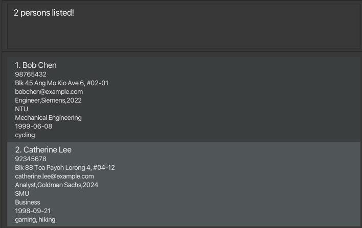

# UniVerse User Guide


UniVerse is more than just a **desktop app for managing contacts**—it is a platform designed to foster meaningful connections and support the holistic growth of **university students**. Tailored specifically for students balancing academic, social, and career aspirations, UniVerse allows users to organize and manage their networks effectively. By leveraging a **Command Line Interface (CLI)** for quick, efficient input and command execution, along with an intuitive **Graphical User Interface (GUI)** for easy navigation, UniVerse empowers students to maintain detailed contact information and build relationships that go beyond academic and professional circles. Whether it’s connecting with peers, professors, or industry mentors, UniVerse encourages students to form lasting bonds rooted in shared interests and experiences, making it an essential tool for thriving both socially and academically on campus.

<!-- * Table of Contents -->

<page-nav-print />

---

<div style="page-break-after: always;"></div>

## Quick start

1. Ensure you have Java `17` or above installed in your Computer.

2. Download the latest `.jar` file from [here](https://github.com/AY2425S1-CS2103T-T17-1/tp/releases).

3. Copy the file to the folder you want to use as the _home folder_ for your AddressBook.

4. Open a command terminal, `cd` into the folder you put the jar file in, and use the `java -jar addressbook.jar` command
   to run the application.<br>
   A GUI similar to the below should appear in a few seconds. Note how the app contains some sample data.<br>
   

5. Type the command in the command box and press Enter to execute it. e.g. typing **`help`** and pressing Enter will
   open the help window.<br>
   Some example commands you can try:

    - `list`: Lists all contacts.
    - `add n/John Doe p/98765432 e/johnd@example.com a/311, Clementi Ave 2, #02-25 u/NUS m/Computer Science b/13-12-2003`:
      Adds a contact named **John Doe** to the address book.

      <box type="info" seamless>
      
      **Note**: The `add` command supports **optional fields** such as:
        - `w/WORK_EXPERIENCE`: Specifies past work or internships (e.g., `w/Intern,Google,2023`).
        - `i/INTEREST`: Adds interests to a contact (e.g., `i/Photography`).
        - `t/TAG`: Tags to label the contact (e.g., `t/friends`).
      
      </box>

      These fields can be added to make contact information more detailed. Here’s an example with optional fields included:
      ```markdown
       add n/Alice Tan p/91234567 e/alice@example.com a/Blk 123 Clementi Ave 3, #05-10 u/NTU m/Engineering b/15-04-2000 w/Intern,Google,2023 i/Photography t/friend
      ```

    - `addi in/1 i/Reading`:
      Adds an interest called **Reading** to the contact at index 1.
    - `findu u/NUS`: Finds all contacts studying at **NUS**.
    - `findi i/Swimming`: Finds all contacts whose interests include **Swimming**.
    - `exit`: Exits the app.

6. Refer to the [Features](#features) below for details of each command.

---

<div style="page-break-after: always;"></div>

## Features

<box type="info" seamless>

**Notes about the command format:**<br>

- Words in `UPPER_CASE` are the parameters to be supplied by the user.<br>
  e.g. in `add n/NAME`, `NAME` is a parameter which can be used as `add n/John Doe`.

- Items in square brackets are optional.<br>
  e.g `n/NAME [t/TAG]` can be used as `n/John Doe t/friend` or as `n/John Doe`.

- Items with `…`​ after them can be used multiple times including zero times.<br>
  e.g. `[t/TAG]…​` can be used as ` ` (i.e. 0 times), `t/friend`, `t/friend t/family` etc.

- Parameters can be in any order.<br>
  e.g. if the command specifies `n/NAME p/PHONE_NUMBER`, `p/PHONE_NUMBER n/NAME` is also acceptable.

- Extraneous parameters for commands that do not take in parameters (such as `help`, `list`, `exit` and `clear`) will be ignored.<br>
  e.g. if the command specifies `help 123`, it will be interpreted as `help`.

- If you are using a PDF version of this document, be careful when copying and pasting commands that span multiple lines as space characters surrounding line-breaks may be omitted when copied over to the application.
  </box>

### Viewing help : `help`

Shows a message explaning how to access the help page.


Format: `help`

<br>

### Adding a person: `add`

Adds a person to the address book.

Format:

```plaintext
add n/NAME p/PHONE_NUMBER e/EMAIL a/ADDRESS u/UNIVERSITY m/MAJOR b/BIRTHDATE [w/WORK_EXPERIENCE] [i/INTEREST]... [t/TAG]...
```

<box type="tip" seamless>

**Tip:** A person can have any number of interests and tags (including 0)
</box>

Parameters:

- `n/NAME`: Full name of the contact.
- `p/PHONE_NUMBER`: 8-15 digit phone number.
- `e/EMAIL`: Email address in a valid format.
- `a/ADDRESS`: Contact's address.
- `u/UNIVERSITY`: University name.
- `m/MAJOR`: Major or field of study.
- `b/BIRTHDATE`: Date of birth in `dd-mm-yyyy` format.
- `[w/WORK_EXPERIENCE]`: Work experience in the format `ROLE,COMPANY,YEAR`.
- `[i/INTEREST]...`: Interests of the contact.
- `[t/TAG]...`: Tags for categorization.

Examples:

```plaintext
add n/John Doe p/98765432 e/johnd@example.com a/311, Clementi Ave 2, #02-25 w/Intern,Google,2024 u/NUS m/Computer Science t/friends t/owesMoney i/swimming i/reading b/13-12-2003
```

```plaintext
add n/Betsy Crowe p/98765431 e/betsycrowe@example.com a/Bishan Street 22, #02-12 w/Intern,Meta,2024 u/NTU m/Computer Science t/classmate b/01-01-2001`
```

<br>

### Adding Interests: `addi`

Adds interest(s) to an existing contact.

Format:

```plaintext
addi in/INDEX i/INTEREST...
```

- `in/INDEX`: Contact's position in the list.
- `i/INTEREST...`: Interests to add. Can add multiple interests.

Example:

```plaintext
addi in/1 i/Swimming i/Cycling
```

<br>

### Adding Work Experience: `addw`

Adds work experience to an existing contact.

Format:

```plaintext
addw in/INDEX w/ROLE,COMPANY,YEAR
```

- `in/INDEX`: Contact's position in the list.
- `w/ROLE,COMPANY,YEAR`: Work experience details.

Example:

```plaintext
addw in/1 w/Software Engineer,Google,2023
```

- `in/INDEX`: Index of contact user wishes to add work experience to.
- `w/WORK EXPERIENCE` : Work Experience user wishes to add.
- Index has to be a number from 1 to the total number of existing contacts in the contact list.
- Work experience in the format `ROLE,COMPANY,YEAR`
- If existing contact has a current work experience, it will just be replaced by the user input.

Example:

- `addw in/1 w/Intern,Google,2024` Adds the work experience `Intern,Google,2024` to the 1st person in the contact list.
  
<br>
<div style="page-break-after: always;"></div>

### Listing all persons : `list`

Shows a list of all persons in the address book.

Format:

```plaintext
list
```

<br>

### Editing a person : `edit`

Edits an existing person in the address book.

Format:

```plaintext
edit INDEX [n/NAME] [p/PHONE] [e/EMAIL] [a/ADDRESS] [t/TAG]…​
```

- Edits the person at the specified `INDEX`. The index refers to the index number shown in the displayed person list. The index **must be a positive integer** 1, 2, 3, …​
- At least one of the optional fields must be provided.
- Existing values will be updated to the input values.
- When editing tags, the existing tags of the person will be removed i.e adding of tags is not cumulative.
- You can remove all the person’s tags by typing `t/` without
  specifying any tags after it.

Examples:

- `edit 1 p/91234567 e/johndoe@example.com` Edits the phone number and email address of the 1st person to be `91234567` and `johndoe@example.com` respectively.
- `edit 2 n/Betsy Crower t/` Edits the name of the 2nd person to be `Betsy Crower` and clears all existing tags.

<br>

### Locating persons by name: `find`

Finds persons whose names contain any of the given keywords.

Format:

```plaintext
find KEYWORD [MORE_KEYWORDS]
```

<box type="tip" seamless>

**Tip:** Type `list` to view the full list of contacts again.
</box>

- The search is case-insensitive. e.g `hans` will match `Hans`
- The order of the keywords does not matter. e.g. `Hans Bo` will match `Bo Hans`
- Only the name is searched.
- Only full words will be matched e.g. `Han` will not match `Hans`
- Persons matching at least one keyword will be returned (i.e. `OR` search).
  e.g. `Hans Bo` will return `Hans Gruber`, `Bo Yang`

Examples:

- `find John` returns `john` and `John Doe`
- `find bob lee` returns `Bob Chen`, `Catherine Lee`<br>
  

<br>

### Finding Contacts by Interest: `findi`

Finds contacts with specific interests.

Format:

```plaintext
findi i/INTEREST
```

- `i/INTEREST`: Interest to search for.

Example:

```plaintext
findi i/Swimming
```

<br>

### Finding Contacts by Work Experience: `findw`

Finds contacts with specific work experiences based on **company** and optionally **role** and **year**.

Format:

```plaintext
findw w/COMPANY[,ROLE][,YEAR]
```

- **`COMPANY`**: Required. The name of the company to search for.
- **`ROLE`**: Optional. The role or position held at the company (e.g., `Engineer`).
- **`YEAR`**: Optional. The year of employment at the company.

<box type="info" seamless>

**Note**: The fields `ROLE` and `YEAR` can be omitted, but `COMPANY` must always be specified.
</box>

Examples:

- Find all contacts who worked at Google:
  ```plaintext
  findw w/Google
  ```
- Find contacts who interned at Google:
  ```plaintext
  findw w/Intern,Google
  ```
- Find contacts who interned at Google in 2024:
  ```plaintext
  findw w/Google,Intern,2024
  ```

<br>

### Finding Contacts by Major: `findm`

Finds contacts with a specific major.

Format:

```plaintext
findm m/MAJOR
```

- `m/MAJOR`: Major or field of study.

Example:

```plaintext
findm m/Computer Science
```

<br>

### Finding Contacts by University: `findu`

Finds contacts with a specific university.

Format:
```
findu u/UNIVERSITY
```
- `u/UNIVERSITY`: The university to search for (case-sensitive).

Example:
```
findu u/NUS
```
*Expected Output*: Lists all contacts associated with the National University of Singapore (NUS).

<box type="info" seamless>

**Note**:
The `findu` command operates based on the **current list of contacts displayed**. To ensure you search from the full contact list, type `list` before using `findu`. This refreshes the view to show all contacts, allowing `findu` to accurately filter contacts from the complete data set.

</box>

**Example Workflow**:
1. Type `list` to display all contacts.
2. Use `findu u/NUS` to filter and show only contacts from NUS.

<br>

### Deleting a person : `delete`

Deletes the specified person from the address book.

```plaintext
delete INDEX
```

- Deletes the person at the specified `INDEX`.
- The index refers to the index number shown in the displayed person list.
- The index **must be a positive integer** 1, 2, 3, …​

Examples:

- `list` followed by `delete 2` deletes the 2nd person in the address book.
- `find Betsy` followed by `delete 1` deletes the 1st person in the results of the `find` command.

<br>

### Clearing all entries : `clear`

Clears all entries from the address book.

```plaintext
clear
```
<br>

### Exiting the program : `exit`

Exits the program.

```plaintext
exit
```

<br>

### Saving the data

AddressBook data are saved in the hard disk automatically after any command that changes the data. There is no need to save manually.

### Editing the data file

AddressBook data are saved automatically as a JSON file `[JAR file location]/data/addressbook.json`. Advanced users are welcome to update data directly by editing that data file.

<box type="warning" seamless>

**Caution:**
If your changes to the data file makes its format invalid, AddressBook will discard all data and start with an empty data file at the next run. Hence, it is recommended to take a backup of the file before editing it.<br>
Furthermore, certain edits can cause the AddressBook to behave in unexpected ways (e.g., if a value entered is outside the acceptable range). Therefore, edit the data file only if you are confident that you can update it correctly.
</box>

### Archiving data files `[coming in v2.0]`

_Details coming soon ..._

---

<div style="page-break-after: always;"></div>

## FAQ

**Q**: How do I transfer my data to another Computer?<br>
**A**: Install the app in the other computer and overwrite the empty data file it creates with the file that contains the data of your previous AddressBook home folder.

---

## Known issues

1. **When using multiple screens**, if you move the application to a secondary screen, and later switch to using only the primary screen, the GUI will open off-screen. The remedy is to delete the `preferences.json` file created by the application before running the application again.
2. **If you minimize the Help Window** and then run the `help` command (or use the `Help` menu, or the keyboard shortcut `F1`) again, the original Help Window will remain minimized, and no new Help Window will appear. The remedy is to manually restore the minimized Help Window.

---

## Command Summary
| Action                                      | Format, Examples                                                                                                                                                                                                                                                                                       |
|---------------------------------------------|--------------------------------------------------------------------------------------------------------------------------------------------------------------------------------------------------------------------------------------------------------------------------------------------------------|
| **Add new contact**                         | `add n/NAME p/PHONE_NUMBER e/EMAIL a/ADDRESS u/UNIVERSITY m/MAJOR b/BIRTHDATE [w/WORK_EXPERIENCE] [i/INTEREST]... [t/TAG]...`<br> e.g., `add n/Alice Tan p/91234567 e/alice@example.com a/Blk 123 Clementi Ave 3, #05-10 u/NTU m/Engineering b/15-04-2000 w/Intern,Google,2023 i/Photography t/friend` |
| **Add Interests to existing contact**       | `addi in/INDEX i/INTEREST...` <br> e.g., `addi in/1 i/Swimming`                                                                                                                                                                                                                                        |
| **Add Work Experience to existing contact** | `addw in/INDEX w/ROLE,COMPANY,YEAR` <br> e.g., `addw in/1 w/Intern,Google,2023`                                                                                                                                                                                                                        |
| **Delete a contact**                        | `delete INDEX` <br> e.g., `delete 3`                                                                                                                                                                                                                                                                   |
| **Edit an existing contact**                | `edit INDEX [n/NAME] [p/PHONE_NUMBER] [e/EMAIL] [a/ADDRESS] [u/UNIVERSITY] [m/MAJOR] [b/BIRTHDATE] [w/WORK_EXPERIENCE] [i/INTEREST]... [t/TAG]...` <br> e.g., `edit 2 n/James Lee e/jameslee@example.com`                                                                                              |
| **Delete all contacts**                     | `clear`                                                                                                                                                                                                                                                                                                |
| **Find by Name**                            | `find KEYWORD [MORE_KEYWORDS]`<br> e.g., `find James Jake`                                                                                                                                                                                                                                             |
| **Find by Interest**                        | `findi i/INTEREST` <br> e.g., `findi i/Swimming`                                                                                                                                                                                                                                                       |
| **Find by Work Experience**                 | `findw w/[ROLE],COMPANY,[YEAR]` <br> e.g., `findw w/Engineer,Google`, `findw w/Google`, `findw w/Google,2024`                                                                                                                                                                                          |
| **Find by University**                      | `findu u/UNIVERSITY` <br> e.g., `findu u/NUS`                                                                                                                                                                                                                                                          |
| **Find by Major**                           | `findm m/MAJOR` <br> e.g., `findm m/Computer Science`                                                                                                                                                                                                                                                  |
| **List all contacts**                       | `list`                                                                                                                                                                                                                                                                                                 |
| **Help**                                    | `help`                                                                                                                                                                                                                                                                                                 |
| **Exit the application**                    | `exit`                                                                                                                                                                                                                                                                                                 |

