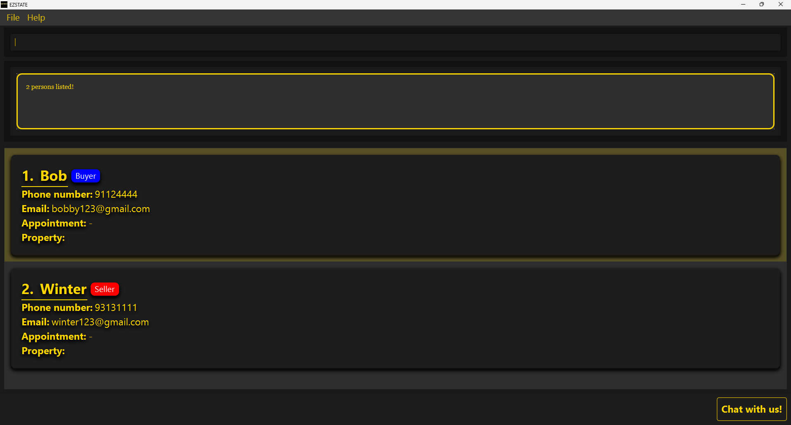
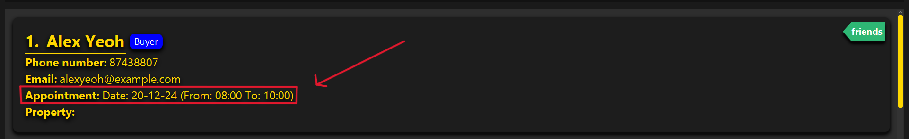
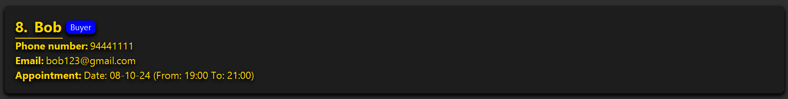
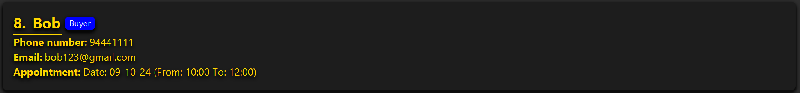
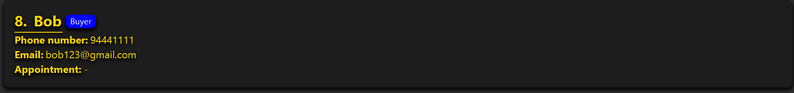
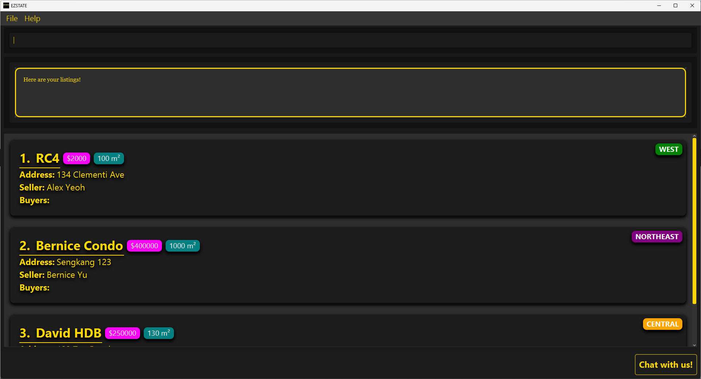
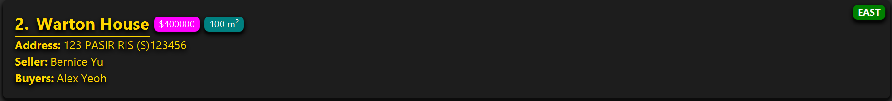
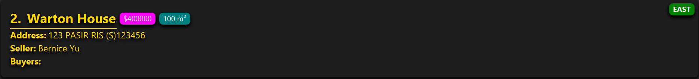
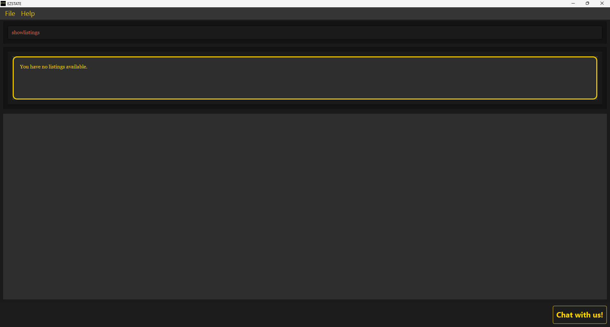
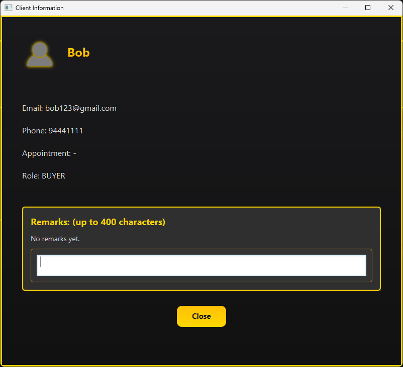

<link rel="stylesheet" type="text/css" href="assets/css/UserGuide.css">

EZStates is a **desktop app for managing contacts, optimized for use via a Command Line Interface** (CLI) while still having the benefits of a Graphical User Interface (GUI). If you can type fast, AB3 can get your contact management tasks done faster than traditional GUI apps.

* Table of Contents
{:toc}

--------------------------------------------------------------------------------------------------------------------

## Quick Start: Get started in 3 minutes!

In this quick start guide, you'll learn how to install EZSTATES. 
 
 
**(OPTIONAL)** You'll also learn how our commands work to kickstart the application. 

 
While learning our command structure is optional, we highly recommend reviewing this section to make using EZSTATES much easier.

### Installation _(~3min)_

1. Ensure you have Java `17` or above installed in your Computer.

2. Download the latest `.jar` file from [EZSTATES Releases](https://github.com/AY2425S1-CS2103T-F11-4/tp/releases).

3. Copy the file to the folder you want to use as the _home folder_ for your AddressBook.

4. Open a command terminal, `cd` into the folder you put the jar file in, and use the `java -jar ezstates.jar` command to run the application. 
   A GUI similar to the below should appear in a few seconds. Note how the app contains some sample data.  
     

5. Type the command in the command box and press Enter to execute it. e.g. typing **`help`** and pressing Enter will open the help window. 
   Some example commands you can try:

   * `showclients` : Lists all contacts.

   * `buyer n/John Doe p/98765432 e/johnd@example.com` : Adds a buyer named `John Doe` to the Address Book.

   * `delete John Doe` : Deletes the contact with name John Doe from the list.

   * `clear` : Deletes all contacts.

   * `exit` : Exits the app.

6. Refer to the [Features](#features) for command details.

### Command Structure _(~10 mins)_

In this section, we will explore the general format of commands in EZSTATES.

Commands in EZStates follow the same structure:

`commandWord (REFERENCE) (PREFIXES)` 

| commandWord                  | REFERENCE                                                                                                            | PREFIXES                                                                                                 |
|------------------------------|----------------------------------------------------------------------------------------------------------------------|----------------------------------------------------------------------------------------------------------|
| Specifies the command to run | Comes before all prefixes and is used to make reference a particular client/listing   Optional for some commands | Used to specify various attributes/properties for a given `commandWord`   Optional for some commands |

#### Reference Types

| Reference | Meaning                                  | Constraints                                                     | Remarks                                                                                                        |
|-----------|------------------------------------------|-----------------------------------------------------------------|----------------------------------------------------------------------------------------------------------------|
| INDEX     | INDEX of a client or a listing in a list | INDEX are positive integers that are `one-based` (i.e. `>= 1`). | Commonly used in edit and delete clients/listings to make reference to these objects in their respective lists |

#### Prefix Notation

Prefixes follow the same structure

`prefix/Value`

and can be either optional or mandatory, and variadic or not variadic.
The table below showcases the four different possible notations of prefixes:

|              | Mandatory       | Optional          |
|--------------|-----------------|-------------------|
| Not variadic | prefix/Value    | [prefix/Value]    |
| Variadic     | prefix/Value... | [prefix/Value]... |

Optional fields can be omitted and the command will still be executed successfully   _(assuming all other parts are correctly inputted)_ 

#### Prefix Types

The prefixes used in EZSTATES are universal across all commands   _(i.e. have the same constraints and remarks)_

 

| Prefix | Meaning | Location    | Constraints | Remarks | Example |
|--------|---------|-------------|-------------|---------|---------|
| n/     | name    | Client      |             |         |         |
| p/     | phone   | Client      |             |         |         |
| e/     | email   | Client      |             |         |         |
| t/     | tag     | Client      |             |         |         |
| d/     | date    | Appointment |             |         |         |
| fr/    | from    | Appointment |             |         |         |
| to/    | to      | Appointment |             |         |         |
| pr/    | price   | Listing     |             |         |         |
| ar/    | area    | Listing     |             |         |         |
| add/   | address | Listing     |             |         |         |
| reg/   | region  | Listing     |             |         |         |
| sell/  | seller  | Listing     |             |         |         |
| buy/   | buyer   | Listing     |             |         |         |

--------------------------------------------------------------------------------------------------------------------

## Feature Categories

You are strongly recommended to read through [Command Structure](#CommandStructure) before proceeding with this section!

 
This user guide is divided into four main feature categories:

1. **Client Management Commands**
2. **Appointment Management Commands**
3. **Listing Management Commands**
4. **Utility Commands**

---

### **1. Client Management Commands**

Commands for creating, updating, and deleting buyers and sellers.

- #### Add Buyer Command
    - **Format:** `buyer n/NAME p/PHONE e/EMAIL [t/TAG]...`
    - **Description:** Creates a new buyer profile with specified details.
    - **Successful Execution:**
      > ---
      >
      > **Use Case #1**: Adding a buyer named `Bobby` with phone number `91124444` and email `john123@gmail.com`
      >
      > **Input**: `buyer n/Bobby p/91124444 e/bobby123@gmail.com`
      >
      > **Output**: New buyer added: Bobby; Phone: 91124444; Email: bobby123@gmail.com; Appointment: -; Tags:
      >
      > ---
      >
      > **Use Case #2**: Adding a buyer named `Bobby` with phone number `91124444`, email `john123@gmail.com`, tags `friend`, `owner`
      >
      > **Input**: `buyer n/Bobby p/91124444 e/bobby123@gmail.com t/friend t/owner`
      >
      > **Output**: New buyer added: Bobby; Phone: 91124444; Email: bobby123@gmail.com; Appointment: -; Tags: [owner][friend]
      >
      > ---
   
     
    

    NAME is case-insensitive: 
    `buyer n/Bob` = `buyer n/BOB` = `buyer n/bOb` _(Not exhaustive)_
  
    Thus, if a buyer/seller with the same name already exists, the commands above cannot be executed
    as they result in a duplicate buyer created
    

     

    - **Failed Execution:**
      > ---
      >
      > **User Error #1**: Missing `NAME` field
      >
      > **Input**: `buyer p/91124444 e/bobby123@gmail.com`
      >
      > **Output**:  
      Invalid command format!  
      buyer: Adds a buyer to the address book.  
      Parameters: n/NAME p/PHONE e/EMAIL [t/TAG]... 
      Example: buyer n/John Doe p/98765432 e/johnd@example.com> t/friends t/owesMoney
      >
      > ---
      >
      > **User Error #2**: Missing `PHONE` field
      >
      > **Input**: `buyer n/Bobby e/bobby123@gmail.com`
      >
      > **Output**:  
      Invalid command format!  
      buyer: Adds a buyer to the address book.  
      Parameters: n/NAME p/PHONE e/EMAIL [t/TAG]... 
      Example: buyer n/John Doe p/98765432 e/johnd@example.com> t/friends t/owesMoney
      >
      > ---
      >
      > **User Error #3**: Missing `EMAIL` field
      >
      > **Input**: `buyer n/Bobby p/91124444`
      >
      > **Output**:  
      Invalid command format!  
      buyer: Adds a buyer to the address book.  
      Parameters: n/NAME p/PHONE e/EMAIL [t/TAG]... 
      Example: buyer n/John Doe p/98765432 e/johnd@example.com> t/friends t/owesMoney
      >
      > **User Error #4**: Buyer already exists 
      > 
      > **Input**: `buyer n/Bobby p/83485111 e/bobby1234@gmail.com`  _(Assuming name `Bobby` already exists)_
      > 
      > **Output**: This buyer already exists in the address book
      > 
      > ---
- #### Add Seller Command
    - **Format:** `seller n/NAME p/PHONE e/EMAIL [t/TAG]...`
    - **Description:** Creates a new seller profile with specified details.
    - **Successful Execution:**
      > ---
      > **Use Case #1**: Adding a seller named `Bobby` with phone number `91124444` and email `john123@gmail.com`
      >
      > **Input**: `seller n/Bobby p/91124444 e/bobby123@gmail.com`
      >
      > **Output**: New seller added: Bobby; Phone: 91124444; Email: bobby123@gmail.com; Appointment: -; Tags:
      >
      > ---
      >
      > **Use Case #2**: Adding a seller named `Bobby` with phone number `91124444`, email `john123@gmail.com`, tags `friend`, `owner`
      >
      > **Input**: `seller n/Bobby p/91124444 e/bobby123@gmail.com t/friend t/owner`
      >
      > **Output**: New seller added: Bobby; Phone: 91124444; Email: bobby123@gmail.com; Appointment: -; Tags: [owner][friend]
      >
      > ---

     
    

    NAME is case-insensitive: 
    `seller n/Bob` = `seller n/BOB` = `seller n/bOb` _(Not exhaustive)_
     
    If a buyer/seller with the same name already exists, the equivalent commands above cannot be carried out
    

     

    - **Failed Execution**
      > ---
      > **User Error #1**: Missing `NAME` field
      >
      > **Input**: `seller p/91124444 e/bobby123@gmail.com`
      >
      > **Output**:  
        Invalid command format!  
        seller: Adds a seller to the address book.  
        Parameters: n/NAME p/PHONE e/EMAIL [t/TAG]... 
        Example: seller n/John Doe p/98765432 e/johnd@example.com> t/friends t/owesMoney
      >
      > ---
      >
      > **User Error #2**: Missing `PHONE` field
      >
      > **Input**: `seller n/Bobby e/bobby123@gmail.com`
      >
      > **Output**:  
        Invalid command format!  
        seller: Adds a seller to the address book.  
        Parameters: n/NAME p/PHONE e/EMAIL [t/TAG]... 
        Example: seller n/John Doe p/98765432 e/johnd@example.com> t/friends t/owesMoney
      >
      > ---
      > **User Error #3**: Missing `EMAIL` field
      >
      > **Input**: `seller n/Bobby p/91124444`
      >
      > **Output**:  
        Invalid command format!  
        seller: Adds a seller to the address book.  
        Parameters: n/NAME p/PHONE e/EMAIL [t/TAG]... 
        Example: seller n/John Doe p/98765432 e/johnd@example.com> t/friends t/owesMoney
      >
      > ---
      > 
      > **User Error #4**: Seller already exists
      > 
      > **Input**: `seller n/Bobby p/83485111 e/bobby1234@gmail.com`  _(Assuming name `Bobby` already exists)_ 
      > 
      > **Output**: This buyer already exists in the address book
      > 
      >  ---

- #### Find Command
    - **Format:** `find KEYWORD [KEYWORD]...`
    - **Description:** Finds the specified client(s) based on the provided keywords.
    - **Successful Execution:**
      > ---
      > **Use Case #1**: Finding `Bob`
      >
      > **Input**: `find Bob`
      >
      > **Output**: 1 persons listed!
      >
      > 
      >
      > ---
      >
      > **Use Case #2**: Finding `Bob` OR `Winter`
      >
      > **Input**: `find Bob Winter`
      >
      > **Output**: 2 persons listed!
      >
      > 
      >
      > ---

     
    

    NAME is case-insensitive: 
    `find Bob` = `find BOB` = `find bOb` _(Not exhaustive)_
    

     

    

    However, NAME is space-sensitive:
    `find Wen Xuan` != `find WenXuan`
     
     
    First command finds names with `wen` OR `xuan`
     
    Second command finds names with `wenxuan`
    
 
         

    - **Failed Execution:**
      > ---
      >
      > **Use Case**: Client not found
      > 
      > **Input**: `find Bob7`
      > 
      > **Output**: 0 persons listed!
      > 
      > 
      > 
      > ---

- #### Edit Client Command
    - **Format:** `editclient INDEX [n/NAME] [p/PHONE] [e/EMAIL] [t/TAG]...`
    - **Description:** Edits the details of the specified client.
    - **Successful Execution:**
      > ---
      > **Use Case #1**: Changing name of `Bob` to `Bobby` (Assuming displayed index is 1)
      >
      > **Input**: `editclient 1 n/Bobby`
      >
      > **Output**: Successfully edited Bobby; Phone: 91124444; Email: bobby123@gmail.com; Appointment: -; Tags: [owner][friend]!
      >
      > ---
      >
      > **Use Case #2**: Changing phone of `Bobby` to `97774444` 
      >
      > **Input**: `editclient 1 p/97774444`
      >
      > **Output**: Successfully edited Bobby; Phone: 97774444; Email: bobby123@gmail.com; Appointment: -; Tags: [owner][friend]!
      >
      > ---
      >
      > **Use Case #3**: Removing tags of `Bobby`
      >
      > **Input**: `editclient 1 t/`
      >
      > **Output**: Successfully edited Bobby; Phone: 97774444; Email: bobby123@gmail.com; Appointment: -; Tags: !
      >
      > ---

    - **Failed Execution:**
      > ---
      > **User Error #1**: No index found / Invalid type / Negative integer
      >
      > **Input**: `editclient n/Bobby`
      >
      > **Output**:
        Invalid command format!
       edit: Edits the details of the person identified by their name. Existing values will be overwritten by the input values.
       Parameters: INDEX (must be a positive integer) [n/NAME] [p/PHONE] [e/EMAIL] [t/TAG]...
       Example: editclient 1 e/johndoe@example.com p/91234567
      >
      > ---
      > 
      > **User Error #2**: Entering out-of-bounds index (larger than number of clients)
      > 
      > **Input**: `editclient 100 n/Bobby`
      > 
      > **Output**: The person index provided is invalid
      > 
      > ---

- #### Delete Client Command
    - **Format:** `deleteclient INDEX`
    - **Description:** Deletes the specified client profile.
    - **Successful Execution:**
      > ---
      > **Use Case #1**: Delete `Bob` from the address book (Assuming displayed index is 1)
      >
      > **Input**: `deleteclient 1`
      >
      > **Output**: `Successfully deleted Bob.
      Phone number: 977774444 and Email: bobby123@gmail.com`
      >
      > ---
  
    - **Failed Execution:**
      > ---
      > **Use Case #1**: No index found / Invalid type / Negative integer
      >
      > **Input**: `deleteclient` OR `deleteclient #a` OR `deleteclient -1`
      >
      > **Output**: 
        Invalid command format! 
       delete: Deletes the client profile corresponding to the client's name.
       Parameters: INDEX (must be a positive integer)
       Example: delete 1
      >
      > ---
      > **Use Case #2**: Entering out-of-bounds index (larger than number of clients)
      > 
      > **Input**: `deleteclient 100`
      > 
      > **Output**: The person index provided is invalid
      > 
      > ---

---

### **2. Appointment Management**

Commands for managing appointments between user and clients.

- #### Schedule Appointment
    - **Format:** `apt INDEX d/DD-MM-YY fr/HHmm to/HHmm` OR `apt INDEX d/ddMMyy fr/HH:mm to/HH:mm`
    - **Description:** Schedules a new appointment to be held with the specified client that includes the specified details (date, time). 
    - **Successful Execution:**
      > ---
      > **Use Case #1**: Adding appointment `8th October 2024 7pm to 9pm` for client `Bob`
      >
      > **Input**: `apt 1 d/08-10-24 fr/1900 to/2100`
      >
      > **Output**: Appointment scheduled for Bob; Phone: 94441111; Email: bob123@gmail.com; Appointment: Date: 08-10-24 (From: 19:00 To: 21:00); Tags:
      >
      > 
      > 
      > ---
      >
      > **Use Case #2**: Overriding an existing appointment for client `Bob` to be `9th October 2024 10am to 12pm` instead
      >
      > **Input**: `apt 1 d/09-10-24 fr/1000 to/1200`
      >
      > **Output**: Appointment scheduled for Bob; Phone: 94441111; Email: bob123@gmail.com; Appointment: Date: 09-10-24 (From: 10:00 To: 12:00); Tags:
      >
      > 
      > 
      > ---
  
    - **Failed Execution:**
      > ---
      > **Use Case #1**: Incorrect `DATE` format 
      >
      > **Input #a**: `apt 1 d/09-10-2024 fr/1000 to/1200`
      >
      > **Input #b**: `apt 1 d/aaa fr/1000 to/1200`
      > 
      > **Output**: Dates should be in the format dd-MM-yy or ddMMyy, e.g., 25-12-24 or 251224.
      >
      > ---
      > 
      > **Use Case #2**: Incorrect `TIME` format
      > 
      > **Input #a**: `apt 1 d/20-10-24 fr/100000 to/1200`
      > 
      > **Input #b**: `apt 1 d/20-10-24 fr/aa to/1200`
      > 
      > **Output**: Times should be in the format HH:mm or HHmm, e.g., 0900 or 09:00.
      > 
      > ---

- #### Delete Appointment
    - **Format:** `delapt INDEX`
    - **Description:** Deletes an appointment with the specified client.
    - **Successful Execution:**
      > ---
      > **Use Case**: Deleting appointment for `Bob`
      >
      > **Input**: `delapt 1`
      >
      > **Output**: Successfully deleted appointment from Bob
      >
      > 
      > 
      > ---

    - **Failed Execution:**
      > ---
      > **Use Case**: Entering out-of-bounds index (larger than number of clients)
      >
      > **Input**: `delapt 100`
      >
      > **Output**: The person index provided is invalid
      >
      > ---
      
---

### **3. Listing Management**

Commands for managing property listings and associating clients with listings.

- #### Add Listing
    - **Format:** `listing n/NAME pr/PRICE ar/AREA add/ADDRESS reg/REGION sel/SELLER [buy/BUYER]...`
    - **Description:** Adds a new listing associated to the seller with the specified details.
    - **Successful Execution:**
      > ---
      > **Use Case #1**: Adding a listing with name `Warton House`, price `4000`, area `1000`, address `123 PASIR RIS (S)123456`, region `east`, seller `Bernice Yu`, buyer `Alex Yeoh`  
      >
      > **Input**: `listing n/Warton House pr/4000 ar/1000 add/123 PASIR RIS (S)123456 reg/east sel/Bernice Yu buy/Alex Yeoh`
      >
      > **Output**: New listing added: Warton House; Price: 4000; Area: 1000; Region: EAST; Address: 123 PASIR RIS (S)123456; Seller: seedu.address.model.person.Seller{name=Bernice Yu, phone=99272758, email=berniceyu@example.com, tags=[[colleagues], [friends]], appointment=-, remark=No remarks yet.}seedu.address.model.person.Buyer{name=Alex Yeoh, phone=87438807, email=alexyeoh@example.com, tags=[[friends]], appointment=Date: 20-12-24 (From: 08:00 To: 10:00), remark=Test}
      >
      > 
      > 
      > ---
      >
      > **Use Case #2**: Adding a listing with no buyers
      >
      > **Input**: `listing n/Warton House pr/4000 ar/1000 address/123 PASIR RIS (S)123456 reg/east sel/Bernice Yu`
      >
      > **Output**: New listing added: Warton House; Price: 4000; Area: 1000; Region: EAST; Address: 123 PASIR RIS (S)123456; Seller: seedu.address.model.person.Seller{name=Bernice Yu, phone=99272758, email=berniceyu@example.com, tags=[[colleagues], [friends]], appointment=-, remark=No remarks yet.}
      >
      > 
      > 
      > ---

    - **Failed Execution:**
      > ---
      > **Use Case #1**: Attempting to add a listing for a non-existent seller
      >
      > **Input**: `listing n/Warton House pr/4000 ar/1000 add/123 PASIR RIS (S)123456 reg/east sel/bob7`
      >
      > **Output**: Please enter an existing client name!
      >
      > ---
      > 
      > **Use Case #2**: Attempting to add non-existent buyers to a listing
      > 
      > **Input**: `listing n/Warton House pr/4000 ar/1000 add/123 PASIR RIS (S)123456 reg/east sel/Bernice Yu buy/bob7`
      > 
      > **Output**: Please enter an existing client name!
      > 
      > ---

- #### Show Listings
    - **Format:** `showlistings`
    - **Description:** Displays all current listings.
    - **Successful Execution:**
      > ---
      > **Use Case #1**: To show all listings in the addressbook
      >
      > **Input**: showlistings
      >
      > **Output**: Here are your listings!
      >
      > 
      > 
      > ---
      > 
      > **Use Case #2**: To show all listings (when there are none)
      > 
      > **Input**: showlistings
      > 
      > **Output**: You have no listings available.
      > 
      > 
      > 
      > ---

    - **Failed Execution:** NIL

    

    WARNING: The subsequent section `ADD BUYERS TO LISTING` might have an outdated command format. 
    This is as of v1.5 
    Please refer to the command format given in the application as per the app version used.
    

- #### Add Buyers to Listing
    - **Format:** `addlistingbuyers LISTING_NAME buy/BUYER_NAME [buy/MORE_BUYER_NAMES...]`
    - **Description:** Associates buyers with a specified listing.
    - **Successful Execution:**
      > ---
      > **Use Case #1**: Adding one buyer `Alex Yeoh` to listing `RC4` (Assuming displayed index is 1)
      >
      > **Input**: `addlistingbuyers rc4 buyer/Alex Yeoh buyer/Charlotte Oliveiro`
      >
      > **Output**: Buyers added to listing: RC4
      >
      > ---
      >
      > **Use Case #2**: Adding two buyers `Alex Yeoh` and `Charlotte Oliveiro` to listing `David HDB`
      >
      > **Input**: `addlistingbuyers david hdb buy/Alex Yeoh buy/Charlotte Oliveiro`
      >
      > **Output**: Buyers added to listing: David HDB
      >
      > ---

     
    

    Listing and buyer names are case-insensitive: 
    `addlistingbuyers Warton House` 
    = `addlistingbuyers warton house` 
    = `addlistingbuyers wArToN HouSe` _(Not exhaustive)_
     
     
    (Similar behaviour as above for buyer names)
    

     

    

    However, listing/buyer name is space-sensitive:
    `addlistingbuyers Warton House` != `addlistingbuyers WartonHouse`
     
     
    (Similar behaviour as above for buyer names)
    
 
     
    
    - **Failed Execution:**
      > ---
      > **Use Case #1**: Listing not found
      >
      > **Input**: `addlistingbuyers NonExistentListing buyer/Bob`
      >
      > **Output**: The specified listing name does not exist.
      >
      > ---
      > 
      > **User Error #2**: Duplicate buyers
      > 
      > **Input**: `addlistingbuyers RC4 buyer/Alex Yeoh`  _(Assuming RC4 contains Alex Yeoh already)_
      > 
      > **Output**: Some buyers are already associated with this listing.
      > 
      > --- 
      > 
      > **User Error #3**: Buyer not found
      > 
      > **Input**: `addlistingbuyers RC4 buyer/NonExistentBuyer`
      > 
      > **Output**: The specified buyer NonExistentBuyer does not exist in the client list.
      > 
      > ---
      > 
      > **User Error #4**: Person is not a buyer
      > 
      > **Input**: `addlistingbuyers RC4 buyer/Bernice Yu`  _(Assuming Bernice Yu is a seller)_
      > 
      > **Output**: The specified person Bernice Yu is not a buyer.
      >
      > ---
    
    

    WARNING: The subsequent section `REMOVE BUYERS FROM LISTING` might have an outdated command format. 
    This is as of v1.5 
    Please refer to the command format given in the application as per the app version used.
    

- #### Remove Buyers from Listing
    - **Format:** `removelistingbuyers LISTING_NAME buyer/BUYER_NAME [buyer/MORE_BUYER_NAMES...]`
    - **Description:** Removes buyers associated with a specified listing.
    - **Successful Execution:**
      > ---
      > **Use Case #1**: Removing one buyer `Alex Yeoh` from listing `RC4`
      >
      > **Input**: `removelistingbuyers rc4 buyer/alex yeoh` 
      >
      > **Output**: Buyers removed from listing: RC4
      >
      > ---
      >
      > **Use Case #2**: Removing two buyers `Alex Yeoh` and `Charlotte Oliveiro` from listing `RC4`
      >
      > **Input**: `removelistingbuyers rc4 buyer/alex yeoh buyer/charlotte oliveiro`
      >
      > **Output**: Buyers removed from listing: RC4
      >
      > ---

     
    

    Listing and buyer names are case-insensitive: 
    `removelistingbuyers Warton House` 
    = `removelistingbuyers warton house` 
    = `removelistingbuyers wArToN HouSe` _(Not exhaustive)_
     
     
    (Similar behaviour as above for buyer names)
    

     

    

    However, listing/buyer name is space-sensitive:
    `removelistingbuyers Warton House` != `removelistingbuyers WartonHouse`
     
     
    (Similar behaviour as above for buyer names)
    
 
     

    - **Failed Execution:**
      > ---
      > **User Error #1**: Listing not found
      >
      > **Input**: `removelistingbuyers rc44444 buyer/alex yeoh`
      >
      > **Output**: The specified listing name does not exist.
      > 
      > ---
      > 
      > **User Error #2**: Empty set of buyers
      >
      > **Input**: `removelistingbuyers rc4 buyer/`
      >
      > **Output**: Please provide valid buyers
      > 
      > ---
      > 
      > **User Error #3**: Person specified is not buyer
      >
      > **Input**: `removelistingbuyers rc4 buyer/ImASeller`
      >
      > **Output**: The client ImASeller is not registered as a buyer.
      > 
      > ---
      > 
      > **User Error #4**: Person specified is not a buyer for the listing
      >
      > **Input**: `removelistingbuyers rc4 buyer/notInterestedBuyer`
      >
      > **Output**: The specified buyer notInterestedBuyer is not a buyer of the listing RC4.
      > 
      > ---
      > 
      > **User Error #5**: Buyer not found
      >
      > **Input**: `removelistingbuyers rc4 buyer/nonExistentBuyer`
      >
      > **Output**: The specified buyer nonExistentBuyer does not exist in the client list.
      > 
      > ---

    

    WARNING: The subsequent section `DELETE LISTING` might have an outdated command format. 
    This is as of v1.5 
    Please refer to the command format given in the application as per the app version used.
    

- #### Delete Listing
    - **Format:** `deletelisting LISTING_NAME`
    - **Description:** Deletes a specified listing.
    - **Successful Execution:**
      > ---
      > **Use Case #1**: Deleting listing `Warton House`
      >
      > **Input**: `deletelisting warton house`
      >
      > **Output**: Successfully deleted listing: Warton House
      >
      > ---

     
    

    NAME is case-insensitive: 
    `deletelisting Bob House` = `deletelisting BOB HOUSE` = `deletelisting bOb hOUsE` _(Not exhaustive)_

    Thus, these commands will delete the same `Bob House` listing
    

     

    

    However, NAME is space-sensitive:
    `deletelisting bob house` != `deletelisting bobhouse`
    
    These commands will delete different listings 
    
 
     

    - **Failed Execution:**
      > ---
      > **Use Error**: Listing not found
      >
      > **Input**: deletelisting nonExistentListing
      >
      > **Output**: This listing does not exist in EZSTATE
      >
      > ---

- #### Clear Listing
    - **Format:** `clearlistings`
    - **Description:** Deletes ALL listings.
    - **Successful Execution:**
      > ---
      > **Use Case**: Clear all listings in addressbook
      >
      > **Input**: clearlistings
      >
      > **Output**: All listings have been cleared!
      >
      > ---

### **4. Utility Commands**

Miscellaneous commands for application utility, such as clearing, exiting, and displaying help.

- #### Clear
    - **Format:** `clear`
    - **Description:** Clears all clients and listings.
    - **Successful Execution:**
      > ---
      > **Use Case**: Fresh addressbook and listings
      >
      > **Input**: clear
      >
      > **Output**: Address book and listings has been cleared!
      >
      > ---

- #### Exit
    - **Format:** `exit`
    - **Description:** Exits the application.
    - **Successful Execution:**
      > ---
      > **Use Case**: Exit the application
      >
      > **Input**: exit
      > 
      > **Output**: Exiting Address Book as requested ...
      >
      > ---
      
- #### Help
    - **Format:** `help`
    - **Description:** Displays a list of available commands and their descriptions.
    - **Successful Execution:**
      > ---
      > **Use Case**: Accessing help
      >
      > **Input**: `help`
      >
      > **Output**: Opened help window.
      >
      > 
      > 
      > ---

    

    WARNING: The subsequent section `MORE INFO` might have an outdated command format. 
    This is as of v1.5 
    Please refer to the command format given in the application as per the app version used.
    

- #### More Info
    - **Format:** `moreinfo NAME`
    - **Description:** Provides additional information about a specific client.
    - **Successful Execution:**
      > ---
      > **Use Case**: Finding out more information about `Bob`
      >
      > **Input**: `moreinfo Bob`
      >
      > **Output**: Opened window for client's information.
      >
      > 
      > 
      > ---

     
    

    NAME is case-insensitive: 
    `moreinfo Bob` = `moreinfo BOB` = `moreinfo bOb` _(Not exhaustive)_

    Thus, these commands will provide more information about the same `Bob` client
    

     

    

    However, NAME is space-sensitive:
    `moreinfo wen xuan` != `moreinfo wenxuan`
    
    These commands will provide more information about different clients
    
 
     

    - **Failed Execution:**
      > ---
      > **Use Case**: Client not found
      >
      > **Input**: moreinfo nonExistentClient
      >
      > **Output**: Please enter an existing client name!
      >
      > ---

- #### Chat Window
    - **Format:** `chatbot`
    - **Description:** Opens a chatbot that answers basic queries.
    - **Successful Execution:**
      > ---
      > **Use Case #1**: Valid Greeting
      >
      > **Input**:
      
      **Output**:
      
      > ---
      >
      > **Use Case #2**: Valid Query
      >
      > **Input**:
      
       **Output**:
      
      > ---
      >
      > **Use Case #3**: Valid Farewell
      >
      > **Input**:
      
      **Output**:
      
      > ---

      - **Failed Execution:**
      > ---
      > **Use Case #1**: Invalid Query
      >
      > **Input**:
      
      >
      > **Output**:
      
      > ---

### Saving the data

AddressBook data are saved in the hard disk automatically after any command that changes the data. There is no need to save manually.

### Editing the data file

AddressBook data are saved automatically as a JSON file `[JAR file location]/data/addressbook.json`. Advanced users are welcome to update data directly by editing that data file.

:exclamation: **Caution:**
If your changes to the data file makes its format invalid, AddressBook will discard all data and start with an empty data file at the next run. Hence, it is recommended to take a backup of the file before editing it. 
Furthermore, certain edits can cause the AddressBook to behave in unexpected ways (e.g., if a value entered is outside of the acceptable range). Therefore, edit the data file only if you are confident that you can update it correctly.

### Archiving data files `[coming in v2.0]`

_Details coming soon ..._

--------------------------------------------------------------------------------------------------------------------

## FAQ

**Q**: How do I transfer my data to another Computer? 
**A**: Install the app in the other computer and overwrite the empty data file it creates with the file that contains the data of your previous AddressBook home folder.

--------------------------------------------------------------------------------------------------------------------

## Known issues

1. **When using multiple screens**, if you move the application to a secondary screen, and later switch to using only the primary screen, the GUI will open off-screen. The remedy is to delete the `preferences.json` file created by the application before running the application again.
2. **If you minimize the Help Window** and then run the `help` command (or use the `Help` menu, or the keyboard shortcut `F1`) again, the original Help Window will remain minimized, and no new Help Window will appear. The remedy is to manually restore the minimized Help Window.

--------------------------------------------------------------------------------------------------------------------

## Command summary

Action | Format, Examples
--------|------------------
**Add** | `add n/NAME p/PHONE_NUMBER e/EMAIL​`   e.g. `add n/James Ho p/22224444 e/jamesho@example.com`
**Clear** | `clear`
**Delete** | `delete NAME`  e.g. `delete James Ho`
**Edit** | `edit INDEX [n/NAME] [p/PHONE_NUMBER] [e/EMAIL]​`  e.g.`edit 2 n/James Lee e/jameslee@example.com`   e.g.`edit 2 n/James Voo`
**Find** | `find KEYWORD [MORE_KEYWORDS]`  e.g., `find James Jake`
**List** | `list`
**Help** | `help`
