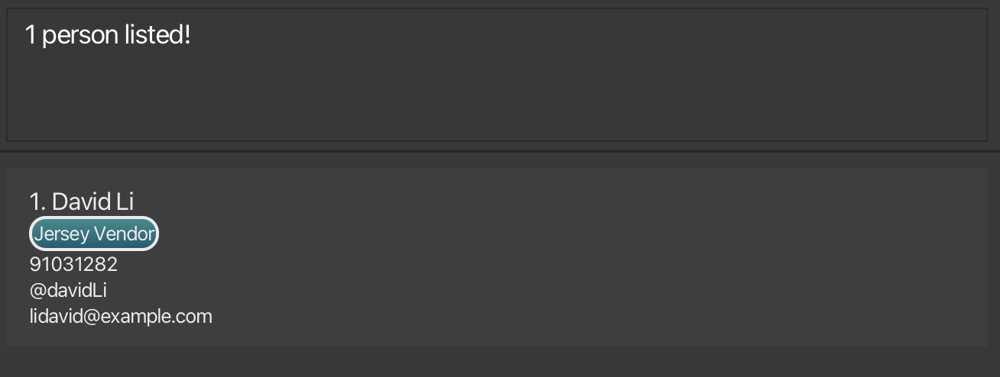
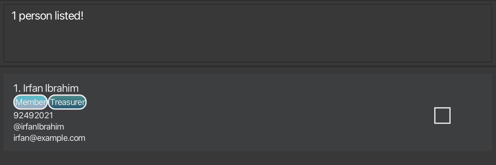
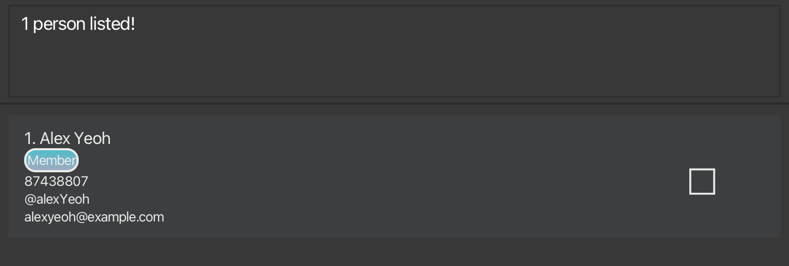
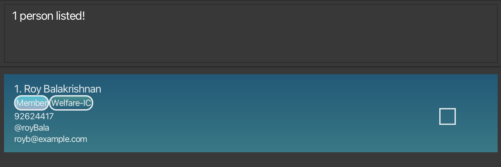
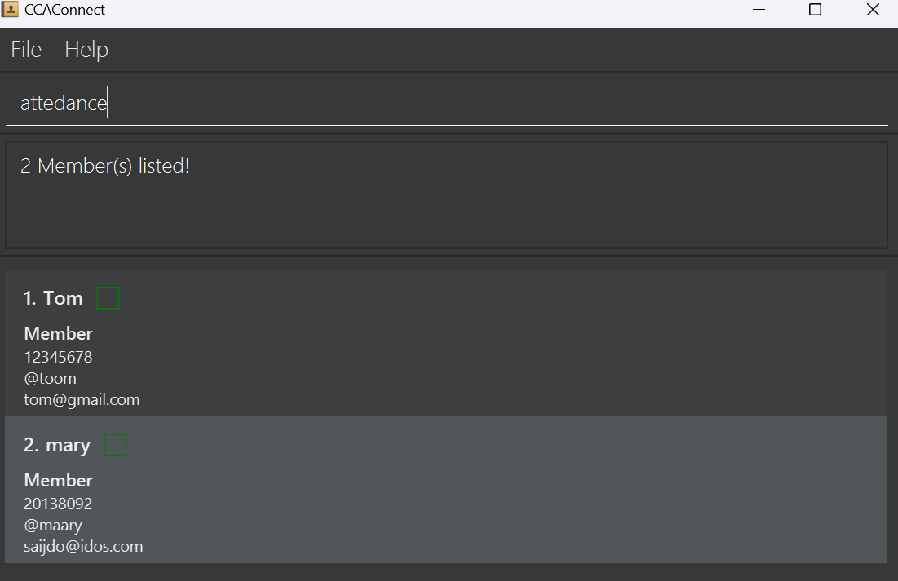

<!-- Project Title -->
<div align="center">
  <h1 style="font-weight:800;font-size:70px;">CCAConnect</h1>
</div>

CCAConnect is a desktop application that aims to **assist NUS CCA leaders** in **managing and collating relevant CCA personnel’s contact details**, as well as help to **track attendance details for CCA sessions**.
Equipped with features like **attendance marking**, **contact management**, **contact filtering** and **profile switching**, CCAConnect helps to reduce the headaches of personnel tracking.

<!-- Table of Content -->
## Table of Contents
* Table of Contents
{:toc}

--------------------------------------------------------------------------------------------------------------------

## Quick start

1. Ensure you have Java `17` or above installed in your Computer.

1. Download the latest `ccaconnect.jar` file from [here](https://github.com/AY2425S1-CS2103T-F11-2/tp/releases).

1. Copy the file to the folder you want to use as the _home folder_ for CCAConnect. This folder will also be used by CCAConnect to store data

1. Open a command terminal, and change the current working directory to the folder where `ccaconnect.jar` was placed in. E.g. If you placed `ccaconnect.jar` in the `~/Desktop/CCA` folder, type in the following command:
    ```dtd
    cd ~/Desktop/CCA
    ```

   1. Launch the CCAConnect application by typing in the following command:
       ```dtd
       java -jar ccaconnect.jar
       ```

      A GUI similar to the below should appear in a few seconds. Note that the app contains some sample data.<br>
      

1. Type the command in the command box and press Enter to execute it. e.g. typing **`help`** and pressing Enter will open the help window.<br>
   Some example commands you can try:

   * `list` : Lists all contacts.

   * `add n/John Doe p/98765432 e/johnd@example.com t/johnDoe` : Adds a person named `John Doe`, with those specified information.

   * `delete 1` : Deletes the 1st contact shown in the current list.

   * `clear` : Deletes all contacts stored in the current profile.

   * `exit` : Exits the app.

1. Refer to the [Features](#features) below for details of each command.

--------------------------------------------------------------------------------------------------------------------

## Features

<details>
  <summary style="font-weight:600;font-size:20px;">Notes about the command format:</summary>

  - Words in `UPPER_CASE` are the parameters to be supplied by the user.<br>
    - e.g. in `add n/NAME`, `NAME` is a parameter which can be used as `add n/John Doe`.<br><br>
  - Items in square brackets are optional.<br>
    - e.g `n/NAME [t/TAG]` can be used as `n/John Doe t/friend` or as `n/John Doe`.<br><br>
  - Items in square brackets are optional.<br>
    - e.g `n/NAME [t/TAG]` can be used as `n/John Doe t/friend` or as `n/John Doe`.<br><br>
  - Items with `…`​ after them can be used multiple times. If the item is optional, e.g. `[r/ROLE]…​`, it can also be used zero times<br>
    - e.g. `[r/ROLE]…​` can be used as ` ` (i.e. 0 times), `r/exco`, `r/member r/exco` etc. <br><br>
  - Parameters can be in any order.<br>
    - e.g. if the command specifies `n/NAME p/PHONE_NUMBER`, `p/PHONE_NUMBER n/NAME` is also acceptable.<br><br>
  - The parameter prefixes (e.g. `n/`) with leading spaces are considered restricted keywords, and may not be present within existing parameters. However, for some parameters, using it within the parameter without a leading space (e.g. `n/a` within `ROLE`) is allowed
</details>

<div markdown="span" class="alert alert-warning">:exclamation: **Caution:**<br/>
If you are using a PDF version of this document, be careful when copying and pasting commands that span multiple lines as space characters surrounding line-breaks may be omitted when copied over to the application.
</div>


### Viewing help : `help`

Opens a new window that displays a list of all available commands along with their usage instructions.


#### Format
```
help
```


### Adding a person: `add`

Adds a person to the address book.

#### Format
```
add n/NAME p/PHONE_NUMBER e/EMAIL t/TELEGRAM [r/ROLE]…​ [f/]
```

#### Alias
`a` can be used in place of `add`.

#### Parameters

| Parameter      | Prefix | Compulsory? | Remarks                                                                                                                                      |
|----------------|--------|-------------|----------------------------------------------------------------------------------------------------------------------------------------------|
| `NAME`         | `n/`   | Yes         | Represents the name of a contact.<br/> Should contain non-numeric characters and spaces, and should not be blank.                            |
| `PHONE_NUMBER` | `p/`   | Yes         | Represents the phone number of a contact.<br/> Should be a valid Singapore phone number (i.e. have 8 digits and start with 3, 6, 8, or 9).   |
| `EMAIL`        | `e/`   | Yes         | Represents the email of a contact.<br/> Should be a valid email address (follow the restrictions provided in the error message).             |
| `TELEGRAM`     | `t/`   | Yes         | Represents the telegram handle of a contact.<br/> Should be alphanumeric characters, and be between 5-32 characters long.                    |
| `ROLE`         | `r/`   | No          | Represents the role(s) held by the contact.<br/> Should be between 1-20 characters long.                                                     |
|                | `f/`   | No          | Represents the favouriting of a contact.<br/> This keyword should be included only if you intend for this contact to be a favourite contact. |

<div markdown="span" class="alert alert-primary">:bulb: **Tip:**<br/>
A person is uniquely identified by his/her **telegram handle**
</div>

<div markdown="span" class="alert alert-primary">:bulb: **Tip:**<br/>
A person can have any number of roles (including 0)
</div>

#### Example
* `add n/John Doe p/98765432 e/johnd@example.com t/johnDoe12`
* `a n/Betsy Crowe r/chairperson e/betsycrowe@example.com t/betsyC p/81234567 r/member f/`

### Listing all persons : `list`

Shows a list of all persons in the address book. <br/>
This can be used to reset the list of contacts back to its unfiltered state

#### Format
```
list
```

#### Alias
`l` can be used in place of `list`.

### Editing a person : `edit`

Edits an existing person in the address book.

#### Format
```
edit INDEX [n/NAME] [p/PHONE] [e/EMAIL] [a/ADDRESS] [r/ROLE]…​
```

#### Alias
`e` can be used in place of `edit`.

#### Parameters

| Parameter      | Prefix | Compulsory? | Remarks                                                                                                                                                                                                       |
|----------------|--------|-------------|---------------------------------------------------------------------------------------------------------------------------------------------------------------------------------------------------------------|
| `INDEX`        |        | Yes         | Edits the person at the specified `INDEX`.<br/> The index refers to the index number shown in the displayed person list.<br/> The index **must be a positive integer** (e.g. 1, 2, 3, …​, 2147483647).        |
| `NAME`         | `n/`   | No          | Represents the name of a contact.<br/> Should contain non-numeric characters and spaces, and should not be blank.                                                                                             |
| `PHONE_NUMBER` | `p/`   | No          | Represents the phone number of a contact.<br/> Should be a valid Singapore phone number (i.e. have 8 digits and start with 3, 6, 8, or 9).                                                                    |
| `EMAIL`        | `e/`   | No          | Represents the email of a contact.<br/> Should be a valid email address (follow the restrictions provided in the error message).                                                                              |
| `TELEGRAM`     | `t/`   | No          | Represents the telegram handle of a contact.<br/> Should be alphanumeric characters, and be between 5-32 characters long.                                                                                     |
| `ROLE`         | `r/`   | No          | Represents the role(s) held by the contact.<br/> Should be between 1-20 characters long.<br/> When editing roles, the existing roles of the person will be removed. I.e. Adding of roles is *not* cumulative. |
|                | `f/`   | No          | Represents the favouriting of a contact.<br/> This keyword should be included only if you intend for this contact to be a favourite contact.                                                                  |
|                | `nf/`  | No          | Represents unfavouriting of a contact. <br/> This keyword should be included only if you intend for this contact to be unfavourited.                                                                          |

* At least one of the optional fields must be provided.
* Existing values will be updated to the input values.
* Only one of `f/` or `nf/` should be present in the command at once, not both.

<div markdown="span" class="alert alert-primary">:bulb: **Tip:**<br/>
You can remove all the person’s roles by typing `r/` without specifying any roles after it.
</div>

#### Example
*  `edit 1 p/91234567 e/johndoe@example.com` Edits the phone number and email address of the 1st person to be `91234567` and `johndoe@example.com` respectively.
*  `edit 2 n/Betsy Crower t/` Edits the name of the 2nd person to be `Betsy Crower` and clears all existing roles.

### Locating persons: `find`

Search for contact(s) whose contact details satisfy either of the following:
1. Name contains any of the given name keyword(s)
2. Has a role stated by any of the role keyword(s)
3. Telegram handle which matches exactly with any of the given telegram keyword(s)
4. Is a favourite contact

#### Format
```
find [n/NAMEKEYWORD]…​ [r/ROLEKEYWORD]…​ [t/TELEGRAMKEYWORD]…​ [f/]
```

<div markdown="span" class="alert alert-primary">:bulb: **Tip:**<br/>
When using `find`, at least **one** of the optional parameters must be included.
</div>

#### Alias
`f` can be used in place of `find`.

#### Parameters

| Parameter         | Prefix | Compulsory? | Remarks                                                                                                                                                                    |
|-------------------|--------|-------------|----------------------------------------------------------------------------------------------------------------------------------------------------------------------------|
| `NAMEKEYWORD`     | `n/`   | No          | Represents the name to be searched.<br/> `NAMEKEYWORD` can be a partial match for the name                                                                                 |
| `ROLEKEYWORD`     | `r/`   | No          | Represents the role to be searched.<br/> `ROLEKEYWORD` has to match exactly with the role. <br/> Contacts with roles matching at least one `ROLEKEYWORD` will be returned. |
| `TELEGRAMKEYWORD` | `t/`   | No          | Represents the telegram handle to be searched.<br/> `TELEGRAMKEYWORD` has to match exactly with the telegram handle                                                        |
|                   | `f/`   | No          | Represents finding all contacts that have been favourited                                                                                                                  |

* The search is case-insensitive for all parameters. E.g `hans` will match `Hans`
* Persons matching at least one keyword will be returned (i.e. `OR` search).

#### Example
##### Usage: Find by name
* `find n/david` returns `David Li`<br>
  

##### Usage: Find by role
* `find r/treasurer` returns `Irfan Ibrahim` who has the role `Treasurer`<br>
  

##### Usage: Find by telegram
* `find t/alexyeoh` returns `Alex Yeoh` who has a telegram handle `alexYeoh`<br>
  

##### Usage: Find by favourite
* `find f/` returns 1 favourite contact<br>
  

##### Usage: Find composition
Composing all 4 types of search will give an `OR` search, a contact that has at least one matching criteria will be returned.
* `find n/david f/` returns all contacts with a name that partially matches `john`, **OR** are favourited contacts

### Sorting the contacts: `sort`

Sorts the list of contacts by name, in a user-specified order.<br/>
Sorting works together with the `find` command, meaning that if you sort after reducing the number of listed contacts, the sorting occurs for those listed contacts.

#### Format
`sort ORDER`

#### Alias
`so` can be used in place of `sort`

#### Parameters

| Parameter | Prefix | Compulsory? | Remarks                                                                                                                                                                                                                                                    |
|-----------|--------|-------------|------------------------------------------------------------------------------------------------------------------------------------------------------------------------------------------------------------------------------------------------------------|
| `ORDER`   |        | Yes         | `ORDER` can only take the form of 3 possible options:<br/> `asc` - sorts by name in ascending order. <br/> `desc` - sorts by name in descending order. <br/> `og` - sorts by name in the original order, based on the initial positioning of the contacts. |

### Example
* `sort asc` sorts the current list of contacts by name, in ascending order

<div markdown="span" class="alert alert-primary">:bulb: **Tip:**<br/>
Even though `sort` orders the list of contacts in alphabetical order of their names, this action is case-insensitive. This means that the letters `A` and `a` will be treated equally, for instance.
</div>

### Deleting a person : `delete`

Deletes the specified person from the address book.

#### Format
```
delete INDEX
```

#### Alias
`d` can be used in place of `delete`.

#### Parameters

| Parameter | Prefix | Compulsory? | Remarks                                                                                                                   |
|-----------|--------|-------------|---------------------------------------------------------------------------------------------------------------------------|
| `INDEX`   |        | Yes         | Deletes the person at the specified `INDEX`.<br/> The index **must be a positive integer**, e.g. 1, 2, 3, …​, 2147483647. |

* The index refers to the index number shown in the displayed person list. This can change having previously used commands such as `find` or `sort`

#### Examples
* `list` followed by `delete 2` deletes the 2nd person in the address book.
* `find n/Betsy` followed by `delete 1` deletes the 1st person in the results of the `find` command.

### Listing all members for attendance : `attendance`

Lists all contacts that have the role “Member” in the address book, making it easier to check and mark attendance for them directly.

#### Format
```
attendance
```

#### Alias
`atd` can be used in place of `attendance`.

#### Parameters
This command does not take any additional parameters.

If any extra input is provided, an error message will be displayed.

#### Example


### Marking attendance : `mark`

Marks attendance for **members** with specified Telegram handles on a specific date.

#### Format
```
mark t/TELEGRAM…​ d/DATE
```

#### Alias
`m` can be used in place of `mark`.

#### Parameters

| Parameter  | Prefix | Compulsory? | Remarks                                                                                                                                                                                                                                                                                                                                                            |
|------------|--------|-------------|--------------------------------------------------------------------------------------------------------------------------------------------------------------------------------------------------------------------------------------------------------------------------------------------------------------------------------------------------------------------|
| `TELEGRAM` | `t/`   | Yes         | `TELEGRAM` must match exactly alphabetically to the telegram handle of the contact that is being marked. <br/> Note that `TELEGRAM` is not case-sensitive.<br/> `mark` accepts multiple handles separated by spaces, each beginning with `t/`. E.g. `... t/usera t/userb ...`.<br/> **Only telegram handles of contacts with the role of `Member` can be marked.** |
| `DATE`     | `d/`   | Yes         | `DATE` follows the format YYYY-MM-DD, e.g. `2024-10-11`, and should be an actual date no later than the current date. <br/> If multiple dates are included in the command, only the last one will be recorded as the attendance date.                                                                                                                              |

#### Example

**Please note this part is updated on 2024-11-07, the GUI may be different if duplicate them on another date.**

* `mark t/alexYeoh t/berniceYu d/2024-11-07`

  

* Mark attendance of contact with telegram `alexYeoh`, `berniceYu` first, then input command `mark t/alexYeoh t/berniceYu t/charlotte d/2024-11-07`

    

* Mark attendance of a non-member contact `mark t/davidLi d/2024-11-07`

  

* Mark attendance from a list with non-exist telegrams `mark t/alexYeoh t/berniceYu t/jerryNotexist d/2024-11-07`

  


### Unmarking attendance : `unmark`

Unmarks attendance for **members** with specified Telegram handles on a specific date.

#### Format
```
unmark t/TELEGRAM…​ d/DATE
```

#### Alias
`um` can be used in place of `unmark`.


#### Parameters

| Parameter  | Prefix | Compulsory? | Remarks                                                                                                                                                                                                                                                                                                                                                            |
|------------|--------|-------------|--------------------------------------------------------------------------------------------------------------------------------------------------------------------------------------------------------------------------------------------------------------------------------------------------------------------------------------------------------------------|
| `TELEGRAM` | `t/`   | Yes         | `TELEGRAM` must match exactly alphabetically to the telegram handle of the contact that is being marked. <br/> Note that `TELEGRAM` is not case-sensitive.<br/> `mark` accepts multiple handles separated by spaces, each beginning with `t/`. E.g. `... t/usera t/userb ...`.<br/> **Only telegram handles of contacts with the role of `Member` can be marked.** |
| `DATE`     | `d/`   | Yes         | `DATE` follows the format YYYY-MM-DD, e.g. `2024-10-11`, and should be an actual date no later than the current date. <br/> If multiple dates are included in the command, only the last one will be recorded as the attendance date.                                                                                                                              |

### Clearing all entries : `clear`

Clears all entries from the address book.

<div markdown="span" class="alert alert-warning">:exclamation: **Caution:**<br/>
This action permanently deletes all the entries from the address book! **Use with extreme caution**.
</div>

#### Format
```
clear
```

#### Alias
`c` can be used in place of `clear`


### Viewing a specific contact : `view`

Views all the contact information of the specified contact.

Format: `view t/TELEGRAM_HANDLE`

* Displays all contact information of the person with specified `TELEGRAM_HANDLE`
* `TELEGRAM_HANDLE` must contain 5 - 32 characters, and can only contain letters, numbers and underscores.

Examples:
* `view t/bob12` displays page containing all the information of the person with telegram handle `@bob12`<br>


### Exiting the program : `exit`

Exits the program.

#### Format
```
exit
```

### Switching a profile : `switch`
The `switch` command allows you to change the current session to a specified profile.
- If a valid profile name is provided, the session will switch to that profile.
  - If the profile already exists, it will switch to the existing profile.
  - If the profile does not exist, a new profile with that name will be created.


- If no profile name is provided (empty input) and multiple profiles exist, the command will display a list of
available profiles to switch to.
- Attempting to switch to the currently active profile will not perform a switch.

#### Format
```
switch PROFILE
```

#### Alias
`sw` can be used in place of `switch`

#### Parameters

| Parameter | Prefix | Compulsory? | Remarks                                                                                                                                                                                                                                                                                        |
|-----------|--------|-------------|------------------------------------------------------------------------------------------------------------------------------------------------------------------------------------------------------------------------------------------------------------------------------------------------|
| `PROFILE` |        | Yes         | `PROFILE` specifies the profile that `switch` will attempt to switch to.<br/> `PROFILE` must be between 1 and 30 characters, and can only contain letters (a-z, A-Z), numbers (0-9), hyphens (-), and underscores (_).<br/> `PROFILE` names are **case-insensitive** and treated as lowercase. |

#### Example
  - `switch john-doe` switches to a profile named 'john-doe'
  - `sw ALICE` switches to a profile named 'alice'
  - `switch` lists all available profiles that you can switch to, if they exist.

### Deleting a profile: `deleteProfile`

The `deleteProfile` command removes an existing profile from the system.

#### Format
```
deleteProfile PROFILE
```

#### Alias
`delp` can be used in place of `deleteProfile`

#### Parameters

| Parameter | Prefix | Compulsory? | Remarks                                                                                                                                                                                                                                                            |
|-----------|--------|-------------|--------------------------------------------------------------------------------------------------------------------------------------------------------------------------------------------------------------------------------------------------------------------|
| `PROFILE` |        | Yes         | `PROFILE` specifies the profile that `deleteProfile` will attempt to delete.<br/> `PROFILE` must meet all requirements from the `switch` command, and should be an existing profile. <br/> Additionally, `PROFILE` must not refer to the currently active profile. |


#### Example
Assuming your current profile is `addressbook`, then:
* `deleteProfile addressbook` is not allowed because `addressbook` is the active profile.
* `sw alice` switches the current profile to `alice`
* `delp addressbook` deletes the `addressbook` profile after switching to 'alice'


### Saving the data

AddressBook data are saved in the hard disk automatically after any command that changes the data. There is no need to save manually.

### Editing the data file

AddressBook data are saved automatically as a JSON file `[JAR file location]/data/addressbook.json`. Advanced users are welcome to update data directly by editing that data file.

<div markdown="span" class="alert alert-warning">:exclamation: **Caution:**<br/>
If your changes to the data file makes its format invalid, AddressBook will discard all data and start with an empty data file at the next run. Hence, it is recommended to take a backup of the file before editing it.<br>
Furthermore, certain edits can cause the AddressBook to behave in unexpected ways (e.g., if a value entered is outside of the acceptable range). Therefore, edit the data file only if you are confident that you can update it correctly.
</div>


--------------------------------------------------------------------------------------------------------------------

## FAQ

**Q**: How do I transfer my data to another Computer?<br>
**A**: Install the app in the other computer and overwrite the empty data file it creates with the file that contains the data of your previous CCAConnect home folder.

--------------------------------------------------------------------------------------------------------------------

## Known issues

1. **When using multiple screens**, if you move the application to a secondary screen, and later switch to using only the primary screen, the GUI will open off-screen. The remedy is to delete the `preferences.json` file created by the application before running the application again.
2. **If you minimize the Help Window** and then run the `help` command (or use the `Help` menu, or the keyboard shortcut `F1`) again, the original Help Window will remain minimized, and no new Help Window will appear. The remedy is to manually restore the minimized Help Window.

--------------------------------------------------------------------------------------------------------------------

## Command summary

| Action                | Format                                                                  | Example Usage                                                           |
|-----------------------|-------------------------------------------------------------------------|-------------------------------------------------------------------------|
| **Add**               | `add n/NAME p/PHONE_NUMBER e/EMAIL a/ADDRESS [r/ROLE]…​`                | `add n/James Ho p/82224444 e/jamesho@example.com t/jamesho r/logistics` |
| **Clear**             | `clear`                                                                 | `clear`                                                                 |
| **Delete**            | `delete INDEX`                                                          | `delete 3`                                                              |
| **Delete Profile**    | `deleteProfile PROFILE`                                                 | `deleteProfile alice`                                                   |
| **Edit**              | `edit INDEX [n/NAME] [p/PHONE_NUMBER] [e/EMAIL] [a/ADDRESS] [r/ROLE]…​` | `edit 2 n/James Lee e/jameslee@example.com`                             |
| **Find**              | `find [n/NAMEKEYWORD]…​ [r/ROLEKEYWORD]…​ [t/TELEGRAMKEYWORD]…​ [f/]`   | `find n/James Jake`                                                     |
| **Sort**              | `sort ORDER`                                                            | `sort ASC`                                                              |
| **Switch**            | `switch PROFILE`                                                        | `switch alice`                                                          |
| **List**              | `list`                                                                  | `list`                                                                  |
| **Help**              | `help`                                                                  | `help`                                                                  |
| **Attendance**        | `attendance`                                                            | `attendance`                                                            |
| **Mark Attendance**   | `mark t/TELEGRAM…​ d/DATE`                                              | `mark t/berniceYu t/alexYeoh d/2024-11-02`                              |
| **Unmark Attendance** | `unmark t/TELEGRAM…​ d/DATE`                                            | `unmark t/berniceYu d/2024-11-02`                                       |
| **View**              | `view t/TELEGRAM_HANDLE`<br> e.g., `view t/bob123`                      |                                                                         |
