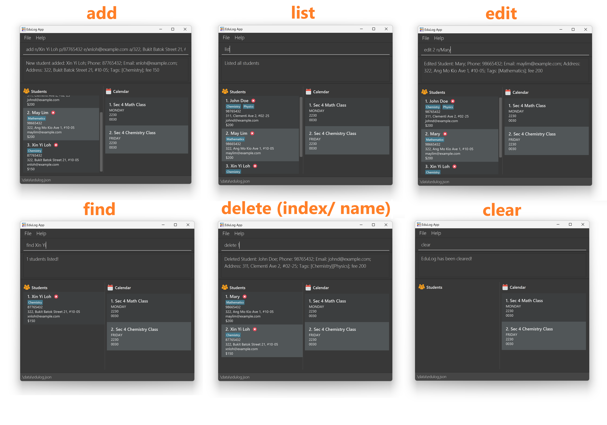
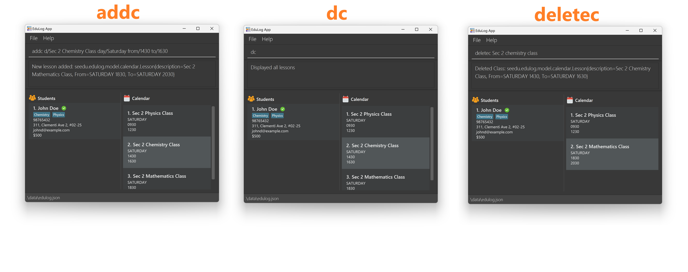
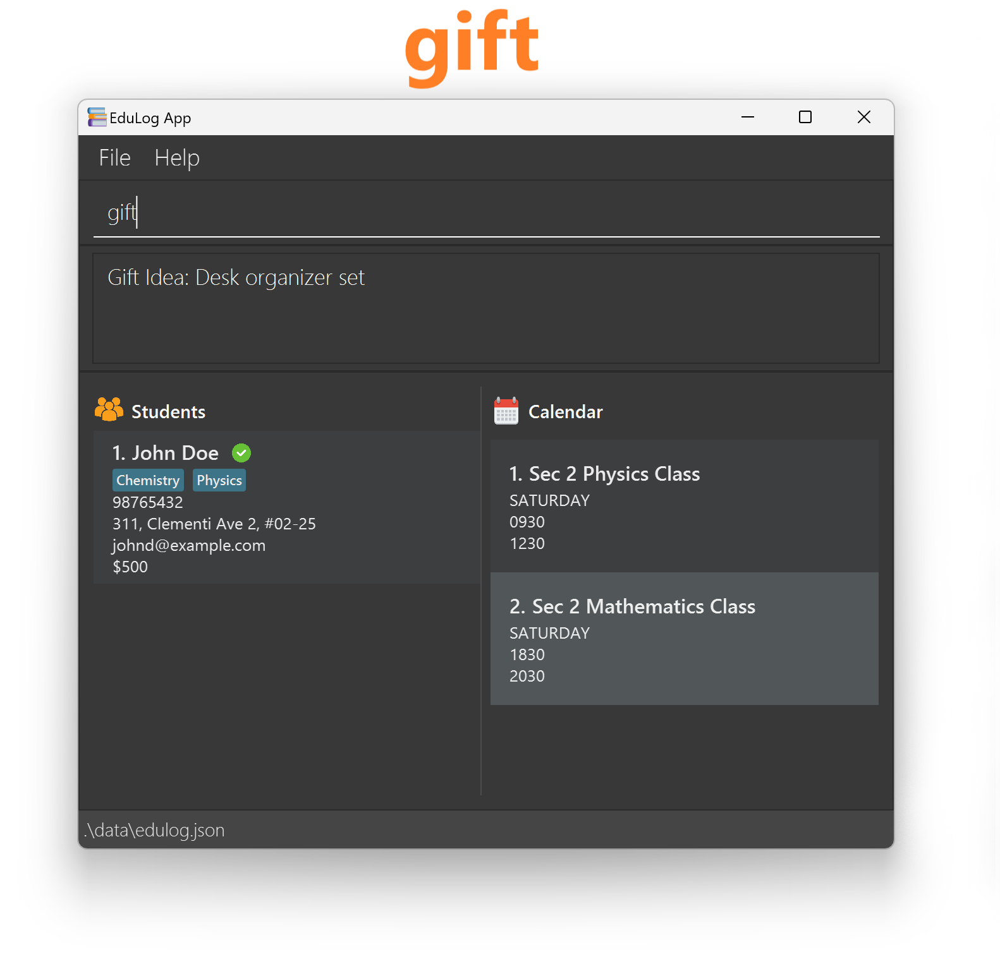
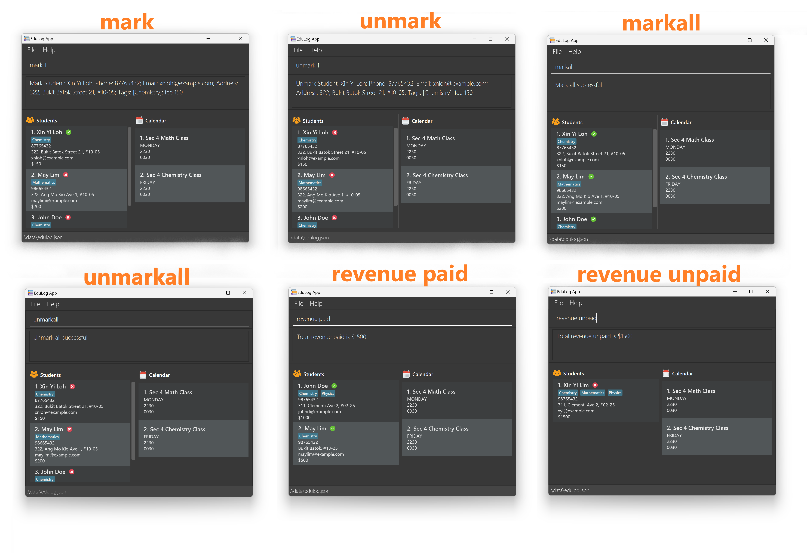

---
layout: default.md
title: "User Guide"
pageNav: 3
---

  

    
  

 

    <h4 style="font-size: 40px; padding-top: 20px; margin-bottom: 0;">EduLog User Guide</h4> <!-- Remove bottom margin on h1 -->
    <h4 style="font-size: 30px; color: black; margin-top: 0; font-weight: normal;">for Educators</h4> <!-- Subtitle style -->
 

EduLog is a **desktop app for managing students and lesson details, optimized for use via a Command Line Interface** (CLI) while still having the benefits of a Graphical User Interface (GUI). If you can type fast, EduLog can get your contact management tasks done faster than traditional GUI apps.

<!-- * Table of Contents -->
<page-nav-print />

--------------------------------------------------------------------------------------------------------------------

<box>
    <h7 style="display: flex; align-items: center; color: black; font-weight: 600; margin-bottom: 10px">
      
      Navigation Tip
    </h7>
    
<code>Use Ctrl</code> + <code>F</code> (Windows) or <code>Cmd</code> + <code>F</code> (MacOS) to find specific content on the page.

</box>

## Quick Start

1. Ensure you have Java `17` or above installed in your Computer.

2. Download the latest `.jar` file from [here](https://github.com/AY2425S1-CS2103T-W09-2/tp/releases).

3. Copy the file to the folder you want to use

4. Open a command terminal. Go to the folder where you saved the jar file by typing cd followed by the folder's path. Then, type `java -jar edulog.jar` and press Enter to start the application.
    * A path is the location of a file or folder on your computer. It shows how to find the file starting from the main storage area (like the C: drive on Windows). For example, if your file is in a folder called "MyApps" on your desktop, the path might look like this:
    * On Windows: `C:\Users\Your\Username\Desktop\MyApps`
    * On Mac/Linux: `/Users/YourUsername/Desktop/MyApps`

   
A screen (User Interface) similar to the below should appear in a few seconds. Note how the app contains some sample data.

5. Type the command in the command box and press Enter to execute it. e.g. typing `help` and pressing Enter will open the help window.

   Some example commands you can try:

    * `list` : Lists all contacts.

    * `add n/John Doe p/98765432 e/johnd@example.com a/John street, block 123, #01-01 f/100` : Adds a contact named `John Doe` to the EduLog.

    * `delete 3` : Deletes the 3rd contact shown in the current list.

    * `clear` : Deletes all contacts.

    * `exit` : Exits the app.

6. Refer to the [Features](#features) below for details of each command.

## Features 

<box>
    <h5 style="display: flex; align-items: center; color: black; font-weight: 600; margin-bottom: 10px">
      
      Notes about the command format
    </h5>
    <ul>
      <li style="margin-bottom: 15px;">Words in <code>UPPER_CASE</code> are the parameters to be supplied by the user. 
        e.g. in <code>add n/NAME</code>, <code>NAME</code> is a parameter which can be used as <code>add n/John Doe</code>.
      </li>
      <li style="margin-bottom: 15px;">Items in square brackets are optional.  
        e.g <code>n/NAME [t/TAG]</code> can be used as <code>n/John Doe t/friend</code> or as <code>n/John Doe</code>.
      </li>
      <li style="margin-bottom: 15px;">Items with <code>…</code> after them can be used multiple times including zero times.  
        e.g. <code>[t/TAG]...</code> can be used as <code> </code> (i.e. 0 times), <code>t/friend</code>, <code>t/friend t/family</code> etc.
      </li>
      <li style="margin-bottom: 15px;">Parameters can be in any order.  
        e.g. if the command specifies <code>n/NAME p/PHONE_NUMBER</code>, <code>p/PHONE_NUMBER n/NAME</code> is also acceptable.
      </li>
      <li style="margin-bottom: 15px;">Extraneous parameters for commands that do not take in parameters (such as <code>help</code>, <code>list</code>, <code>exit</code>, and <code>clear</code>) will be ignored. 
        e.g. if the command specifies <code>help 123</code>, it will be interpreted as <code>help</code>.
      </li>
      <li style="margin-bottom: 15px;">If you are using a PDF version of this document, be careful when copying and pasting commands that span multiple lines as space characters surrounding line-breaks may be omitted when copied over to the application.
      </li>
    </ul>
</box>

### 1. General commands

#### 1.1 Viewing help : `help`

Shows a message explaining how to access the help page.

Format: `help`

#### 1.2 Exiting the program : `exit`

Exits the program.

Format: `exit`

### 2. Student Commands

#### 2.1 Adding a student: `add`

Adds a student to the edulog.

Format: `add n/NAME p/PHONE_NUMBER e/EMAIL a/ADDRESS f/fee [t/TAG]...`  
*For names, only alphanumeric characters are supported.*

<box type="tip" seamless>
Tip: A person can have any number of tags (including 0)
</box>

Examples:

* `add n/John Doe p/98765432 e/johnd@example.com a/John street, block 123, #01-01 f/100`
* `add n/Betsy Crowe t/friend e/betsycrowe@example.com a/Newgate Prison p/1234567 f/100 t/criminal`
* `add n/Ben Lim p/98765432 e/ben@example.com a/John street, block 123, #01-01 f/100`
#### 2.2 Listing all students : `list`

Shows a list of *all* students in EduLog. Students not displayed will be displayed after entering this command.

Format: `list`

#### 2.3 Editing a student : `edit`

Edits an existing student in the edulog.

Format: `edit INDEX [n/NAME] [p/PHONE] [e/EMAIL] [a/ADDRESS] [f/fee] [t/TAG]…​`

* Edits the student at the specified `INDEX`. The index refers to the index number shown in the displayed student list. The index **must be a positive integer** 1, 2, 3, …​
* At least one of the optional fields must be provided.
* Existing values will be updated to the input values.
* When editing tags, the existing tags of the student will be removed i.e adding of tags is not cumulative.
* You can remove all the student’s tags by typing `t/` without specifying any tags after it.

Examples:

* `edit 1 p/91234567 e/johndoe@example.com` Edits the phone number and email address of the 1st student to be `91234567` and `johndoe@example.com` respectively.
* `edit 2 n/Betsy Crower t/` Edits the name of the 2nd student to be `Betsy Crower` and clears all existing tags.
* `edit 2 f/50` Edits the tuition fee of the 2nd student to $50

#### 2.4 Locating students by name: `find`

Finds students whose names contain any of the given keywords.

Format: `find KEYWORD [MORE_KEYWORDS]`

* The search is case-insensitive. e.g `hans` will match `Hans`
* The order of the keywords does not matter. e.g. `Hans Bo` will match `Bo Hans`
* Only the name is searched.
* Only full words will be matched e.g. `Han` will not match `Hans`
* Students matching at least one keyword will be returned (i.e. `OR` search). e.g. `Hans Bo` will return `Hans Gruber`, `Bo Yang`

Examples:

* `find John` returns `john` and `John Doe`
* `find alex david` returns `Alex Yeoh`, `David Li`

#### 2.5 Deleting a student by index: `delete`

Deletes the specified student from the EduLog. 

Format: `delete INDEX`

* Deletes the student at the specified `INDEX`.
* The index refers to the index number shown in the displayed student list.
* The index **must be a positive integer** 1, 2, 3, …​

Examples:

* `list` followed by `delete 2` deletes the 2nd student in the edulog.
* `find Betsy` followed by `delete 1` deletes the 1st student in the results of the `find` command.

#### 2.6 Deleting a student by name: `delete`

Deletes the specified student from the edulog. The student you want to delete must be displayed in EduLog.
For example, if you filtered the student list, and student `Bob` is no longer in the list, `delete Bob` will not work.

Format: `delete Name`

* Deletes the student by the specified Name.
* The name refers to the name shown in the displayed student list.
* The name is case-sensitive.
* The name of the student needs to be displayed.

Examples:

* `list` followed by `delete Nikhil` deletes student named “Nikhil” in the edulog.
* `find Betsy` followed by `delete Betsy` deletes the student in the results of the `find` command.

#### 2.7 Clearing all entries : `clear`

Clears all entries from the edulog.

Format: `clear`

#### Summary of Student Commands

### 3. Calendar Commands

#### 3.1 Adding a lesson: `addc`

Adds a lesson to the edulog.

Format: addc `d/DESCRIPTION day/DAY OF THE WEEK from/START TIME (24H FORMAT) to/END TIME (24H FORMAT)​`

Example:

* `addc d/Sec 4 Science Class day/Sunday from/1000 to/1215`
* `addc d/Sec 4 Math Class day/Monday from/2230 to/0030`

Experienced users may provide a 3-letter shorthand for the day of the week for quicker typing.
This is non-case sensitive.

Example:

* `addc d/Sec 4 Math Class day/mon from/2230 to/0030`

Note:

- Lessons cannot share the same description - but may overlap in time together.
- Lessons are allowed to go past midnight from day to another - in that case, the lesson would be written to span
exactly 2 days, ending the day after the start day.
- However, lessons are not allowed to have exactly the same start and end time.

#### 3.2 Listing all lessons : `dc`

Shows a list of all lessons in the edulog.

Format: `dc`

#### 3.3 Deleting a lesson : `deletec`

Deletes the student identified by the description used in the displayed calendar.

Format: `deletec DESCRIPTION`

* Deletes the lesson with the given description.
* The description refers to the description shown in the displayed lesson list.

Examples:

* `deletec Secondary 4 Chemistry Class`

#### Summary of Calendar Commands

### 4. Gift Command

#### 4.1 Get a random gift idea: `gift`

Generates a random gift idea.

Format: gift

#### 4.2 Discount Links `[coming in v2.0]`

In v2.0, we plan to include links to our website to shop for gifts at discounted prices.

#### Summary of Gift Commands

### 5. Revenue Commands

#### 5.1 Marking a student as paid: `mark'

Denotes an existing student as paid. The student may either be identified by index number
in the edulog (starting from 1) or name (this is both case-sensitive and space-sensitive within the name provided).

Format: `mark <INDEX - must be a positive integer>` OR `mark <STUDENT NAME>`

Examples:
* `mark 3`
* `mark Alex Yeoh`

#### 5.2 Marking all students' as paid: `markall'

Denotes all existing students as paid.

Format: `markall`

Examples:
* `markall`
* `markall ofoeofn4334f30f04a3dr34r` (all subsequent inputs are ignored)

#### 5.3 Unmarking a student as paid: `unmark'

Denotes an existing student as unpaid. The student may either be identified by index number
in the edulog (starting from 1) or name (this is both case-sensitive and space-sensitive within the name provided).

Format: `unmark <INDEX - must be a positive integer>` OR `unmark <STUDENT NAME>`

Examples:
* `unmark 3`
* `unmark Alex Yeoh`

#### 5.4 Unmarking all students' as paid: `unmarkall'

Denotes all existing students as unpaid.

Format: `unmarkall`

Examples:
* `unmarkall`
* `unmarkall ofoeofn4334f30f04a3dr34r` (all subsequent inputs are ignored)

#### 5.5 Calculating Revenue

* Calculates the total amount of money earned from student who has paid/not paid
* Filters the list of students based on their payment status.
* Until `list` is used, only unpaid or paid students will be displayed depending on the command used. 

Format: `revenue [paid/unpaid]`

Example
* `revenue paid`
* `revenue unpaid`

If the command is successful, the total amount of money will be displayed in this format: `Total revenue S is $X`, 
where S is `paid` or `unpaid` and X is the money earned. 
If `revenue paid` is used, only students who have paid will be shown in the list.
If `revenue unpaid` is used, only students who have not paid will be shown in the list.

#### Summary of Revenue Commands

### 6. Data Files

#### 6.1 Saving the data

EduLog data are saved in the hard disk automatically after any command that changes the data. There is no need to save manually.

#### 6.2 Editing the data file

EduLog data are saved automatically as a JSON file `[JAR file location]/data/edulog.json`. Advanced users are welcome to update data directly by editing that data file.

<box type="warning" seamless>
Caution:
If your changes to the data file makes its format invalid, EduLog will discard all data and start with an empty data file at the next run.  Hence, it is recommended to take a backup of the file before editing it. 
Furthermore, certain edits can cause the EduLog to behave in unexpected ways (e.g., if a value entered is outside the acceptable range). Therefore, edit the data file only if you are confident that you can update it correctly.
</box>

#### 6.3 Archiving data files `[coming in v2.0]`

*Details will be given in v2.0*

## 

## FAQ
**Q**: How do I transfer my data to another Computer?

**A**: Install the app in the other computer and overwrite the empty data file it creates with the file that contains the data of your previous EduLog home folder.

## Known Issues
1. **When using multiple screens**, if you move the application to a secondary screen, and later switch to using only the primary screen, the GUI will open off-screen. The remedy is to delete the `preferences.json` file created by the application before running the application again.
2. **If you minimise the Help Window** and then run the `help` command (or use the `Help` menu, or the keyboard shortcut `F1`) again, the original Help Window will remain minimised, and no new Help Window will appear. The remedy is to manually restore the minimised Help Window.

## Command Summary 

#### General Commands

| Action | Format, Examples |
|---|---|
| `help` | `help` |
| `exit` | `exit` |

#### Student Commands

| Action | Format, Examples |
|---|---|
| `add` | `add n/NAME p/PHONE_NUMBER e/EMAIL a/ADDRESS f/FEE [t/TAG]…​`   e.g., `add n/James Ho p/22224444 e/jamesho@example.com a/123, Clementi Rd, 1234665 t/friend t/colleague f/100` |
| `list` | `list` |
| `edit` | `edit INDEX [n/NAME] [p/PHONE_NUMBER] [e/EMAIL] [a/ADDRESS] [f/FEE] [t/TAG]…​`  e.g.,`edit 2 n/James Lee e/jameslee@example.com f/50` |
| `find` | `find KEYWORD [MORE_KEYWORDS]`  e.g., `find James Jake` |
| `delete` | `delete INDEX` or `delete NAME`  e.g., `delete 3`, `delete Nikhil` |
| `clear` | `clear` |

#### Calendar Commands

| Action | Format, Examples |
|---|---|
| `addc` | `addc d/DESCRIPTION day/DAY_OF_THE_WEEK from/START_TIME_(24H_FORMAT) to/END_TIME_(24H_FORMAT)`   e.g `addc d/Sec 4 Science Class day/Sunday from/1000 to/1215` |
| `dc` | `dc` |
| `deletec` | `deletec DESCRIPTION`   e.g. `deletec Secondary 4 Chemistry Class` |

#### Gift Commands

| Action | Format |
|---|---|
| `gift` | `gift` |

#### Revenue Commands

| Action | Format, Examples |
|---|---|
| `mark` | `mark INDEX` or `mark STUDENT_NAME`   e.g. `mark 3`, `mark Alex Yeoh` |
| `markall` | `markall` |
| `unmark` | `unmark INDEX` or `unmark STUDENT_NAME`   e.g. `unmark 3`, `unmark Alex Yeoh` |
| `unmarkall` | `unmarkall` |
| `revenue` | `revenue [paid/unpaid]`   e.g. `revenue paid`, `revenue unpaid` |

