# Medicontact 

Medicontact is a desktop app to help **small GP Clinics in Singapore for manage patient contacts**. It is centered around typed commands and meant for healthcare administrative staff. If you can type fast, MediContact can get your contact management tasks done faster than traditional apps.

<!-- * Table of Contents -->
<page-nav-print />

--------------------------------------------------------------------------------------------------------------------

## Quick start

1. Ensure you have Java `17` or above installed in your Computer. Instructions for Java `17` are available [here](https://www.oracle.com/java/technologies/javase/jdk17-archive-downloads.html).

1. Download the `MediContact.jar` file from [here](https://github.com/AY2425S1-CS2103T-T10-1/tp/releases/tag/v1.5). Scroll all the way down to see **Assets** and click on `MediContact.jar` to install. 

1. Copy the file to the folder you want to use as the _home folder_ for MediContact. We recommend naming this folder `MediContact`. Place `MediContact.jar` in this folder.<br>

   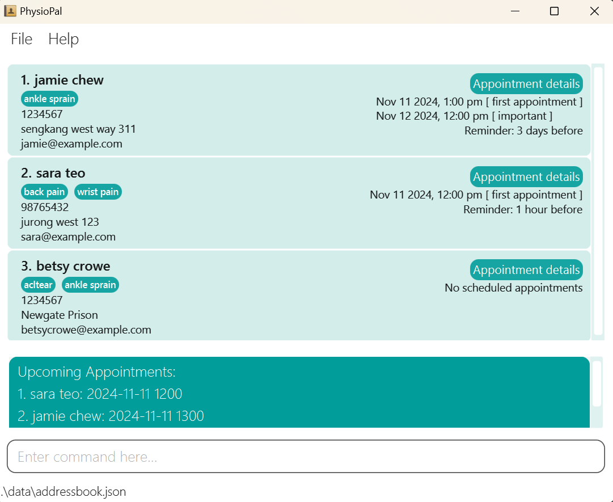<br>

1. Open a command terminal (called `Terminal` on MacOS and `Command Prompt` on Windows). Change directory into the folder you put the jar file in using the command `cd`. Here are detailed instructions for how to change directory in [MacOS](https://youtu.be/VRFcEMPES7U) and in [Windows](https://www.youtube.com/watch?v=BfXh11ryBJg).

1. Once you're in the same directory as `MediContact.jar`, use the command `java -jar MediContact.jar` to run the application. You're terminal should look something like this right before you enter the last command. The redacted portion should show your current directory.<br>

   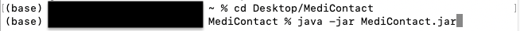<br>

   A GUI similar to the below should appear in a few seconds. Note how the app contains some sample data.<br>

   <br>

1. Type commands in the command box and press Enter to execute it. e.g. typing **`help`** and pressing Enter will open the help window.<br>
   Some example commands you can try:

* `list` : Lists all contacts.

* `add n/John Doe p/98765432 e/johnd@example.com a/John street, block 123, #01-01 b/40 s/Male` : Adds a contact named `John Doe` to the Address Book.

* `delete 3` : Deletes the 3rd contact shown in the current list.

* `clear` : Deletes all contacts.

* `exit` : Exits the app.

7. Refer to the [Features](#features) below for details of each command.

--------------------------------------------------------------------------------------------------------------------

## <i class="fa-solid fa-address-book"></i> Features

<box type="info" icon=":fa-solid-circle-info:" no-background light >

**Notes about the command format:**<br>

* Words in `UPPER_CASE` are the parameters to be supplied by the user.<br>
  e.g. in `add n/NAME`, `NAME` is a parameter which can be used as `add n/John Doe`.

* Items in square brackets are optional.<br>
  e.g `n/NAME [t/TAG]` can be used as `n/John Doe t/friend` or as `n/John Doe`.

* Items with `…`​ after them can be used multiple times including zero times.<br>
  e.g. `[t/TAG]…​` can be used as ` ` (i.e. 0 times), `t/patient`, `t/patient t/family` etc.

* Parameters can be in any order.<br>
  e.g. if the command specifies `n/NAME p/PHONE_NUMBER`, `p/PHONE_NUMBER n/NAME` is also acceptable.

* Extraneous parameters for commands that do not take in parameters (such as `help`, `list`, `exit` and `clear`) will be ignored.<br>
  e.g. if the command specifies `help 123`, it will be interpreted as `help`.

* Command keywords are case insensitive
  e.g. the command `add n/John Doe`, is equal to `Add n/John Doe`.

* Parameter `NAME` is case insensitive
  e.g. the command `delete John Doe`, is equal to `delete john doe` or `delete JOHn DoE`.

* If you are using a PDF version of this document, be careful when copying and pasting commands that span multiple lines as space characters surrounding line-breaks may be omitted when copied over to the application.
</box>

[Return to Table of Contents](#medicontact)

<br>


### <i class="fa-solid fa-user-plus"></i> Adding a patient contact: `add`

Adds a patient contact to the address book.
<box type="definition" icon=":fa-solid-spell-check:" light no-background>
<md>**Format**: `add n/NAME p/PHONE_NUMBER e/EMAIL a/ADDRESS b/AGE s/SEX
[ap/FUTURE APPOINTMENT]…​ [t/TAG]…​`
</md>
</box>

- `PHONE_NUMBER` must only contain characters 0-9 and must be exactly 8 digits long.
- `EMAIL` should be in the format **local-part@domain** whereby the local-part contains only alphanumeric characters and some special characters like +_.- but may not start with the special characters. The domain name must end with a domain label at least 2 characters long and start and end with alphanumeric characters. The domain label should consist of alphanumeric characters separated only be hyphens, if any.
- `ADDRESS` must not contain any of the prefixes (e.g. `\n`, `\ap`) and must not begin with a space.
- `AGE` must only contain characters 0-9 and must be 1-3 digits long.
- `SEX` must only contain alphanumeric characters.
- `FUTURE APPOINTMENT` should be in the format **dd/MM/yyyy HHmm** and be after your current time.
- `TAG` must only contain alphanumeric characters.

<box type="tip" no-background light>

**Remarks**: 

- Duplicate **names** are not permitted. MediContact cannot contain two `John Doe` or a `Betsy Crowe` and a `betsy crowe`

- A patient can have any number of tags (including 0). Duplicate tags will be ignored (e.g. if added contact includes paramters `t/patient t/patient` the contact will only include 1 `patient` tag). 

- A patient can have any number of future appointments (including 0).

- A patient's sex is not limited to Male/Female/Other to provide you with more flexibility.

- A patient aged 0 is allowed for accurate tracking of a newborns age. 

- There is also a higher age limit of 999 to provide you with more flexibility.

- Duplicate phone numbers are allowed for cases like parents and children sharing a same number.

- Fields in square brackets (e.g. `[ap/FUTURE APPOINTMENT]`) are optional.
</box>
<box type="warning" icon=":fa-solid-book:" no-background light>

**Examples**:

* `add n/John Doe p/98765432 e/johnd@example.com a/John street, block 123, #01-01 b/40 s/Male`
* `add n/Betsy Crowe t/friend e/betsycrowe@example.com a/Newgate Hospital p/12345678 t/patient b/20 s/Female`
* `add n/Evie Sage p/88888888 e/eviesage@example.com a/Hickory Forest b/23 s/Female ap/11/11/2025 1100`

**Input**<br>

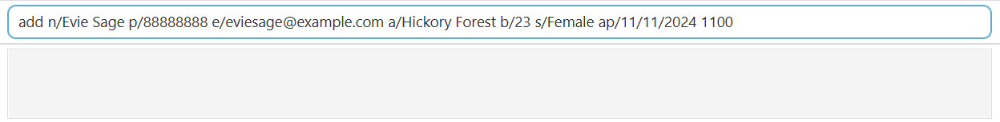<br>

**Output**<br>

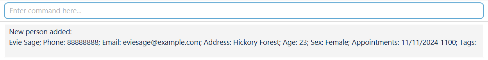
</box>

[Return to Table of Contents](#medicontact)
<br>
<br>

### <i class="fa-solid fa-broom"></i> Clearing all entries : `clear`

Clears all patient entries from the address book.
<box type="definition" icon=":fa-solid-spell-check:" light no-background>

**Format**: `clear`
</box>

<box type="warning" icon=":fa-solid-circle-info:" light no-background>

**Warning**: After confirmation, any cleared data or patient contact cannot be retrieved. This action is IRREVERSIBLE.

</box>

* Recommended practice: Always have a copy of current data. You may refer to [Exporting the data](#exporting-the-data). You can use [import feature](#importing-contacts-import) if you have lost your data after clearing it unintentionally.
* You can directly delete the `addressbook.json` file which can be found in data folder or in the data directory if you want to recover the sample data.

<box type="important" light no-background>

**Confirmation Requirement:**

* A confirmation window will appear before clearing all patient contacts in MediContact, 
asking you to confirm if you are sure you want to proceed. 
You must select `OK` to clear the address book. If you select `Cancel`, 
the action will be aborted, and the address book will remain unchanged.
* Keyboard commands such as `Enter`, `Return`, and `Space` act as shortcuts to select the OK button, while `Esc` triggers the cancel button.

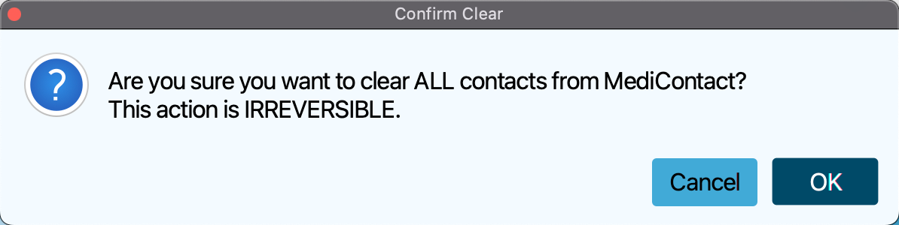
</box>

[Return to Table of Contents](#medicontact)
<br>
<br>


### <i class="fa-solid fa-user-slash"></i> Deleting a patient contact: `delete`

Deletes the specified patient contact from the address book.

<box type="definition" icon=":fa-solid-spell-check:" light no-background>

**Format**: `delete INDEX` / `delete NAME`
</box>

<box type="warning" icon=":fa-solid-circle-info:" light no-background>

**Warning**: After confirmation, any deleted data or patient contact cannot be retrieved. This action is IRREVERSIBLE.

</box>

* Deletes the patient contact at the specified `INDEX` or with the specified `NAME`.
* The `NAME` refers to the full name as shown in the displayed patient contact list.
* The `INDEX` refers to the index number shown in the displayed patient contact list.
* The `INDEX` **must be a positive integer** 1, 2, 3, …​
* The `NAME` provided must be the patient's full name.
<box type="important" light no-background>

**Confirmation Requirement:**

* A confirmation window will appear before deleting a patient contact, asking you to confirm the deletion.
  You must select `OK` to proceed with the deletion. If you select `Cancel` the action will be aborted,
  and the patient contact will not be deleted.
* Keyboard commands such as `Enter`, `Return`, and `Space` act as shortcuts to select the OK button, while `Esc` triggers the cancel button.


</box>
<box type="warning" icon=":fa-solid-book:" no-background light>

**Examples**:

* `list` followed by `delete Evie Sage` followed by clicking `OK `deletes the patient with name `Evie Sage` in the address book.
* `list` followed by `delete 2` followed by clicking `OK` deletes the 2nd patient contact in the address book.
* `find Betsy` followed by `delete 1` followed by clicking `OK` deletes the 1st patient contact in the results of the `find` command.<br>

**Input**<br>

<br>

**Output**<br>

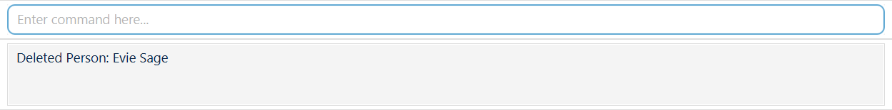
</box>

[Return to Table of Contents](#medicontact)
<br>
<br>

### <i class="fa-solid fa-pen"></i> Editing a patient contact : `edit`

Edits an existing patient contact in the address book.

<box type="definition" icon=":fa-solid-spell-check:" light no-background>

**Format**: `edit NAME [n/NAME] [p/PHONE] [e/EMAIL] [a/ADDRESS] [b/AGE] [s/SEX] [ap/FUTURE APPOINTMENT]…​ [t/TAG]…​`
</box>

* Edits the patient with the specified `NAME`. 
* The `NAME` refers to the full name shown in the displayed patient contact list.
* At least one of the optional fields must be provided.
* Existing values will be updated to the input values.

<box type="tip" light no-background>

**Remarks**:

- Fields in square brackets (e.g. `[ap/FUTURE APPOINTMENT]`) are optional.

- Edited appointments are meant to be future appointments. If you would like to add previous appointments, please use the **Note command**.

- When editing tags/appointments, the existing tags/appointments of the patient will be added i.e adding of tags is cumulative.

- You can remove all the patient’s tags by typing `t/` without specifying any tags after it.

- You can remove all the patient’s future appointments by typing `ap/` without specifying any appointments after it.

- Currently, editing of specific tags and appointments are not possible. To work around this, you can clear their respective fields and add the new tags/appointments.

</box>
<box type="warning" icon=":fa-solid-book:" no-background light>

**Examples**:

*  `edit John Doe p/91234567 e/johndoe@example.com` Edits the phone number and email address of John Doe to be `91234567` and `johndoe@example.com` respectively.
*  `edit John Doe n/Betsy Crower t/ ap/` Edits the name of John Doe to be `Betsy Crower` and clears all existing tags and appointments.

**Input**<br>

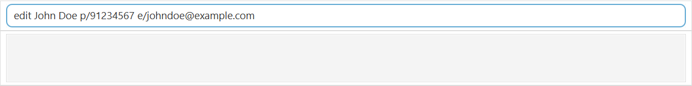<br>

**Output**<br>

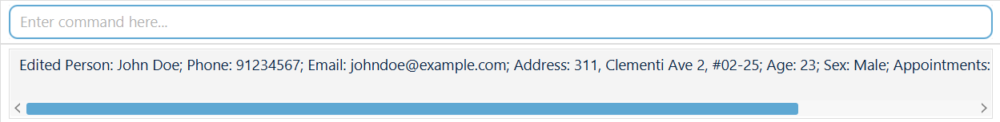
</box>

[Return to Table of Contents](#medicontact)
<br>
<br>

### <i class="fa-solid fa-right-from-bracket"></i> Exiting the program : `exit`

Exits the program.
<box type="definition" icon=":fa-solid-spell-check:" light no-background>

**Format**: `exit`
</box>

[Return to Table of Contents](#medicontact)
<br>
<br>


### <i class="fa-solid fa-filter"></i> Filtering patient contacts by age group or appointment dates: `filter`

Filter patients whose age and/or appointment dates are within the specified range.
<box type="definition" icon=":fa-solid-spell-check:" light no-background>

**Format**: `filter [ap/APPOINTMENT_DATE_LOWER_BOUND - APPOINTMENT_DATE_UPPER_BOUND] [b/AGE_LOWER_BOUND - AGE_UPPER_BOUND] [t/TAG]…​`
</box>

* The order of the keywords does not matter.
* Only appointment dates and/or age group and/or tags can be used to filter.
* Dates must be in `dd-MM-yyyy` format.
* Tags can be specified multiple times.
  e.g. `filter t/medication t/Dr Tan`
* Each value for each field has to be a range (i.e. lower bound - upper bound)
* At least one field (age or appointment dates or tags) has to be specified.
* Range are inclusive (i.e. age 79 is considered True in specified range'79-99')
* Patients must be within all specified ranges to be returned if both age and appointment dates are specified (i.e. `AND` search).
  e.g. `filter b/70-99 ap/01/01/2025 - 01/01/2026` will return `Roy b/87 ap/11/11/2025`.

<box type="tip" light no-background>

**Remarks**:

- Fields in square brackets (e.g. `[t/TAG]`) are optional.

</box>
<box type="warning" icon=":fa-solid-book:" no-background light>

**Examples**:

* `filter b/70-79`
* `filter ap/01/01/2025 - 01/01/2026`
* `filter b/70-79 ap/01/01/2025 - 01/01/2026`
* `filter b/70-79 t/medication t/Dr Tan`<br>

**Input**<br>

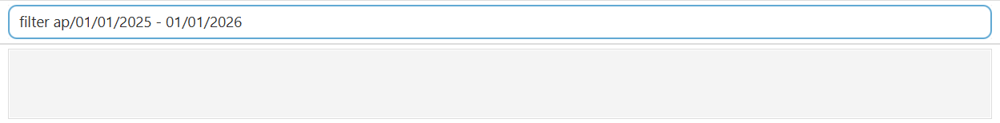<br>

**Output**<br>

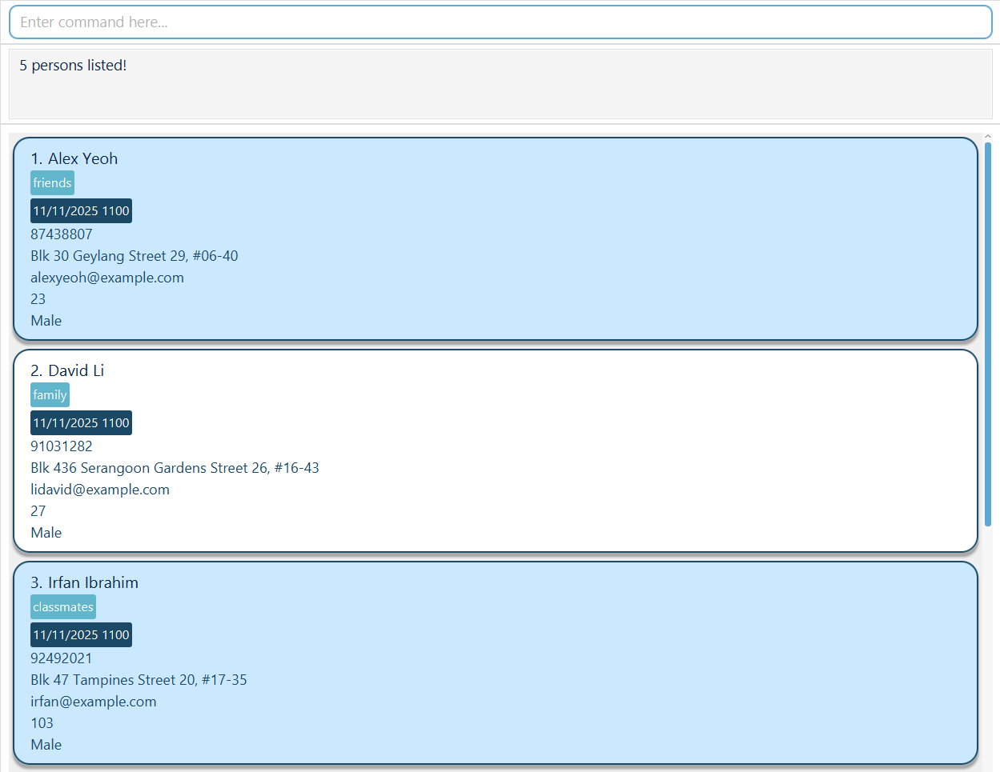
</box>

[Return to Table of Contents](#medicontact)
<br>
<br>

### <i class="fa-solid fa-magnifying-glass"></i> Locating patient contacts by name or phone number: `find`

Finds patients whose names or phone numbers contain any of the given keywords.
<box type="definition" icon=":fa-solid-spell-check:" light no-background>

**Format**: `find KEYWORD [MORE_KEYWORDS]`
</box>

* The search is case-insensitive. e.g `hans` will match `Hans`
* The order of the keywords does not matter. e.g. `Hans Bo` will match `Bo Hans`
* Only the `name` and `phone number` can be searched as keywords.
* Partial words will be matched e.g. `Han` will match `Hans`
* Patients matching at least one keyword will be returned (i.e. `OR` search).
  e.g. `Hay Bo` will return `Hayley Gruber`, `Bo Yang`,
        `Hay 874` will return contacts `Hayley p/99999999`, `Bons p/87444444`

<box type="tip" light no-background>

**Remarks**:

- Fields in square brackets (e.g. `[MORE_KEYWORDS]`) are optional.

</box>
<box type="warning" icon=":fa-solid-book:" no-background light>

**Examples**:

* `find John` returns `john` and `Johnny Doe`

* `find alex david` returns `Alex Yeoh`, `David Li`<br>

* `find olive 87438` returns `87438807`, `Charlotte Oliveiro`

**Input**<br>

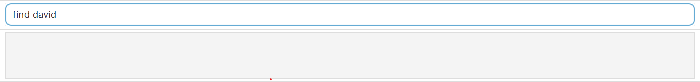<br>

**Output**<br>

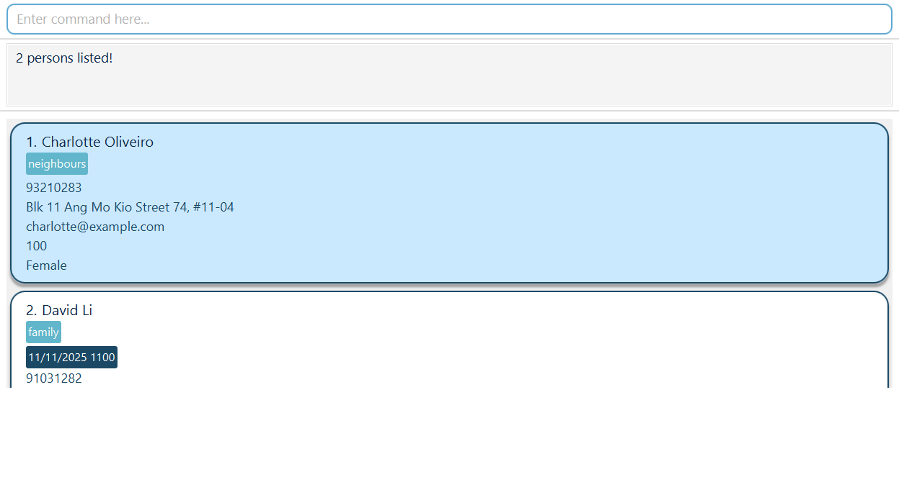
</box>

[Return to Table of Contents](#medicontact)
<br>
<br>

### <i class="fa-solid fa-circle-question"></i> Viewing help : `help`

Shows you a help window with useful resources which includes:
<box type="definition" icon=":fa-solid-spell-check:" light no-background>

**Format**: `help`
</box>

- A URL to the User Guide displayed at the top. You can copy the URL directly to your clipboard by clicking the “Copy URL” button.
- A command summary table below the URL, displaying available commands, their formats, and examples.
- You can copy the command format or example from the table and paste it into the command box.
- You can click on the table headers to sort commands in ascending or descending order.

<box type="warning" no-icon no-background light>


</box>

[Return to Table of Contents](#medicontact)
<br>
<br>

### <i class="fa-solid fa-file-import"></i> Importing patient contacts: `import`

Imports patient contact info from the given json file into MediContact.
<box type="definition" icon=":fa-solid-spell-check:" light no-background>

**Format**: `import FILENAME.json`
</box>
<box type="tip" light no-background>

**IMPORTANT**: Upon importing data, the original data will be entirely overridden with the new json file. If you wish to save the current data you may refer to [Exporting the data](#exporting-the-data). If you wish to append current and new data, you may do so manually as long as you ensure that it adheres to the expected format (see [Expected format](#expected-format) for more details).

</box>

- File **must** be a `json` file. Ensure that the extension `.json` follows the `FILENAME` 
- File **must** be in the same folder as the application JAR file. 
- File **must** be in the expected format of MediContact data (see [Expected format](#expected-format) for more details). 
- Patient information in the file **must** follow constraints of MediContact. E.g. name must contain only alphanumeric characters, phone number must be exactly 8 digits long (see [Summary of parameter constraints](#summary-of-parameter-constraints) for more details). No duplicate patient names are allowed in the addressbook (e.g. `John Doe` and `JOhN DoE` cannot be in the same addressbook).

<box type="important" icon=":fa-solid-triangle-exclamation:" light no-background>

**Caution:**
If your changes to the data file makes its format invalid, MediContact will discard all data and start with an empty data file at the next run.  Hence, it is recommended to take a backup of the file before editing it.<br>
Furthermore, certain edits can cause the MediContact to behave in unexpected ways (e.g., if a value entered is outside the acceptable range). Therefore, edit the data file only if you are confident that you can update it correctly. It is recommended **not** to manually edit the data file if you are not an expert user.
</box>
<box type="warning" icon=":fa-solid-book:" no-background light>

**Examples**:

- `import patientRecords.json`

**Guide:** 

1. Place the `json` file to be imported in the same folder as the application JAR file. In the image below `data1.json` is the desired `json` file to be imported. Note that it has the file extension `.json` and assume that it adheres to the expected format and input constraints. 

   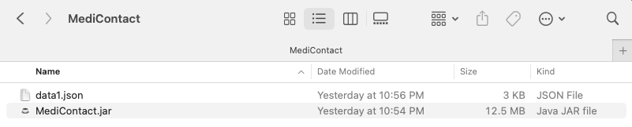

2. Run the application `jar` file as per usual (see [Quick start](#quick-start) for more details).

3. Type `import FILENAME.json` (e.g. `import data1.json`) in the command box in the application. The following message will be displayed in the results box if the import is successful and the contacts will automatically be updated. 

   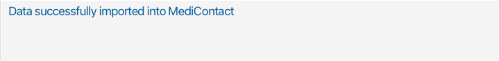
</box>

##### Expected format:

The following is an example of a valid JSON file content. 

````
{
"persons" : [ {
    "name" : "Alicia Pauline",
    "phone" : "94351253",
    "email" : "alice@example.com",
    "address" : "123, Jurong West Ave 6, #08-111",
    "age" : "24",
    "sex" : "Female",
    "appointments" : [ ],
    "tags" : [ "friends" ],
    "note" : {
      "appointments" : [ "11/02/2023 1100", "11/03/2023 1600" ],
      "remark" : [ ],
      "medication" : [ ]
    },
    "starredStatus" : "false"
  }, {
    "name" : "Benson Meier",
    "phone" : "98765432",
    "email" : "johnd@example.com",
    "address" : "311, Clementi Ave 2, #02-25",
    "age" : "37",
    "sex" : "Male",
    "appointments" : [ ],
    "tags" : [ "owesMoney", "friends" ],
    "note" : {
      "appointments" : [ ],
      "remark" : [ ],
      "medication" : [ ]
    },
    "starredStatus" : "true"
  }] 
  }
````

- All patient data must be enclosed with `{"persons" : []}`

- Each patient data must be enclosed with `{}` and seperated by a comma `,`

- The following is a blank template for 1 patient data. You may fill in the `" "` and `[ ]` with the relevant data if you wish to manually edit patient contacts before importing. Remember to ensure that data adheres to the constraints of MediContact (see [Summary of parameter constraints](#summary-of-parameter-constraints) for more details).

  ````
  {
  "persons" : [ {
      "name" : " ",
      "phone" : " ",
      "email" : " ",
      "address" : " ",
      "age" : " ",
      "sex" : " ",
      "appointments" : [ ],
      "tags" : [ ],
      "note" : {
        "appointments" : [ ],
        "remark" : [ ],
        "medication" : [ ]
      },
      "starredStatus" : " "
    }] 
    }
  ````
  
- To add more patient data to the `"persons"` array include the following after `"starredStatus" : " " }`. You may add as many patient data as needed. Remember each patient data must be enclosed with `{}` and seperated by a comma `,`

[Return to Table of Contents](#medicontact)
<br>
<br>


### <i class="fa-solid fa-list"></i> Listing all patient contacts : `list`

Shows an alphabetically sorted list of all patients in the address book.

<box type="definition" icon=":fa-solid-spell-check:" light no-background>

**Format**: `list`
</box>

* No other parameters should be supplied.
* You will be informed when the list is empty: `The list is currently empty.` or when it is not empty: `Listed all persons`.

<box type="warning" icon=":fa-solid-book:" no-background light>

**Examples**:

**Input**<br>

<br>

**Output**<br>

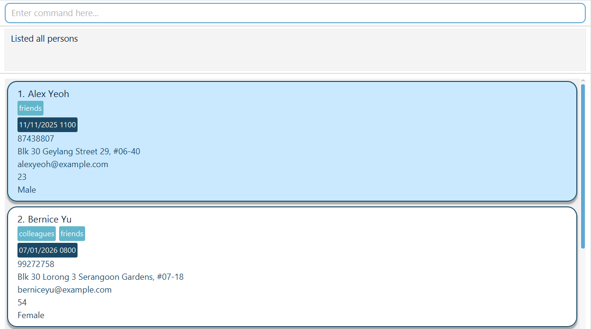
</box>

[Return to Table of Contents](#medicontact)
<br>
<br>


### <i class="fas fa-clipboard-list"></i> Listing starred patient contacts : `list *`

Shows a list of all starred patient contacts in the address book.
<box type="definition" icon=":fa-solid-spell-check:" light no-background>

**Format**: `list *`
</box>

* No other parameters should be supplied aside from `*`.
* You will be informed when the list is empty: `No contacts starred` or when it is not empty: `Starred contacts listed`.

<box type="warning" icon=":fa-solid-book:" no-background light>

**Examples**:

**Input**<br>

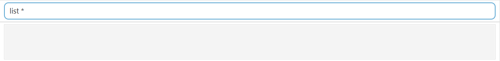<br>

**Output**<br>

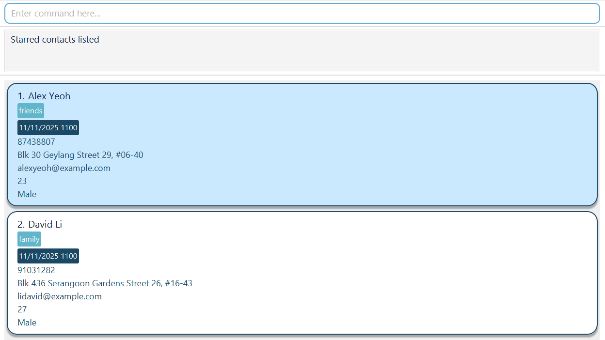
</box>

[Return to Table of Contents](#medicontact)
<br>
<br>

### <i class="fa-solid fa-note-sticky"></i> Editing a patient's notes : `note`

Edits an existing patient's note in the address book, which contains `PREVIOUS APPOINTMENTS`, `MEDICATIONS`, `REMARKS`.
<box type="definition" icon=":fa-solid-spell-check:" light no-background>

**Format**: `note NAME [ap/PREVIOUS APPOINTMENTS] [m/MEDICATION] [r/REMARK]…​`
</box>

- Edits the patient's note with the specified `NAME`. The `NAME` refers to the full name shown in the displayed patient contact list.
- `PREVIOUS APPOINTMENT` should be in the format **dd/MM/yyyy HHmm** and be **before** your current time.
- Both `MEDICATIONS` and `REMARKS` must only contain alphanumerical characters.

<box type="tip" light no-background>

**Remarks**:

- Fields in square brackets (e.g. `[r/REMARK]`) are optional.

- At least one of the fields must be provided.

- When editing fields, the existing fields of the patient will be added i.e adding of medications is cumulative.

- You can remove all the patient’s previous appointments by typing `ap/` without specifying any appointments after it.

- You can remove all the patient’s medications by typing `m/` without specifying any medications after it.

- You can remove all the patient’s remarks by typing `r/` without specifying any remarks after it.

</box>
<box type="warning" icon=":fa-solid-book:" no-background light>

**Examples**:
*  `note John Doe ap/01/01/2023 1200 r/Allergic to XXX` Adds `01/01/2025 1200` and `Allergic to XXX` to John Doe's past appointments and remarks respectively.
*  `note John Doe ap/ m/` Clears all existing  appointments and medications from John Doe's notes.

**Input**<br>

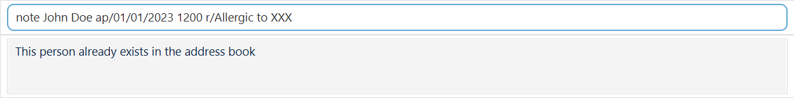<br>

**Output**<br>

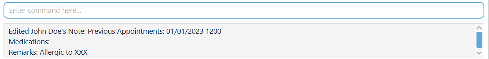
</box>

[Return to Table of Contents](#medicontact)
<br>
<br>


### <i class="fa-solid fa-arrow-up-wide-short"></i> Sorting patient contact list based on Appointment Dates : `sort`

Sorts the patient contact list in the address book on the basis of their earliest appointment dates.
<box type="definition" icon=":fa-solid-spell-check:" light no-background>

**Format**: `sort`
</box>

* No other parameters should be supplied.

<box type="tip" light no-background>

**Remarks**:

- If patient contacts share an appointment timing, they will be sorted alphabetically by name.

- Any patient contacts without any appointment timings will remain sorted alphabetically at the end of the list.

</box>
<box type="warning" icon=":fa-solid-book:" no-background light>

**Examples**: 

**Input**<br>

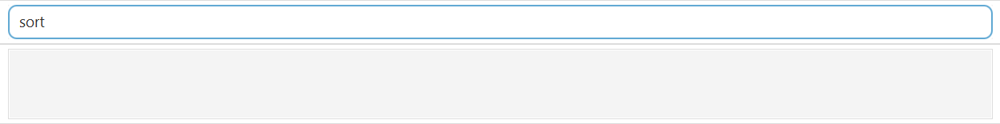<br>

**Output**<br>

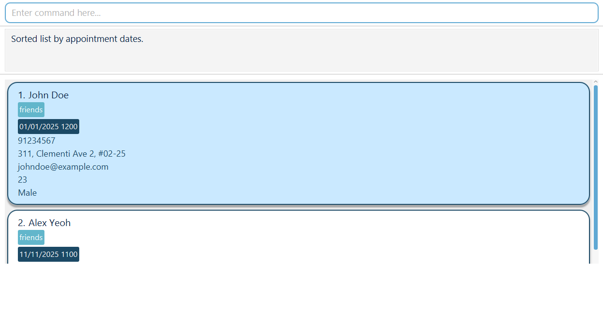
</box>

[Return to Table of Contents](#medicontact)
<br>
<br>

### <i class="fa-solid fa-star"></i> Adding a patient contact to favourites list : `star`

Stars the specified patient contact from the address book into favourites.
<box type="definition" icon=":fa-solid-spell-check:" light no-background>

**Format**: `star INDEX` / `star NAME`
</box>

* Stars the patient at the specified `INDEX` or with the specified `NAME`.
* The `NAME` refers to the full name as shown in the displayed patient contact list.
* The `INDEX` refers to the index number shown in the displayed patient contact list.
* The `INDEX` **must be a positive integer** 1, 2, 3, …​

<box type="warning" icon=":fa-solid-book:" no-background light>

**Examples**:

* `star Alex Yeoh` stars the patient with name `Alex Yeoh` in the address book.
* `list` followed by `star 2` stars the 2nd patient contact in the address book.
* `find Betsy` followed by `star 1` stars the 1st patient contact in the results of the `find` command.

**Input**<br>

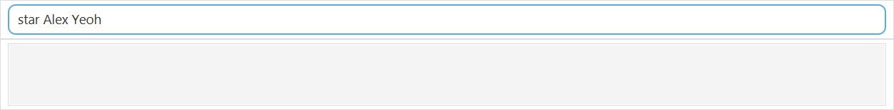<br>

**Output**<br>

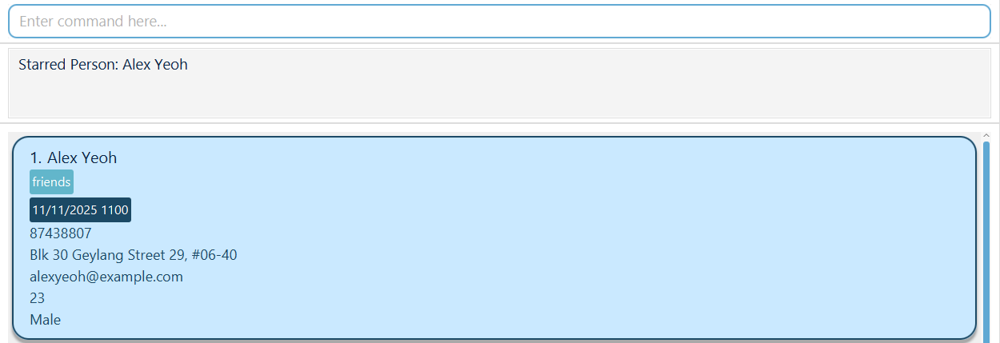
</box>

[Return to Table of Contents](#medicontact)
<br>
<br>


### <i class="fa-regular fa-star"></i> Removing a patient contact from favourites list : `unstar`

Unstars the specified patient contact from the address book removing them from favourites.
<box type="definition" icon=":fa-solid-spell-check:" light no-background>

**Format**: `unstar INDEX` / `unstar NAME`
</box>

* Unstars the patient at the specified `INDEX` or with the specified `NAME`.
* The `NAME` refers to the full name as shown in the displayed patient contact list.
* The `INDEX` refers to the index number shown in the displayed patient contact list.
* The `INDEX` **must be a positive integer** 1, 2, 3, …​

<box type="warning" icon=":fa-solid-book:" no-background light>

**Examples**:

* `unstar Alex Yeoh` unstars the patient with name `Alex Yeoh` in the address book.
* `list` followed by `unstar 2` unstars the 2nd patient contact in the address book.
* `find Betsy` followed by `unstar 1` unstars the 1st patient contact in the results of the `find` command.

**Input**<br>

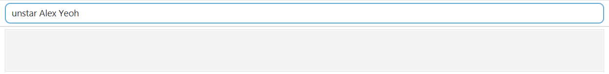<br>

**Output**<br>

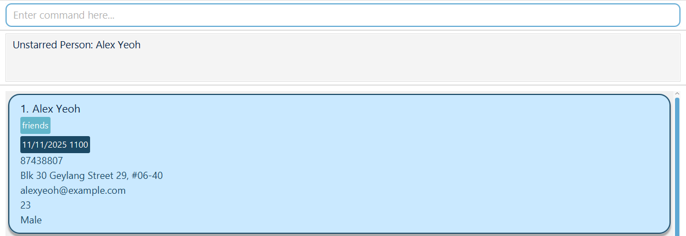
</box>

[Return to Table of Contents](#medicontact)
<br>
<br>

### <i class="fa-solid fa-eye"></i> Viewing a patient's notes : `view`

Views an existing patient's note in the address book, which contains `PREVIOUS APPOINTMENTS`, `MEDICATIONS`, `REMARKS`.
<box type="definition" icon=":fa-solid-spell-check:" light no-background>

**Format**: `view INDEX` / `view NAME`
</box>

* Views the patient's note at the specified `INDEX` or with the specified `NAME`.
* The `NAME` refers to the full name as shown in the displayed patient contact list.
* The `INDEX` refers to the index number shown in the displayed patient contact list.
* The `INDEX` **must be a positive integer** 1, 2, 3, …​

<box type="warning" icon=":fa-solid-book:" no-background light>

**Examples**:

*  `view John Doe`
*  `view 1` shows all details of the 1st patient's details including notes.

**Input**<br>

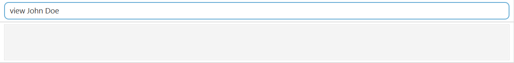<br>

**Output**<br>

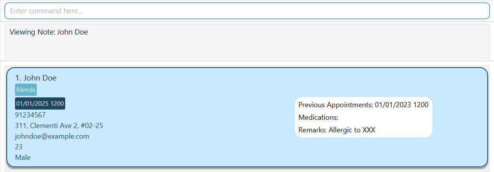
</box>

[Return to Table of Contents](#medicontact)
<br>
<br>

### <i class="fa-solid fa-floppy-disk"></i> Saving the data

MediContact data are saved in the hard disk automatically after any command that changes the data. There is no need to save manually.

[Return to Table of Contents](#medicontact)
<br>
<br>

### <i class="fa-solid fa-file-export"></i> Exporting the data

- Locate file `addressbook.json` under the folder `data` in the same directory as `MediContact.jar`. `addressbook.json` will reflect the latest data. Simply download it.

<box type="warning" icon=":fa-solid-circle-info:" light no-background>

**Warning**: Any manual modification to `addressbook.json` will be reflected in the application though it is **not recommended** to manually edit `addressbook.json` due to the potential of mistakes in formatting which would result in data not showing in the UI. In case of this, upon reversing the wrong modifications, UI should return to normal.

</box>

[Return to Table of Contents](#medicontact)

<br>

<br>

### <i class="fa-solid fa-pen"></i> Editing the data file

AddressBook data are saved automatically as a JSON file `[JAR file location]/data/addressbook.json`. Advanced users are welcome to update data directly by editing that data file.

<box type="important" icon=":fa-solid-triangle-exclamation:" light no-background>

**Caution:**
If your changes to the data file makes its format invalid, AddressBook will discard all data and start with an empty data file at the next run.  Hence, it is recommended to take a backup of the file before editing it.<br>
Furthermore, certain edits can cause the AddressBook to behave in unexpected ways (e.g., if a value entered is outside the acceptable range). Therefore, edit the data file only if you are confident that you can update it correctly.
</box>

[Return to Table of Contents](#medicontact)
<br>
<br>

--------------------------------------------------------------------------------------------------------------------

## <i class="fa-solid fa-question"></i> FAQ

**Q**: How do I transfer my data to another Computer?<br>
**A**: Install the app in the other computer and overwrite the empty data file it creates with the file that contains the data of your previous AddressBook home folder.

[Return to Table of Contents](#medicontact)

--------------------------------------------------------------------------------------------------------------------

## <i class="fa-solid fa-triangle-exclamation"></i> Known issues

1. **When using multiple screens**, if you move the application to a secondary screen, and later switch to using only the primary screen, the GUI will open off-screen. The remedy is to delete the `preferences.json` file created by the application before running the application again.
2. **If you minimize the Help Window** and then run the `help` command (or use the `Help` menu, or the keyboard shortcut `F1`) again, the original Help Window will remain minimized, and no new Help Window will appear. The remedy is to manually restore the minimized Help Window.

[Return to Table of Contents](#medicontact)

--------------------------------------------------------------------------------------------------------------------

## <i class="fas fa-file-alt"></i> Command summary

| Action     | Format, Examples                                             |
| ---------- | ------------------------------------------------------------ |
| **Add**    | `add n/NAME p/PHONE_NUMBER e/EMAIL a/ADDRESS b/AGE s/SEX [ap/APPOINTMENTS]… [t/TAG]…​` <br> e.g., `add n/James Ho p/22224444 e/jamesho@example.com a/123, Clementi Rd, 1234665 b/24 s/Male ap/01/01/2025 1200 t/friend t/colleague` |
| **Clear**  | `clear`                                                      |
| **Delete** | `delete INDEX` or `delete NAME` <br> e.g., `delete 3`, `delete Alex Yeoh` |
| **Edit**   | `edit NAME [n/NAME] [p/PHONE] [e/EMAIL] [a/ADDRESS] [b/AGE] [s/SEX] [ap/APPOINTMENT] [t/TAG]…`<br> e.g.,`edit John Doe n/James Lee e/jameslee@example.com` |
| **Exit**   | `exit`                                                       |
| **Filter** | `filter [ap/APPOINTMENT_DATE_LOWER_BOUND - APPOINTMENT_DATE_UPPER_BOUND] [b/AGE_LOWER_BOUND - AGE_UPPER_BOUND] [t/TAG]...`<br> e.g.,`filter b/70-79 t/medication t/Dr Tan` |
| **Find**   | `find KEYWORD [MORE_KEYWORDS]`<br> e.g., `find James 89127777` |
| **Help**   | `help`                                                       |
| **Import** | `import FILENAME.json`<br>e.g. `import patientRecords.json`  |
| **List**   | `list` <br/>`list *` (to list starred contacts)              |
| **Note**   | `note NAME [ap/APPOINTMENT] [m/MEDICATION] [r/REMARK]…`<br> e.g.,`note John Doe r/Allergic to XXX m/10mg Ibuprofen` |
| **Sort**   | `sort` (to sort contacts based on appointment dates)         |
| **Star**   | `star INDEX` or `star NAME` <br/> e.g., `star 3`, `star Alex Yeoh` |
| **Unstar** | `unstar INDEX` or `unstar NAME` <br/> e.g., `unstar 3`, `unstar Alex Yeoh` |
| **View**   | `view INDEX` or `view NAME` <br/> e.g., `view 3`, `view Alex Yeoh` |

[Return to Table of Contents](#medicontact)

--------------------------------------------------------------------------------------------------------------------

## <i class="fas fa-file-alt"></i> Summary of parameter constraints

| Parameter              | Constraints                                                                                                                                                                                                                                                                                                                                                                                                                                           |
| ---------------------- |-------------------------------------------------------------------------------------------------------------------------------------------------------------------------------------------------------------------------------------------------------------------------------------------------------------------------------------------------------------------------------------------------------------------------------------------------------|
| **Address**            | Should not be blank. Should not begin with a whitespace. Should not contain any prefixes.<br>Valid example: `2042 Balotony street #05-03`                                                                                                                                                                                                                                                                                                             |
| **Age**                | Should only contain numbers. Should be 1-3 digits long.<br>Valid example: `103`                                                                                                                                                                                                                                                                                                                                                                       |
| **Appointment**        | Should be in the form dd/mm/yyyy hhmm. Should be dates in the future.<br>Valid example: `12/02/2040 1600`                                                                                                                                                                                                                                                                                                                                             |
| **Email**              | Should be in the form local-part@domain. Local-part should only contain alphanumeric characters or these special characters `+_.-`. Domain should be made up of doman labels separated by periods. Domain name should end with a domain label at least 2 characters long. Domain label should start and end with alphanumeric characters. Domain label should consist of alphanumeric characters or hyphens.<br>Valid example: `alexyeoh24@gmail.com` |
| **Filename**           | Should match the filename of desired import file exactly. Should end in `.json`.<br>Valid example: `PatientRecords.json`                                                                                                                                                                                                                                                                                                                              |
| **Index**              | Should be a positive integer. Should match to an index displayed in the contacts list.<br>Valid example: `1` (if there is at least one contact in the contacts list)                                                                                                                                                                                                                                                                                  |
| **Keyword**            | Should be alphanumeric (since only name and phone number is searched).<br>Valid example: `alex yeoh`                                                                                                                                                                                                                                                                                                                                                  |
| **Name**               | Should be alphanumeric. Should not be blank.<br>Valid example: `Alex Yeoh`                                                                                                                                                                                                                                                                                                                                                                            |
| **Note (Appointment)** | Should be in the form dd/mm/yyyy hhmm. Should be dates in the past.<br/>Valid example: `12/02/2023 1600`                                                                                                                                                                                                                                                                                                                                              |
| **Note (Medication)**  | Should be alphanumeric.<br>Valid example: `Ibuprofen`                                                                                                                                                                                                                                                                                                                                                                                                 |
| **Note (Remark)**      | Should be alphanumeric.<br>Valid example: `Recurring appointment on Tuesdays`                                                                                                                                                                                                                                                                                                                                                                         |
| **Phone number**       | Should only contain numbers. Should be exactly 8 digits long.<br>Valid example: `12345678`                                                                                                                                                                                                                                                                                                                                                            |
| **Sex**                | Should be alphanumeric. Should not be blank.<br>Valid example: `Female`                                                                                                                                                                                                                                                                                                                                                                               |
| **Tags**               | Should be alphanumeric.<br>Valid example: `Patient`                                                                                                                                                                                                                                                                                                                                                                                                   |

[Return to Table of Contents](#medicontact)
