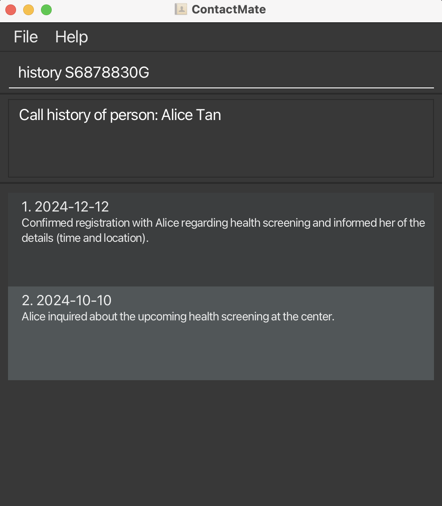

ContactMate is a **desktop app for managing clients at Active Ageing Centres (AACs), optimized for use via a Command Line Interface** (CLI) while still having the benefits of a Graphical User Interface (GUI). If you can type fast, ContactMate can get your contact management tasks done faster than traditional GUI apps.

* Table of Contents
{:toc}

--------------------------------------------------------------------------------------------------------------------

## Quick start

1. Ensure you have Java `17` or above installed in your Computer.

1. Download the latest `.jar` file from [here](https://github.com/AY2425S1-CS2103T-F14b-3/tp/releases).

1. Copy the file to the folder you want to use as the _home folder_ for ContactMate.

1. Open a command terminal, `cd` into the folder you put the jar file in, and use the `java -jar contactmate.jar` command to run the application. 
   1. When you first open the application, the list will be empty. 
   1. After you add some sample data, the GUI will resemble the picture below. The next time you open ContactMate, the data will still be there for you to see. 
            

1. Type the command in the command box and press Enter to execute it. e.g. typing **`help`** and pressing Enter will open the help window. 
   Some example commands you can try:

   * `list` : Lists all contacts.

   * `add i/S5087089H n/John Doe p/98765432 e/johnd@example.com a/311, Clementi Ave 2, #02-25 c/7 t/wheelchairUser t/livingAlone` : Adds a contact named `John Doe` to ContactMate.

   * `delete 3` : Deletes the 3rd contact shown in the current list.

   * `clear` : Deletes all contacts.

   * `exit` : Exits the app.

1. Refer to the [Features](#features) below for details of each command.

--------------------------------------------------------------------------------------------------------------------

## Features

**:information_source: Notes about the command format:** 

* Words in `UPPER_CASE` are the parameters to be supplied by the user. 
  e.g. in `add n/NAME`, `NAME` is a parameter which can be used as `add n/John Doe`.

* Items in square brackets `[]` are optional. 
  e.g `n/NAME [t/TAG]` can be used as `n/John Doe t/fallrisk` or as `n/John Doe`.

* Items with `…`​ after them can be used multiple times including zero times. 
  e.g. `[t/TAG]…​` can be used as ` ` (i.e. 0 times), `t/wheelchairUser`, `t/wheelchairUser` `t/livingAlone` etc.

* Parameters can be in any order. 
  e.g. if the command specifies `n/NAME p/PHONE_NUMBER`, `p/PHONE_NUMBER n/NAME` is also acceptable.

* Extraneous parameters for commands that do not take in parameters (such as `help`, `list`, `exit` and `clear`) will be ignored. 
  e.g. if the command specifies `help 123`, it will be interpreted as `help`.

* If you are using a PDF version of this document, be careful when copying and pasting commands that span multiple lines as space characters surrounding line-breaks may be omitted when copied over to the application.

### Viewing help : `help`

Shows a table of all the commands available in ContactMate. Also links to the User Guide.

Format: `help`

### Adding an elderly: `add`

Adds an elderly to ContactMate.

Format: `add i/NRIC n/NAME p/PHONE_NUMBER e/EMAIL a/ADDRESS c/CALL_FREQUENCY [t/TAG]…​`

* The call frequency is measured in days and must be a positive integer less than or equal to 7 (e.g. 1, 2, ..., 7)
* `NRIC` must be a valid, government issued NRIC.

:bulb: **Tip:**
An elderly can have any number of tags (including 0)

Examples:
* `add i/S5087089H n/John Doe p/98765432 e/johnd@example.com a/John street, block 123, #01-01 c/7`
* `add i/S6878830G n/Betsy Crowe t/wheelchairUser e/betsycrowe@example.com a/Blk 30 Geylang Street 28, #06-48 p/1234567 c/2`

### Listing all elderly : `list`

Shows a list of all elderly in ContactMate, sorted by priority of who to call next.

Format: `list`

### Editing an elderly : `edit`

Edits an existing elderly in ContactMate.

Format: `edit INDEX/NRIC [i/NRIC] [n/NAME] [p/PHONE] [e/EMAIL] [a/ADDRESS] [c/CALL_FREQUENCY] [t/TAG]…​`

* Edits the elderly at the specified `INDEX` or `NRIC`. The index refers to the index number shown in the displayed person list. The index must be within the range of list shown and **must be a positive integer** 1, 2, 3, …​
* The `NRIC` has to be a valid NRIC.
* At least one of the optional fields must be provided.
* The existing values will be replaced with the new input values.
* When editing tags, the existing tags of the elderly will be removed i.e adding of tags is not cumulative.
* You can remove all the elderly’s tags by typing `t/` without
    specifying any tags after it.

Examples:
*  `edit 1 i/S8340008J p/91234567 e/johndoe@example.com` Edits the NRIC, phone number and email address of the 1st elderly shown in the list to be `91234567` and `johndoe@example.com` respectively.
*  `edit S6878830G n/Betsy Crower t/` Edits the name of the elderly with NRIC `S6878830G` to be `Betsy Crower` and clears all existing tags.

### Locating elderly by name or nric: `find`

Finds all elderly whose names or nric contain any of the given keywords.

Format: `find KEYWORD [MORE_KEYWORDS]`

* The search is case-insensitive. e.g `hans` will match `Hans`
* The order of the keywords does not matter. e.g. `Hans Bo` will match `Bo Hans`
* Only the name or nric is searched.
* Only full words will be matched e.g. `Han` will not match `Hans` and `S1803` will not match `S1803269D`
* All elderly matching at least one keyword will be returned (i.e. `OR` search).
  e.g. `Hans Bo` will return `Hans Gruber`, `Bo Yang`

Examples:
* `find John` returns `john` and `John Doe`
* `find alex david` returns `Alex Yeoh`, `David Li`
* `find S7083906G` returns `Alex Yeoh`
* `find S7083906G david` returns `Alex Yeoh`, `David Li` 
  

### Deleting an elderly : `delete`

Deletes the specified elderly from ContactMate.

Format: `delete INDEX/NRIC`

* Deletes the elderly at the specified `INDEX` or `NRIC`.
* The index refers to the index number shown in the displayed person list.
* The index must be within the range of list shown and **must be a positive integer** 1, 2, 3, …​
* The `NRIC` has to be a valid NRIC

Examples:
* `list` followed by `delete 2` deletes the 2nd elderly in ContactMate.
* `find Betsy` followed by `delete 1` deletes the 1st elderly in the results of the `find` command.

### Marking an elderly : `mark`

Marks the specified elderly from ContactMate as called. 

ContactMate will update the list to show the new next contact date of the elderly and sort the list accordingly.
You can also mark the specified elderly as called on a specific date and add notes.

Format: `mark INDEX/NRIC [d/DATE] [o/NOTES]`

* Marks the person at the specified `INDEX` or `NRIC`.
* The index refers to the index number shown in the displayed person list. The index must be within the range of list shown and **must be a positive integer** 1, 2, 3, …​
* The `NRIC` has to be a valid NRIC.
* The date must be in the format `YYYY-MM-DD` and must not be a future date.
* If the parameter `d/DATE` is not provided, the current date will be used.

Examples:
* `mark 1 d/2021-10-01 o/This person is sad`
* `mark S6878830G d/2021-10-01`
* `list` followed by `mark 2` Marks the 2nd person in the list with the current date and no notes.

### Getting call history : `history`

Shows a list of call dates and corresponding notes for the specified elderly.

Format: `history INDEX/NRIC`

* Shows the call history of the elderly at the specified `INDEX` or `NRIC`.
* The index refers to the index number shown in the displayed person list.
* The index must be within the range of list shown and **must be a positive integer** 1, 2, 3, …​
* The NRIC has to be a valid NRIC

Examples:
* `list` followed by `history 2` shows the call history of the 2nd elderly in ContactMate.
* `history S6878830G` shows the call history of the elderly with NRIC S6878830G.
  

### Clearing all entries : `clear`

Clears all entries from ContactMate.

:exclamation: **Warning:**
This command is irreversible. Use with caution.

Format: `clear`

### Exiting the program : `exit`

Exits the program.

Format: `exit`

### Navigating the Command History
You are able to navigate through your command history (both valid and invalid commands) by using the up <kbd>&#8593;</kbd> and down <kbd>&#8595;</kbd> arrow keys.

### Saving the data

ContactMate data are saved in the hard disk automatically after any command that changes the data. There is no need to save manually.

### Editing the data file

ContactMate data are saved automatically as a JSON file `[JAR file location]/data/contactmate.json`. Advanced users are welcome to update data directly by editing that data file.

:exclamation: **Caution:**
If your changes to the data file makes its format invalid, ContactMate will discard all data and start with an empty data file at the next run. Hence, it is recommended to take a backup of the file before editing it. 
Furthermore, certain edits can cause ContactMate to behave in unexpected ways (e.g., if a value entered is outside of the acceptable range). Therefore, edit the data file only if you are confident that you can update it correctly.

--------------------------------------------------------------------------------------------------------------------

## FAQ

**Q**: How do I transfer my data to another Computer? 
**A**: Install the app in the other computer and overwrite the empty data file it creates with the file that contains the data of your previous ContactMate home folder.

--------------------------------------------------------------------------------------------------------------------

## Known issues

1. **When using multiple screens**, if you move the application to a secondary screen, and later switch to using only the primary screen, the GUI will open off-screen. The remedy is to delete the `preferences.json` file created by the application before running the application again.
2. **If you minimize the Help Window** and then run the `help` command (or use the `Help` menu, or the keyboard shortcut `F1`) again, the original Help Window will remain minimized, and no new Help Window will appear. The remedy is to manually restore the minimized Help Window.

--------------------------------------------------------------------------------------------------------------------

## Command summary

Action | Format, Examples
--------|------------------
**Add** | `add i/NRIC n/NAME p/PHONE_NUMBER e/EMAIL a/ADDRESS c/CALL_FREQUENCY [t/TAG]…​`   e.g., `add i/S2208201I n/James Ho p/22224444 e/jamesho@example.com a/123, Clementi Rd, 1234665 c/5 t/fallrisk`
**Clear** | `clear`
**Delete** | `delete INDEX/NRIC`  e.g., `delete 3`, `delete S2208201I`
**Edit** | `edit INDEX/NRIC [i/NRIC] [n/NAME] [p/PHONE_NUMBER] [e/EMAIL] [a/ADDRESS] [c/CALL_FREQUENCY] [t/TAG]…​`  e.g.,`edit 2 n/James Lee e/jameslee@example.com`
**Find** | `find KEYWORD [MORE_KEYWORDS]`  e.g., `find James Jake S1803269D`
**History** | `history INDEX/NRIC`  e.g., `history 1, history S2208201I`
**List** | `list`
**Mark** | `mark INDEX/NRIC [d/DATE] [o/NOTES]`  e.g., `mark 2 d/2021-10-01 o/This person is sad`
**Help** | `help`
**Exit** | `exit`
