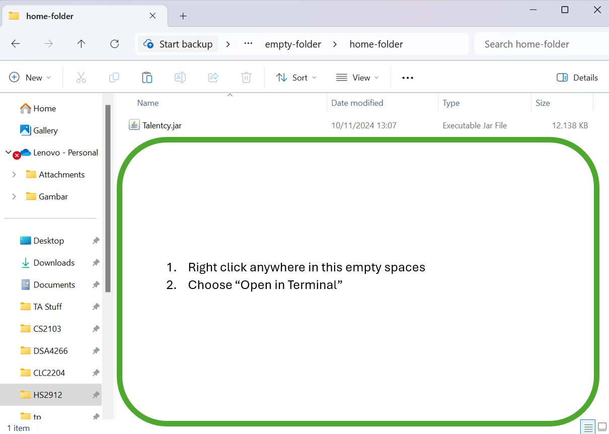
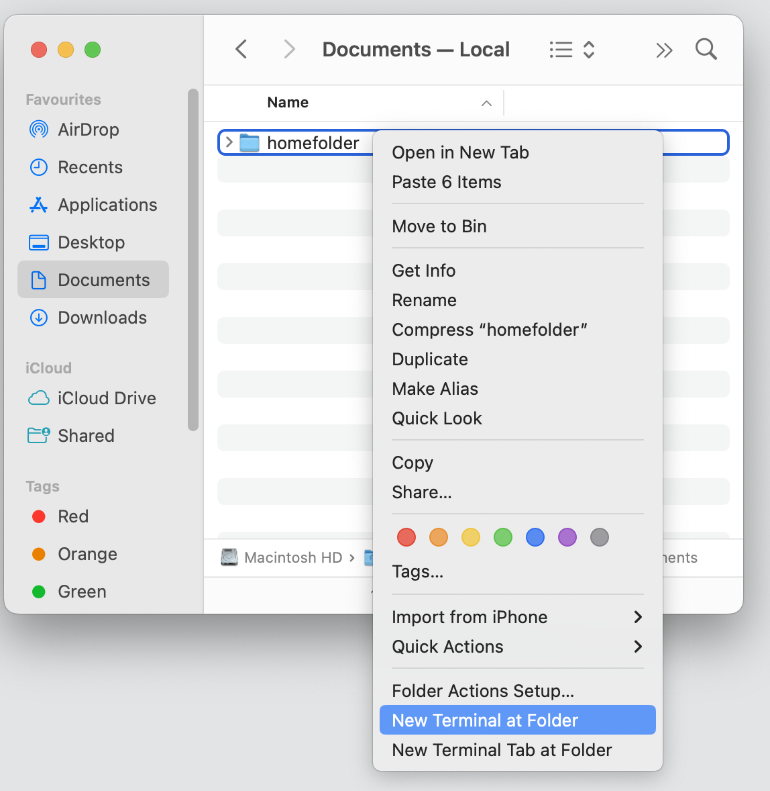
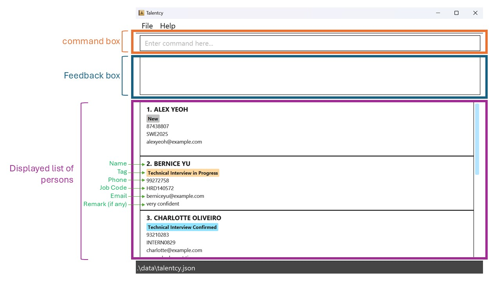

# Talentcy User Guide

Talentcy is a **desktop app for managing job applicant contacts and monitoring their interview stages, optimized for use via a Command Line Interface** (CLI) while still having the benefits of a Graphical User Interface (GUI). If you can type fast, Talentcy can get your contact management tasks done faster than traditional GUI apps.

The codebase of Talentcy originates from AddressBook Level 3 (AB3) developed by CS2103 team.

<!-- TOC -->
* [Quick start](#quick-start)
* [Features](#features)
  * [`help`: Viewing help](#viewing-help--help)
  * [`add`: Adding a person](#adding-a-person-add)
  * [`list`Listing all persons](#listing-all-persons--list)
  * [`edit`: Editing a person](#editing-a-person--edit)
  * [`find`: Locating persons by criteria given](#locating-persons-by-criteria-given-find)
  * [`delete`: Deleting a person](#deleting-a-person--delete)
  * [`stats`: Showing applicant statistics](#showing-applicant-statistics-stats)
  * [`massreject`: Bulk reject persons by criteria](#bulk-reject-persons-by-criteria-massreject)
  * [`sort`: Sorting persons by fields](#sorting-persons-by-fields-sort)
  * [`clear`: Clearing all entries](#clearing-all-entries--clear)
  * [`exit`: Exiting the program](#exiting-the-program--exit)
  * [Saving the data](#saving-the-data)
  * [Editing the data file](#editing-the-data-file)
  * [Archiving data files `[coming in the future]`](#archiving-data-files-coming-in-the-future)
* [Fields](#fields)
  * [NAME](#name)
  * [PHONE](#phone)
  * [EMAIL](#email)
  * [JOBCODE](#jobcode)
  * [TAG](#tag)
  * [REMARK](#remark)
* [FAQ](#faq)
* [Known issues](#known-issues)
* [Command summary](#command-summary)
<!-- TOC -->

--------------------------------------------------------------------------------------------------------------------

## Quick start

1. Ensure you have Java `17` or above installed in your Computer.
   - To check your Java version, you can follow the instructions [here](https://www.java.com/en/download/help/version_manual.html)
   .
   - If your computer doesn’t have Java 17 or a newer version installed, you can download it [here](https://www.oracle.com/java/technologies/downloads/#java17).

2. Download the latest `.jar` file from [here](https://github.com/AY2425S1-CS2103-F09-3/tp/releases).

3. Copy the file to the folder you want to use as the _home folder_ for your Talentcy app.

4. **Windows**: Navigate to the home folder and right-click within the area highlighted in green in the image below. Select "Open in Terminal" from the menu. When the terminal window opens, enter `java -jar Talentcy.jar` to start the application.
   

   
   

   **MacOS**: 
       Right click on the homefolder. Then select "New terminal at Folder". A terminal will pop up. Type `java -jar Talentcy.jar` and press enter.
       

       
       

   **Linux**:
       Open the folder where you placed the Talentcy.jar file.
       Right-click inside the folder and select "Open in Terminal" (or use the Ctrl + Alt + T shortcut to open the terminal, then navigate to the folder using the cd command).
       In the terminal, type java -jar Talentcy.jar and press Enter.

A GUI should appear in a few seconds. Shown below is the annotated GUI. Note how the app contains some sample data. 

5. Type the command in the command box and press Enter to execute it. e.g. typing **`help`** and pressing Enter will open the help window. 
   Some example commands you can try:

    * `list` : Lists all contacts.

    * `add n/John Doe p/98765432 e/johnd@example.com j/SWE123 t/A r/good ethic` : Adds a person
    * named `John Doe` to the Address Book.

    * `delete 3` : Deletes the 3rd person shown in the current list.

    * `clear` : Deletes all contacts.

    * `exit` : Exits the app.

6. Refer to the [Features](#features) below for details of each command.

<box type="info" seamless>
**Notes:**  When you open the app, a GUI will appear with a few sample contacts already loaded, so you can immediately see the app in action.
</box>
--------------------------------------------------------------------------------------------------------------------

## Features

<box type="info" seamless>

**Notes about the command format:** 

* Words in `UPPER_CASE` are the parameters to be supplied by the user. 
  e.g. in `add n/NAME`, `NAME` is a parameter which can be used as `add n/John Doe`.
* Items in square brackets are optional. 
    e.g `n/NAME [r/REMARK]` can be used as `n/John Doe r/have pHD` or as `n/John Doe`.
* If a list of optional items separated by | are together wrapped in curly braces, exactly one item or at least one item are needed, depending on the presence of + after the curly braces. 
    e.g. `{[n/NAME] | [p/PHONE] | [e/EMAIL]}` means exactly one of the fields is needed.
    e.g. `{[n/NAME] | [p/PHONE] | [e/EMAIL]}+` means at least one of the fields is needed.
* Parameters can be in any order. 
  e.g. if the command specifies `n/NAME p/PHONE`, `p/PHONE n/NAME` is also acceptable.

* If you are using a PDF version of this document, be careful when copying and pasting commands that span multiple lines as space characters surrounding line-breaks may be omitted when copied over to the application.
</box>

### Viewing help : `help`

Shows a message explaining how to access the help page.

Format: `help`

### Adding a person: `add`

Adds a person to the address book.

Format: `add n/NAME p/PHONE e/EMAIL j/JOB CODE t/TAG [r/REMARK]`

* Only one interview stage tag will be attached to a person at any point of time.
* If no remark is provided, or if user inputs uses `r/`, then remark is empty by default.
**Tip:** Only one interview stage tag will be attached to a contact at any point of time.
<box type="tip" seamless>

Please refer to this table
for list of valid tags:

| Tag | Interview Stage                 | Definition                                                                  |
|-----|---------------------------------|-----------------------------------------------------------------------------|
| N   | New                             | New applicant                                                               |
| TP  | Technical Interview in Progress | Technical interview is in the process of being scheduled for the applicant  |
| TC | Technical Interview Confirmed | Technical interview has been schedule for the applicant                     |                                           
| BP | Behavioral Interview in Progress | Behavioral interview is in the process of being scheduled for the applicant |
| BC | Behavioral Interview Confirmed | Behavioral interview has been scheduled for the applicant                   |
| A| Accepted| Applicant has been accepted by the company                                  |
| R | Rejected | Applicant has been rejected by the company                                  |
</box>

Examples:
* `add n/John Doe p/98765432 e/johnd@example.com j/XYZ1010 t/N`
* `add n/Betsy Crowe t/BP e/betsycrowe@example.com j/AB1301 p/1234567`
* `add n/John t/A e/johnnie@example.com j/CS2103 p/444888 r/Good at drawing`

### Listing all persons : `list`

Shows a list of all persons in the address book. `list` does not take in any parameters.

Format: `list`

### Editing a person : `edit`

Edits an existing person in the address book.

Format: `edit INDEX {[n/NAME] | [p/PHONE] | [e/EMAIL] | [j/JOB CODE] | [t/TAG] | [r/REMARK]}+`

* Edits the person at the specified `INDEX`. The index refers to the index number shown in the displayed person list. The index **must be a positive integer** 1, 2, 3, …​
* At least one of the optional fields must be updated.
* Existing values will be updated to the input values.
* You can use the `edit` command to reapply the same values to a person without making any changes.
* Using `r/` will replace existing remark to an empty remark.

Examples:
*  `edit 1 p/91234567 e/johndoe@example.com` Edits the phone number and email address of the 1st person to be `91234567` and `johndoe@example.com` respectively.

### Locating persons by criteria given: `find`

Finds persons by at least one criteria given.

Format:
`find {[n/NAME] | [p/PHONE] | [e/EMAIL] | [j/JOB CODE] | [t/TAG] | [r/REMARK]}+`

* The order of the words matter. e.g. `Hans Bo` will only match `Hans Bo`, `Hans Bobo`, and `Rohans Bobo`, but not `Bo Hans`
* All fields are case-insensitive
* Search will return any entries containing the specified character sequence, regardless of position within the field.

Examples:
* `find n/alex yeoh` returns `Alex Yeoh`, `Alex Yeoh Bin Sheng`, and `Dalex Yeohanes`
* `find t/TP` returns the list of contacts with `TP` tag  
    

        
    

* `find n/alex yeoh t/TP` return the list of contacts with name containing `alex yeoh` whose tag is `TP`

### Deleting a person : `delete`

Deletes the specified person from the address book by finding exact match of a field using one criterion.

Format:
`delete {[INDEX] | [n/NAME] | [e/EMAIL] | [p/PHONE]}`

* Deletes the person at the specified `INDEX`or `NAME`or `PHONE`or `EMAIL`

* The index refers to the index number shown in the displayed person list.
* The index **must be a positive integer** 1, 2, 3, …​
* If there are persons with duplicate names, user must use `delete e/EMAIL` or `delete p/PHONE`

Examples:
* `list` followed by `delete 2` deletes the 2nd person in the address book.
* `find n/Betsy` followed by `delete 1` deletes the 1st person in the results of the `find` command.
* `delete n/Betsy` will delete person with the full name Betsy.
* `delete e/betsy@gmail.com` will delete the person with the email betsy@gmail.com

### Showing applicant statistics: `stats`

Format: 
`stats`

Shows the following statistics of the address book at the time the command is called:
- Total number of applicants.
- Percentage of applicants in each interview stage regardless of job code.
- Number of applicants for each job code and each interview stage for that job code.

Examples:
`stats`
                           
### Bulk reject persons by criteria: `massreject`

Marks persons as "rejected" by updating their tags based on specified job code, tag, or a combination of both.

Format:
`massreject {[j/JOB CODE] | [t/TAG]}+`

* Updates person's tags to `r` (rejected) based on the specified criteria.
* You can filter by job code only, tag only, or a combination of both.
* If only a job code is provided, persons with the `a` (accepted) tag will be excluded from the update.
* If both job code and tag are provided, they must exactly match the job code and tag.
* If only tag is provided, it must exactly match the tag.
* If only job code is provided, partial matches are allowed, marking all persons whose job code contains the specified string.

Examples:
* `massreject j/SWE2024 t/TP` marks all persons with the job code `SWE2024` and the tag `TP` as rejected.
* `massreject t/BP` marks all persons with the tag `BP` as rejected.
* `massreject j/SWE2024` marks all persons with the job code `SWE2024` as rejected, except those already tagged as `a` (accepted).

### Sorting persons by fields: `sort`

Sorts the list of persons based on specified fields in a case-insensitive manner. Sorting can be done by a single field or layered across multiple fields.

Format:
`sort [n/] [p/] [e/] [j/] [t/]`

* You can sort by any combination of name, phone, email, job code, and/or tag.
* Sorting is case-insensitive.
* Sorting by tag will be in the order: N, BP, BC, TP, TC, A, R
* Layered sorting is supported. If multiple fields are specified, the list will be sorted by the first field, then by the second within each group of the first, and so on.

Examples:
* `sort n/` and `sort` sorts all persons by name.
* `sort t/ j/` sorts all persons by tag first, and within each tag, sorts by job code.
* `sort j/ n/` sorts all persons by job code, and within each job code, sorts by name.

### Clearing all entries : `clear`

Clears all entries from the address book.

Format: `clear`

### Exiting the program : `exit`

Exits the program.

Format: `exit`

### Saving the data

Talentcy data are saved in the hard disk automatically after any command that changes the data. There is no need to save manually.

### Editing the data file

Talentcy data are saved automatically as a JSON file `[JAR file location]/data/talentcy.json`. Advanced users are welcome to update data directly by editing that data file.

<box type="warning" seamless>

**Caution:**
If your changes to the data file makes its format invalid, Talentcy will discard all data and start with an empty data file at the next run.  Hence, it is recommended to take a backup of the file before editing it. 
Furthermore, certain edits can cause the Talentcy to behave in unexpected ways (e.g., if a value entered is outside the acceptable range). Therefore, edit the data file only if you are confident that you can update it correctly.
</box>

### Archiving data files `[coming in the future]`

_Details coming soon ..._

-------------------------------------------------------------------------------------------------------------------- 

## Fields

**Notes about each valid input field:**

### NAME
- Must be between 1 and 50 characters, excluding leading and trailing whitespaces.
- Must contain at least one letter.
- Can include letters, digits, spaces, hyphens (-), slashes (/), apostrophes ('), and periods (.).
- Symbols are not allowed in the first character of name.
- Cannot start or end with spaces.
- Input name will be converted to upper case. (e.g., "John Doe" will become "JOHN DOE")
- Symbols such as hyphens, slashes, apostrophes, and periods cannot have spaces directly before or after them (e.g., "JOHN -DOE" will be formatted to "JOHN-DOE").
- Consecutive spaces within the name are trimmed to one space. (e.g. "JOHN      DOE" will be trimmed to "JOHN DOE")

### PHONE
- Hyphens (-) are allowed in the input but will be trimmed away (e.g., "119-224-337" will be trimmed to "119224337").
- Only one leading plus sign (+) is allowed at the beginning of the phone number, but will be trimmed away. (e.g., "+999" will be trimmed to "999")
- Any whitespace between digits will be removed (e.g., "119 224 337" will be trimmed to "119224337").
- The phone number must consist of only numeric characters, with optional leading + and allowed hyphens.
- The length of the phone number (excluding leading + and hyphens) must be between 3 and 15 digits inclusive.
- Checking for valid country code is not in scope.

### EMAIL
- The email address must be in the format local-part@domain.
- The local part must contain only alphanumeric characters and the following special characters: +, _, ., and -. It cannot start or end with a special character.
- The domain part must consist of alphanumeric characters, with each domain label separated by periods.
- Each domain label must start and end with alphanumeric characters and may contain hyphens (-) but cannot start or end with them.
- The entire email address must not exceed 50 characters in length and cannot contain any spaces.
- All characters before the "@" symbol will retain their case.
- All characters after the "@" symbol will be converted to lowercase (e.g., "hhh@GMAil.com" will become "hhh@gmail.com").
- Checking for valid email domain is not in scope.

### JOB CODE
- Must be at most 50 characters.
- Only alphanumeric characters (A-Z, a-z, 0-9) and single dashes (-) are allowed.
- The first and last character must be alphanumeric.
- Trailing spaces and spaces within job code will be removed. (e.g. " swe -201  " will become "swe-201")
- Two consecutive dashes (`--`) are not allowed (e.g., "HR--2023" is invalid).
- The input job code will be converted to uppercase (e.g., "swe2023-intern" will become "SWE2023-INTERN").

### TAG

Please refer to this table
for list of valid tags:

| Tag | Interview Stage                 | Definition                                                                  |
|-----|---------------------------------|-----------------------------------------------------------------------------|
| N   | New                             | New applicant                                                               |
| TP  | Technical Interview in Progress | Technical interview is in the process of being scheduled for the applicant  |
| TC | Technical Interview Confirmed | Technical interview has been schedule for the applicant                     |                                           
| BP | Behavioral Interview in Progress | Behavioral interview is in the process of being scheduled for the applicant |
| BC | Behavioral Interview Confirmed | Behavioral interview has been scheduled for the applicant                   |
| A| Accepted| Applicant has been accepted by the company                                  |
| R | Rejected | Applicant has been rejected by the company                                  |

- Input tag code is case-insensitive. (e.g., "bp" will be treated the same as "BP").
- Spaces within the tag will be removed (e.g., "T P" will become "TP"), and hence a tag with spaces is still valid as long as it is one of the tags listed above. 

### REMARK
- Must be at most 50 characters, excluding leading and trailing whitespaces.

--------------------------------------------------------------------------------------------------------------------

## Context Menu Options

Context menu options allow users to perform typical text actions, which are available in the command box and feedback box. To see the context menu options, click right on the command box or feedback box.

<box type="info" seamless>

**Descriptions of each context menu option in command box:** 

### Undo
- Reverses the most recent text editing action within the command box, restoring text that was removed or modified.
- Note that this applies to the text editing action, not undoing the command applied to the app.

### Redo
- Reapplies the last undone text editing action if "Undo" was used, restoring changes that were reversed.

### Cut
- Removes the selected text from the command box and copies it to the clipboard, allowing you to paste it elsewhere.

### Copy
- Copies the selected text to the clipboard without removing it from the command box.

### Paste
- Inserts text from the clipboard into the command box at the cursor’s location or replaces selected text.

### Delete
- Deletes the selected text from the command box without copying it to the clipboard.

### Select All
- Highlights all text within the command box, making it easier to apply other actions like cut, copy, or delete.

</box>

**Descriptions of each context menu option in feedback box:** 

### Copy
- Copies the selected text to the clipboard without removing it from the feedback box.

### Select All
- Highlights all text within the feedback box, making it easier to apply other actions like cut, copy, or delete.

--------------------------------------------------------------------------------------------------------------------

## FAQ

**Q**: How do I transfer my data to another Computer? 
**A**: Install the app in the other computer and overwrite the empty data file it creates with the file that contains the data of your previous Talentcy home folder.

--------------------------------------------------------------------------------------------------------------------

## Known issues

1. **When using multiple screens**, if you move the application to a secondary screen, and later switch to using only the primary screen, the GUI will open off-screen. The remedy is to delete the `preferences.json` file created by the application before running the application again.
2. **If you minimize the Help Window** and then run the `help` command (or use the `Help` menu, or the keyboard shortcut `F1`) again, the original Help Window will remain minimized, and no new Help Window will appear. The remedy is to manually restore the minimized Help Window.

--------------------------------------------------------------------------------------------------------------------

## Command summary

| Action       | Format, Examples                                                                                                                                                 
|--------------|------------------------------------------------------------------------------------------------------------------------------------------------------------------
| **Add**      | `add n/NAME p/PHONE e/EMAIL j/JOB CODE t/TAG [r/REMARK]`   e.g., `add n/James Ho p/22224444 e/jamesho@example.com j/CS2103 t/R r/have-pHD`                    
| **Clear**    | `clear`                                                                                                                                                          
| **Delete**   | `delete {[INDEX] \| [n/NAME] \| [e/EMAIL] \| [p/PHONE]}`  e.g. `delete 3`  `delete n/Alex Yeoh`  `delete e/alexyeoh@gmail.com`  `delete p/88306733` 
| **Edit**     | `edit INDEX {[n/NAME] \| [p/PHONE] \| [e/EMAIL] \| [j/JOB CODE] \| [t/TAG] \| [r/REMARK]}+`  e.g., `edit 2 n/James Lee e/jameslee@example.com`             
| **Exit**     | `exit`                                                                                                                                                           
| **Find**     | `find {[n/NAME] \| [p/PHONE] \| [e/EMAIL] \| [j/JOB CODE] \| [t/TAG] \| [r/REMARK]}+`  e.g. `find n/John j/123 ABC` `find p/12345678`                      
| **List**     | `list`                                                                                                                                                           
| **Mass Reject**| `massreject {[j/JOB CODE] \| [t/TAG]}+`  e.g. `massreject j/CS2103` `massreject t/BP j/123ABC`                                                             
| **Sort**     | `sort [n/] [p/] [e/] [j/] [t/]`   e.g. `sort` `sort n/ e/` `sort p/`                                                                                          
| **Statistics**| `stats`                                                                                                                                                          
| **Help**     | `help`                                                                                                                                                           

                                                                                                                                               
     
## Glossary
**Java**: A  programming language used to create applications that can run on many types of computers.

**CLI** (Command-Line Interface): A text-based user interface used to interact with a computer program by typing commands.

**GUI** (Graphical User Interface): A user interface that enables interaction with a program through graphical elements like buttons, icons, and windows.

**Parameter**: A piece of information you give to a program or command to tell it exactly what users want it to do.

**Alphanumeric**: Characters only made up of both letters and numbers.
