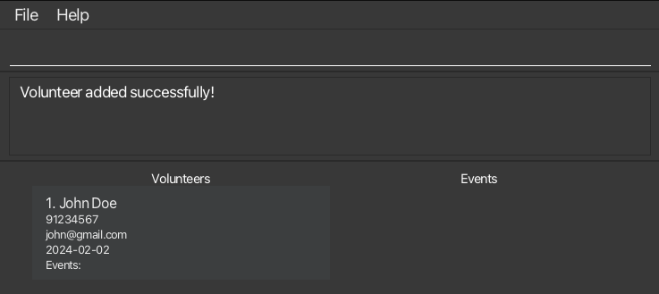
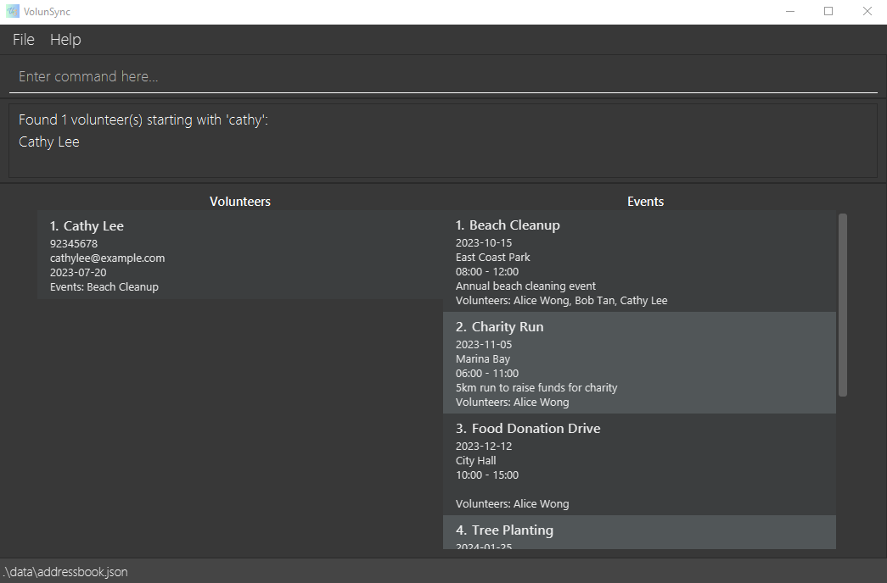
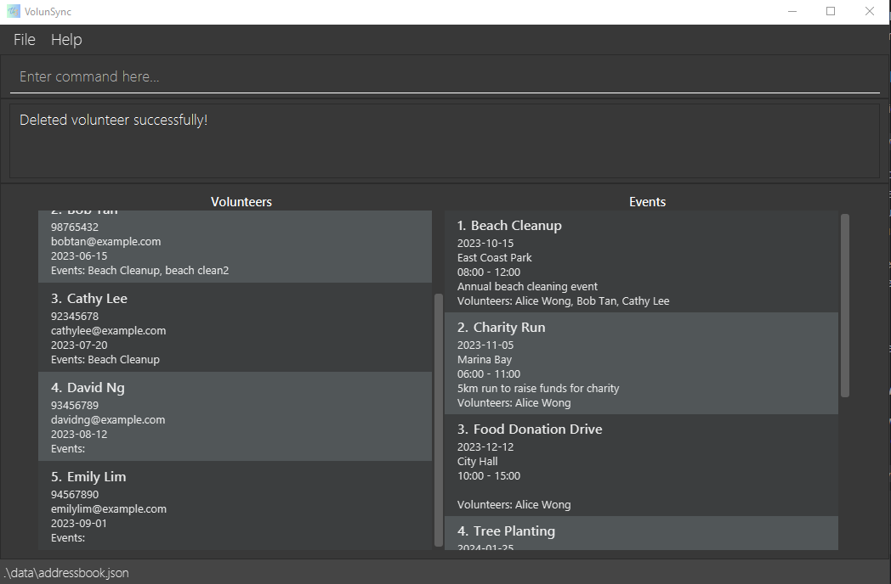
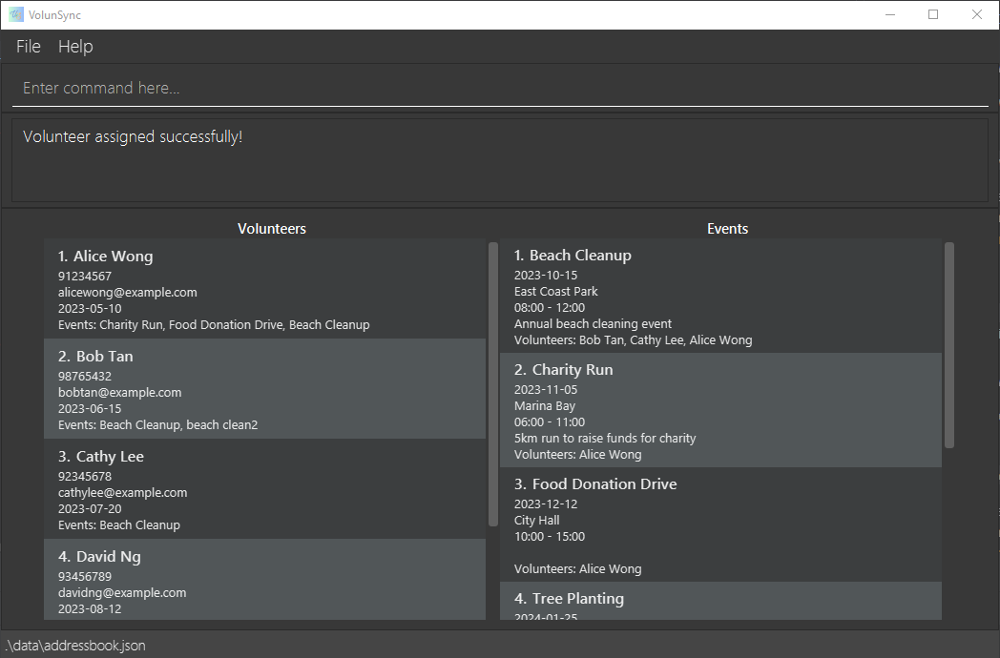
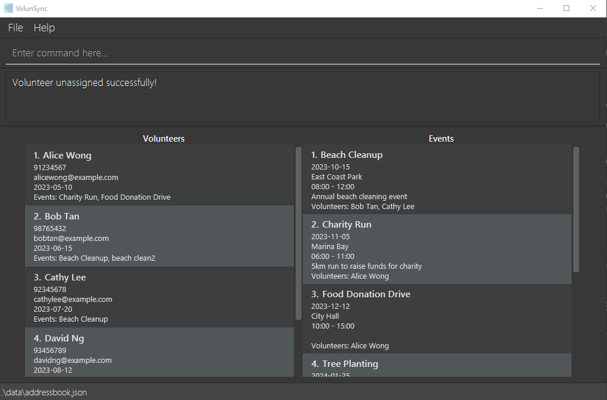
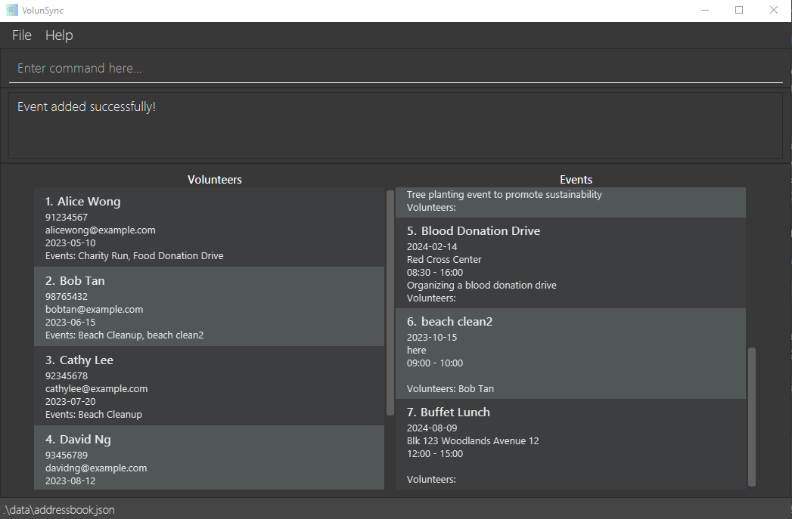
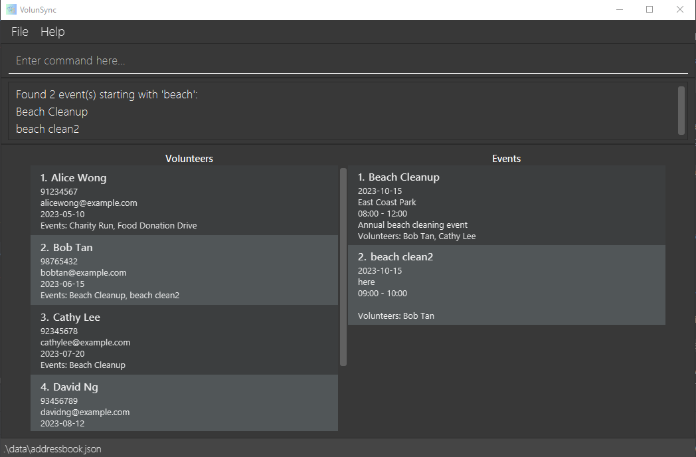
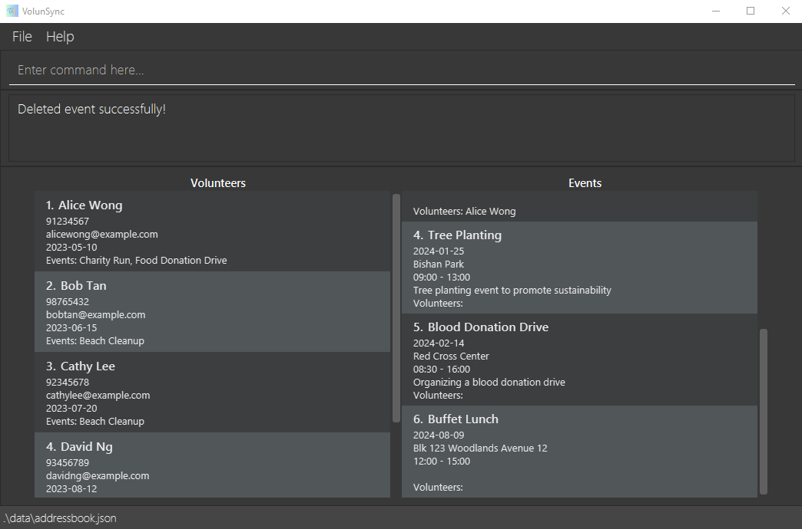
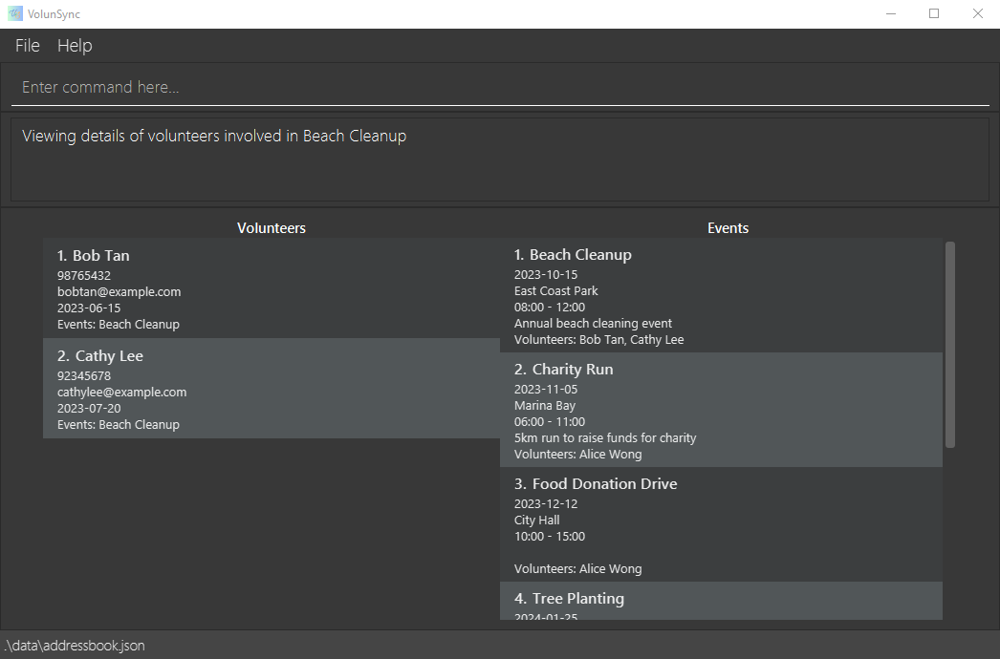

## What is VolunSync?
VolunSync is a desktop app for **Non-Governmental Organisations** that require keeping track of volunteers and volunteering events, optimized for use via a **Command Line Interface** (CLI) while still having the benefits of a Graphical User Interface (GUI). If you can type fast, VolunSync can get your event and personnel management tasks done faster than traditional GUI apps.

## Download VolunSync
Installation instructions can be found [here](#quick-start).

## Learn About Commands Supported By VolunSync
VolunSync supports the following types of commands to help you manage your volunteers and events.
Click the links to find out more about each command type:
1. [General Commands](#general-commands)
   1. [Viewing help](#viewing-help--help)
   1. [Listing all volunteers and events](#listing-all-volunteers-and-events--list)
   1. [Export database to a CSV file](#export-database-to-a-csv-file--export)
   1. [Exiting the program](#exiting-the-program--exit)
1. [Volunteer-related Commands](#volunteer-related-commands)
   1. [Adding a volunteer](#adding-a-volunteer-v-new)
   1. [Locating volunteers by name](#locating-volunteers-by-name--v-find)
   1. [Deleting a volunteer](#deleting-a-volunteer--v-del)
   1. [Assigning a volunteer to event](#assigning-a-volunteer-to-event-assign)
   1. [Removing a volunteer from an event](#removing-a-volunteer-from-an-event-unassign)
1. [Event-related Commands](#event-related-commands)
   1. [Adding an event](#adding-an-event-e-new)
   1. [Locating events by name](#locating-events-by-name--e-find)
   1. [Deleting an event](#deleting-an-event--e-del-)
   1. [Listing all volunteers participating in an event](#listing-all-volunteers-participating-in-an-event-e-view)

#### Command Format Guidelines can be found [here](#command-format-guidelines).

#### A summary of all available commands' format can be found [here](#command-summary).

## Other Resources
#### [FAQ](#faq-1)
#### [Known Issues](#known-issues-1)
#### [Saving the data](#saving-the-data-1)

--------------------------------------------------------------------------------------------------------------------

## Quick start

1. Ensure you have Java `17` or above installed in your Computer.

1. Download the latest `.jar` file from [here](https://github.com/AY2425S1-CS2103T-W12-2/tp/releases).

1. Copy the file to the folder you want to use as the _home folder_ for your VolunSync application.

1. Open your computer's command terminal:
    - On Windows: Press `Windows + R`, type `cmd`, and hit Enter.
    - On Mac/Linux: Open the Terminal from your Applications.
1. In the terminal, type `cd` followed by the path to the folder with the .jar file (e.g. `C:/Users/Your_Name/Your_Folder`), then run the following command:

   `java -jar NAME_OF_JAR_FILE`. For example, `java -jar volunsync-v1.3.jar`.

1. After entering the command, the window should appear as shown below, with some sample data pre-loaded.
   

1. Type the command in the command box and press Enter to execute it. e.g. typing **`help`** and pressing Enter will open the User Guide on your browser. 
   Some example commands you can try:

    * `list` : Lists all volunteers and events in the VolunSync database.

    * `/v new n/ John Doe p/ 91234567 em/ john@gmail.com d/ 2024-02-02` : Creates a new record for a volunteer named `John Doe` to the VolunSync database.

    * `/v del 3` : Deletes the third volunteer on the list of volunteers.

    * `/e new n/Food collection l/NTUC d/2024-11-29 s/00:00 e/23:59 des/Collecting unsold food from NTUC for distribution` : Creates a new record for an event named `Food collection` to the VolunSync database.

    * `/e del 3` : Deletes the third event from the list of events.

    * `exit` : Exits the app.

1. Refer to the [Command Format](#command-format) below for details of each command.

--------------------------------------------------------------------------------------------------------------------

## Command Format Guidelines

**:information_source: Notes about the command format:** 

* Words in `UPPER_CASE` are the parameters to be supplied by the user. 
  e.g. in `add n/NAME`, `NAME` is a parameter which can be used as `add n/John Doe`.

* Parameters can be in any order. 
  e.g. if the command specifies `n/NAME p/PHONE_NUMBER`, `p/PHONE_NUMBER n/NAME` is also acceptable.

* Items in square brackets are optional. 
  e.g [des/ DESCRIPTION]

* Trailing and leading whitespace is automatically trimmed in the command line input.

* For fields with character limits, internal spaces are counted as characters.
  Example:
<pre> "AB"   # 2 characters
 "A B"  # 3 characters
 "A  B" # 4 characters
</pre>

* Commands without parameters (like `help`) ignore any additional input. 
  e.g. if the command specifies `help 123`, it will be interpreted as `help`.

* When copying multi-line commands from this guide, make sure the spaces between lines remain intact, especially if you're using a PDF version.

## General Commands

### Viewing help : `help`

Opens the webpage of the User Guide in your computer's default browser.

Format: `help`

### Listing all volunteers and events : `list`

Shows a list of all volunteers and events in the database.

Format: `list`

Examples:
* `list` would show the full list of events and volunteers

### Export database to a CSV file : `export`

Exports all records within the database to a Comma Separated Value (.csv) file.

Format : `export`

* After running the export command, check the `/output` folder located in the same directory as your .jar file. You’ll find two CSV files: events.csv and volunteers.csv.

### Exiting the program : `exit`

Exits the program.

Format: `exit`

## Volunteer-related Commands

### Adding a volunteer: `/v new`

Adds a volunteer to the database.

Format: `/v new n/NAME p/PHONE_NUMBER em/EMAIL d/AVAILABLE_DATE`

Examples:
* `/v new n/John Doe p/91234567 em/john@gmail.com d/2024-02-02`
* `/v new n/Ellen Joe p/81234567 em/ellen@gmail.com d/2024-05-23`

Running the command successfully, you should see:

### Locating volunteers by name : `/v find`

Find volunteers whose name contains the given keyword.

Format: `/v find KEYWORD`

* The search is case-insensitive
* Only the name is searched
* The searching algorithm returns volunteers with any part of their name matching the `KEYWORD`
    * e.g. `Joe` will match `Joelle`, `Enjoeline` and `Joe`

Examples:
* `/v find A` returns `Alice Wong`, `Bob Tan` and `David Ng`

:bulb: **Note:**
If there are no volunteers whose names match the keyword in the database, the entire list of volunteers will be displayed.

### Deleting a volunteer : `/v del`

Deletes the volunteer at the specified __VOLUNTEER_INDEX__ from the database.

Format: `/v del VOLUNTEER_INDEX`

* Deletes the volunteer at the specified `VOLUNTEER_INDEX`.
* The index refers to the number that appears before each volunteer’s name in the displayed volunteer list on the panel.
* The index **must be a positive integer** 1, 2, 3, …​

:bulb: **Note:**
Deleting a volunteer removes the volunteer from the list of participants of all events which the volunteer
is involved in.

Examples:
* `/v del 2` deletes the second volunteer in the displayed volunteer list.

### Assigning a volunteer to event: `assign`

Adds a volunteer with the specified `VOLUNTEER_INDEX` to the list of participants of the event with the specified `EVENT_INDEX`.

Format: `assign v/VOLUNTEER_INDEX e/EVENT_INDEX`

* The index refers to the number on the left of the event and volunteer's name in their respective lists.
* The index **must be a positive integer** 1, 2, 3, …​

Examples:
* `assign v/1 e/2` assigns the first volunteer on the volunteer list to the list of participants of the second event on the event list.

### Removing a volunteer from an event: `unassign`

Removes a volunteer with the specified `VOLUNTEER_INDEX` to the list of participants of the event with the specified `EVENT_INDEX`.

Format: `unassign v/VOLUNTEER_INDEX e/EVENT_INDEX`

* The index refers to the number on the left of the event and volunteer's name in their respective lists.
* The index **must be a positive integer** 1, 2, 3, …​

Examples:
* `unassign v/1 e/2` removes the first volunteer on the volunteer list from the list of participants of the second event on the event list.

## Event-related Commands

### Adding an event: `/e new`

Adds an event to the database.

Format: `/e new n/EVENT_NAME l/LOCATION d/DATE s/START_TIME e/END_TIME [des/DESCRIPTION]`

Examples:
* `/e new n/Coding Exam l/LT 28 d/2024-12-12 s/19:00 e/21:00 des/Final Exam`
* `/e new n/Buffet Lunch l/Blk 123 Woodlands Avenue 12 d/2024-08-09 s/12:00 e/15:00`

### Locating events by name : `/e find`

Find events with names containing the given keyword.

Format: `/e find KEYWORD`

* The search is case-insensitive.
* Only the name is searched.
* The searching algorithm returns events with any part of their name matching the `KEYWORD`
    * e.g. `Group` will match `Group Project`, `Grouping Task` and `Group`.

Examples:
* `/v find beach` returns `Beach Cleanup` and `beach clean2`

:bulb: **Note:**
If there are no events with names matching the keyword in the database, the entire list of events will be displayed.

### Deleting an event : `/e del `

Deletes the specified event from the database.

Format: `/e del EVENT_INDEX`

* Deletes the event with the specified `EVENT_INDEX`.
* The index refers to the number before the event's name in the displayed event list.
* The index **must be a positive integer** 1, 2, 3, …​

:bulb: **Note:**
Deleting an event causes that event to be removed from all participants' list of events which they are involved in.

Examples:
* `/e del 2` deletes the second event in the event list.

### Listing all volunteers participating in an event: `/e view`

Displays all volunteers participating in the event at the specified `INDEX` under the `Volunteers` display.

Format: `/e view EVENT_INDEX`

* The index refers to the number on the left of the event and volunteer's name in their respective lists.
* The index **must be a positive integer** 1, 2, 3, …​

Examples:
* `/e view 1` displayes the volunteers participating in the first event in the event list.

## Saving the data

VolunSync's data are saved in the hard disk automatically after any command that changes the data. There is no need to save manually.

--------------------------------------------------------------------------------------------------------------------

## FAQ

**Q**: Can I undo an action that I just made? 
**A**: Currently VolunSync does not support the `undo` function, but we are planning to implement it in the future so stay tuned for the update!

--------------------------------------------------------------------------------------------------------------------

## Known Issues

1. **Multi-Screen Setup Issue**
   **Problem:** If you move the application to a secondary screen and later switch to using only the primary screen, the GUI may open off-screen when you restart the app.
   **Solution:**
    - To fix this, locate and delete the `preferences.json` file, which stores the app's window position.
    - After deleting the file, restart the application, and the GUI will open correctly on the primary screen.

2. **Help Window Remaining Minimized**
   **Problem:** If you minimize the Help Window and run the `help` command (or use the `Help` menu or press the `F1` key), the Help Window will remain minimized instead of reopening.
   **Solution:**
    - Manually restore the Help Window from your taskbar or dock.
    - Alternatively, close the minimized window and run the `help` command again to open a new Help Window.

These known issues are actively being worked on, and we are continuously improving VolunSync to provide a better experience. Please stay tuned for future updates!

--------------------------------------------------------------------------------------------------------------------

## Command summary

### General Commands

| Action                                       | Format   |
|----------------------------------------------|----------|
| **List all Volunteers and Events**           | `list`   |
| **Export database to csv file**              | `export` |
| **Help**                                     | `help`   |
| **Exit**                                     | `exit`   |

### Volunteer Commands

| Action                                       | Format                                                       | Examples                                                          |
|----------------------------------------------|--------------------------------------------------------------|-------------------------------------------------------------------|
| **Add Volunteer**                            | `/v new n/NAME p/PHONE_NUMBER em/EMAIL d/AVAILABLE_DATE`     | `/v new n/John Doe p/91234567 em/john@gmail.com d/2024-02-02`     |
| **Delete Volunteer**                         | `/v del VOLUNTEER_INDEX`                                     | `/v del 1`                                                        |
| **Find Volunteer**                           | `/v find KEYWORD`                                            | `/v find Yeoh`                                                    |

### Event Commands

| Action                                       | Format                                                                                  | Examples                                                                         |
|----------------------------------------------|-----------------------------------------------------------------------------------------|----------------------------------------------------------------------------------|
| **Add Event**                                | `/e new n/EVENT_NAME l/LOCATION d/DATE s/START_TIME e/END_TIME [des/DESCRIPTION]`       | `/e new n/Coding Exam l/LT 28 d/2024-12-12 s/19:00 e/21:00 des/Final Exam`       |
| **Delete Event**                             | `/e del EVENT_INDEX`                                                                    | `/e del 1`                                                                       |
| **Find Event**                               | `/e find KEYWORD`                                                                       | `/e find Forest`                                                                 |
| **Add Volunteer to Event**                   | `assign v/VOLUNTEER_INDEX e/ EVENT_INDEX`                                               | `assign v/1 e/2`                                                                 |
| **Remove Volunteer from Event**              | `unassign v/VOLUNTEER_INDEX e/ EVENT_INDEX`                                             | `unassign v/1 e/2`                                                               |
| **View all Volunteers involved in an Event** | `/e view EVENT_INDEX`                                                                   | `/e view 1`                                                                      |
