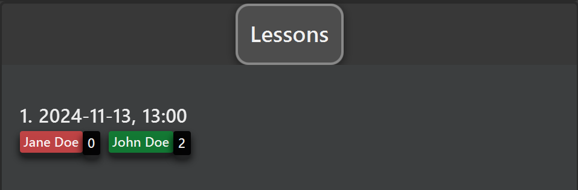
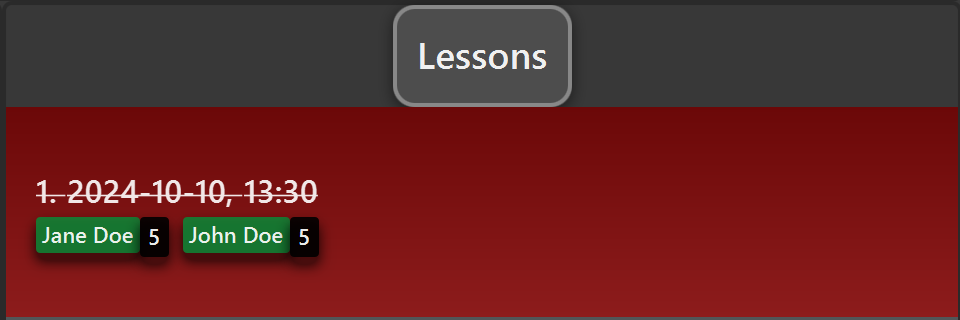

TAHub is a **desktop app for managing students, optimized for use via a Command Line Interface** (CLI) while still having the benefits of a Graphical User Interface (GUI).
If you can type fast, TAHub can get your student management tasks done faster than traditional GUI apps.

TAHub simplifies the role of Teaching Assistants by providing a centralized hub to organize student information, and efficiently manage course-related tasks. This platform empowers TAs to focus more on enhancing student learning and less on administrative chaos.

* Table of Contents
{:toc}

--------------------------------------------------------------------------------------------------------------------

## Quick start

1. Ensure you have Java `17` or above installed in your Computer.

2. Download the latest `.jar` file from [here](https://github.com/AY2425S1-CS2103T-F13-1/tp/releases).

3. Copy the file to the folder you want to use as the _home folder_ for your TAHub.

4. Open a command terminal, `cd` into the folder you put the jar file in, and use the `java -jar addressbook.jar` command to run the application. 
   A GUI similar to the below should appear in a few seconds. Note how the app contains some sample data. 
   

5. Type the command in the command box and press Enter to execute it. e.g. typing **`help`** and pressing Enter will open the help window. 
   Some example commands you can try:

   * `list` : Lists all students.

   * `add n/John Doe p/98765432 e/johnd@example.com c/CS2103T;CS2101` : Adds a student named `John Doe` to TAHub.

   * `delete 2` : Deletes the 2nd student shown in the current list.

   * `clear` : Deletes all students.

   * `exit` : Exits the app.

6. Refer to the [Features](#features) below for details of each command.

--------------------------------------------------------------------------------------------------------------------

# Features

**How do I read the command format?** 

* Words in `UPPER_CASE` are the parameters to be supplied by the user. 
  e.g. in `add n/NAME`, `NAME` is a parameter which can be used as `add n/John Doe`.

* Items in square brackets are optional. 
  e.g `n/NAME [c/COURSE]` can be used as `n/John Doe c/CS2103T` or as `n/John Doe`.

* Items with `…` after them can be used multiple times including zero times. 
  e.g. `[c/COURSE]…` can be used as ` ` (i.e. 0 times), `c/CS2103T;CS2101`, `c/CS2103T c/CS2101` etc.

* Parameters can be in any order. 
  e.g. if the command specifies `n/NAME p/PHONE_NUMBER`, `p/PHONE_NUMBER n/NAME` is also acceptable.

* Extraneous parameters for commands that do not take in parameters (such as `help`, `list`, `exit` and `clear`) will be ignored. 
  e.g. if the command specifies `help 123`, it will be interpreted as `help`.

* If you are using a PDF version of this document, be careful when copying and pasting commands that span multiple lines as space characters surrounding line-breaks may be omitted when copied over to the application.

### Viewing help : `help`

Shows a message explaining how to access the help page.

Format: `help`

## Student Commands

### Adding a student: `add`

Adds a student to TAHub.

Format: `add n/NAME p/PHONE_NUMBER e/EMAIL [c/COURSE]…`

:bulb: **Tip:**
A student can have any number of courses (including 0)

Examples:
* `add n/John Doe p/98765432 e/johnd@example.com`
* `add n/Betsy Crowe e/betsycrowe@example.com p/1234567 c/CS2103T;CS2101`

### Listing all students : `list`

Shows a list of all students in TAHub.

Format: `list`

### Editing a student : `edit`

Edits an existing student in TAHub.

Format: `edit INDEX [n/NAME] [p/PHONE] [e/EMAIL] [c/COURSE]…​`

* Edits the student at the specified `INDEX`. The index refers to the index number shown in the displayed student list. The index **must be a positive integer** 1, 2, 3, …​
* At least one of the optional fields must be provided.
* Existing values will be updated to the input values.
* When editing courses, the existing courses of the student will be removed i.e adding of courses is not cumulative.
* You can remove all the student’s courses by typing `c/` without
    specifying any courses after it.

Examples:
*  `edit 1 p/91234567 e/johndoe@example.com` Edits the phone number and email of the 1st student to be `91234567` and `johndoe@example.com` respectively.
*  `edit 2 n/Betsy Crower c/` Edits the name of the 2nd student to be `Betsy Crower` and clears all existing courses.
*  `edit 3 c/CS2103T;CS2101` Edits the courses of the 3rd student to be CS2103T & CS2101.

### Locating students by name: `find`

Finds students whose names contain any of the given keywords.

Format: `find KEYWORD [MORE_KEYWORDS]`

* The search is case-insensitive. e.g `hans` will match `Hans`
* The order of the keywords does not matter. e.g. `Hans Bo` will match `Bo Hans`
* Only the name is searched.
* Only full words will be matched e.g. `Han` will not match `Hans`
* Students matching at least one keyword will be returned (i.e. `OR` search).
  e.g. `Hans Bo` will return `Hans Gruber`, `Bo Yang`

Examples:
* `find John` returns `john` and `John Doe`
* `find alex david` returns `Alex Yeoh`, `David Li` 
  

### Deleting a student : `delete`

Deletes the specified student from TAHub.

Format: `delete INDEX[;INDEX]...`

* Deletes the student at the specified `INDEX`.
* The index refers to the index number shown in the displayed student list.
* The index **must be a positive integer** 1, 2, 3, …​

* Can delete multiple students at once by separating indices with semicolons (;).

Examples:
* `list` followed by `delete 2` deletes the 2nd student in TAHub.
* `list` followed by `delete 2;3` deletes the 2nd and 3rd student in TAHub.
* `find n/Betsy` followed by `delete 1` deletes the 1st student in the results of the `find` command.

### Exporting student data : `export`

Exports the current list of students to a CSV file.

Format: `export [-f] FILENAME`

* Exports student data to 'FILENAME.csv' in both the data directory and user's home directory
* The `-f` flag is optional and allows overwriting of existing files
* The filename cannot contain periods (.) or slashes (/ or \)

Examples:
* `export students` creates students.csv containing current student list
* `export -f backup` overwrites backup.csv if it exists

### Exporting consultation data : `exportconsult`

Exports the current list of consultations to a CSV file.

Format: `exportconsult [-f] FILENAME`

* Exports consultation data to 'FILENAME.csv' in both the data directory and user's home directory
* The `-f` flag is optional and allows overwriting of existing files
* The filename cannot contain periods (.) or slashes (/ or \)

Examples:
* `exportconsult sessions` creates sessions.csv containing current consultation list
* `exportconsult -f consultbackup` overwrites consultbackup.csv if it exists

### Importing student data : `import`

Imports students from a CSV file into TAHub.

Format: `import FILENAME`

* The CSV file must have the header: Name,Phone,Email,Courses
* Students with validation errors will be logged in error.csv
* Duplicate students are skipped and logged

Examples:
* `import students.csv` imports student data from students.csv
* `import ~/documents/students.csv` imports from the home directory

### Importing consultation data : `importconsult`

Imports consultations from a CSV file into TAHub.

Format: `importconsult FILENAME`

* The CSV file must have the header: Date,Time,Students
* Date must be in YYYY-MM-DD format
* Time must be in HH:mm format (24-hour)
* Students must be semicolon-separated and exist in TAHub
* Invalid entries will be logged in error.csv

Examples:
* `importconsult sessions.csv` imports consultation data from sessions.csv
* `importconsult ~/documents/consultations.csv` imports from the home directory

### Clearing all entries : `clear`

Clears all entries from TAHub.

Format: `clear`

### Exiting the program : `exit`

Exits the program.

Format: `exit`

# Lessons

The lesson list is shown on the right side of TAHub. 
Currently, you can:
- Add and delete lessons
- Add and remove students from lessons
- Mark students' attendance and participation

In a lesson, students are represented by name tags. 
Its color represents their attendance (green for present, red for absent) 
The number next to a student's name represents their participation score.

This is an example of a lesson. In this example, `Jane Doe` is absent,
and has a participation of `0`. `John Doe` is present with a participation
of `2`.

Additionally, lessons that have passed (the time is before your computer's time)
will be displayed in red, as follows:

## Lesson Commands

### Adding a Lesson : `addlesson`

Adds a lesson to TAHub. Lessons will be sorted in chronological order
in the lesson list.

Format: `addlesson d/DATE t/TIME`

* `DATE` must be in the format `YYYY-MM-DD`, and must be a valid date.
* `TIME` must be in the format `HH:mm`, and must be a valid time.

### Deleting a lesson : `deletelesson`

Deletes lesson(s) from TAHub.

Format: `deletelesson LESSON_INDEX[;LESSON_INDEX]…`

* `LESSON_INDEX` is the index of the lesson as displayed in the list.

Examples:
* `deletelesson 1;2;3` deletes the lessons numbered 1,2,3 in the list

### Adding a student to a lesson : `addtolesson`

Adds student(s) to a lesson. Students added to a lesson will be shown as name tags under
that lesson inside the lesson list.

Format: `addtolesson LESSON_INDEX [n/NAME]… [i/STUDENT_INDEX]…`

* `LESSON_INDEX` is the index of the lesson as displayed in the list.
* At least one of the optional arguments must be provided. There must be at least one name or index.
* `NAME` must be the full name of a student exactly as shown in the student list.
* `STUDENT_INDEX` is the index of a student as displayed in the list.

Examples:
* `addtolesson 1 n/John Doe` adds `John Doe` to lesson number 1.
* `addtolesson 1 n/John Doe i/3 i/5` adds `John Doe` and students numbered 3 and 5 to lesson number 1.

### Removing a student from a lesson : `removefromlesson`

Removes student(s) from a lesson.Removing a student will also remove all data associated
with them to that lesson, i.e. re-adding them defaults to no attendance and 0 participation.

Format: `removefromlesson LESSON_INDEX n/NAME [n/NAME]…`

* `LESSON_INDEX` is the index of the lesson as displayed in the list.
* `NAME` must be the full name of a student in the lesson.

Examples:
* `removefromlesson 1 n/John Doe n/Jane Doe` removes `John Doe` and `Jane Doe` from lesson number 1.

### Marking a student's attendance : `marka`

Marks student(s)' attendance in a lesson. The student's attendance is represented by the
color of their name tag under a lesson - **green** for present and **red** for absent.

Format: `marka LESSON_INDEX n/NAME [n/NAME]… a/ATTENDANCE`

* `LESSON_INDEX` is the index of the lesson as displayed in the list.
* `NAME` must be the full name of a student in the lesson.
* If multiple names are provided, all their attendances will be set to the given value.
* `ATTENDANCE` must be one of the following: `Y`,`y`or`1` for yes (student is present) and `N`,`n`or`0` for no (student is absent).
* There must be exactly 1 `ATTENDANCE` argument, e.g. `a/1 a/1` is not allowed.

Examples:
* `marka 1 n/John Doe a/y` marks `John Doe` as present for lesson number 1.
* `marka 2 n/John Doe n/Jane Doe a/N` marks `John Doe` and `Jane Doe` as absent for lesson number 2.

### Marking a student's participation : `markp`

Marks student(s)' participation in a lesson. The student's participation is reflected in the number next to
their name tag under a lesson. 
**Additionally, setting a student's participation above 0
will also automatically set their attendance to true.**

Format: `markp LESSON_INDEX n/NAME [n/NAME]… pt/PARTICIPATION`

* `LESSON_INDEX` is the index of the lesson as displayed in the list.
* `NAME` must be the full name of a student in the lesson.
* If multiple names are provided, all their participation points will be set to the given value.
* `PARTICIPATION` must be an integer between 0 and 100 inclusive.
* There must be exactly 1 `PARTICIPATION` argument, e.g. `pt/3 pt/3` is not allowed.
* The participation score is set **exactly** to the given value. It does not add onto students' existing score.

Examples:
* `markp 1 n/John Doe pt/3` marks `John Doe` as having 3 participation marks for lesson number 1.
* `markp 2 n/John Doe n/Jane Doe pt/5` marks `John Doe` and `Jane Doe` as having 5 participation marks for lesson number 2.

### Refreshing the lesson list : `listlessons`

Refreshes and displays the lesson list.
Useful to fix minor UI glitches, e.g. the display not updating after adding a student.

## Storage Operations

### Saving the data

TAHub data is saved in the hard disk automatically after any command that changes the data. There is no need to save manually.

### Editing the data file

TAHub data are saved automatically as a JSON file `[JAR file location]/data/addressbook.json`. Advanced users are welcome to update data directly by editing that data file.

:exclamation: **Caution:**
If your changes to the data file makes its format invalid, TAHub will discard all data and start with an empty data file at the next run. Hence, it is recommended to take a backup of the file before editing it. 
Furthermore, certain edits can cause the TAHub to behave in unexpected ways (e.g., if a value entered is outside of the acceptable range). Therefore, edit the data file only if you are confident that you can update it correctly.

### Archiving data files `[coming in v2.0]`

_Details coming soon ..._

--------------------------------------------------------------------------------------------------------------------

## FAQ

**Q**: How do I transfer my data to another Computer? 
**A**: Install the app in the other computer and overwrite the empty data file it creates with the file that contains the data of your previous TAHub home folder.

--------------------------------------------------------------------------------------------------------------------

## Known issues

1. **When using multiple screens**, if you move the application to a secondary screen, and later switch to using only the primary screen, the GUI will open off-screen. The remedy is to delete the `preferences.json` file created by the application before running the application again.
2. **If you minimize the Help Window** and then run the `help` command (or use the `Help` menu, or the keyboard shortcut `F1`) again, the original Help Window will remain minimized, and no new Help Window will appear. The remedy is to manually restore the minimized Help Window.

--------------------------------------------------------------------------------------------------------------------

## Command summary

Action | Format, Examples
--------|------------------
**Add** | `add n/NAME p/PHONE_NUMBER e/EMAIL [c/COURSE]…​`   e.g., `add n/James Ho p/98765432 e/jamesho@example.com c/CS2103T;CS2101`
**Clear** | `clear`
**Delete** | `delete INDEX`  e.g., `delete 3`
**Edit** | `edit INDEX [n/NAME] [p/PHONE_NUMBER] [e/EMAIL] [c/COURSE]…​`  e.g.,`edit 2 n/James Lee e/jameslee@example.com c/CS2100`
**Find** | `find KEYWORD [MORE_KEYWORDS]`  e.g., `find James Jake`
**List** | `list`
**Help** | `help`
**Export Students** | `export [-f] FILENAME`  e.g., `export students`
**Export Consultations** | `exportconsult [-f] FILENAME`  e.g., `exportconsult sessions`
**Import Students** | `import FILENAME`  e.g., `import students.csv`
**Import Consultations** | `importconsult FILENAME`  e.g., `importconsult sessions.csv`
