# Knotty Planner 💍🎀

Knotty Planner is a **desktop app for wedding planners, optimised for use via a Command Line Interface** (CLI) while still having the benefits of a Graphical User Interface (GUI). If you are a wedding planner who can type fast, Knotty Planner can make organising weddings a walk in the park!

<!-- * Table of Contents -->
## Table of Contents
- [Quick Start](#quick-start)
- [Features](#features)
- [FAQ](#FAQ)
- [Known issues](#Known-issues)
- [Command summary](#Command-summary)

<page-nav-print />

--------------------------------------------------------------------------------------------------------------------

## Quick start

1. Ensure you have Java `17` or above installed in your Computer.

1. Download the latest `.jar` file from [here](https://github.com/AY2425S1-CS2103T-W13-4/tp/releases).

1. Copy the file to the folder you want to use as the _home folder_ for your Knotty Planner.

1. Open a command terminal, `cd` into the folder you put the jar file in, and use the `java -jar KnottyPlanner.jar` command to run the application. 
   A GUI similar to the below should appear in a few seconds. Note how the app contains some sample data. 
   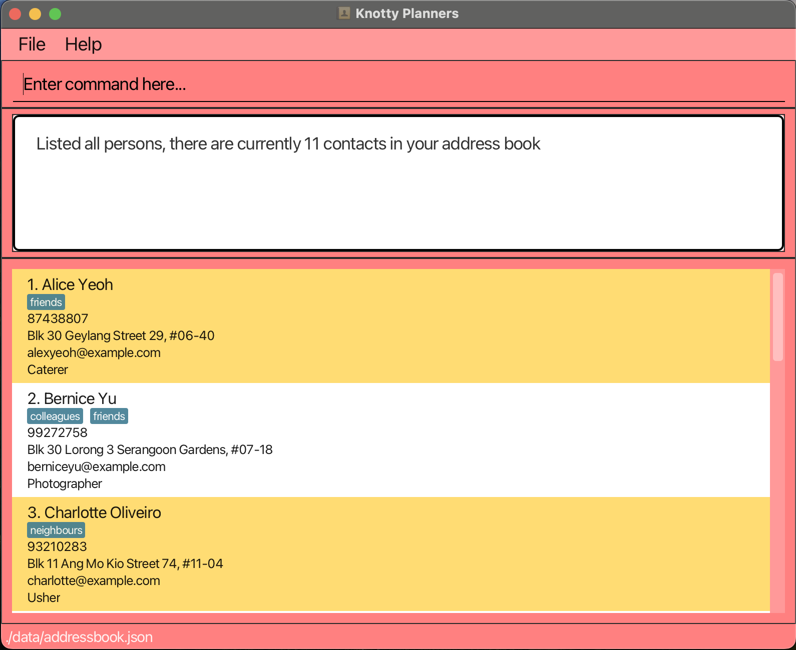

1. Type the command in the command box and press Enter to execute it. e.g. typing **`help`** and pressing Enter will open the help window. 
   Some example commands you can try:

   * `list` : Lists all contacts.

   * `add n/John Doe p/98765432 e/johnd@example.com a/John street, block 123, #01-01 j/Photographer` : Adds a contact named `John Doe` to the Address Book.

   * `delete n/John Doe` followed by `delete-y` : Deletes the contact named John Doe in the contacts list.

   * `clear` : Deletes all contacts.

   * `exit` : Exits Knotty Planner.

1. Refer to the [Features](#features) below for details of each command.

--------------------------------------------------------------------------------------------------------------------

## Features

<box type="info" seamless>

**Notes about the command format:** 

* Words in `UPPER_CASE` are the parameters to be supplied by the user. 
  e.g. in `add n/NAME`, `NAME` is a parameter which can be used as `add n/John Doe`.

* Items with `…`​ after them can be used multiple times including zero times. 
  e.g. `[t/TAG]…​` can be used as ` ` (i.e. 0 times), `t/friend`, `t/friend t/family` etc.

* Parameters can be in any order. 
  e.g. if the command specifies `n/NAME p/PHONE_NUMBER`, `p/PHONE_NUMBER n/NAME` is also acceptable.

* Extraneous parameters for commands that do not take in parameters (such as `help`, `list`, `exit` and `clear`) will be ignored. 
  e.g. if the command specifies `help 123`, it will be interpreted as `help`.

* If you are using a PDF version of this document, be careful when copying and pasting commands that span multiple lines as space characters surrounding line-breaks may be omitted when copied over to the application.
</box>

### Viewing help : `help`

You can view a popup with an overview of all commands, and also a link to this user guide if you need more details.

Format: `help`

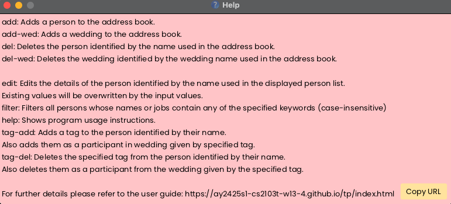

### Adding a person: `add`

You can add a person to the list of contacts.

Format: `add n/NAME p/PHONE_NUMBER e/EMAIL a/ADDRESS j/JOB [t/TAG]`

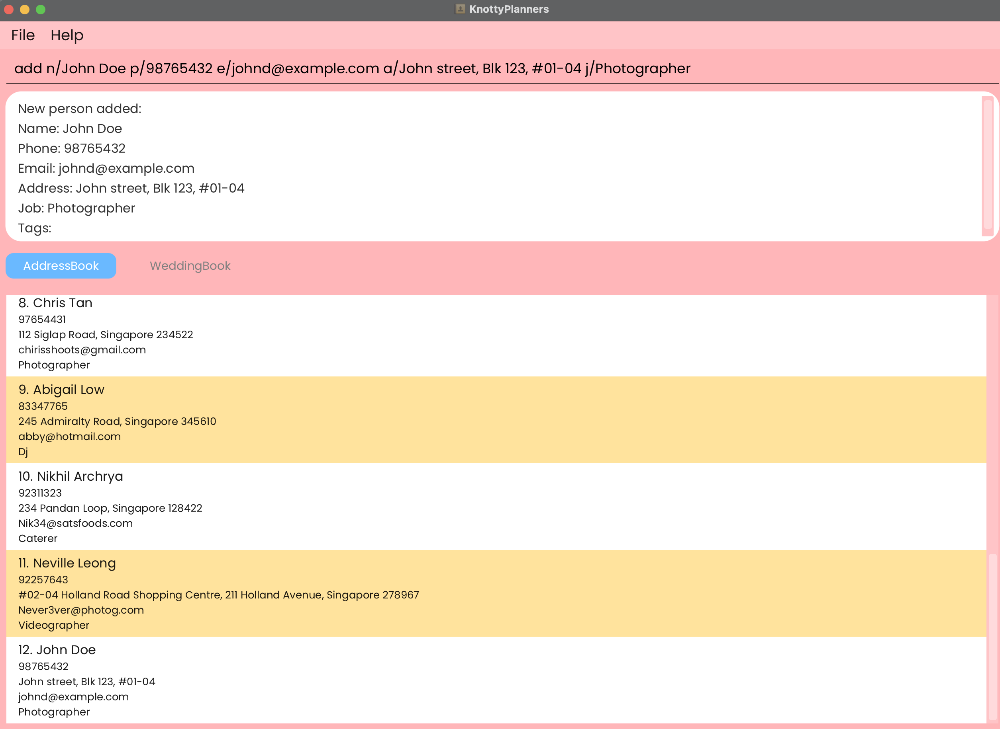

<box type="tip" seamless>

**Tip:** A person can have any number of tags (including 0)

</box>

Examples:
* `add n/John Doe p/98765432 e/johnd@example.com a/John street, block 123, #01-01 j/Photographer`
* `add n/Betsy Crowe p/90341259 e/betsycrowe@example.com a/Newgate Prison j/Caterer t/stacy & sam`

### Listing All Contacts : `list`

You can view all contacts.

Format: `list`

### Adding a wedding: `add-wedding`

You can add a wedding to the list of weddings.

Format: `add-wedding w/NAME & NAME v/VENUE d/DATETIME`

<box type="tip" seamless>

**Tip:** Datetime must be a valid date in the format of dd/MM/yyyy

</box>

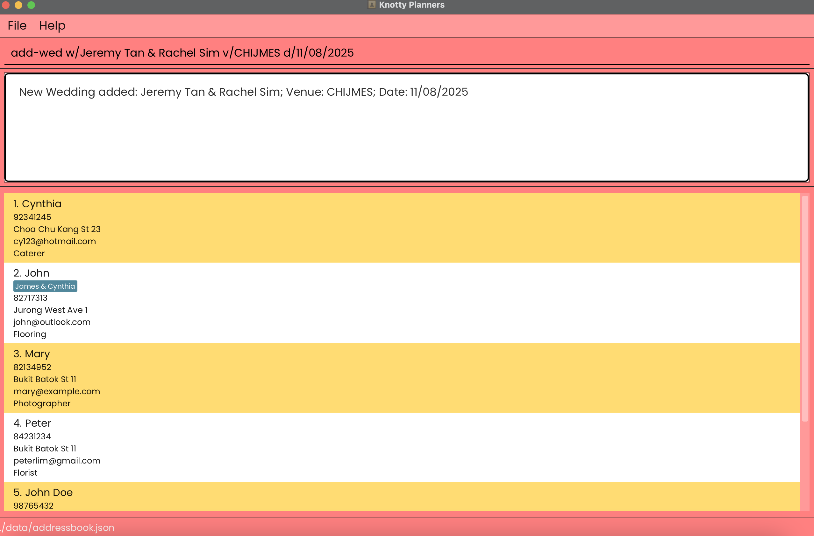

Examples:
* `add-wedding w/John Loh & Jean Tan v/Orchard Hotel d/15/10/2022`
* `add-wedding w/Jonus Ho & Izzat Syazani v/Pasir Ris Hotel d/02/11/2022`

### Editing A Contact : `edit`

You can edit an existing contact's details such as their name, phone number, email etc.

Format: `edit n/NAME [n/NAME] [p/PHONE] [e/EMAIL] [a/ADDRESS] [j/JOB] [t/TAG]`

<box type="tip" seamless>

**Tip:** You must provide at least one of the optional fields.

</box>

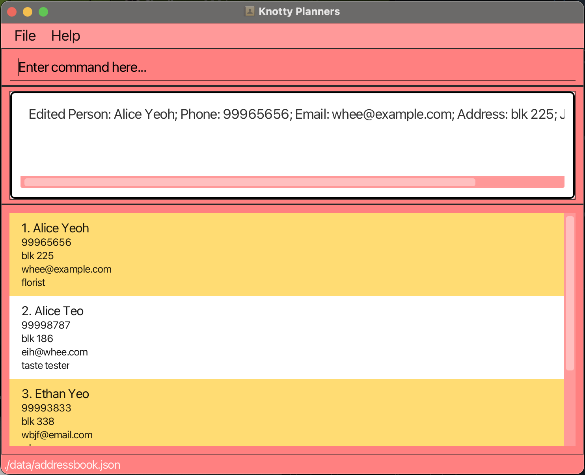

Examples:
*  `edit n/John Doe p/91234567 e/johndoe@example.com` Edits the phone number and email address of John Doe to be `91234567` and `johndoe@example.com` respectively.

### Tagging A Contact : `tag-add` / `tag-delete`

### Adding Tag(s) to A Contact
If you need to associate your contacts with a particular wedding, you can use `tag-add` to add them to the wedding.

Format: `tag-add n/NAME t/TAG...`

<box type="tip" seamless>

**Tip #1:** The name of the tag must match the wedding that you want to add the contact to.

**Tip #2:** You can add one contact to multiple weddings in one go by specifying multiple tags in your command.

</box>

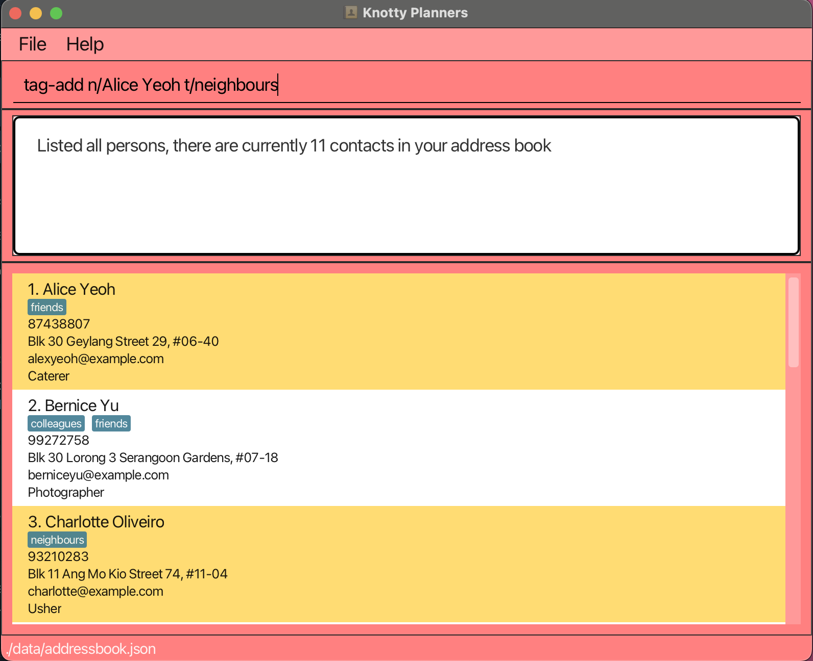

Examples:
*  `tag-add n/John Doe t/Adam and Steve` Adds the tag `Adam and Steve` to John Doe.
*  `tag-add n/Betsy Crower t/Lacy & Bacy t/Peter & Mary t/Jonny & Bonny` Adds the tags `Lacy & Bacy`, `Peter & Mary`, and `Jonny & Bonny` to Betsy Crower.

### Deleting Tag(s) from A Contact
If you need to remove your contacts from a particular wedding, you can use `tag-delete` to remove them from the wedding.

Format: `tag-delete n/NAME t/TAG...`

<box type="tip" seamless>

**Tip #1:** The name of the tag must match the wedding that you want to delete the contact from.

**Tip #2:** You can remove a contact from multiple weddings in one go by specifying multiple tags in your command.

</box>

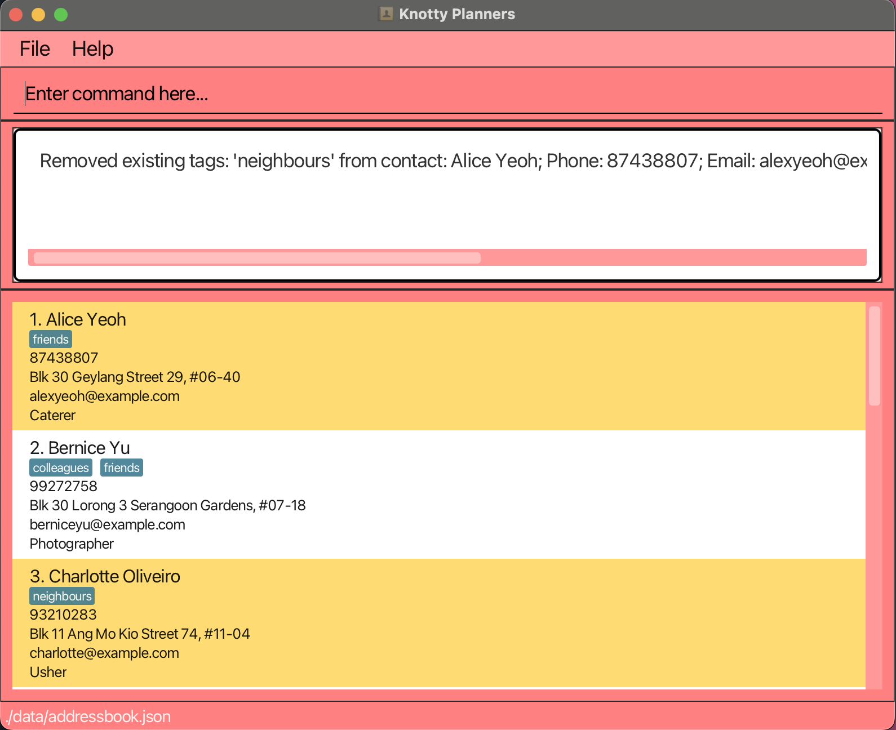

Examples:
*  `tag-delete n/John Doe t/Adam and Steve` Removes the tag `Adam and Steve` from John Doe.
*  `tag-delete n/Betsy Crower t/Lacy & Bacy t/Peter & Mary t/Jonny & Bonny` Removes the tags `Lacy & Bacy`, `Peter & Mary`, and `Jonny & Bonny` from Betsy Crower.

### Locating Contacts by name: `find`

You can quickly lookup contacts by name and view all their details using `find`.

Format: `find KEYWORD [MORE_KEYWORDS]`

* `find` searches by `NAME`.
* `KEYWORD` is not case-sensitive. e.g `hans` will match `Hans`
* The order of the keywords does not matter. e.g. `Hans Bo` will match `Bo Hans`
* Only full words will be matched e.g. `Han` will not match `Hans`
* Persons matching at least one keyword will be returned.
  e.g. `Hans Bo` will return `Hans Gruber`, `Bo Yang`

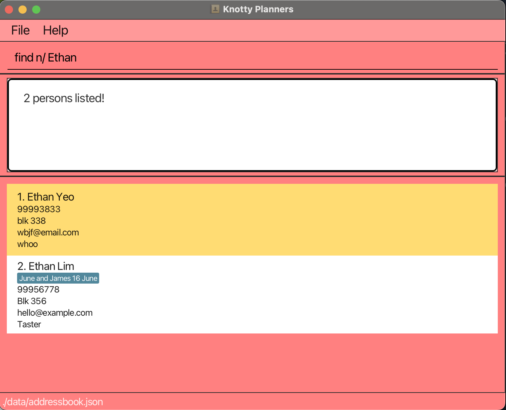

Examples:
* `find John` returns `john` and `John Doe`
* `find alex david` returns `Alex Yeoh`, `David Li` 

### Filtering Contacts by Job: `filter`

If you are looking for contacts with a specific job, you can use `filter` to filter out a list of contacts whose job matches your input.

Format: `filter KEYWORD [MORE_KEYWORDS]`

* `filter` filters by `job`.
* `KEYWORD` is not case-sensitive. e.g `photographer` will match `Photographer`
* The order of the keywords does not matter. e.g. `Photographer Lighting` will match `Lighting Photographer`
* Only full words will be matched e.g. `photog` will not match `Photographer`
* Persons matching at least one keyword will be returned (i.e. `OR` search).
  e.g. `Photographer` will return `Photographer`, `Wedding Photographer`
* Persons matching all keywords will be returned (i.e. `AND` search).
  e.g. `Photographer Wedding` will return `Wedding Photographer`

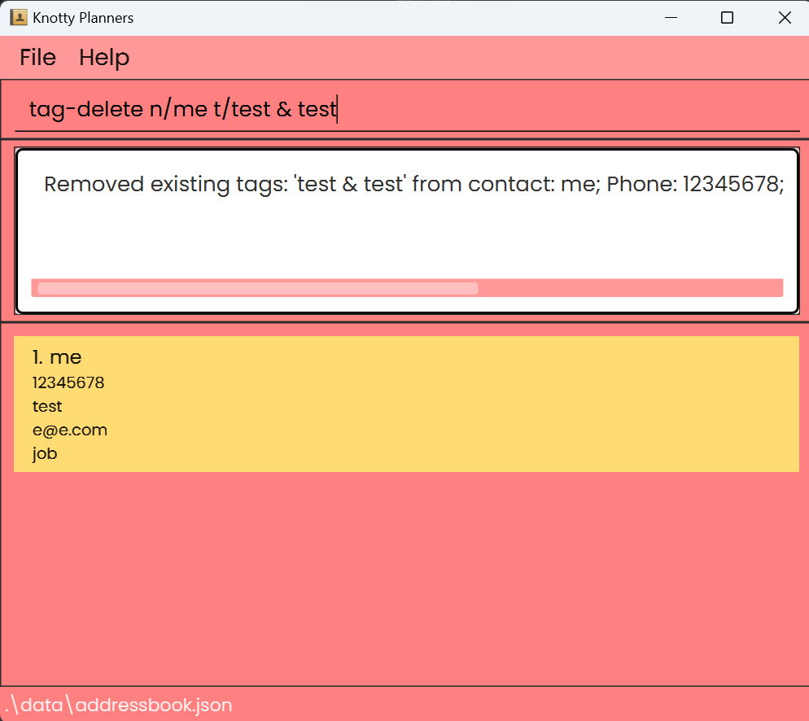

Examples:
* `filter Photographer` returns `John` and `Ernest` whose jobs are photographers
* `filter caterer` returns `Adam` whose job is a caterer

### Deleting A Contact : `delete` followed by `delete-y` or `delete-n`

You can delete a person from your list of contacts.

* Deletes the person with the specified `NAME` from the address book.
* The contact's details are shown for confirmation.
* The contact is deleted if `delete-y` is entered.
* The contact is not deleted if `delete-n` is entered, cancelling the delete operation and nothing will occur.

Format: `delete INDEX` followed by `delete-y` or `delete-n`

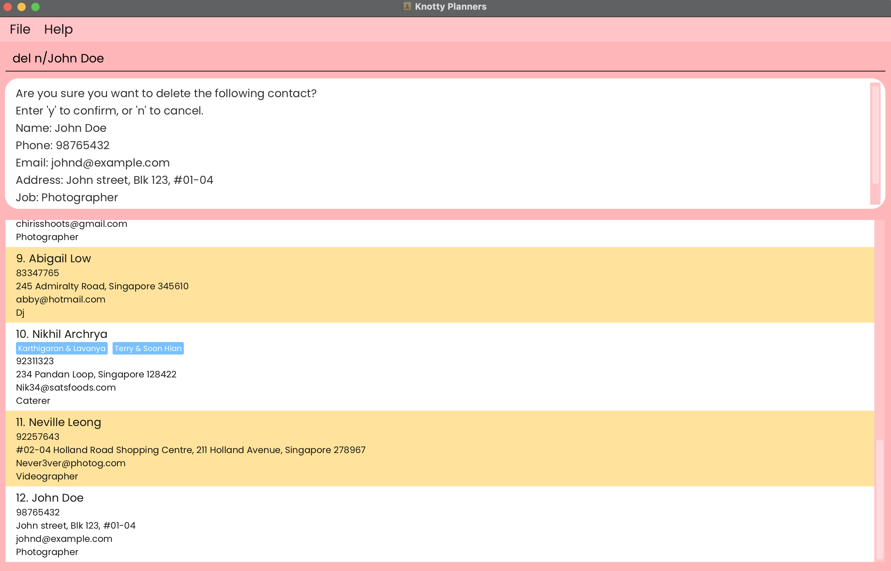

Examples:
* `delete n/John Doe` followed by `delete-y` deletes the person named `John Doe` from the address book.
* `delete n/John Doe` followed by `delete-n` cancels the delete operation.

### Clearing all entries : `clear-addressbook` & `clear-weddingbook`

You can delete ALL contacts in the address book from the application.

Format: 
* `clear-addressbook` clears all contacts in address book.
* `clear-weddingbook` clears all weddings in wedding book.

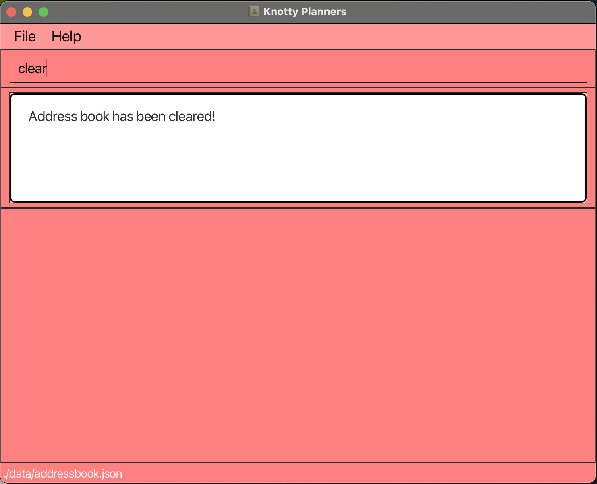

### Exiting the program : `exit`

You can exit application and save any new changes.

Format: `exit`

### Saving the data

Knotty Planner data will be saved in the hard disk automatically after any command that changes the data. There is no need to save manually.

### Editing the data file

* Knotty Planner data are saved automatically as a JSON file `[JAR file location]/data/knottyplanner.json`.
* Advanced users are welcome to update data directly by editing that data file.

<box type="warning" seamless>

**Caution:**
* If your changes to the data file makes its format invalid, Knotty Planner will discard all data and start with an empty data file at the next run.  Hence, it is recommended to take a backup of the file before editing it. 
* Furthermore, certain edits can cause the Knotty Planner to behave in unexpected ways (e.g., if a value entered is outside the acceptable range). Therefore, edit the data file only if you are confident that you can update it correctly.
</box>

### Archiving data files `[coming in v2.0]`

_Details coming soon ..._

--------------------------------------------------------------------------------------------------------------------

## FAQ

**Q**: How do I transfer my data to another Computer? 
**A**: Install the app in the other computer and overwrite the empty data file it creates with the file that contains the data of your previous KnottyPlanner home folder.

--------------------------------------------------------------------------------------------------------------------

## Known issues

1. **When using multiple screens**, if you move the application to a secondary screen, and later switch to using only the primary screen, the GUI will open off-screen. The remedy is to delete the `preferences.json` file created by the application before running the application again.
2. **If you minimise the Help Window** and then run the `help` command (or use the `Help` menu, or the keyboard shortcut `F1`) again, the original Help Window will remain minimised, and no new Help Window will appear. The remedy is to manually restore the minimized Help Window.

--------------------------------------------------------------------------------------------------------------------

## Command summary

Action            | Format, Examples
------------------|----------------------------------------------------------------------------------------------------------------------------------------------------------------------
**Add**           | `add n/NAME p/PHONE_NUMBER e/EMAIL a/ADDRESS j/JOB [t/TAG]`   e.g., `add n/James Ho p/22224444 e/jamesho@example.com a/123, Clementi Rd, 1234665 j/Photographer t/June and James 16 June`
**Add Wedding**   | `add w/NAME v/VENUE d/DATE`   e.g., `add w/ John & June v/Orchard Hotel d/12/12/2030`
**Clear**         | `clear`
**Delete**        | `delete n/NAME` followed by `delete-y` or `delete-n`  e.g., `delete n/John Doe` followed by `delete-y`
**Edit**          | `edit n/NAME [n/NAME] [p/PHONE_NUMBER] [e/EMAIL] [a/ADDRESS] [t/TAG]…​`  e.g.,`edit n/John n/James Lee e/jameslee@example.com`
**Adding Tags**   | `tag-add n/NAME t/TAG...`   e.g., `tag-add n/John Doe t/June & James`
**Deleting Tags** | `tag-delete n/NAME t/TAG...`   e.g., `tag-delete n/John Doe t/June & James`
**Find**          | `find KEYWORD [MORE_KEYWORDS]`  e.g., `find James Jake`
**Filter**          | `filter KEYWORD [MORE_KEYWORDS]`  e.g., `filter soundman dj`
**List**          | `list`
**Help**          | `help`
