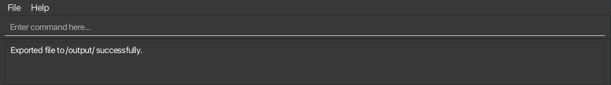
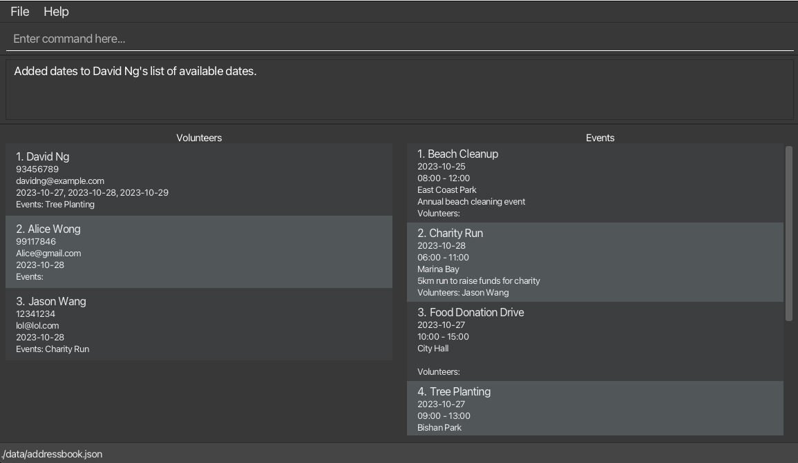
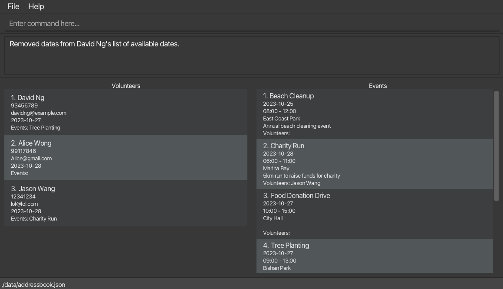
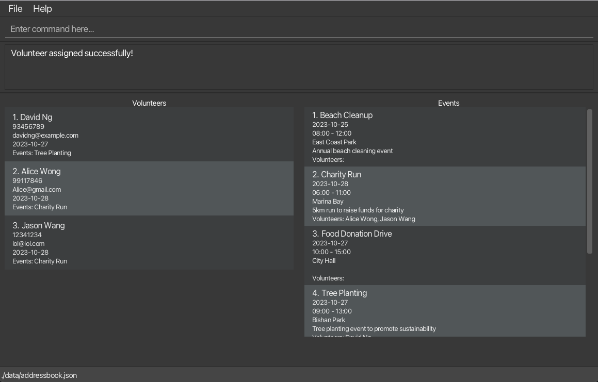
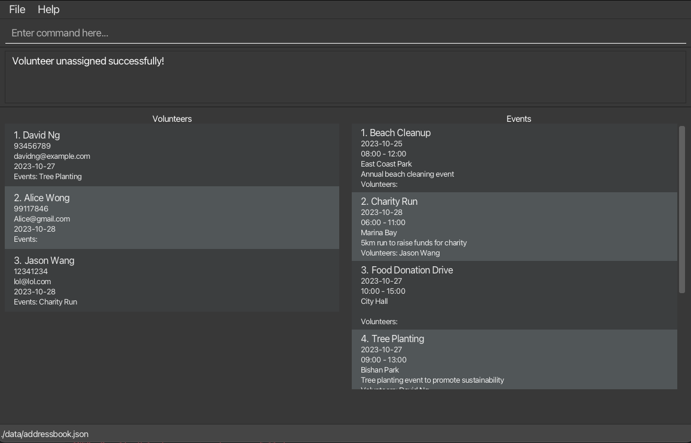
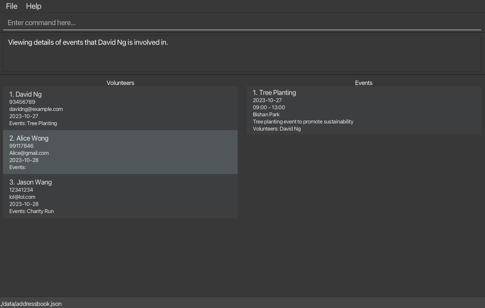

## What is VolunSync?
Welcome to VolunSync! We've created this friendly Human Resource Management System (HRMS) specially for nonprofits to help manage their wonderful volunteers. Think of VolunSync as your helpful assistant that makes it easy to coordinate volunteers, organize events, keep track of hours, and stay in touch with everyone – all in one place.

## Before You Start

<div class="alert alert-block alert-danger">
:exclamation: <b>IMPORTANT:</b><br>
<b>DO NOT</b> modify the data files in the `data` folder. Doing so may result in unexpected behaviour when using VolunSync and you may lose your data permanently.
</div>

<div style="page-break-after: always;"></div>

## Learn About Commands Supported By VolunSync

The command words are shown beside their corresponding commands below. The command words should be used before the parameters when entering commands in VolunSync.

1. [Command Format Guidelines](#command-format-guidelines)
1. [General Commands](#general-commands)
   1. [Viewing help](#viewing-help--help) `help`
   1. [Listing all volunteers and events](#listing-all-volunteers-and-events--list) `list`
   1. [Export database to a CSV file](#export-database-to-a-csv-file--export) `export`
   1. [Closing the program](#closing-the-program--exit) `exit`
1. [Managing Volunteers](#volunteer-related-commands)
   1. [Adding a volunteer](#adding-a-volunteer-v-new) `/v new`
   1. [Finding volunteers by name](#finding-volunteers-by-name--v-find) `/v find`
   1. [Deleting a volunteer](#deleting-a-volunteer--v-del) `/v del`
   1. [Adding available dates to a volunteer](#adding-available-dates-to-a-volunteer-v-free) `/v free`
   1. [Removing available dates from a volunteer](#removing-available-dates-from-a-volunteer-v-unfree) `/v unfree`
   1. [Assigning a volunteer to event](#assigning-a-volunteer-to-event-assign) `assign`
   1. [Unassigning a volunteer from an event](#unassigning-a-volunteer-from-an-event-unassign) `unassign`
1. [Managing Events](#event-related-commands)
   1. [Adding an event](#adding-an-event-e-new) `/e new`
   1. [Finding events by name](#finding-events-by-name--e-find) `/e find`
   1. [Deleting an event](#deleting-an-event--e-del-) `/e del`
   1. [Listing all volunteers participating in an event](#listing-all-volunteers-participating-in-an-event-e-view) `/e view`
   1. [Filtering volunteers by availability for an event](#filtering-volunteers-by-availability-for-an-event-e-filter) `/e filter`
1. [Commands Summary](#command-summary)

## Other Resources
1. [FAQ](#faq)
1. [Known Issues](#known-issues)
1. [About Saving Your Work](#about-saving-your-work)

--------------------------------------------------------------------------------------------------------------------

<div style="page-break-after: always;"></div>

## Quick start

Let's get you started with VolunSync! Just follow these simple steps:

1. **Check if you have Java**
   First, let's make sure your computer has Java **17** or newer:
   - Open a terminal or command prompt and run the following command:
     - On Windows: Press `Windows + R`, type `cmd`, and hit Enter.
     - On Mac/Linux: Open the Terminal from your Applications.
       ```bash
       java -version
       ```
   - If you see a version like `java version "17.x.x"` or higher, you're all set!
   - If Java is not installed or the version is lower than 17:
      - Download and install the latest Java Development Kit (JDK) **17** from [Oracle's official site](https://www.oracle.com/java/technologies/javase-jdk17-downloads.html) or [OpenJDK](https://openjdk.org/).
      - Follow the installation instructions provided for your operating system.
   - After installation, re-run `java -version` to confirm the setup.

1. **Download VolunSync**
   - Download the latest `.jar` file from [here](https://github.com/AY2425S1-CS2103T-W12-2/tp/releases).
   - Put the downloaded file in any folder where you'd like to keep VolunSync

3. **Start VolunSync**
    - Open your computer's command window
    - Type `cd` followed by the location of your VolunSync application (e.g. `C:/Users/Your_Name/Your_Folder`)
    - Type `java -jar` and the name of the file (like `java -jar volunsync-v1.5.jar`) into the terminal or command prompt and hit `Enter`.

4. **You're Ready!**
   - When you see this window, you're all set to begin:


5. **Try It Out**
    Type the command in the command box and press Enter to execute it.<br>
     Some example commands you can try:

    * `list` : Lists all volunteers and events in the VolunSync database.

    * `/v new n/John Doe p/91234567 em/john@gmail.com d/2024-02-02` : Creates a new record for a volunteer named `John Doe` to the VolunSync database.

    * `/v del 3` : Deletes the third volunteer on the list of volunteers.

    * `/e new n/Food collection l/NTUC d/2024-11-29 s/00:00 e/23:59 des/Collecting unsold food from NTUC for distribution` : Creates a new record for an event named `Food collection` to the VolunSync database.

    * `/e del 3` : Deletes the third event from the list of events.

    * `exit` : Exits the app.

1. Refer to the [Command Format](#command-format-guidelines) below for details of each command.

[Back To Top :arrow_heading_up:](#learn-about-commands-supported-by-volunsync)

--------------------------------------------------------------------------------------------------------------------

## Command Format Guidelines

<div markdown="block" class="alert alert-info">

**:information_source: Helpful Tips for Using Commands:**

Let's go over some simple guidelines that will help you use VolunSync easily:

* When you see `UPPERCASE` words, that's where you'll put your own information.
  For example, in `n/NAME`, you might type `n/John Doe`

* Don't worry about the order! If a command asks for `n/NAME p/PHONE_NUMBER`, you can type them in any order:
  `p/91234567 n/John Doe` works just as well

* Square brackets `[ ]` mean optional items.
  For example, in an event description [des/DESCRIPTION], you can skip it if you don't need it

* No need to worry about extra spaces at the start or end of your typing - VolunSync handles that for you

* When counting characters (like for names or descriptions), spaces count too:
<pre> "AB"   = 2 characters
 "A B"  = 3 characters
 "A  B" = 4 characters
</pre>

* Simple commands like `help` will work even if you accidentally type extra things after them
  e.g. if the command specifies `help 123`, it will be interpreted as `help`.

* When copying multi-line commands from this guide, make sure the spaces between lines remain intact, especially if you're using a PDF version.
</div>

[Back To Top :arrow_heading_up:](#learn-about-commands-supported-by-volunsync)

<div style="page-break-after: always;"></div>

## General Commands

### Viewing help : `help`

Need a hand? Just type `help` to open this guide in your web browser for easy reference anytime.<br>
Alternatively you can click the help button at the top of the window or press the F1 key.

Format: `help`


[Back To Top :arrow_heading_up:](#learn-about-commands-supported-by-volunsync)

<div style="page-break-after: always;"></div>

### Listing all volunteers and events : `list`

Want to see everyone and everything? The `list` command shows all your volunteers and events.<br>
It's especially useful after you've been searching or filtering - it brings back the full view.

Format: `list`


[Back To Top :arrow_heading_up:](#learn-about-commands-supported-by-volunsync)

<div style="page-break-after: always;"></div>

### Export database to a CSV file : `export`

Exports all records within the database to a Comma Separated Value (.csv) file. This allows you to print the records or transfer the data to another computer for external use. Note that the **import function is not yet implemented**, so exported files cannot be directly re-imported into VolunSync at this time.

Format : `export`

1. Look for a folder called `/output` in the folder where you keep VolunSync
2. You'll find two files:
    - `events.csv` - Contains all your event information
    - `volunteers.csv` - Contains all your volunteer information



[Back To Top :arrow_heading_up:](#learn-about-commands-supported-by-volunsync)

### Closing the program : `exit`

Ready to finish up? Just type `exit` to close VolunSync safely.

Format: `exit`

[Back To Top :arrow_heading_up:](#learn-about-commands-supported-by-volunsync)

<div style="page-break-after: always;"></div>

## Volunteer-related Commands

### Adding a volunteer: `/v new`

Welcome a new volunteer to your team by adding their details to the database.

Format: `/v new n/NAME p/PHONE_NUMBER em/EMAIL d/AVAILABLE_DATE`

What you'll need:
- Name: Alphanumeric and spaces only, 1-100 characters.
- Phone Number: Digits only, 3-15 characters.
- Email: Must follow username@domain format.
- Date: Format YYYY-MM-DD (e.g. 2024-01-01)

Examples:
* `/v new n/John Doe p/91234567 em/john@gmail.com d/2024-02-02` <br/>creates a volunteer record for `John Doe` with the specified details

Running the command successfully, you should see:


[Back To Top :arrow_heading_up:](#learn-about-commands-supported-by-volunsync)

<div style="page-break-after: always;"></div>

### Finding volunteers by name : `/v find`

Looking for a particular volunteer? This command helps you find them by name.<br>
If there are no volunteers whose names match the keyword in the database, the entire list of volunteers will be displayed.

Format: `/v find KEYWORD`

* It doesn't matter if you use capital or small letters
* It finds parts of names too - typing "Tan" can find "Stanley" or "Tanya"
* If no one is found, you'll be informed via an error message, and you'll see all volunteers again

<div markdown="span" class="alert alert-primary">:bulb: **Note:**
After you're done, type <a href="#listing-all-volunteers-and-events--list">`list`</a> to see all events again!</div>

Examples:
* `/v find ng` returns `David Ng`, `Alice Wong` and `Jason Wang`


[Back To Top :arrow_heading_up:](#learn-about-commands-supported-by-volunsync)

### Deleting a volunteer : `/v del`

When a volunteer leaves, you can remove their record.<br>
It will delete the volunteer at the specified `VOLUNTEER_INDEX` from the database.

Format: `/v del VOLUNTEER_INDEX`

* The `INDEX` is the number you see next to their name in the list

<div markdown="span" class="alert alert-primary">:bulb: **Note:**
Deleting a volunteer removes the volunteer from the list of participants of all events which the volunteer
is involved in.
</div>

Examples:
* `/v del 2` deletes the second volunteer in the displayed volunteer list.


[Back To Top :arrow_heading_up:](#learn-about-commands-supported-by-volunsync)

<div style="page-break-after: always;"></div>

### Adding available dates to a volunteer: `/v free`

Update when a volunteer is available to help.<br>
It will add available dates to the volunteer with the specified `VOLUNTEER_INDEX`.

Format: `/v free i/VOLUNTEER_INDEX d/AVAILABLE_DATES`

* The `INDEX` is the number you see next to their name in the list
* Use `YYYY-MM-DD` format (like `2024-01-01`)
* For multiple dates, separate them with commas (like `2024-11-28, 2024-11-29, 2024-11-30`)

Examples:
* `/v free i/1 d/2023-10-28, 2023-10-29` adds 2023-10-28 and 2023-10-29 as available dates to the first volunteer on the volunteer list.



[Back To Top :arrow_heading_up:](#learn-about-commands-supported-by-volunsync)

<div style="page-break-after: always;"></div>

### Removing available dates from a volunteer: `/v unfree`

Need to mark dates when a volunteer isn't available anymore?
It will remove available dates from the volunteer with the specified `VOLUNTEER_INDEX`.

Format: `/v unfree i/VOLUNTEER_INDEX d/AVAILABLE_DATES`

* The `INDEX` is the number you see next to their name in the list
* Use `YYYY-MM-DD` format (like `2024-01-01`)
* For multiple dates, separate them with commas (like `2024-11-28, 2024-11-29, 2024-11-30`)

Examples:
* `/v unfree i/1 d/2023-10-28, 2023-10-29` removes 2024-11-28 and 2024-11-29 as available dates from the first volunteer on the volunteer list.



[Back To Top :arrow_heading_up:](#learn-about-commands-supported-by-volunsync)

<div style="page-break-after: always;"></div>

### Assigning a volunteer to event: `assign`

Connect volunteers with events they'd like to join.
It will add a volunteer with the specified `VOLUNTEER_INDEX` to the list of participants of the event with the specified `EVENT_INDEX`.

Format: `assign v/VOLUNTEER_INDEX e/EVENT_INDEX`

* The `INDEX` refers to the numbers shown next to both the volunteer and event names

Examples:
* `assign v/3 e/2` assigns the third volunteer on the volunteer list to the list of participants of the second event on the event list.

<div markdown="span" class="alert alert-primary">:bulb: **Note:**
The system checks if the volunteer is free on that date, and if they are already signed up for another event at the same time.<br>
If that is the case, they cannot be assigned to this event.
</div>



[Back To Top :arrow_heading_up:](#learn-about-commands-supported-by-volunsync)

<div style="page-break-after: always;"></div>

### Unassigning a volunteer from an event: `unassign`

If a volunteer needs to step back from an event, you can remove them from the list of participants.
It will remove a volunteer with the specified `VOLUNTEER_INDEX` to the list of participants of the event with the specified `EVENT_INDEX`.

Format: `unassign v/VOLUNTEER_INDEX e/EVENT_INDEX`

* The `INDEX` refers to the numbers shown next to both the volunteer and event names

Examples:
* `unassign v/2 e/2` removes the second volunteer on the volunteer list from the list of participants of the second event on the event list.



[Back To Top :arrow_heading_up:](#learn-about-commands-supported-by-volunsync)

<div style="page-break-after: always;"></div>

### Listing all events a volunteer is participating in: `/v view`

Want to see which events a volunteer is joining? This command shows you everything they're signed up for.
It will display all events the volunteer at the specified `INDEX` under the `Volunteers` display is participating in.<br/>

Format: `/v view VOLUNTEER_INDEX`

* The `INDEX` is the number you see next to their name in the list

<div markdown="span" class="alert alert-primary">:bulb: **Note:**
After you're done, type <a href="#listing-all-volunteers-and-events--list">`list`</a> to see all events again!</div>

Examples:

* `/v view 1` displays the events the first volunteer is participating in.




[Back To Top :arrow_heading_up:](#learn-about-commands-supported-by-volunsync)

--------------------------------------------------------------------------------------------------------------------

<div style="page-break-after: always;"></div>

## Event-related Commands

### Adding an event: `/e new`

Planning a new activity? Here's how to add it to VolunSync.<br>
It will add an event to the database with the specified details.

Format: `/e new n/EVENT_NAME l/LOCATION d/DATE s/START_TIME e/END_TIME [des/DESCRIPTION]`

What you'll need:
- Event Name: Alphanumeric characters and spaces only, 1-50 characters.
- Location: Alphanumeric characters and spaces only, 1-100 characters.
- Date: Format YYYY-MM-DD (e.g. 2024-01-01),
- Start Time: 24-hour format HH:mm (e.g., 12:00).
- End Time: 24-hour Format HH:mm (e.g., 15:00). Start time must be before end time.
- Description: Alphanumeric characters and spaces only, maximum of 100 characters. Optional; if blank, omit the des/ prefix.

Examples:
* `/e new n/Blood Donation Drive l/Red Cross Center d/2024-02-14 s/08:30 e/16:00 des/Organizing a blood donation drive` <br/>creates an event record for Blood Donation Drive with the specified details
* `/e new n/Buffet Lunch l/Blk 123 Woodlands Avenue 12 d/2024-08-09 s/12:00 e/15:00` <br/>creates an event record Buffet Lunch with the specified details


[Back To Top :arrow_heading_up:](#learn-about-commands-supported-by-volunsync)

<div style="page-break-after: always;"></div>

### Finding events by name : `/e find`

Looking for a particular event? This command helps you find it by its name.

Format: `/e find KEYWORD`

* It doesn't matter if you use capital or small letters
* It finds partial matches too - typing `food` can find `Food Drive` or `Seafood Party`
* If nothing matches, you'll be informed via an error message, and you'll see all events again

<div markdown="span" class="alert alert-primary">:bulb: **Note:**
After you're done, type <a href="#listing-all-volunteers-and-events--list">`list`</a> to see all events again!</div>

Examples:
* `/e find beach` returns `Beach Cleanup` and `beach clean2`


[Back To Top :arrow_heading_up:](#learn-about-commands-supported-by-volunsync)

<div style="page-break-after: always;"></div>

### Deleting an event : `/e del `

Need to remove an event from the calendar?
It will delete the event with the specified `EVENT_INDEX` from the database.

Format: `/e del EVENT_INDEX`

* The `INDEX` is the number you see next to the event name in the list

<div markdown="span" class="alert alert-primary">:bulb: **Note:**
Deleting an event causes that event to be removed from all participants' list of events which they are involved in.
</div>

Examples:
* `/e del 2` deletes the second event in the event list.


[Back To Top :arrow_heading_up:](#learn-about-commands-supported-by-volunsync)

<div style="page-break-after: always;"></div>

### Listing all volunteers participating in an event: `/e view`
Want to see who's coming to an event?
It will display all volunteers participating in the event at the specified `INDEX` under the `Volunteers` display.<br/>

Format: `/e view EVENT_INDEX`

* The `INDEX` is the number you see next to the event name in the list

<div markdown="span" class="alert alert-primary">:bulb: **Note:**
After you're done, type <a href="#listing-all-volunteers-and-events--list">`list`</a> to see all events again!</div>

Examples:
* `/e view 1` displays the volunteers participating in the first event in the event list.


[Back To Top :arrow_heading_up:](#learn-about-commands-supported-by-volunsync)

<div style="page-break-after: always;"></div>

### Filtering volunteers by availability for an event: `/e filter`
Need to find volunteers who are free for a specific event?
It will filter the volunteer list to only show volunteers who can be assigned to the event specified by `INDEX`.

Format: `/e filter INDEX`

* The `INDEX` is the number you see next to the event name in the list

<div markdown="span" class="alert alert-primary">:bulb: **Note:**
After you're done, type <a href="#listing-all-volunteers-and-events--list">`list`</a> to see all events again!</div>


Examples:
* `/e filter 1` returns volunteers available to be assigned to the first event on the event list.

<div markdown="span" class="alert alert-primary">:bulb: **Note:**
Volunteers who are already assigned to the specified event, not available on the day of the event or are assigned to another event happening at the same time will not be shown.
</div>


[Back To Top :arrow_heading_up:](#learn-about-commands-supported-by-volunsync)

<div style="page-break-after: always;"></div>

## About Saving Your Work

Don't worry about saving - VolunSync automatically saves everything you do! Every change you make is safely stored on your computer.

--------------------------------------------------------------------------------------------------------------------

## FAQ

**Q**: Can I undo an action that I just made?<br>
**A**: Not yet, but we're working on adding an `undo` feature in our next update. Stay tuned!

--------------------------------------------------------------------------------------------------------------------

## Known Issues

1. **Using Multiple Screens?**
   If you move VolunSync to a second screen and later disconnect it:
    - The program might open off-screen next time
    - To fix this, just find and delete the `preferences.json` file
    - Start VolunSync again, and it'll open on your main screen

1. **Trying To Modify Data Files?**
   - **Don't** modify the data files in the `data` folder
   - Doing so may result in unexpected behaviour when using VolunSync
   - You may lose your data permanently

These known issues are actively being worked on, and we are continuously improving VolunSync to provide a better experience. Please stay tuned for future updates!

[Back To Top :arrow_heading_up:](#learn-about-commands-supported-by-volunsync)

--------------------------------------------------------------------------------------------------------------------

<div style="page-break-after: always;"></div>

## Command summary

### General Commands

| Action                                                                         | Format   |
|--------------------------------------------------------------------------------|----------|
| **[List all Volunteers and Events](#listing-all-volunteers-and-events--list)** | `list`   |
| **[Export database to a CSV file](#export-database-to-a-csv-file--export)**    | `export` |
| **[View help](#viewing-help--help)**                                           | `help`   |
| **[Exit the program](#exiting-the-program--exit)**                             | `exit`   |

<div style="page-break-after: always;"></div>

### Volunteer Commands

| Action                                                                                               | Format                                                   | Examples                                                      |
|------------------------------------------------------------------------------------------------------|----------------------------------------------------------|---------------------------------------------------------------|
| **[Add a volunteer](#adding-a-volunteer-v-new)**                                                     | `/v new n/NAME p/PHONE_NUMBER em/EMAIL d/AVAILABLE_DATE` | `/v new n/John Doe p/91234567 em/john@gmail.com d/2024-02-02` |
| **[Find volunteers by name](#finding-volunteers-by-name--v-find)**                                   | `/v find KEYWORD`                                        | `/v find Anne`                                                |
| **[Delete a volunteer](#deleting-a-volunteer--v-del)**                                               | `/v del VOLUNTEER_INDEX`                                 | `/v del 1`                                                    |
| **[Add available dates to a volunteer](#adding-available-dates-to-a-volunteer-v-free)**              | `/v free i/VOLUNTEER_INDEX d/AVAILABLE_DATES`            | `/v free i/1 d/2024-11-28, 2024-11-29`                        |
| **[Removing available dates from a volunteer](#removing-available-dates-from-a-volunteer-v-unfree)** | `/v unfree i/VOLUNTEER_INDEX d/AVAILABLE_DATES`          | `/v unfree i/1 d/2024-11-28, 2024-11-29`                      |
| **[Assigning a volunteer to event](#assigning-a-volunteer-to-event-assign)**                         | `assign v/VOLUNTEER_INDEX e/ EVENT_INDEX`                | `assign v/1 e/2`                                              |
| **[Unassigning a volunteer from an event](#unassigning-a-volunteer-from-an-event-unassign)**         | `unassign v/VOLUNTEER_INDEX e/ EVENT_INDEX`              | `unassign v/1 e/2`                                            |

[Back To Top :arrow_heading_up:](#learn-about-commands-supported-by-volunsync)

<div style="page-break-after: always;"></div>

### Event Commands

| Action                                                                                                               | Format                                                                                  | Examples                                                                         |
|----------------------------------------------------------------------------------------------------------------------|-----------------------------------------------------------------------------------------|----------------------------------------------------------------------------------|
| **[Adding an event](#adding-an-event-e-new)**                                                                        | `/e new n/EVENT_NAME l/LOCATION d/DATE s/START_TIME e/END_TIME [des/DESCRIPTION]`       | `/e new n/Coding Exam l/LT 28 d/2024-12-12 s/19:00 e/21:00 des/Final Exam`       |
| **[Finding events by name](#finding-events-by-name--e-find)**                                                        | `/e del EVENT_INDEX`                                                                    | `/e del 1`                                                                       |
| **[Deleting an event](#deleting-an-event--e-del-)**                                                                  | `/e find KEYWORD`                                                                       | `/e find Forest`                                                                 |
| **[Listing all volunteers participating in an event](#listing-all-volunteers-participating-in-an-event-e-view)**     | `/e view EVENT_INDEX`                                                                   | `/e view 1`                                                                      |
| **[Filtering volunteers by availability for an event](#filtering-volunteers-by-availability-for-an-event-e-filter)** | `/e filter EVENT_INDEX`                                                                 | `/e filter 1`                                                                    |

[Back To Top :arrow_heading_up:](#learn-about-commands-supported-by-volunsync)

