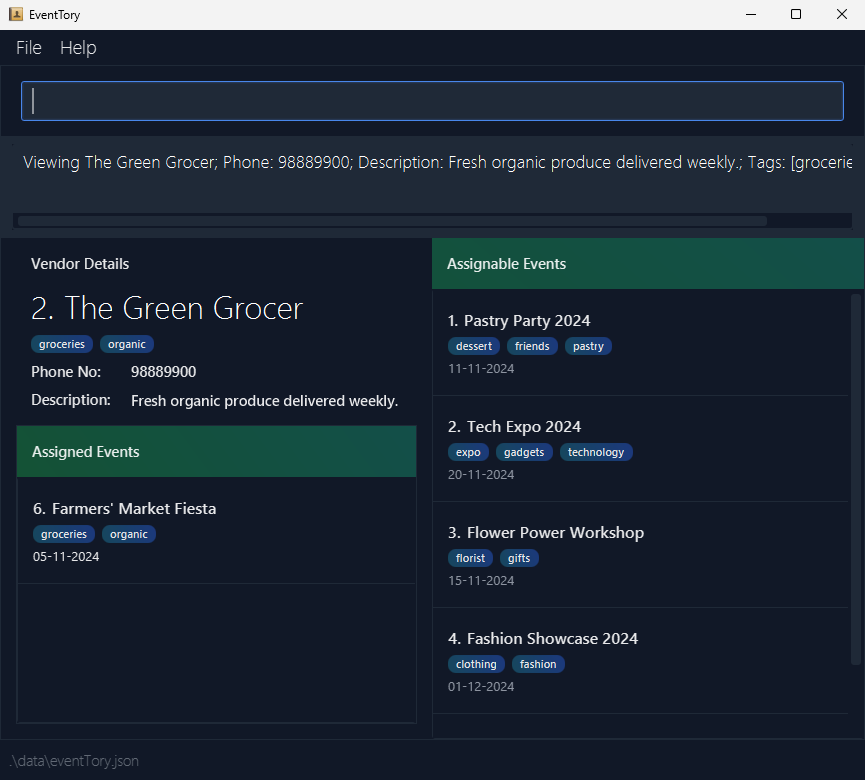

# EventTory User Guide

EventTory is a **desktop app for managing vendors and events**.

It is **optimized for use** via a Command-Line Interface (CLI) while still retaining the benefits of a Graphical User Interface (GUI). 
If you can type fast, EventTory can get your **event management tasks** done faster than traditional GUI apps.

<!-- * Table of Contents -->
<page-nav-print />

--------------------------------------------------------------------------------------------------------------------

## Quick Start

1. Ensure you have Java `17` or above installed in your Computer.

2. Download the latest `.jar` file from [here](https://github.com/AY2425S1-CS2103-F13-2/tp/releases).

3. Copy the file to the folder you want to use as the _home folder_ for the EventTory application.

4. Open a command terminal, `cd` into the folder you put the jar file in, and use the `java -jar EventTory.jar` command to run the application. 
   A GUI similar to the below should appear in a few seconds. Note that the application contains some sample data on initial boot. 
   

5. Type a command in the command box and press Enter to execute it. e.g. typing **`help`** and pressing Enter will open a help window. 
   Example commands to try:

   * `list` : Lists all events and vendors.

   * `create v/ n/Hong Lim Trading Pte. Ltd. p/67412943 d/Specialises in lighting effects. t/stage-crew` : Creates a vendor named `Hong Lim Trading Pte. Ltd.` and saves in the application.

   * `view v/1` then `assign 2` : Assigns the vendor with index 1 in the vendor list to the event with index 2 in the assignable event list.

   * `view e/4` : View more information about the event with index 4 in the event list.

   * `delete v/9` : Deletes the vendor with index 9 shown in the vendor list.

   * `clear` : Deletes all vendors and events stored in EventTory.

   * `exit` : Exits the application.

6. Refer to the [Features](#features) below for details of each command.

--------------------------------------------------------------------------------------------------------------------

## Storing Information

EventTory provides users a way to keep track of events and vendors.
The details of what information can be stored for a vendor/event are as shown below.

### Vendor

* Represents a vendor contracted to provide services for an event e.g. catering, decorating, performing, etc.
* Information about a vendor can be stored with the following fields:
  * **Name** : The name of the vendor (usually a company name)
  * **Phone Number** : The contact number of the vendor
  * **Description** : Text containing any additional information about the vendor
  * **Tags** (if applicable) : Metadata used to classify the vendor
* Multiple vendors can be stored in EventTory.

### Event

* Represents an event that needs to be organised and usually enlists the help of vendors to plan/run it.
* Information about an event can be stored with the following fields:
  * **Name** : The name of the event
  * **Date** : The date the event falls on
  * **Tags** (if applicable) : Metadata used to classify the event
* Multiple events can be stored in EventTory.

## Vendor & Event Fields

The input fields of vendors and events have varying constraints and are as listed below. Note that leading and trailing whitespaces in inputs will be removed.

**Name** : Names must start with an alphanumeric character and must not contain `/`.

**Phone Number** : Phone numbers should only contain numbers, and it should be at least 3 digits long.

**Description** : Descriptions can take in any characters but cannot be blank.

**Date** : Date inputs can be in any of the following formats:
1. `dd-mm-yyyy` e.g. `24-01-2024`
2. `yyyy-mm-dd` e.g. `2024-01-24`
3. `dd MMM yyyy` e.g. `24 Jan 2024`
4. `dd MMMM yyyy` e.g. `24 January 2024`

Note:
* Regardless of the date format chosen during input, dates will be displayed in the application in the format `dd-mm-yyyy`.
* Dates that are already past will still be accepted as inputs. This provides users the flexibility to continue tracking events even after their conclusion.
* Some dates will be rejected even when correctly formatted as these dates **do not exist**. Examples include:
  * `31-02-2024` : The month of `February` will never have `31` days.
  * `10-13-2001` : There are only `12` months in a year.

**Tags** : Tag inputs can:
* contain alphanumeric characters, hyphens `-`, and underscores `_` only.
* cannot be made up of **only** hyphens `-` and underscores `_`.
* only accept a **maximum** of 30 characters.

## Command Formats

This section contains information about the command formats used in this application.

### Parameters

* Words in `UPPER_CASE` are the parameters to be supplied by the user. 
(Commands are incomplete and are for illustrative purposes only) 
  e.g. `create v/ n/VENDOR_NAME`, `VENDOR_NAME` is a parameter which is specified by the user:
  * `create v/ n/Kimberly's Flowers`.

* Items in square brackets are **optional**. 
(Commands are incomplete and are for illustrative purposes only) 
  e.g. `create e/ n/EVENT_NAME [t/TAG]` can be used as:
  * `create e/ n/Stagecraft Solutions t/backstage-crew` or as;
  * `create e/ n/Stagecraft Solutions`.

* `INDEX` refers to the index number shown in the displayed event/vendor list.
  * The index **must be a positive integer** 1, 2, 3, …
  * The index for each vendor/event is relative and can change depending on previous operations.

* Items with `…` after them can be used multiple times, including zero times. 
  e.g. `[t/TAG]…​` can be used as:
  * ` ` (i.e. 0 times);
  * `t/big-event`;
  * `t/big-event t/coastal`, etc.

* Parameters can be in any order. 
  e.g. if the command specifies `n/NAME p/PHONE_NUMBER`, `p/PHONE_NUMBER n/NAME` is also acceptable.

* Extraneous parameters for commands that do not take in parameters (`help`, `exit` and `clear`) will be ignored. 
  * e.g. if the command specifies `help 123`, it will be interpreted as `help`.

### Off-Screen Operations

* The `view`, `edit` and `delete` commands support off-screen operations. Even when vendors/events are not currently displayed, they can still be selected by `view`, `edit` and `delete` commands.
  * This is a feature, not a bug.
  * You might encounter unexpected behaviour after issuing multiple `view` commands. See [Known Issues](#known-issues) for more details.

### Changing Indexes

* Issuing certain commands (e.g. `view` and `list`) may cause the indexes of displayed vendors/events to change compared to previous screens.
  * This is intentional to reduce the need for users to remember previous indexes when navigating between screens.
  * After such a command has been issued, please refer to the **new indexes** displayed for each item when issuing subsequent commands.
* The first items in the assigned and assignable lists will not both start with index 1. See example image: 
  * From the image, the first item in "Assigned Events" starts with index 6, while the first item in "Assignable Events" starts with index 1.
  * This is intentional. Simply follow the indexes generated for each item to select them for a command.

### Copying Long Example Commands

* If you are using a PDF version of this document, be careful when copying and pasting commands that span multiple lines as space characters surrounding line-breaks may be omitted when copied over to the application.

## Features

### Creating Vendors & Events: `create`

Creates a vendor or event in EventTory.

Format:
* To create a vendor: `create v/ n/VENDOR_NAME d/DESCRIPTION p/PHONE_NUMBER [t/TAG]…​`
* To create an event: `create e/ n/EVENT_NAME on/DATE [t/TAG]…​`

Note:
* If parameters are provided for the `v/` and `e/` flags, they will be ignored.
<box type="tip" seamless>
Tip: A vendor or event can have any number of tags (including 0).
</box>

* If an event or a vendor already has the exact same name (case-sensitive), the command will fail and an error message will be displayed.

Examples:
* `create v/ n/Hong Lim Trading Pte. Ltd. p/67412943 d/Specialises in lighting effects. t/stage-crew`
* `create e/ n/Jubilee Concert on/24 Jan 2025 t/annual`

### Editing Vendors & Events : `edit`

Edits an existing vendor or event in EventTory.

Format:
* To edit a vendor: `edit v/INDEX [n/NAME] [p/PHONE] [d/DESCRIPTION] [t/TAG]…​`
* To edit an event: `edit e/INDEX [n/NAME] [on/DATE] [t/TAG]…​`

Note:
* Edits the vendor/event at the specified `INDEX`.
* At least one of the optional fields must be provided.
    * Editing an item but providing no new values is invalid.
* The existing values will be updated to the input values.
* The operation will succeed even if the specified vendor/event is not visible on screen.
    * e.g. `edit v/1 t/` is run after `view v/2`. Even though the vendor with index 1 will not be visible, it can still be edited.
    * See [Off-Screen Operations](#off-screen-operations) for more details.
* When editing tags, the existing tags of the vendor/event will be **overridden**.
    * Tags cannot be added cumulatively.
        * e.g. if the first vendor has a tag `food`, to add another tag `urgent`, the command would be `edit v/1 t/food t/urgent`
    * You can remove all tags from a vendor/event by typing `t/` without specifying any tags after it.

Examples:
*  `edit v/1 p/58623042` : Edits the phone number of the vendor with index 1 to be `58623042`.
*  `edit e/2 n/Baby Shower t/` : Edits the name of the event with index 2 to be `Baby Shower`, and clears all existing tags.

### Deleting Vendors & Events : `delete`

Deletes a vendor or an event from EventTory.

Format: `delete [v/INDEX]` or `delete [e/INDEX]`

Note:
* Deletes the event or vendor at the specified `INDEX`.
* The operation will succeed even if the specified vendor/event is not visible on screen.
    * e.g. `delete v/1` is run after `view v/2`. Even though the vendor with index 1 will not be visible, it can still be specified for deletion. 
    * See [Off-Screen Operations](#off-screen-operations) for more details. 
* If the specified vendor/event is currently assigned to another event/vendor respectively, the operation will fail.
* If the current viewed vendor/event is deleted, the application will return you to the main list screen.

Examples:
* `list` followed by `delete v/2` deletes the vendor with index 2 in EventTory.
* `find e/ Wedding` followed by `delete e/1` deletes the event with index 1 shown in the results of the `find` command.

### Listing Vendors & Events : `list`

Displays the list of vendors and/or events in EventTory.

Format: `list [v/] [e/]`

Note:
* The list(s) displayed depends on whether the `v/` and/or `e/` prefix(es) is specified.
* If no prefixes are specified, both the vendor and event lists will be displayed.
* The prefixes can be specified in any order.
* If values are specified after the prefixes (e.g. `v/2`, `e/Party`), the value is ignored.
* The current displayed indexes for items may change after issuing this command. See [Changing Indexes](#changing-indexes) for more details.

Examples:
* `list v/` will display the list of vendors.
* `list e/` will display the list of events.
* `list v/ e/` and `list` will display both vendor and event lists.

### Viewing Vendors & Events: `view`

Views the details of a vendor or event.

Format: `view v/INDEX` or `view e/INDEX`

Note:
* Views the details of the vendor/event at the specified `INDEX`.
* The details page includes assigned events/vendors as well as a list of assignable events/vendors.
  * If already viewing an event, vendors in both assigned and assignable lists can be chosen to be viewed, and vice versa.
* The operation will succeed even if the specified vendor/event is not visible on screen.
  * e.g. `view v/2` can be run after `view v/1`. Even though the vendor with index 1 will not be visible when viewing the vendor with index 2, it can still be accessed and viewed.
  * See [Off-Screen Operations](#off-screen-operations) for more details.
* The current displayed indexes for items may change after issuing this command. See [Changing Indexes](#changing-indexes) for more details.

Examples:
* `view v/2` will show the details of the vendor with index 2 in the displayed list.
* `view e/1` will show the details of the event with index 1 in the displayed list.

### Assigning Vendors & Events: `assign`

Assigns vendors to events and vice versa.

Format: `assign INDEX`

Note:
* Assigns the vendor/event specified at `INDEX` to the current viewed event/vendor.
  * The index refers to the index number shown in the **assignable** vendor/event list.
* The command only works when the user is viewing a vendor/event using the `view` command. Otherwise, the operation will fail.
    * The displayed indexes for items may not always be the same. See [Changing Indexes](#changing-indexes) for more details.
* If the specified vendor-event pair is already associated (assigned to each other), the operation will fail.

Examples:
The following examples are for illustrative purposes only. The `aassign` command will still fail if the chosen item to assign is invalid.
* `view v/2` then `assign 1` will view the vendor with index 2 in the current list, then assign the event with index 1 in the assignable list to the chosen vendor.
* `view e/1` then `assign 3` will view the event with index 1 in the current list, then assign the vendor with index 3 in the assignable list to the chosen event.

### Unassigning Vendors & Events: `unassign`

Unassigns vendors from events and vice versa.

Format: `unassign INDEX`

Note:
* Unassigns the vendor/event specified at `INDEX` to the current viewed event/vendor.
  * The index refers to the index number shown in the **assigned** vendor/event list.
* The command only works when the user is viewing a vendor/event using the `view` command. Otherwise, the operation will fail.
  * The displayed indexes for items may not always be the same. See [Changing Indexes](#changing-indexes) for more details.
* If the specified vendor-event pair is already not associated (not assigned to each other), the operation will fail.

Examples:
The following examples are for illustrative purposes only. The `unassign` command will still fail if the chosen item to unassign is invalid.
* `view v/2` then `unassign 6` will view the vendor with index 2 in the current list, then unassign the event with index 6 in the assigned list while viewing the chosen vendor.
* `view e/1` then `unassign 11` will view the event with index 1 in the current list, then unassign the vendor with index 11 in the assigned list while viewing the chosen event.

### Searching for Vendors & Events: `find`

Finds vendors or events whose attributes contain any of the space-separated keywords provided.

Format: `find v/ KEYWORD [MORE_KEYWORDS]` or `find e/ KEYWORD [MORE_KEYWORDS]`

Note:
* The search is case-insensitive. e.g. `party` will match `Party`
* Any partial matches will still be matched e.g. `par` will match `party`
* The order of the keywords does not matter.
  * e.g. searching with keywords `party birthday` will match result `birthday party`
* All attributes of the `Vendor` or `Event` are searched, i.e. name, phone number, date, descriptions and tags.
* Vendors and Events matching at least one keyword will be returned (i.e. `OR` search).
  * e.g. `party wedding` will return `Birthday Party`, `John's Wedding`
* If user is viewing an event or a vendor, the `find` command will affect the assignable list only. Assigned list is not affected.
* To search the date field of events, the displayed format of dates should be followed.
  * e.g. `find v/ -11-` will return events dated in November.
  * String matching is used to search date fields, so the keywords `November` and `Nov` will not match a date with month `11`.
* If no matches are found, the user will be informed and the current view will remain unchanged.
* If no keywords are provided, the operation will fail.

Examples:
* `find v/ catering` returns `catering` and `Catering Solutions`
* `find e/ party wedding` returns `Birthday Party` and `John's Wedding` 

### Clearing All Entries : `clear`

Clears all vendor and event entries from EventTory.

Format: `clear`

### Accessing Help : `help`

Opens a window with instructions on how to access the help page.

Format: `help`
Keybind: F1 key

### Exiting the program : `exit`

Exits the program.

Format: `exit`

### Saving Data

EventTory data is saved in the hard disk automatically after any command that changes the data. 
There is no need to save manually.

### Editing the Data File

EventTory data is saved automatically as a JSON file `[JAR file location]/data/eventTory.json`. 
Advanced users are welcome to update data directly by editing that data file.

<box type="warning" seamless>

**Caution:**
If changes to the data file causes its format to become invalid, EventTory will discard **all data** and start with an **empty** data file at the next run.

Hence, it is recommended to make a backup of the file before attempting to edit it.
Furthermore, certain edits can cause the EventTory to behave in unexpected ways (e.g., if a value entered is outside the acceptable range). 
Therefore, edit the data file only if you are confident that you can update it correctly.

</box>

--------------------------------------------------------------------------------------------------------------------

## FAQ

**Q**: How do I transfer my data to another Computer? 
**A**: Install the app in the other computer and overwrite the empty data file it creates with the file that contains the data of your previous EventTory home folder.

--------------------------------------------------------------------------------------------------------------------

## Known Issues

1. **When using multiple screens**, if you move the application to a secondary screen, and later switch to using only the primary screen, the GUI will open off-screen. The remedy is to delete the `preferences.json` file created by the application before running the application again.
2. **If you minimize the Help Window** and then run the `help` command (or use the `Help` menu, or the keyboard shortcut `F1`) again, the original Help Window will remain minimized, and no new Help Window will appear. The remedy is to manually restore the minimized Help Window.
3. **Switching back and forth between vendor and event views** can lead to unexpected behaviour, especially when used after a `find` command.
   * e.g. when issued in order, the commands: `find v/ er`, `view v/1`, `view e/1`, `view v/2`, `view v/4` cause the final command `view v/4` to select and display an unexpected vendor.
       * Commands that support off-screen operations may also run into this selection issue and operate on the wrong item.
   * To avoid this issue:
       * Use the `list` command to reset the lists displayed after each `view` command, or;
       * Avoid alternating between viewing vendors and events. Viewing the same type of item (either vendors or events) consecutively will not cause this issue.

--------------------------------------------------------------------------------------------------------------------

## Command Summary

| Action       | Format, Examples                                                                                                                                                                                                                                  |
|--------------|---------------------------------------------------------------------------------------------------------------------------------------------------------------------------------------------------------------------------------------------------|
| **Create**   | -`create v/ n/VENDOR_NAME p/PHONE_NUMBER d/DESCRIPTION [t/TAG]…​` or,  -`create e/ n/EVENT_NAME on/DATE [t/TAG]…​`  e.g., `create e/ n/Graduation Party on/2025-12-10 t/smu`                                                             |
| **Edit**     | -`edit v/INDEX [n/VENDOR_NAME] [p/PHONE_NUMBER] [d/DESCRIPTION] [t/TAG]…​` or,  -`edit e/INDEX [n/EVENT_NAME] [on/DATE] [t/TAG]…​`    e.g., `edit v/2 n/PC Parts Trading d/Sells PC Parts` or,   `edit e/3 n/Hackathon on/2024-10-12` |
| **Delete**   | `delete v/INDEX` or `delete e/INDEX`   e.g., `delete v/3`, `delete e/2`                                                                                                                                                                        |
| **List**     | `list [v/] [e/]`   e.g. `list v/`, `list v/ e/`                                                                                                                                                                                                |
| **View**     | `view v/INDEX` or `view e/INDEX`  e.g. `view v/1`                                                                                                                                                                                              |
| **Assign**   | `assign INDEX`   e.g. `assign 1`                                                                                                                                                                                                               |
| **Unassign** | `unassign INDEX`   e.g. `unassign 1`                                                                                                                                                                                                           |
| **Find**     | -`find v/ KEYWORD [MORE_KEYWORDS]…` or, -`find e/ KEYWORD [MORE_KEYWORDS]…`   e.g., `find v/ Noodle`, `find e/ fashion`                                                                                                   |
| **Clear**    | `clear`                                                                                                                                                                                                                                           |
| **Help**     | `help`                                                                                                                                                                                                                                            |
| **Exit**     | `exit`                                                                                                                                                                                                                                            |
