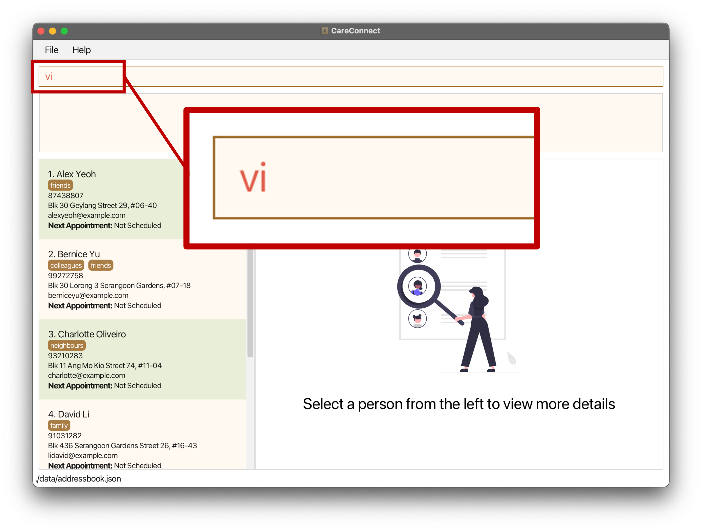
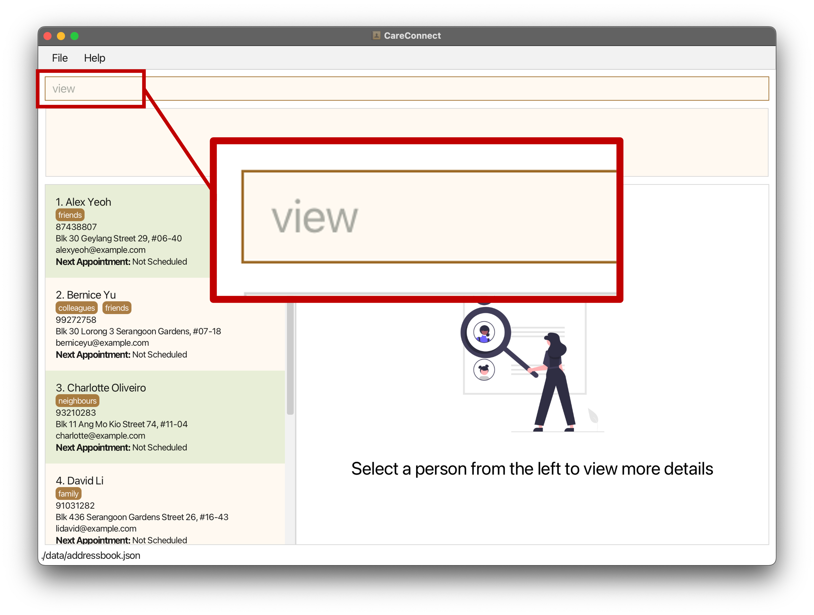
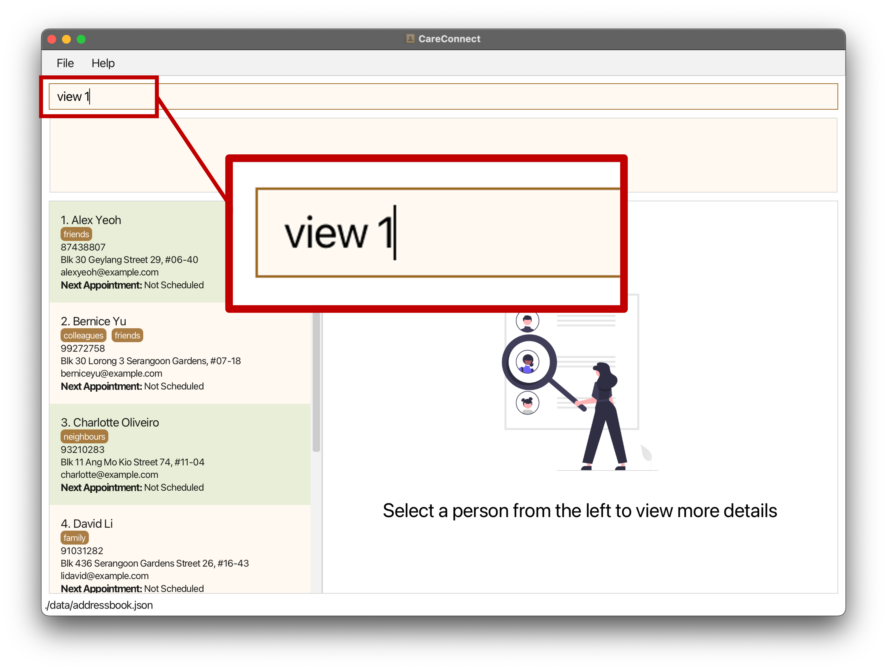
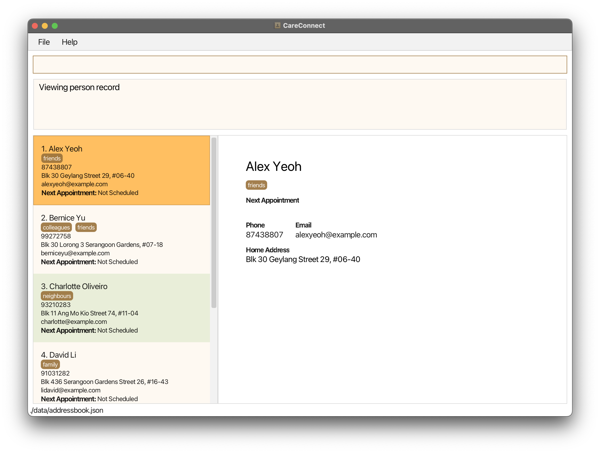
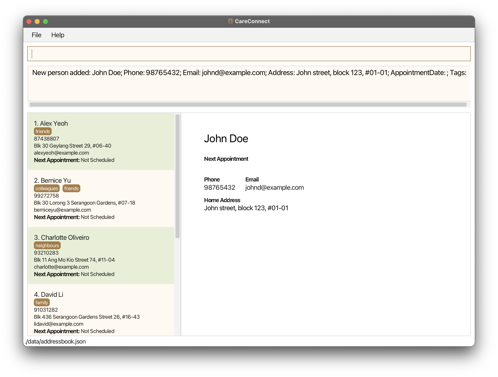
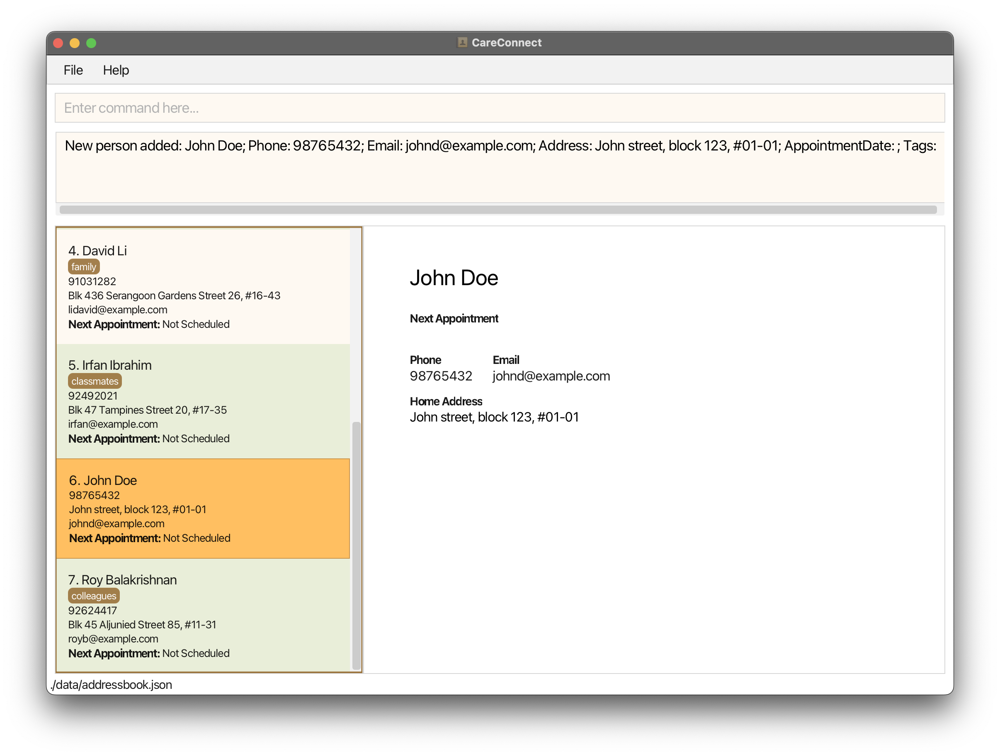
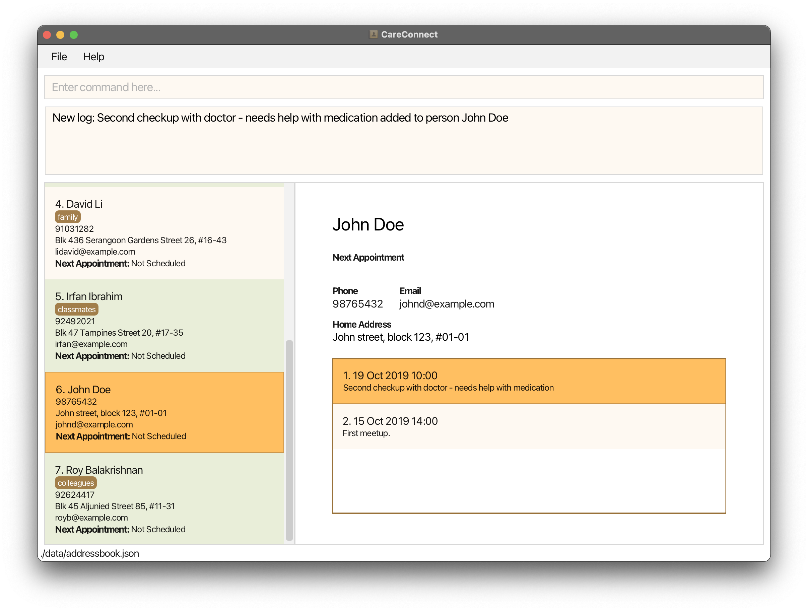
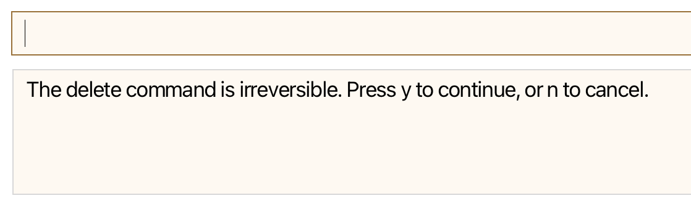
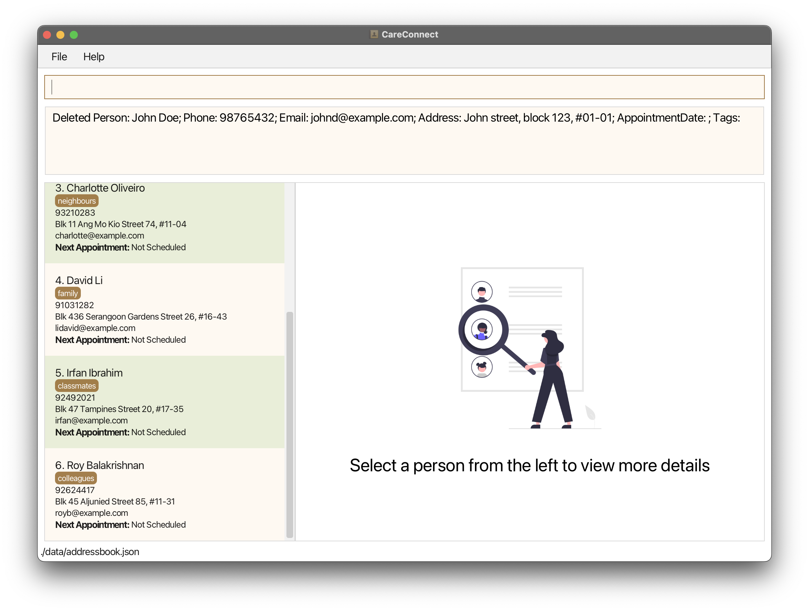

CareConnect is a **CLI-first** **case management application** that enables social workers to efficiently manage client details, appointments, and priorities. Repeated chores including data entry and search will be streamlined via simple CLI inputs, easing the mental load of the social workers, allowing them to focus more on delivering high-quality care and support for the clients.

* Table of Contents
{:toc}

## Quick start

1\. Ensure you have Java `17` or above installed on your computer.

2\. Download the latest `.jar` file from [here](https://github.com/AY2425S1-CS2103T-W13-2/tp/releases).

3\. Copy the file to the folder you want to use as the _home folder_ for your CareConnect application.

4\. Open a command terminal, `cd` into the folder you put the jar file in, and use the `java -jar careconnect.jar`
   command to run the application. 
   A GUI similar to the below should appear in a few seconds. To get started, you can play around with some of the sample data that the app comes with! 
   

5\. Note that CareConnect is best viewed in a **desktop** environment with **full screen**. You may see some
   content being cut-off if the window size is too small.

6\. Let's try opening up a contact with the `view` command!

   - As you type, notice that an invalid command word will be coloured in red.

       {: width="340" }
   - You can try autocompleting the command by pressing `TAB` on your keyboard too. In this case, the command `view` will be matched, and it will be displayed in grey to indicate that it's a valid command word that is waiting for an argument.
   
       {: width="340" }
   - In this case, `view 1` indicates that we want to view the first contact in the list. Once a full valid command is entered, the command will be colored black. 
       
       {: width="340" }
   

   - Press Enter to execute command, and you should see the details for the first contact `Alex Yeoh` appear on the right pane!
   

7\. Let's delve a little deeper now, try adding a new contact using `add n/John Doe p/98765432 e/johnd@example.com a/John street, block 123, #01-01`. This adds a contact named `John Doe` to the application.

{: width="550" }

8\. You can use `shift+tab` to navigate between your command box and the contact list. You will see a brown box around the list when it is selected.
Try using the arrow key to navigate around the list until you find `John Doe`.

{: width="550" }

9\. To add a new log entry for John, try `addlog 1 r/First meetup. d/2019-10-15 14:00`. You can add multiple logs for
the same contact, and the logs will appear as a list on the right.

{: width="550" }

10\. Finally, to delete a contact, simply use `delete <id>`. In this case, John has an id of 6 (visible from the contact list), so we can run `delete 6` to delete his contact.

11\. For security, you will be prompted to confirm your delete command. Press `y` to confirm, or `n` to cancel.

{: width="550" }

12\. Confirm that the contact has been removed from the list on the right.
   
13\. That's all! Feel free to refer to the [Features](#features) below for more details on each command and other features included in CareConnect.

## Features

**:information_source: Notes about the command format:** 

* Words in `UPPER_CASE` are the parameters to be supplied by the user. 
  e.g. in `add n/NAME`, `NAME` is a parameter which can be used as `add n/John Doe`.

* Items in square brackets are optional. 
  e.g `n/NAME [t/TAG]` can be used as `n/John Doe t/friend` or as `n/John Doe`.

* Items with `…`​ after them can be used multiple times including zero times. 
  e.g. `[t/TAG]…​` can be used as ` ` (i.e. 0 times), `t/friend`, `t/friend t/family` etc.

* Parameters can be in any order. 
  e.g. if the command specifies `n/NAME p/PHONE_NUMBER`, `p/PHONE_NUMBER n/NAME` is also acceptable.

* Invalid specifiers might cause unexpected behavior.
  e.g. If the command only accepts `n/`, `a/`, and `t/` specifiers, then additional specifiers like `u/` or `e/` might cause unexpected behavior (eg. error messages that do not make sense, or the specifier might be ignored).

* Extraneous parameters for commands that do not take in parameters (such as `help`, `list`, `exit` and `clear`) will be ignored. 
  e.g. if the command specifies `help 123`, it will be interpreted as `help`.

* If you are using a PDF version of this document, be careful when copying and pasting commands that span multiple lines as space characters surrounding line-breaks may be omitted when copied over to the application.

### Viewing help : `help`

Opens up your default browser and displays the CareConnect user guide webpage.

Format: `help`

### Adding a client: `add`

Adds a client to the case management system.

Format: `add n/NAME p/PHONE_NUMBER e/EMAIL a/ADDRESS [t/TAG]…​`

Examples:
* `add n/John Doe p/98765432 e/johnd@example.com a/John street, block 123, #01-01`
* `add n/Betsy Crowe t/friend e/betsycrowe@example.com a/Newgate Prison p/1234567 t/criminal`

:bulb: **Tip:**
A client can have any number of tags (including 0).

**:information_source: Notes about input formats:** 
The following constraints apply to both the `add` and `edit` commands:

* Client's name should only contain alphanumeric characters and spaces, and it should not be blank
  * Names are recommended to be within 100 characters long to be displayed properly.
  * Names must be unique (case-sensitive)
      - entering the commands:
          * `add n/John Doe p/98765432 e/johnd@example.com a/John street, block 123, #01-01`
          * followed by, `add n/John Doe p/12345678 e/differentEmail@example.com a/different street,
            different block, different unit`
            will not be allowed.
      - However, clients with the same name spelling but different case can be added. Entering
        the commands:
          * `add n/John Doe p/98765432 e/johnd@example.com a/John street, block 123, #01-01`
          * followed by, `add n/John doe p/12345678 e/differentEmail@example.com a/different street,
            different block, different unit` will successfully add both `John Doe` and `John 
            doe` to the case management system.
  * Acceptable name formats: `John Doe`, `John`, `Doe`, `John Doe Jr 3rd`, `John Doe Jr`.
  * Unacceptable name formats: ``, `John@Doe`, `John Doe Jr. 3rd`, `John Doe Jr.`.

* Phone number should only contain numbers, without spaces and special characters.
  * The phone number is recommended to be within 20 characters long to be displayed properly.
  - Acceptable phone number format: `12345678`, `91234567263842938`, `6512345678`.
  - Unacceptable phone number format: `123 456 789`, `9123-4567`, `1-888-888`, `+065 91234567`.

* Email address should be of the format local-part@domain and adhere to the following constraints:
    * The email address is recommended to be within 100 characters long to be displayed properly.
    1. The local-part should only contain alphanumeric characters and these special characters, excluding the parentheses, (+_.-).
        - The local-part may not start or end with any special characters.
        - The local-part may not have consecutive special characters.
    2. This is followed by a '@' and then a domain name. The domain name is made up of domain labels separated by periods.
       The domain name must:
        - end with a domain label at least 2 characters long.
        - have each domain label start and end with alphanumeric characters.
        - have each domain label consist of alphanumeric characters, separated only by hyphens, if any.
    * Acceptable email format: `client@email.com`, `cli+ent.name@email.com`.
    * Unacceptable email format: `cli+-ent@email.com`, `client@.com`, `client@.email.com`.

* Addresses can take any values, and it should not be blank.
    * The address is recommended to be within 100 characters long to be displayed properly.
    - Acceptable address format: `123, Clementi Rd, 1234665`, `Blk 123, Clementi Ave 6, #08-111`.
    - Unacceptable address format: ``.

* Tag names should be alphanumeric. They should not contain any spaces or special characters.
    * The tag name is recommended to be within 50 characters long to be displayed properly.
    - Acceptable tag format: `friend`, `colleague`, `newComer`.
    - Unacceptable tag format: ``, `friend colleague`, `friend, colleague`, `friend&colleague`.

### Editing a client : `edit`

Edits an existing client in the case management system.

Format: `edit INDEX [n/NAME] [p/PHONE] [e/EMAIL] [a/ADDRESS] [t/TAG]…​`

* Edits the client at the specified `INDEX`. The index refers to the index number shown in the displayed client list. The index **must be a positive integer** 1, 2, 3, …​
* At least one of the optional fields must be provided.
* Existing values will be updated to the input values.
* When editing tags, the existing tags of the client will be removed i.e adding of tags is not cumulative.
  * If you wish to add tag instead of replacing all existing tags, use the [`tag`](https://ay2425s1-cs2103t-w13-2.github.io/tp/UserGuide.html#tagging-a-client-tag) command.
* You can remove all the client’s tags by typing `t/` without
  specifying any tags after it.

Examples:
*  `edit 1 p/91234567 e/johndoe@example.com` Edits the phone number and email address of the 1st client to be `91234567` and `johndoe@example.com` respectively.
*  `edit 2 n/Betsy Crower t/` Edits the name of the 2nd client to be `Betsy Crower` and clears all existing tags.

**:information_source: Notes about input formats:** 

The same constraints on the input formats apply to the `edit` command, refer to [Notes about 
input formats](https://ay2425s1-cs2103t-w13-2.github.io/tp/UserGuide.html#input-format) in the 
`add` command 
section for more details.

### Listing all beneficiaries : `list`

Lists of all beneficiaries in the case management system.

Format: `list`

### Viewing a client's details: `view`

View the details of the specified client in the case management system.

Format: `view INDEX`

* Opens up record of the client at the specified `INDEX`.
* The index refers to the index number shown in the displayed client list.
* The index **must be a positive integer** 1, 2, 3, …​

Examples:
* `list` followed by `view 2` opens up the record of the 2nd client in the displayed client list.
* `find n/Betsy` followed by `delete 1` opens up the record of the 1st client in the results of the `find` command.

### Tagging a client: `tag`

Tags a client in the case management system.

Format: `tag INDEX t/TAG_NAME`

* Adds the tag to the client at the specific `INDEX`.
* The tag names should be alphanumeric. They should not contain any spaces or special characters.
* Only one tag can be added at once.
* Adding a tag that has the same tag name as a pre-existing tag will override the original tag.

Example:
- `tag 1 t/urgent`

### Untagging a client: `untag`

Untags a client in the case management system.

Format: `untag INDEX t/TAG`

* Removes the tag from the client at the specific `INDEX`.
* Only one tag can be removed at once.
  * If you would like to remove all tags on a client, use the [`edit`](https://ay2425s1-cs2103t-w13-2.github.io/tp/UserGuide.html#editing-a-client--edit) command instead
* If the tag is not found, a warning will be displayed.

Example:
- `untag 1 t/urgent`

### Setting an appointment: `setappointment`

Sets an appointment date for a client.

Format: `setappointment INDEX d/[YYYY-MM-DD]`

* Sets appointment date for the client at the specific `INDEX`.
* Setting the appointment date to the same date will override the original date, no changes will 
  be made effectively.

Example:
- `setappointment 1 d/2024-11-23`

* If the date is left empty, the current appointment date will be removed.

Example:
- `setappointment 1 d/` removes the appointment date for the client at index 1.

### Searching and filtering clients: `find`

Finds and filters all clients using a combination of name, address, and tags.

Format: `find n/KEYWORD [MORE_KEYWORDS] a/KEYWORD [MORE_KEYWORDS] t/TAG [MORE_TAGS]`

* At least one of name(`n/`), address(`a/`), or tag(`t/`) needs to be entered.
* All other invalid parameters will be ignored (eg. `u/` or `e/`)
* The search is case-insensitive. e.g `hans` will match `Hans`

* The order of the keywords does not matter. 
  * e.g. `n/Hans Bo` will match name `Bo Hans`.
  * `a/Ave Clementi` will match the address`Clementi Ave`.
* Partial names and addresses will also be matched. 
  * e.g. `Han` will match `Hans`.
  * e.g. `Cle` will match `Clementi`.
* Tags will only match if they are exactly the same.
  * e.g. `elderly` will match `elderly`.
  * e.g. `urg` will not match `urgent`.
* For name searching, beneficiaries matching at least one keyword will be returned (i.e. `OR` search).
  * e.g. `find n/Hans Bo` will return `Hans Gruber`, `Bo Yang`.
* For address and tags searching, beneficiaries must match all keywords to be returns (i.e `AND` search).
  * This serves as a filtering function.
  * e.g. `find t/urgent elderly` will return clients with both the `urgent` and `elderly` tags.
  * e.g. `find a/clementi ave` will return clients whose address contains both `clementi` and `ave`.

* If multiple parameters are used, only those matching all parameters will be returned
    to help quickly filter and narrow down searches.
  * e.g. `find n/Hans Bo a/serangoon` will return:
        1. `Hans Gruber` who has the address `Serangoon street 2, blk 111`.
        2. `Bo Yang` who has the address `Blk 777 Serangoon Ave 1`.
        3.  It will **not** return `John Hans` who has the address `9 Bishan Road, 302534`.

Examples:
* `find n/ John` returns `johnny` and `John Doe`.
* `find n/ benson carl` returns `Benson Meier`, `Carl Kurz`. 
* `find a/ serangoon` will return `Bernice Yu` with address `Blk 30 Lorong Serangoon Gardens, 
  #07-18` and `David Li` with address `Blk 436 Serangoon Gardens 26, #16-43`.
* `find a/ cl av` will return `Carl` with address `Blk 777 Clementi Ave 2`.
* `find n/john a/Bishan t/urgent` will return `John Hans` with address `9 Bishan road, 302534` 
  and tags `urgent`, `ill`.

### Deleting a client : `delete`

Deletes the specified client from the case management system.

Format: `delete INDEX`

* Deletes the client at the specified `INDEX`.
* The index refers to the index number shown in the displayed client list.
* The index **must be a positive integer** 1, 2, 3, …​
* Note that the `delete` command requires confirmation. You will be prompted to key in either `y` or `n` after
the entering the command, which will either confirm or cancel the command, respectively. You will not be allowed to
execute another command until the `delete` command is either confirmed or cancelled.

Examples:
* `delete 2` deletes the 2nd client in the displayed client list.

### Adding a log entry : `addlog`

Adds a log entry to the specified client in the case management system.

Format: `addlog INDEX r/REMARK [d/DATE]`

* Adds a log entry to the client at the specified `INDEX`.
* The index refers to the index number shown in the displayed client list.
* The index **must be a positive integer** 1, 2, 3, …​
* The remark is mandatory. It can be any non-empty string within 500 characters. e.g. `Client is 
  doing well`.
* The date is optional and defaults to the current date and time if not provided.
* The date must be in the format `yyyy-MM-dd HH:mm` e.g. `2022-12-12 14:00`.

Examples:
* `addlog 2 r/Client is doing well d/2022-12-12 14:00` adds a log entry to the 2nd client with the remark `Client is doing well` and the date `2022-12-12 14:00`.
* `addlog 1 r/Client is doing well` adds a log entry to the 1st client in the displayed client list, with the current date and time.

### Deleting a log entry : `deletelog`

Deletes the specified log entry from the specified client in the case management system.

Format: `deletelog INDEX l/LOG_INDEX`
* Deletes the log entry at the specified `LOG_INDEX` from the client at the specified `INDEX`.
* The index refers to the index number shown in the displayed client list.
* The index **must be a positive integer** 1, 2, 3, …​
* The `LOG_INDEX` refers to the index number shown in the displayed log list.
* The `LOG_INDEX` **must be a positive integer** 1, 2, 3, …​
* The `LOG_INDEX` is specific to the client at the specified `INDEX`.
* Note that the `deletelog` command requires confirmation. You will be prompted to key in either `y` or `n` after 
  the entering the command, which will either confirm or cancel the command, respectively. You will not be allowed to
  execute another command until the `deletelog` command is either confirmed or cancelled.

Examples:
* `deletelog 2 l/3` deletes the 3rd log entry from the 2nd client in the case management system.
* `find n/Alice` followed by `deletelog 1 l/2` deletes the 2nd log entry from the 1st client in the 
  results of the `find` command.

### Clearing all entries : `clear`

Clears all entries from the case management system.

Format: `clear`
* Note that the `clear` command requires confirmation. You will be prompted to key in either `y` or `n` after
  the entering the command, which will either confirm or cancel the command, respectively. You will not be allowed to
  execute another command until the `clear` command is either confirmed or cancelled.

### Exiting the program : `exit`

Exits the program.

Format: `exit`

### Saving the data

CareConnect data are saved in the hard disk automatically after any command that changes the data. There is no need to
save
manually.

### Autocomplete commands

CareConnect provides command autocompletion when pressing the Tab key. For example, typing `f` and pressing Tab will auto complete the command to `find`.

### Syntax Highlighting
CareConnect provides visual feedback to help users recognize and correct commands by highlighting text in different colors.

* Black: Indicates a fully valid command.
* Gray: Indicates a valid command word pending arguments.
* Red: Indicates an invalid command.

This color-coded feedback helps users ensure their commands are correct and minimizes errors in usage.

### Easy keyboard navigation
CareConnect offers convenient keyboard navigation. Press `Shift + Tab` to switch focus between the command box, log list, and person list. Use the `Up` and `Down` arrow keys to scroll through lists.

### Editing the data file

CareConnect data are saved automatically as a JSON file `[JAR file location]/data/addressbook.json`. Advanced users are
welcome to update data directly by editing that data file.

:exclamation: **Caution:**
If your changes to the data file makes its format invalid, CareConnect will discard all data and start with an empty data file at the next run. Hence, it is recommended to take a backup of the file before editing it. 
Furthermore, certain edits can cause CareConnect to behave in unexpected ways (e.g., if a value entered is outside of the acceptable range). Therefore, edit the data file only if you are confident that you can update it correctly.

--------------------------------------------------------------------------------------------------------------------

## FAQ

**Q**: How do I transfer my data to another computer? 
**A**: Install the app in the other computer and overwrite the empty data file it creates with the file that contains the data of your previous CareConnect home folder.

--------------------------------------------------------------------------------------------------------------------

## Known issues

1. **When using multiple screens**, if you move the application to a secondary screen, and later switch to using only the primary screen, the GUI will open off-screen. The remedy is to delete the `preferences.json` file created by the application before running the application again.

--------------------------------------------------------------------------------------------------------------------

## Command summary

Action | Format, Examples
--------|------------------
**Help** | `help`
**Add** | `add n/NAME p/PHONE_NUMBER e/EMAIL a/ADDRESS [t/TAG]…​`   e.g., `add n/James Ho p/22224444 e/jamesho@example.com a/123, Clementi Rd, 1234665 t/friend t/colleague`
**Edit** | `edit INDEX [n/NAME] [p/PHONE_NUMBER] [e/EMAIL] [a/ADDRESS] [t/TAG]…​`  e.g.,`edit 2 n/James Lee e/jameslee@example.com`
**List** | `list`
**View** | `view INDEX`   e.g., `view 3`
**Tag** | `tag INDEX t/TAG_NAME`   e.g., `tag 1 t/highPriority`
**Untag** | `untag INDEX t/TAG_NAME`   e.g., `untag 1 t/highPriority`
**Set Appointment** | `setappointment INDEX d/[YYYY-MM-DD]`   e.g., `setappointment 1 d/2024-11-23`
**Find** | `find n/NAME [MORE_NAME_KEYWORDS] a/ADDRESS [MORE_ADDRESS_KEYWORDS] t/TAG [MORE_TAGS]` At least one of the parameters is required  e.g., `find n/James Jake a/Clementi t/elderly urgent`
**Delete** | `delete INDEX`  e.g., `delete 3`
**Add Log** | `addlog INDEX r/REMARK [d/DATE]`  e.g., `addlog 2 r/Client is doing well d/2022-12-12 14:00`
**Delete Log** | `deletelog INDEX l/LOG_INDEX`  e.g., `deletelog 2 l/3`
**Clear** | `clear`
**Exit** | `exit`
