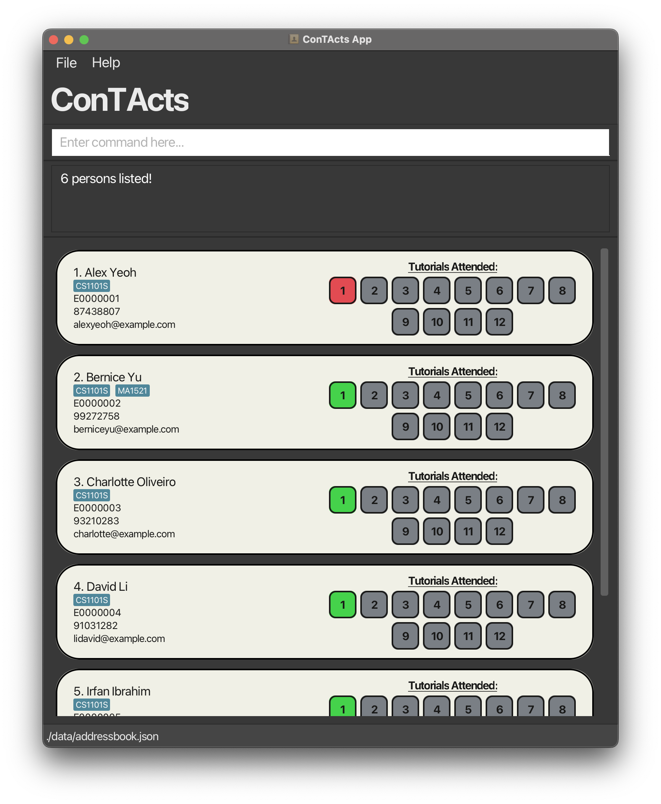
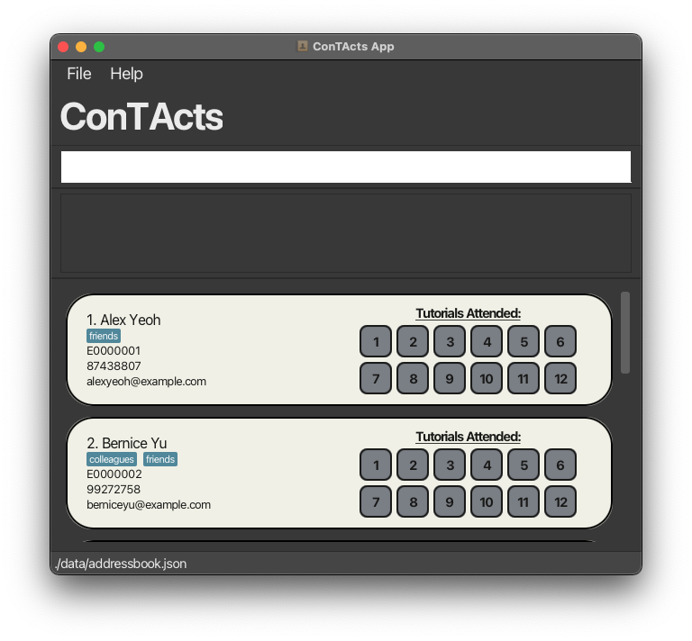
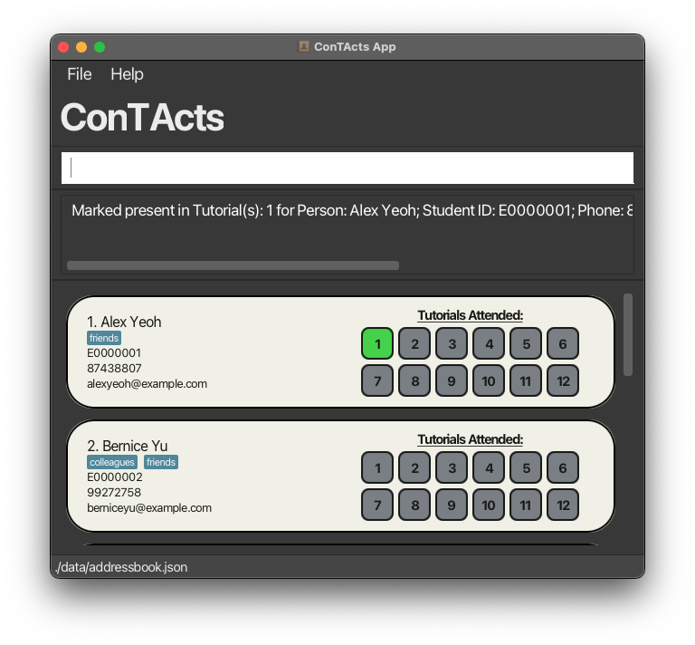

## 

**ConTActs** is a desktop application designed specifically for Teaching Assistants (TAs) to **manage student contact information efficiently** and **keep track of their tutorial attendance**. 
Optimised for TAs **comfortable with Command Line Interface** (CLI) commands, ConTActs exploits the speed of CLI commands while retaining the benefits of a Graphical User Interface (GUI).
For TAs who type quickly, ConTActs provides a faster, more streamlined solution for student contact management compared to traditional GUI applications.

  - [Installation Guide](#installation-guide)
  - [Features](#features)
  - [Command Summary](#command-summary)
  - [FAQ](#faq)
  - [Known Issues](#known-issues)

---

## Installation Guide

1. Ensure you have Java `17` or above installed in your Computer.

2. Download the latest `.jar` file from [here](https://github.com/AY2425S1-CS2103T-T10-3/tp/releases).

3. Copy the file to the folder you want to use as the _home folder_ for your **ConTActs**.

4. Open a command terminal, `cd` into the folder you put the jar file in, and use the `java -jar ConTActs.jar` command to run the application. 
   A GUI similar to the below should appear in a few seconds. Note how the app contains some sample data. 
   

5. Type the command in the command box and press Enter to execute it. e.g. typing `help` and pressing Enter will open the help window. 
   Some example commands you can try:

   - `list` : Lists all students in the contact list.

   - `add n/John Doe i/E0000000 p/98765432 e/johnd@example.com` : Adds a student named `John Doe` to the contact list.

   - `delete 3` : Deletes the 3rd student shown in the current list.

   - `clear` : Deletes all students in the contact list.

   - `exit` : Exits the app.

6. Refer to the [Features](#features) below for details of each command.

---

## Features

**:information_source: Notes about the command format:** 

- Words in `UPPER_CASE` are the parameters to be supplied by the user. 
  e.g. in `add n/NAME`, `NAME` is a parameter which can be used as `add n/John Doe`.

- Tutorials are labelled starting from `1`, regardless of when they commence.

- Items in square brackets are optional. 
  e.g `n/NAME [t/TAG]` can be used as `n/John Doe t/CS1101S` or as `n/John Doe`.

- Items with `…`​ after them can be used multiple times including zero times. 
  e.g. `[t/TAG]…​` can be empty, `t/CS1101S`, `t/MA1521 t/CS1101S` etc.

- For commands with only prefixes (e.g. `add`, `edit`), parameter order does not matter. 
  e.g. `n/NAME p/PHONE_NUMBER` and `p/PHONE_NUMBER n/NAME` are both acceptable.

- Extraneous parameters for commands that do not take in parameters (such as `help`, `list`, `exit` and `clear`) will be ignored. 
  e.g. if the command specifies `help 123`, it will be interpreted as `help`.

- If you are using a PDF version of this document, be careful when copying and pasting commands that span multiple lines as space characters surrounding line-breaks may be omitted when copied over to the application.

### Viewing help : `help`

Shows a message with basic examples of commands. Copy URL button allows users to copy the link of this page for easy access to this user guide.

Format: `help`

### Adding a student : `add`

Adds a student to the contact list.

Format: `add n/NAME i/STUDENT_ID p/PHONE e/EMAIL [t/TAG]…​`

For more information about the different fields e.g. (`NAME`, `EMAIL`, ...), please reference [Field Constraints](#field-constraints).

:bulb: **Tip:**
A student can have any number of tags (including 0)

Examples:

- `add n/John Doe i/E0000000 p/98765432 e/johnd@example.com`
- `add n/Betsy Crowe t/friend i/E1234567 e/betsycrowe@u.nus.edu p/1234567 t/CS1101S`

### Listing all students : `list`

Displays all students in the contact list.

Format: `list`

### Editing a student : `edit`

Edits an existing student in the contact list.

Format: `edit INDEX [n/NAME] [i/STUDENT_ID] [p/PHONE] [e/EMAIL] [t/TAG]…​`

- Edits the student at the specified `INDEX`. The index refers to the index number shown in the displayed contact list. The index **must be a positive integer** (1, 2, 3, …​).
- At least one of the optional fields must be provided.
- Existing values will be updated to the input values.
- When editing tags, the existing tags of the student will be removed i.e adding of tags is not cumulative.
- You can remove all the student’s tags by typing `t/` without
  specifying any tags after it.

Examples:

- `edit 1 p/91234567 e/johndoe@example.com` Edits the phone number and email address of the 1st student to be `91234567` and `johndoe@example.com` respectively.
- `edit 2 n/Betsy Crower t/` Edits the name of the 2nd student to be `Betsy Crower` and clears all existing tags.

### Locating students by name or tag : `find`

Finds students whose names or tags contain any of the given keywords.

Format: `find KEYWORD [MORE_KEYWORDS] [t/TAG]` or `find [KEYWORDS] t/TAG`

- At least one field of `KEYWORD` or `TAG` is required for the search.
- The search is case-insensitive. e.g `hans` will match `Hans`
- The order of the keywords does not matter. e.g. `Hans Bo` will match `Bo Hans`
- The name as well as the tags will be searched.
- Students matching at least one keyword or tag will be returned (i.e. `OR` search).
  e.g. `Hans Bo` will return `Hans Gruber`, `Bo Yang`
- Searching for both name and tags will return all results that have either the name or the respective tag, which is basically the union of both groups.

Examples:

- `find John` returns `john` and `John Doe`
- `find an` returns `armin` (characters a and n are present in **a**rmi**n**) and `brian`
- `find alex david` returns `Alex Yeoh`, `David Li`  
  
- `find t/1` returns all students tagged with tag `MA1521` and `CS1101S` etc.  
- `find alex t/CS1101S` returns `Alex Yeoh` and all students tagged with tag `CS1101S` 
  

### Marking student as present : `mark`

Sets the specified tutorial(s) as present for the student at the given index.

Format: `mark INDEX tut/TUTORIAL`

- `Index` refers to the index number shown in the displayed contact list. The index **must be a positive integer** (1, 2, 3, …​).
- `TUTORIAL` can be in the format of:
  - A positive number between 1 - 12 (inclusive) e.g. `1`.
  - A list of numbers e.g. `[1,3,5]`.
  - A range of two numbers e.g. `3-6`. 

Examples:

- `mark 1 tut/1` Marks the 1st student in the contact list as attended for tutorial 1.
- `mark 1 tut/1-3` Marks the 1st student in the contact list as attended for tutorials 1 to 3.
- `mark 1 tut/[2,4,12]` Marks the 1st student in the contact list as attended for tutorials 2, 4 and 12.

Visual Effect:

- After the command `mark 1 tut/1`, tutorial box 1 of the 1st student will turn **green**.

  |Before|After|
  |---|---|
  |||

### Marking student as absent : `unmark`

Sets the specified tutorial(s) as absent for the student at the given index.

Format: `unmark INDEX tut/TUTORIAL`

- `Index` refers to the index number shown in the displayed contact list. The index **must be a positive integer** (1, 2, 3, ...).
- `TUTORIAL` can be in the format of:
    - A positive number between 1 - 12 (inclusive) e.g. `1`.
    - A list of numbers e.g. `[1,3,5]`.
    - A range of two numbers e.g. `3-6`.

Examples:

- `unmark 1 tut/1` Marks the 1st student in the contact list as absent for tutorial 1.
- `unmark 1 tut/1-3` Marks the 1st student in the contact list as absent for tutorials 1 to 3.
- `unmark 1 tut/[2,4,12]` Marks the 1st student in the contact list as absent for tutorials 2, 4 and 12.

Visual Effect:

The specified tutorial box of the specified student will turn **red**.

>❗ *To reduce visual clutter, an image will not be provided*.

---

### Resetting student's attendance : `reset`

Resets attendance for the specified tutorial(s) for the student at the given index.

Format: `reset INDEX tut/TUTORIAL`

- `Index` refers to the index number shown in the displayed student list. The index **must be a positive integer** (1, 2, 3, ...).
- `TUTORIAL` can be in the format of:
    - A positive number between 1 - 12 (inclusive) e.g. `1`.
    - A list of numbers e.g. `[1,3,5]`.
    - A range of two numbers e.g. `3-6`.

Examples:

- `reset 1 tut/1` Resets the attendance of the 1st student in the contact list for tutorial 1.
- `reset 1 tut/1-3` Resets the attendance of the 1st student in the contact list for tutorials 1 to 3.
- `reset 1 tut/[2,4,12]` Resets the attendance of the 1st student in the contact list for tutorials 2, 4 and 12.

Visual Effect:

The specified tutorial box of the specified student will turn **grey**.

>❗ *To reduce visual clutter, an image will not be provided*.

---

**:information_source: Faster attendance updating:** 
You can use the `mark`, `unmark` and `reset` commands with the wildcard `*` to update the attendance of all currently displayed students in the contact list at once.
- `mark * tut/1` sets all students as present for tutorial 1.
- `unmark * tut/1` sets all students as absent for tutorial 1.
- `reset * tut/1` resets the attendance of all students for tutorial 1.

A combination of commands can be used to optimise attendance updating. e.g. *John* did not attend tutorial 1 but the rest of the students did.

1. `mark * tut/1`
2. `find john`
3. `unmark 1 tut/1` (assuming *John* is the first student in the list)

### Sorting students : `sort`

Sorts the displayed list of students by either name, student id or tutorial attendance. The sorting order will be maintained while edits to the list are made.

Format: `sort ORDER [n/] [i/] [tut/TUTORIAL]`

- `ORDER` indicates whether the sorted list is **ascending** or **descending**.
- **Ascending** is represented with integer 1.
- **Descending** is represented with integer -1.
- `n/` indicates sorting according to name.
- `i/` indicates sorting according to student id.
- `tut/TUTORIAL` indicates sorting according to tutorial attendance for a **single** tutorial.
- Exactly one sorting criterion `[n/]`, `[i/]`, `[tut/TUTORIAL]` must be specified. `sort ORDER` is an invalid command.

Examples:

- `sort -1 i/` sorts the student list in descending order according to student id.
- `sort 1 tut/3` sorts the student list according to tutorial 3 attendance in this order: present, absent and not marked (grey box).
- `sort -1 tut/3` sorts the student list according to tutorial 3 attendance in this order: absent, present and not marked (grey box).

### Deleting a student : `delete`

Deletes the specified student from the contact list.

Format: `delete INDEX`

- Deletes the student at the specified `INDEX`.
- The index refers to the index number shown in the current displayed contact list.
- The index **must be a positive integer** e.g. 1, 2, 3, …​

Examples:

- `list` followed by `delete 2` deletes the 2nd student in the current displayed contact list.
- `find Betsy` followed by `delete 1` deletes the 1st student in the results of the `find` command.

### Clearing all entries : `clear`

Clears all entries from the contact list.

Format: `clear`

:exclamation: **Caution:**
This command will delete **ALL student contact data** in the contact list, and it **cannot be undone**. 
Please ensure that you really want to remove all contact records before proceeding.

### Exiting the program : `exit`

Exits the program.

Format: `exit`

### Saving the data

ConTActs data are saved in the hard disk automatically after any command that changes the data. There is no need to save manually.

### Editing the data file

ConTActs data are saved automatically as a JSON file `[JAR file location]/data/addressbook.json`. Advanced users are welcome to update data directly by editing that data file.

:exclamation: **Caution:**
If your changes to the data file makes its format invalid, ConTActs will discard all data and start with an empty data file at the next run. Hence, it is recommended to take a backup of the file before editing it.  
Furthermore, certain edits can cause the ConTActs to behave in unexpected ways (e.g., if a value entered is outside of the acceptable range). Therefore, edit the data file only if you are confident that you can update it correctly.

---

## Command summary
Click on each command to jump to their subsection.

| Action                                            | Format, Examples                                                                                                                                                            |
|---------------------------------------------------|-----------------------------------------------------------------------------------------------------------------------------------------------------------------------------|
| **[Help](#viewing-help--help)**                   | `help`                                                                                                                                                                      |
| **[Add](#adding-a-student--add)**                  | `add n/NAME i/STUDENT_ID p/PHONE e/EMAIL [t/TAG]…​`   e.g., `add n/John Doe i/E0000000 p/98765432 e/johnd@example.com t/CS1101S`                            |
| **[List](#listing-all-students--list)**            | `list`                                                                                                                                                                      |
| **[Edit](#editing-a-student--edit)**               | `edit INDEX [n/NAME] [i/STUDENT_ID] [p/PHONE] [e/EMAIL] [t/TAG]…​`  e.g.,`edit 2 n/James Lee e/jameslee@example.com`                                                     |
| **[Find](#locating-students-by-name-or-tag--find)**       | `find KEYWORD [MORE_KEYWORDS]`  e.g., `find James Jake`                                                                                                                  |
| **[Mark](#marking-student-as-present--mark)**     | `mark INDEX tut/TUTORIAL`   - `INDEX`: integer or `*` for all   - `TUTORIAL`: integer, list (e.g.,`tut/[1,3,7]`) or range (e.g.,`tut/1-12`)   e.g., `mark 2 tut/1` |
| **[Unmark](#marking-student-as-absent--unmark)**   | `unmark INDEX tut/TUTORIAL`   - `INDEX`: integer or `*` for all   - `TUTORIAL`: integer, list or range  e.g., `unmark 2 tut/1`                                     |
| **[Reset](#resetting-students-attendance--reset)** | `reset INDEX tut/TUTORIAL`  - `INDEX`: integer or `*` for all   - `TUTORIAL`: integer, list or range   e.g., `reset 2 tut/1`                                       |
| **[Sort](#sorting-students--sort)**                | `sort ORDER [n/] [i/] [tut/]`  e.g., `sort -1 i/`                                                                                                                          |
| **[Delete](#deleting-a-student--delete)**          | `delete INDEX`  e.g., `delete 3`                                                                                                                                         |
| **[Clear](#clearing-all-entries--clear)**         | `clear`                                                                                                                                                                     |
| **[Exit](#exiting-the-program--exit)**            | `exit`                                                                                                                                                                      |

---

## FAQ

**Q**: How do I transfer my data to another Computer? 
**A**: Install the app in the other computer and overwrite the empty data file it creates with the file that contains the data of your previous ConTActs home folder.

**Q**: Does clicking a student's card (the individual boxes containing his/her contact information) perform any command? 
**A**: Clicking the student's card does not affect any details of the student. The colour of the card will change. Clicking another student's card will restore the card to its original colour and change the colour of the other student's card.

---

## Field Constraints

| Field        | Acceptable Values                                                                                                                                                                                                                                                                                                                                                                                                                  |
|--------------|------------------------------------------------------------------------------------------------------------------------------------------------------------------------------------------------------------------------------------------------------------------------------------------------------------------------------------------------------------------------------------------------------------------------------------|
| `NAME`       | Alphanumeric                                                                                                                                                                                                                                                                                                                                                                                                                       |
| `STUDENT_ID` | E followed by 7 digits (0 to 9)                                                                                                                                                                                                                                                                                                                                                                                                    |
| `PHONE`      | At least 3 digits (0 to 9)                                                                                                                                                                                                                                                                                                                                                                                                         |
| `EMAIL`      | Acceptable format: **local-part**@**domain**  **local-part**:  - Alphanumeric and special characters: (`+_.-`), not starting / ending with any special characters   **domain**:  - End with a domain label at least 2 characters long  - Have each domain label start and end with alphanumeric characters  - Have each domain label consist of alphanumeric characters, separated only by hyphens, if any |
| `TAG`        | Alphanumeric                                                                                                                                                                                                                                                                                                                                                                                                                       |

**:information_source: Additional Information on Name, Email and Tags Usage:** 

- **Duplicate Names Handling**:   To avoid duplicate entries, `ConTActs` does not permit identical names. In rare cases where students have the exact same name, add unique identifiers (e.g., `John Doe 1`) or use partial names (e.g., `John` and `John Doe`) to differentiate between entries.
- **Case Sensitivity for Emails and Tags**:   `ConTActs` treats emails and tags as case-sensitive, meaning entries like `USER@EXAMPLE.COM` and `user@example.com` or `CS2103T` and `cs2103t` are considered distinct. If desired, use a consistent capitalisation format across all emails and tags.

---

## Known issues

1. **Multiple Screens**: Moving the application to a secondary screen and later switching to using only the primary screen will cause the GUI to open off-screen. To remedy this, delete the `preferences.json` file created by the application before running it again.
2. **Missing Help Window**: If you minimise the Help Window and then run the `help` command (or use the `Help` menu, or the keyboard shortcut `F1`) again, the original Help Window will remain minimised, and no new Help Window will appear. To remedy this, manually restore the minimised Help Window.
3. **Special End Characters in Emails**: While emails ending with special characters (e.g., `+`, `-`, `_`) are generally valid, `ConTActs` does not support them currently. If a student's email ends with a special character, use their NUS Net Email instead.

---
[Back to Top](#top)
