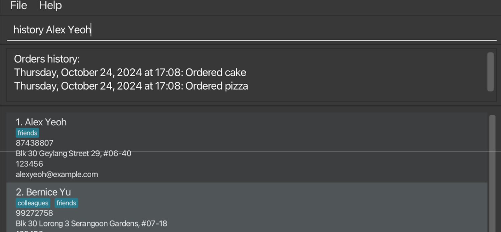

Welcome to the NomNomNotifier User Guide, your essential toolkit for mastering customer management in a fast-paced restaurant environment. This guide is crafted for all members of the restaurant team—from front-of-house staff to receptionists—equipping you with everything you need to manage customer information effortlessly. You don’t need any prior technical expertise; this guide is designed with simplicity and ease in mind, making it accessible even for those completely new to digital customer management tools.

NomNomNotifier brings powerful features right to your desktop, enabling quick and accurate access to customer data like names, addresses, contact details, and dietary preferences. Our app enhances the speed of customer service while helping teams manage VIPs and special requests with ease. Combining a Command Line Interface (CLI) with a user-friendly Graphical Interface (GUI), NomNomNotifier offers the flexibility to work however you prefer—type commands to streamline actions or navigate visually to find exactly what you need.

* Table of Contents
  {:toc}

---

## Quick start

1. Ensure you have Java `17` or above installed on your computer.
    - **To check:** Open a command terminal (Terminal for macOS, Command Prompt for Windows), and type `java -version` to check if Java is installed and which version is installed.
    - **To install:** Visit Oracle’s Java 17 download page. Download the version for your operating system (Windows, macOS, or Linux). Follow the instructions provided by Oracle to install Java 17.

2. Download the latest `.jar` file from [here](https://github.com/AY2425S1-CS2103T-T13-2/tp/releases/tag/v1.4).

3. Copy the file to the folder you want to use as the _home folder_ for your AddressBook.

4. Open a command terminal, `cd` into the folder where you placed the jar file, and use the `java -jar NomNomNotifier.jar` command to run the application. 
   A GUI similar to the one below should appear in a few seconds, containing some sample data. 
   

5. Type a command in the command box and press Enter to execute it. For example, typing **`help`** and pressing Enter will open the help window. 
   Some example commands you can try:
    * `list` : Lists all contacts.
    * `add n/John Doe p/98765432 e/johnd@example.com a/John street, block 123, #01-01 pc/567333` : Adds a contact named `John Doe` to the Address Book.
    * `delete 3` : Deletes the 3rd contact shown in the current list.
    * `clear` : Deletes all contacts.
    * `exit` : Exits the app.

6. Refer to the [Features](#features) below for details on each command.

---

## Command summary

| Action              | Format, Examples                                                                                                                                                          |
|---------------------|---------------------------------------------------------------------------------------------------------------------------------------------------------------------------|
| **Add**             | `add n/NAME p/PHONE_NUMBER e/EMAIL a/ADDRESS [t/TAG]…​`  e.g., `add n/James Ho p/22224444 e/jamesho@example.com a/123, Clementi Rd, 1234665 t/friend t/colleague`      |
| **Clear**           | `clear`                                                                                                                                                                   |
| **Delete**          | `delete INDEX`  e.g., `delete 3`                                                                                                                                       |
| **Edit**            | `edit INDEX [n/NAME] [p/PHONE_NUMBER] [e/EMAIL] [a/ADDRESS] [t/TAG]…​`  e.g., `edit 2 n/James Lee e/jameslee@example.com`                                              |
| **Find**            | `find KEYWORD [MORE_KEYWORDS]`  e.g., `find James Jake`                                                                                                                |
| **List**            | `list`                                                                                                                                                                    |
| **Help**            | `help`                                                                                                                                                                    |
| **Add Shortcut**    | `addShortCut al/ALIAS tn/TAG_NAME`  e.g., `addShortCut al/v tn/Vegan`                                                                                                  |
| **Delete Shortcut** | `delShortCut al/ALIAS tn/TAG_NAME`  e.g., `delShortCut al/v tn/Vegan`                                                                                                  |
| **List Shortcuts**  | `listShortCut`                                                                                                                                                            |
| **Filter**          | `filter`  e.g., `filter Vegan Vegetarian`                                                                                                                              |

---

## Features

**:information_source: Notes about the command format:** 

* Words in `UPPER_CASE` are parameters to be supplied by the user. 
  e.g., in `add n/NAME`, `NAME` is a parameter that can be used as `add n/John Doe`.
* Items in square brackets are optional. 
  e.g., `n/NAME [t/TAG]` can be used as `n/John Doe t/friend` or simply as `n/John Doe`.
* Items with `…`​ after them can be used multiple times, including zero times. 
  e.g., `[t/TAG]…​` can be used as ` ` (i.e., 0 times), `t/Vegan`, or `t/Vegetarian t/VIP`.
* Parameters can be in any order. 
  e.g., if the command specifies `n/NAME p/PHONE_NUMBER`, `p/PHONE_NUMBER n/NAME` is also acceptable.
* Extraneous parameters for commands that do not take in parameters (such as `help`, `list`, `exit`, and `clear`) will be ignored. 
  e.g., if the command specifies `help 123`, it will be interpreted as `help`.
* If you are using a PDF version of this document, be careful when copying and pasting commands that span multiple lines, as spaces surrounding line breaks may be omitted when copied over to the application.

### Viewing help : `help`

Shows a message explaining how to access the help page.

**Format:** `help`

---

### Adding a customer: `add`

Adds a customer to the address book.

**Format:** `add n/NAME p/PHONE_NUMBER e/EMAIL a/ADDRESS pc/POSTAL_CODE [t/TAG]…​`

- Phone number (with `p/` prefix) should be an 8-digit number starting with 9, 8, 7, or 6.
- Postal code (with `pc/` prefix) should be a 6-digit number.

:bulb: **Tip:** A person can have any number of tags (including 0)

**Examples:**
- `add n/John Doe p/98765432 e/johnd@example.com a/John street, block 123, #01-01 pc/666234`
- `add n/Betsy Crowe t/Vegetarian e/betsycrowe@example.com a/Clementi Ave 5 #02-03 p/72345673 t/VIP pc/123123`

---

### Listing all customers : `list`

Shows a list of all customers in the address book.

**Format:** `list`

---

### Editing a customer : `edit`

Edits an existing customer in the address book.

**Format:** `edit INDEX [n/NAME] [p/PHONE] [e/EMAIL] [a/ADDRESS] [pc/POSTAL_CODE] [t/TAG]…​`

- Edits the person at the specified `INDEX`. The index refers to the number shown in the displayed person list. The index **must be a positive integer** 1, 2, 3, …
- At least one of the optional fields must be provided.
- Each field still needs to follow the restrictions as specified in [Add Command](#adding-a-customer-add).
- Existing values will be updated to the new input values.
- When editing tags, all existing tags for the person will be removed; i.e., adding tags is not cumulative.
- You can remove all the person’s tags by typing `t/` without specifying any tags after it.

**Examples:**
- `edit 1 p/91234567 e/johndoe@example.com` — Edits the phone number and email address of the 1st person to `91234567` and `johndoe@example.com`, respectively.
- `edit 2 n/Betsy Crower t/` — Edits the name of the 2nd person to `Betsy Crower` and clears all existing tags.

---

### Locating customers by name: `find`

The `find` command allows users to search for customers by name, phone number, or postal code, with flexible prefix search and multi-criteria functionality.

**Format:** `find KEYWORD [MORE_KEYWORDS]`

- The search is case-insensitive.
- Users can search by **name**, **phone number**, and **postal code** simultaneously.
- Partial matches are allowed for names, phone numbers, and postal codes.
- Each keyword can represent a part of a name, phone number, or postal code, allowing flexible search criteria in any order.

#### Prefix Search by Name

Users can locate customers by entering the beginning letters (prefix) of their names. Multiple people can be located in a single search command by specifying additional prefixes.

**Examples:**
- `find al` — Finds all customers with names starting with "al".
- `find al ch` — Finds all customers with names starting with "al" and "ch".

#### Search by Phone Number

Users can search for customers by entering part or all of their phone number.

**Examples:**
- `find 9123` — Finds any customers with phone numbers containing "9123".
- `find 98124572` — Finds any customers with the exact phone number "98124572".

#### Search by Postal Code

Users can search for customers by entering part or all of their postal code. Postal codes should follow the format of a 6-digit number.

**Examples:**
- `find 560123` — Finds any customers with the postal code "560123".
- `find 560` — Finds any customers with postal codes starting with "560".

#### Simultaneous Search with Multiple Criteria

Users can combine multiple criteria—name, phone number, and postal code—in a single search command for flexible and efficient searching.

**Examples:**
- `find Alice 9876` — Finds all customers with the name "Alice" **or** a phone number containing "9876".
- `find 9456 S630123` — Finds all customers with phone numbers containing "9456" **or** postal code "630123".
- `find S550 Bob` — Finds all customers with postal codes starting with "550" **or** the name "Bob".
- `find S789123 Carl 97621010` — Finds all customers with postal code "789123" **or** name "Carl" **or** phone number "97621010".

**Note:** The `find` command performs an `OR` search across the criteria, meaning that customers matching any of the provided keywords will be returned.

  

---

### Deleting a person : `delete`

Deletes the specified customer from the address book.

**Format:** `delete INDEX`

- Deletes the person at the specified `INDEX`.
- The index refers to the number shown in the displayed person list.
- The index **must be a positive integer** 1, 2, 3, …

**Examples:**
- `list` followed by `delete 2` deletes the 2nd person in the address book.
- `find Betsy` followed by `delete 1` deletes the 1st person in the results of the `find` command.

---

### Deleting persons : `deletePC`
* Delete all persons from the address book with the given postal code.

Format: `delete POSTALCODE`

* Delete all persons with the specified `POSTALCODE`.
* The postal code **must be a 6 digits** 

Examples:
* `list` followed by `deletePC 560102` deletes all persons with postal code `560102` in the address book.

### Clearing all entries : `clear`

Clears all entries from the address book.

**Format:** `clear`

---

### Adding an order: `order`

Adds an order to NomNomNotifier.

**Format:** `order ORDER`

- `ORDER` must be in lowercase.
- If `ORDER` contains uppercase characters, they will be converted to lowercase automatically.
- `ORDER` can only contain alphanumeric characters and whitespace.

**Examples:**
- `order cake` — Adds an order called "cake" to NomNomNotifier.

---

### Deleting an order: `deleteOrder`

Deletes an order from NomNomNotifier.

**Format:** `deleteOrder ORDER`

- `ORDER` must be in lowercase.
- If `ORDER` contains uppercase characters, they will be converted to lowercase automatically.
- `ORDER` can only contain alphanumeric characters and whitespace.

**Examples:**
- `deleteOrder cake` — Deletes an order called "cake" from NomNomNotifier.

---

### Listing all orders: `listOrder`

Shows a list of all orders in NomNomNotifier.

**Format:** `listOrder`

---

### Adding an order history to a customer: `put`

Adds an order history to a customer.

**Format:** `put ORDER [n/NAME]`

- `ORDER` must be in lowercase.
- If `ORDER` contains uppercase characters, they will be converted to lowercase automatically.
- `ORDER` can only contain alphanumeric characters and whitespace.
- The time recorded by the order history is the time the `put` command is run.

**Examples:**
- `put pizza n/Alex Yeoh` — Adds an order called "pizza" to a customer named "Alex Yeoh".

---

### Listing all order histories of a customer: `history`

Lists all order histories of a customer, including the time of each order.

**Format:** `history NAME`

**Examples:**
- `history Alex Yeoh` — Lists order histories of a customer named `Alex Yeoh`.
  

---

### Creating Shortcuts for Tags

Tag shortcuts allow you to create aliases for commonly used tags, saving you time when tagging contacts.

**Format:** `addShortCut al/ALIAS tn/TAG_NAME`

- Aliases and Tag Names must be unique. You cannot create two shortcuts with the same alias or tag name for different tags.
- Aliases and Tag Names are not case-sensitive when adding shortcuts.
- Attempting to add an alias or tag name that already exists will display an error.

**Examples:**
- `addShortCut al/v tn/Vegan` — Adds a shortcut with the alias "v" for the tag name "Vegan".
- Following the previous example:
    - `addShortCut al/vn tn/VeGan` — Shows an error, as "Vegan" is already used.
    - `addShortCut al/v tn/Vegetarian` — Shows an error, as "v" is already an alias.

---

### Deleting Shortcuts for Tags

You can delete an existing shortcut by specifying its alias and tag name.

**Format:** `delShortCut al/ALIAS tn/TAG_NAME`

**Example:**
- `delShortCut al/v tn/Vegan` — Deletes the shortcut for alias "v" and tag name "Vegan".

---

### Listing Existing Shortcuts

View all current shortcuts to see the mappings of aliases to tag names.

**Format:** `listShortCut`

---

### Using Shortcuts for Tagging
After setting shortcuts, you can tag contacts using these aliases.

Usage: 
- **In Edit Command**: `edit INDEX t/ALIAS` — Edits the tag for the contact at the specified index with the tag name associated with specified alias.
- **In Add Command**: `add ... t/ALIAS` — Adds a new contact with the tag name associated with specified alias.

Examples: 
- Assuming "v" (Vegan) and "vg" (Vegetarian) shortcuts have been set:
    - `edit 1 t/vg` — Tags the contact at index 1 with "Vegetarian".
    - `edit 1 t/vg t/v` — Tags the contact at index 1 with "Vegetarian" and "Vegan".
    - `add n/John Doe p/98765432 e/johnd@example.com a/311 Clementi Ave 2, #02-25 pc/123456 t/v` — Creates a contact tagged as "Vegan".

> **Note**: While adding shortcuts, aliases and tag names are case-insensitive. However, when using tags (`/t`) in commands, they are case-sensitive.

Example:
- Assuming the shortcut "v" maps to "Vegan":
    - `add ... t/v` — Tags with "Vegan".
    - `add ... t/V` — Tags with "V".

---

### Filtering by Tags: `filter`
You can filter the customer list by tags or shortcuts to view only the relevant contacts. The filter command supports prefix searches, is case-insensitive, and allows multiple keywords.

Format: `filter [TAG1] [TAG2] ...`
* Filters the list by the specified tags. 
* Shortcuts can also be used to filter, allowing quick access to commonly used tags.

Examples:
* Assuming "v" (Vegan) and "vg" (Vegetarian) shortcuts are set:
    - `filter Vegan Vegetarian` — Shows all customers with tags starting with "Vegan" or "Vegetarian" (e.g., "VeganPlus").
    - `filter v vg` — Uses shortcuts to show customers tagged as "Vegan" or "Vegetarian" or tags that start with those aliases (e.g., "VeganFriendly").

---

### **Downloading Data: `download`**  
Exports Address Book as a CSV file with optional tag-based filtering.

**Format:**  
`download [t/TAG1] [t/TAG2] ...`

**Details:**
- Creates a CSV file containing the people that match the specified tags.
- The exported file will be saved in the same directory as the application.
- Tags can be specified using the `t/` prefix to filter the download results, allowing for a more customized data export.
- If no tags are specified, all data will be exported.

**Examples:**
- `download` — Exports all contacts or orders.
- `download t/Vegan` — Exports only the contacts or orders tagged as "Vegan."
- `download t/friend t/colleague` — Exports contacts or orders tagged as "friend" and "colleague."

---

### Exiting the program : `exit`

Exits the program.

Format: `exit`

### Saving the data

AddressBook data are saved in the hard disk automatically after any command that changes the data. There is no need to save manually.

### Editing the data file

AddressBook data are saved automatically as a JSON file `[JAR file location]/data/addressbook.json`. Advanced users are welcome to update data directly by editing that data file.

:exclamation: **Caution:**
If your changes to the data file makes its format invalid, AddressBook will discard all data and start with an empty data file at the next run. Hence, it is recommended to take a backup of the file before editing it. 
Furthermore, certain edits can cause the AddressBook to behave in unexpected ways (e.g., if a value entered is outside of the acceptable range). Therefore, edit the data file only if you are confident that you can update it correctly.

### Archiving data files `[coming in v2.0]`

_Details coming soon ..._

--------------------------------------------------------------------------------------------------------------------

## FAQ

**Q**: How do I transfer my data to another Computer? 
**A**: Install the app in the other computer and overwrite the empty data file it creates with the file that contains the data of your previous AddressBook home folder.

--------------------------------------------------------------------------------------------------------------------

## Known issues

1. **When using multiple screens**, if you move the application to a secondary screen, and later switch to using only the primary screen, the GUI will open off-screen. The remedy is to delete the `preferences.json` file created by the application before running the application again.
2. **If you minimize the Help Window** and then run the `help` command (or use the `Help` menu, or the keyboard shortcut `F1`) again, the original Help Window will remain minimized, and no new Help Window will appear. The remedy is to manually restore the minimized Help Window.

