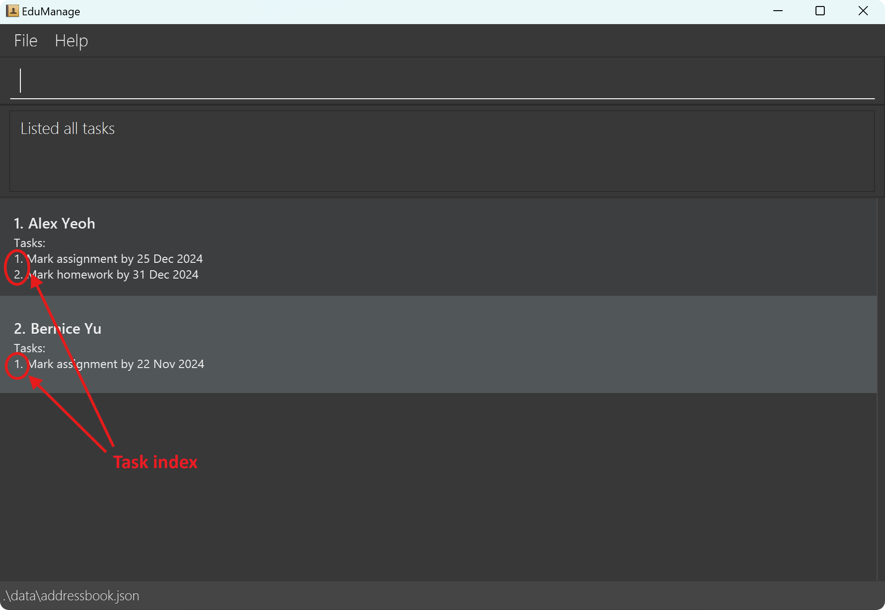

# EduManage User Guide

Welcome to the **EduManage User Guide** – your comprehensive resource for effectively managing student contacts and tasks as a tuition teacher.

This detailed guide will walk you through how to make the most of **EduManage** and unlock its full potential. We’re thrilled to help you streamline and organize your contact management process.
***

## Table of Contents

[1. Quick Start](#1-quick-start)

[2. Command Summary](#2-command-summary)
  * [2.1 Command Table](#2-1-command-table)
  * [2.2 Parameter Table](#2-2-parameter-table)
  * [2.3 Notes on the Command Format](#2-3-notes-on-the-command-format)

[3. Features](#3-features)
  * [3.1 Student Management](#3-1-student-management)
    * [3.1.1 Adding a Student: `add`](#3-1-1-adding-a-student-add)
    * [3.1.2 Deleting a Student: `delete`](#3-1-2-deleting-a-student-delete)
    * [3.1.3 Updating a Student: `update`](#3-1-3-updating-a-student-update)
    * [3.1.4 Finding Students: `find`](#3-1-4-finding-students-find)
    * [3.1.5 Listing All Students: `list`](#3-1-5-listing-all-students-list)
    * [3.1.6 Tagging a Student: `tag`](#3-1-6-tagging-a-student-tag)
    * [3.1.7 Recording Notes: `note`](#3-1-7-recording-notes-note)
    * [3.1.8 Viewing a Specific Student: `view`](#3-1-8-viewing-a-specific-student-view)
  * [3.2 Task Management](#3-2-task-management)
    * [3.2.1 Adding a Task: `addtask`](#3-2-1-adding-a-task-addtask)
    * [3.2.2 Deleting a Task: `deletetask`](#3-2-2-deleting-a-task-deletetask)
    * [3.2.3 Updating a Task: `updatetask`](#3-2-3-updating-a-task-updatetask)
    * [3.2.4 Viewing All Tasks: `viewtasks`](#3-2-4-viewing-all-tasks-viewtasks)
  * [3.3 Data Management](#3-3-data-management)
    * [3.3.1 Saving the Data](#3-3-1-saving-the-data)
    * [3.3.2 Editing the Data File](#3-3-2-editing-the-data-file)
    * [3.3.3 Clearing All Students: `clear`](#3-3-3-clearing-all-students-clear)
  * [3.4 Navigation](#3-4-navigation)
    * [3.4.1 Viewing Help: `help`](#3-4-1-viewing-help-help)
    * [3.4.2 Exiting EduManage: `exit`](#3-4-2-exiting-edumanage-exit)

[4. FAQ](#4-faq)

[5. Known Issues](#5-known-issues)

[6. Glossary Table](#6-glossary-table)

--------------------------------------------------------------------------------------------------------------------

## 1. Quick Start

1. Ensure you have [Java `17`](#6-glossary-table) or above installed in your computer.

2. Download the latest `.jar` file from [here](https://github.com/AY2425S1-CS2103T-W08-3/tp/releases).

3. Copy the file to the folder you want to use as the _home folder_ for EduManage.

4. Open a [command terminal](#6-glossary-table), `cd` into the folder you put the jar file in, and use the `java -jar EduManage.jar` command to run the application. 
   A [GUI](#6-glossary-table) similar to the below should appear in a few seconds. Note how the app contains some sample data. 

   
    
   
5. Type the command in the command box and press Enter to execute it. e.g., typing **`help`** and pressing Enter will open the help window. 
   Some example commands you can try:

   * `list` : Lists all students.

   * `add n/John Doe p/98765432 e/99999999 a/John street, block 123, #01-01` : Adds a student named `John Doe` to EduManage.

   * `delete 3` : Deletes the 3rd student shown in the current list.

   * `clear` : Deletes all students.

   * `exit` : Exits the app.

   * Refer to [Section 2.1 - Command Table](#2-1-command-table) for more examples.

6. Refer to [Section 3 - Features](#3-features) below for details of each command.

[(Back to Top)](#edumanage-user-guide)

--------------------------------------------------------------------------------------------------------------------

## 2. Command Summary

### 2.1 Command Table

| Index |                             Action                              |                                                        Format                                                        |                                               Example(s)                                               |
|:-----:|:---------------------------------------------------------------:|:--------------------------------------------------------------------------------------------------------------------:|:------------------------------------------------------------------------------------------------------:|
|   1   |           [Add a student](#311-adding-a-student-add)            |         `add n/NAME p/PHONE_NUMBER e/EMERGENCY_CONTACT a/ADDRESS [l/LEVEL] [s/SUBJECT]…​ [lt/LESSON_TIME]…​`         | `add n/James Ho p/98765432 e/93838420 a/311, Clementi Ave 2, #02-25 l/S1 NT s/MATH lt/SUN-11:00-13:00` |
|   2   |       [Delete a student](#312-deleting-a-student-delete)        |                                                    `delete INDEX`                                                    |                                               `delete 2`                                               |
|   3   |       [Update a student](#313-updating-a-student-update)        | `update NAME [n/NAME] [p/PHONE_NUMBER] [e/EMERGENCY_CONTACT] [a/ADDRESS] [l/LEVEL] [s/SUBJECT]…​ [lt/LESSON_TIME]…​` |                               `update Alex Yeoh n/James Lee e/99999999`                                |
|   4   |          [Find student(s)](#314-finding-students-find)          |                       `find n/NAME [NAME]…​` or `find l/LEVEL` or `find s/SUBJECT [SUBJECT]…​`                       |                         `find n/Alex David` or `find l/S2 NA` or `find s/MATH`                         |
|   5   |       [List all students](#315-listing-all-students-list)       |                                                        `list`                                                        |                                                 `list`                                                 |
|   6   |           [Tag a student](#316-tagging-a-student-tag)           |                                         `tag n/NAME [l/LEVEL] [s/SUBJECT]…​`                                         |                                    `tag n/John Doe l/S1 NT s/MATH`                                     |
|   7   |     [Record Note for a student](#317-recording-notes-note)      |                                                `note n/NAME nt/NOTE`                                                 |                            `note n/John Doe nt/Doing well in all subjects`                             |
|   8   | [View a specific student](#318-viewing-a-specific-student-view) |                                                    `view n/NAME`                                                     |                                           `view n/John Doe`                                            |
|   9   |      [Add Task for a student](#321-adding-a-task-addtask)       |                                 `addtask n/NAME t/TASK_DESCRIPTION d/TASK_DEADLINE`                                  |                          `addtask n/John Doe t/Mark assignment d/2024-12-25`                           |
|  10   |  [Delete Task for a student](#322-deleting-a-task-deletetask)   |                                          `deletetask n/NAME ti/TASK_INDEX`                                           |                                      `deletetask n/John Doe ti/1`                                      |
|  11   |  [Update Task for a student](#323-updating-a-task-updatetask)   |                       `updatetask n/NAME ti/TASK_INDEX [t/TASK_DESCRIPTION] [d/TASK_DEADLINE]`                       |                              `updatetask n/John Doe ti/2 t/Mark homework`                              |
|  12   |       [View all Tasks](#324-viewing-all-tasks-viewtasks)        |                                                     `viewtasks`                                                      |                                              `viewtasks`                                               |
|  13   |            [Clear](#333-clearing-all-students-clear)            |                                                       `clear`                                                        |                                                `clear`                                                 |
|  14   |                 [Help](#341-viewing-help-help)                  |                                                        `help`                                                        |                                                 `help`                                                 |
|  15   |               [Exit](#342-exiting-edumanage-exit)               |                                                        `exit`                                                        |                                                 `exit`                                                 |

***

### 2.2 Parameter Table

| Index |     Parameter     |                     Format                     | Constraints                                                                                                                                                                                                                                                                                                                                                                                                                                                                                                                                                                                                                                                 |
|:-----:|:-----------------:|:----------------------------------------------:|:------------------------------------------------------------------------------------------------------------------------------------------------------------------------------------------------------------------------------------------------------------------------------------------------------------------------------------------------------------------------------------------------------------------------------------------------------------------------------------------------------------------------------------------------------------------------------------------------------------------------------------------------------------|
|   1   |      Address      |                  `a/ADDRESS`                   | Can take any values, but should not be blank. Note that using reserved prefixes may cause an error.                                                                                                                                                                                                                                                                                                                                                                                                                                                                                                                                                         |
|   2   | Emergency Contact |             `e/EMERGENCY_CONTACT`              | Should only contain numbers, should be at least 3 digits long, and can be the same as phone number. International phone number formats (e.g., length greater than 8, different starting digits) are allowed.                                                                                                                                                                                                                                                                                                                                                                                                                                                |
|   3   |       Index       |                    `INDEX`                     | Should be a positive integer equal to or less than the size of the current displayed student list.                                                                                                                                                                                                                                                                                                                                                                                                                                                                                                                                                          |
|   4   |    Lesson Time    |                `lt/LESSON_TIME`                | Should be in format `DAY-STARTTIME-ENDTIME`, where:<ul><li>`DAY` is in: [MON, TUE, WED, THU, FRI, SAT, SUN].</li><li>`STARTTIME` and `ENDTIME` are in the format `HH:MM`, `HH` must be between 0 and 23 inclusive, `MM` must be between 0 and 59 inclusive.</li><li>`ENDTIME` must be later than `STARTTIME`.</li></ul>                                                                                                                                                                                                                                                                                                                                     |
|   5   |       Level       |                   `l/LEVEL`                    | Should be in the format `YEAR TRACK`, where:<ul><li>either:<ul><li>`YEAR` is one of: [S1, S2, S3, S4] and</li><li>`TRACK` is one of: [EXPRESS, NA, NT, IP].</li></ul><li>or:<ul><li>`YEAR` is S5 and</li><li>`TRACK` is NA.</ul></ul>                                                                                                                                                                                                                                                                                                                                                                                                                       |
|   6   |       Name        | `n/NAME` or `update NAME` or `find n/KEYWORDS` | Should only contain alphanumeric characters and spaces, and should not be blank. For commands other than `add n/NAME`, `update [n/NAME]` and `find n/KEYWORDS`, the provided name must match an existing student's name in EduManage. Refer to [Section 5 - Known Issues](#5-known-issues) for guidance on handling valid names that contain special characters.                                                                                                                                                                                                                                                                                            |
|   7   |       Note        |                   `nt/NOTE`                    | Can take any values, and can be blank. Note that using reserved prefixes may cause an error.                                                                                                                                                                                                                                                                                                                                                                                                                                                                                                                                                                |
|   8   |   Phone Number    |                `p/PHONE_NUMBER`                | Should only contain numbers, should be at least 3 digits long, and can be the same as emergency contact number. International phone number formats (e.g., length greater than 8, different starting digits) are allowed.                                                                                                                                                                                                                                                                                                                                                                                                                                    |
|   9   |      Subject      |                  `s/SUBJECT`                   | Should be valid for the given level: <ul><li>**Lower Secondary** (Level year is `S1` or `S2`): `MATH`, `SCIENCE`, `PHYSICS`, `CHEMISTRY`, `BIOLOGY`, `LITERATURE`, `HISTORY`, `GEOGRAPHY`, `SOCIAL_STUDIES`, `ENGLISH`, `CHINESE`, `HIGHER_CHINESE`, `MALAY`, `HIGHER_MALAY`, `TAMIL`, `HIGHER_TAMIL`, `HINDI`.</li><li>**Upper Secondary** (Level year is `S3`, `S4` or `S5`): `MATH`, `A_MATH`, `E_MATH`, `PHYSICS`, `CHEMISTRY`, `BIOLOGY`, `COMBINED_SCIENCE`, `ACCOUNTING`, `LITERATURE`, `HISTORY`, `GEOGRAPHY`, `SOCIAL_STUDIES`, `MUSIC`, `ART`, `ENGLISH`, `CHINESE`, `HIGHER_CHINESE`, `MALAY`, `HIGHER_MALAY`, `TAMIL`, `HIGHER_TAMIL`, `HINDI`. |
|  10   |   Task Deadline   |               `d/TASK_DEADLINE`                | Should be in the format `YYYY-MM-DD`. While any date can be chosen, it is recommended to stick to recent dates.                                                                                                                                                                                                                                                                                                                                                                                                                                                                                                                                             |
|  11   | Task Description  |              `t/TASK_DESCRIPTION`              | Can take any values, but should not be blank. Note that using reserved prefixes may cause an error.                                                                                                                                                                                                                                                                                                                                                                                                                                                                                                                                                         |
|  12   |    Task Index     |                `ti/TASK_INDEX`                 | Should be a positive integer equal to or less than the size of the specified student's task list.                                                                                                                                                                                                                                                                                                                                                                                                                                                                                                                                                           |

***

### 2.3 Notes on the Command Format

<box type="info" seamless>

* Words in `UPPER_CASE` are the parameters to be supplied by the user. 
  e.g., in `add n/NAME`, `NAME` is a parameter which can be used as `add n/John Doe`.

* Please avoid using the following reserved prefixes in parameters: `a/`, `e/`, `lt/`, `l/`, `n/`, `nt/`, `p/`, `s/`, `d/`, `t/`, `ti/`.
  Using these may sometimes result in unexpected behavior or errors.

* Names with multiple spaces are treated as if they contain a single space, and names are not case-sensitive. 
  e.g., `alex yeoh` and `Alex  yeoh ` are the same as `Alex Yeoh`.

* Overlapping lesson times will not be merged to provide flexibility for multiple schedules. 
  e.g., `lt/MON-15:00-17:00` and `lt/MON-16:00-18:00` will remain as separate entries.

* During comparison, addresses, task descriptions and notes with multiple spaces are treated as if they contain a single space, and comparison is not case-sensitive. 
  e.g., `nt/Test  1` and `nt/  TeST 1` are treated as the same.

* Items in square brackets are optional. 
  e.g., `n/NAME [s/SUBJECT]` can be used as `n/John Doe s/MATH` or as `n/John Doe`.

* Items with `…`​ after them can be used multiple times including zero times. 
  e.g., `[s/SUBJECT]…​` can be used as ` ` (i.e. 0 times) or `s/MATH` or `s/MATH s/PHYSICS` etc. 
  e.g., `[lt/LESSON_TIME]…​` can be used as ` ` (i.e. 0 times) or `lt/SUN-11:00-13:00` or `lt/SUN-11:00-13:00 lt/WED-17:00-19:00` etc.

* Parameters can be in any order. 
  e.g., if the command specifies `n/NAME p/PHONE_NUMBER`, `p/PHONE_NUMBER n/NAME` is also acceptable.

* Extraneous parameters for commands that do not take in parameters (such as `list`, `viewtasks`, `clear`, `help` and `exit`) will be ignored. 
  e.g., if the command specifies `help 123`, it will be interpreted as `help`.

* If you are using a PDF version of this document, be careful when copying and pasting commands that span multiple lines as space characters surrounding line-breaks may be omitted when copied over to the application.
  </box>

[(Back to Top)](#edumanage-user-guide)

--------------------------------------------------------------------------------------------------------------------

## 3. Features

### 3.1 Student Management

#### 3.1.1 Adding a Student: `add`

Adds a student to EduManage.

**Format:** `add n/NAME p/PHONE_NUMBER e/EMERGENCY_CONTACT a/ADDRESS [l/LEVEL] [s/SUBJECT]…​ [lt/LESSON_TIME]…​`
* A level must be assigned to a student either in the same command or in an earlier command before they can be assigned a subject.
* Lesson times across all students and within each student's schedule are allowed to overlap to accommodate different schedules on alternate weeks.

<box type="tip" seamless>

**Tip:** A student can have any number of subjects and lesson times (including 0).
</box>

**Examples:**
* `add n/John Doe p/98765432 e/99999999 a/John street, block 123, #01-01`
* `add n/Betsy Crowe s/MATH e/88888888 a/Newgate Prison p/1234567 l/S1 NA s/ENGLISH lt/SAT-11:00-13:00 lt/SAT-11:30-13:30`

***

#### 3.1.2 Deleting a Student: `delete`

Deletes the specified student from EduManage.

**Format:** `delete INDEX`

* Deletes the student at the specified `INDEX`.
* The index refers to the index number shown in the displayed student list.
* The index **must be a positive integer** 1, 2, 3, …​ .

**Examples:**
* `list` followed by `delete 2` deletes the 2nd student in EduManage.
* `find n/Betsy` followed by `delete 1` deletes the 1st student in the results of the `find` command.

***

#### 3.1.3 Updating a Student: `update`

Updates the details of an existing student in EduManage.

**Format:** `update NAME [n/NAME] [p/PHONE_NUMBER] [e/EMERGENCY_CONTACT] [a/ADDRESS] [nt/NOTE] [l/LEVEL] [s/SUBJECT]…​ [lt/LESSON_TIME]…​`

* Updates the student with the specified `NAME`. The name refers to the full name shown in the displayed student list.
* At least one of the optional fields must be provided.
* Existing values will be updated to the input values.
* A level must be assigned to a student either in the same command or in an earlier command before they can be assigned a subject.
* Lesson times across all students and within each student's schedule are allowed to overlap to accommodate different schedules on alternate weeks.

<box type="warning" seamless>

**Caution:**
When updating a note, subjects or lesson times, the existing note, subjects or lesson times of the student will be replaced i.e. updating of note, subjects or lesson times is not cumulative.
</box>

<box type="tip" seamless>

**Tips:**
* To remove a note for a student, simply type `nt/` without adding any text after it.
* To remove all the student’s subjects, simply type `s/` without specifying any subjects after it.
* To remove all the student’s lesson times, simply type `lt/` without specifying any lesson times after it.
</box>

**Examples:**
* `update Alex Yeoh p/91234567 e/99999999` updates the phone number and emergency contact of `Alex Yeoh` to be `91234567` and `99999999` respectively.
* `update Alex Yeoh n/Betsy Crower s/` updates the name of `Alex Yeoh` to be `Betsy Crower` and clears all existing subjects.
* `update Alex Yeoh lt/` clears all existing lesson times for `Alex Yeoh`.

***

#### 3.1.4 Finding Students: `find`

Find students by either their name, level or subject(s).

**Format:**
1. `find n/NAME [NAME]…​`
1. `find l/LEVEL`
1. `find s/SUBJECT [SUBJECT]…​`

* The search is case-insensitive and treats multiple spaces as one space. e.g., `hans` will match `Hans` and `s2   nt` will match `S2 NT`.
* For name and subject searches, the order of the keywords does not matter. e.g., `Hans Bo` will match `Bo Hans`.
* For name and subject searches, students matching at least one keyword will be returned (i.e. `OR` search).
  e.g., `Hans Bo` will return `Hans Gruber`, `Bo Yang`.
  e.g., `MATH CHEMISTRY` will return students with `MATH` or `CHEMISTRY`.

**Examples:**
* `find n/John` returns `john` and `John Doe`.
* `find l/S3 NA` returns all students tagged with level `S3 NA`.
* `find s/MATH` returns all students tagged with subject `MATH`.
* `find s/Math chemistry` returns all students tagged with subjects `MATH` or `CHEMISTRY`.
* `find n/alex david` returns `Alex Yeoh`, `David Li`. 
  

***

#### 3.1.5 Listing All Students: `list`

Shows a list of all students in EduManage.

**Format:** `list`

***

#### 3.1.6 Tagging a Student: `tag`

Allows tagging a student by their level and subject. A student must have a level assigned before they can be tagged with a subject.

**Format:** `tag n/NAME [l/LEVEL] [s/SUBJECT]…​`

<box type="warning" seamless>

**Caution:** Tagging with only subject(s) will only work if the student has a level assigned previously. Additionally,
the subject(s) tagged must be valid for the previously assigned level.

</box>

<box type="tip" seamless>

**Tips:** 
* To tag multiple subjects, use the format `s/FIRST_SUBJECT s/SECOND_SUBJECT …​`.
* To clear all existing level and subject tags, use `l/NONE NONE`.
</box>

**Examples:**
* `tag n/John Doe l/S3 NA s/ENGLISH`
* `tag n/Jane Smith s/MATH` only works if `Jane Smith` has a level assigned previously.
* `tag n/Alex Yeoh l/S4 IP s/A_MATH s/ E_MATH`

***

#### 3.1.7 Recording Notes: `note`

Records a note for the specified student.

**Format:** `note n/NAME nt/NOTE`

<box type="warning" seamless>

**Caution:**
When updating a note, the existing note of the student will be replaced i.e. updating of note is not cumulative.
</box>

<box type="tip" seamless>

**Tip:** To remove a note for a student, simply type `nt/` without adding any text after it.
  </box>

**Examples:**
* `note n/John Doe nt/Doing well in all subjects`
* `note n/Jane Smith nt/Struggling with trigonometry`

***

#### 3.1.8 Viewing a Specific Student: `view`

Views a specific student on the right side window.

**Format:** `view n/NAME`

<box type="tip" seamless>

**Tip:** If fields like name, note or address are too long and get cut off in the main student view, use this `view` command to see the fields in full.
</box>

**Examples:**
* `view n/Alex Yeoh`

  

[(Back to Top)](#edumanage-user-guide)

***

### 3.2 Task Management

#### 3.2.1 Adding a Task: `addtask`

Adds a task to the task list of the specified student.

**Format:** `addtask n/NAME t/TASK_DESCRIPTION d/TASK_DEADLINE`

* Deadline must be a valid date in the format of `YYYY-MM-DD`.
* While any date can be chosen, it is recommended to stick to recent dates.

**Examples:**
* `addtask n/John Doe t/Mark assignment d/2024-12-25`
* `addtask n/Jane Smith t/Handle MC d/2024-02-13`

***

#### 3.2.2 Deleting a Task: `deletetask`

Deletes a task from the specified student's task list.

**Format:** `deletetask n/NAME ti/TASK_INDEX`
* The task index refers to the index number shown in the student's task list, as circled in red in the picture below.
* The task index **must be a positive integer** 1, 2, 3, …​ .

  

**Examples:**
* `deletetask n/John Doe ti/1`

***

#### 3.2.3 Updating a Task: `updatetask`

Updates the details of an existing task in a student's task list.

**Format:** `updatetask n/NAME ti/TASK_INDEX [t/TASK_DESCRIPTION] [d/TASK_DEADLINE]`
* The task index refers to the index number shown in the student's task list, as specified for `deletetask`.
* The task index **must be a positive integer** 1, 2, 3, …​ .
* At least one of the optional fields must be provided.
* Existing values will be updated to the input values.
* While any date can be chosen, it is recommended to stick to recent dates.

**Examples:**
* `updatetask n/John Doe ti/2 t/Mark homework` updates the 2nd task in John Doe's task list to be `Mark homework`.
* `updatetask n/Jane Smith ti/1 t/Handle MC d/2024-10-13` updates the 1st task in Jane Smith's task list to be `Handle MC` with a deadline `2024-10-13`.

***

#### 3.2.4 Viewing All Tasks: `viewtasks`

Views all tasks, organized by student.

**Format:** `viewtasks`

[(Back to Top)](#edumanage-user-guide)

***

### 3.3 Data Management

#### 3.3.1 Saving the Data

EduManage data are saved in the hard disk automatically after any command that changes the data. There is no need to save manually.

***

#### 3.3.2 Editing the Data File

EduManage data are saved automatically as a [JSON file](#6-glossary-table) `[JAR file location]/data/addressbook.json`. Users are not advised to edit the data file directly.

<box type="warning" seamless>

**Caution:**
If your changes to the data file makes its format invalid, EduManage will discard all data and start with an empty data file at the next run.  Hence, it is recommended to take a backup of the file before editing it. 
Furthermore, certain edits can cause the EduManage to behave in unexpected ways (e.g., if a value entered is outside the acceptable range). Therefore, edit the data file only if you are confident that you can update it correctly.
</box>

***

#### 3.3.3 Clearing All Students: `clear`

Clears all students from EduManage.

**Format:** `clear`

<box type="warning" seamless>

**Caution:**
This action is irreversible and will permanently delete all students from EduManage. Ensure that you have backed up any important data before proceeding.
</box>

[(Back to Top)](#edumanage-user-guide)

***

### 3.4 Navigation

#### 3.4.1 Viewing Help: `help`

Shows a message explaining how to access the help page.

**Format:** `help`

  

***

#### 3.4.2 Exiting EduManage: `exit`

Exits EduManage.

**Format:** `exit`

[(Back to Top)](#edumanage-user-guide)

--------------------------------------------------------------------------------------------------------------------

## 4. FAQ

**Q**: How do I transfer my data to another computer? 
**A**: Install the app in the other computer and overwrite the empty data file it creates with the file that contains the data of your previous EduManage home folder.

[(Back to Top)](#edumanage-user-guide)

--------------------------------------------------------------------------------------------------------------------

## 5. Known Issues

1. **When using multiple screens**, if you move the application to a secondary screen, and later switch to using only the primary screen, the [GUI](#6-glossary-table) will open off-screen. The remedy is to delete the `preferences.json` file (found in the same folder as `EduManage.jar`) created by the application before running the application again.
2. **If you minimize the Help Window** and then run the `help` command (or use the `Help` menu, or the keyboard shortcut `F1`) again, the original Help Window will remain minimized, and no new Help Window will appear. The remedy is to manually restore the minimized Help Window.
3. **Names** with special characters such as `/` and `,` are not allowed. As such, valid names such as `Aditi D/O Ramesh`
    and `Tan Jun Wei, Justin` will be considered invalid. To work around this issue, we recommend simply omitting the
    special character(s) or adding a space (e.g., `Aditi D O Ramesh`, `Tan Jun Wei Justin`). This restriction does not apply for less restrictive
    parameters, such as task description and note.
4. Long inputs for fields such as name, note and address may get cut off even if window is fully maximized. To view the full content,
   use the `view` command.

[(Back to Top)](#edumanage-user-guide)

--------------------------------------------------------------------------------------------------------------------

## 6. Glossary Table

|       Term       | Definition                                                                                                                                                                                                             |
|:----------------:|:-----------------------------------------------------------------------------------------------------------------------------------------------------------------------------------------------------------------------|
| Command terminal | A command-line interface (such as `Command Prompt` that allows users to interact with the computer by typing text commands.                                                                                            |
|    Java `17`     | The version of the Java programming language and development kit used to build EduManage. Download it [here](https://www.oracle.com/java/technologies/downloads/#java17).                                              |
|       GUI        | Graphical User Interface (GUI); a visual interface that displays graphical elements (such as buttons, icons, and menus) to help users interact with the application, as opposed to a text-only command-line interface. |
|    JSON file     | A text file that stores data in JavaScript Object Notation (JSON) format, which uses key-value pairs to organize information in a structured, readable way. Commonly used for data exchange between applications.      |

[(Back to Top)](#edumanage-user-guide)
