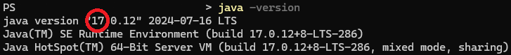
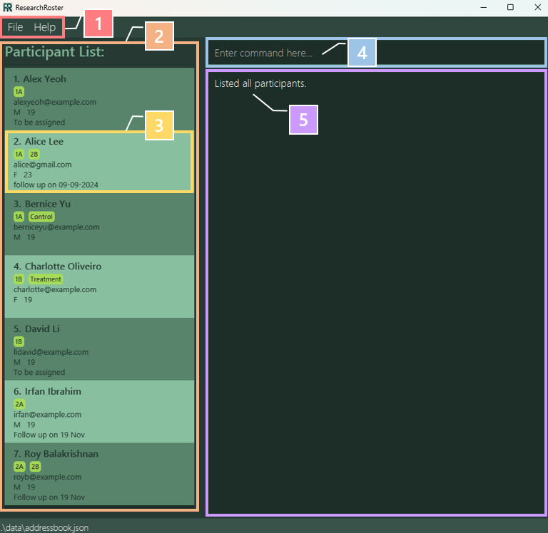
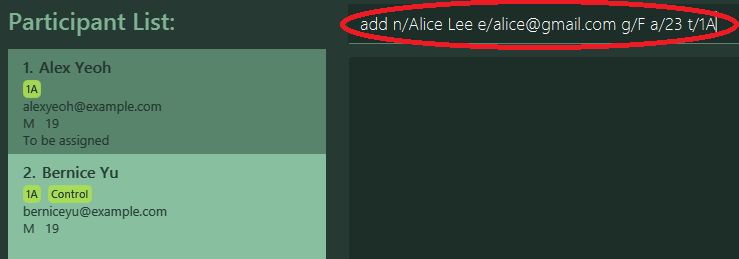
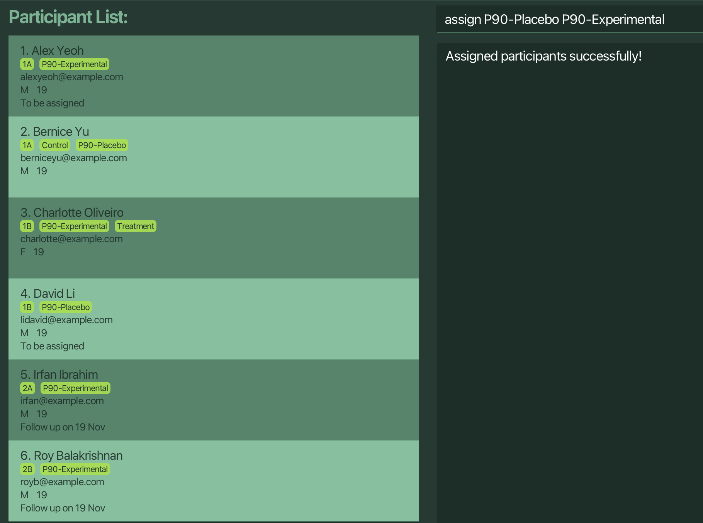
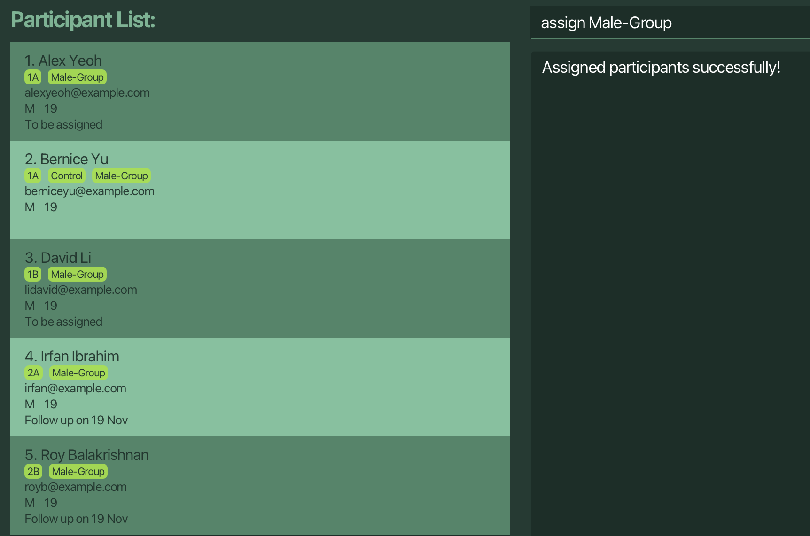

Welcome to ResearchRoster! **Your Research, Simplified.**

Designed with researchers in mind. ResearchRoster simplifies participant management so you can focus on what matters most: your research. Easily add and delete participants as required, conduct random study group assignment with a simple command, and export contacts for seamless communication.

This user guide will walk you through:
- [Setting up](#quick-start) your ResearchRoster application​

- Familiarising with the [Graphical User Interface (GUI)](#introduction-to-the-gui) and [Command Line Interface (CLI)​](#cli-tutorial)

- Learning [different commands available](#features) on the application​

- Utilizing [advanced commands](#advanced-commands) like Sample Assignment and Filtering​

By the end of this guide, you'll be a ResearchRoster pro, saving time and streamlining your research process.​

--------------------------------------------------------------------------------------------------------------------

* Table of Contents
{:toc}

--------------------------------------------------------------------------------------------------------------------

## Quick start

### Installation

1. Download the `.jar` file of the latest release, from [here](https://github.com/AY2425S1-CS2103T-F08-2/tp/releases).

2. Move the `.jar` file into an empty folder.

3. Open a command window in that folder.
    3.1 Right-click on the folder.
    3.2 For _Windows_: Select `Open in Terminal`.
    &ensp;&ensp;&ensp;&nbsp;For _MacOS_: Select `Services` > `New Terminal at Folder`.

4. Ensure that _Java 17_ is installed in your computer.
    4.1 Type in `java –version`.
    4.2 Press `Enter` to run the command.
    4.3 Check the installed Java version, as circled below:
    

5. Run ResearchRoster!
    5.1 Type in `java -jar "researchroster.jar"`.
    5.2 Press `Enter` to run the command.

### Introduction to the GUI

Upon running ResearchRoster, a GUI similar to below should be displayed.

1. **Tabs**: Provides access to file options and help.
2. **Participant List**: Shows a contact list of participants.
3. **Participant Card**: Displays detailed information for a specific participant.
4. **Command Box**: Enter user commands here.
5. **Output Box**: Shows feedback messages after each command.

:bulb: **Tip:**
ResearchRoster provides sample data upon first run.

### CLI Tutorial

1. Type your desired command into the command box, as circled below.
    

2. Press `Enter` to execute the command.

Below are some example commands for you to try out!

* `help`: Opens the help window.
* `add n/Alice Lee e/alice@gmail.com g/F a/23 t/1A`: Adds a contact of the specified participant to the address book.
* `delete 3`: Deletes the 3rd contact displayed in the list.
* `list`: Lists all contacts.
* `exit`: Exits ResearchRoster.

_Refer to the [Features](#features) section for details of each command!_

--------------------------------------------------------------------------------------------------------------------

## Features

#### Basic Commands
  * [Viewing help : `help`](#viewing-help--help)
  * [Adding a person: `add`](#adding-a-person-add)
  * [Listing all persons : `list`](#listing-all-persons--list)
  * [Editing a person : `edit`](#editing-a-person--edit)
  * [Deleting persons : `delete`](#deleting-persons--delete)
  * [Exiting the program : `exit`](#exiting-the-program--exit)

#### Advanced Commands
  * [Locating persons by criteria: `find`](#locating-persons-by-criteria-find)
  * [Clearing listed persons : `clear`](#clearing-listed-persons--clear)
  * [Exporting persons' emails : `export`](#exporting-persons-emails--export)
  * [Assigning persons to Study Groups (randomly) : `assign`](#assigning-persons-to-study-groups-randomly--assign)

**:information_source: Notes about the command format:** 

* Words in `UPPER_CASE` are the parameters to be supplied by the user. 
  e.g. in `add n/NAME`, `NAME` is a parameter which can be used as `add n/John Doe`.

* Items in square brackets are optional. 
  e.g `n/NAME [t/STUDY_GROUP_TAG]` can be used as `n/John Doe t/1A` or as `n/John Doe`.

* Items with `…` after them can be used multiple times including zero times. 
  e.g. `[t/STUDY_GROUP_TAG]…` can be used as ` ` (i.e. 0 times), `t/1A`, `t/1B t/Control` etc.

* Parameters can be in any order. 
  e.g. if the command specifies `n/NAME e/EMAIL`, `e/EMAIL n/NAME` is also acceptable.

* Extraneous parameters for commands that do not take in parameters (such as `help`, `list`, `exit` and `clear`) will be ignored. 
  e.g. if the command specifies `help 123`, it will be interpreted as `help`.

* If you are using a PDF version of this document, be careful when copying and pasting commands that span multiple lines as space characters surrounding line-breaks may be omitted when copied over to the application.

### Viewing help : `help`

Shows a popup window with a clickable link to the User Guide.

Format: `help`

### Adding a person : `add`

Adds a person to the address book.

Format: `add n/NAME e/EMAIL g/GENDER a/AGE [d/DETAIL] [t/STUDY_GROUP_TAG]…`

* Email, gender and study group tags are **case-insensitive**
* Valid entries for gender are M/m/F/f
* Age must be a non-negative integer between 0 and 150 (both inclusive)
* Two contacts are considered **duplicates** if they share the same **email** address

Examples:
* `add n/John Doe e/johnd@example.com g/M a/30 d/to be assigned t/1A t/2B`
* `add n/Betsy Crowe e/betsycrowe@example.com g/F a/40`

### Listing all persons : `list`

Shows a list of all persons in the address book.

Format: `list`

### Editing a person : `edit`

Edits an existing person in the address book.

Format: `edit INDEX [n/NAME] [e/EMAIL] [g/GENDER] [a/AGE] [t/ADD_TAG]… [-t/DELETE_TAG]…`

* Edits the person at the specified `INDEX`. The index refers to the index number shown in the displayed person list.
* The index **must be a positive integer** 1, 2, 3, …
* At least one of the optional fields must be provided.
* When editing tags:
  * Prefix:`[t/ADD-TAG]`
    - the added tags will be **appended** to the list of existing tags i.e adding of tags does not overwrite existing tags.
    - if the tag name you entered to add **already exists**, the edit will be successful but you will get the warning:
      `You tried adding an already existing study group tag.`
  * Prefix: `[-t/DELETE-TAG]`
    - the tags specified will be **deleted** from the list of existing tags.
    - if the tag name you entered to delete **does not exist**, the edit will be successful but you will get the warning:
      `You tried removing a nonexistent study group tag.`
* When editing **all other fields** : Existing values will be updated to the input values.

Examples:
*  `edit 1 a/29 e/johndoe@example.com` Edits the age and email address of the 1st person to be `29` and `johndoe@example.com` respectively.
*  `edit 2 n/Betsy Crower t/1B -t/2B` Edits the name of the 2nd person to be `Betsy Crower`, adds a new tag `1B` and deletes existing tag `2B`

### Deleting persons : `delete`

Deletes the specified persons from the address book.

Format: `delete [INDEX | INDEX-INDEX]…`

* Deletes the person at the specified `INDEX` or range of indices
* The index must be within the range
* When using ranges, ensure there are **no spaces** around the hyphen (e.g., `1-5` is valid, while `1 - 5` is not).

Examples:
* `delete 2` deletes the 2nd person in the displayed list.
* `find n/Betsy` followed by `delete 1` deletes the 1st person in the results of the [`find` command](#locating-persons-by-criteria-find).
* `delete 1 3 5-7` deletes the 1st, 3rd, 5th, 6th and 7th person in the displayed list.

### Exiting the program : `exit`

Displays an exit message, then exits the program.

Format: `exit`

### Locating persons by criteria : `find`

Finds persons whose fields contain the given keywords.

Format: `find [n/NAME …] [e/EMAIL …] [g/GENDER …] [a/AGE …] [d/DETAIL …] [t/STUDY_GROUP_TAGS …]`

* At least one of the optional criteria must be provided.
* Each criteria can have more than one keyword. e.g. `n/alice bob hans`
* The search is case-insensitive. e.g. `n/hans` will match `Hans`
* The order of the keywords does not matter. e.g. `n/Hans Bo` will match `Bo Hans`
* Only full words will be matched e.g. `n/Han` will not match `Hans`
* Persons matching at least one keyword for **every specified criteria** will be returned.
  e.g. `n/Alice Bob g/f` will return `{Alice Wang, …, Female, …}` person but not `{Bob Tan, …, Male, …}` person

Examples:
* `find n/John` returns `john` and `John Doe`
* `find n/roy li alex e/example.com g/m t/1A 1B 2B` returns records for `Alex Yeoh`, `David Li` and `Roy Balakrishnan` 
  

* `find a/30 40 50-60` returns all persons who are either `30`, `40`, or whose ages are `between 50 and 60`

### Clearing listed persons : `clear`

Clears current listed persons from the address book.

Format: `clear` and then `confirm`

* `clear` prompts user for confirmation to clear. To confirm clearing, type `confirm`.
* Clearing a filtered list of persons will clear only those filtered persons from the address book.
* To clear the entire address book, ensure the persons list is unfiltered.

Examples:
* `list` followed by `clear` then `confirm` clears the entire address book.
* `find g/f` followed by `clear` then `confirm` clears only female persons.

### Exporting persons' emails : `export`

Exports the current listed persons' emails to a .txt file.

Format: `export FILENAME`

* Exports the current listed persons' emails to a .txt file with the specified filename.
* Filepath can be specified by the user.
* `FILENAME` should only have alphanumeric characters, `_` and `/`.
* If the specified file already exists, a copy will be created for the new export.

Examples:
* `export data/MyEmailsList` exports current listed persons' emails to `MyEmailsList.txt` in the `data` directory.
* `find g/f` followed by `export female_emails` exports only the emails of female persons.
* If `MyExport.txt` already exists, `export MyExport` exports the emails to `MyExport(1).txt`.

### Assigning persons to Study Groups (randomly) : `assign`

Assigns persons in the list to given Study Groups (randomly).

Format: `assign STUDY_GROUP [STUDY_GROUP …]`

* Randomly assigns persons in the displayed list to the given `STUDY_GROUP`s.
* No person in the displayed list can be tagged with any of the given study group name before assigning.
* Input study group names must not have duplicates.

Examples:
* `list` followed by `assign P90-Placebo P90-Experimental` assigns every person in the addressbook to either `P90-Placebo` or `P90-Experimental` study group, but not both. 
  

* `find g/M` followed by `assign Male-Group` assigns every male in the addressbook to `Male-Group` study group. 
  

### Saving the data

ResearchRoster data is saved in the hard disk automatically after any command that changes the data. There is no need to save manually.

### Editing the data file

ResearchRoster data is saved automatically as a JSON file `[JAR file location]/data/addressbook.json`. Advanced users are welcome to update data directly by editing that data file.

:exclamation: **Caution:**
If your changes to the data file makes its format invalid, ResearchRoster will discard all data and start with an empty data file at the next run. Hence, it is recommended to take a backup of the file before editing it. 
Furthermore, certain edits can cause the ResearchRoster to behave in unexpected ways (e.g., if a value entered is outside of the acceptable range). Therefore, edit the data file only if you are confident that you can update it correctly.

### Archiving data files `[coming in v2.0]`

_Details coming soon ..._

--------------------------------------------------------------------------------------------------------------------

## FAQ

**Q**: How do I transfer my data to another Computer? 
**A**: Install the app in the other computer and overwrite the empty data file it creates with the file that contains the data of your previous AddressBook home folder.

--------------------------------------------------------------------------------------------------------------------

## Known issues

1. **When using multiple screens**, if you move the application to a secondary screen, and later switch to using only the primary screen, the GUI will open off-screen. The remedy is to delete the `preferences.json` file created by the application before running the application again.
2. **If you minimize the Help Window** and then run the `help` command (or use the `Help` menu, or the keyboard shortcut `F1`) again, the original Help Window will remain minimized, and no new Help Window will appear. The remedy is to manually restore the minimized Help Window.

--------------------------------------------------------------------------------------------------------------------

## Command summary

Action | Format, Examples
--------|------------------
**Help** | `help`
**Add** | `add n/NAME e/EMAIL g/GENDER a/AGE [d/DETAIL] [t/STUDY_GROUP_TAG]…`  e.g., `add n/James Ho e/jamesho@example.com g/M a/30 d/to be assigned  t/1A t/3C`
**List** | `list`
**Edit** | `edit INDEX [n/NAME] [e/EMAIL] [g/GENDER] [a/AGE] [t/ADD_TAG]… [-t/DELETE_TAG]…`  e.g., `edit 2 n/James Lee e/jameslee@example.com t/1A t/1B`
**Delete** | `delete [INDEX | INDEX-INDEX]…`  e.g., `delete 3 6 10-15 20 30-40`
**Find** | `find [n/NAME …] [e/EMAIL …] [g/GENDER …] [a/AGE …] [d/DETAIL …] [t/STUDY_GROUP_TAGS …]`  e.g., `find n/James Jake`
**Clear** | `clear` then `confirm`
**Export** | `export FILENAME`  e.g., `export exported_email`
**Assign** | `assign STUDY_GROUP [STUDY_GROUP …]`  e.g., `assign P90-Control P90-Experiment`
