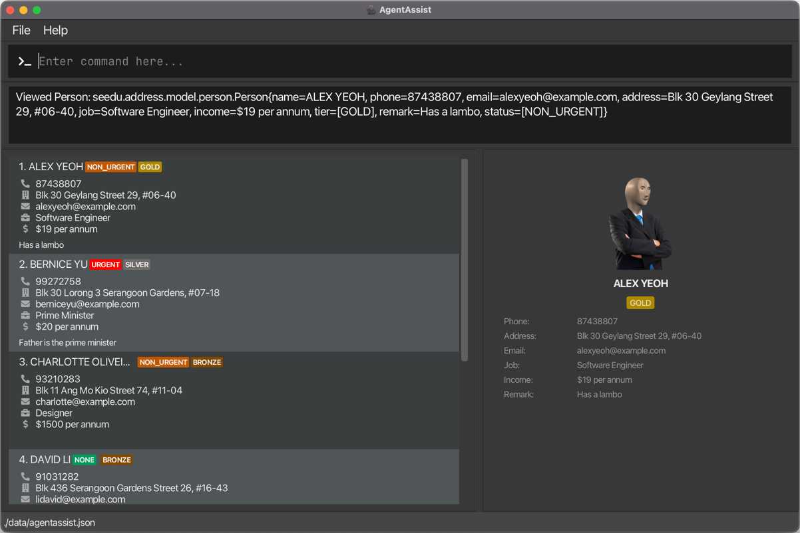

# Welcome to the AgentAssist User Guide!

The **AgentAssist User Guide** is here to help you unlock the full potential of **AgentAssist** and take your credit card sales to the next level. This guide offers clear, step-by-step instructions and practical examples to help you get the most out of the application.

In this guide, you'll learn how to:
* **Set Up AgentAssist**
* **Navigate and Use Key Features** like contact management, filtering, and more.
* **Optimize Your Workflow** with shortcuts, data export/import, and automatic saving.

Let’s begin and get you up to speed with AgentAssist!

--------------------------------------------------------------------------------------------------------------------

<div style="page-break-after: always;"></div>

# Table of Contents

1. [Introduction](#1-introduction)
2. [Important Prerequisites](#2-important-prerequisites)
3. [Getting Started](#3-getting-started)
   - 3.1 [Installation](#31-installation)
   - 3.2 [Graphical User Interface (GUI) Layout](#32-graphical-user-interface-gui-layout)
4. [Understanding Commands in AgentAssist](#4-understanding-commands-in-agentassist)
   - 4.1 [Command Structure Overview](#41-command-structure-overview)
   - 4.2 [Commands](#42-commands)
   - 4.3 [Flags](#43-flags)  
   - 4.4 [Arguments](#44-arguments)
   - 4.5 [Using Commands](#45-using-commands)
5. [Commands](#5-commands)
   - 5.1 [How to Read Commands](#51-how-to-read-commands)  
   - 5.2 [Data Modification Commands](#52-data-modification-commands)  
   - 5.3 [Data Filtering Commands](#53-data-filtering-commands)
   - 5.4 [General Commands](#54-general-commands)
   - 5.5 [Saving Data](#55-saving-data)
   - 5.6 [Modifying the Data File](#56-modifying-the-data-file)
6. [FAQ](#6-faq)
7. [Known Issues](#7-known-issues)
8. [Command Summary](#8-command-summary)

<div style="page-break-after: always;"></div>

# 1. Introduction
## 1.1 What is AgentAssist?

AgentAssist is the **definitive desktop tool for credit card sales agents**. Merging the swift efficiency of a Command Line Interface (CLI) with the intuitive accessibility of a Graphical User Interface (GUI), this application lets you manage contact databases, track sales progress, and execute transactions with unprecedented speed.

**Overview of Key Features:**
* **Contact Management**:
    * Manage your client details easily. Add, edit, and delete contacts to keep all your client information in one accessible place.
* **Keyboard-centric Navigation**:
    * Navigate through the application entirely via keyboard shortcuts, improving workflow efficiency.
* **Multi-Level Filtering**:
    * Filter your data by multiple criteria to find exactly who you’re looking for.
* **Auto-Save**:
    * Automatically saves your work as you go, ensuring data is updated without manual intervention.
* **Effortless Data Import & Export**:
    * Import or export client and sales data in compatible formats for backups or use in other systems.

Maximize your productivity, minimize your response time, and amplify your sales performance. With AgentAssist, you're not just keeping up with the competitive world of credit card sales — _you're setting the pace_.

[↑ Return to Table of Contents](#table-of-contents)

--------------------------------------------------------------------------------------------------------------------

<div style="page-break-after: always;"></div>

# 2. Important Prerequisites

Before you start using AgentAssist, there are a few prerequisites to ensure you get the most out of the application:

### Familiarity with Keyboard Navigation
AgentAssist is designed to enhance speed and efficiency, with a strong focus on **keyboard-based navigation**. While the application includes a Graphical User Interface (GUI), its full potential is unlocked when you use **keyboard commands**. Therefore, it is important to:

- Familiarize yourself with basic `Command Line Interface (CLI)` commands if you haven't already. This will make it easier to use AgentAssist’s command system effectively.
- Know common keyboard shortcuts (e.g., `Enter`, `Arrow keys`, etc.).

### Basic Understanding of Data Fields
AgentAssist allows you to manage client data like names, phone numbers, emails, and job information. A basic understanding of these data fields will make it easier to add, edit, and filter client information.

🎉 **By meeting these prerequisites, you'll be ready to make the most of AgentAssist’s fast, keyboard-driven interface and powerful data management features.** 🎉

[↑ Return to Table of Contents](#table-of-contents)

--------------------------------------------------------------------------------------------------------------------
<div style="page-break-after: always;"></div>

# 3. Getting Started
Welcome to AgentAssist. Here’s how to get up and running quickly and easily.

## 3.1 Installation
### Step 1: Install Java

Ensure you have **Java 17** installed on your computer. AgentAssist is optimized for **Java 17**, and using other versions may affect performance or functionality. If you already have Java 17 installed, you can skip this step.

To install Java 17:
* Visit the Java download page from [Oracle](https://www.oracle.com/java/technologies/downloads/#java17?er=221886).
* Download the appropriate installer for your operating system (Windows, macOS, or Linux).
* Follow the installation instructions on the website to complete the setup.
* Once installed, verify the installation by [opening your terminal (or command prompt)](#step-4-run-the-application) and typing:
    ```
    java -version
    ```
* If you see Java 17 in the output, you’re good to go!

### Step 2: Download the AgentAssist application

Download the latest version of the `.jar` file from the AgentAssist [repository](https://github.com/AY2425S1-CS2103T-T14-4/tp/releases).

[comment]: # (TODO: Add image of GitHub Releases page with annotations to show user the file to install.)

### Step 3: Choose a Folder

Find or create a folder on your computer where you want to store the AgentAssist application and its data. Move the .jar file you downloaded into this folder.

### Step 4: Run the Application

1. **Open a command terminal**
    - **Windows**: press `Windows Key + R`, type `cmd`, and press `Enter`.
    - **macOS**: press `Command + Space`, type `Terminal`, and press `Enter`.
    - **Linux**: open your **Terminal** application from the system menu.


2. **Navigate your terminal to the folder where you saved the AgentAssist application:**
    - In the terminal, type: `cd <folder path>` and press **Enter**. (Replace <folder path> with the actual location of AgentAssist.)
    - For example, if **AgentAssist** is stored in your **Downloads** folder:
       - **Windows**: `cd C:\Users\<YourUsername>\Downloads`
       - **macOS/Linux**: `cd /Users/<YourUsername>/Downloads`


3. **Run the application:**
    - In the terminal, type: `java -jar agentassist.jar` and press **Enter**.
    - After a few seconds, a window similar to the below image should appear. This is the AgentAssist interface, with sample contact information already loaded for you to explore.<br>
      


4. 🎉 **Congratulations! AgentAssist is now up and running!** 🎉  
   You're all set to start using AgentAssist to manage your client contacts, track your sales, and boost your productivity.

<div style="page-break-after: always;"></div>

## 3.2 Graphical User Interface (GUI) Layout



To learn more about how to use commands in AgentAssist, proceed to the next section.

[↑ Return to Table of Contents](#table-of-contents)

--------------------------------------------------------------------------------------------------------------------

<div style="page-break-after: always;"></div>

# 4. Understanding Commands in AgentAssist

The true power of **AgentAssist** lies in efficiently using commands. Before diving into specific commands, let’s break down the basic structure of a command.

## 4.1 Command Structure Overview
Each command in AgentAssist consists of three key components: the **command**, **flag(s)**, and **argument(s)**.

Let's take a look at the structure in more detail:

| **Components**  | **Description**                                                                                                                                           | **Example**                    |
|:----------------|:----------------------------------------------------------------------------------------------------------------------------------------------------------|:-------------------------------|
| **Command**     | The action you want AgentAssist to perform.                                                                                                               | `add`                          |
| **Flag(s)**     | Modifiers that specify what kind of data is being handled. <br/><br/>Flag(s) are typically 1-2 letters followed by a backslash.                           | `n/`, `e/`, `r/`, `rn/`        |
| **Argument(s)** | The values or inputs the command uses, such as client data or specific details. <br><br> This guide may represent it as a placeholder using `<ARGUMENT>`. | `John Doe`, `john@example.com` |

Here's an example that uses multiple flags and arguments:
Here's an example that uses multiple flags and arguments:
```
add n/ John Doe e/ john@example.com
```
* **Command:** `add` instructs AgentAssist to add a new entry.
* **Flags:** `n/` and `e/` specify the information type (name and email).
* **Arguments:** `John Doe` and `john@example.com` are the actual values being input for the respective flags.


## 4.2 Commands
A command is the action that AgentAssist will perform, such as adding, deleting, or editing a client's contact.

Here is a reference table that briefly summarizes available commands:

| **Command** | **Description**                                        |
|-------------|--------------------------------------------------------|
| `add`       | Adds a new client to the system.                       |
| `edit`      | Modifies details of an existing client.                |
| `delete`    | Removes a client from the system.                      |
| `list`      | Displays all clients currently stored in the system.   |
| `filter`    | Filters clients based on specified criteria            |
| `view`      | Opens a split view showing detailed client information |
| `close`     | Closes the split view of client details                |
| `clear`     | Deletes all clients from the system.                   |
| `undo`      | Undoes latest command.                                 |
| `help`      | Displays a list of available commands and their usage. |
| `exit`      | Exits the AgentAssist application.                     |

Refer to the [Commands Section](#5-commands) for more comprehensive details of each command.

<div style="page-break-after: always;"></div>

## 4.3 Flags

AgentAssist uses flags as a shorthand for different options in commands. Flags help you specify what kind of information you are providing, allowing you to write shorter and more efficient commands, improving your workflow.

Here’s a reference table of available flags and the type of data they correspond to:

| **Flag** | **Type of Data** |
|----------|------------------|
| `n/`     | `name`           |
| `p/`     | `phone`          |
| `e/`     | `email`          |
| `a/`     | `address`        |
| `j/`     | `job`            |
| `i/`     | `income`         |
| `t/`     | `tier`           |
| `s/`     | `status`         |
| `r/`     | `remark`         |
| `ra/`    | `remark append`  |
| `rn/`    | `remark new`     |

> 💡 **Pro Tip:**
>
> Flags are typically derived from the first letter of their corresponding data type (e.g., `n/` for `name`), making them easy to remember!

<div style="page-break-after: always;"></div>

## 4.4 Arguments

Arguments are the values that follow each flag in a command. **Arguments cannot be empty**, and each must meet specific parsing and format requirements to ensure proper execution of the command.

Refer to the table below for more details.


| **Flag** | **Expected Argument** | **Description**                                                                              | **Requirements**                                                                                                            |
|----------|-----------------------|----------------------------------------------------------------------------------------------|-----------------------------------------------------------------------------------------------------------------------------|
| `n/`     | `<NAME>`              | The client's full name                                                                       | Any combination of letters, numbers, spaces, hyphens, apostrophes (no symbols).                                             |
| `p/`     | `<PHONE>`             | The client's phone number                                                                    | Valid Singapore phone number:<br/> • 8-digit number<br/> • Starts with 8 or 9                                               |
| `e/`     | `<EMAIL>`             | The client's email address                                                                   | Valid email format (`username@domain.com`)                                                                                  |
| `a/`     | `<ADDRESS>`           | The client's physical address                                                                | Any combination of letters, numbers, spaces, and symbols.                                                                   |
| `j/`     | `<JOBNAME>`           | The client's job title or profession                                                         | Any combination of letters, numbers, spaces, and symbols.                                                                   |
| `i/`     | `<INCOME>`            | The client's annual income                                                                   | Positive number or zero <br/> • Must be numeric<br/> • Cannot include commas and decimal points<br/> • Cannot be fractional |
| `t/`     | `<TIER>`              | The client's assigned tier level                                                             | Must be one of the predefined tiers:<br/> • `Gold`, `Silver`, `Bronze`, `Reject` or `NA`                                    |
| `s/`     | `<STATUS>`            | The client's assigned status, indicating whether any followup action by the agent is needed. | Must be one of the predefined statuses:<br/> • `Urgent`, `Non_Urgent` or `NA`                                               |
| `r/`     | `<REMARK>`            | General remark(s) about the client                                                           | Any combination of letters, numbers, spaces, and symbols.                                                                   |
| `ra/`    | `<REMARK TO APPEND>`  | Append information to the existing remark(s)                                                 | Any combination of letters, numbers, spaces, and symbols.                                                                   |
| `rn/`    | `<NEW REMARK>`        | Replaces the existing remark with a new remark                                               | Any combination of letters, numbers, spaces, and symbols.                                                                   |


**Note:** All of the above arguments are case-insensitive.

> 💡 **Pro Tip:**
>
> Ensure every flag is followed by a valid argument!
>
> Providing a flag without an accompanying argument will result in an error and prevent the command from executing properly.

<div style="page-break-after: always;"></div>

## 4.5 Using Commands
To get started, simply type a command into the command box and hit **Enter**.

Some initial commands to try:  
**Viewing All Clients**
* `list`: This command displays all clients currently in your database, making it easy to browse through entries.

**Adding a New Client**
* `add n/Jane Doe p/87654321 e/jane@example.com a/123 Jane Road j/doctor i/120000`: Adds Jane Doe to your database with detailed contact information, job title, and income.

**Editing a Client's Information**
* `edit 1 p/12345678`: Updates the phone number of the first client in your list to `12345678`.
* `edit 4 rn/Updated remark(s) here`: Replaces the remark(s) of the fourth client with "Updated remark(s) here".

**Removing a Client**
* `delete 3`: Removes the third client from your list. Ensure you have the correct index to avoid deleting the wrong client.

**Searching for a Client**
* `filter n/Jane`: Finds all clients named Jane in your database. It’s a powerful tool for quickly locating clients or filtering for a specific type of client.

**Viewing Detailed Client Information**
* `view 1`: Opens a split view showing detailed information for the first client in your list.
* `close`: Closes the split view and returns to the full list display.

**Getting Help**
* `help`: Opens a help dialog that provides a summary of all available commands and their usage.

The GUI will dynamically update to show the results of your commands, making it easy to see the impact of your actions in real time.

Refer to the [Commands Section](#5-commands) for more comprehensive details of each command.

> 💡 **Pro Tip:**
>
> Combine commands like `filter` followed by `edit` or `delete` to manage your contacts more effectively.
>
> For example, use `filter j/doctor` to display all doctors, then `edit 2 a/321 New Address` to update the address for the second listed doctor.

[↑ Return to Table of Contents](#table-of-contents)

--------------------------------------------------------------------------------------------------------------------

<div style="page-break-after: always;"></div>

# 5. Commands

## 5.1 How to Read Commands

When working with commands in **AgentAssist**, it's important to understand **how the command format is structured**. Commands consist of specific components like **flags** and **arguments**, and some parts of the command can be **optional**.

If you're unfamiliar with how commands are structured, refer back to the [Command Structure Overview in Section 4.1](#41-command-structure-overview) for more details on how flags, arguments, and placeholders work together.

### Command Syntax

When reading commands, there are certain syntax conventions that help indicate how to use them:

- **`< >` (Angle Brackets):**  
  Text enclosed in angle brackets represents a **placeholder** for the actual value you need to provide. For example, `<NAME>` should be replaced by the client's actual name, such as "John Doe."

- **`[ ]` (Square Brackets):**  
  Components enclosed in square brackets are **optional**. You can choose to include them if necessary, but they are not required for the command to execute. For instance, `[t/ <TIER>]` means that the credit card tier is optional, and if omitted, a default value will be used.

### Example Command:
```
add n/ <NAME> p/ <PHONE> e/ <EMAIL> a/ <ADDRESS> j/ <JOBNAME> i/ <INCOME> [t/ <TIER>] [r/ <REMARK>] [s/ <STATUS>]
```
- **Mandatory Components**: Flags such as `n/`, `p/`, `e/`, `a/`, `j/`, and `i/` must be followed by valid arguments like the name, phone number, and job title.
- **Optional Components**: Flags like `t/`, `r/` and `s/` are enclosed in square brackets, indicating they are optional.

## 5.2 Data Modification Commands

### 5.2.1 Adding a new client

**Purpose:** Save detailed records of a new client.

Each client's record includes their name, contact number, email, occupation, and income. You can also enter the optional fields for credit card tier and remark(s) here. Otherwise, new users are assigned a default value of "NA".

**Command Format:**
```
add n/ <NAME> p/ <PHONE> e/ <EMAIL> a/ <ADDRESS> j/ <JOBNAME> i/ <INCOME> [t/ <TIER>] [r/ <REMARK>] [s/ <STATUS>]
```
* Mandatory Fields: `n/`, `p/`, `e/`, `a/`, `j/`, `i/`
* Optional Fields: `t/`, `r/`, `s/`

For detailed explanations of each flag and acceptable arguments, refer to Sections [4.3 Flags](#43-flags) and [4.4 Arguments](#44-arguments)

**Examples:**
- Add new client (without optional fields):
  ```
  add n/ JOHN DOE p/ 99007766 e/ mrdoe@ntu.sg a/ com3 j/ doctor i/ 99999
  ```
- Add new client with tier, remark(s) and status:
  ```
  add n/ JOHN DOE p/ 99007766 e/ mrdoe@ntu.sg a/ com3 j/ doctor i/ 99999 t/ gold r/ got anger issue s/ urgent
  ```

**What to Expect:**
- **On Success:**
    - Message:
      ```
      New client added: Name: <NAME>, Phone: <PHONE>, Email: <EMAIL>, Address: <ADDRESS>, Job: <JOB>, Income: <INCOME>, Tier: <TIER>, Remark: <REMARK>, Status: <STATUS>
      ```
    - If `Tier`, `Status` or `Remark` is not provided, they will be set to "NA" and displayed as such in the success message.

- **On Error**
  - Error caused by missing mandatory fields
      - Message:
        ```
        The following mandatory prefixes are missing: [...]
        Invalid command format!
        add: Adds a client to the address book. Parameters: n/NAME p/PHONE e/EMAIL a/ADDRESS j/JOB i/INCOME [t/TIER]...
        [r/REMARK]...[s/STATUS]...
        Example: 'add n/John Doe p/98765432 e/johnd@example.com a/311, Clementi Ave 2, #02-25 j/doctor i/300 t/GOLD r/He is very smart s/NON_URGENT'
        ```
  - Error caused by invalid values for some fields
      - Message:
        ```
        Invalid command format!
        <INDIVIDUAL FIELD'S ERROR MESSAGES>...
        add: Adds a client to the address book. Parameters: n/NAME p/PHONE e/EMAIL a/ADDRESS j/JOB i/INCOME [t/TIER]...
        [r/REMARK]...[s/STATUS]...
        Example: 'add n/John Doe p/98765432 e/johnd@example.com a/311, Clementi Ave 2, #02-25 j/doctor i/300 t/GOLD r/He is very smart s/NON_URGENT'    
        ```

> **Note on Duplicates:**
>
> AgentAssist will prevent duplicate entries if a client with the **same name, email and phone number** is already saved.  
> When this happens, you will see the following message:
>
> ```
> This client already exists in the address book
> ```
>
> **The duplicate contact will not be saved** to prevent redundancy.
>
> If you need to update details for an existing contact, use the `edit` command instead.  
> For more information, see Section [5.2.2 Editing a client](#522-edit-an-existing-clients-information).
- **Note:** If the value for either `Tier` and `Status` is the default value (`NA`), they will not be shown.


### 5.2.2 Edit an Existing Client's Information

**Purpose:** Update the details of an existing client in the database.

All client information, including contact details, address, job information, and other relevant data, can be modified. You can also append to or replace existing remark(s) and adjust the client's tier status.

**Command Format:**
```
edit <INDEX> n/ <NAME> p/ <PHONE> e/ <EMAIL> a/ <ADDRESS> j/ <JOB> i/ <INCOME> [t/ <TIER>] [rn/ <NEW REMARK>] [ra/ <REMARK TO BE APPENDED>] [s/ <STATUS>]
```
- Mandatory Field: `<INDEX>`
- Optional Fields: `n/`, `p/`, `e/`, `a/`, `j/`, `i/`, `t/`, `rn/`, `ra/`, `s/`
- **Note:** `rn/` (new remark(s)) and `ra/` (append remark(s)) cannot be used simultaneously in a single command.

For detailed explanations of each flag and acceptable arguments, refer to Sections [4.3 Flags](#43-flags) and [4.4 Arguments](#44-arguments).

**Examples:**
- Edit only 1 specific field:
  ```
  edit 12 a/ Ridge View Residential College
  ```
  ```
  edit 12 t/ gold
  ```
  ```
  edit 12 s/ urgent
  ```
- Edit multiple fields at the same time:
  ```
  edit 12 p/ 99887766 e/ mrtan_newemail@ntu.sg j/ unemployed i/ 0 t/ reject
  ```
- Append new remark(s) onto existing one:
  ```
  edit 12 ra/ Recently received Gordon E. Moore Award
  ```
- Replace all remark(s) with new remark(s):
  ```
  edit 69 rn/ Do not call, angry about calls 
  ```

**What to Expect:**
- **On Success:**
    - Message:
      ```
      Edited Client: <CLIENT DETAILS> 
      ```
- **On Error:**
    - Error caused by invalid index
        - Message:
          ```
          Invalid command format!
          edit: Edits the details of the client identified by the index number used in the displayed client list. Existing values will be overwritten by the input values. Any fields unspecified will not be modified.
          Required Parameters: INDEX (must be a positive integer)
          Optional Parameters: [n/ NAME] [p/ PHONE] [e/ EMAIL] [a/ ADDRESS] [j/ JOB] [i/ INCOME] [t/ TIER] [rn/ NEW REMARK] [ra/ ADD-ON TO EXISTING REMARK] [s/ STATUS]
          Example Usage: 'edit 1 p/91234567 e/johndoe@example.com'
          ```
  - Error caused by invalid values for some fields
      - Message:
        ```
        Invalid command format!
        <INDIVIDUAL FIELD'S ERROR MESSAGES>...
        ```

- **On Error**
    - Error caused by invalid index
        - Message:
          ```
          Invalid command format!
          edit: Edits the details of the client identified by the index number used in the displayed client list. Existing values will be overwritten by the input values. Any fields unspecified will not be modified.
          Required Parameters: INDEX (must be a positive integer)
          Optional Parameters: [n/ NAME] [p/ PHONE] [e/ EMAIL] [a/ ADDRESS] [j/ JOB] [i/ INCOME] [t/ TIER] [rn/ NEW REMARK] [ra/ ADD-ON TO EXISTING REMARK] [s/ STATUS]
          Example Usage: 'edit 1 p/91234567 e/johndoe@example.com'
          ```
    - Error caused by invalid values for some fields
        - Message:
          ```
          Invalid command format!
          <INDIVIDUAL FIELD'S ERROR MESSAGES>...
          ```


> 💡 **Pro Tip:**  
> No need to worry about duplicate indexes—AgentAssist guarantees that every client has a unique index automatically.
- **Note:** If the value for either `Tier` and `Status` is the default value (`NA`), they will not be shown.


### 5.2.3 Delete an Existing Client

**Purpose:** Remove records of clients who are no longer using your credit card services.

**Command Format:**
```
delete <INDEX>
```
* Mandatory Field: `<INDEX>`
* Note: The provided `<INDEX>` must be **greater than 0 and less than the total number of clients in the list**.
* After entering the command, you will be asked for confirmation (y/yes) before deletion occurs.

For detailed explanations of each flag and acceptable arguments, refer to Sections [4.3 Flags](#43-flags) and [4.4 Arguments](#44-arguments)

**Examples:**
- Remove a client with a specific index (e.g. at index 12):
  ```
  delete 12
  ```
  **Confirmation prompt:**
  ```
  This will permanently delete this contact.  Are you sure you want to execute this command? (y/n)
  ```
  
**What to Expect:**
- **On Success (after confirming with y/yes):**
    - Message:
      ```
      Deleted Client: <CLIENT DETAILS> 
      ```
- **On Cancellation (if confirmation is declined):**
    - Message:
      ```
      Command has been cancelled.
      ```
- **On Error:**
    - Invalid index error message:
      ```
      The client index provided is invalid.
      ```

> 💡 **Pro Tip:**  
> No need to worry about duplicate indexes—AgentAssist guarantees that every client has a unique index automatically.


### 5.2.4 Delete All Existing Clients

**Purpose:** Delete all clients from the database, effectively resetting the application’s contact list

**Command Format:**
```
clear
```
**Confirmation prompt:**
```
This will permanently clear all contacts. Are you sure you want to execute this command? (y/n)
```

**What to Expect:**
- **On Success (after confirming with y/yes):**
  - Message:
    ```
    AgentAssist's contacts have been cleared!
    ```
    The application will remove all client data from the list, effectively resetting the client database.
- **On Cancellation (if confirmation is declined):**
    - Message:
      ```
      Command has been cancelled.
      ```
- **On Error:**
    - This command does not typically produce errors but will have no effect if there are no clients in the database to clear.

## 5.3 Data Filtering Commands

### 5.3.1 List All Clients

**Purpose:** View a list of all clients saved in AgentAssist.

**Command Format:**
```
list
```
* No parameters are required for this command. Any parameter added will be ignored.


### 5.3.2 Filter Clients by Details / Find a Client

**Purpose:** Search for clients by specific details such as name, address, email, phone number, job title, income, remarks or status.

**Command Format:**
```
filter n/ <NAME> p/ <PHONE> e/ <EMAIL> a/ <ADDRESS> j/ <JOB> r/ <REMARK> t/ <TIER> i/ <INCOME> s/ <STATUS>
```
- **Mandatory Field**: One or more flags with corresponding search terms. The search term cannot be left empty.
- **Special Syntax for Income (i/)**:
    - When filtering by income, use comparison operators `=`, `>`, or `<` to specify criteria.
    - Example: `i/ >5000` will filter clients with an income greater than 5000.
    - See [Filtering By Income](#filter-by-income) for more information.

For detailed explanations of each flag and acceptable arguments, refer to Sections [4.3 Flags](#43-flags) and [4.4 Arguments](#44-arguments)

**Examples:**
- Filter clients by name:
  ```
  filter n/ John Doe
  ```
- Filter clients by job:
  ```
  filter j/ doctor
  ```
- Filter clients by status:
  ```
  filter s/ urgent
  ```
- Filter clients by name, job and remark(s):
  ```
  filter n/ Gordon Moore j/ doctor r/ award winner
  ```
**Matching Criteria & Filter Behavior:**

- **Substring Matching: (For most fields)**  
  Searches for most fields use **substring matching**, meaning the search term must match part of the field in the same order as it appears in the client record.
    - **Example:**  
      If a client’s name is `Gordon Moore`, the search term `Gordon`, `Moore`, or `Gordon Moore` will match, but `Moore Gordon` will not.

- **Filtering by Tier (Prefix Matching):**  
  Tier searches use **prefix matching**, meaning the search term must match the beginning of the tier exactly.
    - **Example:**  
      If a client has a tier labeled `Gold`, a search for `t/ G` or `t/ Gold` will match, but `t/ ld` or `t/ Gold Premium` will not.

- **Filtering by Income (Using Comparison Operators):** <a id="filter-by-income"></a>
  Filtering by income allows numeric comparisons using operators `=`, `>`, or `<` to find clients whose income meets certain criteria.

    - **Equal to (`=`):**  
      Use `=` to find clients with a specific income.
      Example: `i/ =5000` will match clients with an income of exactly 5000.

    - **Greater than (`>`):**  
      Use `>` to find clients with an income higher than the specified threshold.
      Example: `i/ >5000` will match clients with incomes greater than 5000.

    - **Less than (`<`):**  
      Use `<` to find clients with an income lower than the specified threshold.
      Example: `i/ <5000` will match clients with incomes below 5000.

**What to Expect:**
- **On Success:**
    - Message:
      ```
      x client(s) listed!
      ```
      where `x` is the number of matching results.
- **On Error:**
    - If no valid flags are used:
      ```
      filter: Searches for all clients whose specified field contains the given substring (case-insensitive) and displays the results in a numbered list.
  
      Parameters: <FLAG>/ <SEARCH TERM>
    
      Flags: n/ NAME, p/ PHONE, e/ EMAIL, a/ ADDRESS, j/ JOB, i/ (=/</>) INCOME r/ REMARK t/ TIER s/ STATUS
    
      Example: filter n/ Alice p/ 91112222 i/ >2000
      ```
    - If a search term fails to meet the requirements (e.g., invalid phone number length), the system will display usage hints specific to all the invalid search terms.


## 5.4 General Commands

### 5.4.1 Viewing a Client's Details

**Purpose:** View the full details of a selected client in a split view that displays comprehensive information including remark(s) and additional details.

**Command Format:**
```
view <INDEX>
```
* Mandatory Field: `<INDEX>`
* Note: The provided `<INDEX>` must be **greater than 0 and less than the total number of clients in the list**.

**Examples:**
- **View client no.1**
  ```
  view 1
  ```
  This will open a split view showing detailed information for the client at index 1.

**What to Expect:**
- **On Success:**
    - A split view opens showing the selected client's complete information
    - The main list remains visible and functional on the left while detailed information appears on the right
- **On Error:**
    - Invalid index error message:
      ```
      The client index provided is invalid.
      ```

> 💡 **Pro Tip:**  
> You can use the split view to compare client details side by side with the main list, making it easier to reference multiple clients at once.


### 5.4.2 Closing a Client's Details 

**Purpose:** Close the split view of client details and return to the full list view.

**Command Format:**
```
close
```
* No parameters required
* This command has no effect if the split view is not currently open

**What to Expect:**
- **On Success:**
    - The split view closes
    - The main list view returns to full width
- **On Error:**
    - No error messages are shown; the command is simply ignored if no split view is open

### 5.4.3 Undo Previous Command

**Purpose:** Undo previous command.

**Command Format:**
```
undo
```
- Reverts all changes of the previous command.
- **Note:** This command can only be used after a permanent change has been made (e.g. after using the edit command).
- **Note:** You can only use `undo` once. Using `undo` 2 times in a row has the same effect as not using the `undo` command at all.

### 5.4.4 Help Menu 

**Purpose:** Provides quick access to a command summary and the user guide for AgentAssist.

**Command Format:**
```
help
```
- Opens up a dialog box that provides:
    - **Command summary table** with command format and basic examples
    - **Hyperlink to the User Guide**


### 5.4.5 Exiting AgentAssist 

**Purpose:** Exit the application directly from the command line, providing a quick and easy way to close the program without using external controls.

**Command Format:**
```
exit
```
- The message `Terminating program…` is displayed.
- After a brief delay, the program will close, effectively exiting the application.


## 5.5 Saving Data

AgentAssist **automatically saves** all client data to your computer after each command. There's no need to manually save anything.


## 5.6 Modifying the Data File
The data in AgentAssist is automatically saved as a [JSON](https://developer.mozilla.org/en-US/docs/Learn/JavaScript/Objects/JSON) file as `[JAR file location]/data/agentassist.json`. Advanced users are welcome to update data directly by editing that data file.

> ⚠️ **Danger:**  
> If the data file format becomes invalid, AgentAssist will **discard all data** and start with an empty file on the next run. It's strongly recommended to back up the file before any manual edits.
>
> Incorrect data modifications may also cause unexpected behavior. **Only modify the data file if you're confident in doing so correctly.**

[↑ Return to Table of Contents](#table-of-contents)

--------------------------------------------------------------------------------------------------------------------

<div style="page-break-after: always;"></div>

## 6. FAQ

### How do I transfer my data to another Computer?
Install the app in the other computer and overwrite the empty data file it creates with the file that contains the data of your previous AgentAssist home folder.

### How do I change the remarks, credit card tier, or status of an existing client?
Use the [`edit` command](#522-edit-an-existing-clients-information), and specify the `t/` flag for the credit card tier, and `rn/` or `ra/` for remark(s). If you wish to remove the visible `Tier` or `Status` label of a client, use `t/ NA` or `s/ NA` with the `edit` command.

### Why am I getting an error when trying to edit the remark of an existing client?
Ensure that the command syntax is correct, and note that the `rn/` and `ra/` flags cannot be used together. The `rn/` flag replaces the existing remark(s), while `ra/` appends to the current remark(s).

### What do the different tier colors represent in the UI?
Each credit card tier is visually distinguished in the UI: Gold is marked with a gold banner, Silver with a silver banner, Bronze with a bronze banner, and Reject with a maroon banner. This makes it easy to see at a glance the tier of each client.

### What do the different status colors represent in the UI?
Each status type is visually distinguished in the UI: Urgent is denoted by a red banner, Non_urgent with a yellow banner. This makes it easy to see at a glance the status of each client.

[↑ Return to Table of Contents](#table-of-contents)

--------------------------------------------------------------------------------------------------------------------

## 7. Known issues

1. **When using multiple screens**, if you move the application to a secondary screen, and later switch to using only the primary screen, the GUI will open off-screen. The remedy is to delete the `preferences.json` file created by the application before running the application again.
2. **If you minimize the Help Window** and then run the `help` command (or use the `Help` menu, or the keyboard shortcut `F1`) again, the original Help Window will remain minimized, and no new Help Window will appear. The remedy is to manually restore the minimized Help Window.
3. **When inputting names that use `/`**, this can cause an `invalid command` error to be shown or even unintended attributes for the client added. Avoid using `/`, and spell out the names in full, for cases like 'Ramesh s/o Ravichandran', change it to 'Ramesh Son Of Ravichandran' 
4.  **Using non-english text input can cause visual bugs**. This release fully supports English text input only. Using non-English characters or text—especially those with right-to-left direction, like Arabic—may result in display problems, including incorrect text alignment, direction, and character rendering. We are actively working to expand support for international languages in future releases.

[↑ Return to Table of Contents](#table-of-contents)

--------------------------------------------------------------------------------------------------------------------


## 8. Command Summary

| **Action**                 | **Command Format**                                                                                                                        | **Example**                                                                                                         |
|----------------------------|-------------------------------------------------------------------------------------------------------------------------------------------|---------------------------------------------------------------------------------------------------------------------|
| **Add New Client**         | `add n/<NAME> p/<PHONE> e/<EMAIL> a/<ADDRESS> j/<JOB> i/<INCOME> [t/<TIER>] [r/<REMARK>] [s/<STATUS>]`                                    | `add n/ GORDON MOORE p/ 99007766 e/ gmoore@ntu.sg a/ COM3 j/ engineer i/ 99999 t/ gold r/ remark s/ urgent`         |
| **Delete Existing Client** | `delete <INDEX>`                                                                                                                          | `delete 69`                                                                                                         |
| **Edit Existing Client**   | `edit <INDEX> n/<NAME> p/<PHONE> e/<EMAIL> a/<ADDRESS> j/<JOB> i/<INCOME> [t/<TIER>] [rn/<NEW REMARK>] [ra/<APPEND REMARK>] [s/<STATUS>]` | `edit 69 n/ GORDON MOORE p/ 77337733 e/ gmoore_new@ntu.sg a/ COM3 j/ doctor i/ 1000000000 ra/ added info s/ urgent` |
| **List All Clients**       | `list`                                                                                                                                    | `list`                                                                                                              |
| **Filter Client List**     | `filter [n/<NAME>] [p/<PHONE>] [e/<EMAIL>] [a/<ADDRESS>] [j/<JOB>] [r/<REMARK>] [t/<TIER>] [i/ (=/</>) <INCOME>] [s/<STATUS>]`            | `filter n/ GORDON MOORE j/ doctor t/ gold s/ urgent`                                                                |
| **View Client Details**    | `view <INDEX>`                                                                                                                            | `view 1`                                                                                                            |
| **Close Client Details**   | `close`                                                                                                                                   | `close`                                                                                                             |
| **Clear All Data**         | `clear`                                                                                                                                   | `clear`                                                                                                             |
| **Undo Command**           | `undo`                                                                                                                                    | `undo`                                                                                                              |
| **View Help**              | `help`                                                                                                                                    | `help`                                                                                                              |
| **Exit Application**       | `exit`                                                                                                                                    | `exit`                                                                                                              |

[↑ Return to Table of Contents](#table-of-contents)
