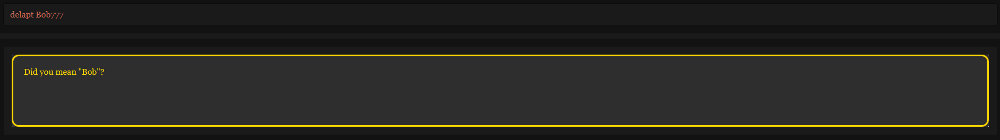

<link rel="stylesheet" type="text/css" href="assets/css/UserGuide.css">

EZStates is a **desktop app for managing contacts, optimized for use via a Command Line Interface** (CLI) while still having the benefits of a Graphical User Interface (GUI). If you can type fast, AB3 can get your contact management tasks done faster than traditional GUI apps.

* Table of Contents
{:toc}

--------------------------------------------------------------------------------------------------------------------

## Quick Start: Get started in 3 minutes!

In this quick start guide, you'll learn how to install EZSTATES. **_(3 min)_** 
 
**(OPTIONAL)** You'll also learn how our commands work to kickstart the application. **_(7 min)_**

 
While learning our command structure is optional, 
we highly recommend reviewing this section to make using EZSTATES much easier.

### Installation

1. Ensure you have Java `17` or above installed in your Computer.

2. Download the latest `.jar` file from [EZSTATES Releases](https://github.com/AY2425S1-CS2103T-F11-4/tp/releases).

3. Copy the file to the folder you want to use as the _home folder_ for your AddressBook.

4. Open a command terminal, `cd` into the folder you put the jar file in, and use the `java -jar ezstates.jar` command to run the application. 
   A GUI similar to the below should appear in a few seconds. Note how the app contains some sample data.  
     

5. Type the command in the command box and press Enter to execute it. e.g. typing **`help`** and pressing Enter will open the help window. 
   Some example commands you can try:

   * `showclients` : Lists all contacts.

   * `buyer n/John Doe p/98765432 e/johnd@example.com` : Adds a buyer named `John Doe` to the Address Book.

   * `delete John Doe` : Deletes the contact with name John Doe from the list.

   * `clear` : Deletes all contacts.

   * `exit` : Exits the app.

6. Refer to the [Features](#features) for command details.

### Command Structure

--------------------------------------------------------------------------------------------------------------------

## Feature Categories

You are strongly recommended to read through [Command Structure](#CommandStructure) before proceeding with this section!

 
This user guide is divided into four main feature categories:

1. **Client Management Commands**
2. **Appointment Management Commands**
3. **Listing Management Commands**
4. **Utility Commands**

---

### **1. Client Management Commands**

Commands for creating, updating, and deleting buyers and sellers.

- #### Add Buyer Command
    - **Format:** `buyer n/<NAME> p/<PHONE> e/<EMAIL> [t/<TAG>...]`
    - **Description:** Creates a new buyer profile with specified details.
    - **Successful Execution:**
      > ---
      >
      > **Use Case #1**: Adding a buyer named `Bobby` with phone number `91124444` and email `john123@gmail.com`
      >
      > **Input**: `buyer n/Bobby p/91124444 e/bobby123@gmail.com`
      >
      > **Output**: New buyer added: Bobby; Phone: 91124444; Email: bobby123@gmail.com; Appointment: -; Tags:
      >
      > ---
      >
      > **Use Case #2**: Adding a buyer named `Bobby` with phone number `91124444`, email `john123@gmail.com`, tags `friend`, `owner`
      >
      > **Input**: `buyer n/Bobby p/91124444 e/bobby123@gmail.com t/friend t/owner`
      >
      > **Output**: New buyer added: Bobby; Phone: 91124444; Email: bobby123@gmail.com; Appointment: -; Tags: [owner][friend]
      >
      > ---

    - **Failed Execution:**
      > ---
      >
      > **User Error #1**: Missing `NAME` field
      >
      > **Input**: `buyer p/91124444 e/bobby123@gmail.com`
      >
      > **Output**:  
      Invalid command format!  
      buyer: Adds a buyer to the address book.  
      Parameters: n/NAME p/PHONE e/EMAIL [t/TAG]... 
      Example: buyer n/John Doe p/98765432 e/johnd@example.com> t/friends t/owesMoney
      >
      > ---
      >
      > **User Error #2**: Missing `PHONE` field
      >
      > **Input**: `buyer n/Bobby e/bobby123@gmail.com`
      >
      > **Output**:  
      Invalid command format!  
      buyer: Adds a buyer to the address book.  
      Parameters: n/NAME p/PHONE e/EMAIL [t/TAG]... 
      Example: buyer n/John Doe p/98765432 e/johnd@example.com> t/friends t/owesMoney
      >
      > ---
      >
      > **User Error #3**: Missing `EMAIL` field
      >
      > **Input**: `buyer n/Bobby p/91124444`
      >
      > **Output**:  
      Invalid command format!  
      buyer: Adds a buyer to the address book.  
      Parameters: n/NAME p/PHONE e/EMAIL [t/TAG]... 
      Example: buyer n/John Doe p/98765432 e/johnd@example.com> t/friends t/owesMoney
      >
      > ---
- #### Add Seller Command
    - **Format:** `seller n/<NAME> p/<PHONE> e/<EMAIL> [t/<TAG>...]`
    - **Description:** Creates a new seller profile with specified details.
    - **Successful Execution:**
      > ---
      > **Use Case #1**: Adding a seller named `Bobby` with phone number `91124444` and email `john123@gmail.com`
      >
      > **Input**: `seller n/Bobby p/91124444 e/bobby123@gmail.com`
      >
      > **Output**: New seller added: Bobby; Phone: 91124444; Email: bobby123@gmail.com; Appointment: -; Tags:
      >
      > ---
      >
      > **Use Case #2**: Adding a seller named `Bobby` with phone number `91124444`, email `john123@gmail.com`, tags `friend`, `owner`
      >
      > **Input**: `seller n/Bobby p/91124444 e/bobby123@gmail.com t/friend t/owner`
      >
      > **Output**: New seller added: Bobby; Phone: 91124444; Email: bobby123@gmail.com; Appointment: -; Tags: [owner][friend]
      >
      > ---

    - **Failed Execution**
      > ---
      > **User Error #1**: Missing `NAME` field
      >
      > **Input**: `seller p/91124444 e/bobby123@gmail.com`
      >
      > **Output**:  
        Invalid command format!  
        seller: Adds a seller to the address book.  
        Parameters: n/NAME p/PHONE e/EMAIL [t/TAG]... 
        Example: seller n/John Doe p/98765432 e/johnd@example.com> t/friends t/owesMoney
      >
      > ---
      >
      > **User Error #2**: Missing `PHONE` field
      >
      > **Input**: `seller n/Bobby e/bobby123@gmail.com`
      >
      > **Output**:  
        Invalid command format!  
        seller: Adds a seller to the address book.  
        Parameters: n/NAME p/PHONE e/EMAIL [t/TAG]... 
        Example: seller n/John Doe p/98765432 e/johnd@example.com> t/friends t/owesMoney
      >
      > ---
      > **User Error #3**: Missing `EMAIL` field
      >
      > **Input**: `seller n/Bobby p/91124444`
      >
      > **Output**:  
        Invalid command format!  
        seller: Adds a seller to the address book.  
        Parameters: n/NAME p/PHONE e/EMAIL [t/TAG]... 
        Example: seller n/John Doe p/98765432 e/johnd@example.com> t/friends t/owesMoney

- #### Find Command
    - **Format:** `find KEYWORD [KEYWORD...]`
    - **Description:** Finds the specified client(s) based on the provided keywords.
    - **Successful Execution:**
      > ---
      > **Use Case #1**: Finding `Bob`
      >
      > **Input**: `find Bob`
      >
      > **Output**: 1 persons listed!
      >
      > 
      >
      > ---
      >
      > **Use Case #2**: Finding `Bob` OR `Winter`
      >
      > **Input**: `find Bob Winter`
      >
      > **Output**: 2 persons listed!
      >
      > 
      >
      > ---

    - **Failed Execution:**
      > ---
      >
      > **Use Case**: Attempting to find a non-existent client
      > 
      > **Input**: `find Bob7`
      > 
      > **Output**: 0 persons listed!
      > 
      > 
      > 
      > ---

- #### Edit Client Command
    - **Format:** `editclient NAME [n/<NAME>] [p/<PHONE>] [e/<EMAIL>] [t/<TAG>...] [r/<REMARK>]`
    - **Description:** Edits the details of the specified client.
    - **Successful Execution:**
      > ---
      > **Use Case #1**: Changing name of `Bob` to `Bobby`
      >
      > **Input**: `editclient Bob n/Bobby`
      >
      > **Output**: Successfully edited Bobby; Phone: 91124444; Email: bobby123@gmail.com; Appointment: -; Tags: [owner][friend]!
      >
      > ---
      >
      > **Use Case #2**: Changing phone of `Bobby` to `97774444`
      >
      > **Input**: `editclient Bobby p/97774444`
      >
      > **Output**: Successfully edited Bobby; Phone: 97774444; Email: bobby123@gmail.com; Appointment: -; Tags: [owner][friend]!
      >
      > ---
      >
      > **Use Case #3**: Removing tags of `Bobby`
      >
      > **Input**: `editclient Bobby t/`
      >
      > **Output**: Successfully edited Bobby; Phone: 97774444; Email: bobby123@gmail.com; Appointment: -; Tags: !
      >
      > ---

    - **Failed Execution:**
      > ---
      > **User Error #1**: No name found
      >
      > **Input**: `editclient n/Bobby`
      >
      > **Output**:
        Invalid command format!
       edit: Edits the details of the person identified by their name. Existing values will be overwritten by the input values.
       Parameters: NAME (must be an existing client) [n/NAME] [p/PHONE] [e/EMAIL] [t/TAG]...
       Example: editclient John Doe e/johndoe@example.com p/91234567
      >
      > ---
      >
      > **User Error #2**: Entering invalid name
      >
      > **Input**: `editclient a#2 n/Bobby`
      >
      > **Output**:
        Invalid command format!
       edit: Edits the details of the person identified by their name. Existing values will be overwritten by the input values.
       Parameters: NAME (must be an existing client) [n/NAME] [p/PHONE] [e/EMAIL] [t/TAG]...
       Example: editclient John Doe e/johndoe@example.com p/91234567
      >
      > ---
      > 
      > **User Error #3**: Entering a name that does not exist in the address book
      > 
      > **Input**: `editclient notInAddressBook n/Bobby`
      > 
      > **Output**: This person does not exist in the address book.
      > 
      > ---

- #### Delete Client Command
    - **Format:** `delete NAME`
    - **Description:** Deletes the specified client profile.
    - **Successful Execution:**
      > ---
      > **Use Case #1**: Delete `Bob` from the address book
      >
      > **Input**: `delete Bob`
      >
      > **Output**: `Successfully deleted Bob with the number: 97774444 and email: bobby123@gmail.com`
      >
      > ---
    
     
    

    Delete is case-insensitive: 
    `delete Bob` = `delete BOB` = `delete bOb` 
    

     
      
    - **Failed Execution:**
      > ---
      > **Use Case #1**: No name found
      >
      > **Input**: `delete`
      >
      > **Output**: 
        Invalid command format! 
       delete: Deletes the client profile corresponding to the client's name.
       Parameters: CLIENT_NAME (case-insensitive)
       Example: delete Tan Wen Xuan
      >
      > ---
      > **Use Case #2**: Entering invalid name 
      > 
      > **Input**: `delete $$`
      > 
      > **Output**:
        Invalid command format!
       delete: Deletes the client profile corresponding to the client's name.
       Parameters: CLIENT_NAME (case-insensitive)
       Example: delete Tan Wen Xuan
      > 
      > ---
      > **Use Case #3**: Deleting a name that does not exist in the address book
      > 
      > **Input**: `delete notInAddressBook`
      > 
      > **Output**:
        Invalid command format!
       delete: Deletes the client profile corresponding to the client's name.
       Parameters: CLIENT_NAME (case-insensitive)
       Example: delete Tan Wen Xuan
      >
      > ---

---

### **2. Appointment Management**

Commands for managing appointments between user and clients.

- #### Schedule Appointment
    - **Format:** `apt NAME d/<DD-MM-YY> fr/<HHmm> to/<HHmm>`
    - **Description:** Schedules a new appointment to be held with the specified client that includes the specified details (date, time). 
    - **Successful Execution:**
      > ---
      > **Use Case #1**: Adding appointment `8th October 2024 7pm to 9pm` for client `Bob`
      >
      > **Input**: `apt Bob d/08-10-2024 fr/1900 to/2100`
      >
      > **Output**: Appointment scheduled for Bob; Phone: 94441111; Email: bob123@gmail.com; Appointment: Date: 08-10-24 (From: 19:00 To: 21:00); Tags:
      >
      > 
      > 
      > ---
      >
      > **Use Case #2**: Overriding an existing appointment for client `Bob` to be `9th October 2024 10am to 12pm` instead
      >
      > **Input**: `apt Bob d/09-10-24 fr/1000 to/1200`
      >
      > **Output**: Appointment scheduled for Bob; Phone: 94441111; Email: bob123@gmail.com; Appointment: Date: 09-10-24 (From: 10:00 To: 12:00); Tags:
      >
      > 
      > 
      > ---
      
    - **Failed Execution:**
      > ---
      > **Use Case #1**: Incorrect `DATE` format 
      >
      > **Input #a**: `apt Bob d/09-10-24 fr/1000 to/1200`
      >
      > **Input #b**: `apt Bob d/aaa fr/1000 to/1200`
      > 
      > **Output**: Dates should be in the format dd-MM-yy or ddMMyy, e.g., 25-12-24 or 251224.
      >
      > ---
      > 
      > **Use Case #2**: Incorrect `TIME` format
      > 
      > **Input #a**: `apt Bob d/20-10-24 fr/100000 to/1200`
      > 
      > **Input #b**: `apt Bob d/20-10-24 fr/aa to/1200`
      > 
      > **Output**: Times should be in the format HH:mm or HHmm, e.g., 0900 or 09:00.
      > 
      > ---

- #### Delete Appointment
    - **Format:** `delapt <NAME>`
    - **Description:** Deletes an appointment with the specified client.
    - **Successful Execution:**
      > ---
      > **Use Case**: Deleting appointment for `Bob`
      >
      > **Input**: `delapt Bob`
      >
      > **Output**: Successfully deleted appointment from Bob
      >
      > 
      > 
      > ---
      
    - **Failed Execution:**
      > ---
      > **Use Case**: Attempting to delete an appointment from a non-existent client
      >
      > **Input**: `delapt Bob7777`
      >
      > **Output**: Please enter an existing client name!
      >
      > ---
    
     
    

    If you suggest a name that differs from an existing client by at most 3 letters, 
    the console will suggest to input the existing client instead
    

     
  
    

---

### **3. Listing Management**

Commands for managing property listings and associating clients with listings.

- #### Add Listing
    - **Format:** `listing n/NAME price/PRICE area/AREA address/ADDRESS region/REGION seller/SELLER [buyer/BUYER]...`
    - **Description:** Adds a new listing associated to the seller with the specified details.
    - **Successful Execution:**
      > ---
      > **Use Case #1**: Adding a listing with name `Warton House`, price `4000`, area `1000`, address `123 PASIR RIS (S)123456`, region `east`, seller `Bernice Yu`, buyer `Alex Yeoh`  
      >
      > **Input**: `listing n/Warton House price/4000 area/1000 address/123 PASIR RIS (S)123456 region/east seller/Bernice Yu buyer/Alex Yeoh`
      >
      > **Output**: New listing added: Warton House; Price: 4000; Area: 1000; Region: EAST; Address: 123 PASIR RIS (S)123456; Seller: seedu.address.model.person.Seller{name=Bernice Yu, phone=99272758, email=berniceyu@example.com, tags=[[colleagues], [friends]], appointment=-, remark=No remarks yet.}seedu.address.model.person.Buyer{name=Alex Yeoh, phone=87438807, email=alexyeoh@example.com, tags=[[friends]], appointment=Date: 20-12-24 (From: 08:00 To: 10:00), remark=Test}
      >
      > 
      > 
      > ---
      >
      > **Use Case #2**: Adding a listing with no buyers
      >
      > **Input**: `listing n/Warton House price/4000 area/1000 address/123 PASIR RIS (S)123456 region/east seller/Bernice Yu`
      >
      > **Output**: New listing added: Warton House; Price: 4000; Area: 1000; Region: EAST; Address: 123 PASIR RIS (S)123456; Seller: seedu.address.model.person.Seller{name=Bernice Yu, phone=99272758, email=berniceyu@example.com, tags=[[colleagues], [friends]], appointment=-, remark=No remarks yet.}
      >
      > 
      > 
      > ---

    - **Failed Execution:**
      > ---
      > **Use Case #1**: Attempting to add a listing for a non-existent seller
      >
      > **Input**: `listing n/Warton House price/4000 area/1000 address/123 PASIR RIS (S)123456 region/east seller/bob7`
      >
      > **Output**: Please enter an existing client name!
      >
      > ---
      > 
      > **Use Case #2**: Attempting to add non-existent buyers to a listing
      > 
      > **Input**: `listing n/Warton House price/4000 area/1000 address/123 PASIR RIS (S)123456 region/east seller/Bernice Yu buyer/bob7`
      > 
      > **Output**: Please enter an existing client name!
      > 
      > ---

- #### Show Listings
    - **Format:** `showlistings`
    - **Description:** Displays all current listings.
    - **Successful Execution:**
      > ---
      > **Use Case #1**: To show all listings in the addressbook
      >
      > **Input**: showlistings
      >
      > **Output**: Here are your listings!
      >
      > 
      > 
      > ---
      > 
      > **Use Case #2**: To show all listings (when there are none)
      > 
      > **Input**: showlistings
      > 
      > **Output**: You have no listings available.
      > 
      > 
      > 
      > ---

    - **Failed Execution:** NIL

- #### Add Buyers to Listing
    - **Format:** `AddBuyersToListingCommand`
    - **Description:** Associates buyers with a specified listing.
    - **Successful Execution:**
      > ---
      > **Use Case #1**:
      >
      > **Input**:
      >
      > **Output**:
      >
      > ---
      >
      > **Use Case #2**:
      >
      > **Input**:
      >
      > **Output**:
      >
      > ---
      >
      > **Use Case #3**:
      >
      > **Input**:
      >
      > **Output**:
      >
      > ---

    - **Failed Execution:**
      > ---
      > **Use Case #1**:
      >
      > **Input**:
      >
      > **Output**:
      >
      > ---

- #### Remove Buyers from Listing
    - **Format:** `RemoveBuyersFromListingCommand`
    - **Description:** Removes buyers associated with a specified listing.
    - **Successful Execution:**
      > ---
      > **Use Case #1**:
      >
      > **Input**:
      >
      > **Output**:
      >
      > ---
      >
      > **Use Case #2**:
      >
      > **Input**:
      >
      > **Output**:
      >
      > ---
      >
      > **Use Case #3**:
      >
      > **Input**:
      >
      > **Output**:
      >
      > ---

    - **Failed Execution:**
      > ---
      > **Use Case #1**:
      >
      > **Input**:
      >
      > **Output**:
      >
      > ---

- #### Delete Listing
    - **Format:** `DeleteListingCommand`
    - **Description:** Deletes a specified listing.
    - **Successful Execution:**
      > ---
      > **Use Case #1**:
      >
      > **Input**:
      >
      > **Output**:
      >
      > ---
      >
      > **Use Case #2**:
      >
      > **Input**:
      >
      > **Output**:
      >
      > ---
      >
      > **Use Case #3**:
      >
      > **Input**:
      >
      > **Output**:
      >
      > ---

    - **Failed Execution:**
      > ---
      > **Use Case #1**:
      >
      > **Input**:
      >
      > **Output**:
      >
      > ---

- #### Clear Listing
    - **Format:** `ClearListingCommand`
    - **Description:** Deletes ALL listings.
    - **Successful Execution:**
      > ---
      > **Use Case #1**:
      >
      > **Input**:
      >
      > **Output**:
      >
      > ---
      >
      > **Use Case #2**:
      >
      > **Input**:
      >
      > **Output**:
      >
      > ---
      >
      > **Use Case #3**:
      >
      > **Input**:
      >
      > **Output**:
      >
      > ---

    - **Failed Execution:**
      > ---
      > **Use Case #1**:
      >
      > **Input**:
      >
      > **Output**:
      >
      > ---

### **4. Utility Commands**

Miscellaneous commands for application utility, such as clearing, exiting, and displaying help.

- #### Clear
    - **Format:** `ClearCommand`
    - **Description:** Clears the console or application state.
    - **Successful Execution:**
      > ---
      > **Use Case #1**:
      >
      > **Input**:
      >
      > **Output**:
      >
      > ---
      >
      > **Use Case #2**:
      >
      > **Input**:
      >
      > **Output**:
      >
      > ---
      >
      > **Use Case #3**:
      >
      > **Input**:
      >
      > **Output**:
      >
      > ---

    - **Failed Execution:**
      > ---
      > **Use Case #1**:
      >
      > **Input**:
      >
      > **Output**:
      >
      > ---

- #### Exit
    - **Format:** `ExitCommand`
    - **Description:** Exits the application.
    - **Successful Execution:**
      > ---
      > **Use Case #1**:
      >
      > **Input**:
      >
      > **Output**:
      >
      > ---
      >
      > **Use Case #2**:
      >
      > **Input**:
      >
      > **Output**:
      >
      > ---
      >
      > **Use Case #3**:
      >
      > **Input**:
      >
      > **Output**:
      >
      > ---

    - **Failed Execution:**
      > ---
      > **Use Case #1**:
      >
      > **Input**:
      >
      > **Output**:
      >
      > ---

- #### Help
    - **Format:** `help`
    - **Description:** Displays a list of available commands and their descriptions.
    - **Successful Execution:**
      > ---
      > **Use Case #1**: Accessing help
      >
      > **Input**: `help`
      >
      > **Output**:
      >
      > ---

- #### More Info
    - **Format:** `MoreInfoCommand`
    - **Description:** Provides additional information about a specific command or feature.
    - **Successful Execution:**
      > ---
      > **Use Case #1**:
      >
      > **Input**:
      >
      > **Output**:
      >
      > ---
      >
      > **Use Case #2**:
      >
      > **Input**:
      >
      > **Output**:
      >
      > ---
      >
      > **Use Case #3**:
      >
      > **Input**:
      >
      > **Output**:
      >
      > ---

    - **Failed Execution:**
      > ---
      > **Use Case #1**:
      >
      > **Input**:
      >
      > **Output**:
      >
      > ---

- #### Chat Window
    - **Format:** `ChatWindowCommand`
    - **Description:** Opens a chat window for client-agent communication.
    - **Successful Execution:**
      > ---
      > **Use Case #1**:
      >
      > **Input**:
      >
      > **Output**:
      >
      > ---
      >
      > **Use Case #2**:
      >
      > **Input**:
      >
      > **Output**:
      >
      > ---
      >
      > **Use Case #3**:
      >
      > **Input**:
      >
      > **Output**:
      >
      > ---

    - **Failed Execution:**
      > ---
      > **Use Case #1**:
      >
      > **Input**:
      >
      > **Output**:
      >
      > ---

### Saving the data

AddressBook data are saved in the hard disk automatically after any command that changes the data. There is no need to save manually.

### Editing the data file

AddressBook data are saved automatically as a JSON file `[JAR file location]/data/addressbook.json`. Advanced users are welcome to update data directly by editing that data file.

:exclamation: **Caution:**
If your changes to the data file makes its format invalid, AddressBook will discard all data and start with an empty data file at the next run. Hence, it is recommended to take a backup of the file before editing it. 
Furthermore, certain edits can cause the AddressBook to behave in unexpected ways (e.g., if a value entered is outside of the acceptable range). Therefore, edit the data file only if you are confident that you can update it correctly.

### Archiving data files `[coming in v2.0]`

_Details coming soon ..._

--------------------------------------------------------------------------------------------------------------------

## FAQ

**Q**: How do I transfer my data to another Computer? 
**A**: Install the app in the other computer and overwrite the empty data file it creates with the file that contains the data of your previous AddressBook home folder.

--------------------------------------------------------------------------------------------------------------------

## Known issues

1. **When using multiple screens**, if you move the application to a secondary screen, and later switch to using only the primary screen, the GUI will open off-screen. The remedy is to delete the `preferences.json` file created by the application before running the application again.
2. **If you minimize the Help Window** and then run the `help` command (or use the `Help` menu, or the keyboard shortcut `F1`) again, the original Help Window will remain minimized, and no new Help Window will appear. The remedy is to manually restore the minimized Help Window.

--------------------------------------------------------------------------------------------------------------------

## Command summary

Action | Format, Examples
--------|------------------
**Add** | `add n/NAME p/PHONE_NUMBER e/EMAIL​`   e.g. `add n/James Ho p/22224444 e/jamesho@example.com`
**Clear** | `clear`
**Delete** | `delete NAME`  e.g. `delete James Ho`
**Edit** | `edit INDEX [n/NAME] [p/PHONE_NUMBER] [e/EMAIL]​`  e.g.`edit 2 n/James Lee e/jameslee@example.com`   e.g.`edit 2 n/James Voo`
**Find** | `find KEYWORD [MORE_KEYWORDS]`  e.g., `find James Jake`
**List** | `list`
**Help** | `help`
