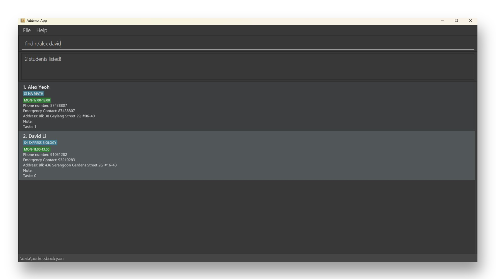

# Sellsavvy User Guide

Sellsavvy is a **desktop app for managing contacts, optimized for use via a Command Line Interface** (CLI) while still having the benefits of a Graphical User Interface (GUI). If you can type fast, SellSavvy can get your contact management tasks done faster than traditional GUI apps.

<!-- * Table of Contents -->
<page-nav-print />

--------------------------------------------------------------------------------------------------------------------

## Quick start

1. Ensure you have Java `17` or above installed in your Computer.

2. Download the latest `.jar` file from [here](https://github.com/AY2425S1-CS2103T-F14a-2/tp/releases).

3. Copy the file to the folder you want to use as the _home folder_ for SellSavvy.

4. Open a command terminal, `cd` into the folder you put the jar file in, and use the `java -jar addressbook.jar` command to run the application. 
   A GUI similar to the below should appear in a few seconds. Note how the app contains some sample data. 
   

5. Type the command in the command box and press Enter to execute it. e.g. typing **`help`** and pressing Enter will open the help window. 
   Some example commands you can try:

   * `list` : Lists all contacts.

   * `add n/John Doe p/98765432 e/johnd@example.com a/John street, block 123, #01-01` : Adds a contact named `John Doe` to the Address Book.

   * `delete 3` : Deletes the 3rd contact shown in the current list.

   * `clear` : Deletes all contacts.

   * `exit` : Exits the app.

6. Refer to the [Features](#features) below for details of each command.

--------------------------------------------------------------------------------------------------------------------

## Features

<box type="info" seamless>

**Notes about the command format:** 

* Words in `UPPER_CASE` are the parameters to be supplied by the user. 
  e.g. in `add n/NAME`, `NAME` is a parameter which can be used as `add n/John Doe`.

* Items in square brackets are optional. 
  e.g `n/NAME [t/TAG]` can be used as `n/John Doe t/friend` or as `n/John Doe`.

* Items with `…`​ after them can be used multiple times including zero times. 
  e.g. `[t/TAG]…​` can be used as ` ` (i.e. 0 times), `t/friend`, `t/friend t/family` etc.

* Parameters can be in any order. 
  e.g. if the command specifies `n/NAME p/PHONE_NUMBER`, `p/PHONE_NUMBER n/NAME` is also acceptable.

* Extraneous parameters for commands that do not take in parameters (such as `help`, `list`, `exit` and `clear`) will be ignored. 
  e.g. if the command specifies `help 123`, it will be interpreted as `help`.

* If you are using a PDF version of this document, be careful when copying and pasting commands that span multiple lines as space characters surrounding line-breaks may be omitted when copied over to the application.
</box>

### Viewing help : `help`

Shows a message explaning how to access the help page.

Format: `help`

### Adding a person: `add`

Adds a person to the address book.

Format: `add n/NAME p/PHONE_NUMBER e/EMAIL a/ADDRESS [t/TAG]…​`

<box type="tip" seamless>

**Tip:** A person can have any number of tags (including 0)
</box>

Examples:
* `add n/John Doe p/98765432 e/johnd@example.com a/John street, block 123, #01-01`
* `add n/Betsy Crowe t/friend e/betsycrowe@example.com a/Newgate Prison p/1234567 t/criminal`

### Listing all persons : `list`

Shows a list of all persons in the address book.

Format: `list`

### Editing a person : `edit`

Edits an existing person in the address book.

Format: `edit INDEX [n/NAME] [p/PHONE] [e/EMAIL] [a/ADDRESS] [t/TAG]…​`

* Edits the person at the specified `INDEX`. The index refers to the index number shown in the displayed person list. The index **must be a positive integer** 1, 2, 3, …​
* At least one of the optional fields must be provided.
* Existing values will be updated to the input values.
* When editing tags, the existing tags of the person will be removed i.e adding of tags is not cumulative.
* You can remove all the person’s tags by typing `t/` without
    specifying any tags after it.

Examples:
*  `edit 1 p/91234567 e/johndoe@example.com` Edits the phone number and email address of the 1st person to be `91234567` and `johndoe@example.com` respectively.
*  `edit 2 n/Betsy Crower t/` Edits the name of the 2nd person to be `Betsy Crower` and clears all existing tags.

### Locating persons by name: `find`

Finds persons whose names contain any of the given keywords.

Format: `find KEYWORD [MORE_KEYWORDS]`

* The search is case-insensitive. e.g `hans` will match `Hans`
* The order of the keywords does not matter. e.g. `Hans Bo` will match `Bo Hans`
* Only the name is searched.
* Only full words will be matched e.g. `Han` will not match `Hans`
* Persons matching at least one keyword will be returned (i.e. `OR` search).
  e.g. `Hans Bo` will return `Hans Gruber`, `Bo Yang`

Examples:
* `find John` returns `john` and `John Doe`
* `find alex david` returns `Alex Yeoh`, `David Li` 
  

### Deleting a person : `delete`

Deletes the specified person from the address book.

Format: `delete INDEX`

* Deletes the person at the specified `INDEX`.
* The index refers to the index number shown in the displayed person list.
* The index **must be a positive integer** 1, 2, 3, …​

Examples:
* `list` followed by `delete 2` deletes the 2nd person in the address book.
* `find Betsy` followed by `delete 1` deletes the 1st person in the results of the `find` command.

### Adding an order under a Person : `addOrder`

Adds an order under a specified person from the address book.

Format: `addOrder INDEX i/ITEM d/DATE [c/QUANTITY]`

* Add an order under the person at the specified `INDEX`.
* The index refers to the index number shown in the displayed person list.
* The index and quantity **must be a positive integer** 1, 2, 3, …​
* Date must follow the following format: `DD-MM-YYYY`
* If the quantity is not provided, the quantity will be set to a default value of **1**.

Examples:
* `addOrder 2 i/Lamp d/20-11-2024 c/3` adds the order with item `Lamp`, quantity of **3** and delivery date `20-11-2024`, to the 2nd person in the address book.
* `addOrder 1 i/Books d/02-03-2026` adds the order with item `Books`, quantity of **1** and delivery date `02-03-2026`, to the first person in the address book.
* `find Betsy` followed by `addOrder 1 i/Bottles d/12-12-2002 c/1` adds an order under the 1st person in the results of the `find` command.

### Listing all orders under a Person : `listOrder`

List all orders of a specified person from the address book.

Format: `listOrder INDEX`

* List all orders of the person at the specified `INDEX`.
* The index refers to the index number shown in the displayed person list.
* The index **must be a positive integer** 1, 2, 3, …​

Examples:
* `list` followed by `listOrder 2` lists all orders of the 2nd person in the address book.
* `find Betsy` followed by `listOrder 1` lists all orders of the 1st person from the list of persons found with "Betsy".

### Deleting an order under a Person : `deleteOrder`

Deletes an order from the selected person's displayed order list.

Format: `deleteOrder ORDER_INDEX`

* A person's order list must first be displayed before deleting an order from that person.
* Deletes an order under the selected person at the specified `ORDER_INDEX`.
* The order index refers to the index number shown in the displayed **order** list of the selected person.
* The index **must be a positive integer** 1, 2, 3, …​

Examples:
* `deleteOrder 1` deletes the order with index 1 from the selected person.
* `listOrder 1` followed by `deleteOrder 2` selects the 1st person in the address book and deletes the 2nd order under the 1st person.

### Editing an order : `editOrder`

Edits an order from the selected person's displayed order list.

Format: `edit ORDER_INDEX [i/ITEM] [d/DATE] [c/QUANTITY]`

* A person's order list must first be displayed before editing an order from that person.
* Edits the order at the specified `ORDER_INDEX`. The order index refers to the index number shown in the displayed order list.
* The order index and quantity **must be a positive integer** 1, 2, 3, …​
* Date must follow the following format: `DD-MM-YYYY`
* At least one of the optional fields must be provided.
* Existing values will be updated to the input values.

Examples:
*  `editOrder 1 i/Light bulb d/21-11-2025` edits the item and delivery date of the 1st order to be `Light bulb` and `21-11-2025` respectively.
*  `editOrder 2 c/22` edits the quantity of the 2nd order to be `22`.
*  `listOrder 1` followed by `editOrder 3 i/Wallet` selects the 1st person in the address book and edits the item of the 3rd order under the 1st person to be `Wallet`.

### Mark an order as completed : `markOrder`

Marks an order from the selected person's displayed order list as completed.

Format: `markOrder ORDER_INDEX`

* A person's order list must first be displayed before marking an order from that person.
* Marks an order under the selected person at the specified `ORDER_INDEX` as completed.
* The order index refers to the index number shown in the **displayed order list**.
* The index **must be a positive integer** 1, 2, 3, …​

Examples:
* `markOrder 1` marks the order with index 1 from the displayed order list as completed.
* `listOrder 1` followed by `markOrder 2` selects the 1st person in the address book and marks the 2nd order under the 1st person as completed.

### Reverts an order to pending status : `unmarkOrder`

Reverts an order from the selected person's displayed order list to pending.

Format: `unmarkOrder ORDER_INDEX`

* A person's order list must first be displayed before unmarking an order from that person.
* Reverts an order under the selected person at the specified `ORDER_INDEX` to pending.
* The order index refers to the index number shown in the **displayed order list**.
* The index **must be a positive integer** 1, 2, 3, …​

Examples:
* `unmarkOrder 1` reverts the order with index 1 from the displayed order list to pending.
* `listOrder 1` followed by `markOrder 2` selects the 1st person in the address book and reverts the 2nd order under the 1st person to pending.

### Filter orders under a Person by order status : `filterOrder`

Filters orders by the specified order status, under a selected person from their displayed order list.

Format: `filterOrder ORDER_STATUS`

* A person's order list must first be displayed before filtering their order list.
* Filters the selected person's order list for orders that match the `ORDER_STATUS`.
* The order status **must be a valid status**. e.g. Completed, Pending.
* `ORDER_STATUS` is case-insensitive. e.g. `completed` is the same as `Completed`.

Examples:
* `filterOrder Pending` filters the currently displayed order list for all orders with the `Pending` status, resulting in a list of pending orders under the selected person being displayed.
* `listOrder 1` followed by `filterOrder completed` displays the list of all completed orders under the 1st person in the address book.

### Clearing all entries : `clear`

Clears all entries from the address book.

Format: `clear`

### Exiting the program : `exit`

Exits the program.

Format: `exit`

### Saving the data

AddressBook data are saved in the hard disk automatically after any command that changes the data. There is no need to save manually.

### Editing the data file

AddressBook data are saved automatically as a JSON file `[JAR file location]/data/addressbook.json`. Advanced users are welcome to update data directly by editing that data file.

<box type="warning" seamless>

**Caution:**
If your changes to the data file makes its format invalid, AddressBook will discard all data and start with an empty data file at the next run.  Hence, it is recommended to take a backup of the file before editing it. 
Furthermore, certain edits can cause the AddressBook to behave in unexpected ways (e.g., if a value entered is outside the acceptable range). Therefore, edit the data file only if you are confident that you can update it correctly.
</box>

### Archiving data files `[coming in v2.0]`

_Details coming soon ..._

--------------------------------------------------------------------------------------------------------------------

## FAQ

**Q**: How do I transfer my data to another Computer? 
**A**: Install the app in the other computer and overwrite the empty data file it creates with the file that contains the data of your previous AddressBook home folder.

--------------------------------------------------------------------------------------------------------------------

## Known issues

1. **When using multiple screens**, if you move the application to a secondary screen, and later switch to using only the primary screen, the GUI will open off-screen. The remedy is to delete the `preferences.json` file created by the application before running the application again.
2. **If you minimize the Help Window** and then run the `help` command (or use the `Help` menu, or the keyboard shortcut `F1`) again, the original Help Window will remain minimized, and no new Help Window will appear. The remedy is to manually restore the minimized Help Window.

--------------------------------------------------------------------------------------------------------------------

## Command summary

| Action                                 | Format, Examples                                                                                                                                                    |
|----------------------------------------|---------------------------------------------------------------------------------------------------------------------------------------------------------------------|
| **Add a person**                       | `add n/NAME p/PHONE_NUMBER e/EMAIL a/ADDRESS [t/TAG]…​`  e.g. `add n/James Ho p/22224444 e/jamesho@example.com a/123, Clementi Rd, 1234665 t/friend t/colleague` |

| **Clear**                              | `clear`                                                                                                                                                             |
| **Delete a person**                    | `delete INDEX`  e.g., `delete 3`                                                                                                                                 |
| **Edit a person**                      | `edit INDEX [n/NAME] [p/PHONE_NUMBER] [e/EMAIL] [a/ADDRESS] [t/TAG]…​`  e.g. `edit 2 n/James Lee e/jameslee@example.com`                                         |
| **Find person(s)**                     | `find KEYWORD [MORE_KEYWORDS]`  e.g. `find James Jake`                                                                                                           |
| **List all persons**                   | `list`                                                                                                                                                              |
| **Add an order**                       | `addOrder INDEX i/ITEM d/DATE [c/QUANTITY]`  e.g. `addOrder 2 i/Lamp d/20-11-2024 c/3`                                                                           |
| **List all orders**                    | `listOrder INDEX`  e.g. `listOrder 3`                                                                                                                            |
| **Delete an order**                    | `deleteOrder ORDER_INDEX`  e.g. `deleteOrder 2`                                                                                                                  |
| **Edit an order**                      | `edit ORDER_INDEX [i/ITEM] [d/DATE] [c/QUANTITY]`   `editOrder 1 i/Light bulb d/21-11-2025`|
| **Mark an order as completed**         | `markOrder ORDER_INDEX`  e.g. `markOrder 2`                                                                                                                      |                                                                                                                                                                                                                                           
| **Revert an order to pending status**  | `unmarkOrder ORDER_INDEX`  e.g., `unmarkOrder 2`                                                                                                                 |
| **Filter a person's orders by status** | `filterOrder ORDER_STATUS`  e.g. `filterOrder Completed`                                                                                                         |
| **Help**                               | `help`                                                                                                                                                              |
