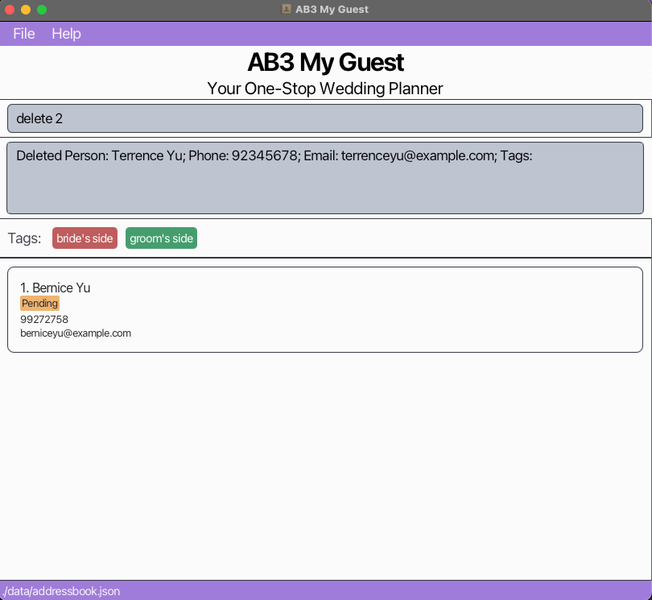

# AB-3 User Guide

AddressBook Level 3 (AB3) is a **desktop app for managing contacts, optimized for use via a  Line Interface** (CLI) while still having the benefits of a Graphical User Interface (GUI). If you can type fast, AB3 can get your contact management tasks done faster than traditional GUI apps.

<!-- * Table of Contents -->
<page-nav-print />

--------------------------------------------------------------------------------------------------------------------

## Quick start

1. Ensure you have Java `17` or above installed in your Computer.

1. Download the latest `.jar` file from [here](https://github.com/se-edu/addressbook-level3/releases).

1. Copy the file to the folder you want to use as the _home folder_ for your AddressBook.

1. Open a command terminal, `cd` into the folder you put the jar file in, and use the `java -jar addressbook.jar` command to run the application. 
   A GUI similar to the below should appear in a few seconds. Note how the app contains some sample data. 
   

1. Type the command in the command box and press Enter to execute it. e.g. typing **`help`** and pressing Enter will open the help window. 
   Some example commands you can try:

   * `list` : Lists all contacts.

   * `add n/John Doe p/98765432 e/johnd@example.com a/John street, block 123, #01-01` : Adds a contact named `John Doe` to the Address Book.

   * `delete 3` : Deletes the 3rd contact shown in the current list.

   * `clear` : Deletes all contacts.

   * `exit` : Exits the app.

1. Refer to the [Features](#features) below for details of each command.

--------------------------------------------------------------------------------------------------------------------

## Features

<box type="info" seamless>

**Notes about the command format:** 

* Words in `UPPER_CASE` are the parameters to be supplied by the user. 
  e.g. in `add n/NAME`, `NAME` is a parameter which can be used as `add n/John Doe`.

* Items in square brackets are optional. 
  e.g `n/NAME [t/TAG]` can be used as `n/John Doe t/friend` or as `n/John Doe`.

* Items with `…`​ after them can be used multiple times including zero times. 
  e.g. `[t/TAG]…​` can be used as ` ` (i.e. 0 times), `t/friend`, `t/friend t/family` etc.

* Parameters can be in any order. 
  e.g. if the command specifies `n/NAME p/PHONE_NUMBER`, `p/PHONE_NUMBER n/NAME` is also acceptable.

* Extraneous parameters for commands that do not take in parameters (such as `help`, `list`, `exit` and `clear`) will be ignored. 
  e.g. if the command specifies `help 123`, it will be interpreted as `help`.

* If you are using a PDF version of this document, be careful when copying and pasting commands that span multiple lines as space characters surrounding line-breaks may be omitted when copied over to the application.
</box>

### Viewing help : `help`

Shows a message explaning how to access the help page.

Format: `help`

## Features

### Mark a supplier status : `mark`

The `mark` command is used to mark a supplier as either **active** or **inactive**
in VendorVault. This helps you keep track of which suppliers are currently active for deliveries and which are not.

#### Command Format:
`mark <supplier_index> <status>`
- `<supplier_index>`: The index of the supplier in the list.

- `<status>`: Either `active` or `inactive` to indicate the supplier's status.

#### Example
To mark the supplier at index 3 as active:
    
    mark 3 active

   A success message will be displayed if the supplier is successfully marked as active.
   
### Here's how it would look like in the app:

### Adding a supplier: `add`

Adds a supplier to the address book.

Format: `add -s n/NAME p/PHONE e/EMAIL com/COMPANY [t/TAG]…​ [pro/PRODUCT]…​`

<box type="tip" seamless>

**Tip:** A supplier can have any number of tags and products (including 0)
</box>

<box type="tip" seamless>

**Warnings**:
- A spacing between `add` and `-s` is compulsory
- Duplicate supplier will not be added again
  </box>

Examples:
* `add -s n/John Doe p/98765432 e/johnd@example.com com/companyA t/friends t/owesMoney pro/rice pro/bread`
* `add -s n/Betsy Crowe p/98223232 e/betsycrowe@example.com com/Newgates t/urgent pro/soap`

Expected output:
* `New person added: John Doe; Phone: 98765432; Email: johnd@example.com; Company: companya; Tags: [owesMoney][friends]; Products breadrice`
* `New person added: Betsy Crowe; Phone: 98223232; Email: betsycrowe@example.com; Company: newgates; Tags: [urgent]; Products soap`

### Listing all persons : `list`

Shows a list of all persons in the address book.

Format: `list`

### Editing a person : `edit`

Edits an existing person in the address book.

Format: `edit INDEX [n/NAME] [p/PHONE] [e/EMAIL] [a/ADDRESS] [t/TAG]…​`

* Edits the person at the specified `INDEX`. The index refers to the index number shown in the displayed person list. The index **must be a positive integer** 1, 2, 3, …​
* At least one of the optional fields must be provided.
* Existing values will be updated to the input values.
* When editing tags, the existing tags of the person will be removed i.e adding of tags is not cumulative.
* You can remove all the person’s tags by typing `t/` without
    specifying any tags after it.

Examples:
*  `edit 1 p/91234567 e/johndoe@example.com` Edits the phone number and email address of the 1st person to be `91234567` and `johndoe@example.com` respectively.
*  `edit 2 n/Betsy Crower t/` Edits the name of the 2nd person to be `Betsy Crower` and clears all existing tags.

### Locating persons by name: `find`

Finds persons whose names contain any of the given keywords.

Format: `find KEYWORD [MORE_KEYWORDS]`

* The search is case-insensitive. e.g `hans` will match `Hans`
* The order of the keywords does not matter. e.g. `Hans Bo` will match `Bo Hans`
* Only the name is searched.
* Only full words will be matched e.g. `Han` will not match `Hans`
* Persons matching at least one keyword will be returned (i.e. `OR` search).
  e.g. `Hans Bo` will return `Hans Gruber`, `Bo Yang`

Examples:
* `find John` returns `john` and `John Doe`
* `find alex david` returns `Alex Yeoh`, `David Li` 
  

### Deleting a supplier : `delete`

The `delete` command is used to delete a supplier from the list of suppliers in VendorVault.

#### Command Format:
`delete INDEX`

- `INDEX`: The index of the supplier in the list.

#### Example
To delete the supplier at index 3:

    delete 3

A success message will be displayed if the supplier is successfully deleted.

### Here's how it would look like in the app:

### Adding a delivery: `add`

Adds a delivery to the address book.

Format: `add -d on/dd-mm-yyyy hh:mm s/SUPPLIER_INDEX pro/PRODUCT q/QUANTITY kg/g/litres/ml/units c/COST`

<box type="tip" seamless>

**Tip:** Day and month of date must be in double digits!
</box>

<box type="tip" seamless>

**Warnings**:
- A spacing between `add` and `-d` is compulsory
- Duplicate delivery will not be added again
</box>

Examples:
* `add -d on/18-06-2024 17:00 s/1 pro/bread q/500 g c/5.50`
* `add -d on/19-12-2024 08:00 s/2 pro/soap q/10 units c/39.50`

Expected output:
* `New delivery added: John Doe; Date & time: 18-06-2024 17:00; Product: bread; Quantity: 500 g; Cost: 5.50; Status: PENDING`
* `New delivery added: Betsy Crowe; Date & time: 19-12-2024 08:00; Product: soap; Quantity: 10 units; Cost: 39.50; Status: PENDING`

### Marking a delivery : `mark -d`

Marks the specified delivery from the address book with the specified `STATUS`.

Format: `mark -d INDEX STATUS`

* Marks the delivery at the specified `INDEX` with the specified `STATUS`.
* The index refers to the index number shown in the displayed delivery list.
* The status refers to the delivery status of a delivery shown in the displayed delivery list.
* The index **must be a positive integer** 1, 2, 3, …​
* The status **must be one of the following:** PENDING, DELIVERED, CANCELLED. Note that the status is not case-sensitive.

Examples:
* `list` followed by `mark -d 2 pending` marks the 2nd delivery in the address book with a pending status.
* `find -d /pro bread` followed by `mark -d 1 cancelled` marks the 1st delivery in the results of the `find` command with a cancelled status.

### Deleting a delivery : `delete -d`

Deletes the specified delivery from the address book.

Format: `delete -d INDEX`

* Deletes the delivery at the specified `INDEX`.
* The index refers to the index number shown in the displayed delivery list.
* The index **must be a positive integer** 1, 2, 3, …​

Examples:
* `list` followed by `delete -d 2` deletes the 2nd delivery in the address book.
* `find -d /pro bread` followed by `delete -d 1` deletes the 1st delivery in the results of the `find` command.

### Clearing all entries : `clear`

Clears all entries from the address book.

Format: `clear`

### Exiting the program : `exit`

Exits the program.

Format: `exit`

### Saving the data

AddressBook data are saved in the hard disk automatically after any command that changes the data. There is no need to save manually.

### Editing the data file

AddressBook data are saved automatically as a JSON file `[JAR file location]/data/addressbook.json`. Advanced users are welcome to update data directly by editing that data file.

<box type="warning" seamless>

**Caution:**
If your changes to the data file makes its format invalid, AddressBook will discard all data and start with an empty data file at the next run.  Hence, it is recommended to take a backup of the file before editing it. 
Furthermore, certain edits can cause the AddressBook to behave in unexpected ways (e.g., if a value entered is outside the acceptable range). Therefore, edit the data file only if you are confident that you can update it correctly.
</box>

### Archiving data files `[coming in v2.0]`

_Details coming soon ..._

--------------------------------------------------------------------------------------------------------------------

## FAQ

**Q**: How do I transfer my data to another Computer? 
**A**: Install the app in the other computer and overwrite the empty data file it creates with the file that contains the data of your previous AddressBook home folder.

--------------------------------------------------------------------------------------------------------------------

## Known issues

1. **When using multiple screens**, if you move the application to a secondary screen, and later switch to using only the primary screen, the GUI will open off-screen. The remedy is to delete the `preferences.json` file created by the application before running the application again.
2. **If you minimize the Help Window** and then run the `help` command (or use the `Help` menu, or the keyboard shortcut `F1`) again, the original Help Window will remain minimized, and no new Help Window will appear. The remedy is to manually restore the minimized Help Window.

--------------------------------------------------------------------------------------------------------------------

## Command summary

### Supplier Commands

Action     | Format, Examples
-----------|----------------------------------------------------------------------------------------------------------------------------------------------------------------------
**Add**    | `add -s n/NAME p/PHONE e/EMAIL com/COMPANY [t/TAG]…​ [pro/PRODUCT]…​`   e.g., `add -s n/John Doe p/98765432 e/johnd@example.com com/companyA t/friends t/owesMoney pro/rice pro/bread`
**Delete** | `delete -s INDEX`  e.g., `delete -s 3`
**Mark**   | `mark -s INDEX STATUS`  e.g.,`mark -s 2 active`

### Delivery Commands

Action     | Format, Examples
-----------|----------------------------------------------------------------------------------------------------------------------------------------------------------------------
**Add**    | `add -d on/dd-mm-yyyy hh:mm s/SUPPLIER_INDEX pro/PRODUCT q/QUANTITY kg/g/litres/ml/units c/COST`   e.g., `add -d on/18-06-2024 17:00 s/1 pro/bread q/500 g c/5.50`
**Delete** | `delete -d INDEX`  e.g., `delete -d 3`
**Mark**   | `mark -d INDEX STATUS`  e.g.,`mark -d 2 PENDING`

### General Commands

Action     | Format, Examples
-----------|----------------------------------------------------------------------------------------------------------------------------------------------------------------------
**Clear**  | `clear`
**List**   | `list`
**Help**   | `help`
