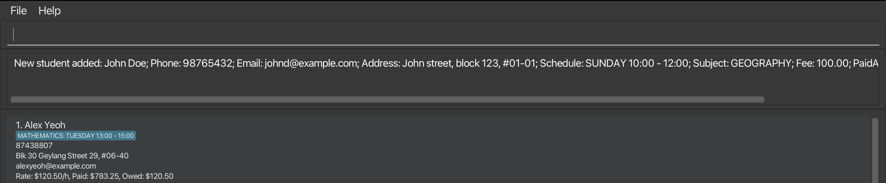
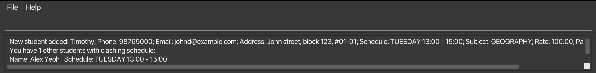
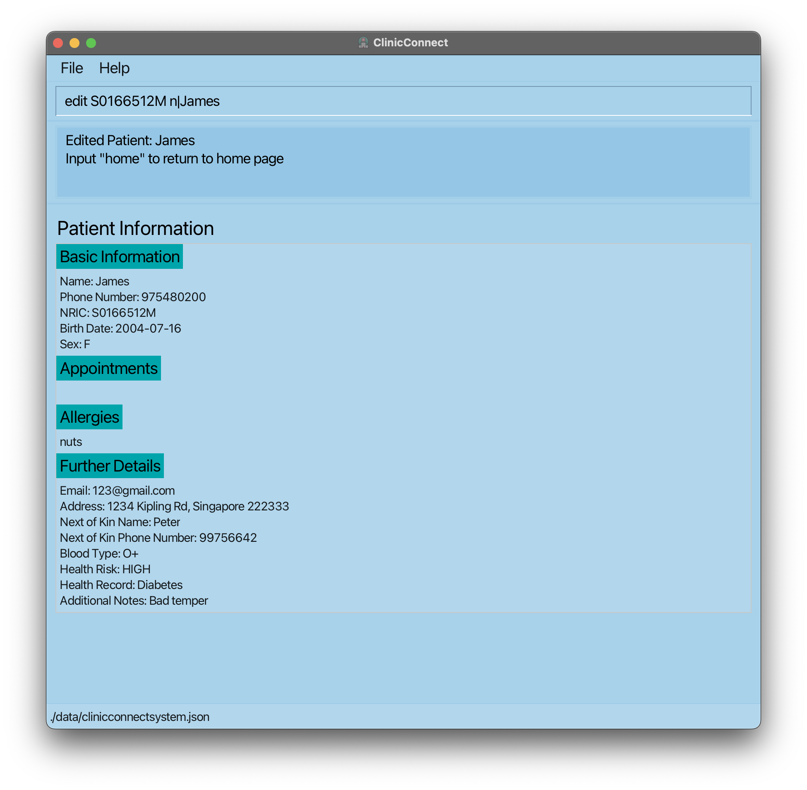
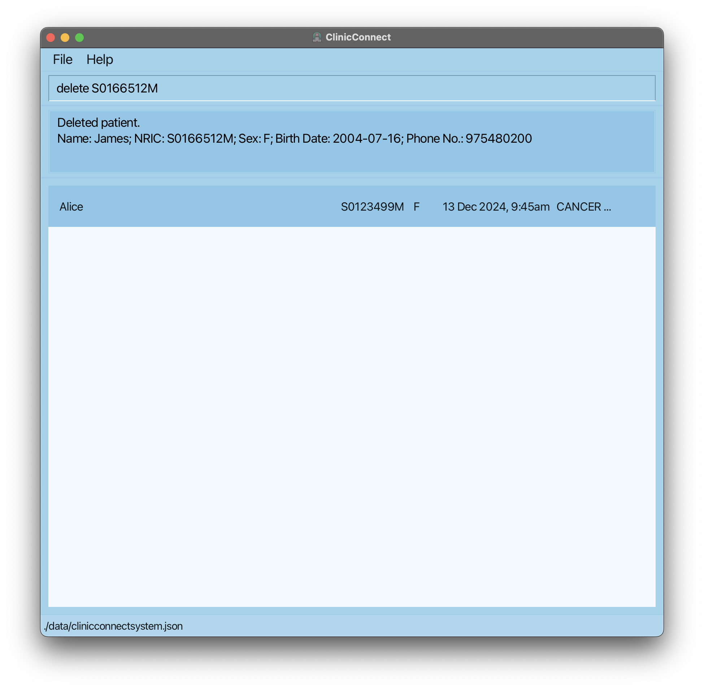
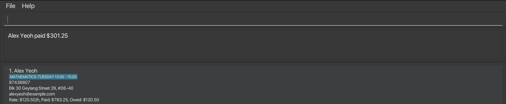
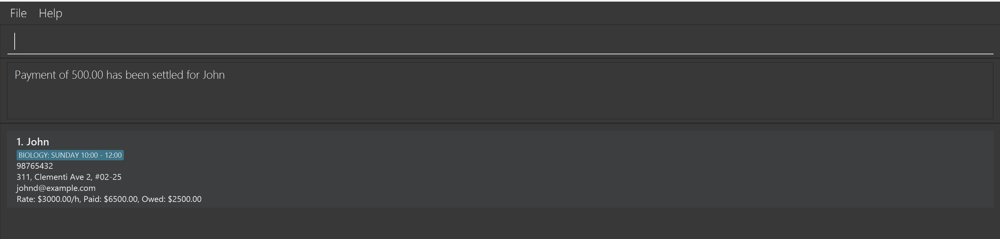
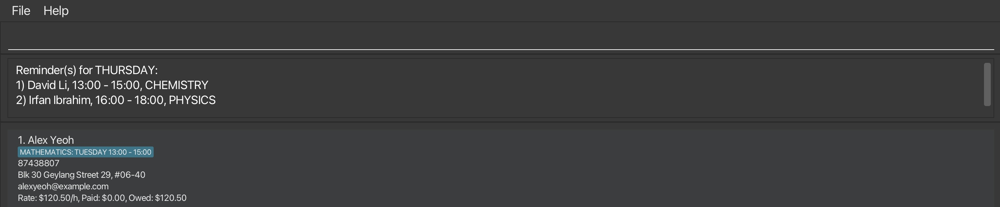

#  UGTeach User Guide

UGTeach is a **desktop app for managing your students' contacts** that aims to empower undergraduate private tutors to **efficiently manage payments and organize schedules**. It streamlines tutoring operations and ensures you stay organized.

Whether you're a Command Line Interface (CLI) pro or new to command lines, **we've got you covered**. Our app offers both a **CLI interface for advanced users** and a **GUI for those who prefer a more visual experience**.
If you can type fast, UGTeach can get your contact management tasks done **faster than traditional GUI apps**.

<!-- * Table of Contents -->
<page-nav-print />

--------------------------------------------------------------------------------------------------------------------

## Quick start

1. Ensure you have Java `17` or above installed in your Computer.

2. Download the latest `.jar` file from [here](https://github.com/AY2425S1-CS2103T-F14a-1/tp/releases).

3. Copy the file to the folder you want to use as the _home folder_ for your address book.

4. Open a command terminal, `cd` into the folder that you put the jar file in.

5. Use the `java -jar ugteach.jar` command to run the application.  
   A GUI similar to the image shown below should appear in a few seconds. Note how the app contains some sample data.
    
   

6. Type the command in the command box and press Enter to execute it. e.g. typing **`help`** and pressing Enter will open the help window.  
   Some example commands you can try:

   * `list` : Lists all contacts.

   * `add n/John Doe p/98765432 e/johnd@example.com a/John street, block 123, #01-01 t/Sunday-1000-1200 s/Geography r/100 paid/100 owed/0`: Adds a contact named `John Doe` to the Address Book.

   * `delete 3` : Deletes the 3rd contact shown in the current list.

   * `clear` : Deletes all contacts.

   * `exit` : Exits the app. 

7. Refer to the [Features](#features) below for details of each command.

--------------------------------------------------------------------------------------------------------------------

## Command summary

Action     | Format, Examples
-----------|----------------------------------------------------------------------------------------------------------------------------------------------------------------------
**Help**   | `help`
**List**   | `list`
**Add**    | `add n/NAME p/PHONE_NUMBER e/EMAIL a/ADDRESS t/SCHEDULE s/SUBJECT r/RATE [paid/PAID] [owed/OWED]`   e.g., `add n/James Ho p/82224444 e/jamesho@example.com a/123, Clementi Rd, 1234665 t/Monday-0800-1000 s/GP r/300 paid/300`
**Edit**   | `edit INDEX [n/NAME] [p/PHONE_NUMBER] [e/EMAIL] [a/ADDRESS]…​`  e.g.,`edit 2 paid/1200.00 owed/0`
**Delete** | `delete INDEX`  e.g., `delete 3`
**Find**   | `find [n/KEYWORD [MORE_KEYWORDS]] [d/DAY [MORE_DAYS]]`  e.g., `find n/Alex d/Friday`
**Pay**   | `pay INDEX hr/HOURS_PAID`  e.g., `pay 1 hr/2.5`
**Owe**    | `owe INDEX hr/HOURS_OWED`  e.g., `owe 1 hr/1.5`
**Settle** | `settle INDEX amount/AMOUNT`  e.g., `settle 1 amount/500.00`
**Income**  | `income`
**Remind**   | `remind`
**Clear**  | `clear`
**Exit**   | `exit`

<box type="warning" header="##### Notes">

* The prefixes (e.g. `a/`, `s/` or `paid`) are case-insensitive, i.e. you can use `a/`, `s/` or `pAId/` instead.

* You should not use the prefixes in any other cases, e.g. as content of **ADDRESS**.
</box>

## Features

<box type="info">

##### Notes about the command format

* Words in `UPPER_CASE` are the parameters to be supplied by the user. 
  e.g. in `add n/NAME`, `NAME` is a parameter which can be used as `add n/John Doe`.

* Items in square brackets are optional. 
  e.g `n/NAME [owe/OWED_AMOUNT]` can be used as `n/John Doe owe/100.00` or as `n/John Doe`.

* Parameters can be in any order. 
  e.g. if the command specifies `n/NAME p/PHONE_NUMBER`, `p/PHONE_NUMBER n/NAME` is also acceptable.

* No two students can have both same **NAME** and **PHONE_NUMBER**, but different students may share a **PHONE_NUMBER** number.

> Reason: Siblings can use a parent's phone number as their **PHONE_NUMBER**. 

* Extraneous parameters for commands that do not take in parameters (such as `help`, `list`, `remind`, `income`, `exit` and `clear`) will be ignored. 
  e.g. if the command specifies `help 123`, it will be interpreted as `help`.

* If you are using a PDF version of this document, be careful when copying and pasting commands that span multiple lines as space characters surrounding line-breaks may be omitted when copied over to the application.
</box>

### Viewing help : `help`

Shows a message explaining how to access the help page.

**Format**: `help`

### Adding a student: `add`

Adds a student to the address book.

**Format:** `add n/NAME p/PHONE_NUMBER e/EMAIL a/ADDRESS t/SCHEDULE s/SUBJECT r/RATE [paid/PAID_AMOUNT] [owed/OWED_AMOUNT]`

**Example:**
* `add n/John Doe p/98765432 e/johnd@example.com a/John street, block 123, #01-01 t/Sunday-1000-1200 s/Geography r/100 paid/100 owed/0`

**Output:**

<box type="important">

##### Constraints

* **NAME** must only contain alphanumeric characters and spaces.
* **SCHEDULE** must be in the format of `DAY_OF_THE_WEEK`-`START_TIME`-`END_TIME`.
* **DAY_OF_THE_WEEK** includes `Monday` `Tuesday` `Wednesday` `Thursday` `Friday` `Saturday` `Sunday`.
* **START_TIME** and **END_TIME** are represented as `HHmm`.
* **PHONE_NUMBER** should be 8 digits that starts with 6, 8 or 9.
* **RATE** is the tuition fee per hour. It must meet the following criteria:
  * Minimum: $0.01 (must be a positive value)
  * Maximum: $1000.00 (two decimal places allowed)
* **PAID_AMOUNT** and **OWED_AMOUNT** must be at least 0 with at most 2 decimal places.
      <i>Example: </i> `12.00`, `0.0` or `7`.
* **SUBJECT** should only be
`Economics`  `Literature`  `Music`  `Biology`  `Chemistry`  `Science`  
`English`  `Chinese`  `Malay` `Tamil`  `Mathematics`  `History`  `Geography`  `Physics` or `GP`.

</box>

<box type="tip" header="##### Tips">

* <b>ADDRESS</b> can be used to store place of tuition. E.g. You can store tutee's address if the tuition happens at their place or you can store `My Place` if the tuition is at your place.
* UGTeach will inform you of clashing schedules. You can modify them using the [`edit` command](#editing-a-student-edit).
  

</box>

### Editing a student: `edit`

Edits an existing student in the address book.

**Format:** `edit INDEX [n/NAME] [p/PHONE_NUMBER] [e/EMAIL] [a/ADDRESS] [r/RATE] [paid/PAID_AMOUNT] [owed/OWED_AMOUNT]`

**Examples:**

* `edit 1 p/87438808 e/alexyeoh100@example.com` edits the phone number and email address of the 1st student to be `87438808` and `alexyeoh100@examnple.com` respectively.

* `edit 2 paid/1200.00 owed/0` edits the paid amount of the 2nd student to be `$1200.00` and edits the owed amount to be `$0.00`.

**Output:**

<box type="important" header="##### Constraints">

* The <md>**INDEX**</md> refers to the index number shown in the **displayed student** list. The index **must be a positive integer** 1, 2, 3, …​

* At least one of the optional fields must be provided. You may refer to
[Constraints of Add command](#constraints) for acceptable values of each field.

* Existing values will be updated to the input values.
</box>

<box type="tip" header="##### Tips">

* You may refer to [`pay` command](#receiving-payment-from-a-student-pay), 
[`owe` command](#recording-unpaid-tuition-fee-of-a-student-owe) and [`settle` command](#settle-payments-from-students-settle)
for convenient ways to update the paid amount and owed amount.

* <b>ADDRESS</b> can be used to store place of tuition. E.g. You can store tutee's address if the tuition happens at their place or you can store `My Place` if the tuition is at your place.
</box>

### Listing all students: `list`

Shows a list of all students in the address book.

Format: `list`

### Deleting a student : `delete`

Deletes the specified student from the address book.

**Format:** `delete INDEX`

**Examples:**
* `list` followed by `delete 2` deletes the 2nd student stored in UGTeach.
* `find n/Bernice` followed by `delete 1` deletes the 1st student in the results of the `find` command.

**Output:**

<box type="important" header="##### Constraints">

* The **INDEX** refers to the index number shown in the **displayed** student list.
* The **INDEX must be a positive integer** 1, 2, 3, …​

</box>

### Finding students' information: `find`

Finds students whose names contain any of the given keywords *and* their tuition day contains any of the given days.

**Format:** `find [n/KEYWORD [MORE_KEYWORDS...]] [d/DAY [MORE_DAYS...]]`

**Examples:**
* `find n/alex` returns `Alex Yeoh` and `Alex Tan`
* `find n/Alex d/Friday` returns `Alex Tan` 

**Output:**

<box type="important" header="##### Constraints">
<markdown>
* <b>DAY</b> must be one of `Monday` `Tuesday` `Wednesday` `Thursday` `Friday` `Saturday` `Sunday`.
* <b>KEYWORD</b> must be only alphanumeric characters.
* At least one of the optional fields must be provided.
</markdown>
</box>

<box type="tip" header="##### Tips">
<markdown>
* The search will always be done on the full list of students (The list of students seen when you type [`list`](#listing-all-students-list).
  i.e. The `find` command will not be affected by the previous `find` command. 
* The search is case-insensitive. e.g. `alex` will match `Alex`
* Only full words will be matched e.g. `alex` will not match `Alexander`
* The order of the parameters does not matter. 
 e.g. `find d/Friday n/Alex` will return the same result as `find n/Alex d/Friday`
* The search finds all the students whose 
    * names matches at least one of the keywords **AND** 
    * the tuition day matches the days.
    * e.g. `find n/Alex d/Friday` returns `Alex Tan` because:
        * while `Alex Yeoh` and `Alex Tan` matches keyword `Alex`,
        * only `Alex Tan` has a tuition on `Friday`.
</markdown>
</box>

### Receiving payment from a student: `pay`

Updates the amount of tuition fee paid by the specified student after a lesson.

**Format:** `pay INDEX hr/HOURS_PAID`

**Example:**
* `pay 1 hr/2.5` updates the tuition amount paid by the 1st student in the address book.
  
**Output:**

<box type="important" header="##### Constraints">

* The **INDEX** refers to the index number shown in the displayed student list.
* The **INDEX must be a positive integer** 1, 2, 3, …​
* **HOURS_PAID** should be a positive multiple of 0.5, i.e. 0.5, 1.0, 1.5, etc

</box>

<box type="tip" header="##### Tips">

* In case you made a mistake using the <md>`pay`</md> command, you can use the [`edit` command](#editing-a-student-edit) to fix the PAID_AMOUNT to your preference.

</box>

### Recording unpaid tuition fee of a student: `owe`

Updates the amount of tuition fee owed by a specified student after a lesson.

**Format:** `owe INDEX hr/HOURS_OWED`

**Example:** 
* `owe 1 hr/1.5` updates the tuition fee owed by the 1st student in the list.

**Output:**

<box type="important" header="##### Constraints">

* The **INDEX** refers to the index number shown in the displayed student list.
* The **INDEX must be a positive integer** 1, 2, 3, …​
* **HOURS_OWED** must be a positive multiple of 0.5, i.e. 0.5, 1.0, 1.5, etc

</box>

<box type="tip" header="##### Tips">

* In case you made a mistake using the <md>`owe`</md> command, you can use the [`edit` command](#editing-a-student-edit) to fix the OWE_AMOUNT to your preference.

</box>

### Settle payments from students: `settle`

Updates the amount of tuition fee paid by the student and the amount of tuition fee owed by the student.

**Format:** `settle INDEX amount/AMOUNT`

**Example:**
* `settle 1 amount/500.00`

**Output:**

<box type="important" header="##### Constraints">

* The **INDEX** refers to the index number shown in the displayed student list.
* The **INDEX** **must be a positive integer** 1, 2, 3, …​
* **AMOUNT** must be a positive value and must not be more than **OWED_AMOUNT**.

</box>

### Showing income data: `income`

Shows the total amount of tuition fee that you have been paid, as well as the total amount that is owed.

**Format:** `income`

**Examples**
* Entering `income` when all entries are listed gives the total tuition fee paid, as well as the total amount that is owed.
* Entering `find n/Alex` followed by `income` shows total tuition fee paid, as well as the total amount that is owed, from
  students whose name contains Alex

**Output:**

### Getting a reminder for today: `remind`

Reminds you of all your lessons scheduled for `today`. UGTeach automatically reminds you when you launch it.

**Format:** `remind`

**Output:**

<box type="tip" header="##### Tips">

* If you would like to see your schedule for other days, you can use the [`find` command](#finding-students-information-find) 
to find your schedule for a specific day of the week.

</box>

### Clearing all entries : `clear`

Clears all data from the data file of UGTeach.

<box type="warning" header ="##### Caution">

This action is irreversible and your deleted data cannot be recovered. 

</box>

**Format:** `clear`

### Exiting the program : `exit`

Exits the program.

**Format:** `exit`

### Saving the data

UGTeach data are saved in the hard disk automatically after any command that changes the data. There is no need to save manually.

### Editing the data file

UGTeach data are saved automatically as a JSON file `[JAR file location]/data/ugteach.json`. Advanced users are welcome to update data directly by editing that data file.

<box type="warning" header="##### Caution">
If your changes to the data file makes its format invalid, UGTeach will discard all data and start with an empty data file at the next run.  Hence, it is recommended to take a backup of the file before editing it. 
Furthermore, certain edits can cause the application to behave in unexpected ways (e.g., if a value entered is outside the acceptable range). Therefore, edit the data file only if you are confident that you can update it correctly.
</box>

--------------------------------------------------------------------------------------------------------------------

## FAQ

**Q**: How do I transfer my data to another Computer? 
**A**: Install the app in the other computer and overwrite the empty data file it creates with the file that contains the data of your previous UGTeach home folder.

--------------------------------------------------------------------------------------------------------------------

## Known issues

1. **When using multiple screens**, if you move the application to a secondary screen, and later switch to using only the primary screen, the GUI will open off-screen. The remedy is to delete the `preferences.json` file created by the application before running the application again.
2. **If you minimize the Help Window** and then run the `help` command (or use the `Help` menu, or the keyboard shortcut `F1`) again, the original Help Window will remain minimized, and no new Help Window will appear. The remedy is to manually restore the minimized Help Window.

--------------------------------------------------------------------------------------------------------------------
