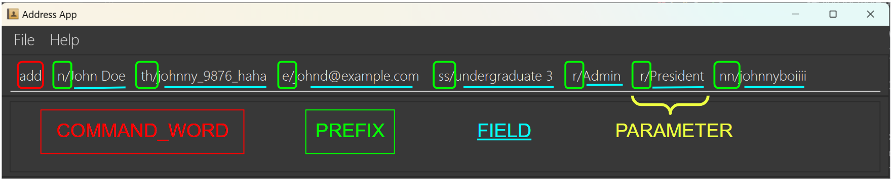
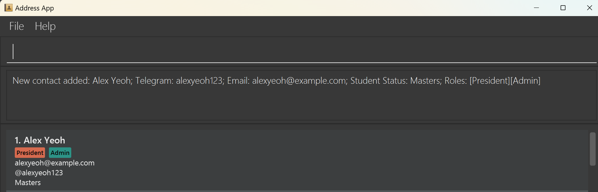
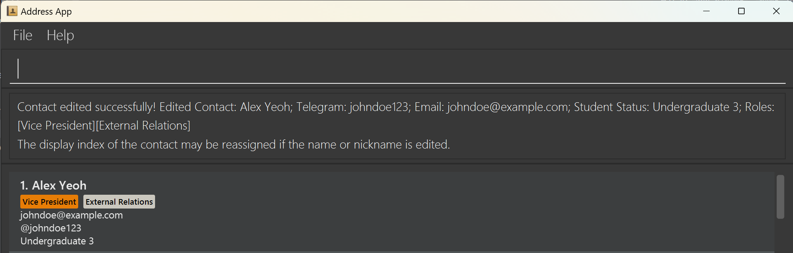
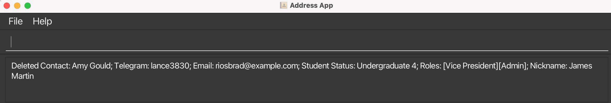
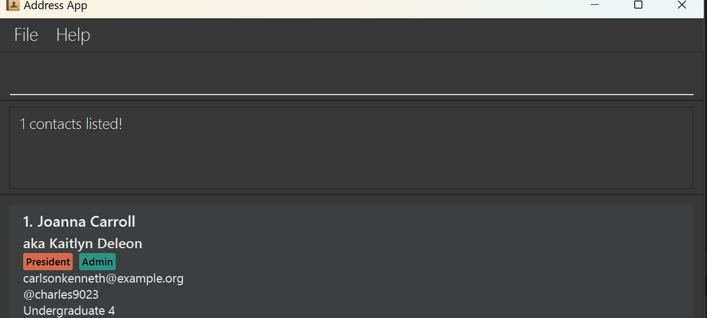
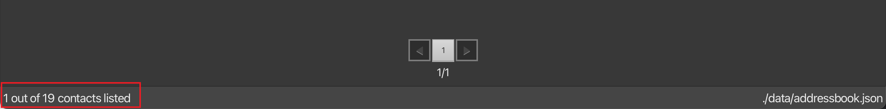
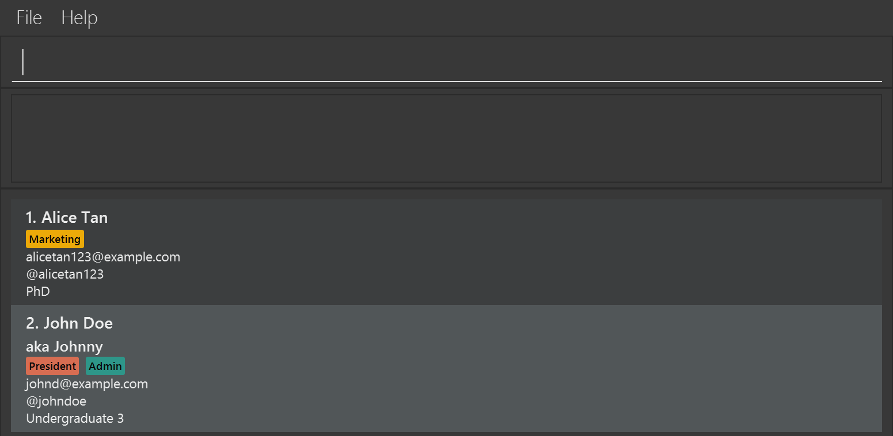

# data_coNdUctorS User Guide

data_coNdUctorS is a **desktop address book application for managing contact details of members in NUS Co-Curricular Activity groups (CCAs)**. It is optimized for use via a Command Line Interface (CLI) while still having the benefits of a Graphical User Interface (GUI). If you can type fast, data_coNdUctorS can get your contact management tasks done faster than traditional GUI apps.

//& SHOULD NOT EXPECT PEOPLE TO KNOW What IS CCA, yet...it's weird the full form

<!-- * Table of Contents -->
<page-nav-print/>

--------------------------------------------------------------------------------------------------------------------

## Quick start

1. Ensure you have Java `17` or above installed in your Computer.

2. Download the latest `.jar` file from [here](https://github.com/AY2425S1-CS2103-F09-1/tp/releases/tag/v1.5).

3. Copy the file to the folder you want to use as the _home folder_ for the application.

4. Open a command terminal, `cd` into the folder you put the jar file in, and use the `java -jar data_coNdUctorS.jar` command to run the application. A GUI similar to the below should appear in a few seconds. 
   
   
   Note how the app:
   * contains some sample data 
   * displays contacts in [alphabetical order]
   * utilises [Pagination] where 10 contacts are displayed per page at any one time 
   * shows both the total number of contacts stored in the app and the number of contacts listed in the displayed pages in the status bar footer
   

5. Type the command in the command box and press Enter to execute it. e.g. typing **`help`** and pressing Enter will open the help window. 
   Some example commands you can try:

    * `list` : Lists all contacts.

    * `add n/John Doe th/johnny_9876_haha ss/undergraduate 3 e/johnd@example.com r/Admin` : Adds a contact named `John Doe` to the Address Book.

    * `delete 3` : Deletes the 3rd contact shown in the current displayed list.

    * `clear` : Deletes all contacts.

    * `exit` : Exits the app.

6. Refer to [Command Summary](#command-summary) for a general overview of the commands available

7. Refer to [Features](#feature-details) below for the details of each command feature and UI features.

## Command summary
//& TO CHOOSE WHICH TABLE (PLEASE SEE VIA THE WEBSITE NOT BY .md). personally perfers that there should be a short descp.

| Action                                                                               | Format, Examples                                                                                                                                                                                                                                                                                       |
|--------------------------------------------------------------------------------------|--------------------------------------------------------------------------------------------------------------------------------------------------------------------------------------------------------------------------------------------------------------------------------------------------------|
| **[Add](#adding-a-contact-add)** adds a contact                               | `add n/NAME th/TELEGRAM_HANDLE ss/STUDENT_STATUS e/EMAIL r/ROLE…​ [nn/NICKNAME]`   e.g., `add n/James Ho th/jamesho123 ss/undergraduate 3 e/jamesho@example.com r/Admin r/President`                                                                                                                |
| **[Edit](#editing-a-contact-edit)** edits a contact                           | `edit INDEX [n/NAME] [th/TELEGRAM_HANDLE] [e/EMAIL] [ss/STUDENT_STATUS] [r/ROLE]…​ [nn/NICKNAME]` `edit FULL_NAME [n/NAME] [th/TELEGRAM_HANDLE] [e/EMAIL] [ss/STUDENT_STATUS] [r/ROLE]…​ [nn/NICKNAME]`  e.g.,`edit 2 n/James Lee e/jameslee@example.com`   e.g.,`edit James Ho n/James Lee` |
| **[Delete](#deleting-a-contact-delete)** deletes a contact                    | `delete INDEX` e.g. `delete 3`    `delete FULL_NAME` e.g. `delete James Ho`   `delete n/FULL_NAME` e.g. `delete n/James Ho`                                                                                                                                                                      |
| **[Find ](#locating-contacts-by-contact-details-find)** shows specific contacts | `find [n/NAME] [th/TELEGRAM_HANDLE] [e/EMAIL] [ss/STUDENT_STATUS] [r/ROLE]…​ [nn/NICKNAME]`  e.g.,`find n/jam lee r/admin r/vice president nn/jl`                                                                                                                                                   |
| **[List](#listing-all-contacts-list)** shows all contacts                     | `list`                                                                                                                                                                                                                                                                                                 |
| **[Help](#viewing-help-help)** provides more details on commands' usage        | `help`                                                                                                                                                                                                                                                                                                 |
| **[Clear](#clearing-all-entries-clear)** clears all contacts                  | `clear`                                                                                                                                                                                                                                                                                                |
| **[Exit](#exiting-the-program-exit)** exits the app                           | `exit`                                                                                                                                                                                                                                                                                                 |

| Action                                                 | Function                        | Format, Examples                                                                                                                                                                                    |
|--------------------------------------------------------|---------------------------------|------------------------------------------------------------------------------------------------------------------------------------------------------------------------------------------------------------------------------------------------------------------------------------------------------|
| **[Add](#adding-a-contact-add)**                       | adds a contact                  | `add n/NAME th/TELEGRAM_HANDLE ss/STUDENT_STATUS e/EMAIL r/ROLE…​ [nn/NICKNAME]`   e.g., `add n/James Ho th/jamesho123 ss/undergraduate 3 e/jamesho@example.com r/Admin r/President`                                                                                                              |
| **[Edit](#editing-a-contact-edit)**                    | edits a contact                 | `edit INDEX [n/NAME] [th/TELEGRAM_HANDLE] [e/EMAIL] [ss/STUDENT_STATUS] [r/ROLE]…​ [nn/NICKNAME]` `edit FULL_NAME [n/NAME] [th/TELEGRAM_HANDLE] [e/EMAIL] [ss/STUDENT_STATUS] [r/ROLE]…​ [nn/NICKNAME]`  e.g.,`edit 2 n/James Lee e/jameslee@example.com`   e.g.,`edit James Ho n/James Lee` |
| **[Delete](#deleting-a-contact-delete)**               | deletes a contact               | `delete INDEX` e.g. `delete 3`    `delete FULL_NAME` e.g. `delete James Ho`   `delete n/FULL_NAME` e.g. `delete n/James Ho`                                                                                                                                                                    |
| **[Find](#locating-contacts-by-contact-details-find)** | finds specific contact          | `find [n/NAME] [th/TELEGRAM_HANDLE] [e/EMAIL] [ss/STUDENT_STATUS] [r/ROLE]…​ [nn/NICKNAME]`  e.g.,`find n/jam lee r/admin r/vice president nn/jl`                                                                                                                                                 |
| **[List](#listing-all-contacts-list)**                 | displays all contacts | `list`                                                                                                                                                                                                                                                                                               |
| **[Help](#viewing-help-help)**                         | explains commands      | `help`                                                                                                                                                                                                                                                                                               |
| **[Clear](#clearing-all-entries-clear)**               | clears all contacts             | `clear`                                                                                                                                                                                                                                                                                              |
| **[Exit](#exiting-the-program-exit)**                  | exits the app                   | `exit`                                                                                                                                                                                                                                                                                               |

--------------------------------------------------------------------------------------------------------------------

## Feature Details
//& CHECK IF REPLACING PARAMETERS WITH FIELDS MAKE SENSE  
//& MIGHT WANT TO KEEP PARAMETERS, esp. on the part on any order. IF SO, TO UPDATE PICTURE

### General Notes about command format
<box type="info" seamless>

### General Notes about command format
**General Notes about the command format:** 
* Terminologies used to refer to a specific part of the command format are shown below:

* Words in `UPPER_CASE` are the **fields** ~~parameters~~ to be supplied by the user. 
  e.g. in `add n/NAME`, `NAME` is a **field** ~~parameter~~ which can be used as `add n/John Doe`.

* Items in square brackets are optional. 
  e.g `n/NAME [nn/NICKNAME]` can be used as `n/John Doe nn/johnnyboiiii` or as `n/John Doe`.

* Items with `…`​ after them can be used from one to multiple times. 
  e.g. `[r/ROLE]…​` can be used twice as `r/External r/Marketing` etc.

* Parameters can be in any order. 
  e.g. if the command specifies `n/NAME e/EMAIL`, `e/EMAIL n/NAME` is also acceptable.

* Extraneous parameters **//& OR FIELDS? BUT SOUND WEIRD** for commands that do not take in parameters (such as `exit` and `clear`) will be ignored. 
  e.g. if the command specifies `exit 123`, it will be interpreted as `exit`. 
//& ARE HELP AND LIST CONSIDERED "COMMANDS THAT DO NOT TAKE IN PARAMETERS?"

* The COMMAND_WORD is case-insensitive. (eg. add; ADD; aDd are all interpreted as ADD FEATURE)

* If you are using a PDF version of this document, be careful when copying and pasting commands that span multiple lines as space characters surrounding line-breaks may be omitted when copied over to the application.
  </box>

### Adding a contact: `add`

Adds a contact to the address book. (labels do not need to be in order, NICKNAME is optional)
//& LABELS OR PARAMETERS?

Format:
* `add n/NAME th/TELEGRAM_HANDLE e/EMAIL s/STUDENT_STATUS r/ROLE…​ [nn/NICKNAME]`

<box type="tip" seamless>

**Tip:** A contact can have one to many roles which match one of the following
1. President
2. Vice President
3. Admin
4. Marketing
5. Events (Internal)
6. Events (External)
7. External Relations
</box>

Examples:
* `add n/John Doe th/johndoe e/johnd@example.com ss/undergraduate 3 r/Admin r/President nn/altName`
* `add n/Betsy Crowe th/betsycrowe e/betsycrowe@example.com ss/masters r/President r/Admin`
* `add n/Alex Yeoh th/alexyeoh123 e/alexyeoh@example.com ss/masters r/President r/Admin`

### Editing a contact: `edit`

Edits an existing contact in the address book.
In both methods below:
* At least one of the optional fields must be provided.
* Existing values will be updated to the input values.
* When editing roles, the existing roles of the contact will be removed i.e adding of roles is not cumulative.

#### Edit by index
* Edits the contact at the specified `INDEX`. The index refers to the index number shown in the displayed contact list. The index **must be a positive integer** 1, 2, 3, …​

Format: `edit INDEX [n/NAME] [th/TELEGRAM_HANDLE] [e/EMAIL] [ss/STUDENT_STATUS] [r/ROLE]…​ [nn/NICKNAME]`

Examples:
*  `edit 1 th/johndoe123 e/johndoe@example.com` Edits the telegram handle and email address of the 1st displayed contact to be `johndoe123` and `johndoe@example.com` respectively.
*  `edit 2 r/Admin r/President` Edits the roles of the 2nd displayed contact to be Admin and President, this removes all existing roles user has.

//& ACTUALLY IS IT CONSIDERED INCONSISTENT IF WE SOMETIMES WRITE NAME, THEN ALSO FULL_NAME? Might want to say FULL_NAME as indicated in the NAME field? 
#### Edit by name
* Edits the contact specified by `FULL_NAME`. 
* The `FULL_NAME` has to be an exact match to an existing contact.
* The `FULL_NAME` is non-case-sensitive.

Format `edit FULL_NAME [n/NAME] [th/TELEGRAM_HANDLE] [e/EMAIL] [ss/STUDENT_STATUS] [r/ROLE]…​ [nn/NICKNAME]`

Examples:
*  `edit alex yeoh th/johndoe123 e/johndoe@example.com` Edits the telegram handle and email address of the contact `Alex Yeoh` to be `johndoe123` and `johndoe@example.com` respectively.

Note:
* `FULL_NAME` refers to the full name of contact in the address book (to edit) while `n/NAME` is an input to change the name to (to change to).
* `edit` command will fail if you enter a duplicate field as seen below under [invalid contacts](#what-is-considered-as-invalid-contacts)

### Deleting a contact: `delete`

Deletes the specified contact from the address book.

#### Delete by index
Format: `delete INDEX`

* Deletes the contact at the specified `INDEX`.
* The index refers to the index number shown in the displayed contact list.
* The index **must be a positive integer** 1, 2, 3, …​

Examples:
* `list` followed by `delete 2` deletes the 2nd contact in the address book.
* `find n/alex` followed by `delete 1` deletes the 1st contact in the results of the `find` command.
  

#### Delete by name
Format `delete NAME` or `delete n/NAME`

* Delete the contact whose name matches the specified `NAME`.
* The `NAME` has to be an exact match.
* The `NAME` is non-case-sensitive.

Examples:
* Both `delete Amy Gould` and `delete n/Amy Gould` delete the user whose name is `Amy Gould` (non-case-sensitive) in the address book.
  

<box type="tip" seamless>

**Tip:** How to edit / delete contacts by full names when more than 1 contact has the same name? 
//& write the content here, ISSUE 262
//& indicate the fact you can literally find: ISSUE 272

</box>

### Locating contacts by contact details: `find`

//& ISSUE 261

Finds contacts whose details matches all given fields.

Format: `find [n/NAME] [th/TELEGRAM_HANDLE] [e/EMAIL] [ss/STUDENT_STATUS] [r/ROLE]…​ [nn/NICKNAME]`

* Role field `[r/ROLE]`:
    * Can be repeated any number of times e.g. `find r/Vice President r/Admin` &rarr; valid
    * Have to take a valid role value (Refer to **Tip** section above in [adding a contact](#adding-a-contact-add)) 
      e.g. `find r/pres` &rarr; invalid 
      e.g. `find r/President` &rarr; valid
    * Case-insensitive e.g. `find r/pResiDent` &rarr; valid
    * Only perfect matches returned
* All other fields `[n/NAME] [th/TELEGRAM_HANDLE] [e/EMAIL] [ss/STUDENT_STATUS] [nn/NICKNAME]`:
    * Can be used at most once e.g. `find n/Hans n/Bo` &rarr; invalid
    * Case-insensitive. e.g. query `hans` will match `Hans`
    * The order of the keywords does not matter. e.g. query `Hans Bo` will match `Bo Hans`
    * Substring matching e.g. query `Han` will match `Hans`, but query `Hans` will not match `Han`
    * Each keyword is treated as a separate substring e.g. query `Hans Ansbo` will match `Hansbo`
    * Contacts matching only one keyword will not be returned (i.e. `AND` search).
      e.g. query `Hans Bo` will match `Hans Boey` and `Hans Jobo` but not `Hans Gruber`

Examples:
* `find n/john` returns `Johnny Tan` and `John Doe` 
* `find n/harlot olive ss/masters` returns `Charlotte Oliveiro`, who holds the student status `masters` 
* `find r/Admin r/President` returns `Joanna Carroll` who holds both roles, but not `Alex Yeoh` who only holds the role `Admin` 
  
//& ISSUE 292: It seems that it is already written here...MAYBE we need to make this BIGGEr, more OBVIOUS?

### Listing all contacts: `list`

Shows a list of all contacts in the address book.

Format: `list`

Note: Slight variations to the format are still accepted, so long as the first word remains to be `list` and the words behind the do not contain any characters other than whitespaces, `all` , or `contacts`.  
Possible example of slight variations:
* `list all`
* `list contacts`
* `list all contacts`
//& repharse to include another command format- ISSUE 250

* <box type="info" seamless>

**Information:** Alphabetical Sorting? 

</box>

### Viewing help: `help`

Shows a message explaning how to access the help page.

Format: `help`

This also prompts the user to do `help [COMMAND_WORD]` where COMMAND_WORD refers to:
* `add`
* `edit`
* `delete`
* `find`
* `list`
* `clear`
* `exit`

From this, the user can get quick reminder on how to use the various commands without having to refer to the User Guide

### Clearing all entries: `clear`

Clears all entries from the address book.

Format: `clear`

### Exiting the program: `exit`

Exits the program.

Format: `exit`

### Displaying contacts in pages -- Pagination

The app comes with a pagination at the bottom of the list. It supports navigation to a specific page or navigation to
the next or previous page. Each page contains a maximum of **10** items. The pagination supports a maximum of **10** pages
being displayed at one time, to access more pages, one can go to the last page and clicks on `NEXT` page button to access other pages.

Alternatively, users can make use of left and right arrow keys on the keyboard to navigate to the previous and next page. To do this, users need to make sure
that they have at least one click on the pagination before using keyboard to make sure that the app is focusing on the pagination component.

Pagination UI:

### Showing total number of contacts -- Footer status bar

A status bar that contains information about the number of contacts in the list and the address book data file path is attached as a footer
at the bottom of the app. It shows the total number of contacts being listed in the app.

Examples:
* `find n/Adam` may show only 1 contact out of 19.
  

<box type="definition" seamless>

**Definition:** List / show
//& defines what is per page, displayed, full complete list (consider putting at the front also) ISSUE 267
   </box>

### Saving the data

AddressBook data are saved in the hard disk automatically after any command that changes the data. There is no need to save manually.

### Editing the data file

AddressBook data are saved automatically as a JSON file `[JAR file location]/data/addressbook.json`. Advanced users are welcome to update data directly by editing that data file.

<box type="warning" seamless> //& SETTLE FORMATTING LATER
    **Caution:**  If your changes to the data file makes its format invalid, AddressBook will discard all data and start with an empty data file at the next run.  Hence, it is recommended to take a backup of the file before editing it.
    Furthermore, certain edits can cause the AddressBook to behave in unexpected ways (e.g., if a value entered is outside the acceptable range). Therefore, edit the data file only if you are confident that you can update it correctly.
</box>

--------------------------------------------------------------------------------------------------------------------

//& TO REVIEW IF EDITS IS OKAY
## What is considered as invalid contacts

There must not be duplicate fields. For example, if there are contacts with the following data:

`n/John Doe th/johndoe e/johnd@example.com ss/undergraduate 3 r/Admin r/President nn/Johnny`  
`n/Zachary Tan th/zac_Tan e/zacTan@example.com ss/phd r/Marketing`

 //& NEED TO CHANGE PICTURE IF EDITS ARE OKAY

//& ADDRESSING ISSUE 235, 252
The follow cases will fail / succeed if you try to enter an add / edit command with the following fields: 
1. Must not have same `Name` and `Nickname`, but can have same `Name` and different `Nickname`. Nickname must be **unique**. Names cannot be the same name if both contacts have no nickname (i.e. empty nicknames)
    * **Fail:** `n/John Doe nn/Johnny ...` &rarr; there is already a Name John Doe and Nickname Johnny
    * **Fail:** `n/Jane Hoe nn/Johnny ...` &rarr; there is already a Nickname Johnny
    * **Success:** `n/John Doe nn/notJohnny ...` &rarr; same Name but different Nickname is allowed
    * **Fail:** `n/Zachary Tan ...` &rarr; &rarr; same Name and both having no Nickname are not allowed
//& SHOULD RECONSIDER PRESENTATION OF INFORMATION HMM

2. Must not have the same `Telegram Handle`. Each Telegram Handle must be **unique**
    * **Fail:** `th/johndoe ...`
3. Must not have the same `Email`. Each Email must be **unique**
    * **Fail:** `e/johnd@example.com ...`
4. Must not have more than one `Role` labelled as `President`. Can only have one `President`
    * **Fail:** `r/Admin r/President ...`

## Valid Contact Fields

| Field                                   | Prefix* | Valid examples                                                                                                      |
|-----------------------------------------|---------|---------------------------------------------------------------------------------------------------------------------|
| [**NAME**](#name)                       | `n/`    | `Gina Tan`  `Jane Smith @ Jones`  `Ravi S/O Ramasamy`  `Devi D/O Rajaratnam`  `Janelle Wong (Jane)` |
| [**TELEGRAM HANDLE**](#telegram-handle) | `th/`   | `ginatan123`  `jane_smith28`                                                                                    |
| [**EMAIL**](#email)                     | `e/`    | `gina_tan@example-website.com.sg`                                                                                   |
| [**STUDENT STATUS**](#student-status)   | `ss/`   | `Undergraduate 3`  `Masters`  `PhD`                                                                     |
| [**ROLE**](#role)                       | `r/`    | `President`  `Events (External)`                                                                                |
| [**NICKNAME**](#nickname)               | `nn/`   | `genie34 ;)`                                                                                                        |

*_By default, all fields must be non-empty when prefix is specified except for nickname field_ //& CHECK IF OKAY

### Name
- Must contain alphabets and spaces only, with the following exceptions:
    - `@`, `S/O`, `D/O` in the middle of the name is allowed. e.g.`Ravi S/O Ramasamy`
    - `(INSERT_NAME)` at the end of the name is allowed. e.g. `Gianna (Gian)`
- Must not be blank

### Telegram Handle
- Must contain alphabets, numbers and underscores only.
- Must have a length between 5 and 32 characters inclusive.
- Must not include `@`.

### Email
- Emails must be of the format `LOCAL_PART@DOMAIN`.
- LOCAL_PART 
  - Must only contain alphabets, numbers, and special characters `+_.-`.
  - Must not start or end with any special characters.
- DOMAIN //& EDIT TO ADDRESS ISSUE 247 and 278
  - Domains must be made up of domain labels separated by periods.
  - Domains must end with a domain label at least 2 characters long.
  - Each domain label must only contain alphabets, numbers, and `-`, if any.
  - Each domain label must not start or end with `-`.

### Student Status
- Must take one of the following values:
  1. `Undergraduate x` (where x is an integer between 1 and 6 inclusive).
  2. `Masters`
  3. `PhD`

### Role
- Each contact may take on multiple roles.
- Each role must take one of the following values:
  1. `President`
  2. `Vice President`
  3. `Admin`
  4. `Marketing`
  5. `Events (Internal)`
  6. `Events (External)`
  7. `External Relations`

<box type="info" seamless>

**Information:** Role Sorting? (it's not just about name by further extention)
&// ISSUE 285
</box>

### Nickname
- Is an optional field.

<box type="tip" seamless>

**Tip:** Case sensitivity issues? (it's not just about name by further extention)
&// ISSUE 285
</box>
--------------------------------------------------------------------------------------------------------------------

## FAQ

**Q**: How do I transfer my data to another Computer? 
**A**: Install the app in the other computer and overwrite the empty data file it creates with the file that contains the data of your previous AddressBook home folder.

--------------------------------------------------------------------------------------------------------------------

## Known issues

1. **When using multiple screens**, if you move the application to a secondary screen, and later switch to using only the primary screen, the GUI will open off-screen. The remedy is to delete the `preferences.json` file created by the application before running the application again.
