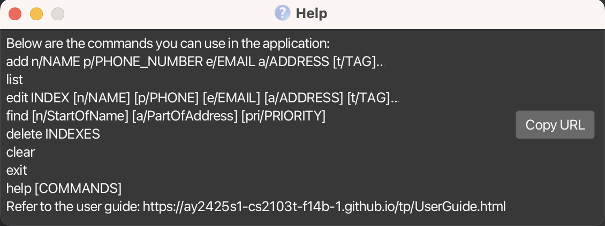
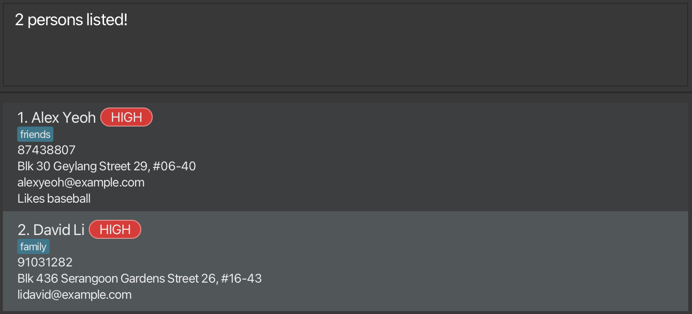

# SocialBook User Guide

AddressBook Level 3 (AB3) is a **desktop app for managing contacts, optimized for use via a  Line Interface** (CLI) while still having the benefits of a Graphical User Interface (GUI). If you can type fast, AB3 can get your contact management tasks done faster than traditional GUI apps.

<!-- * Table of Contents -->
<page-nav-print />

--------------------------------------------------------------------------------------------------------------------

## Quick start

1. Ensure you have Java `17` or above installed in your Computer.

1. Download the latest `.jar` file from [here](https://github.com/se-edu/addressbook-level3/releases).

1. Copy the file to the folder you want to use as the _home folder_ for your AddressBook.

1. Open a command terminal, `cd` into the folder you put the jar file in, and use the `java -jar addressbook.jar` command to run the application. 
   A GUI similar to the below should appear in a few seconds. Note how the app contains some sample data. 
   

1. Type the command in the command box and press Enter to execute it. e.g. typing **`help`** and pressing Enter will open the help window. 
   Some example commands you can try:

   * `list` : Lists all contacts.

   * `add n/John Doe p/98765432 e/johnd@example.com a/John street, block 123, #01-01` : Adds a contact named `John Doe` to the Address Book.

   * `delete 3` : Deletes the 3rd contact shown in the current list.

   * `clear` : Deletes all contacts.

   * `exit` : Exits the app.

1. Refer to the [Features](#features) below for details of each command.

--------------------------------------------------------------------------------------------------------------------

## Features

<box type="info" seamless>

**Notes about the command format:** 

* Words in `UPPER_CASE` are the parameters to be supplied by the user. 
  e.g. in `add n/NAME`, `NAME` is a parameter which can be used as `add n/John Doe`.

* Items in square brackets are optional. 
  e.g `n/NAME [t/TAG]` can be used as `n/John Doe t/friend` or as `n/John Doe`.

* Items with `…`​ after them can be used multiple times including zero times. 
  e.g. `[t/TAG]…​` can be used as ` ` (i.e. 0 times), `t/friend`, `t/friend t/family` etc.

* Parameters can be in any order. 
  e.g. if the command specifies `n/NAME p/PHONE_NUMBER`, `p/PHONE_NUMBER n/NAME` is also acceptable.

* Extraneous parameters for commands that do not take in parameters (such as `help`, `list`, `statistics`, `exit` and `clear`) will be ignored. 
  e.g. if the command specifies `help 123`, it will be interpreted as `help`.

* If you are using a PDF version of this document, be careful when copying and pasting commands that span multiple lines as space characters surrounding line-breaks may be omitted when copied over to the application.
</box>

### Viewing help : `help`

Shows a message explaining how to access the help page or display how to use a specified command.

Format: `help [COMMAND]`

Examples:
* `help` 
* `help add`
* `help edit`

### Adding a person: `add`

Adds a person to the address book.

Format: `add n/NAME p/PHONE_NUMBER e/EMAIL a/ADDRESS [t/TAG]…​`

<box type="tip" seamless>

**Tip:** A person can have any number of tags (including 0)
</box>

Examples:
* `add n/John Doe p/98765432 e/johnd@example.com a/John street, block 123, #01-01`
* `add n/Betsy Crowe t/friend e/betsycrowe@example.com a/Newgate Prison p/1234567 t/criminal`

### Listing all persons : `list`

Shows a list of all persons in the address book, automatically sorted by their priority from HIGH to LOW.

Format: `list`

### Editing a person : `edit`

Edits an existing person in the address book.

Format: `edit INDEX [n/NAME] [p/PHONE] [e/EMAIL] [a/ADDRESS] [t/TAG]…​`

* Edits the person at the specified `INDEX`. The index refers to the index number shown in the displayed person list. The index **must be a positive integer** 1, 2, 3, …​
* At least one of the optional fields must be provided.
* Existing values will be updated to the input values.
* When editing tags, the existing tags of the person will be removed i.e adding of tags is not cumulative.
* You can remove all the person’s tags by typing `t/` without
    specifying any tags after it.

Examples:
*  `edit 1 p/91234567 e/johndoe@example.com` Edits the phone number and email address of the 1st person to be `91234567` and `johndoe@example.com` respectively.
*  `edit 2 n/Betsy Crower t/` Edits the name of the 2nd person to be `Betsy Crower` and clears all existing tags.

### Finding persons: `find`

Finds persons that match the specified filters.

Format: `find [n/StartOfName] [a/PartOfAddress] [pri/PRIORITY]`

* The search is case-insensitive. e.g `n/alex` will match `Alex`.
* For names, only those that start with the given filter will be matched e.g. find n/A returns all persons whose first name starts with A only. 
* For addresses, those that contain the given filter are returned e.g. find a/clementi returns all persons who stay at clementi only.
* For priorities, exact priorities must be specified to filter accurately e.g. find pri/high returns all persons with high priority only.
* At least one filter must be specified.
* To specify multiple filters of the same type, use the corresponding prefix for every new filter e.g. find n/alex n/david n/bobby
* Per type of prefix, all persons matching any of the filters given will be returned (i.e. `OR`search) but when combined, only those who also pass the filters of other types are are returned (i.e. `AND` search) e.g. find n/A n/B pri/HIGH returns all persons whose name starts with either A or B but have high priority. 

Examples:
* `find n/John` returns `john` and `John Doe`
* `find n/alex n/david pri/high` returns `Alex Yeoh`, `David Li` 
  

### Deleting people : `delete`

Deletes the specified people from the address book.

Format: `delete INDEXES`

* Deletes the people at the specified `INDEXES`.
* The indexes refer to the index numbers shown in the displayed person list.
* The indexes **must be a positive integer** 1, 2, 3, …​
* The indexes can be in **any order** so long as all the indexes fall within the size of the current list.
* Duplicated valid index inputs would be treated as unique index inputs.

Examples:
* `list` followed by `delete 2,3` or `delete 3,2` deletes the 2nd and 3rd person in the address book.
* `find Betsy` followed by `delete 1` deletes the 1st person in the results of the `find` command.
* list followed by delete 1,1,2 deletes the 1st and 2nd person from current SocialBook.

### Getting the parameters of these people: `get` 
Gets the specified parameters of each individual person in current person list.

Format: `get PARAMETERS`

* The only valid parameters are: name, phone, email, address.
* Parameters are not case sensitive, which means `get PHONE name` will return phone number and name details too.
* All inputted parameters must be valid for the details to be displayed. 
* The details will be displayed in the order of the inputted parameters.
* Executing the same parameter multiple times in the same command will still only return one set of that detail.

Examples:
* `list` followed by `get phone EMAIL` gets the phone numbers followed by the emails of the people in SocialBook.
* `list` followed by `get pHone phone` gets only one set of the phone numbers of the people in SocialBook.
* `find pri/HIGH` followed by `get nAmE ADDress` gets the names followed by the addresses of the high priority people.

### Clearing all entries : `clear`

Clears all entries from the address book.

Format: `clear`

### Displaying overall statistics : `statistics`

Displays the statistics of current person list.

Statistics include: 
* Number of People
* Number of HIGH Priority People
* Number of MEDIUM Priority People
* Number of LOW Priority People
* Number of People With Monthly Household Income < 2500
* Number of Appointments Within a Week From Current Date

Format: `statistics`

### Displaying eligible schemes : `scheme`

Displays the schemes that specified people from the address book are eligible for.

Format: `scheme INDEXES`

* Displays the schemes that the people at the specified `INDEXES` are eligible for.
* The indexes refer to the index numbers shown in the displayed person list.
* The indexes **must be a positive integer** 1, 2, 3, …​
* Only 1 index can be inputted at a time.

Examples:
* `scheme 1` shows scheme that the 1st person in the address book is eligible for.

### Exiting the program : `exit`

Exits the program.

Format: `exit`

### Saving the data

AddressBook data are saved in the hard disk automatically after any command that changes the data. There is no need to save manually.

### Editing the data file

AddressBook data are saved automatically as a JSON file `[JAR file location]/data/addressbook.json`. Advanced users are welcome to update data directly by editing that data file.

<box type="warning" seamless>

**Caution:**
If your changes to the data file makes its format invalid, AddressBook will discard all data and start with an empty data file at the next run.  Hence, it is recommended to take a backup of the file before editing it. 
Furthermore, certain edits can cause the AddressBook to behave in unexpected ways (e.g., if a value entered is outside the acceptable range). Therefore, edit the data file only if you are confident that you can update it correctly.
</box>

### Archiving data files `[coming in v2.0]`

_Details coming soon ..._

--------------------------------------------------------------------------------------------------------------------

## FAQ

**Q**: How do I transfer my data to another Computer? 
**A**: Install the app in the other computer and overwrite the empty data file it creates with the file that contains the data of your previous AddressBook home folder.

--------------------------------------------------------------------------------------------------------------------

## Known issues

1. **When using multiple screens**, if you move the application to a secondary screen, and later switch to using only the primary screen, the GUI will open off-screen. The remedy is to delete the `preferences.json` file created by the application before running the application again.
2. **If you minimize the Help Window** and then run the `help` command (or use the `Help` menu, or the keyboard shortcut `F1`) again, the original Help Window will remain minimized, and no new Help Window will appear. The remedy is to manually restore the minimized Help Window.

--------------------------------------------------------------------------------------------------------------------

## Command summary

Action           | Format, Examples
-----------------|----------------------------------------------------------------------------------------------------------------------------------------------------------------------
**Add**          | `add n/NAME p/PHONE_NUMBER e/EMAIL a/ADDRESS [t/TAG]…​`   e.g., `add n/James Ho p/98765432 e/jamesho@example.com a/123, Clementi Rd, 1234665 t/friend t/colleague`
**Clear**        | `clear`
**Delete**       | `delete INDEXES`  Indexes are the index of the person in the person list  e.g., `delete 2,3`
**Edit**         | `edit INDEX [n/NAME] [p/PHONE_NUMBER] [e/EMAIL] [a/ADDRESS] [t/TAG]…​`  e.g.,`edit 2 n/James Lee e/jameslee@example.com`
**Find**         | `find KEYWORD [MORE_KEYWORDS]`  e.g., `find James Jake`
**Get**          | `get PARAMETERS`  e.g.,`get email phone`
**List**         | `list`
**Statistics**   | `statistics`   Shows general statistics
**Help**         | `help`
