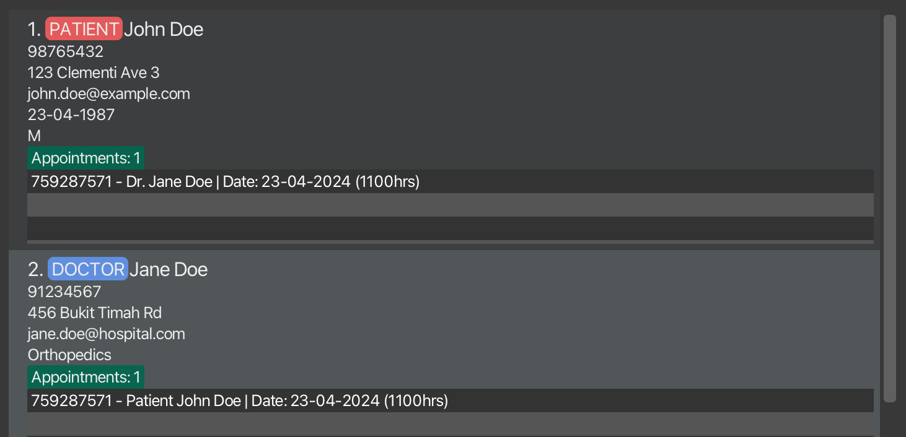

MediContacts is a **desktop app for managing contacts of patients and doctors**, as well as **keeping track of their appointments.**  

It is **optimised for use via a Command Line Interface** (CLI) while still having the benefits of a Graphical User Interface (GUI). If you can type fast, MediContacts can not only get your contact management tasks done faster than traditional systems adopted by clinics, but also efficiently keep track of appointments between registered doctors and patients.

* Table of Contents
{:toc}

--------------------------------------------------------------------------------------------------------------------

## Command summary

Action | Format (with examples)
--------|------------------
[**Help**](#viewing-help-help) | `help`
[**Add Doctor**](#adding-a-doctor-add-doctor) | `add-doctor n/NAME p/PHONE_NUMBER e/EMAIL a/ADDRESS s/SPECIALTY [t/TAG]…​`    e.g. `add-doctor n/Jane Doe p/91234567 e/janedoe@example.com a/456 Clementi Ave 3 s/Cardiology t/colleague`
[**Add Patient**](#adding-a-patient-add-patient) | `add-patient n/NAME p/PHONE_NUMBER e/EMAIL a/ADDRESS d/DATE_OF_BIRTH g/GENDER [t/TAG]…​`    e.g. `add-patient n/John Doe p/98765432 e/johndoe@example.com a/123 Sengkang Drive 4 d/23-04-1950 g/M t/elderly`
[**Add Appointment**](#adding-an-appointment-add-appt) | `add-appt pn/PATIENT_NAME dn/DOCTOR_NAME d/DATE t/TIME`    e.g. `add-appt pn/John Doe dn/Jane Doe d/23-04-2024 t/1100`
[**Delete Appointment**](#deleting-an-appointment-delete-appt) | `delete-appt UNIQUE_ID`    e.g. `delete-appt 1355`
[**List**](#listing-all-persons-list) | `list`
[**List Doctors**](#listing-all-doctors-list-doctor) | `list-doctor`
[**List Patients**](#listing-all-patients-list-patient) | `list-patient`
[**Find**](#finding-persons-by-name-find) | `find KEYWORD [MORE_KEYWORDS]`    e.g. `find Jane Doe`
[**Find Doctor**](#finding-doctors-by-name-find-doctor) | `find-doctor KEYWORD [MORE_KEYWORDS]`    e.g. `find-doctor Jane Doe`
[**Find Patient**](#finding-patients-by-name-find-patient) | `find-patient KEYWORD [MORE_KEYWORDS]`    e.g. `find-patient John Doe`
[**Delete**](#deleting-a-person-delete) | `delete INDEX`    e.g. `delete 3`
[**Clear**](#clearing-all-entries-clear) | `clear`
[**Exit**](#exiting-the-program-exit) | `exit`

--------------------------------------------------------------------------------------------------------------------

## Quick start

1. Ensure you have Java `17` or above installed in your Computer.

2. Download the latest `.jar` file from [here](https://github.com/AY2425S1-CS2103T-T09-3/tp/releases).

3. Copy the file to the folder you want to use as the _home folder_ for your MediContacts App.

4. Open a command terminal, `cd` into the folder you put the jar file in, and use the `java -jar MediContacts.jar` command to run the application. You may refer to the following video tutorials on how to run JAR files:
    - [For Windows](https://www.youtube.com/watch?v=hv0UhoaA0eo) (Watch from 0:47 onwards)
    - [For macOS](https://www.youtube.com/watch?v=GspNQbJLfag) (Watch from 2:23 onwards)
    - [For Linux](https://www.youtube.com/watch?v=DVD9DIxs9Lo) (Watch full video)

    A GUI similar to that below should appear in a few seconds. Note how the app will initially contain some sample data. 
   
   

5. Type the command in the command box and press _Enter_ to execute it. e.g. typing `help` and pressing _Enter_ will open the help window. 
   Here are some example commands you can try out:

   * `list`: Lists all contacts.

   * `list-doctor`: Lists all doctors.
   
   * `list-patient`: Lists all patients.

   * `add-doctor n/Jane Doe p/98765432 e/janedoe@example.com a/123 Clementi Ave 3 s/Orthopedics`: Adds a doctor named Jane Doe to the Address Book.
   
   * `add-patient n/John Doe p/98765432 e/johndoe@example.com a/123 Clementi Ave 3 d/23-04-1987 g/M`: Adds a patient named John Doe to the Address Book.

   * `add-appt pn/John Doe dn/Jane Doe d/23-12-2024 t/1100`: Adds an appointment between a patient named John Doe and a doctor named Jane Doe on 23rd December 2024 (1100hrs).

   * `delete-appt 1231996014`: Deletes the appointment with the unique ID `1231996014`. Refer to the UI screenshot above to know where to identify appointment IDs.  

   * `find John`: Finds contacts whose names contain the keyword `John`.

   * `find-doctor Jane`: Finds doctors whose names contain the keyword `Jane`.

   * `find-patient John`: Finds patients whose names contain the keyword `John`.

   * `delete 3`: Deletes the 3rd contact currently displayed in the list.
   
   * `clear`: Deletes all contacts.

   * `exit`: Exits the app.

6. Refer to the [Features](#features) below for details of each command.

--------------------------------------------------------------------------------------------------------------------

## Features

**:information_source: Notes about the command format:** 

* Words in `UPPER_CASE` are the parameters to be supplied by the user. 
  e.g. in `add-patient n/NAME`, `NAME` is a parameter which can be supplied as `add-patient n/John Doe`.

* Items in square brackets are optional. 
  e.g. `n/NAME [t/TAG]` can be used as `n/John Doe t/friend` or as `n/John Doe`.

* Items with `…`​ after them can be used multiple times including zero times. 
  e.g. `[t/TAG]…​` can be used as ` ` (i.e. 0 times), `t/friend`, `t/friend t/family` etc.

* Parameters can be in any order. 
  e.g. if the command specifies `n/NAME p/PHONE_NUMBER`, `p/PHONE_NUMBER n/NAME` is also acceptable.

* Extraneous parameters for commands that do not take in parameters (such as `help`, `list`, `exit` and `clear`) will be ignored. 
  e.g. if the command specifies `help 123`, it will be interpreted as `help`.

* If you are using a PDF version of this document, be careful when copying and pasting commands that span multiple lines as space characters surrounding line-breaks may be omitted when copied over to the application.

### Viewing help: `help`

Shows a message explaining how to access the help page.

Format: `help`

### Adding a doctor: `add-doctor`

Adds a doctor to the address book.

Format: `add-doctor n/NAME p/PHONE_NUMBER e/EMAIL a/ADDRESS s/SPECIALTY [t/TAG]…​`

:exclamation: **Caution:**
The parameter `NAME` only accepts alphabetic characters and spaces. The app will reject the input if it contains any other character or is blank.

**Examples:**
* `add-doctor n/Jane Doe p/98765432 e/janedoe@example.com a/123 Clementi Ave 3 s/Orthopedics`
* `add-doctor n/Jane Doe p/91234567 e/janedoe@example.com a/456 Clementi Ave 3 s/Cardiology t/colleague`

### Adding a patient: `add-patient`

Adds a patient to the address book.

Format: `add-patient n/NAME p/PHONE_NUMBER e/EMAIL a/ADDRESS d/DATE_OF_BIRTH g/GENDER [t/TAG]…​`

:exclamation: **Caution:**
The parameter `NAME` only accepts alphabetic characters and spaces. The app will reject the input if it contains any other character or is blank.

:exclamation: **Caution:**
The parameter `DATE` only accepts a valid date which is less than 32. For months with less than 31 days, entering a date that is too large but below 32 will be automatically corrected.
(e.g. 30-02-2024 will return 29-02-2024)

**Examples:**
* `add-patient n/John Doe p/98765432 e/johndoe@example.com a/123 Clementi Ave 3 d/23-04-1987 g/M`
* `add-patient n/John Doe p/91234567 e/johndoe@example.com a/456 Clementi Ave 3 d/01-05-1950 g/M t/elderly`

### Adding an appointment: `add-appt`

Adds an appointment between a doctor and patient, at a specified date and time, to the address book.

Format: `add-appt pn/PATIENT_NAME dn/DOCTOR_NAME d/DATE t/TIME`

:exclamation: **Caution:**
The parameter `PATIENT_NAME` and `DOCTOR_NAME` are case-sensitive, and must be an exact match of respective names in the address book. The app will reject the input if it contains unknown doctors or patients.

:exclamation: **Caution:**
The parameter `DATE` only accepts a valid date which is less than 32. For months with less than 31 days, entering a date that is too large but below 32 will be automatically corrected.
(e.g. 30-02-2024 will return 29-02-2024)

**Examples:**
* `add-appt pn/John Doe dn/Jane Doe d/23-04-2024 t/1100`

### Deleting an appointment: `delete-appt`

Deletes the specified appointment from the address book.

Format: `delete-appt UNIQUE_ID`

* Deletes the appointment tagged to the `UNIQUE_ID`.

**Examples:**
* `delete-appt 1231996014`

### Listing all persons: `list`

Shows a list of all persons in the address book.

Format: `list`

### Listing all doctors: `list-doctor`

Shows a list of all doctors in the address book.

Format: `list-doctor`

### Listing all patients: `list-patient`

Shows a list of all patients in the address book.

Format: `list-patient`

### Finding persons by name: `find`

Finds persons whose names contain any of the given keywords.

Format: `find KEYWORD [MORE_KEYWORDS]`

* The app will only search for persons with matching names.
* The search is case-insensitive. e.g. `hans` will match `Hans`
* Partial words will be matched e.g. `Hans B` will match `Hans Bo`
* The order of the keywords matter. e.g. `Hans Bo` will not match `Bo Hans`
* Only persons matching all keywords will be returned (i.e. `AND` search).
  e.g. `Hans Bo` will not match `Hans Gruber` or `Bo Yang`

:exclamation: **Caution:**
Keywords provided must only consist of alphabets. Any other character provided will give an invalid argument error.

**Examples:**
* `find jane` returns `Jane Doe`
* `find doe` returns `John Doe` and `Jane Doe` 
  

### Finding doctors by name: `find-doctor`

Finds doctors whose names contain any of the given keywords.

Format: `find-doctor KEYWORD [MORE_KEYWORDS]`

* The app will only search for doctors with matching names.
* The search is case-insensitive. e.g. `hans` will match `Hans`
* Partial words will be matched e.g. `Hans B` will match `Hans Bo`
* The order of the keywords matter. e.g. `Hans Bo` will not match `Bo Hans`
* Only doctors matching all keywords will be returned (i.e. `AND` search).
  e.g. `Hans Bo` will not match `Hans Gruber` or `Bo Yang`

:exclamation: **Caution:**
Keywords provided must only consist of alphabets. Any other character provided will give an invalid argument error.

**Examples:**
* `find-doctor jane` returns `Jane Doe`.
* `find-doctor jane doe` returns `Jane Doe`.

### Finding patients by name: `find-patient`

Finds patients whose names contain any of the given keywords.

Format: `find-patient KEYWORD [MORE_KEYWORDS]`

* The app will only search for patients with matching names.
* The search is case-insensitive. e.g. `hans` will match `Hans`
* Partial words will be matched e.g. `Hans B` will match `Hans Bo`
* The order of the keywords matter. e.g. `Hans Bo` will not match `Bo Hans`
* Only patients matching all keywords will be returned (i.e. `AND` search).
  e.g. `Hans Bo` will not match `Hans Gruber` or `Bo Yang`

:exclamation: **Caution:**
Keywords provided must only consist of alphabets. Any other character provided will give an invalid argument error.

**Examples:**
* `find-patient john` returns `John Doe`.
* `find-patient john doe` returns `John Doe`.

### Deleting a person: `delete`

Deletes the specified person from the address book.

Format: `delete INDEX`

* Deletes the person at the specified `INDEX`.
* The index refers to the index number shown in the currently displayed list.
* The index **must be a positive integer** 1, 2, 3, …​

**Examples:**
* `list-patient` followed by `delete 2` deletes the 2nd patient in the address book.
* `find-doctor Jane` followed by `delete 1` deletes the 1st doctor in the results of the `find-doctor` command.

### Clearing all entries: `clear`

Clears all entries from the address book.

Format: `clear`

### Exiting the program: `exit`

Exits the program.

Format: `exit`

### Saving the data

MediContacts data are saved in the hard disk automatically after any command modifies the data. There is no need for users to save manually.

### Editing the data file

MediContacts data are saved automatically as a JSON file `[WORKING DIRECTORY]/data/addressbook.json`, where [WORKING DIRECTORY] is the directory the user is running the jar file. Advanced users are welcomed to update the data directly by editing that data file.

:exclamation: **Caution:**
If your changes to the data file makes its format invalid, MediContacts will discard all data and start with an empty data file at the next run. Hence, it is recommended to save a backup of the file before editing it. 
Furthermore, certain edits can cause the app to behave in unexpected ways (e.g. if a value entered is outside the acceptable range). Therefore, edit the data file only if you are confident that you will update it correctly.

### Archiving data files `[coming in v2.0]`

_Details coming soon ..._

### Marking appointments: `mark` `[coming in v2.0]`

_Details coming soon ..._

### Unmarking appointments: `unmark` `[coming in v2.0]`

_Details coming soon ..._

### Listing appointments: `list-appt` `[coming in v2.0]`

_Details coming soon ..._

--------------------------------------------------------------------------------------------------------------------

## FAQ

**Q**: How do I transfer my data to another computer? 
**A**: Install the app in the other computer and overwrite the empty data file it creates there. Do this with the file that contains the data of your MediContacts app in your previous computer.

--------------------------------------------------------------------------------------------------------------------

## Known issues

1. **When using multiple screens**, if you move the application to a secondary screen, and later switch to using only the primary screen, the GUI will open off-screen. The remedy is to delete the `preferences.json` file created by the application before running the application again.
2. **If you minimize the Help Window** and then run the `help` command (or use the `Help` menu, or the keyboard shortcut `F1`) again, the original Help Window will remain minimized, and no new Help Window will appear. The remedy is to manually restore the minimized Help Window.

--------------------------------------------------------------------------------------------------------------------
