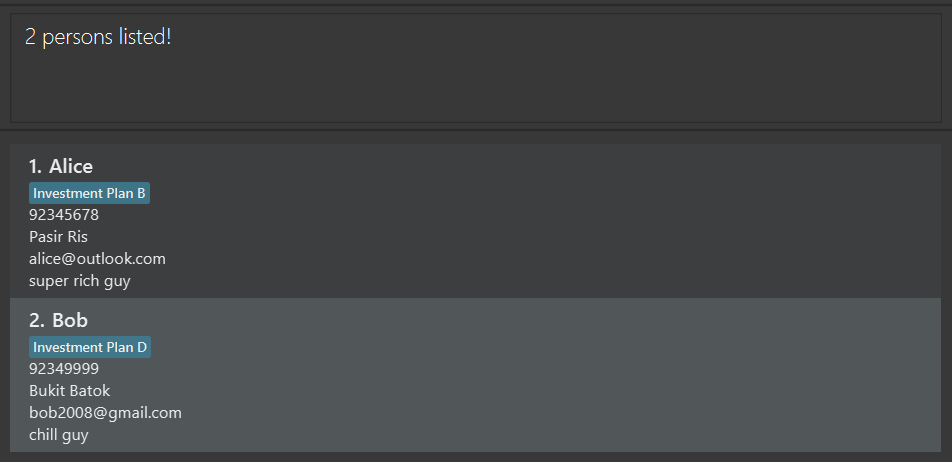
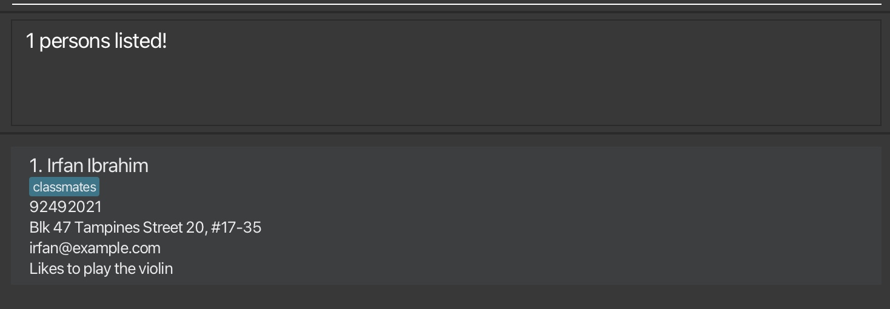
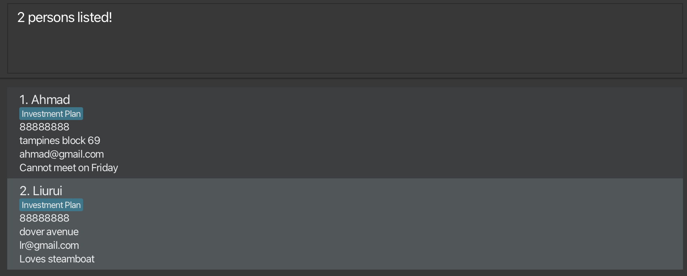
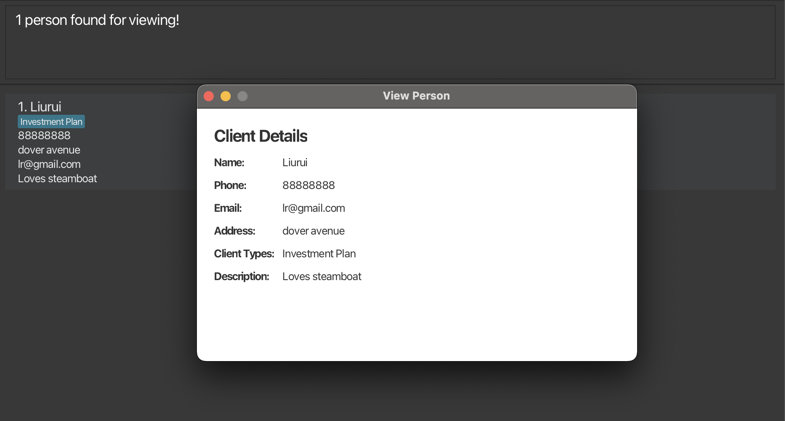

ClientHub is a **desktop app for managing contacts, optimized for use via a Command Line Interface** (CLI) while still having the benefits of a Graphical User Interface (GUI). If you can type fast, ClientHub can get your contact management tasks done faster than traditional GUI apps.

* Table of Contents
{:toc}

--------------------------------------------------------------------------------------------------------------------

## Quick start

1. Ensure you have Java `17` or above installed in your Computer.

1. Download the latest `.jar` file from [here](https://github.com/AY2425S1-CS2103T-F10-1/tp/releases).

1. Copy the file to the folder you want to use as the _home folder_ for your ClientHub.

1. Open a command terminal, `cd` into the folder you put the jar file in, and use the `java -jar clienthub.jar` command to run the application. 
   A GUI similar to the below should appear in a few seconds. Note how the app contains some sample data. 
   

1. Type the command in the command box and press Enter to execute it. e.g. typing **`help`** and pressing Enter will open the help window. 
   Some example commands you can try:

   * `list` : Lists all contacts.

   * `add n/John Doe p/98765432 e/johnd@example.com a/John street, block 123, #01-01 d/likes ramen` : Adds a contact named `John Doe` to the Client Hub.

   * `delete John Doe` : Deletes John Doe from the Client Hub.

   * `clear` : Deletes all contacts.

   * `exit` : Exits the app.

1. Refer to the [Features](#features) below for details of each command.

--------------------------------------------------------------------------------------------------------------------

## Features

**:information_source: Notes about the command format:** 

* Words in `UPPER_CASE` are the parameters to be supplied by the user. 
  e.g. in `add n/NAME`, `NAME` is a parameter which can be used as `add n/John Doe`.

* Items in square brackets are optional. 
  e.g `n/NAME [c/CLIENT_TYPE]` can be used as `n/John Doe c/Plan A` or as `n/John Doe`.

* Items with `…`​ after them can be used multiple times including zero times. 
  e.g. `[c/CLIENT_TYPE]…​` can be used as ` ` (i.e. 0 times), `c/Plan A`, `c/Plan A c/Plan B` etc.

* Parameters can be in any order. 
  e.g. if the command specifies `n/NAME p/PHONE_NUMBER`, `p/PHONE_NUMBER n/NAME` is also acceptable.

* Extraneous parameters for commands that do not take in parameters (such as `help`, `list`, `exit` and `clear`) will be ignored. 
  e.g. if the command specifies `help 123`, it will be interpreted as `help`.

* If you are using a PDF version of this document, be careful when copying and pasting commands that span multiple lines as space characters surrounding line-breaks may be omitted when copied over to the application.

### Viewing help : `help`

Shows a message explaning how to access the help page.

Format: `help`

### Adding a person: `add`

Adds a person to the Client Hub.

Format: `add n/NAME p/PHONE_NUMBER e/EMAIL a/ADDRESS c/CLIENT_TYPE d/DESCRIPTION…​`

:bulb: **Tip:**
A contact can have any number of Client Type (including 0)

Examples:
* `add n/John Doe p/98765432 e/johnd@example.com a/John street, block 123, #01-01 c/Plan A d/likes bubble tea`
* `add n/Betsy Crowe p/1234567 e/betsycrowe@example.com a/Yishun Town c/Plan A c/Plan B d/Loves travelling`

### Listing all persons : `list`

Shows a list of all persons in the Client Hub.

Format: `list`

### Editing a person : `edit`

Edits an existing person in the Client Hub.

Format: `edit INDEX [n/NAME] [p/PHONE] [e/EMAIL] [a/ADDRESS] [d/DESCRIPTION] [c/CLIENT_TYPE]…​`

* Edits the person at the specified `INDEX`. The index refers to the index number shown in the displayed person list. The index **must be a positive integer** 1, 2, 3, …​
* At least one of the optional fields must be provided.
* Existing values will be updated to the input values.
* When editing client types, the existing client types of the person will be removed i.e adding of client type is not cumulative.
* You can remove all the contact’s client types by typing `c/` without
    specifying any client typess after it.

Examples:
*  `edit 1 p/91234567 e/johndoe@example.com` Edits the phone number and email address of the 1st person to be `91234567` and `johndoe@example.com` respectively.
*  `edit 2 n/Betsy Crower c/` Edits the name of the 2nd person to be `Betsy Crower` and clears all existing client types.

### Locating persons by key information: `find`

Finds persons by name, phone number, address or client type.

Format: `find n/KEYWORD` or `find p/KEYWORD` or `find a/KEYWORD` or `find c/KEYWORD`

#### Locating by name: `find n/NAME` 
  * Only the name is searched.
  * The search is case-insensitive. e.g `hans` will match `Hans`
  * The order of the keywords does not matter. e.g. `Hans Bo` will match `Bo Hans`
  * Prefix of words will be matched e.g. `Ha B` will match `Hans Bo`
  * Persons matching all keyword prefix will be returned (i.e. `AND` search).
    e.g. `Hans Bo` will return `Hans Bo` but not `Hans Gruber`, `Bo Yang`

A **valid** `NAME` should:
* Not be empty.
    * For eg. Just typing `find n/` without providing any `KEYWORD` will throw an error.

Examples:
* `find n/John` returns `john` and `John Doe`
* `find n/alex yeo` returns `Alex Yeoh`

Result for `find n/alex`:
 // need to change this image

#### Locating by phone number: `find p/PHONE_NUMBER`
  *  Only numbers that begin with keyword will be matched e.g. `8765432` will not match `98765432`

A **valid** `PHONE_NUMBER` should:
* Only numbers are allowed.
    * For eg. Typing `find p/abc` will throw an error.
* Not be empty.
    * For eg. Just typing `find p/` without providing any `KEYWORD` will throw an error.

Examples:
* `find p/8433` returns `8433 4567`

Result for `find p/9234`:

#### Locating by address: `find a/ADDRESS`
  * The search is case-insensitive. e.g `tampines` will match `Tampines`
  * Only the address of the contact is searched.
  * Persons with address with any matching substring to the keyword will be returned.

A **valid** `ADDRESS` should:
* Not be empty.
    * For eg. Just typing `find a/` without providing any `ADDRESS` will throw an error.

Examples:
* `find a/Blk 47` returns `Blk 47 Tampines Street 20`

Result for `find a/tampines`:

#### Locating by client type: `find c/CLIENT_TYPE`
* The search is case-insensitive. e.g `investment` will match `Investment`
* Only the `CLIENT_TYPE` of the person is searched.
* Persons whose `client_type` contains a substring that matches the provided `CLIENT_TYPE` will be returned.
* Person with `client_type` that has a prefix matching the input `CLIENT_TYPE` will be returned (i.e. `AND` search).
  
A **valid** `CLIENT_TYPE` should:
* Only be alphanumeric. Special Characters are not valid. (eg. Investment #1 is invalid)
    * `client_type` will always be in alphanumeric format.
* Not be empty.
    * For eg. Just typing `find c/` without providing any `CLIENT_TYPE` will throw an error.

Examples:
* `find c/Investment` returns every contact that has a `client_type` beginning with `Investment`
* `find c/Invest` returns every contact that has `client_type` beginning with `Invest`
* `find c/Investment Healthcare` returns every contact that has `client_type` beginning with `Investment` AND `Healthcare`

Result for `fc Investment Plan`:

### Shortcuts for `find` command
All constraints for `find` command apply to the shortcuts as well.

#### Locating persons by name: `fn`
Shortcut command for `find n/NAME`

Format: `fn KEYWORD`

Examples:
* `fn John` returns `John`, `John Doe`, `Doe John`, `Doe John Eng`
* `fn Ale Yeo` returns `Alex Yeoh`
* `fn Yeoh Alex` returns `Alex Yeoh`
* `fn aLex yEOh` returns `Alex Yeoh`

#### Locating persons by phone number: `fp`
* Shortcut command for `find p/PHONE_NUMBER`

Format: `fp KEYWORD`

Examples: 
* `fp 8433` returns `8433 4567`

#### Locating persons by address : `fa`
* Shortcut command for `find a/ADDRESS`

Format: `fa ADDRESS`

Examples:
* `fa Blk 47` returns `Blk 47 Tampines Street 20`

#### Locating persons by client type: `fc`
* Shortcut command for `find c/CLIENT_TYPE`

Format: `fc CLIENT_TYPE`

Examples:
* `fc Investment` returns `Investment Plan`
* `fc Investment Healthcare` returns `Investment Plan` and `Healthcare Plan`

### Sort by name : `sort`

Sort the current list on ClientHub according to their name.

Format: `sort n/`

* Sorts the list according to their name
* n/ is used to indicate that the sort is according to their name

A **valid** `n/` for delete should:
* Not be empty.
* For eg. Just typing `sort` without providing `n/` will throw an error.

Examples:
* `sort n/` sorts the list
* `sort` throws an error

### Deleting a person : `delete`

Deletes the specified person from ClientHub.

Format: `delete NAME` or `d NAME` or `delete NAME/`

* Deletes the person with specified NAME
* / is used to indicate specific name to delete
    * For eg. if 2 contacts have names such as "David Li" and "David Lim", typing `delete David Li/` will delete the contact with the name "David Li".
    * Name written before / must be **EXACT** name of the contact to be deleted.
    * Order matters when using / to delete a contact.

A **valid** `NAME` for delete should:
    * Not be empty. 
        * For eg. Just typing `delete` without providing any `NAME` will throw an error.
    * Be a valid name that exists in the list of contacts.
        * For eg. Typing `delete John Doe` when there is no contact with the name `John Doe` will throw an error.

Examples:
* `delete John Doe` deletes the person named `John Doe`
* `delete John Doe/` deletes the person named `John Doe` and not `John Doey`

### Viewing a client: `view`

Creates a popup view of the specified client from ClientHub.

Format: `view CLIENT_NAME`
* The command is case-insensitive. eg. `alice` will match `Alice`
* The command does a `find` and displays the popup view only if the no. of clients found is exactly 1.
* If duplicates are found, `view` will throw an error telling user to specify the name further.
  * For eg. if 2 contacts have names such as "David Li" and "David Lim", typing `view David` will throw an error.

A **valid** `CLIENT_NAME` for view should:
* Not be empty. 
  * For eg. Just typing `view` without providing any `CLIENT_NAME` will throw an error.
* Be a valid name that exists in the list of contacts.
    * For eg. Typing `view John Doe` when there is no contact with the name `John Doe` will throw an error.
* Be *specific* and the exact name of the contact to be viewed.
    
* Be a prefix match of the contact name.
  * Typing `view John Doe` will **create a popup view* of `John Doe` if there is `John Doe` and `John Doey`in the contact list.
  * Typing `view John` will **throw an error** if there is `John Doe` and `John Doey` in the contact list.
  * Typing `view John` if there is only `John Doe` in the contact list will **create a popup view** of `John Doe`.

Examples:
* `view John Doe` shows the contact named `John Doe`
* `view John` will throw an error if there is `John Doe` and `John Doey` in the list of contacts.

Result for `view Liurui`:
    

### Clearing all entries : `clear`

Clears all entries from ClientHub.

Format: `clear`

### Exiting the program : `exit`

Exits the program.

Format: `exit`

### Saving the data

ClientHub data is saved in the hard disk automatically after any command that changes the data. There is no need to save manually.

### Editing the data file

ClientHub data is saved automatically as a JSON file `[JAR file location]/data/clienthub.json`. Advanced users are welcome to update data directly by editing that data file.

:exclamation: **Caution:**
If your changes to the data file makes its format invalid, ClientHub will discard all data and start with an empty data file at the next run. Hence, it is recommended to take a backup of the file before editing it. 
Furthermore, certain edits can cause the ClientHub to behave in unexpected ways (e.g., if a value entered is outside of the acceptable range). Therefore, edit the data file only if you are confident that you can update it correctly.

### Archiving data files `[coming in v2.0]`

_Details coming soon ..._

--------------------------------------------------------------------------------------------------------------------

## FAQ

**Q**: How do I transfer my data to another Computer? 
**A**: Install the app in the other computer and overwrite the empty data file it creates with the file that contains the data of your previous ClientHub home folder.

--------------------------------------------------------------------------------------------------------------------

## Known issues

1. **When using multiple screens**, if you move the application to a secondary screen, and later switch to using only the primary screen, the GUI will open off-screen. The remedy is to delete the `preferences.json` file created by the application before running the application again.
2. **If you minimize the Help Window** and then run the `help` command (or use the `Help` menu, or the keyboard shortcut `F1`) again, the original Help Window will remain minimized, and no new Help Window will appear. The remedy is to manually restore the minimized Help Window.

--------------------------------------------------------------------------------------------------------------------

## Command summary

| Action                | Format, Examples                                                                                                                                                                            |
|-----------------------|---------------------------------------------------------------------------------------------------------------------------------------------------------------------------------------------|
| **Add**               | `add n/NAME p/PHONE_NUMBER e/EMAIL a/ADDRESS c/CLIENT_TYPE d/DESCRIPTION…​ `   e.g., `add n/James Ho p/22224444 e/jamesho@example.com a/123, Clementi Rd, 1234665 c/Plan A c/Plan A d/crimefighter` | 
| **Clear**             | `clear`                                                                                                                                                                                     |
| **Delete**            | `delete NAME`  e.g., `delete JAMES`                                                                                                                                                      |
| **Edit**              | `edit INDEX [n/NAME] [p/PHONE_NUMBER] [e/EMAIL] [a/ADDRESS] [c/CLIENT_TYPE]…​ [d/DESCRIPTION]`  e.g.,`edit 2 n/James Lee e/jameslee@example.com`                                         | 
| **Find**              | `find KEYWORD [MORE_KEYWORDS]`  e.g., `find James Jake`                                                                                                                                  |
| **Find Name**         | `fn NAME`                                                                                                                                                                                   |
| **Find Phone Number** | `fp PHONE_NUMBER`                                                                                                                                                                           |
| **Find Address**      | `fa ADDRESS`                                                                                                                                                                                |
| **Find Client Type**  | `fc CLIENT_TYPE`                                                                                                                                                                            |
| **Sort Name**         | `sort n/`                                                                                                                                                                                   |
| **View**              | `view NAME`  e.g., `view James`                                                                                                                                                          |
| **List**              | `list`                                                                                                                                                                                      |
| **Help**              | `help`                                                                                                                                                                                      |
