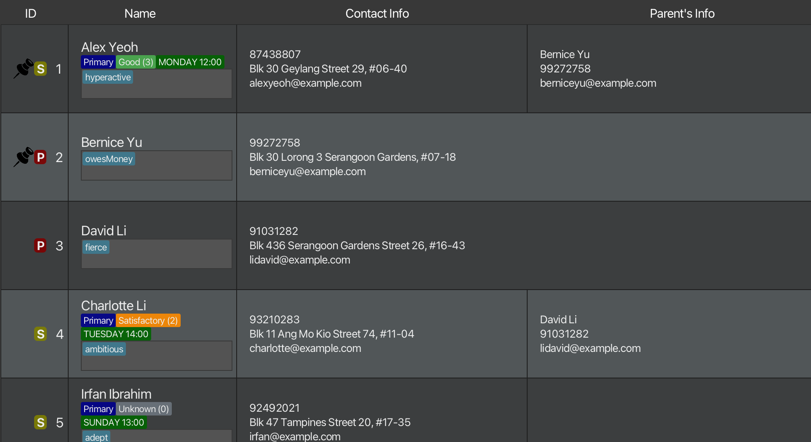
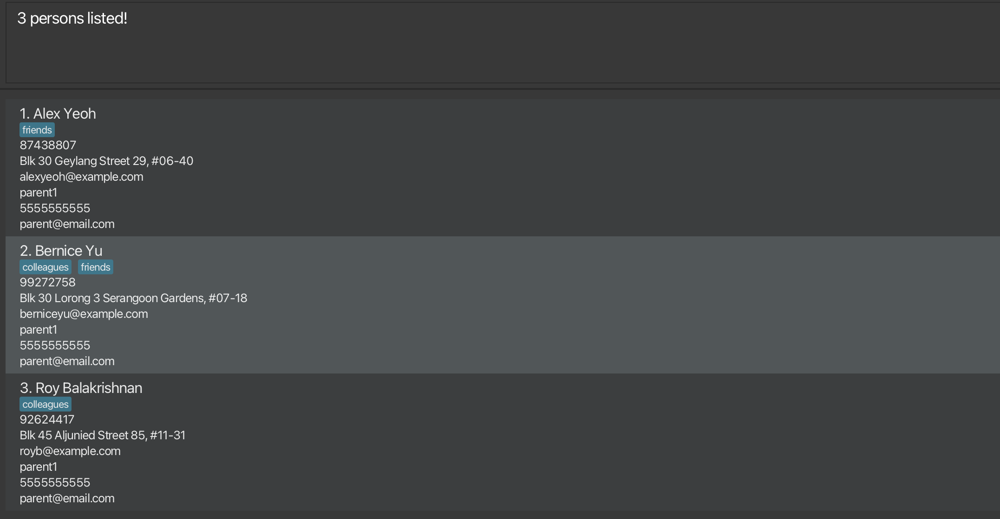
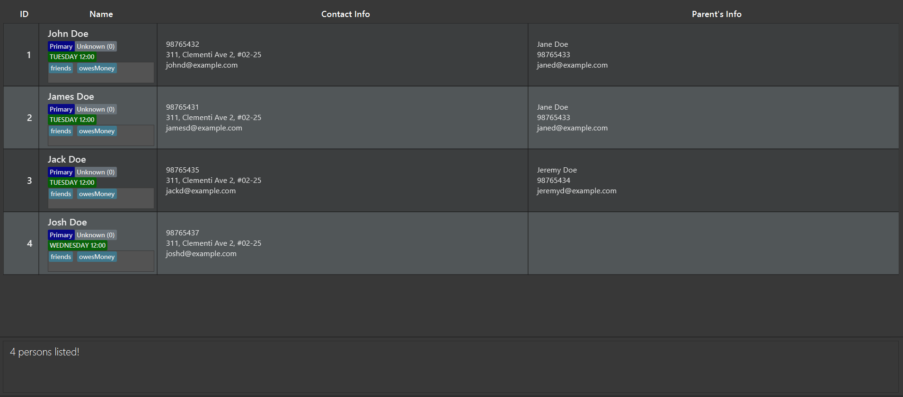

# GOATS User Guide

## Introduction

Are you a private tutor who has trouble keeping track of your students details? Ever wanted to have an easier way to keep track of whose parents is which students?   
Greatest Offline AddressBook for Teaching Students (GOATS) is an **offline desktop app** designed with you in mind. It not only helps you keep track of students grades and education level, it can also help you keep track of their parent as well.
  
It is optimised for fast typists using Command Line Interface (CLI) while still having the benefits of a Graphical User Interface (GUI) allowing to scan through information quickly.
  
If you can type fast, GOATS can get your student management tasks done faster than traditional GUI apps.

<!-- * Table of Contents -->

<page-nav-print />

---

## Quick start

1. Ensure you have Java `17` or above installed in your Computer.
2. Download the latest `.jar` file from [here](https://github.com/AY2425S1-CS2103T-T09-4/tp/releases).
3. Copy the file to the folder you want to use as the _home folder_ for your GOATS.
4. Open a command terminal, `cd` into the folder you put the jar file in, and use the `java -jar GOATS.jar` command to run the application. 
   A GUI similar to the below should appear in a few seconds. Note how the app contains some sample data. 
   
5. Type the command in the command box and press Enter to execute it. e.g. typing **`help`** and pressing Enter will open the help window. 
   Some example commands you can try:

   * `list` : Lists all contacts.
   * `adds n/John Doe p/98765432 e/johnd@example.com a/311, Clementi Ave 2, #02-25 edu/Primary pn/Jane Doe pp/91234567 pe/janed@example.com t/friends t/owesMoney`: Adds a student contact named `John Doe` to the Address Book.
   * `delete 3` : Deletes the 3rd contact shown in the current list.
   * `clear` : Deletes all contacts.
   * `exit` : Exits the app.
6. Refer to the [Features](#features) below for details of each command.

---

## Command summary

| Action            | Format, Examples                                                                                                                                                                               |
|-------------------|------------------------------------------------------------------------------------------------------------------------------------------------------------------------------------------------|
| **Add Student**   | `adds n/NAME p/PHONE_NUMBER e/EMAIL a/ADDRESS edu/EDUCATION [t/TAG]` e.g., `add n/James Ho p/22224444 e/jamesho@example.com a/123, Clementi Rd, 1234665 t/friend t/colleague`                  |
| **Add Parent**    | `addp n/NAME p/PHONE_NUMBER e/EMAIL a/ADDRESS [t/TAG]…`   e.g., `add n/Jane Doe p/33335555 e/janedoe@example.com a/456, Pasir Ris Dr t/friend`                                              |
| **Grade**         | `grade INDEX g/GRADE_INDEX`   e.g., `grade 1 g/1`                                                                                                                                           |
| **Clear**         | `clear`                                                                                                                                                                                        |
| **Delete**        | `delete INDEX [MORE_INDICES]`  e.g., `delete 1 2 3 4`                                                                                                                                       |
| **Edit**          | `edit INDEX [n/NAME] [p/PHONE_NUMBER] [e/EMAIL] [a/ADDRESS] [edu/EDUCATION] [pn/PARENT NAME] [pp/PARENT PHONE] [pe/PARENT EMAIL][t/TAG]…`  e.g.,`edit 2 n/James Lee e/jameslee@example.com` |
| **Find**          | `find KEYWORD [MORE_KEYWORDS]`  e.g., `find James Jake`                                                                                                                                     |
| **FindTag**       | `findtag KEYWORD [MORE_KEYWORDS]`  e.g., `findtag math science`                                                                                                                             |
| **FindDay**       | `findday KEYWORD [MORE_KEYWORDS]`  e.g., `findday tuesday wednesday`                                                                                                                        |
| **Help**          | `help`                                                                                                                                                                                         |
| **Pin**           | `pin INDEX [MORE_INDICES]`  e.g., `pin 1 2 3 4`                                                                                                                                             |
| **Unpin**         | `unpin INDEX [MORE_INDICES]`  e.g., `unpin 1 2 3 4`                                                                                                                                         |
| **Archive**       | `archive INDEX [MORE_INDICES]`  e.g., `archive 1 2 3 4`                                                                                                                                     |
| **Unarchive**     | `unarchive INDEX [MORE_INDICES]`  e.g., `unarchive 1 2 3 4`                                                                                                                                 |
| **List**          | `list`                                                                                                                                                                                         |
| **List Archive**  | `listarchive`                                                                                                                                                                                  |
| **List Students** | `liststudents`                                                                                                                                                                                 |
| **List Parents**  | `listparents`                                                                                                                                                                                  |
| **Link**          | `link ch/STUDENT_NAME pa/PARENT_NAME`  e.g., `link ch/James Ho pa/Jane Doe`                                                                                                                 |
| **Unlink**        | `unlink ch/STUDENT_NAME`  e.g., `unlink ch/James Ho`                                                                                                                                        |
| **Sort**          | `sort`                                                                                                                                                                                         |
| **Exit**          | `exit`                                                                                                                                                                                         |

## Features

<box type="info" seamless>

**Notes about the command format:** 

* Words in `UPPER_CASE` are the parameters to be supplied by the user. 
  e.g. in `add n/NAME`, `NAME` is a parameter which can be used as `add n/John Doe`.
* Items in square brackets are optional. 
  e.g `n/NAME [t/TAG]` can be used as `n/John Doe t/friend` or as `n/John Doe`.
* Items with `…` after them can be used multiple times including zero times. 
  e.g. `[t/TAG]…` can be used as ` ` (i.e. 0 times), `t/friend`, `t/friend t/family` etc.
* Parameters can be in any order. 
  e.g. if the command specifies `n/NAME p/PHONE_NUMBER`, `p/PHONE_NUMBER n/NAME` is also acceptable.
* Extraneous parameters for commands that do not take in parameters (such as `help`, `list`, `exit` and `clear`) will be ignored. 
  e.g. if the command specifies `help 123`, it will be interpreted as `help`.
* If you are using a PDF version of this document, be careful when copying and pasting commands that span multiple lines as space characters surrounding line-breaks may be omitted when copied over to the application.

</box>

### Adding a student: `adds`

Adds a student to the address book.

Format: `adds n/NAME p/PHONE_NUMBER e/EMAIL a/ADDRESS edu/EDUCATION [t/TAG]…`

<box type="tip" seamless>

**Tip:** A student can have any number of tags (including 0)
</box>

Examples:

* `adds n/John Doe p/98765432 e/johnd@example.com a/John street, block 123, #01-01 edu/Primary`
* `adds n/Betsy Crowe t/friend e/betsycrowe@example.com a/Newgate Prison p/1234567 t/criminal edu/Secondary`

### Adding a parent: `addp`

Adds a parent to the address book.

Format: `adds n/NAME p/PHONE_NUMBER e/EMAIL a/ADDRESS [t/TAG]…`

<box type="tip" seamless>

**Tip:** A parent can also have any number of tags (including 0)
</box>

Examples:

* `addp n/John Doe p/98765432 e/johnd@example.com a/John street, block 123, #01-01`
* `addp n/Betsy Crowe t/friend e/betsycrowe@example.com a/Newgate Prison p/1234567 t/criminal`

### Assigning grade to students: `grade`

Assigns grade to students in the address book.

Format: `grade INDEX g/GRADE_INDEX`

* The grade index ranges from 0 to 5
* 0: `Unknown`
* 1: `Failing`
* 2: `Satisfactory`
* 3: `Good`
* 4: `Excellent`

Examples:

* `grade 1 g/1` changes grade of first person on list to `Failing`
* `grade 2 g/4` changes grade of second person on list to `Excellent` 
  

### Clearing all entries : `clear`

Clears all entries from the address book.

Format: `clear`

### Deleting a person : `delete`

Deletes the specified people from the address book.

Format: `delete INDEX [MORE_INDICES]`

* Deletes the person at the specified `INDICES`.
* The indices refer to the index numbers shown in the displayed person list.
* The indices **must be positive integer** 1, 2, 3, …

Examples:

* `list` followed by `delete 2` deletes the 2nd person in the address book.
* `find Betsy` followed by `delete 1` deletes the 1st person in the results of the `find` command.
* `list` followed by `delete 2 3 4 5` deletes the 2nd, 3rd, 4th and 5th people in the address book.

**Caution:**
When deleting a person, people linked to that person will be unlinked.

### Editing a person : `edit`

Edits an existing person in the address book.

Format: `edit INDEX [n/NAME] [p/PHONE] [e/EMAIL] [a/ADDRESS] [t/TAG]…`

* Edits the person at the specified `INDEX`. The index refers to the index number shown in the displayed person list. The index **must be a positive integer** 1, 2, 3, …
* At least one of the optional fields must be provided.
* Existing values will be updated to the input values.
* When editing tags, the existing tags of the person will be removed i.e adding of tags is not cumulative.
* You can remove all the person’s tags by typing `t/` without
  specifying any tags after it.

Examples:

* `edit 1 p/91234567 e/johndoe@example.com` Edits the phone number and email address of the 1st person to be `91234567` and `johndoe@example.com` respectively.
* `edit 2 n/Betsy Crower t/` Edits the name of the 2nd person to be `Betsy Crower` and clears all existing tags.

### Locating persons by name: `find`

Finds persons whose names contain any of the given keywords.

Format: `find KEYWORD [MORE_KEYWORDS]`

* The search is case-insensitive. e.g `hans` will match `Hans`
* The order of the keywords does not matter. e.g. `Hans Bo` will match `Bo Hans`
* Only the name is searched.
* Only full words will be matched e.g. `Han` will not match `Hans`
* Persons matching at least one keyword will be returned (i.e. `OR` search).
  e.g. `Hans Bo` will return `Hans Gruber`, `Bo Yang`

Examples:

* `find John` returns `john` and `John Doe`
* `find alex david` returns `Alex Yeoh`, `David Li` 
  

### Locating persons by tag: `findtag`

Finds persons whose tags contain any of the given keywords.

Format: `findtag KEYWORD [MORE_KEYWORDS]`

* The search is case-insensitive. e.g `dyslexic` will match `Dyslexic`
* The order of the keywords does not matter. e.g. `dyslexic vegetarian` will match `vegetarian dyslexic`
* Only full words will be matched e.g. `veg` will not match `vegetarian`
* Persons matching at least one keyword will be returned (i.e. `OR` search).
  e.g. `vegetarian dyslexic` will return all users with tags containing `vegetarian` or `dyslexic`

Examples:

* `findtag friends` returns `Alex Yeoh` and `Bernice Yu`
* `findtag friends colleagues` returns `Alex Yeoh`, `Bernice Yu` and `Roy Balakrishnan` 
  

### Locating students by lesson day: `findday`

Finds students who have lessons on specific days.

Format: `findtag DAY [MORE_DAYS]`

* The search is case-insensitive. e.g `tuesday` will match `Tuesday`
* The order of the keywords does not matter. e.g. `tuesday wednesday` will match `wednesday tuesday`
* Only full words will be matched e.g. `tues` will not match `tuesday`
* Persons matching at least one keyword will be returned (i.e. `OR` search).
  e.g. `tuesday wednesday` will return all students with lessons on Tuesday and students with lessons on Wednesday.

Examples:

* `findday tuesday` returns `Alex Yeoh` and `Bernice Yu`
* `findtag friends colleagues` returns `Alex Yeoh`, `Bernice Yu` and `Roy Balakrishnan` 
  

### Viewing help : `help`

Shows a message explaining how to access the help page.

Format: `help`

### Pinning a person: `pin`

Pins the specified people to the top of the list in the address book.

Format: `pin INDEX [MORE_INDICES]`

* Pins the person at the specified `INDICES`.
* The indices refer to the index numbers shown in the displayed person list.
* The indices **must be positive integer** 1, 2, 3, …

Examples:

* `list` followed by `pin 2` pins the 2nd person in the address book.
* `find Betsy` followed by `pin 1` pins the 1st person in the results of the `find` command.
* `list` followed by `pin 2 3 4 5` pins the 2nd, 3rd, 4th and 5th people in the address book.

### Unpinning a person : `unpin`

Unpins the specified people in the address book.

Format: `unpin INDEX [MORE_INDICES]`

* Unpins the person at the specified `INDICES`.
* The indices refer to the index numbers shown in the displayed person list.
* The indices **must be positive integer** 1, 2, 3, …

Examples:

* `list` followed by `unpin 2` unpins the 2nd person in the address book.
* `find Betsy` followed by `unpin 1` unpins the 1st person in the results of the `find` command.
* `list` followed by `unpin 2 3 4 5` unpins the 2nd, 3rd, 4th and 5th people in the address book.

### Archive a person : `archive`

Archives the specified people in the addressbook, hiding them from the main list.

Format: `archive INDEX [MORE_INDICES]`

* Archives the person at the specified `INDICES`.
* The indices refer to the index numbers shown in the displayed person list.
* The indices **must be positive integer** 1, 2, 3, …

Examples:

* `list` followed by `archive 2` archives the 2nd person in the address book.
* `find Betsy` followed by `archive 1` archives the 1st person in the results of the `find` command.
* `list` followed by `archive 2 3 4 5` archives the 2nd, 3rd, 4th and 5th people in the address book.

### Unarchive a person : `unarchive`

Unarchives the specified people in the addressbook, hiding them from the main list.

Format: `unarchive INDEX [MORE_INDICES]`

* Unarchives the person at the specified `INDICES`.
* The indices refer to the index numbers shown in the displayed person list.
* The indices **must be positive integer** 1, 2, 3, …

Examples:

* `listarchive` followed by `unarchive 2` unarchives the 2nd person in the address book archives.
* `listarchive` followed by `find Betsy` followed by `unarchive 1` unarchives the 1st person in the results of the `find` command.
* `listarchive` followed by `unarchive 2 3 4 5` unarchives the 2nd, 3rd, 4th and 5th people in the address book.

### Link a parent to a student : `link`

Links a parent to a student in a parent-child relationship.

Format: `link ch/STUDENT_NAME pa/PARENT_NAME`

* Links the specified student with name `STUDENT_NAME` with the specified parent with name `PARENT_NAME`.
* The names provided are case-sensitive.
* The names provided must match exactly the names displayed in the Address Book.

Examples:

* `link ch/John Doe pa/Jane Doe` links the student with name `John Doe` with the parent with name `Jane Doe`, assuming both exist in the Address Book.

### Unlink a parent from a student : `unlink`

Removes the parent-child relationship from the specified student.

Format: `unlink ch/STUDENT_NAME`

* Removes the parent-child relationship from the specified student with name `STUDENT_NAME`.
* The name provided is case-sensitive.
* The name provided must match exactly the name displayed in the Address Book.

Examples:

* `unlink ch/John Doe` removes the parent-child-relationship from `John Doe`, assuming `John Doe` exists in the Address Book and has a parent-child relationship.

### Listing all persons : `list`

Shows a list of all persons in the address book.

Format: `list`

### Listing all archived persons : `listarchive`

Shows a list of all archived persons in the address book.

Format: `listarchive`

### Listing students : `liststudents`

Lists all students in the address book.

Format: `liststudents`

### Listing parents : `listparents`

Lists all parents in the address book.

Format: `liststudents`

### Sorting all persons: `sort`

Sorts all person in the address book, keeping pinned persons on top.

Format: `sort`

### Exiting the program : `exit`

Exits the program.

Format: `exit`

### Saving the data

AddressBook data are saved in the hard disk automatically after any command that changes the data. There is no need to save manually.

### Editing the data file

AddressBook data are saved automatically as a JSON file `[JAR file location]/data/addressbook.json`. Advanced users are welcome to update data directly by editing that data file.

<box type="warning" seamless>

**Caution:**
If your changes to the data file makes its format invalid, AddressBook will discard all data and start with an empty data file at the next run.  Hence, it is recommended to take a backup of the file before editing it. 
Furthermore, certain edits can cause the AddressBook to behave in unexpected ways (e.g., if a value entered is outside the acceptable range). Therefore, edit the data file only if you are confident that you can update it correctly.
</box>

---

## FAQ

**Q**: How do I transfer my data to another Computer? 
**A**: Install the app in the other computer and overwrite the empty data file it creates with the file that contains the data of your previous AddressBook home folder.

---

## Known issues

1. **When using multiple screens**, if you move the application to a secondary screen, and later switch to using only the primary screen, the GUI will open off-screen. The remedy is to delete the `preferences.json` file created by the application before running the application again.
2. **If you minimize the Help Window** and then run the `help` command (or use the `Help` menu, or the keyboard shortcut `F1`) again, the original Help Window will remain minimized, and no new Help Window will appear. The remedy is to manually restore the minimized Help Window.

---
