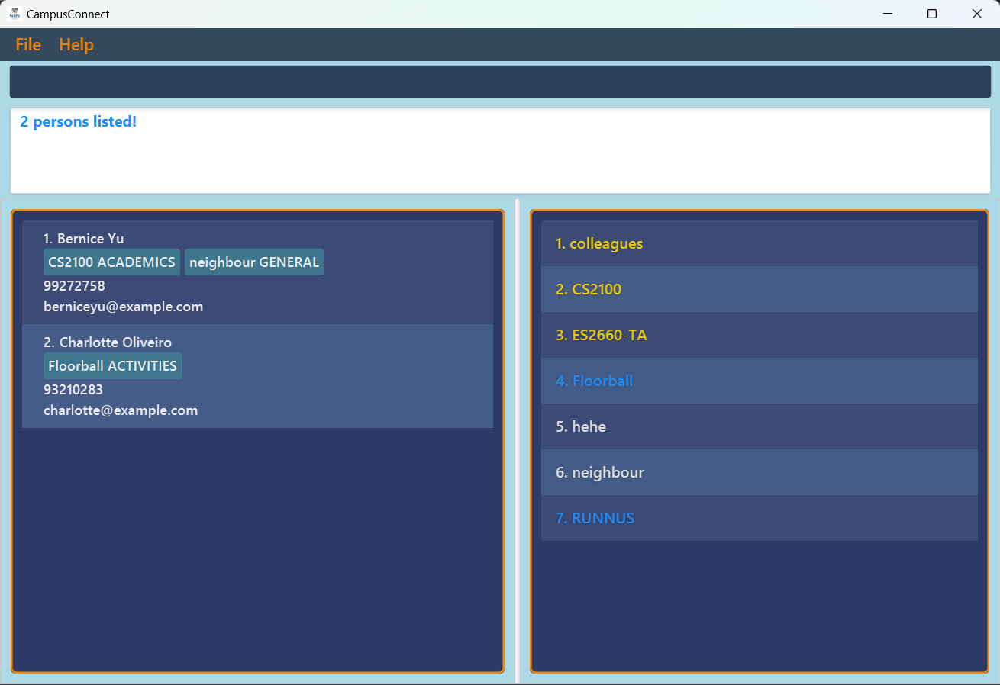

# CampusConnect User Guide

CampusConnect(CC) is a **desktop app** for managing contacts, optimized for use via a **Command Line Interface** (CLI) while still having the benefits of a Graphical User Interface (GUI). If you can type fast, CC can get your contact management tasks done faster than traditional GUI apps.

<!-- * Table of Contents -->
<page-nav-print />

--------------------------------------------------------------------------------------------------------------------

## Quick start

1. Ensure you have Java `17` or above installed in your Computer.

1. Download the latest `.jar` file from [here](https://github.com/se-edu/CampusConnect/releases).

1. Copy the file to the folder you want to use as the _home folder_ for your CampusConnect.

1. Open a command terminal, `cd` into the folder you put the jar file in, and use the `java -jar CampusConnect.jar` command to run the application. 
   A GUI similar to the below should appear in a few seconds. Note how the app contains some sample data. 
   

1. Type the command in the command box and press Enter to execute it. e.g. typing **`help`** and pressing Enter will open the help window. 
   Some example commands you can try:

   * `list` : Lists all contacts.

   * `add n/John Doe p/98765432 e/johnd@example.com` : Adds a contact named `John Doe` with phone number `98765432` and email `johnd@example.com` to the CampusConnect.

   * `delete 3` : Deletes the 3rd contact shown in the current list.

   * `clear` : Deletes all contacts.

   * `exit` : Exits the app.

1. Refer to the [Features](#features) below for details of each command.

--------------------------------------------------------------------------------------------------------------------

## Features

<box type="info" seamless>

**Notes about the command format:** 

* Words in `UPPER_CASE` are the parameters to be supplied by the user. 
  e.g. in `add n/NAME`, `NAME` is a parameter which can be used as `add n/John Doe`.

* Items in square brackets are optional. 
  e.g `n/NAME [t/TAG]` can be used as `n/John Doe t/friend` or as `n/John Doe`.

* Items with `…`​ after them can be used multiple times including zero times. 
  e.g. `[t/TAG]…​` can be used as ` ` (i.e. 0 times), `t/friend`, `t/friend t/family` etc.

* Parameters can be in any order. 
  e.g. if the command specifies `n/NAME p/PHONE_NUMBER`, `p/PHONE_NUMBER n/NAME` is also acceptable.

* Extraneous parameters for commands that do not take in parameters (such as `help`, `list`, `exit` and `clear`) will be ignored. 
  e.g. if the command specifies `help 123`, it will be interpreted as `help`.

* If you are using a PDF version of this document, be careful when copying and pasting commands that span multiple lines as space characters surrounding line-breaks may be omitted when copied over to the application.
</box>

### Viewing help : `help`

Shows a message explaning how to access the help page.

Format: `help`

### Adding a person: `add`

Adds a person to the CampusConnect.

Format: `add n/NAME p/PHONE_NUMBER e/EMAIL [t/TAG]…​`

<box type="tip" seamless>

**Tip:** A person can have any number of tags (including 0)
</box>

* Phone number, following Singaporean convention, must have 8 digits, start with a 6, 8 or 9 and only have numbers.

Examples:
* `add n/John Doe p/98765432 e/johnd@example.com`
* `add n/Betsy Crowe t/friend e/betsycrowe@example.com p/92345672 t/criminal`

### Listing all persons : `list`

Shows a list of all persons in the CampusConnect.

Format: `list`

### Editing a person : `edit`

Edits an existing person in the CampusConnect.

Format: `edit INDEX [n/NAME] [p/PHONE] [e/EMAIL] [t/TAG]…​`

* Edits the person at the specified `INDEX`. The index refers to the index number shown in the displayed person list. The index **must be a positive integer** 1, 2, 3, …​
* At least one of the optional fields must be provided.
* Existing values will be updated to the input values.
* When editing tags, the existing tags of the person will be removed i.e adding of tags is not cumulative.
* You can remove all the person’s tags by typing `t/` without
    specifying any tags after it.

Examples:
*  `edit 1 p/91234567 e/johndoe@example.com` Edits the phone number and email address of the 1st person to be `91234567` and `johndoe@example.com` respectively.
*  `edit 2 n/Betsy Crower t/` Edits the name of the 2nd person to be `Betsy Crower` and clears all existing tags.

### Locating persons by contact information: `find`

Finds persons whose names, email address, contact number, or tag contain any of the given keywords.

Format: 

`find n/KEYWORD [MORE_KEYWORDS]`

`find p/KEYWORD [MORE_KEYWORDS]`

`find e/KEYWORD [MORE_KEYWORDS]`

`find t/KEYWORD [MORE_KEYWORDS]`

* Only one field type can be specified per command.
* Only the specified field is searched.
* The search is case-insensitive. e.g `hans` will match `Hans`
* The order of the keywords does not matter. e.g. `Hans Bo` will match `Bo Hans`
* Only full words will be matched e.g. `Han` will not match `Hans`
* Persons matching at least one keyword will be returned (i.e. `OR` search).
  e.g. `Hans Bo` will return `Hans Gruber`, `Bo Yang`

Examples:
* `find n/John` returns `john` and `John Doe`
* `find n/bernice n/charlotte` returns `Bernice Yu`, `Charlotte Oliveiro` 
  

Disallowed examples:
* `find n/John p/82345670` will not succeed as intended, as the command only searches on single fields. "`p/82345670`" will be treated as a keyword string.

### Deleting a person : `delete`

Deletes the specified person from the CampusConnect.

Format: `delete INDEX`

* Deletes the person at the specified `INDEX`.
* The index refers to the index number shown in the displayed person list.
* The index **must be a positive integer** 1, 2, 3, …​

Examples:
* `list` followed by `delete 2` deletes the 2nd person in the CampusConnect.
* `find n/Betsy` followed by `delete 1` deletes the 1st person in the results of the `find` command.

### Deleting a person's tag : `deletetag`

Deletes the specified person's tag.

Format: `deletetag INDEX t/KEYWORD`

* Deletes the tag with the specified name `KEYWORD` of the person at the specified `INDEX`.
* The index refers to the index number shown in the displayed person list.
* The index **must be a positive integer** 1, 2, 3, …​
* Only one tag can be deleted at a time.

Examples:
* `deletetag 1 t/friend` deletes the friend tag of the first person in the list.

Disallowed examples:
* `deletetag 2 t/classmate t/neighbour` will not succeed as it tries to delete 2 tags at once.

### Undo a command : `undo`

Undoes the previous command and reverts CampusConnect.

Format: `undo`

* Reverts the state of CampusConnect to the one before the most recent command, if any.

### Clearing all entries : `clear`

Clears all entries from the CampusConnect.

Format: `clear`

### Exiting the program : `exit`

Exits the program.

Format: `exit`

### Saving the data

CampusConnect data are saved in the hard disk automatically after any command that changes the data. There is no need to save manually.

### Editing the data file

CampusConnect data are saved automatically as a JSON file `[JAR file location]/data/CampusConnect.json`. Advanced users are welcome to update data directly by editing that data file.

<box type="warning" seamless>

**Caution:**
If your changes to the data file makes its format invalid, CampusConnect will discard all data and start with an empty data file at the next run.  Hence, it is recommended to take a backup of the file before editing it. 
Furthermore, certain edits can cause the CampusConnect to behave in unexpected ways (e.g., if a value entered is outside the acceptable range). Therefore, edit the data file only if you are confident that you can update it correctly.
</box>

### Archiving data files `[coming in v2.0]`

_Details coming soon ..._

--------------------------------------------------------------------------------------------------------------------

## FAQ

**Q**: How do I transfer my data to another Computer? 
**A**: Install the app in the other computer and overwrite the empty data file it creates with the file that contains the data of your previous CampusConnect home folder.

--------------------------------------------------------------------------------------------------------------------

## Known issues

1. **When using multiple screens**, if you move the application to a secondary screen, and later switch to using only the primary screen, the GUI will open off-screen. The remedy is to delete the `preferences.json` file created by the application before running the application again.
2. **If you minimize the Help Window** and then run the `help` command (or use the `Help` menu, or the keyboard shortcut `F1`) again, the original Help Window will remain minimized, and no new Help Window will appear. The remedy is to manually restore the minimized Help Window.

--------------------------------------------------------------------------------------------------------------------

## Command summary

Action     | Format, Examples
-----------|----------------------------------------------------------------------------------------------------------------------------------------------------------------------
**Add**    | `add n/NAME p/PHONE_NUMBER e/EMAIL [t/TAG]…​`   e.g., `add n/James Ho p/22224444 e/jamesho@example.com t/friend t/colleague`
**Clear**  | `clear`
**Delete** | `delete INDEX`  e.g., `delete 3`
**Edit**   | `edit INDEX [n/NAME] [p/PHONE_NUMBER] [e/EMAIL] [t/TAG]…​`  e.g.,`edit 2 n/James Lee e/jameslee@example.com`
**Find by name**   | `find n/KEYWORD [MORE_KEYWORDS]`  e.g., `find n/James Jake`
**Find by email**   | `find e/KEYWORD [MORE_KEYWORDS]`  e.g., `find e/bigman123@email.com bobbyrick@example.com`
**Find by phone number**   | `find p/KEYWORD [MORE_KEYWORDS]`  e.g., `find p/91234657 85432789`
**Find by tag**   | `find t/KEYWORD [MORE_KEYWORDS]`  e.g., `find t/friend roommate`
**Delete tag** | `deletetag INDEX t/KEYWORD`   e.g. `deletetag 1 t/friend`
**List**   | `list`
**Help**   | `help`
