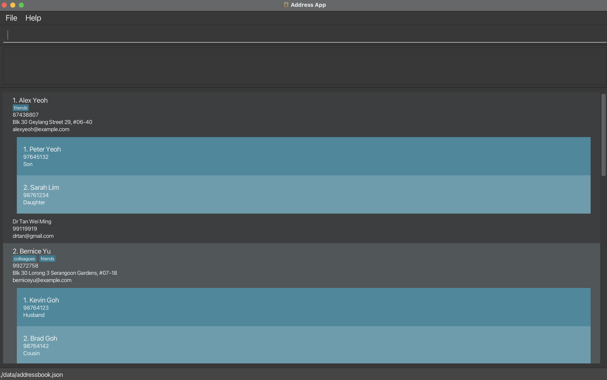

MedConnect is a **desktop app for managing contacts, optimized for use via a Command Line Interface** (CLI) while still having the benefits of a Graphical User Interface (GUI). If you can type fast, MedConnect can get your contact management tasks done faster than traditional GUI apps.

* Table of Contents
{:toc}

--------------------------------------------------------------------------------------------------------------------

## Quick start

1. Ensure you have Java `17` or above installed in your Computer.

1. Download the latest `.jar` file from [here](https://github.com/se-edu/addressbook-level3/releases).

1. Copy the file to the folder you want to use as the _home folder_ for your AddressBook.

1. Open a command terminal, `cd` into the folder you put the jar file in, and use the `java -jar addressbook.jar` command to run the application. 
   A GUI similar to the below should appear in a few seconds. Note how the app contains some sample data. 
   

1. Type the command in the command box and press Enter to execute it. e.g. typing **`help`** and pressing Enter will open the help window. 
   Some example commands you can try:

   * `list` : Lists all contacts.

     * `add n/John Doe p/98765432 e/johnd@example.com a/John street, block 123, #01-01 ecname/Charlotte Lim
     ecphone/81243564 ecrs/Sibling dname/Ronald Lee dphone/99441234 demail/ronaldlee@gmail.com` : Adds a contact named `John Doe` to the Address Book with emergency contact `Charlotte Lim` and doctor `Ronald Lee`.

   * `delete 3` : Deletes the 3rd contact shown in the current list.

   * `clear` : Deletes all contacts.

   * `undo` : Undo previous command.

   * `exit` : Exits the app.

1. Refer to the [Features](#features) below for details of each command.

--------------------------------------------------------------------------------------------------------------------

## Features

**:information_source: Notes about the command format:** 

* Words in `UPPER_CASE` are the parameters to be supplied by the user. 
  e.g. in `add n/NAME`, `NAME` is a parameter which can be used as `add n/John Doe`.

* Items in square brackets are optional. 
  e.g `n/NAME [t/TAG]` can be used as `n/John Doe t/friend` or as `n/John Doe`.

* Items with `…`​ after them can be used multiple times including zero times. 
  e.g. `[t/TAG]…​` can be used as ` ` (i.e. 0 times), `t/friend`, `t/friend t/family` etc.

* Parameters can be in any order. 
  e.g. if the command specifies `n/NAME p/PHONE_NUMBER`, `p/PHONE_NUMBER n/NAME` is also acceptable.

* Extraneous parameters for commands that do not take in parameters (such as `help`, `list`, `exit` and `clear`) will be ignored. 
  e.g. if the command specifies `help 123`, it will be interpreted as `help`.

* If you are using a PDF version of this document, be careful when copying and pasting commands that span multiple lines as space characters surrounding line-breaks may be omitted when copied over to the application.

### Viewing help : `help`

Shows a message explaning how to access the help page.

Format: `help`

### Adding a person: `add`

Adds a person to the address book.

Format: `add n/NAME p/PHONE_NUMBER e/EMAIL a/ADDRESS ecname/EMERGENCY_CONTACT_NAME ecphone/EMERGENCY_CONTACT_PHONE
ecrs/EMERGENCY CONTACT RELATIONSHIP dname/DOCTOR_NAME dphone/DOCTOR_PHONE demail/DOCTOR_EMAIL [t/TAG]…​`

Valid inputs for relationship: `Parent, Mother, Father, Child, Son, Daughter, Sibling, Brother, Sister, Friend, Spouse,
Husband, Wife, Partner, Cousin, Relative, Uncle, Aunt, Grandparent, Grandmother, Grandfather, Grandchild, Grandson, Granddaughter`

:bulb: **Tip:**
A person can have any number of tags (including 0)

Examples:
* `add n/John Doe p/98765432 e/johnd@example.com a/John street, block 123, #01-01 ecname/Charlotte Lim ecphone/94681352 ecrs/daughter dname/Ronald Lee dphone/99441234 demail/ronaldlee@gmail.com`

* `add n/Betsy Crowe t/friend ecname/Matthew Tan e/betsycrowe@example.com a/Newgate Prison p/1234567 ecrs/son ecphone/94873631 ecname/Bob Builder demail/liampayne@gmail.com dphone/91231231 dname/Liam Payne t/criminal`

### Listing all persons : `list`

Shows a list of all persons in the address book.

Format: `list`

### Editing a person : `edit`

Edits an existing person in the address book.

Format: `edit INDEX [n/NAME] [p/PHONE] [e/EMAIL] [a/ADDRESS] [ec/ECINDEX] [ecname/EMERGENCY_CONTACT_NAME] [ecrs/EMERGENCY_CONTACT_RELATIONSHIP] [dname/DOCTOR_NAME] [dphone/DOCTOR_PHONE] [demail/DOCTOR_EMAIL] [t/TAG]…​`

* Edits the person at the specified `INDEX`. The index refers to the index number shown in the displayed person list. The index **must be a positive integer** 1, 2, 3, …​
* At least one of the optional fields must be provided.
* Existing values will be updated to the input values.
* When editing an emergency contact, the index of the emergency contact to edit and at least one emergency contact field must be provided
* When editing tags, the existing tags of the person will be removed i.e adding of tags is not cumulative.
* You can remove all the person’s tags by typing `t/` without
    specifying any tags after it.

Examples:
*  `edit 1 p/91234567 e/johndoe@example.com` Edits the phone number and email address of the 1st person to be `91234567` and `johndoe@example.com` respectively.

*  `edit 2 n/Betsy Crower t/` Edits the name of the 2nd person to be `Betsy Crower` and clears all existing tags.

*  `edit 2 n/Betsy Crower ec/1 ecname/Peter Tan` Edits the name of the first emergency contact of the 2nd person to be `Peter Tan`.

### Locating persons by name: `find`

Finds persons whose names contain any of the given keywords.

Format: `find KEYWORD [MORE_KEYWORDS]`

* The search is case-insensitive. e.g `hans` will match `Hans`
* The order of the keywords does not matter. e.g. `Hans Bo` will match `Bo Hans`
* Only the name is searched.
* Names will match if the keyword is found in any part of the name. For example, `Ha` will match `Hans`
* Persons matching at least one keyword will be returned (i.e. `OR` search).
  e.g. `Hans Bo` will return `Hans Gruber`, `Bo Yang`

Examples:
* `find John` returns `john` and `John Doe`
* `find alex david` returns `Alex Yeoh`, `David Li` 
  

### Locating persons by name: `finddoc`

Finds persons by checking if their doctor's names contain any of the provided keywords.

Format: `finddoc KEYWORD [MORE_KEYWORDS]`

* The search is case-insensitive. e.g `hans` will match `Hans`
* The order of the keywords does not matter. e.g. `Hans Bo` will match `Bo Hans`
* Only the doctor's name is searched.
* Names will match if the keyword is found in any part of the doctor's name. For example, `Ha` will match `Hans`
* Persons matching at least one keyword in their doctor's name will be returned (i.e. `OR` search).
  e.g. `Hans Bo` will return persons whose doctors are `Hans Gruber`, `Bo Yang`

Examples:
* `finddoc John` returns persons with doctors `john` and `John Doe`
* `finddoc tan ed` returns persons with doctors `Tan Wei Ming`, `Ed Sheeran` 
  

### Deleting a person : `delete`

Deletes the specified person or emergency contact from the address book.

Format: `delete INDEX [ec/EMERGENCY_CONTACT_INDEX]`

* Deletes the person at the specified `INDEX` OR deletes the emergency contact at the specified `EMERGENCY_CONTACT_INDEX` of the person at the specified `INDEX`.
* The index refers to the index number shown in the displayed person list.
* The index **must be a positive integer** 1, 2, 3, …​

Examples:
* `delete 2 ec/2` deletes the 2nd emergency contact of the 2nd person in the address book.
* `list` followed by `delete 2` deletes the 2nd person in the address book.
* `find Betsy` followed by `delete 1` deletes the 1st person in the results of the `find` command.

### Adding an emergency contact : `addec`

Adds an emergency contact to a specified person in the address book.

Format: `addec INDEX ecname/EMERGENCY_CONTACT_NAME ecphone/EMERGENCY_CONTACT_PHONE ecrs/EMERGENCY_CONTACT_RELATIONSHIP`

Examples:
* `addec 1 ecname/Shannon Wong ecphone/84651325 ecrs/Daughter` Adds a new emergency contact to the first person in the address book. 

### Clearing all entries : `clear`

Clears all entries from the address book.

Format: `clear`

### Undo previous command : `undo`
Restores the previous state of the address book after any change, such as an addition, edit, or deletion of a person or entry.

Format: `undo`

Success Message:
If the undo operation is successful, it returns: "Address book has undone previous command!"

Failure Message:
If there is no action to undo, or if the undo operation fails, it returns: "Address book failed to be undone. Please try again later."

How it works:
* It checks whether there is an operation in the undo stack (like an add, delete, or edit) that can be undone. This check is done via the model.canUndoAddressBook() method.
* If there is an undoable operation, it calls the model.undoAddressBook() method to restore the address book's previous state.
* If there are no operations to undo (i.e., if the user tries to undo without having made any modifications), the command will return the failure message.

### Redo previous command : `redo`

Restores the state of the address book after an undo operation has been executed, effectively "redoing" the undone changes, such as an addition, edit, or deletion of a person or entry.

Format: `redo`

Success Message:
If the redo operation is successful, it returns: "Address book has redone previous undo command!"

Failure Message:
If there is no action to redo or if the redo operation fails, it returns: "Redo not possible as no actions were undone."

How it works:
* It checks whether there is an undo operation that can be redone. This check is done via the model.canRedoAddressBook() method.
* If there is a redoable operation, it calls the model.redoAddressBook() method to restore the address book's previous state (before the undo).
* If there are no operations to redo (e.g., if the user tries to redo without any undo), the command will return the failure message.

### Exiting the program : `exit`

Exits the program.

Format: `exit`

### Saving the data

AddressBook data are saved in the hard disk automatically after any command that changes the data. There is no need to save manually.

### Editing the data file

AddressBook data are saved automatically as a JSON file `[JAR file location]/data/addressbook.json`. Advanced users are welcome to update data directly by editing that data file.

:exclamation: **Caution:**
If your changes to the data file makes its format invalid, AddressBook will discard all data and start with an empty data file at the next run. Hence, it is recommended to take a backup of the file before editing it. 
Furthermore, certain edits can cause the AddressBook to behave in unexpected ways (e.g., if a value entered is outside of the acceptable range). Therefore, edit the data file only if you are confident that you can update it correctly.

### Archiving data files `[coming in v2.0]`

_Details coming soon ..._

--------------------------------------------------------------------------------------------------------------------

## FAQ

**Q**: How do I transfer my data to another Computer? 
**A**: Install the app in the other computer and overwrite the empty data file it creates with the file that contains the data of your previous AddressBook home folder.

--------------------------------------------------------------------------------------------------------------------

## Known issues

1. **When using multiple screens**, if you move the application to a secondary screen, and later switch to using only the primary screen, the GUI will open off-screen. The remedy is to delete the `preferences.json` file created by the application before running the application again.
2. **If you minimize the Help Window** and then run the `help` command (or use the `Help` menu, or the keyboard shortcut `F1`) again, the original Help Window will remain minimized, and no new Help Window will appear. The remedy is to manually restore the minimized Help Window.

--------------------------------------------------------------------------------------------------------------------

## Command summary

                                                                                                                                                                                                                                                                                                                                          |
| Action     | Format, Examples                                                                                                                                                                                                       |
|------------|------------------------------------------------------------------------------------------------------------------------------------------------------------------------------------------------------------------------|
| **Add**    | `add n/NAME p/PHONE_NUMBER e/EMAIL a/ADDRESS ecname/EMERGENCY_CONTACT_NAME ecphone/EMERGENCY_CONTACT_PHONE ecrs/EMERGENCY_CONTACT_RELATIONSHIP [t/TAG]…​`   e.g., `add n/James Ho p/22224444 e/jamesho@example.com a/123, Clementi Rd, 1234665`   `ecname/Lim Jun Wei ecphone/98765678 ecrs/Brother`   `dname/Sam Lim dphone/9987766 demail/samlim@hotmail.com`   `t/friend t/colleague` |
| **Clear**  | `clear`                                                                                                                                                                                                                |
| **Delete** | `delete INDEX`  e.g., `delete 3`                                                                                                                                                                                    |
| **Edit**   | `edit INDEX [n/NAME] [p/PHONE_NUMBER] [e/EMAIL] [a/ADDRESS] [dname/DOCTOR_NAME] [dphone/DOCTOR_PHONE] [demail/DOCTOR_EMAIL] [t/TAG]…​`  e.g.,`edit 2 n/James Lee e/jameslee@example.com`                                                                                             |
| **Find**   | `find KEYWORD [MORE_KEYWORDS]`  e.g., `find James Jake`                                                                                                                                                             |
| **Find Doctor** | `finddoc KEYWORD [MORE_KEYWORDS]`   e.g., `find Tan Sheeran` |
| **Add Emergency Contact** | `addec INDEX ecname/EMERGENCY_CONTACT_NAME ecphone/EMERGENCY_CONTACT_PHONE ecrs/EMERGENCY_CONTACT_RELATIONSHIP`  e.g., `addec 1 ecname/Shannon Wong ecphone/84651325 ecrs/Daughter`                                                                                                                                                                                                                                                                                                                                          |
| **Undo**   | `undo`                                                                                                                                                                                                                 |
| **Redo**   | `redo`                                                                                                                                                                                                                 |
| **List**   | `list`                                                                                                                                                                                                                 |
| **Help**   | `help`                                                                                                                                                                                                                 |

