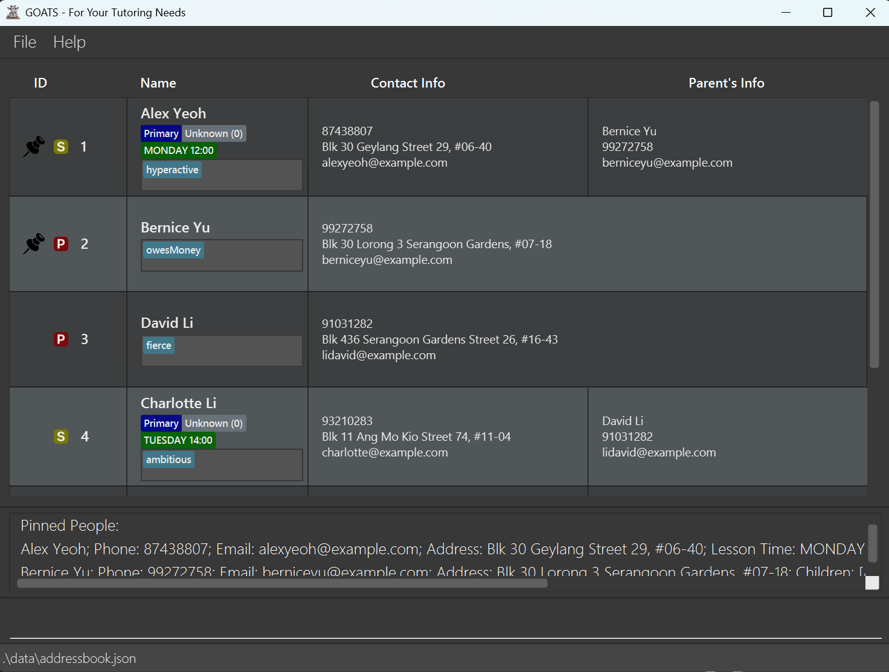

# GOATS User Guide

## Introduction

Are you a Singaporean private tutor who has trouble keeping track of your student's details? Ever thought of having an easier and more efficient way to keep track of students and their parents? Introducing GOATS!
  
The Greatest Offline Addressbook for Teaching Students, or GOATS, is an **offline desktop app** designed for your administrative needs for private tutoring. GOATS does not only help you keep track of students information such as phone number, grades and education level, it also helps you access the students' parents information as well. GOATS also boasts features such as archiving, sorting and pinning contacts to make sure you organise and find contacts quickly and easily.
  
The GOATS app is intended for **private tutors** who possess knowledge of basic computer skills (such as installing, downloading and navigating files). In addition, GOATS is optimised for fast typists with prior experience in using the Command Line Interface (CLI). So, if you can type fast, GOATS can get your student management tasks done faster than traditional Address Book applications!
  
This User Guide provides a guide of how to set up GOATS and a description of useful commands that you can use.
Please first ensure that you meet the [Minimum System Requirements](#minimum-system-requirements) in order to run GOATS.
After that, if you are a beginner or a first-time user, we recommend that you start with the [Quick Start](#quick-start) section. Otherwise, feel free to explore the various features either through the [Command Summary](#command-summary) or the Table of Contents.
  
This User Guide also includes highlighted sections to aid in your reading:
 

<box type="info">

**Notes:** This section will contain information that is useful to know.
</box>

<box type="tip">

**Tips:** This section will contain recommendations for users to consider.
</box>

<box type="definition">

**Examples:** This section will contain examples of different ways a command could be used.
</box>

<box type="warning">

**Caution:** This section will contain warnings for certain commands and information that are vital for GOATS to run smoothly. Do ensure that you take special note of the contents here.
</box>

<!-- * Table of Contents -->

<page-nav-print />

---

## Minimum System Requirements

Please ensure that you have the following: 
* A computer running on **Windows, macOS** or **Linux**.  
* Ensure you have **Java 17** or above installed on your computer.  
  * To check if you have Java 17 installed on your computer, follow the following steps:  
    1. Open a Terminal Emulator.  
       * On Windows: Open up `Windows Powershell` from the list of applications.  
       * On Linux: Click on the `Activities` item at the top left of the screen, then type in `terminal` and open the displayed application.  
       * On macOS: Type in `terminal` in the search field in the list of applications and open the displayed application.  
    2. Type in the following command: `java -version`.  
    3. If the response contains `java version "17.x.x"` or higher, you’re all set!  
    4. Otherwise, please refer to [this guide](https://www3.cs.stonybrook.edu/~amione/CSE114_Course/materials/resources/InstallingJava17.pdf) to download Java 17.  
  
---

## Quick Start

1. Download the latest `.jar` file from [here](https://github.com/AY2425S1-CS2103T-T09-4/tp/releases).  
2. Copy the file to the folder you want to use as the **home folder** for GOATS.  
3. Open a Terminal Emulator. For those unfamiliar with opening a terminal emulator, follow the instructions in the [Minimum System Requirements](#minimum-system-requirements).  
4. Type in the following command to navigate to the GOATS home folder: `cd`, followed by the location of your home folder.
   e.g. `cd Documents/GOATS_Home_Folder`  
5. Type in the following command to launch the GOATS application: `java -jar GOATS.jar`
   A GUI similar to the below should appear in a few seconds. Note how the app contains some sample data.  

  
6. You are ready to start using GOATS! Try out some example commands in the command box and press Enter to execute them. 
   Some example commands you can try: 
   * `list` : Lists all contacts.  
   * `addstudent n/James Ho p/91715131 e/jamesho@example.com a/123, Clementi Rd, 134665 edu/primary lt/wed:13:00 t/friend` : Adds a student named `James Ho` in GOATS.  
   * `delete 3` : Deletes the 3rd contact shown in the current list.  
   * `clear` : Deletes all contacts.  
   * `exit` : Exits the app.
  
7. Refer to the [Features](#features) below for details of each command.
  
---

## Command summary

| Action                                                                      | Format (Example)                                                                                                                                                                                                                     |
|-----------------------------------------------------------------------------|--------------------------------------------------------------------------------------------------------------------------------------------------------------------------------------------------------------------------------------|
| **[Add Parent](#adding-a-parent-addparent)**                                | `addparent n/NAME p/PHONE_NUMBER e/EMAIL a/ADDRESS [t/TAG]…` (`addparent n/John Doe p/98765432 e/johnd@example.com a/John street, block 123, #01-01`)                                                                                |
| **[Add Student](#adding-a-student-addstudent)**                             | `addstudent n/NAME p/PHONE_NUMBER e/EMAIL a/ADDRESS lt/LESSON_TIME edu/EDUCATION_LEVEL [t/TAG]…` (`addstudent n/James Ho p/22224444 e/jamesho@example.com a/123, Clementi Rd, 134665 edu/primary lt/wed:13:00 t/friend t/colleague`) |
| **[Archive](#archiving-contacts-archive)**                                  | `archive INDEX [MORE_INDICES]…` (`archive 1 2 3 4`)                                                                                                                                                                                  |
| **[Assign Grade](#assigning-a-grade-to-a-student-grade)**                   | `grade INDEX g/GRADE_INDEX` (`grade 1 g/1`)                                                                                                                                                                                          |
| **[Clear](#clearing-all-entries-clear)**                                    | `clear`                                                                                                                                                                                                                              |
| **[Delete](#deleting-contacts-delete)**                                     | `delete INDEX [MORE_INDICES]…` (`delete 1 2 3 4`)                                                                                                                                                                                    |
| **[Edit](#editing-a-contact-edit)**                                         | `edit INDEX [n/NAME] [p/PHONE] [e/EMAIL] [a/ADDRESS] [lt/LESSON_TIME] [edu/EDUCATION_LEVEL] [t/TAG]…` (`edit 1 p/91234567 e/johndoe@example.com`)                                                                                    |
| **[Exit](#exiting-the-program-exit)**                                       | `exit`                                                                                                                                                                                                                               |
| **[Find](#locating-contacts-by-name-find)**                                 | `find KEYWORD [MORE_KEYWORDS]…` (`find James Jake`)                                                                                                                                                                                  |
| **[Find By Lesson Day](#locating-students-by-lesson-day-findday)**          | `findday KEYWORD [MORE_KEYWORDS]…` (`findday Tuesday`)                                                                                                                                                                               |
| **[Find By Tag](#locating-contacts-by-tag-findtag)**                        | `findtag KEYWORD [MORE_KEYWORDS]…` (`findtag math science`)                                                                                                                                                                          |
| **[Help](#viewing-help-help)**                                              | `help`                                                                                                                                                                                                                               |
| **[Link Student To Parent](#linking-a-parent-to-a-student-link)**           | `link ch/STUDENT_NAME pa/PARENT_NAME` (`link ch/James Ho pa/Jane Doe`)                                                                                                                                                               |
| **[List](#listing-all-contacts-list)**                                      | `list`                                                                                                                                                                                                                               |
| **[List Archive](#listing-all-archived-contacts-listarchive)**              | `listarchive`                                                                                                                                                                                                                        |
| **[List Students](#listing-students-liststudents)**                         | `liststudents`                                                                                                                                                                                                                       |
| **[List Parents](#listing-parents-listparents)**                            | `listparents`                                                                                                                                                                                                                        |
| **[Pin](#pinning-contacts-pin)**                                            | `pin INDEX [MORE_INDICES]…` (`pin 1 2 3 4`)                                                                                                                                                                                          |
| **[Sort](#sorting-all-contacts-alphabetically-sort)**                       | `sort`                                                                                                                                                                                                                               |
| **[Unarchive](#unarchiving-contacts-unarchive)**                            | `unarchive INDEX [MORE_INDICES]…` (`unarchive 1 2 3 4`)                                                                                                                                                                              |
| **[Unlink Student from Parent](#unlinking-a-parent-from-a-student-unlink)** | `unlink ch/STUDENT_NAME` (`unlink ch/James Ho`)                                                                                                                                                                                      |
| **[Unpin](#unpinning-contacts-unpin)**                                      | `unpin INDEX [MORE_INDICES]…` (`unpin 1 2 3 4`)                                                                                                                                                                                      |

---

## Features
 

### Command Format
| Notation                                                                           | Explanation                                                                                                                             | Example                                                                                                                                                                                                                                             |
|------------------------------------------------------------------------------------|-----------------------------------------------------------------------------------------------------------------------------------------|-----------------------------------------------------------------------------------------------------------------------------------------------------------------------------------------------------------------------------------------------------|
| Words in `UPPER_CASE`                                                              | These are the parameters to be supplied by the user. Parameters for all commands are valid regardless of the order they are supplied in | For example, in `addstudent n/NAME`, `NAME` is a parameter which can be used as `addstudent n/John Doe`    If the command specifies `n/NAME p/PHONE_NUMBER`, the writing the input in this order, `p/PHONE_NUMBER n/NAME` is also acceptable. |
| Items in square brackets                                                           | These are optional parameters.                                                                                                          | For example, `n/NAME [t/TAG]` can be used as `n/John Doe t/friend` or as `n/John Doe`.                                                                                                                                                              |
| Extraneous parameters for commands that do not take in parameters will be ignored. | If any parameters are given for commands that do not require them, the given parameters will be ignored.                                | Some examples of commands that do not take in parameters include:   -`help`   -`list`   -`clear`   -`exit`    If `list n/Betsy` is entered, then the `n/Betsy` portion wil be ignored.                                            |

<box type="info">

**Notes about the command format:**  
Separate commands cannot be strung together into one input 
e.g. Entering the input `archive 1 pin 2 list` instead of entering commands separately, `archive 1`, `pin 2`, `list`
  
If you are using a PDF version of this document, be careful when copying and pasting commands that span multiple lines as space characters surrounding line-breaks may be omitted when copied over to the application.
</box>

### Command Parameters
| Parameter      | Description                                                                                                                                                                                                                                                                                                                                                                                                                                                                                                                                                                                                                                                                                                                      | Examples                                                               |
|----------------|----------------------------------------------------------------------------------------------------------------------------------------------------------------------------------------------------------------------------------------------------------------------------------------------------------------------------------------------------------------------------------------------------------------------------------------------------------------------------------------------------------------------------------------------------------------------------------------------------------------------------------------------------------------------------------------------------------------------------------|------------------------------------------------------------------------|
| `NAME`         | The contact's name.    It should only contain alphanumeric characters and spaces, and it should not be blank. Names should be unique  For names with non-alphanumeric characters, we recommend replacing the non-alphanumeric portion with an alphanumeric alternative. e.g. 's/o' can be replaced with 'son of'                                                                                                                                                                                                                                                                                                                                                                                                           | - `James Ho`   - `Jane Doe`                                         |
| `PHONE_NUMBER` | The contact's phone number.    It should only contain numbers, and it should be 3 to 17 digits long.                                                                                                                                                                                                                                                                                                                                                                                                                                                                                                                                                                                                                       | - `99228833`   - `6598986767`                                       |
| `EMAIL`        | The contact's email address.     It should be of the format local-part@domain and adhere to the following constraints:   - The local-part should only contain alphanumeric characters and these special characters, excluding the parentheses, (+_.-). The local-part may not start or end with any special characters.   - This is followed by a '@' and then a domain name. The domain name is made up of domain labels separated by periods.   The domain name must:  - end with a domain label at least 2 characters long   - have each domain label start and end with alphanumeric characters   - have each domain label consist of alphanumeric characters, separated only by hyphens, if any. | - `web@dev`   -`jamesho@gmail.com`                                  |
| `ADDRESS`      | The contact's residential address.     It can take any values, and it should not be blank.                                                                                                                                                                                                                                                                                                                                                                                                                                                                                                                                                                                                                              | - `123, Clementi Rd, 123465`   - `Blk 417, Tampines St 71, S510666` |
| `TAG`          | A single word description to categorise contacts    It should be alphanumeric and should not contain spaces.                                                                                                                                                                                                                                                                                                                                                                                                                                                                                                                                                                                                               | - `owesMoney`   - `friend`                                          |
| `LESSON_TIME`  | The day and time of the student's lesson.    It should be in format 'day:HH:mm' (e.g. mon:16:00),  where 'day' is a three-letter abbreviation (mon, tue, wed, thu, fri, sat, sun) and time is in 24-hour format (HH:mm) between 00:00 and 23:59.                                                                                                                                                                                                                                                                                                                                                                                                                                                                           | - `wed:13:00`   - `tue:00:03`                                       |
| `EDUCATION`    | The student's education level.    It should be alphanumeric and length must be within 1 to 25.                                                                                                                                                                                                                                                                                                                                                                                                                                                                                                                                                                                                                             | - `Primary 2`   - `Secondary 5`                                     |
| `INDEX`        | The index number shown in the displayed list of contacts.    It should be a positive integer (1, 2, 3, …) and cannot exceed the number of contacts in the displayed list of contacts.                                                                                                                                                                                                                                                                                                                                                                                                                                                                                                                                      | - `2`   - `10`                                                      |
| `GRADE_INDEX`  | The grade of the student.    The grade index ranges from 0 to 4:   - 0: `Unknown`   - 1: `Failing`   - 2: `Satisfactory`   - 3: `Good`   - 4: `Excellent`                                                                                                                                                                                                                                                                                                                                                                                                                                                                                                                                                   | - `0`   - `3`                                                       |
| `KEYWORD`      | The keyword specified for find-related commands.    Please refer to the section detailing the specific command on how to use `KEYWORD` appropriately.                                                                                                                                                                                                                                                                                                                                                                                                                                                                                                                                                                      | N.A.                                                                   |
| `DAY`          | The day specified for finding students in `findday`.    Please refer to the section detailing the specific command on how to use `DAY` appropriately.                                                                                                                                                                                                                                                                                                                                                                                                                                                                                                                                                                      | N.A.                                                                   |

### Adding a student: `addstudent`

Adds a student to the address book.

Format: `addstudent n/NAME p/PHONE_NUMBER e/EMAIL a/ADDRESS lt/LESSON_TIME edu/EDUCATION [t/TAG]…`

<box type="tip">

**Tip:** A student can have any number of tags (including 0)
</box>

<box type="definition">

**Examples:**

* `addstudent n/James Ho p/22224444 e/jamesho@example.com a/123, Clementi Rd, 134665 edu/primary lt/wed:13:00 t/friend t/colleague` adds a student named `James Ho` to the address book
* `addstudent n/Betsy Crowe t/friend e/betsycrowe@example.com a/123 Hougang Ave 3 p/1234567 t/dyslexic edu/Secondary lt/tue:00:03` adds a student named `Betsy Crowe` to the address book.
</box>

### Adding a parent: `addparent`

Adds a parent to the address book.

Format: `addparent n/NAME p/PHONE_NUMBER e/EMAIL a/ADDRESS [t/TAG]…`

<box type="tip">

**Tip:** A parent can also have any number of tags (including 0)
</box>

<box type="definition">

**Examples:**

* `addparent n/John Doe p/98765432 e/johnd@example.com a/John street, block 123, #01-01` adds a student named `James Ho` to the address book
* `addparent n/Billie e/billie@example.com a/111 Crawfurd Drive p/1234567 t/friend`
</box>

### Editing a contact : `edit`

Edits an existing contact in the address book.

Format: `edit INDEX [n/NAME] [p/PHONE] [e/EMAIL] [a/ADDRESS] [lt/LESSON_TIME] [edu/EDUCATION] [t/TAG]…`

<box type="info">

**Notes about `edit`:** Edits the contact at the specified `INDEX`.

* At least one of the optional fields must be provided.
* Existing values will be updated to the input values.
* When editing tags, the existing tags of the contact will be removed.
* You can remove all the contact's tags by typing `t/` without
  specifying any tags after it.
  </box>

<box type="definition">

**Examples:**
Assuming a list of 7 contacts in the main list,
* `edit 1 p/91234567 e/johndoe@example.com` Edits the phone number and email address of the 1st contact to be `91234567` and `johndoe@example.com` respectively.
* `edit 2 n/Betsy Crower t/` Edits the name of the 2nd contact to be `Betsy Crower` and clears all existing tags.
  </box>

### Assigning a grade to a student: `grade`

Assigns a grade to an existing student in the address book.

Format: `grade INDEX g/GRADE_INDEX`

<box type="info">

**Notes about `grade`:**
Assigns `GRADE_INDEX` to the contact at the specified `INDEX`.

* The `GRADE_INDEX` ranges from 0 to 4:

  * 0: `Unknown`
  * 1: `Failing`
  * 2: `Satisfactory`
  * 3: `Good`
  * 4: `Excellent`
</box>

<box type="definition">

**Examples:**

* `grade 1 g/1` changes the grade of the first contact in the displayed list of contacts to `Failing`
* `grade 2 g/4` changes the grade of the second contact in the displayed list of contacts to `Excellent` 
  </box>

### Deleting contacts : `delete`

Deletes the specified contacts from the address book.

Format: `delete INDEX [MORE_INDICES]…`

<box type="info">

**Notes about `delete`:** Deletes the contacts at the specified `INDEX` or `INDICES`.
</box>

<box type="definition">

**Examples:**
Assuming a list of 7 contacts in the main list, inclusive of a contact named `Betsy`,

* `list` followed by `delete 2` deletes the 2nd contact in the displayed list of contacts.
* `find Betsy` followed by `delete 1` deletes the 1st contact in the results of the `find` command.
* `list` followed by `delete 2 3 4 5` deletes the 2nd, 3rd, 4th and 5th contacts in the displayed list of contacts.
</box>

<box type="warning">

**Caution**: When deleting a contact, contacts [linked](#link-a-parent-to-a-student--link) to that contact will be unlinked. 

For example, consider a scenario where a parent `John` has two linked students: `James` and `Betsy`.
* If `John` is deleted, both students `James` and `Betsy` will be unlinked from parent `John`.
* If `Betsy` is deleted, only `Betsy` will be unlinked from `John`. The link between `John` and `James` will remain intact.
</box>

### Clearing all entries : `clear`

Clears all entries from the address book.

Format: `clear`

### Locating contacts by name: `find`

Finds contacts with names containing one or more of the specified keywords.

Format: `find KEYWORD [MORE_KEYWORDS]…`

<box type="info">

**Notes about `find`:**
Finds contacts with names containing one or more of the specified `KEYWORDS`.

* The search is case-insensitive. e.g. `hans` will match `Hans`
* The order of the keywords does not matter. e.g. `Hans Bo` will match `Bo Hans`
* Only the name is searched.
* Only full words will be matched e.g. `Han` will not match `Hans`
* Contacts matching at least one keyword will be returned (i.e. `OR` search).
  e.g. `Hans Bo` will return `Hans Gruber`, `Bo Yang`
* Contacts displayed 
</box>

<box type="definition">

**Examples:**
Assuming a list with `john`, `John Doe`, `Alex Yeoh` and `David Li`
* `find John` returns `john` and `John Doe`
* `find alex david` returns `Alex Yeoh`, `David Li` 
</box>

### Locating contacts by tag: `findtag`

Finds contacts whose tags match any of the given keywords.

Format: `findtag KEYWORD [MORE_KEYWORDS]…`

<box type="info">

**Notes about `findtag`:**
Finds contacts with tags matching any of the specified `KEYWORDS`.

* The search is case-insensitive. e.g. `dyslexic` will match `Dyslexic`
* The order of the keywords does not matter. e.g. `dyslexic vegetarian` will match `vegetarian dyslexic`
* Only full words will be matched e.g. `veg` will not match `vegetarian`
* Contacts matching at least one keyword will be returned (i.e. `OR` search).
  e.g. `vegetarian dyslexic` will return all users with tags containing `vegetarian` or `dyslexic`
</box>

<box type="definition">

**Examples:**

Assuming the list shown in the picture above,
* `findtag hyperactive` returns `Alex Yeoh`
* `findtag hyperactive ambitious fierce` returns `Alex Yeoh`, `David Li` and `Charlotte Li` 
</box>

### Locating students by lesson day: `findday`

Finds students who have lessons on specific days of the week.

Format: `findday DAY [MORE_DAYS]…`

<box type="info">

**Notes about `findday`:**
Finds students who have lessons on any of the specified `DAYS`.

* The search is case-insensitive. e.g `tuesday` will match `Tuesday`
* The order of the keywords does not matter. e.g. `tuesday wednesday` will match `wednesday tuesday`
* Only full words will be matched e.g. `tues` will not match `tuesday`
* Contacts matching at least one keyword will be returned (i.e. `OR` search).
  e.g. `tuesday wednesday` will return all students with lessons on Tuesday and students with lessons on Wednesday.
</box>

<box type="definition">

**Examples:**

Assuming the list shown in the picture above,
* `findday tuesday` returns `Charlotte Li`
* `findday monday tuesday sunday` returns `Alex Yeoh`, `Charlotte Li` and `Irfan Ibrahim` 
</box>

### Viewing help : `help`

Displays a link to the User Guide.

Format: `help`

### Pinning contacts: `pin`

Pins the specified contacts to the top of the list in the address book.

Format: `pin INDEX [MORE_INDICES]…`
  

  

<box type="info">

**Notes about `pin`:** Pins the contacts at the specified `INDEX` or `INDICES`.

* It is possible to pin a pinned contact, however, the contact will not be affected or change by this.  
* Pinning contacts may disrupt the initial ordering of the contacts.
* Pinned contacts are indicated by the pin icon.
</box>

<box type="definition">

**Examples:**
Assuming a list of 7 contacts in the main list, inclusive of a contact named `Betsy`,
* `list` followed by `pin 2` pins the 2nd contact in the displayed list of contacts.
* `find Betsy` followed by `pin 1` pins the 1st contact in the results of the `find` command.
* `list` followed by `pin 2 3 4 5` pins the 2nd, 3rd, 4th and 5th contacts in the displayed list of contacts.
</box>

### Unpinning contacts : `unpin`

Unpins the specified contacts in the address book.

Format: `unpin INDEX [MORE_INDICES]…`

<box type="info">

**Notes about `unpin`:** Unpins the contacts at the specified `INDEX` or`INDICES`.

* It is possible to unpin an unpinned contact, however, the contact will not be affected or change by this.
* Unpinning contacts may disrupt the initial ordering of the contacts.
</box>

<box type="definition">

**Examples:**
Assuming a list of 7 contacts in the main list, inclusive of a contact named `Betsy`,
* `list` followed by `unpin 2` unpins the 2nd contact in the displayed list of contacts.
* `find Betsy` followed by `unpin 1` unpins the 1st contact in the results of the `find` command.
* `list` followed by `unpin 2 3 4 5` unpins the 2nd, 3rd, 4th and 5th contacts in the displayed list of contacts.
</box>

### Archiving contacts : `archive`

Archives the specified contacts in the address book, hiding them from the main list.

Format: `archive INDEX [MORE_INDICES]…`

<box type="info">

**Notes about `archive`:** Archives the contacts at the specified `INDEX` or `INDICES`.

* It is possible to archive an archived contact, however, the contact will not be affected or change by this.   
</box>

<box type="definition">

**Examples:**
Assuming a list of 7 contacts in the main list, inclusive of a contact named `Betsy`,

* `list` followed by `archive 2` archives the 2nd contact in the displayed list of contacts.
* `find Betsy` followed by `archive 1` archives the 1st contact in the results of the `find` command.
* `list` followed by `archive 2 3 4 5` archives the 2nd, 3rd, 4th and 5th contacts in the displayed list of contacts.
</box>

### Unarchiving contacts : `unarchive`

Unarchives the specified contacts in the address book, so that they can be displayed in the main list of contacts.

Format: `unarchive INDEX [MORE_INDICES]…`

<box type="info">

**Notes about `unarchive`:** Unarchives the contacts at the specified `INDEX` or `INDICES`.

* It is possible to unarchive an unarchived contact, however, the contact will not be affected or change by this.
</box>

<box type="definition">

**Examples:**
Assuming a list of 7 contacts in the archive list, inclusive of a contact named `Betsy`,

* `listarchive` followed by `unarchive 2` unarchives the 2nd contact in the displayed list of contacts.
* `find Betsy` followed by `unarchive 1` unarchives the 1st contact in the results of the `find` command.
* `listarchive` followed by `unarchive 2 3 4 5` unarchives the 2nd, 3rd, 4th and 5th contacts in the displayed list of contacts.
</box>

### Listing all contacts : `list`

Shows a list of all unarchived contacts in the address book.

Format: `list`

### Listing all archived contacts : `listarchive`

Shows a list of all archived contacts in the address book.

Format: `listarchive`

### Listing students : `liststudents`

Shows a list of all unarchived students in the address book.

Format: `liststudents`

### Listing parents : `listparents`

Shows a list of all unarchived parents in the address book.

Format: `listparents`

### Linking a parent to a student : `link`

Links a parent to a student in a parent-child relationship.

Format: `link ch/STUDENT_NAME pa/PARENT_NAME`

<box type="info">

**Notes about `link`:**
Links the student specified by name `STUDENT_NAME` with the parent specified by name `PARENT_NAME`.

* The names provided are case-sensitive.
* The names provided must match exactly the names displayed in the address book.
  </box>

<box type="definition">

**Examples:**
Assuming the address book has a student `John Doe` and a parent `Jane Doe`,
* `link ch/John Doe pa/Jane Doe` links the student `John Doe` with the parent `Jane Doe`
</box>

### Unlinking a parent from a student : `unlink`

Removes the parent-child relationship from the specified student.

Format: `unlink ch/STUDENT_NAME`

<box type="info">

**Notes about `unlink`:**
Removes the parent-child relationship from the specified student with name `STUDENT_NAME`.

* The name provided is case-sensitive.
* The name provided must match exactly the name displayed in the address book.
  </box>

<box type="definition">

**Examples:**
Assuming the address book has a student `John Doe` linked to a parent `Jane Doe`,
* `unlink ch/John Doe` removes the parent-child relationship from `John Doe`
</box>

### Sorting all contacts alphabetically: `sort`

Sorts all contacts in the address book alphabetically, keeping pinned contacts at the top of the list.

Format: `sort`

<box type="tip">

**Tip!** `Sort` can be used to rectify the disarranged list, especially after using the commands `pin` and `unpin`.
</box>

<box type="info">

**Notes about `sort`:**
* Pinned contacts will be sorted amongst themselves.
* Unpinned contacts will also be sorted amongst themselves.
* The sorted pinned contacts will be displayed at the top of the list before the sorted unpinned contacts.
</box>

### Exiting the program : `exit`

Exits the program.

Format: `exit`

### Saving the data

The GOATS data are saved in the hard disk automatically after any command that changes the data. There is no need to save manually.

### Editing the data file

The GOATS data are saved automatically as a JSON file `[JAR file location]/data/addressbook.json`.

<box type="warning">

**Caution:**
If your changes to the data file makes its format invalid, GOATS will discard all data and start with an empty data file at the
next run. Hence, it is recommended to take a backup of the file before editing it.
Furthermore, certain edits can cause the GOATS to behave in unexpected ways (e.g., if a value entered is outside the acceptable
range). Therefore, edit the data file only if you are confident that you can update it correctly.
</box>

---

## FAQ

**Q**: How do I transfer my data to another Computer? 
**A**: Install the app in the other computer and overwrite the empty data file it creates with the file that contains the data of your previous GOATS home folder.

---

## Known issues

1. **When using multiple screens**, if you move the application to a secondary screen, and later switch to using only the primary screen, the GUI will open off-screen. The remedy is to delete the `preferences.json` file created by the application before running the application again.
2. **If you minimize the Help Window** and then run the `help` command (or use the `Help` menu, or the keyboard shortcut `F1`) again, the original Help Window will remain minimized, and no new Help Window will appear. The remedy is to manually restore the minimized Help Window.

---

## Glossary

| Term                              | Definition                                                                                                      |
|-----------------------------------|-----------------------------------------------------------------------------------------------------------------|
| Alphanumeric                      | Text consisting of English letters or/and Arabic numerals                                                       |
| Command                           | An instruction given by the user for the program to perform a certain action                                    |
| Command Line Interface (CLI)      | A way to interact with a program by inputting lines of text called command-lines                                |
| Terminal Emulator                 | A software that emulates a traditional text-based terminal interface in modern graphical interfaces             |
| Graphical User Interface (GUI)    | A way to interact with a program which makes use of graphics or visuals as opposed to purely text               |
| Home Folder                       | The main folder where all GOATS-related files will be created and stored                                        |
| Java Archive File (JAR)           | A package file that makes it easy to download and launch java-based programs such as GOATS                      |   
| Java                              | The programming language and platform used to create GOATS                                                      |
| JavaScript Object Notation (JSON) | A format for storing data as human-readable text                                                                |
| Parameter                         | Details to be specified for a command. (e.g. When adding a Student to GOATS, the student's name is a parameter) |
