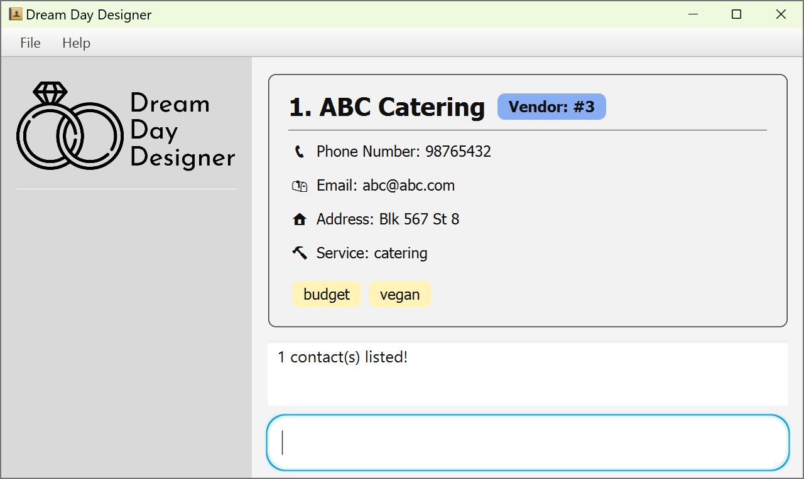
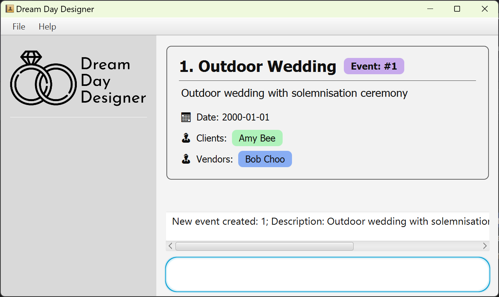

# Dream Day Designer User Guide

Are you a freelance **wedding planner**? Then DDD is just the right tool for you! Managing hundreds of clients and vendors can be troublesome, and **Dream Day Designer (DDD)** is our **answer** to your problems!

DDD is a desktop app for **wedding planners** to keep track of their **clients**, **vendors** and **events**, optimized for use via a Command Line Interface** (CLI) while still having the benefits of a Graphical User Interface (GUI).

DDD is tailored specifically to the needs of **wedding planners**, and is designed to streamline your workflows. If you can type fast, DDD can even help you manage your contacts faster than traditional GUI apps! Furthermore, DDD offers features designed to alleviate the hassle of managing disparate sets of contacts!

<!-- * Table of Contents -->
<page-nav />
<page-nav-print />

--------------------------------------------------------------------------------------------------------------------

## Quick Start

1. Ensure you have Java `17` or above installed in your Computer.

2. Download the latest `.jar` file from [here](https://github.com/AY2425S1-CS2103T-F13-3/tp/releases).

3. Copy the file to the folder you want to use as the _home folder_ for your DDD.

4. Open a command terminal, `cd` into the folder you put the jar file in, and use the `java -jar ddd.jar` command to run the application.<br>

A GUI similar to the below should appear in a few seconds. Note how the app contains some sample data.<br>


5. Type the command in the command box and press Enter to execute it. e.g. typing **`help`** and pressing Enter will open the help window.<br>
   Some example commands you can try:

   * `list -c` : Lists all clients.

   * `add -c n/Jane Doe p/91234567 e/jane.doe@example.com a/Blk 231 Sembawang St 4 d/2024-12-15 t/budget t/pets` : Adds a client named `Jane Doe` to DDD.

   * `add -v n/ABC Catering p/98765432 e/contact@abccatering.com a/Blk 123 Bukit Merah St 7 s/catering t/vegetarian t/budget` : Adds a vendor named `ABC Catering` to DDD.

   * `delete 2` : Deletes the 2nd contact shown in the current list.

   * `clear` : Deletes all contacts.

   * `exit` : Exits the app.

6. Refer to the [Features](#features) below for details of each command.

--------------------------------------------------------------------------------------------------------------------

## Introduction

Before diving deeper into DDD's features, let's run you through what DDD can do for you! In short, DDD offers a comprehensive system for managing your contacts. Contacts can be also be tagged or tied to events to streamline your workflows!

### Contacts

Each contact is a record of fields associated with a particular person/company. For each contact, DDD will track the following fields:

- Name
- Phone number
- Email
- Address

DDD also allows you to tag contacts with your own tags. This is quite handy if you want to organize your contacts. For example, when sourcing suitable vendors for an upcoming wedding, you might want to keep track of which vendors are more budget-friendly:



### Clients

`Client` entries represent a generic contact with no additional fields.

### Vendors

`Vendor` entries contain an extra `service` field. DDD does not currently support vendors providing multiple services.

### Events

`Event` entries represent wedding events. DDD will track the following fields:

- Name
- Description
- Date
- Relevant clients
- Relevant vendors

Events allow you to group contacts together in a sensible and seamless manner like so:



### Use Case

Here's how you might use our app:

1. You have a new client who has enlisted your help to plan their big day.
2. You've settled most of the details, but you haven't found a suitable catering service yet.
3. Use DDD to search your existing catering vendors!

--------------------------------------------------------------------------------------------------------------------

## Features

**Notes about the command format:**<br>

Documentation style conventions are based on [Google's guide](https://developers.google.com/style/code-syntax).

* Words in `UPPER_CASE` are the parameters that must be supplied by the user.<br>
  e.g. in `list n/NAME`, `NAME` is a parameter which can be used as `list n/NAME`.

* `-TYPE_FLAG` can be either `-c`, `v` or `-e` for commands allowing specifying of type.
  e.g. in `list -TYPE_FLAG`, `-TYPE_FLAG` can allow for filtering all clients with `-c` or vendor with `-v`
or events with `-e`.

* Parameters wrapped in **square brackets** are optional arguments.<br>
  e.g. in `add n/NAME ... [t/TAG ...]`, `TAG` is an optional argument

* Parameters wrapped in **curly brackets** are mutually exclusive arguments (i.e. only 1 should be specified).<br>
  e.g. in `add {-c | -v s/SERVICE} ...`, `-c` and `-v s/SERVICE` are mutually exclusive arguments.

* Items with `…`​ after them can be used multiple times including zero times.<br>
  e.g. `t/TAG…​` can be used as ` ` (i.e. 0 times), `t/vegetarian`, `t/budget conscious t/small scale` etc.

* Parameters can be in any order.<br>
  e.g. if the command specifies `n/NAME p/PHONE_NUMBER -c`, `p/PHONE_NUMBER -c n/NAME` is also acceptable.

* Extraneous parameters for commands that do not take in parameters (such as `help`, `exit` and `clear`) will be ignored.<br>
  e.g. if the command specifies `help 123`, it will be interpreted as `help`.

* If you are using a PDF version of this document, be careful when copying and pasting commands that span multiple lines as space characters surrounding line-breaks may be omitted when copied over to the application.

### Viewing Help: `help`

Shows a message explaining how to access the help page.


Format:
```
help
```

### Create a New Record: `add`

Adds a new entity, of type specified by flag.

Format for adding **contact**:
```
add {-c | -v s/SERVICE} n/NAME p/PHONE e/EMAIL a/ADDRESS [t/TAG ...]
```

Examples:
* `add -c n/Jane Doe p/91234567 e/jd@gmail.com a/Blk 123 St 4 t/budget`
* `add -v n/ABC Catering p/98765432 e/abc@abc.com a/Blk 567 St 8 s/catering t/vegan t/budget`

Note:
* Contacts' name and phone number pair need to be unique.
* A contact can have any number of tags (including 0)

___
Format for adding **event**:

```
add -e n/NAME des/DESCRIPTION d/DATE c/CLIENT_ID v/VENDOR_ID [c/CLIENT_ID ...] [v/VENDOR_ID ...]
```

Example:
* `add -e n/Sample Wedding des/Wedding reception d/2025-01-01 c/0 v/1 v/2`

Notes:
* Events are uniquely identified by their names and hence all event names must be unique.
* Each event must have minimal one client and one vendor.

### View Contacts/Events: `list`

List contacts or events (with optional filters).

Format:
```
list [{-c | -v}] [n/NAME] [p/PHONE] [e/EMAIL] [a/ADDRESS] [t/TAG ...] [id/ID] { | [s/SERVICE] }
```
```
list [-e] [n/NAME] [d/DATE] [des/DESCRIPTION] [id/ID]
```

Example:
* `list -c n/Jane p/81234567`
* `list -v s/catering`
* `list -e des/wedding`

Notes:
* If no arguments are specified, `list` will list all contacts (clients and vendors).
* The `-c`, `-v` and `-e` flags can be used to decide what type of data to list.
* `s/SERVICE` should only be specified if `v` is specified.
* `d/DATE` should only be specified if `-e` is specified.
* `des/DESCRIPTION` should only be specified if `-e` is specified.
* If no flags are present, the default behaviour is to list all contacts. e.g. `list asiodhainsd` will be treated as `list` as there are no `-c`, `-v`, or `-e` flags.
* All user input in between flags are ignored. e.g. `list ajsdbnsad -c asjidna n/Jane` will be treated as `list -c n/jane`
* All parameters are optional. Leaving them out will list all contacts by default.
* The name keyword search is case-insensitive. e.g `hans` will match `Hans`.
* Only full words will be matched e.g. `Han` will not match `Hans`.
* Contacts matching all fields keyword will be returned (i.e. `AND` search). e.g. `list -c n/Jane p/91234567` will list all clients with name `Jane` **AND** phone number `91234567`.
* Searching by address will list all contacts with addresses that include the keywords. e.g. `list a/Blk 123` will list contacts with address `Blk 123` and `Blk 456` because`Blk 456` contains the word `Blk`.
* Likewise, searching by name will list all contacts and events with names that include the input keywords.

### Editing a Contact

Edit an existing contact.

Format:
```
edit {INDEX | id/ID} [n/NAME] [p/PHONE] [e/EMAIL] [a/ADDRESS] [s/SERVICE] [t/TAG ...]
```

Examples:
* `edit 1 p/91234567`
* `edit id/0 p/91234567 e/johndoe@example.com`

Notes:
* Only one of `INDEX` or `id/ID` should be specified.
* `s/SERVICE` should only be specified if the contact is a vendor.

### Deleting a Contact/Event : `delete`

Deletes a contact or an event.

Format:

```
delete INDEX
```

Examples:
* `delete 1`

Notes:
* `INDEX` should be the one-based index position of the contact or event displayed on the screen.
* The command is highly dependent on what is displayed on the screen, i.e., `delete 1` will have different results when preceded by different `list` options.
* To delete an event, the user has to enter `list -e` (with optional filters) to ensure the screen displays events, before entering the `delete` command.
* Similarly, to delete contacts, the user has to enter `list` (with optional filters) to ensure the screen displays contacts, before entering the `delete` command.
* The user will not be allowed to delete clients that are the **sole** client of any event, i.e., if any event only has a single client, that client cannot be deleted.
* The user must delete the corresponding event(s) before deleting the intended client.
* Users are allowed to delete vendors that are the **sole** vendor of any event, i.e. if the event only has a single vendor, it can still be deleted. However, while adding an event, at least 1 client and 1 vendor must be input to create an event.

### Clearing All Entries : `clear`

Clears all entries.

Format:
```
clear
```

### Exiting the App : `exit`

Exits the program.

Format:
```
exit
```

### Editing the Data File

DDD data are saved automatically as a JSON file `[JAR file location]/data/ddd.json`. Advanced users are welcome to update data directly by editing that data file.

<box type="warning" seamless>**Caution:**
If your changes to the data file makes its format invalid, DDD will discard all data and start with an empty data file at the next run.  Hence, it is recommended to take a backup of the file before editing it.<br>
Furthermore, certain edits can cause the DDD to behave in unexpected ways (e.g., if a value entered is outside the acceptable range). Therefore, edit the data file only if you are confident that you can update it correctly.</box>

--------------------------------------------------------------------------------------------------------------------

## FAQs

> **Q**: I accidentally deleted a contact. Is there an undo feature?<br>

**A**: Nope. Unforunately, undo has not been implemented.

> **Q**: How do I edit events?<br>

**A**: Unforunately, editing events has not been implemented. You will have to delete the existing event and create a new one with your desired details.

>**Q**: I have a vendor that provides multiple services, but I can only indicate 1 service per vendor entry. What should I do?<br>

**A**: In such a scenario, you can create a second entry which is named differently to store the contact. The reason each vendor can only provde 1 single service is so that searches via the `list` command can be more precise.

> **Q**: Can DDD be used by users who are not wedding planners (i.e. other event planners)?<br>

**A**: Yes! While DDD is targetted at wedding planners, its features can be adapted to store contacts related to planning events, not just limited to weddings.

> **Q**: How do I transfer my data to another Computer?<br>

**A**: Install the app in the other computer and overwrite the empty data file it creates with the file that contains the data of your previous DDD home folder.

--------------------------------------------------------------------------------------------------------------------

## Known Issues

1. **When using multiple screens**, if you move the application to a secondary screen, and later switch to using only the primary screen, the GUI will open off-screen. The remedy is to delete the `preferences.json` file created by the application before running the application again.
2. **If you minimize the Help Window** and then run the `help` command (or use the `Help` menu, or the keyboard shortcut `F1`) again, the original Help Window will remain minimized, and no new Help Window will appear. The remedy is to manually restore the minimized Help Window.

--------------------------------------------------------------------------------------------------------------------

## Command Summary

### `add`

<table>
  <tr>
    <th>Action</th>
    <th>Format</th>
    <th>Example</th>
  </tr>
  <tr>
    <td><strong>Create Client</strong></td>
    <td>
      <code>add -c n/NAME p/PHONE e/EMAIL a/ADDRESS [t/TAG ...]</code>
    </td>
    <td>
      <code>add -c n/Jane Doe p/91234567 e/jd@gmail.com a/Blk 123 St 4 t/budget</code>
    </td>
  </tr>
  <tr>
    <td><strong>Create Vendor</strong></td>
    <td>
      <code>add -v n/NAME p/PHONE e/EMAIL a/ADDRESS s/SERVICE [t/TAG ...]</code>
    </td>
    <td>
      <code>add -v n/ABC Catering p/98765432 e/abc@abc.com a/Blk 567 St 8 s/catering t/vegan t/budget</code>
    </td>
  </tr>
  <tr>
    <td><strong>Create Event</strong></td>
    <td>
      <code>add -e n/NAME des/DESCRIPTION d/DATE c/CLIENT_ID ... v/VENDOR_ID ...</code>
    </td>
    <td>
      <code>add -e n/Sample Wedding des/Wedding reception d/2000-01-01 c/0 v/1 v/2</code>
    </td>
  </tr>
</table>

### `list`

<table>
  <tr>
    <th>Action</th>
    <th>Format</th>
    <th>Example</th>
  </tr>
  <tr>
    <td><strong>List Contacts</strong></td>
    <td>
      <code>list</code>
    </td>
    <td>
      <code>list</code>
    </td>
  </tr>
  <tr>
    <td><strong>List Clients</strong></td>
    <td>
      <code>list -c [n/NAME] [n/NAME] [p/PHONE] [e/EMAIL] [a/ADDRESS] [t/TAG ...] [id/ID]</code>
    </td>
    <td>
      <code>list -c n/Jane</code>
    </td>
  </tr>
  <tr>
    <td><strong>List Vendors</strong></td>
    <td>
      <code>list -v [n/NAME] [n/NAME] [p/PHONE] [e/EMAIL] [a/ADDRESS] [t/TAG ...] [id/ID] [s/SERVICE]</code>
    </td>
    <td>
      <code>list -v s/catering</code>
    </td>
  </tr>
  <tr>
    <td><strong>List Events</strong></td>
    <td>
      <code>list -e [n/NAME] [d/DATE] [des/DESCRIPTION] [id/ID]</code>
    </td>
    <td>
      <code>list -e des/wedding</code>
    </td>
  </tr>
</table>

### `edit`

<table>
  <tr>
    <th>Action</th>
    <th>Format</th>
    <th>Example</th>
  </tr>
  <tr>
    <td><strong>Edit by Index</strong></td>
    <td>
      <code>edit INDEX [n/NAME] [p/PHONE] [e/EMAIL] [a/ADDRESS] [s/SERVICE] [t/TAG ...]</code>
    </td>
    <td>
      <code>edit 1 p/91234567</code>
    </td>
  </tr>
  <tr>
    <td><strong>Edit by ID</strong></td>
    <td>
      <code>edit id/ID [p/PHONE] [n/NAME] [e/EMAIL] [a/ADDRESS] [s/SERVICE] [t/TAG ...]</code>
    </td>
    <td>
      <code>edit id/0 p/91234567 e/johndoe@example.com</code>
    </td>
  </tr>
</table>

### Miscellaneous

<table>
  <tr>
    <th>Action</th>
    <th>Format</th>
    <th>Example</th>
  </tr>
  <tr>
    <td><strong>Delete Contact/Event by Index</strong></td>
    <td>
      <code>delete INDEX</code>
    </td>
    <td>
      <code>delete 1</code>
    </td>
  </tr>
  <tr>
    <td><strong>Clear Data</strong></td>
    <td>
      <code>clear</code>
    </td>
    <td>
      <code>clear</code>
    </td>
  </tr>
  <tr>
    <td><strong>Help</strong></td>
    <td>
      <code>help</code>
    </td>
    <td>
      <code>help</code>
    </td>
  </tr>
</table>

--------------------------------------------------------------------------------------------------------------------

## Glossary

In case you need more information on the command parameters, here's a more comprehensive explanation of each parameter:

### Flags

Some commands can be applied on clients, vendors and events. Use `-CONTAC_FLAG` to specify which type of record to edit (e.g. `list -c` to list clients).

* `-c`: flag to specify client related commmands
* `-v`: flag to specify vendor related commands
* `-e`: flag to specify event related commands

### Parameters

<table>
  <tr>
    <th>Parameter</th>
    <th>Description</th>
    <th>Notes/Constraints</th>
  </tr>
  <tr>
    <td><code>n/NAME</code></td>
    <td>Name of contact/event</td>
    <td>
      <ul>
        <li>should only lphanumeric characters or spaces</li>
      </ul>
    </td>
  </tr>
  <tr>
    <td><code>p/PHONE</code></td>
    <td>Phone number of contact</td>
    <td>
      <ul>
        <li>should only contain numbers</li>
        <li>should have a length between 3 and 20 digits</li>
      </ul>
    </td>
  </tr>
  <tr>
    <td><code>e/EMAIL</code></td>
    <td>Email address of contact</td>
    <td>
      <ul>
        <li>follows the format <code>LOCAL_PART@DOMAIN_NAME</code></li>
        <li><code>LOCAL_PART</code> should only contain alphanumeric characters or these special characters <code>+_.-</code></li>
        <ul>
          <li><code>LOCAL_PART</code> should not start or end with special characters</li>
          <li><code>LOCAL_PART</code> can contain consecutive special characters, except for periods</li>
        </ul>
        <li><code>DOMAIN_NAME</code> should only contain alphanumeric characters and periods</li>
        <ul>
          <li><code>DOMAIN_NAME</code> consists of a set of domain labels separated by periods</li>
          <li>domain labels should be at least 2 characters long</li>
          <li>domain labels should start and end with alphanumeric characters</li>
        </ul>
      </ul>
    </td>
  </tr>
  <tr>
    <td><code>a/ADDRESS</code></td>
    <td>Address of contact</td>
    <td>
      <ul>
        <li>can contain any value</li>
        <li>should not be blank</li>
      </ul>
    </td>
  </tr>
  </tr>
  <tr>
    <td><code>s/SERVICE</code></td>
    <td>Service provided by vendor</td>
    <td>
      <ul>
        <li>should only contain alphanumeric characters and spaces</li>
        <li>should not be blank</li>
      </ul>
    </td>
  </tr>
  <tr>
    <td><code>d/DATE</code></td>
    <td>Date of event</td>
    <td>
      <ul>should follow one of these formats:
        <ul>
          <li><code>MM/dd/yyyy</code></li>
          <li><code>yyyy-MM-dd</code></li>
          <li><code>d MMM yyyy</code></li>
        </ul>
      </ul>
    </td>
  </tr>
  <tr>
    <td><code>t/TAG</code></td>
    <td>Tag associated with contact</td>
    <td>
      <ul>
        <li>should only contain alphanumeric characters or dashses</li>
      </ul>
    </td>
  </tr>
  <tr>
    <td><code>id/ID</code></td>
    <td>ID of contact/event</td>
    <td>
      <ul>
        <li>configured by DDD</li>
      </ul>
    </td>
  </tr>
</table>
