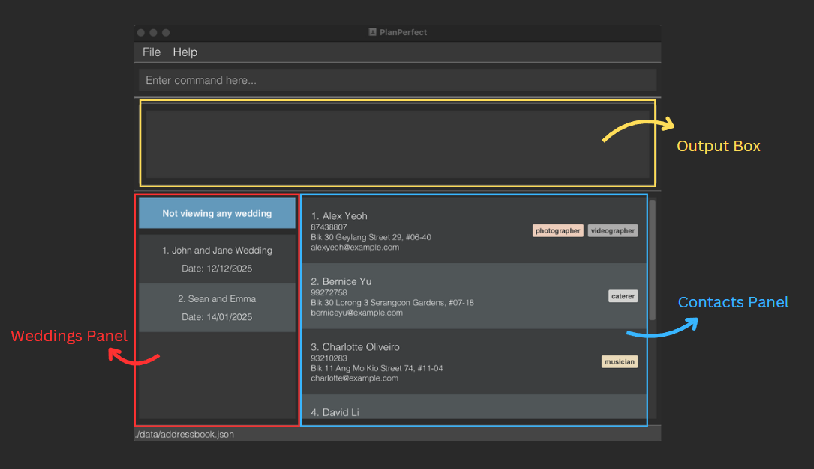

# PlanPerfect User Guide
PlanPerfect is designed to streamline the way wedding planners manage their contacts and organize wedding events. 
With PlanPerfect, you can save essential contacts — from photographers and florists to caterers and entertainers — in
one convenient application. Your contacts can easily be assigned to specific weddings based on their skills, helping 
you stay organized and focused on delivering seamless, unforgettable events. 

PlanPerfect is **optimized for users who prefer typing** while still having the benefits of a visual tool in the form 
of our Graphical User Interface (GUI). If you are a fast typist, PlanPerfect can get your wedding contact management
tasks done faster than traditional GUI apps.

<!-- * Table of Contents -->
<page-nav-print />

## Quick start

1. Ensure you have Java `17` or above installed in your Computer.

1. Download the latest `PlanPerfect.jar` file from [here](https://github.com/AY2425S1-CS2103T-T12-2/tp/releases).

1. Copy the downloaded file to an empty folder called 'PlanPerfect' on your Desktop. This folder will store all your data and the necessary files for running the PlanPerfect application.

1. Open a command terminal, `cd` into the folder you put the jar file in, and use the `java -jar PlanPerfect.jar` command to run the application.
   A GUI similar to the below should appear in a few seconds. Note how the app contains some sample data.
     
      
   <box type="tip" seamless>

   **If you are struggling with step 3 and/or 4, verify that you followed these steps correctly:**
    1. Create an empty folder on your Desktop called 'PlanPerfect'.
    2. Copy the PandaBot.jar file in this folder.
    3. Open a command terminal, such as terminal on MacOS devices or Command Prompt on Windows devices.
    4. Access the PlanPerfect folder by inputting `cd Desktop/PlanPerfect` and then hitting the Enter key.
    5. Type `java -jar PlanPerfect.jar` to launch the PlanPerfect application

    </box>
1. On the bottom left of the screen is a list of sample weddings. On the bottom right is a list of sample contacts.
1. Type commands in the command box and press Enter to execute them. e.g. typing **`help`** and pressing Enter will open the help window. 
   Some example commands you can try:

   * `add n/John David p/98765432 e/johnd@gmail.com a/Jurong East, Block 71, #04-19, 672381` : Adds a contact named `John David` with the specified details to your contacts.

   * `delete 3` : Deletes the 3rd contact shown in the current list in view.
   
   * `list` : Lists all contacts.

   * `exit` : Exits the app.
  
1. Refer to the [Features](#features) below for details of each command.
1. Once you are familiar with the commands, run the `clear` command to get rid of the sample data and start adding and managing your contacts and weddings with ease!

## Getting Around

1. **Output Box**: After you enter a command, any messages (informative or error-related) will be displayed here!
2. **Contacts Panel**: Here is where you can find your contacts. The contacts displayed here depend on the wedding you are currently viewing.
3. **Weddings Panel**: Here is where you can find your weddings. The currently viewed wedding will be displayed in the blue box at the top.

## Features

<box type="info" seamless>

**General Notes about the PlanPerfect Command Format:** 

* Words in `UPPER_CASE` are the parameters to be supplied by the user. 
  e.g. in `add n/NAME`, `NAME` is a parameter which can be used as `add n/John Doe`.

* Items in square brackets are optional. 
  e.g. `n/NAME [t/TAG]` can be used as `n/John Doe t/photographer` or as `n/John Doe`.

* Parameter descriptions containing a `...` indicate that the parameter can take one or more inputs (compulsory parameters) or no inputs at all (only for optional parameters). 
  e.g. `[t/TAG1 TAG2 ...]` can be ignored (0 tags), replaced with `t/photographer` (1 tag), or replaced with `t/photographer videographer` (2 tags) and so on. Suppose the square brackets were not present for this example, a command input with 0 provided tags would not be accepted.

* Parameters can be in any order. 
  e.g. if the command specifies `n/NAME p/PHONE_NUMBER`, `p/PHONE_NUMBER n/NAME` is also acceptable.

* Providing unexpected parameters for commands that do not take in parameters (such as `help`, `list`, `sort`, `exit` and `clear`) will be ignored. 
  e.g. if the command specifies `help 123`, it will be interpreted as `help`.

* Commands are executed relative to current view. The current view could either be a list of all contacts saved in your PlanPerfect application (accessed using the `list` command) or only contacts assigned to a particular wedding (accessed using the `view` command).
  * eg1: using the `filter` command to find florists while in the all contacts view will list ALL florists in your contacts. However, if you are in a wedding view, using `filter` to find 
    florists will only list florists assigned to that wedding.
  * eg2: certain commands like `unassign` can only be used while inside a wedding view. This aligns with the logical flow of viewing the contacts already assigned to a wedding when deciding if a particular assigned contact needs to be unassigned from that wedding.
  
* If you are using a PDF version of this document, be careful when copying and pasting commands that span multiple lines as space characters surrounding line-breaks may be omitted when copied over to the application.
  </box>

  

### General Features

#### Viewing help : `help`

Format: `help`

Shows a message with basic usage instructions for PlanPerfect. The link to this user guide can be copied to the clipboard for more advanced support.

  

### Contact-related Features
#### Adding a contact: `add`

Format: `add n/NAME p/PHONE_NUMBER e/EMAIL a/ADDRESS [t/TAG1 TAG2 ...]`

Adds a contact to the address book.

<box type="info" seamless>

**Note:**
A contact can only have up to 6 tags (including 0). No two contacts can have the same phone number.

</box>

Examples:
* `add n/Homer Simpson p/98765432 e/homersimpson@gmail.com a/742 Evergreen Terrace, Block 123, #01-01`
* `add n/Marge Simpson t/florist baker e/margesimpson@yahoo.com a/742 Evergreen Terrace p/98137192`
* `add n/Foutou Graffer e/foutoug@example.com a/123 Commons Studio p/99527199 t/photographer caterer`

  

#### Listing all contacts : `list`

Format: `list`

Shows a list of all contacts in the address book.

* Use this command to return to the view of all your contacts after using commands such as `filter` and `view` that display a subset of contacts.

  

#### Editing a contact : `edit`

Format: `edit INDEX [n/NAME] [p/PHONE] [e/EMAIL] [a/ADDRESS]`

Edits an existing contact in the address book.

* Edits the contact at the specified `INDEX`. The index refers to the index number shown next to a contact's name in the displayed contact list. The index **must be a positive integer** 1, 2, 3, …​
* At least one of the optional fields must be provided.
* Existing values will be updated to the input values only for the fields for which a new value is provided.
  
<box type="info" seamless>

**Note:**
Tagging & Untagging (Editing of Tags) is done using the `tag` and `untag` commands, not the `edit` command!

</box>

Examples:
*  `edit 1 p/91234567 e/johndoe@gmail.com` Edits the phone number and email address of the 1st contact in the current list to be `91234567` and `johndoe@gmail.com` respectively.
*  `edit 2 n/Betsy Crower` Edits the name of the 2nd contact in the current list to `Betsy Crower`.

  

#### Tagging a contact: `tag`

Format: `tag INDEX t/TAG1 TAG2 ...`

Adds one or more tags to a specific contact in the address book.

* Tags the contact at the specified `INDEX`. The index refers to the index number shown next to the contact in the contact list. The index **must be a positive integer** 1, 2, 3, ...
* Tags specified in the command must be alphanumeric.
* You can specify multiple tags in the same command by separating the tags with a space.
* Adding a tag to a contact who already has the tag will show an error message.

Examples:
* `tag 1 t/photographer` adds the tag 'photographer' to the contact at index 1.
* `tag 2 t/baker florist` adds the tags 'baker' and 'florist' to the contact at index 2.

  

#### Untagging a contact : `untag`

Format: `untag INDEX t/TAG1 TAG2 ...` or `untag INDEX t/all`

Removes one or more tags from a specific contact in the address book.

* Untags the contact at the specified `INDEX`. The index refers to the index number shown next to the contact in the contact list. The index **must be a positive integer** 1, 2, 3, ...
* If you only wants to remove specific tags from the contact, at least one tag to remove must be specified.
* You can remove multiple tags from a contact by separating them with a space.
* Alternatively, you can remove all tags associated with a contact by using `untag INDEX t/all`.

Examples:
* `untag 1 t/florist designer` removes the tags 'florist' and 'designer' from the 1st contact in the current list.
* `untag 2 t/all` removes all tags from the 2nd contact in the current list.

  

#### Listing all tags: `taglist`

Format: `taglist`

Lists the active tags across *all* contacts in the address book.
'Active tag' refers to a tag that currently assigned to at least 1 contact in your PlanPerfect application. 

* Lists active tags in alphabetical order.
* Useful to keep track of which tags you have used in order to maintain consistency.

  

#### Locating contacts by name: `find`

Format: `find KEYWORD1 KEYWORD2 ...`

Finds contacts whose names contain any of the given keywords.

* The search is case-insensitive. e.g `hans` will match `Hans`.
* The order of the keywords does not matter. e.g. `Hans Bo` will match `Bo Hans`.
* Only the name is searched.
* Only full words will be matched e.g. `Han` will not match `Hans`.
* Contacts matching at least one keyword will be returned (i.e. `OR` search).
  e.g. `Hans Bo` will return `Hans Gruber`, `Bo Yang`.

Examples:
* `find John` returns `john` and `John Doe`.
* `find alex david` returns `Alex Yeoh`, `David Li`.
  
  

  

#### Filtering contacts by tag: `filter`

Format: `filter t/TAG1 [TAG2 ...]`

Filters contacts who are tagged with all of the given tags.

* Contacts matching all tags will be returned (i.e. `AND` search).
* The search for tags is case-insensitive. eg. filtering by tag `Photographer` will also show contacts tagged with `photographer`.
* If used inside a wedding view, only contacts assigned to that wedding (with that tag) are displayed.

Examples:
* `filter t/foodCaterer bartender` returns all contacts tagged with both `foodCaterer` AND `bartender`.
* `filter t/foodCaterer` returns all contacts tagged with the tag `foodCaterer`. 

#### Deleting a contact : `delete`

Format: `delete INDEX`

Deletes the specified contact from the address book.

* Deletes the contact at the specified `INDEX`.
* The index refers to the index number shown in the displayed contact list.
* The index **must be a positive integer** 1, 2, 3, …​

Examples:
* `list` followed by `delete 2` deletes the 2nd contact in the address book.
* `find Betsy` followed by `delete 1` deletes the 1st contact in the results of the `find` command.

  

#### Sort all entries: `sort`

Format: `sort`

Sorts the contacts in the current view in alphabetical order.

  
#### Clearing all entries : `clear`

Format: `clear`

Clears all entries in the address book.

* After entering the `clear` command, a confirmation message will appear to ask you if you are sure about clearing the address book.
* If you input `yes` or `y`, the address book will be cleared. If other input is entered, the address book will not be cleared.

  

### Wedding-related Features

In this section, note that:
* A `WEDDING_INDEX` refers to that wedding's index number as shown in the wedding list.
* A `CONTACT_INDEX` refers to the that contact's index number in the contact list (the word `CONTACT` may be followed by a number to indicate its order of appearance in the command input).
* Any `WEDDING_INDEX` or `CONTACT_INDEX` **must be a positive integer** 1, 2, 3, ...

  

#### Add wedding: `addw`

Format: `addw n/WEDDING_NAME d/DATE (in DD/MM/YYYY format) [c/CONTACT1_INDEX CONTACT2_INDEX ...]`

Adds a wedding to PlanPerfect with the specified date. Optionally allows users to pre-assign contacts to the wedding.

* Running this command will create a new wedding in the wedding panel, allowing you to use its wedding index to execute relevant commands on that wedding.
* Date can be in the past (for documenting/tracking old weddings), present, or future.
* Contact indexes must be valid in the context of the current view.
  <box type="warning" seamless>

  **Caution:**
  If you want to pre-assign contacts when adding a wedding, you are encouraged to use `list` to view all contacts BEFORE using the `addw` command to add a new wedding. Not doing so will mean that you are only able to add contacts from the current wedding being viewed into the new wedding.
  
  </box>
Examples:
* `addw n/Arif and Sonali Wedding d/30/04/2025`
* `addw n/Daniel and Jane Wedding d/23/09/2025 c/1 3 4`

  

#### View wedding : `view`

Format: `view WEDDING_INDEX`

Displays contacts assigned to the wedding at the specified `WEDDING_INDEX`. Please refer to the 'General Notes' at the start of the Features section to learn more about the implications (on command behaviour) of entering a wedding view using this command 

Examples:
* `view 2` displays a list of all contacts involved in the 2nd wedding on the wedding list.

  

#### Edit wedding: `editw`

Format: `editw WEDDING_INDEX [n/WEDDING_NAME] [d/WEDDING_DATE]`

Edits the name and/or date in the wedding at the specified `WEDDING_INDEX`.

* Assigning/Removing of contacts from a wedding (editing wedding contacts) is to be done using the `assign` and `unassign` commands.

<box type="warning" seamless>

**Caution:**
The edited wedding name provided must not be the name of a pre-existing wedding in PlanPerfect

</box>

Examples:
* `editw 1 d/12/11/2025` edits the date of the 1st wedding on the wedding list.

  

#### Assign person to wedding : `assign`

Format: `assign WEDDING_INDEX c/CONTACT1_INDEX [CONTACT2_INDEX...] `

Assigns contacts at the specified index's to the wedding at the specified `WEDDING_INDEX`.

* At least 1 `CONTACT_INDEX` must be specified when using this command.

Examples:
* `assign 1 c/2` assigns the 2nd contact in the current contact list to 1st wedding in the wedding panel.
* `assign 3 c/1 4 5` assigns the 1st, 4th, and 5th contacts in the current contact list to the 3rd wedding in the wedding panel.

  

#### Unassign person from wedding : `unassign`

Format: `unassign c/CONTACT1_INDEX [CONTACT2_INDEX...] `

Unassigns contacts at the specified index's from the wedding you are currently viewing.

* At least 1 `CONTACT_INDEX` must be specified when using this command.

<box type="warning" seamless>

**Caution:**
You must be in a wedding view to unassign contacts from that wedding (using the `view` command). You can only input contact indices
from that wedding to be unassigned.

</box>

Examples: 
* `unassign c/1` unassigns the 1st contact from the wedding you are currently viewing.
* `unassign c/3 4 6` unassigns the 3rd, 4th and 6th contacts from the wedding you are currently viewing.

  

#### Delete wedding: `deletew`

Format: `deletew WEDDING_INDEX`

* Deletes the wedding at the specified `WEDDING_INDEX`.

Examples:
* `deletew 4` deletes the 4th wedding on the wedding panel.

  

### Other Features

#### Exiting the program : `exit`

Format: `exit`

Exits the program.

  

#### Saving / Editing the data file

PlanPerfect automatically saves your contact and wedding data as a JSON file `[JAR file location]/data/addressbook.json` whenever a command changes the data. 
Advanced users are welcome to update data directly by editing that data file if you choose.

<box type="warning" seamless>

**Caution:**
If your changes to the data file makes its format invalid, PlanPerfect will discard all data and start with an empty data file the next time it is run.  Hence, you are strongly recommended to save a backup of the file before editing it. 
Furthermore, certain edits can cause PlanPerfect to behave in unexpected ways (e.g., if a value entered is outside the acceptable range). Therefore, edit the data file only if you are confident that you can update it correctly.

</box>

  

#### Setting your own tag colors

User preferences are saved in the JSON file `[JAR file location]/preferences.json`. Advanced users are welcome to edit the 'TagColours' field in the JSON with custom hexadecimal values (colour codes) in order to customise the appearance of your tags. 

  

## FAQ

**Q**: How do I transfer my data to another Computer? 
**A**: Install the app in the other computer and overwrite the empty data file it creates with the file that contains the data of your previous AddressBook home folder.

**Q**: What do I need to start using PlanPerfect?  
**A**: Ensure Java 17 or above is installed on your computer. Then, download the `PlanPerfect.jar` file and follow the Quick Start instructions to set up and run the application.

**Q**: How do I add a contact?  
**A**: Use the `add` command followed by the contact details. For example: `add n/John Doe p/98765432 e/johnd@example.com a/123 Street Name`. You can also add optional tags like this: `add n/John Doe p/98765432 e/johnd@example.com a/123 Street Name t/photographer florist`.

**Q**: How can I organize my contacts with tags?  
**A**: You can add tags to each contact using the `tag` command. To see contacts with specific tags, use the `filter` command. Use `taglist` to view all active tags in alphabetical order.

**Q**: What if PlanPerfect opens off-screen after moving it to a secondary monitor?  
**A**: If this happens, delete the `preferences.json` file in the PlanPerfect folder and restart the app to reset the screen position.

  

## Known issues

1. **When using multiple screens**, if you move the application to a secondary screen, and later switch to using only the primary screen, the GUI will open off-screen. The remedy is to delete the `preferences.json` file created by the application before running the application again.
2. **If you minimize the Help Window** and then run the `help` command (or use the `Help` menu, or the keyboard shortcut `F1`) again, the original Help Window will remain minimized, and no new Help Window will appear. The remedy is to manually restore the minimized Help Window.

  

## Command summary

Action     | Format, Examples
-----------|----------------------------------------------------------------------------------------------------------------------------------------------------------------------
**Help**   | `help`
**Add Contact**    | `add n/NAME p/PHONE_NUMBER e/EMAIL a/ADDRESS [t/TAG1 TAG2 ...]`   e.g., `add n/James Ho p/92372718 e/jamesho@gmail.com a/123, Clementi Rd, 672965 t/photographer`
**List All Contacts**   | `list`
**Edit Contact**   | `edit INDEX [n/NAME] [p/PHONE_NUMBER] [e/EMAIL] [a/ADDRESS]`  e.g.,`edit 2 n/James Lee e/jameslee@yahoo.com`
**Tag Contact**    | `tag INDEX t/TAG1 [TAG2] ...`   e.g., `tag 1 t/photographer`
**Untag Contact**  | `untag INDEX t/TAG1 [TAG2] ...` or `untag INDEX t/all`   e.g., `untag 1 t/florist designer`
**Get List of (Active) Tags** | `taglist`
**Find Contacts (by Keyword)**   | `find KEYWORD1 KEYWORD2 ...`  e.g., `find James Jake`
**Filter Contacts (by Tag)** | `filter INDEX t/TAG1 [TAG2] ...`   e.g., `filter 2 t/caterer bartender`
**Delete Contact** | `delete INDEX`  e.g., `delete 3`
**Sort Contacts**   | `sort`
**Clear All Contacts**  | `clear`
**Add Wedding** | `addw n/WEDDING_NAME d/DATE [c/CONTACT1_INDEX CONTACT2_INDEX ...]`  e.g., `addw n/Daniel & Jane Wedding d/23/09/2025 c/1 3 4`
**View Wedding** | `view WEDDING_INDEX`  e.g., `view 3`
**Edit Wedding** | `editw WEDDING_INDEX [n/WEDDING_NAME] [d/WEDDING_DATE]`  e.g., `editw 1 d/12/11/2025`
**Assign Contact to Wedding** | `assign WEDDING_INDEX c/CONTACT1_INDEX [CONTACT2_INDEX ...]`  e.g., `assign 2 c/1 2 3`
**Unassign Contact from Wedding** | `unassign c/CONTACT1_INDEX [CONTACT2_INDEX ...]`  e.g., `unassign c/3 5`
**Delete Wedding** | `deletew WEDDING_INDEX`  e.g., `deletew 3`
**Exit**   | `exit`

