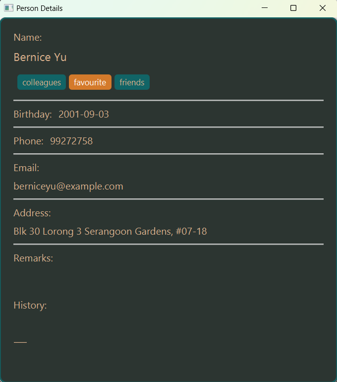
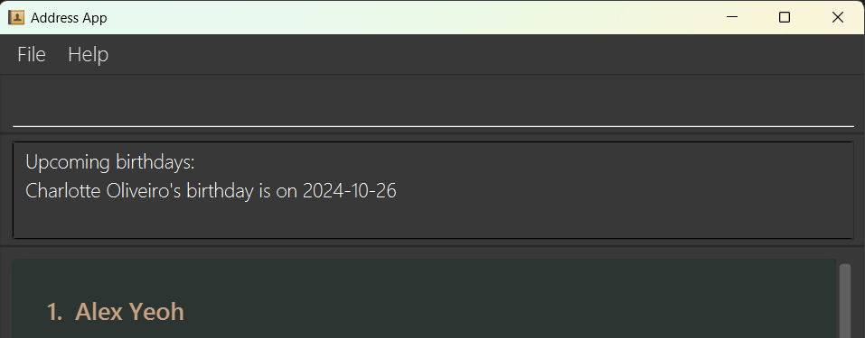

AddressBook Level 3 (AB3) is a **desktop app for managing contacts, optimized for use via a Command Line Interface** (CLI) while still having the benefits of a Graphical User Interface (GUI). If you can type fast, AB3 can get your contact management tasks done faster than traditional GUI apps.

* Table of Contents
{:toc}

--------------------------------------------------------------------------------------------------------------------

## Quick start

1. Ensure you have Java `17` or above installed in your Computer.

2. Download the latest `.jar` file from [here](https://github.com/se-edu/addressbook-level3/releases).

3. Copy the file to the folder you want to use as the _home folder_ for your AddressBook.

4. Open a command terminal, `cd` into the folder you put the jar file in, and use the `java -jar addressbook.jar` command to run the application. 
   A GUI similar to the below should appear in a few seconds. Note how the app contains some sample data. 
   

5. Type the command in the command box and press Enter to execute it. e.g. typing **`help`** and pressing Enter will open the help window. 
   Some example commands you can try:

   * `list` : Lists all contacts.

   * `add n/John Doe p/98765432 e/johnd@example.com a/John street, block 123, #01-01` : Adds a contact named `John Doe` to the Address Book.

   * `delete 3` : Deletes the 3rd contact shown in the current list.

   * `clear` : Deletes all contacts.

   * `exit` : Exits the app.

6. Refer to the [Features](#features) below for details of each command.

--------------------------------------------------------------------------------------------------------------------

## Features

**:information_source: Notes about the command format:** 

* Words in `UPPER_CASE` are the parameters to be supplied by the user. 
  e.g. in `add n/NAME`, `NAME` is a parameter which can be used as `add n/John Doe`.

* Items in square brackets are optional. 
  e.g `n/NAME [t/TAG]` can be used as `n/John Doe t/friend` or as `n/John Doe`.

* Items with `…`​ after them can be used multiple times including zero times. 
  e.g. `[t/TAG]…​` can be used as ` ` (i.e. 0 times), `t/friend`, `t/friend t/family` etc.

* Parameters can be in any order. 
  e.g. if the command specifies `n/NAME p/PHONE_NUMBER`, `p/PHONE_NUMBER n/NAME` is also acceptable.

* Extraneous parameters for commands that do not take in parameters (such as `help`, `list`, `exit` and `clear`) will be ignored. 
  e.g. if the command specifies `help 123`, it will be interpreted as `help`.

* If you are using a PDF version of this document, be careful when copying and pasting commands that span multiple lines as space characters surrounding line-breaks may be omitted when copied over to the application.

### **Viewing Help**

Shows a message explaining how to access the help page.

**Command Format:**  
`help`

- Provides help information.

---

### **Add Contact**

Adds a new contact with details such as name, phone number, physical address, birthday, email, social media handles, and remarks.

**Command Format:**  
`add n/<Full Name> p/<Phone Number> a/<Address> [b/<Birthday>] e/<Email> [r/<Remark>] [t/<Tag>]`

- `n/` Full name (mandatory)
- `p/` Phone number (mandatory)
- `a/` Address (mandatory)
- `b/` Birthday (optional)
- `e/` Email (optional)
- `r/` Remark (optional)
- `t/` Tag (optional)

:bulb: **Tip:**
A person can have any number of tags (including 0)

**Examples:**
- `add n/John Doe p/98765432 e/johnd@example.com a/John street, block 123, #01-01`
- `add n/Betsy Crowe t/friend e/betsycrowe@example.com a/Newgate Prison p/1234567 t/criminal`
- `add n/Alice Tan p/91234567 a/123 Orchard Road, #10-01 b/1990-08-15 e/alice.tan@example.com r/Interested in modern properties t/prospect t/follow-up`
- `add n/Ben Johnson p/87654321 a/456 Clementi Avenue, #02-15 t/client r/Prefers suburban areas b/1985-05-23`
- `add n/Clara Lim p/99887766 a/789 Punggol Way, #07-05 e/clara.lim@example.com t/lead t/premium`

---

### **List All Contacts**

Displays all persons stored in the address book.

**Command Format:**  
`list`

- Shows a list of all saved contacts.

---

### **Sort Contacts Alphabetically**

Sorts the contact list by name, either in ascending (A-Z) or descending (Z-A) order.

**Command Format:**  
`sort <asc/desc>`

- `asc` for ascending order
- `desc` for descending order

**Examples:**
- `sort asc`
- `sort desc`

---

### Editing a Person : `edit`

Edits an existing person in the address book.

**Command Format:**  
`edit INDEX [n/NAME] [p/PHONE] [e/EMAIL] [a/ADDRESS] [r/REMARK] [b/BIRTHDAY] [t/TAG]…​`

- Edits the person at the specified `INDEX`. The index is the number next to the person's name in the displayed list and must be a positive integer (e.g., 1, 2, 3, …).
- At least one optional field must be included for the edit to proceed.
- Any provided values will replace the person’s existing values.
- Editing tags will replace the current tags with the new ones; tags are not added cumulatively.
- To remove all tags from a person, use `t/` without adding any tags after it.
- Note that history and property **cannot be edited**

**Examples:**
-  `edit 1 p/91234567 e/johndoe@example.com` Edits the phone number and email address of the 1st person to be `91234567` and `johndoe@example.com` respectively.
-  `edit 2 n/Betsy Crower t/` Edits the name of the 2nd person to be `Betsy Crower` and clears all existing tags.
-  `edit 3 a/456 Clementi Road #02-15 r/Looking for a new property` Edits the address of the 3rd person to `456 Clementi Road #02-15` and adds a remark indicating they are `Looking for a new property`.
-  `edit 4 n/James Lee b/1989-07-20 t/friend t/premium` Edits the name of the 4th person to `James Lee`, sets their birthday to `1989-07-20`, and updates their tags to `friend` and `premium`.
-  `edit 5 p/98765432 t/` Edits the phone number of the 5th person to `98765432` and removes all existing tags.

### **Locating Persons by Name**

Finds persons whose names contain any of the given keywords.

**Command Format:**
`find KEYWORD [ADDITIONAL_KEYWORDS]`

- The search is case-insensitive. e.g `hans` will match `Hans`
- The order of the keywords does not matter. For example, `Hans Bo` will match `Bo Hans`
- Only the name is searched.
- Only **full words** will be matched e.g. `Han` will not match `Hans`
- Persons matching at least one keyword will be returned (i.e., an `OR` search).
  For example, `Hans Bo` will return `Hans Gruber`, `Bo Yang`

**Examples:**
- `find John` returns `john` and `John Doe`
- `find alex david` returns `Alex Yeoh`, `David Li` 
  

### **Deleting a Person**

Deletes the specified person from the address book.

**Command Format:**  
`delete INDEX`

- Deletes the person at the specified `INDEX`.
- The index refers to the index number shown in the displayed person list.
- The index **must be a positive integer** 1, 2, 3, …​

**Examples:**
- `list` followed by `delete 2` deletes the 2nd person in the address book.
- `find Betsy` followed by `delete 1` deletes the 1st person in the results of the `find` command.

### Clearing All Entries

Clears all entries from the address book.

**Command Format:**  
`clear`

### Exiting the Program

Exits the program.

**Command Format:**  
`exit`

### Saving the data

AddressBook data are saved in the hard disk automatically after any command that changes the data. There is no need to save manually.

### Editing the data file

AddressBook data are saved automatically as a JSON file `[JAR file location]/data/addressbook.json`. Advanced users are welcome to update data directly by editing that data file.

:exclamation: **Caution:**
If your changes to the data file makes its format invalid, AddressBook will discard all data and start with an empty data file at the next run. Hence, it is recommended to take a backup of the file before editing it. 
Furthermore, certain edits can cause the AddressBook to behave in unexpected ways (e.g., if a value entered is outside of the acceptable range). Therefore, edit the data file only if you are confident that you can update it correctly.

---

### **Favourite Contacts**

Marks a contact as a favourite for quick access or displays all favourite contacts.

**Command Format:**  
`favourite <ContactID>` or `favourite`

- When `ContactID` is provided, it marks that contact as a favourite.
- If `ContactID` is absent, all favourite contacts are moved to the front of the list for easy access.

**Examples:**
- `favourite 123` marks the contact with ID `123` as a favourite.
- `favourite` brings all favourite contacts to the top of the list.

---

### **Add or Edit Remarks for a Contact**

Adds or updates a remark for a specific contact.

**Command Format:**  
`remark <index> r/<remark message>`

- `index` is the contact's index in the list.
- `r/` The message to be added as a remark.

**Example:**
- `remark 1 r/Interested in waterfront property`

---

### **View Full Contact Details**

Displays detailed information of a specific contact on a single page.

**Command Format:**  
`view <ContactID>`

- Shows all the contact’s details.

**Example:**
- `view 123`

---

### **Favourite Contacts**

Marks a contact as a favourite for quick access.

**Command Format:**  
`favourite <ContactID>`

- Marks the contact with the specified `ContactID` as a favourite.

**Example:**
- `favourite 123`

---

### **Birthday Reminder for a Contact**

Stores a contact’s birthday and sets up a reminder for the birthday.

**Command Format:**  
`birthday <ContactID> d/<Birthday Date>`

- `d/` The contact’s birthday in `MM-DD` or `YYYY-MM-DD` format.

**Examples:**
- `birthday 123 d/1990-05-15`
- `birthday 456 d/09-25`

---

### Archiving data files `[coming in v2.0]`

_Details coming soon ..._

--------------------------------------------------------------------------------------------------------------------

## FAQ

**Q**: How do I transfer my data to another Computer? 
**A**: Install the app in the other computer and overwrite the empty data file it creates with the file that contains the data of your previous AddressBook home folder.

--------------------------------------------------------------------------------------------------------------------

## Known issues

1. **When using multiple screens**, if you move the application to a secondary screen, and later switch to using only the primary screen, the GUI will open off-screen. The remedy is to delete the `preferences.json` file created by the application before running the application again.
2. **If you minimize the Help Window** and then run the `help` command (or use the `Help` menu, or the keyboard shortcut `F1`) again, the original Help Window will remain minimized, and no new Help Window will appear. The remedy is to manually restore the minimized Help Window.

--------------------------------------------------------------------------------------------------------------------

## Command summary

| Action                 | Format, Examples                                                                                                                                                         |
|------------------------|--------------------------------------------------------------------------------------------------------------------------------------------------------------------------|
| **Add Contact**        | `add n/NAME p/PHONE_NUMBER e/EMAIL a/ADDRESS [b/BIRTHDAY] [r/REMARK] [t/TAG]`  e.g., `add n/John Doe p/98765432 e/johnd@example.com a/John street, block 123, #01-01` |
| **Clear All Contacts** | `clear`                                                                                                                                                                  |
| **Delete Contact**     | `delete INDEX`  e.g., `delete 3`                                                                                                                                      |
| **Edit Contact**       | `edit INDEX [n/NAME] [p/PHONE] [e/EMAIL] [a/ADDRESS] [r/REMARK] [b/BIRTHDAY] [t/TAG]`  e.g., `edit 2 n/James Lee e/jameslee@example.com`                              |
| **Find Contacts**      | `find KEYWORD [MORE_KEYWORDS]`  e.g., `find John`                                                                                                                     |
| **List All Contacts**  | `list`                                                                                                                                                                   |
| **Help**               | `help`                                                                                                                                                                   |
| **Sort Contacts**      | `sort asc/desc`  e.g., `sort asc`                                                                                                                                     |
| **Log Interaction**    | `log <ContactID> [d/DATE] l/<InteractionDetails>`  e.g., `log 123 d/2024-09-16 l/Discussed property updates`                                                          |
| **Add/Edit Remark**    | `remark <index> r/<remark message>`  e.g., `remark 1 r/Interested in waterfront property`                                                                             |
| **View Contact**       | `view <ContactID>`  e.g., `view 123`                                                                                                                                  |
| **Favourite Contact**  | `favourite <ContactID>`  e.g., `favourite 123`                                                                                                                        |
| **Add/Edit Birthday**  | `birthday <index> b/<yyyy-mm-dd>`  e.g., `birthday 1 r/2001-03-04`                                                                                                    |
| **Birthday Reminder**  | `birthday <ContactID> d/DATE`  e.g., `birthday 123 d/1990-05-15`                                                                                                      |
