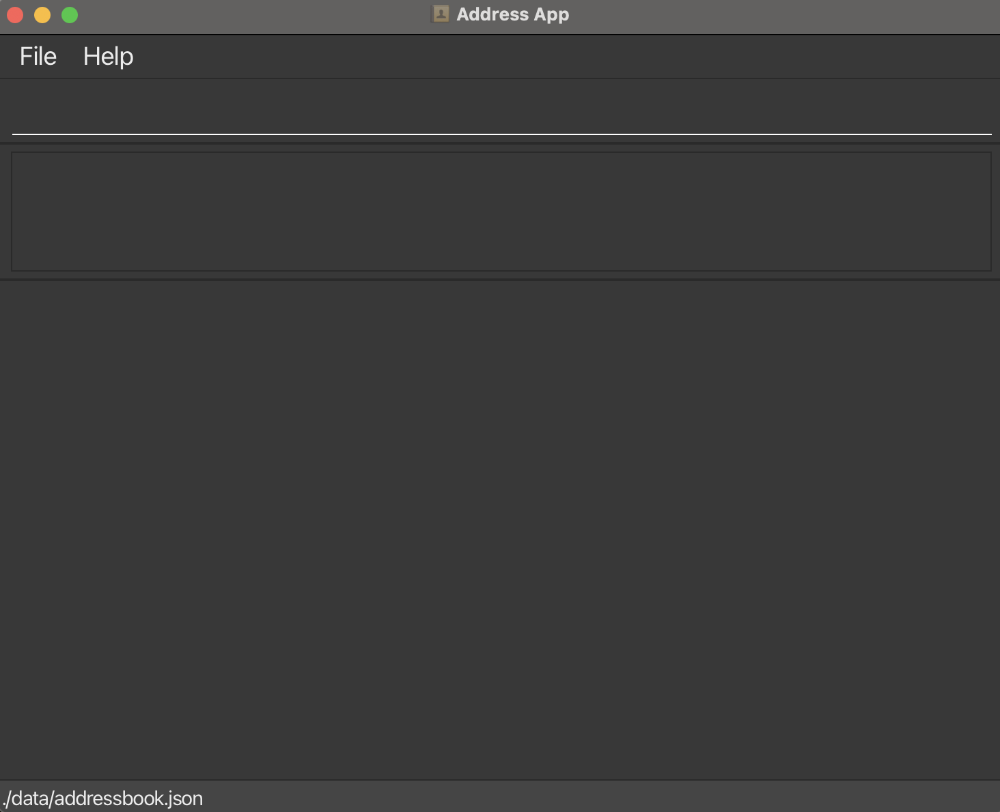
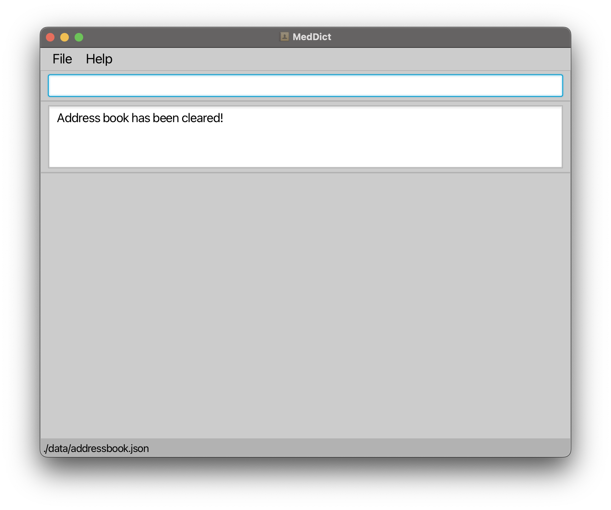

### About us

Welcome to the MedDict User Guide!

MedDict is a _desktop application designed for medical staff_ who manage a large number of patients. It simplifies data entry and retrieval, allowing quick access to contact details, patient conditions, and the progress of recurring or long-term patients. The application is designed with large databases in mind, supporting a streamlined process for tracking medical history, patient appointments, and treatment progress.

Unlike most other applications who predominantly function on a Graphical User Interface (GUI) where most of the user's inputs and outputs are achieved via the use of a mouse or touchscreen, MedDict is built upon the philosophy that a Command Line Interface (CLI) -- where all features and utility can be achieved via typed-in commands -- would be far more efficient.


With MedDict, we believe we can revolutionise your work and management experience! 💪

With all that said, let's get you started on your journey towards a new peak level of efficiency! 💯

If you would like to skip to any specific part of the User Guide, you can refer to the table below! 😊

* Table of Contents
{:toc}

--------------------------------------------------------------------------------------------------------------------

## Quick Start

This section is for users who are experienced in installing and using Java executables. If you require a more detailed Quick Start guide, please click [here](#quick-start-beginner-friendly-detailed) or scroll past this section.

1. Ensure you have Java `17` or above installed in your Computer.

2. Download the latest `.jar` file from [here](https://github.com/se-edu/addressbook-level3/releases).

3. Copy the file to the folder you want to use as the _home folder_ for your MedDict.

4. Open a command terminal, `cd` into the folder you put the jar file in, and use the `java -jar addressbook.jar` command to run the application.<br>
   A GUI similar to the below should appear in a few seconds. Note how the app contains some sample data.<br>
   

5. Type the command in the command box and press Enter to execute it. e.g. typing **`help`** and pressing Enter will open the help window.<br>
   Some example commands you can try:

   * `list` : Lists all contacts.

   * `add n/John Doe p/98765432 e/johnd@example.com a/John street, block 123, #01-01` : Adds a contact named `John Doe` to the Address Book.

   * `delete 3` : Deletes the 3rd contact shown in the current list.

   * `clear` : Deletes all contacts.

   * `exit` : Exits the app.

6. Refer to the [Features](#features) below for details of each command.

--------------------------------------------------------------------------------------------------------------------

## Quick Start (beginner-friendly, detailed)

1. **Make sure Java 17 or higher is installed on your computer.**

    * To Check if Java is Installed:

        1. Open your terminal:
            - **Windows**: Press `Windows + R`, type `cmd`, and press Enter.
            - **Mac**: Press `Command + Space`, type `Terminal`, and press Enter.
            - **Linux**: Press `Ctrl + Alt + T`, or look for "Terminal" in your applications menu.

        2. In the terminal, enter the following command and press Enter:

           ```bash
           java -version
           ```

        3. If Java 17 or higher is installed, you should see a version similar to this:

           ```bash
           java version "17.0.x" 2024-xx-xx LTS
           ```

        4. If the version is below 17, continue with the next steps to install Java.

    * To Install Java 17 (if Needed):
        1. Visit [Oracle’s Java 17 download page](https://www.oracle.com/java/technologies/javase-jdk17-downloads.html).
        2. Download and install the correct Java Development Kit (JDK) for your operating system by following the on-screen instructions.
        3. Once installed, run the `java -version` command again to confirm that Java is installed correctly.
<br><br>
2. **Download the latest `.jar` file as follows:**

    1. Go to the [GitHub releases page](https://github.com/) for the latest version.
    2. Download the `.jar` file (for example, `MedDict.jar`) from the latest release.
    3. Save the `.jar` file in the folder where you want to keep your MedDict project.
<br><br>
3. **Copy the `.jar` file to the folder you want to use as the home folder for MedDict.**

    * **Windows:**
        1. Open the Downloads folder and locate the `.jar` file.
        2. Right-click on the `.jar` file and select Copy.
        3. Go to the folder where you want to store MedDict, right-click, and select Paste.

    * **Mac:**
        1. Open Finder and navigate to your Downloads folder.
        2. Right-click (or use `Control + Click`) on the `.jar` file and choose Copy.
        3. Go to the folder where you want to keep the file, right-click, and select Paste.

    * **Linux:**
        1. Open your file manager and go to the Downloads directory.
        2. Right-click on the `.jar` file and choose Copy.
        3. Go to the destination folder, right-click, and select Paste.
<br><br>
4. **Open a command terminal, navigate to the folder where the `.jar` file is saved using the `cd` command, and then run the application with the following command.**
    * **Windows:**
        1. Open the folder where the `.jar` file is saved.
        2. To get the full path of this folder:
            - Right-click on the folder and select Properties.
            - In the General tab, locate the Location field and copy the path. (Alternatively, open the folder, click on the address bar, and copy the full path, e.g., `C:\Users\YourName\Documents\MedDict`).
        3. Open the Command Prompt:
            - Press `Windows + R`, type `cmd`, and press Enter.
            - Use the `cd` command and paste the copied path to navigate to the folder where the `.jar` file is saved. For example:
               ```bash
               cd C:\Users\YourName\Documents\MedDict
               ```
        4. Run the application according to the name of the jar file downloaded:
           ```bash
           java -jar MedDict.jar
           ```
           Note: For example, if the name of the jar file is `meddict-v1.6.jar`, type the following instead:
           ```bash
           java -jar meddict-v1.6.jar
           ```
    * **Mac/Linux:**
        1. Open the Terminal by searching for it or by pressing `Ctrl + Alt + T`.
        2. To get the full path of the folder where the `.jar` file is located:
            - Open Finder (Mac) or File Explorer (Linux).
            - Navigate to the folder where you saved the `.jar` file.
            - Right-click on the folder and choose Get Info (Mac) or Properties (Linux) to see the full path, or press `Cmd + Option + C` (Mac) to copy it.
        3. Use the `cd` command and paste the copied path to go to the folder where the `.jar` file is saved. For example:
           ```bash
           cd /Users/YourName/Documents/MedDict
           ```
        4. Run the application according to the name of the jar file downloaded:
           ```bash
           java -jar MedDict.jar
           ```
           Note: For example, if the name of the jar file is `meddict-v1.6.jar`, type the following instead:
           ```bash
           java -jar meddict-v1.6.jar
           ```
    After a few seconds, a GUI similar to the one below should appear:
    
<br><br>
5. **Type the command in the command box and press Enter to execute it. e.g. typing `help` and pressing Enter will open the help window.** <br>
   Some example commands you can try:

    * `list` : Lists all persons.

    * `createP n/John Doe p/98765432 e/johnd@example.com a/John street, block 123, #01-01` : Adds a Patient named John Doe to the Address Book.

    * `deleteP z/2` : Deletes the Patient with ID = 2.

    * `clear` : Deletes all persons.

    * `exit` : Exits the app.
<br><br>
6. Refer to the [Features](#features) below for details of each command.

--------------------------------------------------------------------------------------------------------------------

## Features

<div markdown="block" class="alert alert-info">

**:information_source: Notes about the command format:**<br>

* Words in `UPPER_CASE` are the parameters to be supplied by the user.<br>
  e.g. in `add n/NAME`, `NAME` is a parameter which can be used as `add n/John Doe`.

* Items in square brackets are optional.<br>
  e.g. `n/NAME [t/TAG]` can be used as `n/John Doe t/friend` or as `n/John Doe`.

* Items with `…`​ after them can be used multiple times including zero times.<br>
  e.g. `[t/TAG]…​` can be used as ` ` (i.e. 0 times), `t/friend`, `t/friend t/family` etc.

* Parameters can be in any order.<br>
  e.g. if the command specifies `n/NAME p/PHONE_NUMBER`, `p/PHONE_NUMBER n/NAME` is also acceptable.

* Extraneous parameters for commands that do not take in parameters (such as `help`, `list`, `exit` and `clear`) will be ignored.<br>
  e.g. if the command specifies `help 123`, it will be interpreted as `help`.

* If you are using a PDF version of this document, be careful when copying and pasting commands that span multiple lines as space characters surrounding line-breaks may be omitted when copied over to the application.
</div>


### Viewing Help : `help`

Displays a message with instructions on accessing the help page.

Format: `help`

Examples:
* `help` <br>
  **Output**: <br>


### Creating and Adding a Doctor : `createD`

Creates a doctor with given details and add the doctor to the MedDict database in the address book.

Format: `createD n/NAME p/PHONE_NUMBER e/EMAIL a/ADDRESS`

* **Name**: Only alphanumeric characters and spaces; cannot be blank.
* **Phone number:** Numeric only; minimum of 3 digits.
* **Email**: Must follow standard email format 'local-part@domain.com', where the local part contains only alphanumeric characters and certain special characters,
  but cannot start or end with these special characters (+_.-). The domain consists of labels separated by periods,
  ending with a label at least two characters long, with each label starting and ending with an alphanumeric character and allowing hyphens in between.
* **Doctor**: Duplicate doctors (same name, phone, or email) are not allowed.
* A _notification message_ will be output if there is failure in creating doctor.

Examples:
* `createD n/Dr Jane p/87654321 e/dr.jane.smith@hospital.com a/456 Elm Street r/physiotherapy` <br>
  **Output**: <br>
    Successfully created a new doctor of id: #1 : <br>
    Dr Jane Smith; Phone: 87654321; Email: dr.jane.smith@hospital.com; Address: 456 Elm Street; Tags: Specialist in physiotherapy

* `createD n/Dr Jane p/87654321 e/dr.jane.smith@hospital.com a/456 Elm Street r/physiotherapy` <br>
  **Output**: <br>
  This doctor already exists


### Creating and Adding a Patient : `createP`

Creates a patient with given details and add the patient to the MedDict database in the address book.

Format: `createP n/NAME p/PHONE_NUMBER e/EMAIL a/ADDRESS`

* **Name**: Only alphanumeric characters and spaces; cannot be blank.
* **Phone number:** Numeric only; minimum of 3 digits.
* **Email**: Must follow standard email format 'local-part@domain.com', where the local part contains only alphanumeric characters and certain special characters,
  but cannot start or end with these special characters (+_.-). The domain consists of labels separated by periods,
  ending with a label at least two characters long, with each label starting and ending with an alphanumeric character and allowing hyphens in between.
* **Patient**: Duplicate patients (same name, phone, or email) are not allowed.
* A _notification message_ will be output if there is failure in creating patient.


Examples:
* `createP n/Dr Jane p/87654321 e/dr.jane.smith@hospital.com a/456 Elm Street r/physiotherapy` <br>
  **Output**: <br> 
    Successfully created a new patient of id: #0 : <br>
    John Doe; Phone: 98765432; Email: johndoe@example.com; Address: 123 Baker Street; Tags: No known allergies
* `createP n/Dr Jane p/87654321 e/dr.jane.smith@hospital.com a/456 Elm Street r/physiotherapy` <br>
  **Output**: <br>
This patient already exists

### Deleting a Patient : `deleteP`

Deletes the patient with the specified `PatientId` from the MedDict database in the address book.

Format: `deleteP z/PATIENT_ID`

* **Patient ID**: Must be valid, present in the MedDict database, and an _even integer_ (0, 2, 4, …​).
* A _notification message_ will be output if there is failure in deleting patient.

Examples:
* `deleteP 0` <br>
  **Output**: <br>
  Successfully deleted a patient.
* `deleteP 2` <br>
  **Output**: <br>
  Unable to delete a patient, check the id entered!

### Add a Remark to a Patient : `addR`

Adds a remark to an existing patient with the specified `PatientId` in the MedDict database in address book.

Format: `addR z/PATIENT_ID r/REMARK`

* **Patient ID**: Must be valid, present in the MedDict database, and an _even integer_ (0, 2, 4, …​).
* A _notification message_ will be output if there is failure in adding notes to the patient.

Examples:
*  `addR z/0 r/cancer` <br>
    **Output**: <br>
   Successfully added remarks: cancer to patient of ID: 0.
*  `addR z/0 r/cancer` <br>
   **Output**: <br>
   Unable to add remarks! Check the id entered!

### Listing All Persons : `list`

Displays a list of all persons in the address book.

Format: `list`

Examples:
*   `list` <br>
    **Output**: <br>
    

### Editing a Person : `edit`

Edits an existing person with the specified `Id` in the address book.

Format: `edit z/ID [n/NAME] [p/PHONE_NUMBER] [e/EMAIL] [a/ADDRESS] [t/TAG]…​`

* **Patient ID**: Must be valid, present in the MedDict database, and an _even integer_ (0, 2, 4, …​).
* **Doctor ID**: Must be valid, present in the MedDict database, and an _odd integer_ (1, 3, 5, …​).
* At least one of the optional fields must be provided.
* Existing values will be updated to the input values.
* When editing tags, the existing tags of the person will be removed i.e. adding of tags is not cumulative.
* You can remove all the person’s tags by typing `t/` without specifying any tags after it.
* Editing the person with the detail same as the existing detail is not allowed.
* A _notification message_ will be output if there is failure in editing person in MedDict database in address book.

Examples:
*  `edit z/1 p/91234567 e/johndoe@example.com` <br>
   **Output**: <br>
   Edited Person: John Doe; Phone: 98765432; Email: johndoe@example.com; Address: 123 Baker Street; Tags: No known allergies
*  `edit z/2 n/Betsy Crower` <br>
   **Output**: <br>
   At least one field to edit must be provided.
* `edit z/1 p/91234567 e/johndoe@example.com` <br>
  **Output**: <br>
  This person already exists in the address book.

### Getting ID of Doctor or Patient by Name: `get`

Gets the id of a doctor or patient whose names contain any of the given keywords.

Format: `get KEYWORD`

* The search is case-insensitive. e.g. `hans` will match `Hans`
* The order of the keywords does not matter. e.g. `Hans Bo` will match `Bo Hans`
* Only the name is searched.
* Only full words will be matched e.g. `Han` will not match `Hans`
* Persons matching at least one keyword will be returned (i.e. `OR` search).
  e.g. `Hans Bo` will return `Hans Gruber`, `Bo Yang`
* A _notification message_ will be output if there is failure in retrieving id from MedDict database in address book.

Examples:
* `get john` <br>
  **Output**: <br>
  The id of the person that you are finding is: 0
* `get johnny` <br>
  **Output**: <br>
  Invalid name entered! Check the name that you want to search id for! Key in 'list' to view all patients
* `get johnny` <br>
  **Output**: <br>
  Two persons listed that suits your keyword! <br>
  enters more specific name keywords to retrieve the id of the person

### Finding Doctor or Patient by Name: `get`

Finds a doctor or patient whose names contain any of the given keywords.

Format: `find KEYWORD`

* The search is case-insensitive. e.g `hans` will match `Hans`
* The order of the keywords does not matter. e.g. `Hans Bo` will match `Bo Hans`
* Only the name is searched.
* Only full words will be matched e.g. `Han` will not match `Hans`
* Persons matching at least one keyword will be returned (i.e. `OR` search).
  e.g. `Hans Bo` will return `Hans Gruber`, `Bo Yang`
* A _notification message_ will be output if there is failure in retrieving id from MedDict database in address book.

Examples:
* `find john` <br>
  **Output**: <br>
  One person listed! Key in [list] to view all patients
* `find ` <br>
  **Output**: <br>
  Invalid name entered! Check the name that you want to search id for! <br>
  Key in [list] to view all patients
* `find johnny` <br>
  **Output**: <br>
  Two persons listed that suits your keyword! <br>
  enters more specific name keywords to retrieve the id of the person

### Adding an Appointment : `addA`

Adds an appointment to an existing patient with the specified `PatientId` and doctor with the specified `DoctorId` in the MedDict database in address book.

Format: `addA z/PATIENT_ID z/DOCTOR_ID x/DATE_TIME [r/REMARK]`


* **Patient ID**: Must be valid, present in the MedDict database, and an _even integer_ (0, 2, 4, …​).
* **Doctor ID**: Must be valid, present in the MedDict database, and an _odd integer_ (1, 3, 5, …​).
* **Remark**: Optional, user can add remark details by adding `[r/Remark]` when calling the command.
  Empty remark will be added to the appointment if remark is not specified.
* When adding appointment, the appointment detail will be added to the appointments list in both patient and doctor class.
* Each appointment must be scheduled at a unique time to prevent overlap for both the patient and the doctor.
* A _notification message_ will be output if there is failure in adding the appointments.

Examples:
*  `addA z/0 z/1 x/2024-12-31 15:23 r/Third physiotherapy session` <br>
   **Output**: <br>
   Successfully added appointment to a patient.
*  `addA z/0 z/1 x/2024-12-31 15:23` <br>
   **Output**: <br>
   Successfully added appointment to a patient.
*  `addA z/0 z/1 x/2024-12-31 15:23` <br>
   **Output**: <br>
   The patient already has another appointment!
*  `addA z/0 z/1  x/2024-12-31 15:23` <br>
   **Output**: <br>
   The doctor already has another appointment!

### View History of a Person : `view`

Displays the history of an existing person with the specified `Id` in the MedDict database in address book.

Format: `view z/ID [x/DATE_TIME]`

* **Id**: Must be valid, present in the MedDict database.
* **DateTime**: Optional, user can view history of the patient on a specific date by adding `[x/DATE_TIME]` when calling the command.
* A _notification message_ will be output if there are no histories found for the doctor.

Examples:
*  `view z/0 x/2024-12-31 15:23` <br>
   **Output**: <br>
   Appointment: `2024-12-31 15:23` for `0` (patient id) with `1` (doctor id). Remarks: `Third physiotherapy session`.
*  `view z/0` <br>
   **Output**: <br>
   Appointment: `2024-12-31 15:23` for `0` (patient id) with `1` (doctor id). Remarks: `Third physiotherapy session`. <br>
   Appointment: `2024-12-31 16:23` for `0` (patient id) with `1` (doctor id). Remarks: `Fourth physiotherapy session`.
*  `view z/1 x/2024-12-31` <br>
   **Output**: <br>
   No history found for the person.

### Check Appointment of a Person : `checkA`

Checks the appointments of an existing person with the specified `Id` in the MedDict database in address book.

Format: `checkA z/ID y/DATE`

* **Id**: Must be valid, present in the MedDict database.
* A _notification message_ will be output if there are no appointments found for the person.

Examples:
*  `checkA z/1 y/2024-12-31` <br>
   **Output**: <br>
   Appointment: `2024-12-31` for `0` (patient id) with `1` (doctor id). Remarks: `Third physiotherapy session` <br>
   Appointment: `2024-12-31` for `0` (patient id) with `1` (doctor id). Remarks: `Fourth physiotherapy session`
*  `checkA z/1 y/2024-12-30` <br>
   **Output**: <br>
   No appointment found for Doctor: `Amy Bee`

### Mark Appointment of a Doctor : `mark`

Marks appointment of an existing patients with the specified `PatientId`  
with a doctor with the specified `DoctorId` in the MedDict database in address book.

Format: `marK z/PATIENT_ID z/DOCTOR_ID x/DATE_TIME`

* **Patient ID**: Must be valid, present in the MedDict database, and an _even integer_ (0, 2, 4, …​).
* **Doctor ID**: Must be valid, present in the MedDict database, and an _odd integer_ (1, 3, 5, …​).
* A _notification message_ will be output if there is failure in marking appointments.

Examples:
*  `mark z/0 z/1 x/2024-12-31 15:23` <br>
   **Output**: <br>
   Successfully marked appointment as complete
*  `mark z/2 z/3 x/2024-12-31 16:23` <br>
   **Output**: <br>
   No appointments found on this date!

### Delete Appointment : `deleteA`

Deletes appointment of an existing patient with the specified `PatientId` 
with a doctor with the specified `DoctorId` in the MedDict database in address book.

Format: `deleteA z/PATIENT_ID z/DOCTOR_ID x/DATE_TIME`

* **Patient ID**: Must be valid, present in the MedDict database, and an _even integer_ (0, 2, 4, …​).
* **Doctor ID**: Must be valid, present in the MedDict database, and an _odd integer_ (1, 3, 5, …​).
* A _notification message_ will be output if there is failure in deleting appointment.

Examples:
*  `deleteA z/0 z/1 x/2024-12-31 15:23` <br>
   **Output**: <br>
   Successfully deleted appointment to a patient
*  `deleteA z/1 z/3 x/2024-12-31 15:23` <br>
   **Output**: <br>
   The appointment doesn't exist!

### Clearing All Entries : `clear`

Clears all entries from the address book.

Format: `clear`

Examples:
* `clear` <br>
  **Output**: <br>
  

### Exiting the Program : `exit`

Exits the program.

Format: `exit`

### Saving the Data

AddressBook data are saved in the hard disk automatically after any command that changes the data. There is no need to save manually.

### Editing the Data File

AddressBook data are saved automatically as a JSON file `[JAR file location]/data/addressbook.json`. Advanced users are welcome to update data directly by editing that data file.

<div markdown="span" class="alert alert-warning">:exclamation: **Caution:**
If your changes to the data file makes its format invalid, AddressBook will discard all data and start with an empty data file at the next run. Hence, it is recommended to take a backup of the file before editing it.<br>
Furthermore, certain edits can cause the AddressBook to behave in unexpected ways (e.g., if a value entered is outside the acceptable range). Therefore, edit the data file only if you are confident that you can update it correctly.
</div>

### Archiving Data Files `[coming in v2.0]`

_Details coming soon ..._

--------------------------------------------------------------------------------------------------------------------

## FAQ

**Q**: I am left-clicking to open the file but nothing happens / there is an error message!<br>
**A**: To open and run MedDict, please refer to the [Quick Start Guide](#quick-start)!

**Q**: How do I transfer my data to another Computer?<br>
**A**: Install the app in the other computer and overwrite the empty data file it creates with the file that contains the data of your previous AddressBook home folder.

**Q**: I want to update my version of MedDict with the newest version, how do I transfer my data? Is that possible?<br>
**A**: No worries, you can easily transfer your data! Refer to the steps below.
1. Navigate to the folder where you saved the `.jar` file. (Similar to steps in the [Detailed Quick Start Guide](#quick-start-beginner-friendly-detailed))
2. In that folder, find a folder titled data (e.g. `C:\Users\YourName\Documents\MedDict\data`)
3. Inside the folder, there should be a file titled addressbook.json, copy or backup this file into a safe location. (e.g. `C:\Users\YourName\Documents\MedDict\data\addressbook.json`)
4. Download the new release or version of MedDict (you can refer to the [Quick Start Guide](#quick-start) if needed)
5. Open / run the application once.
6. Close the application.
7. Go to where the new MedDict `.jar` file is located in, and repeat steps 2 to 3.
8. Replace the new addressbook.json file in the current data folder with the previous addressbook.json file that you have copied or saved. You can do this by copying the addressbook.json file from the old data folder and pasting it in the new data folder. When prompted to overwrite, click yes. Alternatively, you can use a text editor of your choice to edit the new and old addressbook.json file, then copy and paste all the content from the old addressbook.json file to the new one.
--------------------------------------------------------------------------------------------------------------------

## Known issues

1. **When using multiple screens**, if you move the application to a secondary screen, and later switch to using only the primary screen, the GUI will open off-screen. The remedy is to delete the `preferences.json` file created by the application before running the application again.
2. **If you minimize the Help Window** and then run the `help` command (or use the `Help` menu, or the keyboard shortcut `F1`) again, the original Help Window will remain minimized, and no new Help Window will appear. The remedy is to manually restore the minimized Help Window.

--------------------------------------------------------------------------------------------------------------------

## Command summary


| Action                 | Format, Examples                                                                                                                                          |
|------------------------|-----------------------------------------------------------------------------------------------------------------------------------------------------------|
| **Help**               | `help` <br> Shows help page                                                                                                                               |
| **Create Doctor**      | `createD n/NAME p/PHONE_NUMBER e/EMAIL a/ADDRESS` <br> e.g., `createD n/Dr Jane p/87654321 e/dr.jane.smith@hospital.com a/456 Elm Street r/physiotherapy` |
| **Create Patient**     | `createP n/NAME p/PHONE_NUMBER e/EMAIL a/ADDRESS` <br> e.g., `createP n/John Doe p/98765432 e/johndoe@example.com a/123 Baker Street`                     |
| **Delete Patient**     | `deleteP z/PATIENT_ID` <br> e.g., `deleteP z/2`                                                                                                           |
| **Add Notes**          | `addR z/PATIENT_ID r/REMARK` <br> e.g., `addR z/0 r/cancer`                                                                                               |
| **List**               | `list` <br> Shows all persons in address book                                                                                                             |
| **Edit**               | `edit z/ID [n/NAME] [p/PHONE_NUMBER] [e/EMAIL] [a/ADDRESS] [t/TAG]…​` <br> e.g., `edit z/2 p/91234567 e/johndoe@example.com`                              |
| **Get ID**             | `get KEYWORD` <br> e.g., `get john`                                                                                                                       |
| **Add Appointment**    | `addAppointment x/DATE_TIME z/PATIENT_ID z/DOCTOR_ID r/REMARK` <br> e.g., `addA x/2024-12-31 15:23 z/0 z/1 r/Third physiotherapy session`                 |
| **View History**       | `view z/PATIENT_ID [x/DATE_TIME]` <br> e.g., `view z/0 x/2024-12-31 15:23`                                                                                |
| **Check Appointment**  | `checkA z/DOCTOR_ID y/DATE` <br> e.g., `checkA z/1 y/2024-12-31`                                                                                          |
| **Mark Appointment**   | `mark  z/PATIENT_ID z/DOCTOR_ID` <br> e.g., `mark x/2024-12-31 15:23 z/00 z/01`                                                                           |
| **Delete Appointment** | `deleteA x/DATE_TIME z/PATIENT_ID z/DOCTOR_ID` <br> e.g., `deleteA x/2024-12-31 15.23 z/00 z/01`                                                          |
| **Clear**              | `clear` <br> Clears all entries                                                                                                                           |
| **Exit**               | `exit` <br> Exits the program                                                                                                                             |

