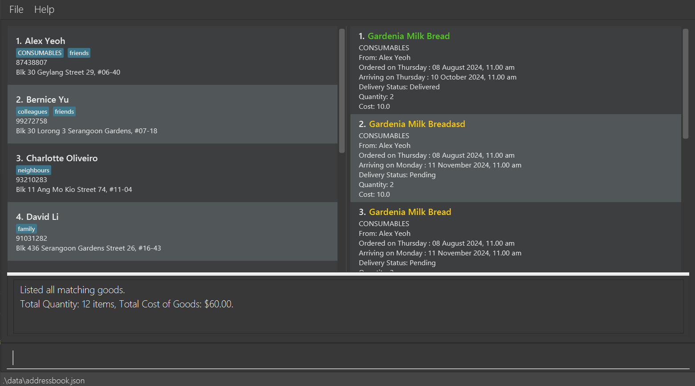

Supply Central is a **desktop app for managing suppliers, optimized for use via a Command Line Interface** (CLI) while still having the benefits of a Graphical User Interface (GUI). If you can type fast, SupplyCentral can get your supplier management tasks done faster than traditional GUI apps. This app aims to resolve the pain points of small business owners by helping them with information handling. This app is based on the Address Book 3 (AB3) project.

* Table of Contents
{:toc}

--------------------------------------------------------------------------------------------------------------------

## Quick start

1. Ensure you have Java `17` or above installed in your Computer.

1. Download the latest `.jar` file from [here](https://github.com/se-edu/addressbook-level3/releases).

1. Copy the file to the folder you want to use as the _home folder_ for your AddressBook.

1. Open a command terminal, `cd` into the folder you put the jar file in, and use the `java -jar addressbook.jar` command to run the application. 
   A GUI similar to the below should appear in a few seconds. Note how the app contains some sample data. 
   

1. Type the command in the command box and press Enter to execute it. e.g. typing **`help`** and pressing Enter will open the help window. 
   Some example commands you can try:

   * `list` : Lists all contacts.

   * `add n/John Doe p/98765432 a/John street, Block 123, #01-01` : Adds a supplier named `John Doe` to the Address Book.

   * `delete Alex Yeoh` : Deletes the supplier "Alex Yeoh".

   * `addgoods gn/Gardenia Milk Bread q/2 p/5 c/CONSUMABLES pd/2024-08-08 11:00 ad/2024-11-11 11:00 n/John Doe` : Adds an order for "Gardenia Milk Bread" from supplier "John Doe" for tracking.

   * `clear` : Deletes all contacts and goods registered in the application.

   * `exit` : Exits the app.

1. Refer to the [Features](#features) below for details of each command.

--------------------------------------------------------------------------------------------------------------------

## Features

**:information_source: Notes about the provided command format:** 

* Words in `UPPER_CASE` are the parameters to be supplied by the user. 
  e.g. in `add n/NAME`, `NAME` is a parameter which can be used as `add n/John Doe`.

* Items in square brackets are optional. 
  e.g `n/NAME [t/TAG]` can be used as `n/John Doe t/friend` or as `n/John Doe`.

* Items with `…`​ after them can be used multiple times including zero times. 
  e.g. `[t/TAG]…​` can be used as ` ` (i.e. 0 times), `t/friend`, `t/friend t/family` etc.

* Parameters can be in any order. 
  e.g. if the command specifies `n/NAME p/PHONE_NUMBER`, `p/PHONE_NUMBER n/NAME` is also acceptable.

* Extraneous parameters for commands that do not take in parameters (such as `help`, `list`, `exit` and `clear`) will be ignored. 
  e.g. if the command specifies `help 123`, it will be interpreted as `help`.

* If you are using a PDF version of this document, be careful when copying and pasting commands that span multiple lines as space characters surrounding line-breaks may be omitted when copied over to the application.

### Viewing help : `help`

Shows a message explaning how to access the help page.

Format: `help`

### Adding a supplier: `add`

Adds a supplier to the address book.

Format: `add n/NAME p/PHONE_NUMBER a/ADDRESS [t/TAG]…​`

:bulb: **Tip:**
A person can have any number of tags (including 0)

#### Address format
>**[Block Number]** [Street Name]**#[Unit Level]-[Unit No.]** [Building Name] Singapore [Postal Code]
>>[Block Number] & #[Unit Level]-[Unit No.] **are optional**

Examples:
* `add n/John Doe p/98765432 a/421 Marina Bay Road #12-34 Tan Kim PTE Building Singapore 123456`
* `add n/Betsy Crowe p/99991111 a/421 Marina Bay Road #12-34 Tan Kim PTE Building Singapore 123456 p/12345678 t/Vegetable`

### Listing all suppliers : `list`

Shows a list of all suppliers in the address book.

Format: `list`

### Editing a supplier : `edit`

Edits an existing supplier in the address book.

Format: `edit NAME [n/NEW_NAME] [p/PHONE] [a/ADDRESS] [t/TAG]…​`

* Edits the supplier with the specified `NAME`.
* At least one of the optional fields must be provided.
* Existing values will be updated to the input values.
* When editing tags, the existing tags of the supplier will be removed i.e adding of tags is not cumulative.
* You can remove all the supplier’s tags by typing `t/` without
    specifying any tags after it.

Examples:
*  `edit Bety n/Betsy Crower t/` edits the name of `Bety` to be `Betsy Crower` and clears all existing tags.

### Locating suppliers by name: `find`

Finds suppliers whose names contain any of the given keywords.

Format: `find KEYWORD [MORE_KEYWORDS] [c/CATEGORY]…​`

* The search is case-insensitive. e.g `hans` will match `Hans`
* The order of the keywords does not matter. e.g. `Hans Bo` will match `Bo Hans`
* The keyword will be search on the name of the supplier.
* Only full words will be matched e.g. `Han` will not match `Hans`
* Persons matching at least one keyword will be returned (i.e. `OR` search).
  e.g. `Hans Bo` will return `Hans Gruber`, `Bo Yang`
* Optionally, a selection of categories `CONSUMABLES`, `LIFESTYLE`, `SPECIALTY` can be specified to search for suppliers which has goods which has at least one of the specified category. If the category is specified, the keywords are optional.

Examples:
* `find John` returns `john` and `John Doe`
* `find alex david` returns `Alex Yeoh`, `David Li` 
  
* `find alex c/LIFESTYLE`
* `find c/CONSUMABLES c/LIFESTYLE`

### Deleting a supplier : `delete`

Deletes the specified supplier from the address book.

Format: `delete NAME`

* Deletes the person with the specified `NAME`.

Examples:
* `delete Amy` deletes the supplier of name `Amy` in the address book.

### Clearing all entries : `clear`

Clears all entries from the address book, including all tracked goods.

Format: `clear`

### Exiting the program : `exit`

Exits the program.

Format: `exit`

### Adding of Goods : `addgoods`

Adds a specific goods item tied to a supplier. All fields are required for this command.

Format: `addgoods gn/GOODS_NAME q/QUANTITY p/PRICE c/CATEGORY pd/PROCUREMENT_DATE ad/ARRIVAL DATE n/SUPPLIER_NAME`

Examples:

* `addgoods gn/Gardenia Milk Bread q/2 p/5 c/CONSUMABLES pd/2024-08-08 11:00 ad/2024-11-11 11:00 n/Alex Yeoh` will add goods of name `Gardenia Milk Bread` that belongs to the supplier `Alex Yeoh`.

Note: The goods category of goods will be reflected on the supplier as a tag. For instance, if a supplier has a goods which has a goods category of `CONSUMABLES`, a `CONSUMABLES` tag will be added to the supplier (visually). The tag information of the supplier remains as it is.

### Deletion of Goods : `deletegoods`

Deletes the specified goods from the specified supplier.

Format: `deletegoods n/NAME gn/GOODS_NAME`

Examples:

* `deletegoods n/John Doe gn/Gardenia Milk Bread` deletes the goods that has name `Gardenia Milk Bread` that belongs to the supplier `John Doe`. 

### View statistics for Goods : `viewgoods`

Displays a list of goods that fit the current applied filters. This will also provide the user with simple statistics like quantity/price totals based on the current list.

Format: `viewgoods [gn/GOODS_NAME] [c/CATEGORY] [n/SUPPLIER_NAME]`

Examples:

* `viewgoods gn/Banana c/CONSUMABLES` will display goods that contain the keyword `banana` and are of the `CONSUMABLES` type.

Note: All filters are optional, and all goods will be shown if no filters are provided for the command. Multiple filters are also accepted as shown by the case in the example above.

### Export Goods Data to CSV: `export`

Exports the currently displayed goods in a new CSV file. Should be used after filters have been applied to obtain a clean set of data for any external usage.
- This command is dependant on the 'viewgoods' command.

Format: `export`

### Saving the data

Supply Central data are saved in the hard disk automatically after any command that changes the data. There is no need to save manually.

### Editing the data file

SupplyCentral supplier data are saved automatically as a JSON file `[JAR file location]/data/addressbook.json`. Advanced users are welcome to update data directly by editing that data file.

:exclamation: **Caution:**
If your changes to the data file makes its format invalid, SupplyCentral will discard all data and start with an empty data file at the next run. Hence, it is recommended to take a backup of the file before editing it. 
Furthermore, certain edits can cause SupplyCentral to behave in unexpected ways (e.g., if a value entered is outside of the acceptable range). Therefore, edit the data file only if you are confident that you can update it correctly.

### Editing the Goods data file ###

SupplyCentral goods data will be stored in a CSV file for advanced users to access and use for business purposes. However, it is strongly discouraged for users to directly edit this data file due to risk of data corruption.

:exclamation: **Caution:**
Similar to the supplier data file, if your changes to the data file makes its format invalid, SupplyCentral will discard all invalid data and will only retain any valid data within the current file. Hence, as mentioned above, it is strongly discouraged to directly edit this file. 

### Resizing UI elements

SupplyCental allows you to resize the UI elements to better fit your screen. You can resize the UI elements by clicking and dragging the dividers as highlighted below.

The elements will resize according to the position of the divider, allocating more space for the output to be displayed, or more space for the suppliers/goods to be displayed.

### Delivery status

The delivery status of the goods can be easily seen through the color of the goods name. The color of the goods name will be yellow if the delivery status is `PENDING` and will change to green if the delivery status is `Delivered`, as shown in the image below.

--------------------------------------------------------------------------------------------------------------------

## FAQ

**Q**: How do I transfer my data to another Computer? 
**A**: Install the app in the other computer and overwrite the empty data file it creates with the file that contains the data of your previous AddressBook home folder.

--------------------------------------------------------------------------------------------------------------------

## Known issues

1. **When using multiple screens**, if you move the application to a secondary screen, and later switch to using only the primary screen, the GUI will open off-screen. The remedy is to delete the `preferences.json` file created by the application before running the application again.
2. **If you minimize the Help Window** and then run the `help` command (or use the `Help` menu, or the keyboard shortcut `F1`) again, the original Help Window will remain minimized, and no new Help Window will appear. The remedy is to manually restore the minimized Help Window.

--------------------------------------------------------------------------------------------------------------------

## Command summary

Action | Format, Examples
--------|------------------
**Add** | `add n/NAME p/PHONE_NUMBER a/ADDRESS [t/TAG]…​`   e.g. `add n/James Ho p/22224444 a/123, Clementi Rd, 1234665 t/friend t/colleague`
**Clear** | `clear`
**Delete** | `delete NAME`  e.g. `delete Amy`
**Edit** | `edit NAME [n/NEW_NAME] [p/PHONE_NUMBER] [a/ADDRESS] [t/TAG]…​`  e.g.`edit James n/James Lee`
**Find** | `find KEYWORD [MORE_KEYWORDS] [c/CATEGORY]…​`  e.g. `find James Jake c/CONSUMABLES`
**List** | `list`
**Help** | `help`
**Add Goods** | `addgoods gn/GOODS_NAME q/QUANTITY p/PRICE c/CATEGORY pd/PROCUREMENT_DATE ad/ARRIVAL DATE n/SUPPLIER_NAME`   e.g. `addgoods gn/Gardenia Milk Bread q/2 p/5 c/CONSUMABLES pd/2024-08-08 11:00 ad/2024-11-11 11:00 n/Alex Yeoh`
**Delete Goods** | `deletegoods n/NAME gn/GOODS_NAME`   e.g. `deletegoods n/John Doe gn/Gardenia Milk Bread`
**View Statistics** | `viewgoods [gn/GOODS_NAME] [c/CATEGORY] [n/SUPPLIER_NAME]`   e.g. `viewgoods gn/Banana c/CONSUMABLES`
**Export Data** | `export`
