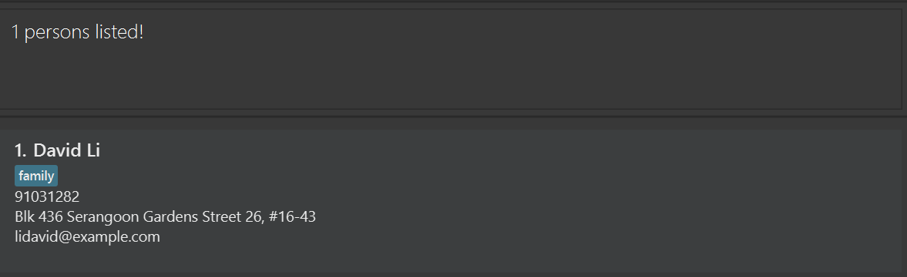

VBook is a **desktop app for managing contacts, optimized for use via a Command Line Interface** (CLI) while still 
having the benefits of a Graphical User Interface (GUI). If you can type fast, VBook can get your contact management 
tasks done faster than traditional GUI apps.

* Table of Contents
{:toc}

--------------------------------------------------------------------------------------------------------------------

## Quick start

1. Ensure you have Java `17` or above installed in your Computer.

2. Download the latest `.jar` file from [here](https://github.com/se-edu/addressbook-level3/releases) (not updated).

3. Copy the file to the folder you want to use as the _home folder_ for your AddressBook.

4. Open a command terminal, `cd` into the folder you put the jar file in, and use the `java -jar addressbook.jar` command to run the application. 
   A GUI similar to the below should appear in a few seconds. Note how the app contains some sample data. 
   

5. Type the command in the command box and press Enter to execute it. e.g. typing **`help`** and pressing Enter will open the help window. 
   Some example commands you can try:

   * `:list` : Lists all contacts.

   * `:add -n John Doe -p 98765432 -e johnd@example.com -a John street, block 123, #01-01` : Adds a contact named `John 
     Doe` to the Address Book.

   * `:rm -i 3` : Deletes the 3rd contact shown in the current list.

   * `:clear` : Deletes all contacts.

   * `:exit` : Exits the app.

6. Refer to the [Features](#features) below for details of each command.

--------------------------------------------------------------------------------------------------------------------

## Features

**:information_source: Notes about the command format:** 

* Words in `UPPER_CASE` are the parameters to be supplied by the user. 

  e.g. in `:add -n NAME`, `NAME` is a parameter which can be used as `:add -n John Doe`.

* Items in square brackets are optional. 
  e.g `-n NAME [-t TAG]` can be used as `-n John Doe -t friend` or as `-n John Doe`.

* Items with `…`​ after them can be used multiple times including zero times. 
  e.g. `[-t TAG]…​` can be used as ` ` (i.e. 0 times), `-t friend`, `-t friend -t family` etc.

* Parameters can be in any order. 
  e.g. if the command specifies `-n NAME -p PHONE_NUMBER`, `-p PHONE_NUMBER -n NAME` is also acceptable.

* Extraneous parameters for commands that do not take in parameters (such as `help`, `:list`, `exit` and `clear`) will be ignored. 
  e.g. if the command specifies `help 123`, it will be interpreted as `help`.

* If you are using a PDF version of this document, be careful when copying and pasting commands that span multiple lines as space characters surrounding line-breaks may be omitted when copied over to the application.

### Viewing help : `:help`

Shows a command cheatsheet, as well as a link to access the user guide.

Format: `:help`

### Adding a person: `:add` or `:a`

Adds a person to the address book.

Long command format: `:add -n NAME -p PHONE_NUMBER -e EMAIL -l ADDRESS [-t TAG]…​`
Short command format: `:a -n NAME -p PHONE_NUMBER -e EMAIL -l ADDRESS [-t TAG]…​`

:bulb: **Tip:**
A person can have any number of tags (including 0)

Examples:
* `:add -n John Doe -p 98765432 -e johnd@example.com -l John street, block 123, #01-01`
* `:a -n Betsy Crowe -t friend -e betsycrowe@example.com -l Newgate Prison -p 1234567 -t criminal`

### Listing all persons : `:list`

Shows a list of all persons in the address book.

Format: `:ls` or `:list`

### Editing a person : `edit`

Edits an existing person in the address book.

Format: `:edit INDEX [-n NAME] [-p PHONE] [-e EMAIL] [-a ADDRESS] [-t TAG]…​`

* Edits the person at the specified `INDEX`. The index refers to the index number shown in the displayed person list. The index **must be a positive integer** 1, 2, 3, …​
* At least one of the optional fields must be provided.
* Existing values will be updated to the input values.
* When editing tags, the existing tags of the person will be removed i.e adding of tags is not cumulative.
* You can remove all the person’s tags by typing `-t ` without
    specifying any tags after it.

Examples:
*  `:edit 1 -p 91234567 -e johndoe@example.com` Edits the phone number and email address of the 1st person to be 
   `91234567` and `johndoe@example.com` respectively.
*  `:edit 2 -n Betsy Crower -t ` Edits the name of the 2nd person to be `Betsy Crower` and clears all existing tags.

### Locating persons by name: `:find`

Finds persons whose names contain any of the given keywords.

Format: `:find [-n NAME] [-p PHONE] [-e EMAIL] [-a ADDRESS] [-t TAG]…​`

* The search is case-insensitive. 
    
    e.g `hans` will match `Hans`
* Persons with a certain name, phone number, email, address and remark can be searched through flags.

   e.g. to find a person with the name `david` and remark `busy`, the arguments would be `-n david -r busy`
* Each flag is optional, but there must be at least one flag in a query.
* As long as the contact contains the query, it is considered a match, e.g. searching`Han` will bring up `Hans`
* Only persons matching all keywords will be returned (i.e. `AND` search).
  
  e.g. `-n Hans -p 98765432` will not return `Hans` if his phone number is not `98765432`.

Examples:
* `:find -l Serangoon` returns `Bernice Yu` with location `Serangoon Gardens` and `David Li` with location `Serangoon Gardens`
* `:find -n david -l serangoon` returns `David Li` with location `Serangoon Gardens`
  

### Deleting a person : `:rm`

Deletes the specified person from the address book.

Format: `:rm -i INDEX1, INDEX2, ...` or `:remove -i INDEX`

* Deletes the person at the specified `INDEX`.
* The index refers to the index number shown in the displayed person list.
* The index **must be a positive integer** 1, 2, 3, …​

Examples:

* `:list` followed by `:rm -i 2, 3` deletes the 2nd and 3rd person in the address book.
* `:find Betsy` followed by `:rm -i 1` deletes the 1st person in the results of the `find` command.

### Undoing the last change: `:undo`

Reverts the address book to the state before the last change.\
User can undo up to 10 changes.\
Can undo commands that change the address book data, such as `:add`, `:remove`, `:edit`.

Format: `:undo`

Examples:
* If we add a new contact with `:add -n John Doe -p 98765432 -e johnd@example.com -l John street, block 123, #01-01`, 
using `:undo` will remove John Doe from the address book.
* If we delete a contact with `:rm -i 3`, using `:undo` will restore the deleted contact.

### Redoing the last undone change: `:redo`

Reapplies the last undone change to the address book.\
User can redo up to 10 undo changes.

Format: `:redo`

Examples:
* After using `:undo` to revert the addition of John Doe, using `:redo` will add John Doe back to the address book.
* After using `:undo` to revert the deletion of a contact, using `:redo` will delete the contact again.

### Clearing all entries : `:clear`

Clears all entries from the address book.

Format: `:clear`

### Exiting the program : `:exit`

Exits the program.

Format: `:exit`

### Saving the data

AddressBook data are saved in the hard disk automatically after any command that changes the data. There is no need to save manually.

### Editing the data file

AddressBook data are saved automatically as a JSON file `[JAR file location]/data/addressbook.json`. Advanced users are welcome to update data directly by editing that data file.

:exclamation: **Caution:**
If your changes to the data file makes its format invalid, AddressBook will discard all data and start with an empty data file at the next run. Hence, it is recommended to take a backup of the file before editing it. 
Furthermore, certain edits can cause the AddressBook to behave in unexpected ways (e.g., if a value entered is outside of the acceptable range). Therefore, edit the data file only if you are confident that you can update it correctly.

### Archiving data files `[coming in v2.0]`

_Details coming soon ..._

--------------------------------------------------------------------------------------------------------------------

## FAQ

**Q**: How do I transfer my data to another Computer? 
**A**: Install the app in the other computer and overwrite the empty data file it creates with the file that contains the data of your previous AddressBook home folder.

--------------------------------------------------------------------------------------------------------------------

## Known issues

1. **When using multiple screens**, if you move the application to a secondary screen, and later switch to using only the primary screen, the GUI will open off-screen. The remedy is to delete the `preferences.json` file created by the application before running the application again.
2. **If you minimize the Help Window** and then run the `help` command (or use the `Help` menu, or the keyboard shortcut `F1`) again, the original Help Window will remain minimized, and no new Help Window will appear. The remedy is to manually restore the minimized Help Window.

--------------------------------------------------------------------------------------------------------------------

## Command summary

| Action     | Format                                                                                                                         | Examples                                                                                                                                        |
|------------|--------------------------------------------------------------------------------------------------------------------------------|-------------------------------------------------------------------------------------------------------------------------------------------------|
| **Add**    | `:add -n NAME -p PHONE_NUMBER -e EMAIL -l LOCATION -t TAG -r REMARK…​`   `:a -n NAME ...`                               | `:add -n James Ho -p 22224444 -e jamesho@example.com -l 123, Clementi Rd, 1234665 -t friend -r My favourite colleague`   `:a -n James Ho...` |
| **Clear**  | `:clear`                                                                                                                       | `:clear`                                                                                                                                        |
| **Delete** | `:remove -i INDEX` `:rm -i INDEX`                                                                                          | `:remove -i 3` `:rm -i 3`                                                                                                                   |
| **Edit**   | `:edit INDEX -n NAME -p PHONE_NUMBER -e EMAIL -l LOCATION -t TAG…​` `:ed INDEX -n NAME...`                                 | `:edit 2 -n James Lee -e jameslee@example.com` `:ed 2 -n Joshua...`                                                                         |
| **Find**   | `:find KEYWORD [MORE_KEYWORDS]`                                                                                                | `:find James Jake`                                                                                                                              |                                                                                                                                                 |
| **List**   | `:list` `:ls`                                                                                                              | `:list` `:ls`                                                                                                                               |
| **Help**   | `:help`                                                                                                                        | `:help`                                                                                                                                         |
| **Exit**   | `:exit`                                                                                                                        | `:exit`                                                                                                                                         |
