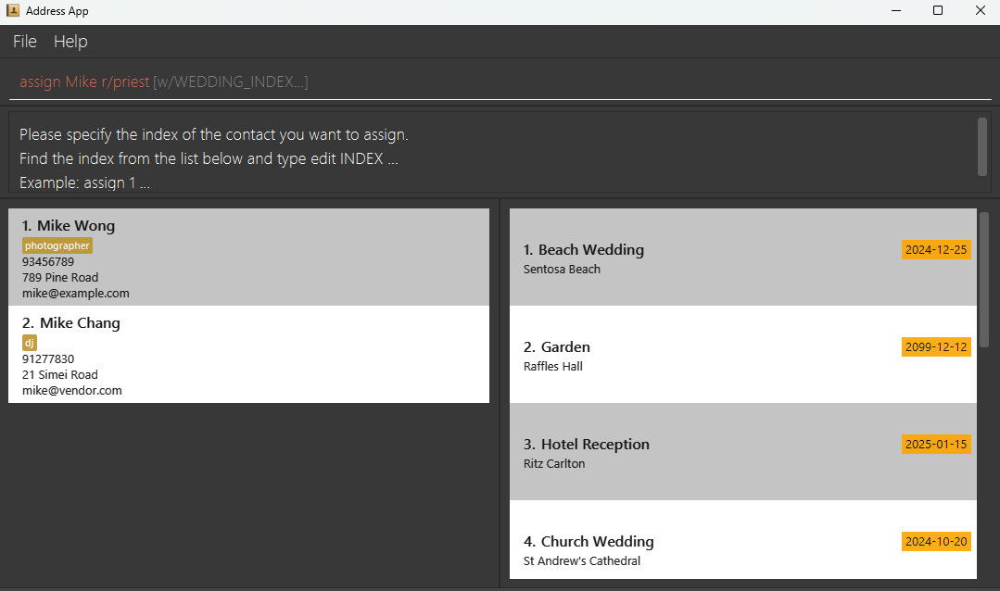
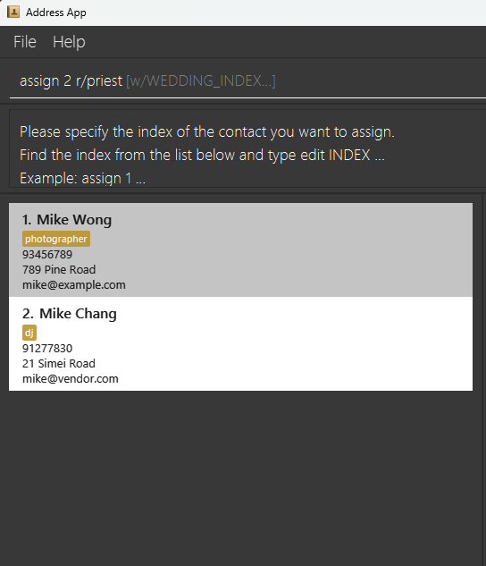
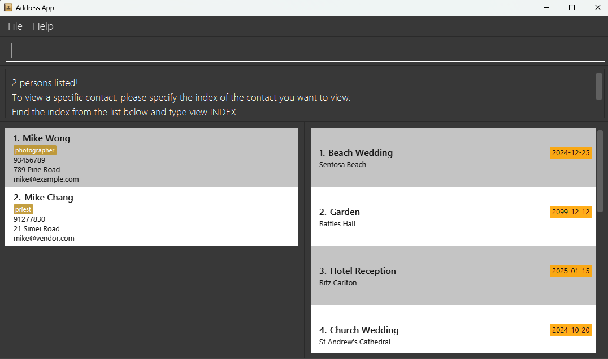
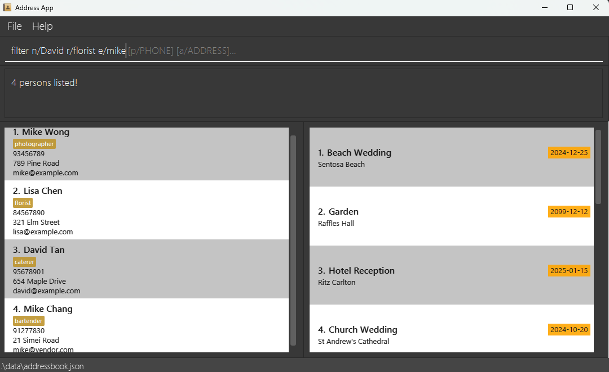
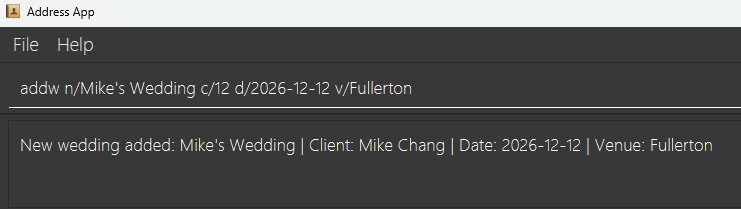
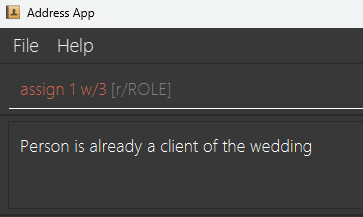
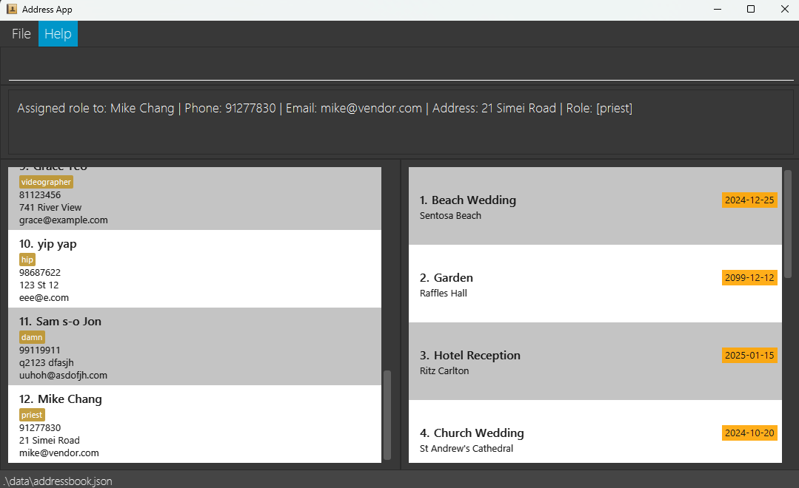

# Bridal Boss User Guide

Bridal Boss is a **desktop app for managing contacts, optimized for use via a  Line Interface** (CLI) while still having the benefits of a Graphical User Interface (GUI). If you can type fast, Bridal Boss can get your contact management tasks done faster than traditional GUI apps.

<!-- * Table of Contents -->
<page-nav-print />

--------------------------------------------------------------------------------------------------------------------

## Quick start

1. Ensure you have Java `17` or above installed in your Computer.

1. Download the latest `.jar` file from [here](https://github.com/se-edu/addressbook-level3/releases).

1. Copy the file to the folder you want to use as the _home folder_ for your AddressBook.

1. Open a command terminal, `cd` into the folder you put the jar file in, and use the `java -jar addressbook.jar` command to run the application.<br>
   A GUI similar to the below should appear in a few seconds. Note how the app contains some sample data.<br>
   

1. Type the command in the command box and press Enter to execute it. e.g. typing **`help`** and pressing Enter will open the help window.<br>
   Some example commands you can try:

   * `list` : Lists all contacts.

   * `add n/John Doe p/98765432 e/johnd@example.com a/John street, block 123, #01-01` : Adds a contact named `John Doe` to the Address Book.

   * `delete 3` : Deletes the 3rd contact shown in the current list.

   * `clear` : Deletes all contacts.

   * `exit` : Exits the app.

1. Refer to the [Features](#features) below for details of each command.

--------------------------------------------------------------------------------------------------------------------

---

## Features

### General Command Format

- **Command Structure**:
    - Commands are case-insensitive.
    - Parameters are case-insensitive unless specified.

- **Parameters in `UPPER_CASE`** are to be supplied by the user.
    - e.g., in `add n/NAME`, `NAME` is a parameter to be replaced: `add n/John Doe`.

- **Optional Parameters** are enclosed in square brackets `[ ]`.
    - e.g., `n/NAME [r/ROLE]` can be `n/John Doe r/florist` or just `n/John Doe`.

- **Multiple Parameters**:
    - Parameters with `...` after them can be used multiple times (including zero times).
        - e.g., `[w/WEDDING_INDEX]...` can be used as ` ` (zero times), `w/1`, `w/1 w/2`, etc.

- **Flexible Order**:
    - Parameters can be in any order.
        - e.g., if the command specifies `n/NAME p/PHONE_NUMBER`, you can input `p/PHONE_NUMBER n/NAME`.

- **Extraneous Parameters**:
    - Commands that do not take in parameters (e.g., `help`, `list`, `exit`, and `clear`) will ignore any extra parameters.
        - e.g., `help 123` will be interpreted as `help`.

- **Client Parameter (`c/`)**:
    - In wedding commands, accepts either an index number or a name.
        - e.g., `c/1` or `c/John Doe` are both valid.

- **Date Format**:
    - Dates must be specified in `YYYY-MM-DD` format.
        - e.g., `d/2024-12-31` for December 31st, 2024.

- **Role Parameter (`r/`)**:
    - Must be a single-word alphanumeric string (no spaces or special characters).
        - e.g., `r/photographer` is valid, but `r/wedding planner` is not.

- **Email Addresses**:
    - Must follow strict validation rules (see [Validation Rules](#validation-rules)).

- **Phone Numbers**:
    - Must start with 8 or 9 and be exactly 8 digits long.

- **Copying Commands**:
    - When copying commands that span multiple lines (e.g., from a PDF), ensure that spaces are correctly included.

---

### Validation Rules

#### Names

- **Allowed Characters**:
    - Alphabets, spaces, apostrophes (`'`), and hyphens (`-`).
- **Restrictions**:
    - Cannot be blank.
    - Maximum length of 70 characters.
- **Examples**:
    - `John Doe`, `Mary-Jane`, `O'Connor`.

#### Phone Numbers

- **Format**:
    - Must start with 8 or 9.
    - Exactly 8 digits long.
    - Numbers only; no spaces or special characters.
- **Uniqueness**:
    - Each phone number must be unique in the system.
- **Examples**:
    - `91234567`, `82345678`.

#### Email Addresses

- **Format**:
    - Must be in the form `local-part@domain`.
- **Local-part**:
    - Can contain alphanumeric characters and `+`, `_`, `.`, `-`.
    - Cannot start or end with a special character.
- **Domain**:
    - Must have at least two characters.
    - Cannot start or end with a hyphen (`-`).
- **Uniqueness**:
    - Each email must be unique in the system.
- **Examples**:
    - `john@example.com`, `user.name+tag@domain.com`.

#### Roles

- **Format**:
    - Single-word alphanumeric string.
- **Restrictions**:
    - No spaces or special characters.
    - Case-insensitive for matching.
- **Examples**:
    - `photographer`, `florist`, `coordinator`.

#### Wedding Fields

- **Wedding Name**:
    - Cannot be blank 
    - Must follow same restrictions as Person names:
           - Maximum 70 characters
           - Can only contain alphabets, spaces, apostrophes (') and hyphens (-)
- **Date**:
    - Must be in `YYYY-MM-DD` format
    - Must be a valid calendar date
- **Venue**:
    - Optional field - only validated when v/ prefix is provided
    - When provided, cannot be blank or consist only of whitespace
- **Client**:
    - A client can have only one wedding at a time.

#### Addresses

- **Restrictions**:
    - Cannot be blank.
    - Can contain any characters except leading/trailing spaces.
    - No length restriction.

---

### Index vs. Name-Based Commands

Certain commands (`edit`, `delete`, `deletew`, `view`, `vieww`, `assign`) support both index-based and name-based formats.

#### Index Format

- **Usage**:
    - Uses the position number from the displayed list.
    - **Format**: `COMMAND INDEX [parameters]`
    - **Example**:
        - `edit 1 n/John Smith`

#### Name-Based Format

- **Usage**:
    - Uses the person's or wedding's name.
    - **Format**: `COMMAND NAME [parameters]`
    - **Behavior**:
        - **Case-insensitive matching**.
        - **Full name matching**: Searches for names containing the entire keyword.
        - **Single Match**:
            - Command executes immediately.
        - **Multiple Matches**:
            - System displays a list of matching entries with indices.
            - User must re-enter the command using the index.
        - **No Matches**:
            - Displays "No matches found" message.
- **Examples**:
  
  *When multiple matches are found, the system displays a list with indices*

  
  *User selects a specific index to complete the command*

---

### Cross-Reference Validations

#### Client-Wedding Relationship

- **One Wedding per Client**:
    - A client can have only one wedding at a time.
- **Deletion Restrictions**:
    - Cannot delete a client who is associated with an active wedding.
        - Error: "Cannot delete this person as they are a client in a wedding. Please delete their wedding first."
- **Assignment Restrictions**:
    - Cannot assign a client as a vendor to their own wedding.
        - Error: "Cannot assign client to their own wedding."

#### Person-Wedding Relationships

- **Vendor Assignments**:
    - A person can be assigned to multiple weddings as a vendor.
    - Cannot assign the same person to the same wedding multiple times.
        - Error: "Person has already been assigned to wedding(s)."
- **Deletion Effects**:
    - Deleting a wedding removes all vendor assignments related to that wedding.

#### Role-Person Relationship

- **Single Role per Person**:
    - Each person can have at most one role.
    - Assigning a new role replaces any existing role.

---

### Command Details

Below are the detailed descriptions of each command, including examples, error messages, and important notes.

#### Viewing Help: `help`

Displays instructions on how to access the help page.

- **Format**: `help`
- **Example**:
  ```
  > help
  [Help instructions displayed]
  ```

---

#### Adding a Person: `add`

Adds a new person to the address book.

- **Format**: `add n/NAME p/PHONE_NUMBER e/EMAIL a/ADDRESS [r/ROLE] [w/WEDDING_INDEX]...`
- **Notes**:
    - All fields except `[r/ROLE]` and `[w/WEDDING_INDEX]` are required.
    - A person can have either 0 or 1 role.
    - A person can be assigned to multiple weddings.
- **Validation**:
    - Ensure all fields meet the criteria specified in the [Validation Rules](#validation-rules).
- **Examples**:
    - `add n/John Doe p/98765432 e/johnd@example.com a/123 Street`
    - `add n/Betsy Crowe p/91234567 e/betsycrowe@example.com a/Tanglin Mall r/florist`
    - `add n/Betsy Crowe p/91234567 e/betsycrowe@example.com a/Tanglin Mall w/1 w/2`
- **Common Error Cases**:
    - Duplicate phone number:
        - Error: "This number already exists in the address book."
    - Duplicate email:
        - Error: "This email already exists in the address book."
    - Duplicate contact:
        - Error: "This contact already exists in the address book."
    - Invalid wedding index:
        - Error: "Wedding [index] is not in the list."

---

#### Listing All Persons: `list`

Displays a list of all persons and weddings in the address book.

- **Format**: `list`
- **Example**:
  ```
  > list
  [List of all contacts displayed]
  ```

---

#### Editing a Person: `edit`

Edits the details of an existing person.

- **Formats**:
    - **By Index**: `edit INDEX [n/NAME] [p/PHONE] [e/EMAIL] [a/ADDRESS]`
    - **By Name**: `edit NAME [n/NAME] [p/PHONE] [e/EMAIL] [a/ADDRESS]`
- **Notes**:
    - At least one of the optional fields must be provided.
    - Existing values will be updated to the new values.
    - If multiple matches are found when using name-based format, the system will prompt for index.
- **Examples**:
    - `edit 1 p/91234567 e/johndoe@example.com`
        - Edits the phone number and email of the person at index 1.
    - `edit John Doe n/John Smith`
        - Changes the name of `John Doe` to `John Smith`.
- **Error Messages**:
    - Invalid index:
        - Error: "The person index provided is invalid."
    - No fields specified:
        - Error: "At least one field to edit must be provided."

---

#### Finding Persons by Name: `find`

Finds persons whose names contain any of the given keywords.

- **Format**: `find KEYWORD [MORE_KEYWORDS]`
- **Notes**:
    - Case-insensitive search.
    - Order of keywords does not matter.
    - Only the name is searched.
    - Only full words will be matched.
    - Returns persons matching at least one keyword (logical `OR` search).
- **Examples**:
    - `find John` returns `John` and `John Doe`.
    - `find alex david` returns `Alex Yeoh`, `David Li`.
- **Example Output**:
  ```
  > find Alex David
  1. Alex Yeoh
  2. David Li
  ```

---

#### Viewing a Contact: `view`

Displays detailed information about a specified person.

- **Formats**: 
  - By Index: `view INDEX`
  - By Name: `view NAME`
- **Notes**:
    - Case-insensitive matching.
    - Matches names containing the entire keyword.
    - Wedding list is only updated when one unique person is found. 
    - When multiple matches are found, only the person list is updated
- **Information Displayed**:
    - Personal details (name, phone, email, address).
    - Current role (if any).
    - Own wedding (if the person is a client).
    - Weddings where the person is assigned as a vendor (if any).
- **Examples**:
    - `view Mike` displays details for `Mike`.
    - `view Alex Yeo` displays details for `Alex Yeo`.

*Viewing a contact with mulitple matches shows their details and weddings remain unfiltered*
- **Error Messages**:
    - No contacts to view:
        - Error: "There is no contact to view."
    - Multiple matches found:
        - System displays matching contacts and prompts for index.

---

#### Deleting a Person: `delete`

Deletes a specified person from the address book.

- **Formats**:
    - **By Index**: `delete INDEX`
    - **By Name**: `delete NAME`
- **Notes**:
    - Cannot delete a client who has an active wedding.
        - Error: "Cannot delete this person as they are a client in a wedding. Please delete their wedding first."
    - If multiple matches are found when using name-based format, the system will prompt for index.
- **Examples**:
    - `delete 2` deletes the person at index 2.
    - `delete Betsy` deletes Betsy if there's only one match.
- **Error Messages**:
    - No contacts to delete:
        - Error: "There is nothing to delete."
    - Invalid index:
        - Error: "The person index provided is invalid."

---

#### Clearing All Entries: `clear`

Clears all entries from the address book.

- **Format**: `clear`
- **Warning**:
    - This action cannot be undone.
- **Example**:
  ```
  > clear
  Address book has been cleared.
  ```

---

#### Filtering Persons: `filter`

Filters and lists persons whose fields match the specified keywords.

- **Format**: `filter [n/NAME] [r/ROLE] [e/EMAIL] [p/PHONE] [a/ADDRESS]`
- **Notes**:
    - At least one field must be provided.
    - Parameters can be in any order.
    - Each field can contain single or multiple words (address and email allow partial matches).
    - Case-insensitive search.
    - Returns persons matching any of the fields (logical `OR` search).
- **Field-Specific Matching**:
    - **Name**: Requires exact full-word match.
    - **Role**: Exact match, case-insensitive.
    - **Email**: Allows partial matches.
    - **Phone**: Requires exact number match.
    - **Address**: Allows partial matches, case-insensitive.
- **Examples**:
    - `filter n/John` returns persons named `John`.
    - `filter r/vendor` returns persons with role `vendor`.
    - `filter e/gmail` returns persons whose emails contain "gmail".
    - `filter p/91234567` returns the person with phone number `91234567`.
    - `filter n/John r/vendor` returns persons who have name `John` or role `vendor`.
    - `filter e/gmail a/Jurong` returns persons whose email contains "gmail" or address contains "Jurong".
      
      *`filter n/David r/florist e/mike` Example of filtering results showing matched persons, weddings remain unfiltered*

---

#### Managing Weddings

##### Adding a Wedding: `addw`

Adds a new wedding to the address book.

- **Format**: `addw n/WEDDING_NAME c/CLIENT [d/DATE] [v/VENUE]`
- **Notes**:
    - Wedding name (`n/`) and client (`c/`) are mandatory.
    - Client can be specified by index or name.
        - If multiple matches are found when using name, the system will prompt for index.
    - Date (`d/`) must be in `YYYY-MM-DD` format if provided.
    - Venue (`v/`) cannot be blank or whitespace if provided.
    - A client can have only one active wedding.
- **Examples**:
    - `addw n/Beach Wedding c/1 d/2024-12-31 v/Sentosa Beach`
        - Adds a wedding named "Beach Wedding" for the client at index 1.
    - `addw n/Garden Wedding c/John Doe v/Botanical Gardens`
        - Adds a wedding for "John Doe" if there's only one match.

*Example of successfully adding a new wedding with all fields specified*
- **Error Messages**:
    - Client already has a wedding:
        - Error: "This person is already a client for another wedding."
    - Invalid date format:
        - Error: "Date must be in YYYY-MM-DD format."
    - Blank venue:
        - Error: "Venue cannot be blank or whitespace."
    - Name not in address book:
        - Error: "This person does not exist in the address book."

---

##### Editing a Wedding: `editw`

Edits the details of an existing wedding.

- **Format**: `editw w/INDEX [n/NAME] [d/DATE] [v/VENUE]`
- **Notes**:
    - At least one optional field must be provided.
    - Client cannot be changed after creation.
    - Existing values will be updated to the new values.
    - Date and venue must adhere to validation rules.
- **Examples**:
    - `editw w/1 n/Sunset Wedding`
        - Changes the name of the wedding at index 1 to "Sunset Wedding".
    - `editw w/2 d/2025-01-01 v/Grand Hotel`
        - Updates the date and venue of the wedding at index 2.
- **Error Messages**:
    - Invalid index:
        - Error: "The wedding index provided is invalid."
    - No fields specified:
        - Error: "No fields specified to edit."
    - Invalid date format:
        - Error: "Date must be in YYYY-MM-DD format."
    - Blank venue:
        - Error: "Venue cannot be blank or whitespace."

---

##### Viewing Wedding Details: `vieww`

Views the details of a wedding.

- **Formats**:
    - **By Index**: `vieww INDEX`
    - **By Keyword**: `vieww KEYWORD`
- **Notes**:
    - Keyword can be the wedding name or client's name.
    - If multiple matches are found, the system will prompt for index.
- **Information Displayed**:
    - Wedding name, client details, date, venue.
    - Assigned vendors.
- **Examples**:
    - `vieww 1` displays details of the wedding at index 1.
    - `vieww John` displays John's wedding if there's only one match.
- **Error Messages**:
    - Invalid index:
        - Error: "The wedding index provided is invalid."
    - No wedding records:
        - Error: "There are no wedding records to view."

---

##### Deleting a Wedding: `deletew`

Deletes a wedding from the address book.

- **Formats**:
    - **By Index**: `deletew INDEX`
    - **By Keyword**: `deletew KEYWORD`
- **Notes**:
    - Deleting a wedding removes the client-wedding relationship and all vendor assignments.
    - If multiple matches are found when using keyword, the system will prompt for index.
- **Examples**:
    - `deletew 2` deletes the wedding at index 2.
    - `deletew Beach Wedding` deletes the wedding named "Beach Wedding" if there's only one match.
- **Error Messages**:
    - No weddings to delete:
        - Error: "There is nothing to delete."
    - Invalid index:
        - Error: "The wedding index provided is invalid."
    - Multiple matches found:
        - System displays matching weddings and prompts for index.

---

#### Assigning a Person: `assign`

Assigns a role and/or weddings to a person.

- **Formats**:
    - **By Index**: `assign INDEX [r/ROLE] [w/WEDDING_INDEX]...`
    - **By Name**: `assign NAME [r/ROLE] [w/WEDDING_INDEX]...`
- **Notes**:
    - At least one of `[r/ROLE]` or `[w/WEDDING_INDEX]` must be provided.
    - **Role Assignment**:
        - Each person can have either 0 or 1 role at a time.
        - Assigning a new role replaces the existing role.
        - Role cannot be blank when using `r/`.
    - **Wedding Assignment**:
        - Can assign a person to multiple weddings.
        - Wedding indices must be valid and refer to existing weddings.
        - Cannot assign the same person to the same wedding multiple times.
        - Cannot assign a client to their own wedding as a vendor.
- **Examples**:
    - `assign 1 r/florist`
        - Assigns the role "florist" to the person at index 1.
    - `assign 1 w/1 w/2`
        - Assigns the person at index 1 to weddings at indices 1 and 2.
    -  `assign John Doe r/photographer w/2`
        - If there's only one match for "John Doe", assigns them the role "photographer" and to wedding at index 2.
          **Error Examples**:

*Example of error when trying to assign a client to their own wedding*

**Success Examples**:


*Example of successfully assigning a person to multiple weddings*
- **Error Messages**: FIX HERE
    - Cannot assign client to own wedding:
        - Error: "Cannot assign client to their own wedding."
    - Person already assigned to wedding(s):
        - Error: "Person has already been assigned to wedding(s)."
    - Invalid wedding index:
        - Error: "Wedding [index] is not in the list."
    - No person to assign:
        - Error: "There is no person to assign."
    - No weddings to assign:
        - Error: "There is no wedding to assign as the wedding list is empty."
    - Multiple matches found:
        - System displays matching contacts and prompts for index.

---

#### Exiting the Program: `exit`

Exits the application.

- **Format**: `exit`
- **Example**:
  ```
  > exit
  Application terminated.
  ```

---

#### Saving the Data

- **Automatic Saving**:
    - Data is automatically saved after any command that modifies the data.
- **Storage Location**:
    - Data is saved as a JSON file at `[JAR file location]/data/addressbook.json`.

---

#### Editing the Data File

Advanced users can edit the data file directly to modify the address book data.

- **File Location**:
    - `[JAR file location]/data/addressbook.json`
- **Caution**:
    - **Backup First**:
        - Make a copy of the data file before editing.
    - **Validity**:
        - Incorrect file formats or invalid data can cause the application to discard all data and start with an empty data file upon the next run.
        - Certain edits can cause the application to behave unexpectedly (e.g., entering values outside acceptable ranges).
- **Recommendation**:
    - Edit the data file only if you are confident in updating it correctly.

---

### Additional Notes

- **Using PDFs**:
    - When copying commands from a PDF, ensure that spaces and line-breaks are correctly maintained to avoid errors.

- **Error Messages**:
    - The application provides specific error messages to guide users in correcting their commands.

- **Case Sensitivity**:
    - Commands are generally case-insensitive, but parameters (especially for exact matches) may be case-sensitive as per the validation rules.

---

--------------------------------------------------------------------------------------------------------------------

## FAQ

**Q**: How do I transfer my data to another Computer?<br>
**A**: Install the app in the other computer and overwrite the empty data file it creates with the file that contains the data of your previous AddressBook home folder.

**Q**: How do I add a wedding for an existing client?<br>
**A**: First use `list` to see all contacts. Then use either `addw n/WEDDING_NAME c/INDEX` using the client's index number, or `addw n/WEDDING_NAME c/CLIENT_NAME` using the client's name.

**Q**: What happens if I try to delete a client who has a wedding?<br>
**A**: The system will prevent you from deleting the client and show an error message. You must first delete the client's wedding before deleting the contact.

**Q**: Can I change a wedding's client after creation?<br>
**A**: No, a wedding's client cannot be changed after creation. You would need to create a new wedding for the different client.

**Q**: Can a client have multiple weddings?<br>
**A**: No, each client can only have one wedding at a time.

**Q**: Can I assign multiple roles to a person?<br>
**A**: No, each person can only have one role at a time. Assigning a new role will replace the existing one.

**Q**: What happens when I delete a wedding?<br>
**A**: Deleting a wedding will remove all vendor assignments to that wedding and remove the client-wedding relationship. The contacts themselves are not deleted.

**Q**: Can I use the same phone number or email for different contacts?<br>
**A**: No, phone numbers and email addresses must be unique in the system. You'll receive an error message if you try to add or edit a contact with duplicate information.

**Q**: What happens if I find multiple contacts with the same name?<br>
**A**: When using name-based commands, if multiple matches are found, the system will show you a list of matching contacts with their indices. You'll need to use the index number to specify which contact you want to work with.

**Q**: How can I see all weddings a vendor is assigned to?<br>
**A**: Use the `view` command with the vendor's name or index. The system will show all weddings they are assigned to as part of their contact details.

**Q**: Can I search for contacts by partial name match?<br>
**A**: Yes, use the `find` command which matches partial names. However, note that it matches whole words only (e.g., "John" will match "John Doe" but not "Johnny").

**Q**: What's the difference between `find` and `filter` commands?<br>
**A**: `find` and `filter` have different search capabilities:
- `find`:
    - Searches only names
    - Supports partial word matches
    - Allows multiple name searches (e.g., `find alex david` returns both `Alex Yeoh` and `David Li`)
    - Uses OR logic (matches any keyword)

- `filter`:
    - Can search across multiple fields (name, role, email, phone, address)
    - Requires exact word matches for names and roles
    - Each field can only have one value - if you specify multiple values for the same field, only the last one is used
        - e.g., `filter n/John n/Peter` will only search for "Peter"
    - Uses OR logic between different fields
        - e.g., `filter n/John r/vendor` returns contacts with either name "John" OR role "vendor"
    - Cannot search for multiple names like `find` does - must use exact single name

**Q**: How do I remove a role from a contact?<br>
**A**: Currently, roles cannot be removed once assigned. You can only change them to a different role using the `assign` command.

**Q**: What happens to wedding assignments if I edit a contact's details?<br>
**A**: Editing a contact's basic details (name, phone, email, address) does not affect their wedding assignments or role. These relationships remain intact.

**Q**: Can I export my contact and wedding data?<br>
**A**: While there's no direct export command, you can copy the data file (addressbook.json) which contains all your data. This file is located in the same folder as the application.

--------------------------------------------------------------------------------------------------------------------

## Known issues

1. **When using multiple screens**, if you move the application to a secondary screen, and later switch to using only the primary screen, the GUI will open off-screen. The remedy is to delete the `preferences.json` file created by the application before running the application again.
2. **If you minimize the Help Window** and then run the `help` command (or use the `Help` menu, or the keyboard shortcut `F1`) again, the original Help Window will remain minimized, and no new Help Window will appear. The remedy is to manually restore the minimized Help Window.

--------------------------------------------------------------------------------------------------------------------

## Command summary

| Action      | Format, Examples                                                                                                                                                                                                                               |
|-------------|------------------------------------------------------------------------------------------------------------------------------------------------------------------------------------------------------------------------------------------------|
| **Add**     | `add n/NAME p/PHONE_NUMBER e/EMAIL a/ADDRESS [r/ROLE] [w/WEDDING_INDEX]... …​` <br> e.g., `add n/James Ho p/22224444 e/jamesho@example.com a/123, Clementi Rd, 1234665 r/florist w/1 w/2`                                                      |
| **Clear**   | `clear`                                                                                                                                                                                                                                        |
| **Delete**  | #1: `delete INDEX` or <br> #2: `delete NAME`<br> e.g., `delete 1`, `delete Alex`, `delete Alex Tan`                                                                                                                                            |
| **Edit**    | #1: `edit INDEX [n/NAME] [p/PHONE_NUMBER] [e/EMAIL] [a/ADDRESS]` or <br> #2: `edit NAME [n/NAME] [p/PHONE_NUMBER] [e/EMAIL] [a/ADDRESS]`<br> e.g.,`edit 2 n/James Lee e/jameslee@example.com`, `edit James n/James Lee e/jameslee@example.com` |
| **View**    | `view NAME`<br> e.g., `view Alex`, `view Alex Tan`                                                                                                                                                                                             |
| **Find**    | `find KEYWORD [MORE_KEYWORDS]`<br> e.g., `find James Jake`                                                                                                                                                                                     |
| **Filter**  | `filter [n/NAME] [p/PHONE_NUMBER] [e/EMAIL] [a/ADDRESS] [r/ROLE]`<br> e.g., `filter r/friends`                                                                                                                                                 |
| **View**    | `view KEYWORD`<br> e.g., `view Alex`, `view Alex Tan`                                                                                                                                                                                          |
| **List**    | `list`                                                                                                                                                                                                                                         |
| **Addw**    | `addw n/WEDDING_NAME c/CLIENT [d/DATE] [v/VENUE]` <br> e.g., `addw n/Beach Wedding c/1 d/2024-12-31 v/Sentosa Beach`                                                                                                                           |
| **Editw**   | `editw w/INDEX [n/NAME] [d/DATE] [v/VENUE]`<br> e.g., `editw w/1 d/2024-12-31 v/Garden Venue`                                                                                                                                                  |
| **Vieww**   | `vieww INDEX` or `vieww KEYWORD`<br> e.g., `vieww 1`, `vieww John`                                                                                                                                                                             |
| **Deletew** | #1: `deletew INDEX` or <br> #2: `deletew KEYWORD`<br> e.g., `deletew 1`, `deletew Beach Wedding`                                                                                                                                               |
| **Assign**  | `assign INDEX [r/ROLE] [w/WEDDING_INDEX]...` or `assign NAME [r/ROLE] [w/WEDDING_INDEX]...`<br> e.g., `assign 1 r/vendor`, `assign John Doe r/photographer w/2`                                                                                |
| **Help**    | `help`                                                                                                                                                                                                                                         |
| **Exit**    | `exit`                                                                                                                                                                                                                                         |
