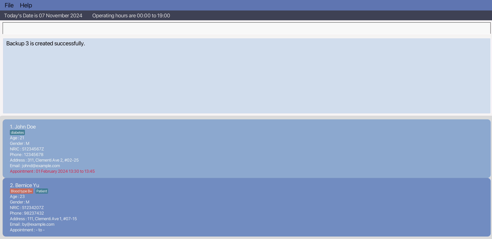
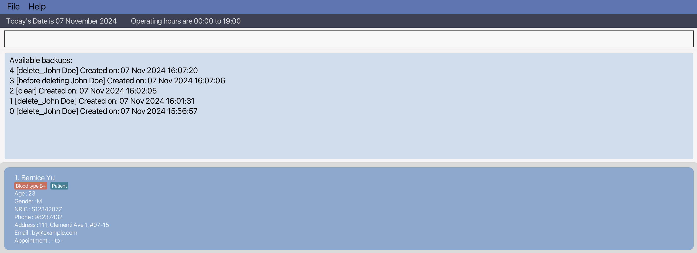
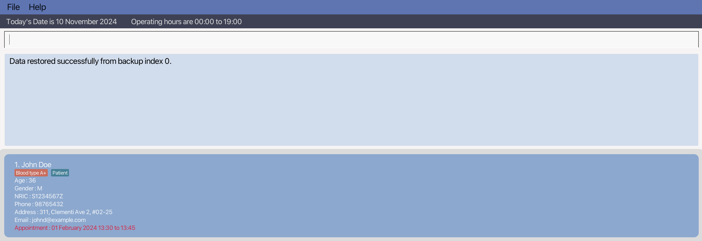

## Overview
ClinicBuddy aims to enhance the patient management process for small clinics, creating a platform to track patient
information such as their treatment, contact information, visit records and future appointments while still having the
benefits of a Graphical User Interface (GUI).

- **Patient Records Management:** Add, update, delete, and view patient details such as name, age, contact information, and appointments.
- **Appointment Scheduling:** Easily track patient appointments with scheduling and reminder features.
- **Backup and Restore:** Securely save and retrieve patient records with manual and automated backup options, ensuring data recovery in case of accidental deletion.
- **Search and Filter:** Quickly locate patient records by name, NRIC, or appointment date, making it easy to manage large numbers of patients.
- **Custom Operating Hours:** Set and adjust clinic operating hours, with automatic verification of scheduled appointments within these hours.

<div style="page-break-after: always;"></div>

1. [Quick Start](#quick-start)
2. [Features](#features)
    - [Viewing Help](#viewing-help--help)
    - [Adding a Patient](#adding-a-patient-add)
    - [Updating a Patient](#updating-a-patient--update)
    - [Deleting a Patient](#deleting-a-patient--delete)
        - [Deleting by NRIC](#deleting-a-patient-by-nric)
        - [Deleting by index](#deleting-a-patient-by-index)
    - [Clearing All Entries](#clearing-all-entries--clear)
    - [Listing All Patients](#listing-all-patients--list)
    - [Locating a Patients](#locating-patients-find)
        - [Finding by NRIC](#finding-a-single-record-by-its-nric)
        - [Finding by Name](#finding-multiple-records-by-their-names)
    - [Finding Patients with Appointments on a Specific Date](#finding-all-patients-with-appointments-on-a-specific-date--bookings)
    - [Deleting an Appointment](#deleting-an-appointment--deleteappt)
    - [Updating Operating Hours](#updating-operating-hours--hours)
    - [Saving Data](#saving-the-data)
    - [Editing the Data File](#editing-the-data-file)
    - [Backup Records](#backup-the-records--backup)
        - [Manual Backup](#how-manual-backup-works)
        - [Automated Backup](#automated-backup-)
    - [Listing Backups](#listing-all-backups--listbackups)
    - [Restoring Backups](#restoring-data-from-backups--restore)
    - [Exiting the Program](#exiting-the-program--exit)
3. [FAQ](#faq)
4. [Known Issues](#known-issues)
5. [Command Summary](#command-summary)

--------------------------------------------------------------------------------------------------------------------

<div style="page-break-after: always;"></div>

## Quick start

1. Ensure you have Java `17` or above installed in your Computer.

2. Download the latest `.jar` file from [here](https://github.com/AY2425S1-CS2103T-F11-3/tp/releases).

3. Copy the file to the folder you want to use as the _home folder_ for your ClinicBuddy.

4. Open a command terminal, `cd` into the folder you put the jar file in, and use the `java -jar clinicbuddy.jar` command to run
   the application.<br>

   A GUI similar to the below should appear in a few seconds. Note how the app contains some sample data.<br>
   

<div style="page-break-after: always;"></div>

5. Type the command in the command box and press Enter to execute it. e.g. typing **`help`** and pressing Enter will
   open the help window.<br>
   Some example commands you can try:

    * `list` : Lists all contacts.

    * `add n/John Doe a/36 g/M i/S1234567Z p/98765432 e/johnd@example.com h/311, Clementi Ave 2, #02-25 apt/02/10/2024 18:30 t/Patient` :
      Adds a patient named `John Doe` whose appointment is at `02 October 2024 18:30` to ClinicBuddy.

    * `delete S1234567Z` : Deletes the patient with the NRIC 'S1234567Z' in the current list.

    * `clear` : Deletes all contacts.

    * `exit` : Exits the app.

    * `backup update John's age` : Creates a backup with a specific descriptive naming.
   
    * `backup` : Creates a backup by default naming.
   
    * `restore 0` : Restores backup file from the /backups/ path with the naming starts with index 0.
   
    * `listbackups` : Lists all available backup files in the /backups/ path.

    * `find S1234567Z` : Finds the patient that has the NRIC

    * `find John` : Finds the patient named 'John'

    * `update S1234567Z p/91234567 e/johndoe@example.com` : Updates the email address of the patient with provided NRIC.

    * `update 1 p/91234567 e/johndoe@example.com` : Updates the email address of the first patient in the list.
   
    *  `hours o/08:30 c/18:30` : Updates the Operating Hours to 8:30 to 18:30.

--------------------------------------------------------------------------------------------------------------------

<div style="page-break-after: always;"></div>

## Features

<div markdown="block" class="alert alert-info">

* Words in `UPPER_CASE` are the parameters to be supplied by the user.<br>
  e.g. in `add n/NAME`, `NAME` is a parameter which can be used as `add n/John Doe`.

* Items in square brackets are optional.<br>
  e.g `n/NAME [t/TAG]` can be used as `n/John Doe t/friend` or as `n/John Doe`.

* Items with `…`​ after them can be used multiple times including zero times.<br>
  e.g. `[t/TAG]…​` can be used as ` ` (i.e. 0 times), `t/friend`, `t/friend t/family` etc.

* Parameters can be in any order.<br>
  e.g. if the command specifies `n/NAME p/PHONE_NUMBER`, `p/PHONE_NUMBER n/NAME` is also acceptable.

* Extraneous parameters for commands that do not take in parameters (such as `help`, `list`, `exit` and `clear`) will be
  ignored.<br>
  e.g. if the command specifies `help 123`, it will be interpreted as `help`.

* If you are using a PDF version of this document, be careful when copying and pasting commands that span multiple lines
  as space characters surrounding line-breaks may be omitted when copied over to the application.

</div>

<div style="page-break-after: always;"></div>

### Viewing help : `help`

Format: `help`

The help command provides guidance on using ClinicBuddy’s features to navigate and utilize the app.


<div style="page-break-after: always;"></div>

### Adding a patient: `add`

Adds a patient to the address book.

Format: `add n/NAME a/AGE g/GENDER i/NRIC c/CONTACT_NUMBER e/EMAIL h/ADDRESS [apt/APPOINTMENT] [t/TAG]…​`

* Names must contain alphanumeric characters and spaces.
* Age should only contain numbers and should be between `1-3` digits long inclusive.
* Gender is for biological gender and should only contain `M` for Male or `F` for Female.
* NRIC must start with `S`, `T`, `F`, `G` or `M`, with 7 numbers and then ending with a letter.
* Phone numbers should only contain numbers, and it should be `3-10` digits long.
* Addresses can take any values.
* Emails should be of the format local-part@domain.
* Appointments should be in a format of `dd/MM/yyyy HH:mm`.
* Tags are alphanumeric.
* Appointments are made in 15 minute intervals starting from given time
* Appointments can accept other date-time formats such as `dd-MM-yyyy HH:mm` , `dd MM yyyy HH:mm`

<div markdown="span" class="alert alert-primary">:bulb: **Tip:**
 A person can have any number of tags (including 0)
 </div>
 <div markdown="span" class="alert alert-primary">:bulb: **Tip:**
 There is a unique tag for Blood Type, Try putting a tag named 'A+'
 </div>

<div style="page-break-after: always;"></div>
Examples:

* `add n/John Doe a/36 g/M i/S1234567Z p/98765432 e/johnd@example.com h/311, Clementi Ave 2, #02-25 apt/02/10/2024 18:30 t/Patient`
* `add n/Betsy Crowe a/42 g/F i/T1235678E apt/02-10-2024 18:30 t/friend e/betsycrowe@example.com a/Newgate Prison p/1234567 t/BloodDonor`


<div style="page-break-after: always;"></div>

### Updating a patient : `update`

Updates an existing patient in ClinicBuddy by searching for their index or NRIC.

Format:
`update INDEX [n/NAME] [a/AGE] [g/GENDER] [i/NRIC] [p/PHONE] [e/EMAIL] [h/ADDRESS] [apt/APPOINTMENT] [t/TAG]…​ `  
OR `update NRIC [n/NAME] [a/AGE] [g/GENDER] [i/NRIC] [p/PHONE] [e/EMAIL] [h/ADDRESS] [apt/APPOINTMENT] [t/TAG]…​`

* Edits the patient at the specified `INDEX` or `NRIC`.
* The index and NRIC refers to the index number and NRIC shown in the displayed patient list respectively.
* At least one of the optional fields must be provided.
* Existing values will be updated to the input values.
* When editing tags, the existing tags of the patient will be removed (i.e adding of tags is not cumulative).
* If NRIC is being updated, the updated NRIC must be unique.
* You can remove all the patient’s tags by typing `t/` without specifying any tags after it.

Examples:
* `update 1 p/91234567 e/johndoe@example.com` Updates the phone number and email address of the 1st patient to be `91234567`
  and `johndoe@example.com` respectively.
* `update 2 n/Betsy Crower t/` Updates the name of the 2nd patient to be `Betsy Crower` and clears all existing tags.

* `update S1234567Z p/91234567 e/johndoe@example.com` Updates the phone number and email address of the patient whose NRIC is 'S1234567Z' to be `91234567`
  and `johndoe@example.com` respectively.


<div style="page-break-after: always;"></div>

### Deleting a patient : `delete`

Deletes the specified patient from ClinicBuddy either by **NRIC** or **index** on the patient record.

#### Deleting a patient by NRIC:

Format: `delete NRIC`

* Deletes the patient that has the specified `NRIC`.
* The NRIC refers to the NRIC shown in the displayed patient list.
* The NRIC **must start with 'S', 'T', 'F','G' or 'M', have 7 digits, and end with a letter.**

Examples:

* `list` followed by `delete S1234567Z` deletes the patient that has NRIC of 'S1234567Z' in the list.
* `find Betsy` followed by `delete S2345678E` deletes the patient with 'S2345678E' in the results of the `find` command.

<div style="page-break-after: always;"></div>
#### Deleting a patient by index:

Format: `delete Index`

* Deletes the patient at the specified `Index`.
* The Index refers to the patient's position in the displayed patient list.
* The Index **must be a positive whole number greater than one and no larger than the size of the list.**

Examples:

* `list` followed by `delete 1` deletes the first patient in the list.
* `find Betsy` followed by `delete 1` deletes the first patient in the results of the `find` command.


<div style="page-break-after: always;"></div>

### Clearing all entries : `clear`

Clears all entries from ClinicBuddy.


Format: `clear`

### Listing all patients : `list`

Shows a list of all patients in ClinicBuddy.

Format: `list`


<div style="page-break-after: always;"></div>


### Locating patients: `find`

`find` allows you to find patient records by NRIC or name.

#### Finding a single record by its NRIC

Format: `find NRIC`

* The search is case-insensitive. e.g `s1234567z` will match `S1234567Z`
* The NRIC must start with 'S', 'T', 'F','G' or 'M', have 7 digits, and end with a letter.
* In a single command, only one record with the given NRIC can be found. e.g. `find S1234567Z T7654321Z` does not work
  as it attempts to find 2 records containing the given NRICs.
* Only full NRICs will be matched e.g. `S12345` will not match `S1234567Z`

Example:

* `find S1234567Z` returns the patient record whose NRIC is `S1234567Z`

  

<div style="page-break-after: always;"></div>


#### Finding multiple records by their names

Finds patient records whose names contain any of the given keywords.

Format: `find KEYWORD [MORE_KEYWORDS]`

* The search is case-insensitive. e.g `hans` will match `Hans`
* The order of the keywords does not matter. e.g. `Hans Bo` will match `Bo Hans`
* Only the name is searched.
* Only full words will be matched e.g. `Han` will not match `Hans`
* Patients matching at least one keyword will be returned (i.e. `OR` search).
  e.g. `Hans Bo` will return `Hans Gruber`, `Bo Yang`

Examples:

* `find John` returns `john` and `John Doe`
* `find alex david` returns `Alex Yeoh`, `David Li`<br>
  

<div style="page-break-after: always;"></div>

### Finding all patients with appointments on a specific date : `bookings`

Finds all patients with appointments on the specified date.

Format: `bookings DATE`

* Finds all patients with appointments on `DATE`
* `DATE` has to be of the format `dd/MM/yyyy` OR `dd-MM-yyyy` OR `dd MM yyyy`

Examples:
* `bookings 12/08/2024`
* `bookings 12-08-2024`

  

<div style="page-break-after: always;"></div>

### Deleting an appointment : `deleteappt`

Deletes the specified patient from ClinicBuddy.

Format: `deleteappt NRIC /d dd-mm-yyyy HH:mm`

* Removes the appointment scheduled at the specified date and time for the patient identified by the given `NRIC`.
* The NRIC refers to the unique identifier displayed in the current patient list.
* The NRIC **must start with 'S', 'T', 'F','G' or 'M', have 7 digits, and end with a letter.**

Example:
* `deleteappt s1234567z 01-01-2024 12:12` deletes the appointment on January 1, 2024, at 12:12 PM for the patient identified by the NRIC s1234567z.

Format: `deleteappt Index /d dd-mm-yyyy HH:mm` 

* Removes the appointment scheduled at the specified date and time for the patient at the given Index.
* The Index refers to the patient’s position in the displayed list.
* The Index **must be a positive whole number greater than one and no larger than the size of the list.**

Example:
* `deleteappt 1 01-01-2024 12:12` deletes the appointment on January 1, 2024, at 12:12 PM for the patient at index 1 of the displayed list.


<div style="page-break-after: always;"></div>

### Updating Operating Hours : `hours`

Updates Operating Hours 

Format: `hours [o/OPENINGHOURS] [c/CLOSINGHOURS]`

* Opening & Closing hours have to be of the format `HH:mm`.
* Default Opening & Closing hours are `00:00` & `23:59` respectively.
* If an argument is empty, it will set the hours to default.
* All current appointments must fall within new operating hours for update to take effect.

Examples:
* `hours`
* `hours o/09:30 c/18:00`
* `hours c/18:00`


<div style="page-break-after: always;"></div>

### Saving the data

ClinicBuddy data are saved in the hard disk automatically after any command that changes the data. There is no need to
save manually.

### Editing the data file

- ClinicBuddy data are saved automatically as a JSON file `[JAR file location]/data/clinicbuddy.json`. 
- Advanced users are welcome to update data directly by editing that data file. 
- If your changes to the data file makes its format invalid, ClinicBuddy will discard all data and start with an empty data file at the next run. 
- Hence, it is recommended to take a backup of the file before editing it.
- Furthermore, certain edits can cause ClinicBuddy to behave in unexpected ways (e.g., if a value entered is outside of the acceptable range). 
- Therefore, edit the data file only if you are confident that you can update it correctly.

<div style="page-break-after: always;"></div>

### Backup the records : `backup`

The `backup` feature allows you to manually create a backup of your current patient records with a specific descriptive naming.
This is useful if you want to save the state of your current data at a specific point in time.

Format: `backup [DESCRIPTION]`

<div style="page-break-after: always;"></div>

#### **How Manual Backup Works:**

- Creates a manual backup of the current patient records.
- An optional `DESCRIPTION` can be provided for clarity of the content in the backup file to help user to identify the backup file effectively.
- Without `DESCRIPTION`, the system will name the backup file using the default name: `manual_backup`.
- Each backup file is assigned an index number from `0` to `9` and the index cycles back to `0` after reaching `9`.
- Each backup file is also assigned the timestamp of the creation time.
- The system retains only the 10 most recent backups, older backups are automatically overwritten.
- These backups are stored in:
  ```
  [Application Directory]/backups/
  ```
- Naming Format:
  ```
  <INDEX>_<DESCRIPTION>_<TIMESTAMP>.json
  ```
- Example:
  ```
  3_After updating John's contact info_2024-10-30_15-45-00-000.json
  ```



<div style="page-break-after: always;"></div>

#### **Automated Backup:** 🚨
- Whenever a patient record is deleted or cleared, ClinicBuddy automatically creates a backup of all patient records before the deletion. 
- This helps to ensure that no data is permanently lost in case of an accidental deletion.
- Backups are stored in the same location as the manual backup which is the /backups/ folder within the application directory.
  ```
  0_delete_John Doe_2024-10-30_18-05-29-745.json
  ```
  ```
  1_clear_2024-10-30_18-05-29-745.json
  ```
  
<div style="page-break-after: always;"></div>

### Listing all backups : `listbackups`
Displays a list of all available backups along with their details.

Format: `listbackups`

#### **How ListBackups works:**
- Shows all backups stored in the /backups/ directory.
- Each backup is displayed with its index, description, and creation timestamp in a specific format.
- Example:
  ```
  Available backups:
  0 [delete_John Doe] Created on: 30 Jan 2024 18:05:29
  1 [manual_backup] Created on: 13 May 2024 09:52:10
  2 [clinicbuddy] Created on: 21 Jul 2024 13:20:07
  ```
- The date format used is dd MMM yyyy HH:mm:ss.
- Only the 10 most recent backups are available for storage efficiency.



<div style="page-break-after: always;"></div>

### Restoring data from backups : `restore`

The `restore` feature allows you to recover patient records from a specific backup file by the index in its name.
This is useful in case of unintended data loss or errors.

Format: `restore <INDEX>`

#### **How Restore Works:**

- Restores the patient records from the backup with the specified `INDEX`.
- The `INDEX` must correspond to a valid backup file in the /backups/ directory.
- Providing an invalid `INDEX` will result in an error message.
- Use the `listbackups` command to view available backups and their indices.
- Example:
  ```
  restore 2
  ```
- This will restore the patient records from the backup file with index 2.

**Important Notes:**
- Restoring from a backup will **overwrite** the current patient records in ClinicBuddy.
- Ensure that you want to discard any changes made since the backup before performing a restore.
- Ensure any recent changes are backed up before performing a restore.
- The `restore` command will restore the entire set of patient records from the backup.
- It is safe to create a backup for current data before performing a restore.



<div style="page-break-after: always;"></div>

### Exiting the program : `exit`

Exits the program.

Format: `exit`

--------------------------------------------------------------------------------------------------------------------
<div style="page-break-after: always;"></div>

## FAQ

**Q**: How do I transfer my data to another Computer?<br>
**A**: Install the app in the other computer and overwrite the empty data file it creates with the file that contains
the data of your previous AddressBook home folder.

**Q**: What should I do if I accidentally delete a patient record? <br>
**A**: If a patient record is accidentally deleted, you can use the `restore` command to retrieve it from a backup file. Ensure you have created regular backups to make this possible.

**Q**: Can I customize the operating hours of ClinicBuddy? <br>
**A**: Yes! You can use the `hours` command to set custom opening and closing times. Note that all existing appointments must fall within these new hours for the change to take effect.

**Q**: What happens if I update a patient’s information incorrectly? <br>
**A**: If an error occurs during an update, you can re-update the patient's details with the correct information. Alternatively, restoring data from a recent backup may help recover the previous details.

**Q**: Does ClinicBuddy automatically save changes? <br>
**A**: Yes, ClinicBuddy automatically saves all changes to the data file after every command that modifies patient records. There’s no need to manually save changes.

**Q**: How can I view a history of my backups? <br>
**A**: Use the `listbackups` command to see all available backups with timestamps. This feature can help you select the correct backup if you need to restore data.

**Q**: What happens if I enter incorrect or missing information in a command?<br>
**A**: ClinicBuddy will display an error message and prompt you to check the format or required fields. Double-check command formats and required parameters to avoid errors.

**Q**: What if I want to add a new field, such as a patient’s insurance information?<br>
**A**: ClinicBuddy’s current structure does not support custom fields. However, you can use the `tag` option to include additional details in a flexible way.

**Q**: What if I forget the command formats?<br>
**A**: You can use the `help` command in ClinicBuddy for a quick reference or refer back to this user guide. This guide includes command formats and examples to assist you.

--------------------------------------------------------------------------------------------------------------------
<div style="page-break-after: always;"></div>

## Known issues

1. **When using multiple screens**, if you move the application to a secondary screen, and later switch to using only
   the primary screen, the GUI will open off-screen. The remedy is to delete the `preferences.json` file created by the
   application before running the application again.
2. **If you minimize the Help Window** and then run the `help` command (or use the `Help` menu, or the keyboard
   shortcut `F1`) again, the original Help Window will remain minimized, and no new Help Window will appear. The remedy
   is to manually restore the minimized Help Window.
3. ClinicBuddy has a limit of storing only the 10 most recent backups. Once this limit is reached, older backups are automatically overwritten. This means that only the latest 10 backups are available for restoring data. To avoid accidental loss of older backups, users should download or move older backup files if they need to retain them long-term.
4. ClinicBuddy requires specific formats for dates `dd/MM/yyyy` or `dd-MM-yyyy` and times `HH:mm`. If you input data in a different format, the program may display an error. <br>
   **Solution:** Double-check the format of date and time inputs before submission.
5. The `restore` command overwrites current patient records with backup data. This could lead to unintentional loss of recent changes. <br>
   **Solution:** Always create a new **backup before performing a restore to preserve current records.
6. Updating operating hours will fail if there are existing appointments outside the new hours. <br>
   **Solution:** `Reschedule` or `delete` appointments that fall outside the proposed hours before making the update.
7. If multiple backups have similar descriptions, it may be challenging to distinguish between them.
   **Solution:** Use unique and specific descriptions that include the patient names or specific changes to make backups more identifiable. Moreover, you can also refer to the time of the creation time.

--------------------------------------------------------------------------------------------------------------------
<div style="page-break-after: always;"></div>

## Command summary

 Action                | Format, Examples                                                                                                                                                                                                                              
-----------------------|-----------------------------------------------------------------------------------------------------------------------------------------------------------------------------------------------------------------------------------------------
 **Help**              | `help`  
 **Add**               | `add n/NAME a/AGE g/GENDER i/NRIC c/CONTACT_NUMBER e/EMAIL h/ADDRESS [apt/APPOINTMENT] [t/TAG]…​` <br> e.g., `add n/John Doe a/36 g/M i/S1234567Z p/98765432 e/johnd@example.com h/311, Clementi Ave 2, #02-25 apt/12/10/2024 15:30 t/Patient`  
 **Update**            | `update INDEX/NRIC [n/NAME] [a/AGE] [g/GENDER] [i/NRIC] [p/PHONE] [e/EMAIL] [h/ADDRESS] [apt/APPOINTMENT] [t/TAG]…​` <br> e.g.,`update 2 n/James Lee e/jameslee@example.com`                                                                 
 **Delete**            | `delete` [NRIC] <br> `delete` [index] <br> e.g., `delete S1234567Z`, `delete 1`
 **Clear**             | `clear`                  
 **List**              | `list` 
 **Find**              | `find` [NRIC] <br> `find NAME` [MORE_NAMES] <br> e.g., `find S1234567Z`, `find James Jake`  
 **Bookings**          | `bookings` [DATE] <br> e.g., `bookings 01/02/2024`
 **Delete Appointments** | `deleteappt` [NRIC dd-mm-yyyy HH:mm] <br> `deleteappt` [Index dd-mm-yyyy HH:mm] <br> e.g., `deleteappt s1234567z 01-01-2024 12:12`, `deleteappt 1 01-01-2024 12:12` 
 **Hours**             | `hours [o/OPENINGHOURS] [c/CLOSINGHOURS]` <br> e.g., `hours`, `hours o/09:30 c/18:00`, `hours o/09:30 c/18:00`                                                                                                                                                                                                     
 **Backup**            | `backup`  <br/>  `backup` [DESCRIPTION] <br> e.g., `backup After updating John's contact info`  
 **ListBackups**       | `listbackups`
 **Restore**           | `restore` [INDEX] <br> e.g., `restore 1`   
 **Exit**              | `exit`

                                                                                                                                                                                                    


