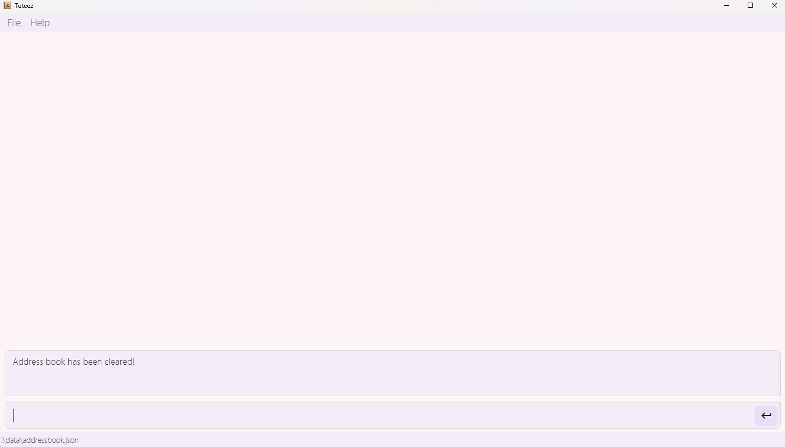
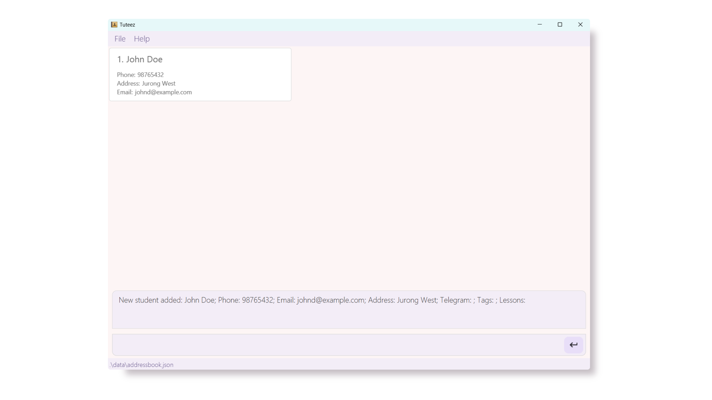
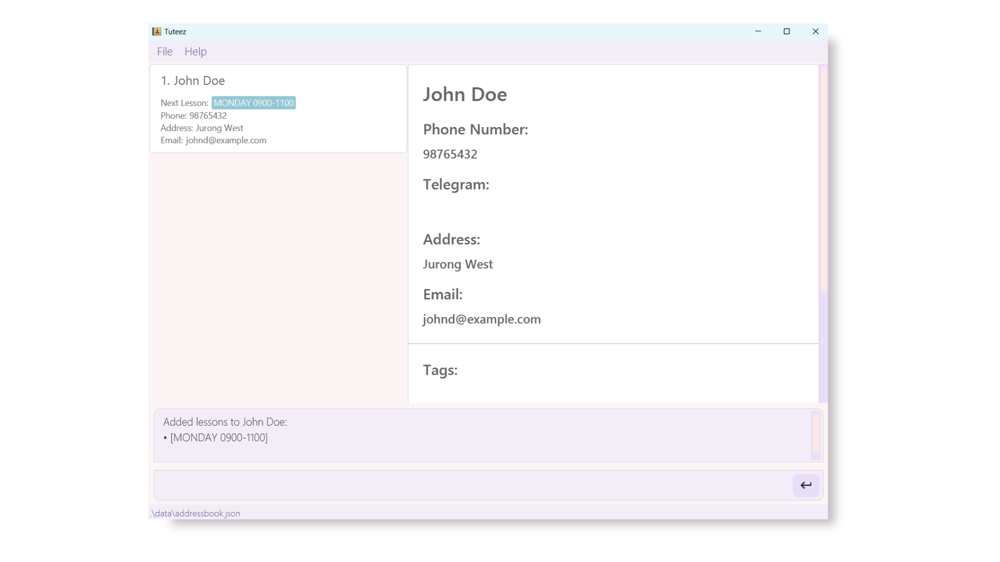
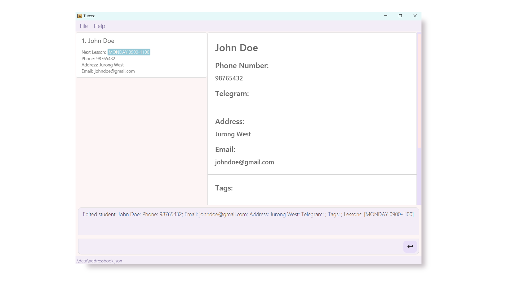
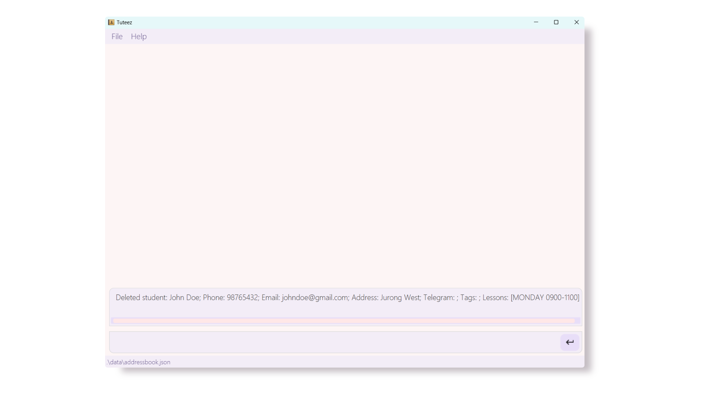

# Tuteez User Guide

Welcome! Tuteez is a **desktop address book app that makes managing student contacts seamless for private tutors**, allowing you to focus on what truly matters: your students.

<!-- TOC start -->

- [Tuteez User Guide](#tuteez-user-guide)
   * [Quick start](#quick-start)
   * [UI](#ui)
      + [Left panel](#left-panel)
      + [Right panel](#right-panel)
   * [Beginner's Tutorial](#beginners-tutorial-for-tuteez)
      + [Before You Begin](#before-you-begin)
      + [Starting with a Clean Slate](#starting-with-a-clean-slate)
      + [Adding Your First Student](#adding-your-first-student)
      + [Adding a Lesson to your Student's details](#adding-a-lesson-to-your-students-details)
      + [Editing Student Details](#editing-student-details)
      + [Deleting a Student](#deleting-a-student)
      + [Wrapping Up](#wrapping-up)
   * [Features](#features)
      + [Viewing help : `help`](#viewing-help-help)
      + [Adding a student: `add`](#adding-a-student-add)
      + [Listing all students : `list`](#listing-all-students-list)
      + [Editing a student : `edit`](#editing-a-student-edit)
      + [Adding a Remark: `addremark` or `addrmk`](#adding-a-remark-addremark-or-addrmk)
      + [Deleting a Remark: `deleteremark` or `delrmk`](#deleting-a-remark-deleteremark-or-delrmk)
      + [Adding Lessons: `addlesson` or `addlsn`](#adding-lessons-addlesson-or-addlsn)
      + [Deleting Lessons: `deletelesson` or `dellsn`](#deleting-lessons-deletelesson-or-dellsn)
      + [Locating students by name: `find`](#locating-students-by-name-find)
      + [Deleting a student : `delete`](#deleting-a-student-delete)
      + [Displaying Student Information: `display`](#displaying-student-information-display)
      + [Clearing all entries : `clear`](#clearing-all-entries-clear)
      + [Exiting the program : `exit`](#exiting-the-program-exit)
   * [Things you should definitely know 🤔](#things-you-should-definitely-know-)
      + [Constraints to add a lesson](#constraints-to-add-a-lesson)
      + [Current Limitations](#current-limitations)
      + [Saving the data](#saving-the-data)
      + [Editing the data file](#editing-the-data-file)
   * [Future Features](#future-features)
   * [FAQ](#faq)
   * [Known issues](#known-issues)
   * [Command summary](#command-summary)

<!-- TOC end -->

--------------------------------------------------------------------------------------------------------------------

## Quick start

1. Ensure you have Java `17` or above installed in your Computer.

1. Download the latest `.jar` file from [here](https://github.com/AY2425S1-CS2103T-F09-4/tp/releases).

1. Copy the file to the folder you want to use as the _home folder_ for Tuteez.

1. Open a command terminal, `cd` into the folder you put the jar file in, and use the `java -jar tuteez.jar` command to run the application. 
   A GUI similar to the below should appear in a few seconds. Note how the app contains some sample data. 
   

1. Type the command in the command box and press Enter to execute it. e.g. typing **`help`** and pressing Enter will open the help window. 
   Some example commands you can try:

   * `list` : Lists all contacts.

   * `add n/John Doe p/98765432 e/johnd@example.com a/John street, block 123, #01-01` : Adds a student named `John Doe` to Tuteez.

   * `delete 3` : Deletes the 3rd contact shown in the current list.

   * `clear` : Deletes all contacts.

   * `exit` : Exits the app.

1. Refer to the [Features](#features) below for details of each command.

--------------------------------------------------------------------------------------------------------------------

## UI 

### Left panel

* Prioritizes important information such as student's phone number, address, next lesson, based on your computer's current time
* If a lesson is currently ongoing it will show that lesson as the next lesson on the left panel

> 📘 **Info**  
> If you change your computer's current time, just restart the app to sync our internal clock to your new time!!

### Right panel

* Provides full view of students information when you call display
* This is where you can see all your student's lesson details and the remarks you have left them

--------------------------------------------------------------------------------------------------------------------

## Beginner's Tutorial for Tuteez

If you're a new user, fret not! Simply follow this beginner-friendly tutorial that will walk you through your first
steps with the application, which will allow you to get comfortable with managing your student contacts effectively.

### Before You Begin
Make sure you have:
- Successfully installed Tuteez and launched the application (Refer to the [Quick Start](#quick-start) section if you have not)

### Starting with a Clean Slate
Let us start by clearing the sample data that comes with the application. Type `clear` in the Command Box and press <kbd>Enter</kbd>.

You should see a message indicating that all entries have been cleared, and the list of students should now be empty.

If everything went well, you'll be greeted by this view:

### Adding Your First Student
Let's say you already have a student named John Doe, and you wish to add his details into Tuteez.

Let's try entering the following command: `add n/John Doe p/98765432 e/johnd@example.com a/Jurong West`

This means that you've added a student named `John Doe`, with the phone number `98765432`, email `johnd@example.com`,
and address `Jurong West`.

If everything went well, you'll be greeted by this view:

> :information_source: For more details on the `add` command, please refer to the [Add Command](#adding-a-student-add) section.

### Adding a Lesson to your Student's details
Now, you have finalized a lesson schedule with John Doe, and you wish to add it to his details.

Let's try entering the following command: `addlesson 1 l/Monday 0900-1100`

This means that you've added a lesson for `John Doe` on `Monday` from `9 am to 11 am`.

If everything went well, you'll be greeted by this view:

### Editing Student Details
You've realized that you've made a mistake in John Doe's email address, and wish to edit it.

Let's try entering the following command: `edit 1 e/johndoe@gmail.com`

John's email address should now be updated to `johndoe@gmail.com` and the updated email address should be reflected in Tuteez.

If everything went well, you'll be greeted by this view:

> :information_source: For more details on the `edit` command, please refer to the [Edit Command](#editing-a-student-edit) section.

### Deleting a Student
John Doe has decided to stop engaging your tuition services, and you wish to remove him from your list of students.

Let's try entering the following command: `delete John Doe`

John Doe should now be removed from your list of students.

If everything went well, you'll be greeted by this view:

### Wrapping Up
Congratulations! 😁 You've successfully completed the beginner's tutorial for Tuteez.
You're now ready to move on to more advanced features and commands that Tuteez has to offer.
Simply visit the [Features](#features) section to learn more about the various commands available to you.

--------------------------------------------------------------------------------------------------------------------

## Features

<box type="info" seamless>

**Notes about the command format:** 

* Words in `UPPER_CASE` are the parameters to be supplied by the user. 
  e.g. in `add n/NAME`, `NAME` is a parameter which can be used as `add n/John Doe`.

* Items in square brackets are optional. 
  e.g `n/NAME [t/TAG]` can be used as `n/John Doe t/Math` or as `n/John Doe`.

* Items with `…`​ after them can be used multiple times including zero times. 
  e.g. `[t/TAG]…​` can be used as ` ` (i.e. 0 times), `t/Secondary`, `t/Math t/Science` etc.

* Parameters can be in any order. 
  e.g. if the command specifies `n/NAME p/PHONE_NUMBER`, `p/PHONE_NUMBER n/NAME` is also acceptable.

* Extraneous parameters for commands that do not take in parameters (such as `help`, `list`, `exit` and `clear`) will be ignored. 
  e.g. if the command specifies `help 123`, it will be interpreted as `help`.

* If you are using a PDF version of this document, be careful when copying and pasting commands that span multiple lines as space characters surrounding line-breaks may be omitted when copied over to the application.
</box>

### Viewing help : `help`

Shows a message explaining how to access the help page.

Format: `help`

### Adding a student: `add`

Adds a student to Tuteez.

Format: `add n/NAME p/PHONE_NUMBER [e/EMAIL] [a/ADDRESS] [tg/TELEGRAM_USERNAME] [t/TAG]…​ [l/LESSON]…​`

- Only the **name** and **phone number** are required fields. The other fields are optional.
- The **`l/` (lesson)** field should include the **day** of the week (case-insensitive) followed by the **time** in the **24-hour format** `HHMM-HHMM`, separated by a space.
    - Example: `l/monday 0900-1100` or `l/Wednesday 1400-1600`
    - Tutors cannot add lessons that clash, meaning lessons cannot be scheduled on the same day and overlap in timing. If a clash is detected, the app will notify the user with an error message.
    - To see more details for valid lessons, check out [lesson constraints](#lesson-constraints)

<box type="tip" seamless>

**Tip:** You can add any number of tags and lessons to a student (or you could also omit them)
</box>

Examples:
* `add n/John Doe p/98765432 e/johnd@example.com a/John street, block 123, #01-01`
* `add n/Betsy Crowe t/friend e/betsycrowe@example.com a/Newgate Prison p/1234567 t/Math l/ monday 0900-1100`

### Listing all students : `list`

Shows a list of all students in Tuteez.

Format: `list`

### Editing a student : `edit`

Edits an existing student in Tuteez.

Format: `edit INDEX [n/NAME] [p/PHONE] [e/EMAIL] [a/ADDRESS] [t/TAG]…​`

* Edits the student at the specified `INDEX`. The index refers to the index number shown in the displayed student list. The index **must be a positive integer** 1, 2, 3, …​
* At least one of the optional fields must be provided.
* Existing values will be updated to the input values.
* When editing **tags**, **all previous values will be replaced** by the new ones entered.
    - This means you must **retype all old tags** you wish to keep, as editing will overwrite them completely.
* You can remove all optional fields as specified in the `add` command by typing its parameter prefix (e.g. `t/`) without specifying any values after them.

Examples:
*  `edit 1 p/91234567 e/johndoe@example.com` Edits the phone number and email address of the 1st student to be `91234567` and `johndoe@example.com` respectively.
*  `edit 2 n/Betsy Crower t/` Edits the name of the 2nd student to be `Betsy Crower` and clears all existing tags.

### Adding a Remark: `addremark` or `addrmk`

Allows the tutor to add or delete a remark for a specific student in Tuteez.

Format: `addremark INDEX r/REMARK` to add a remark to the student at the specified `INDEX`.

* Adds a new remark to the student at the specified `INDEX`. The index refers to the index number shown in the displayed student list. The index **must be a positive integer** 1, 2, 3, …​
* You can add any text as a remark, and remarks are displayed in the order they were added.

<box type="tip" seamless>

**Tip:** You can also use the abbreviated command `addrmk` as a shortcut for `addremark`.
</box>

Examples:
* `addremark 1 r/Great progress in Math` Adds the remark "Great progress in Math" to the first student.

### Deleting a Remark: `deleteremark` or `delrmk`

Allows the tutor to delete a remark for a specific student in Tuteez.

Format: `deleteremark INDEX ri/REMARK_INDEX` to add a remark to the student at the specified `INDEX`.

* Deletes an existing remark from the student at the specified `REMARK_INDEX`. The remark index refers to the order in which the remarks were added.
* When deleting, if the `REMARK_INDEX` is not valid, an error will be shown.

Examples:
* `deleteremark 1 ri/2` Deletes the second remark of the first student in the displayed student list.

### Adding Lessons: `addlesson` or `addlsn`

Allows the tutor to add lesson(s) to a specific student in Tuteez.

Format: `addlesson INDEX l/LESSON [l/LESSON]…​`

* short form: `addlsn INDEX l/LESSON [l/LESSON]…​`
* Adds new lesson(s) to the student at the specified `INDEX`. The index refers to the index number shown in the displayed student list. The index **must be a positive integer** 1, 2, 3, …​
* You can add multiple lessons to a student at once.
* Lessons have to start with the **day** of the week (case-insensitive) followed by the **time** in the **24-hour format** `HHMM-HHMM`, separated by a space.
* Lessons cannot clash (i.e., scheduled on the same day and overlapping in timing). If a clash is detected, an error message will be shown.
* For more details on valid lessons, check out [lesson constraints](#lesson-constraints)

Examples:
* `addlesson 1 l/Monday 0900-1100` Adds a lesson on Monday from 9 am to 11 am to the first student.
* `addlesson 2 l/Tuesday 1400-1600 l/Thursday 1400-1600` Adds lessons on Tuesday and Thursday from 2 pm to 4 pm to the second student.

### Deleting Lessons: `deletelesson` or `dellsn`

Allows the tutor to delete lesson(s) from a specific student in Tuteez.

Format: `deletelesson INDEX li/LESSON_INDEX [li/LESSON_INDEX]…​`

* short form: `dellsn INDEX li/LESSON_INDEX [li/LESSON_INDEX]…​`
* Deletes lesson(s) from the student at the specified `INDEX`. The index refers to the index number shown in the displayed student list. The index **must be a positive integer** 1, 2, 3, …​
* Lessons are indexed starting from 1 and sorted in ascending order based on their day and time.
* If the `LESSON_INDEX` is not valid, an error will be shown.

Examples:
* `deletelesson 1 li/1` Deletes the first lesson of the first student.
* `dellsn 2 li/2 li/3` Deletes the second and third lessons of the second student.

<box type="tip" seamless>

**Tip:** You can delete multiple lessons at once by specifying different lesson indices.
</box>

### Locating students by name: `find`

Finds students whose names, addresses, tags or lessons contain any of the given keywords.

Format: `find [n/NAME_KEYWORDS] [a/ADDRESS_KEYWORDS] [t/TAG_KEYWORDS] [ld/LESSON_DAY_KEYWORDS] [lt/LESSON_TIME_KEYWORDS]`

* The search is case-insensitive. e.g `hans` will match `Hans`
* The order of the keywords does not matter. e.g. `Hans Bo` will match `Bo Hans`
* For name keywords, only the name is searched. For address keywords, only the address is searched etc.
* For words, only full words will be matched e.g. `Han` will not match `Hans`
* Lesson day keywords must be a **day** of the week (case-insensitive), or the first 3 letters of a day e.g. `mon tue wed`
* Lesson time keywords must be in **24-hour format** `HHMM-HHMM`. Lessons with overlapping time-ranges will be matched e.g. `0800-1000` will overlap with `0900-1100`
* Persons with at least one parameter matching at least one of its keyword will be returned (i.e. `OR` search).
* `find n/John t/Science English` will can return students `John Doe` with tag `Math`, `Alice Richardson` with tag `Science` and `Mary Jane` with tag `English`

Examples:
* `find n/alex david` returns `Alex Yeoh`, `David Li` 
  
* `find a/jurong` returns students with address `Jurong Lake #09-11` and `jurong west #13-21`
* `find ld/monday lt/1000-1100` returns students with lessons `monday 0800-0900` and `tuesday 0900-1030`

### Deleting a student : `delete`

Deletes the specified student from Tuteez.

Format: `delete INDEX` or `delete NAME`

* Deletes the student at the specified `INDEX` or by their full `NAME` (case-insensitive).
    - When using the `NAME` option, the full name of the student must be provided.
* The index refers to the index number shown in the displayed student list.
* The index **must be a positive integer** 1, 2, 3, …​

<box type="tip" seamless>

**Tip:** You can also use the abbreviated command `del` as a shortcut for `delete`.
</box>

Examples:
* `list` followed by `delete 2` deletes the 2nd student in the address book.
* `find Betsy` followed by `delete 1` deletes the first student in the results of the `find` command.
* `delete John Doe` deletes the student with the full name "John Doe" from the address book, ignoring case sensitivity.

### Displaying Student Information: `display`

Displays specific information of a student in Tuteez.

Format: `display INDEX` or `display NAME`

* Displays the details of the student at the specified `INDEX` or with the specified `NAME`. The index refers to the index number shown in the displayed student list. The index **must be a positive integer** 1, 2, 3, …​
* The displayed information includes the student's name, phone number, email, address, tags, lessons, and any remarks associated with the student.

Examples:
* `display 1` Shows the details of the first student in the list.
* `display 3` Shows the details of the third student in the list.
* `display john doe` Shows the details of student John Doe in the list, if they were to be found.

### Clearing all entries : `clear`

Clears all entries from Tuteez.

Format: `clear`

### Exiting the program : `exit`

Exits the program.

Format: `exit`

--------------------------------------------------------------------------------------------------------------------

## Things you should definitely know 🤔

### Constraints to add a lesson

Unfortunately, as of `V1.5` there are a few important constraints regarding lessons:  

  1. Lessons are not allowed to overflow into the next day
  1. Group tuition is currently not supported, so adding overlapping or clashing lessons is not available yet  

This means the following constraints apply:

  1. Lesson start time must be before end time (e.g. `1600-1500`)
  1. Lesson start and end time cannot be identical (e.g. `1300-1300`)
  1. The latest lesson start time is `2358`
  1. The latest lesson end time is `2359`, `0000` is treated as the start of a new day

Look forward to [future updates](#future-features) for group tuition support!!

### Current Limitations

As of `V1.5`, our app has a few limitations outlined below. Rest assured we, plan to resolve them in [future updates](#future-features)

1. Remarks and lessons can only be added one at a time
1. If you wish to edit a remark or lesson, first delete the incorrect one, then add the updated version.
1. After using the find command to locate student(s), running most other commands will reset the left panel to the default view, similar to calling `list`.
1. Tags that are too long are cut off on the left panel

### Saving the data

Tuteez data are saved in the hard disk automatically after any command that changes the data. There is no need to save manually.

### Editing the data file

Tuteez data are saved automatically as a JSON file `[JAR file location]/data/addressbook.json`. Advanced users are welcome to update data directly by editing that data file.

<box type="warning" seamless>

**Caution:**
If your changes to the data file makes its format invalid, Tuteez will discard all data and start with an empty data file at the next run.  Hence, it is recommended to take a backup of the file before editing it. 
Furthermore, certain edits can cause Tuteez to behave in unexpected ways (e.g., if a value entered is outside the acceptable range). Therefore, edit the data file only if you are confident that you can update it correctly.
</box>

--------------------------------------------------------------------------------------------------------------------

## Future Features

With the ever-changing responsibilities of tutors, Tuteez evolves right alongside you, adding new features to support your journey. Here’s what’s in store for future updates!

1. Group Lessons: Tuteez will soon support overlapping lessons and student grouping for group tuition! And as always, it will alert you in advance if there are any scheduling conflicts. 😉
1. Document Management: Upload and associate PDFs or other documents directly with specific students for easy access and organization.
1. Quick Messaging: Instantly open WhatsApp or Telegram chats with students directly from Tuteez with a single click, making it easy to reach out right away.
1. Data Export: Enable seamless exporting of student information and lesson data into files for easy sharing, backup, or analysis outside of Tuteez.
1. Of course, addressing all the limitations stated [above](#current-limitations)

--------------------------------------------------------------------------------------------------------------------

## FAQ

**Q**: How do I transfer my data to another Computer? 
**A**: Install the app in the other computer and overwrite the empty data file it creates with the file that contains the data of your previous Tuteez home folder.

--------------------------------------------------------------------------------------------------------------------

## Known issues

1. **When using multiple screens**, if you move the application to a secondary screen, and later switch to using only the primary screen, the GUI will open off-screen. The remedy is to delete the `preferences.json` file created by the application before running the application again.
2. **If you minimize the Help Window** and then run the `help` command (or use the `Help` menu, or the keyboard shortcut `F1`) again, the original Help Window will remain minimized, and no new Help Window will appear. The remedy is to manually restore the minimized Help Window.

--------------------------------------------------------------------------------------------------------------------

## Command summary

Action     | Format, Examples
-----------|----------------------------------------------------------------------------------------------------------------------------------------------------------------------
**Add**    | `add n/NAME p/PHONE_NUMBER e/EMAIL a/ADDRESS [t/TAG]…​ [l/LESSON]…​`   e.g., `add n/James Ho p/22224444 e/jamesho@example.com a/123, Clementi Rd, 1234665 t/Math t/monday 0900-1100`
**Clear**  | `clear`
**Delete** | `delete INDEX` or `delete NAME`  e.g., `delete 3` or `delete James Ho`
**Display**| `display INDEX` or display `NAME`   e.g., `display 1` or display `John Doe`
**Edit**   | `edit INDEX [n/NAME] [p/PHONE_NUMBER] [e/EMAIL] [a/ADDRESS] [tg/TELEGRAM_USERNAME] [t/TAG]…​ [l/LESSON]…​`  e.g.,`edit 2 n/James Lee e/jameslee@example.com t/Math l/sunday 1000-1100`
**Add Remark** | `addremark INDEX r/REMARK` to add a remark to student at `INDEX`  e.g., `remark 1 r/Great progress in Math`
**Delete Remark** |  `deleteremark INDEX ri/REMARK_INDEX` to delete the remark at `REMARK_INDEX` from the student at `INDEX`  e.g., `remark 1 ri/2` to delete the second remark of student 1.
**Add Lesson** | `addlesson INDEX l/LESSON [l/LESSON]…​`  e.g., `addlesson 1 l/Monday 0900-1100`
**Delete Lesson** | `deletelesson INDEX li/LESSON_INDEX [li/LESSON_INDEX]…​`  e.g., `deletelesson 1 li/1`
**Find**   | `find [n/NAME_KEYWORDS] [a/ADDRESS_KEYWORDS] [t/TAG_KEYWORDS] [ld/LESSON_DAY_KEYWORDS] [lt/LESSON_TIME_KEYWORDS]`  e.g., `find n/James jake t/science`
**List**   | `list`
**Help**   | `help`
