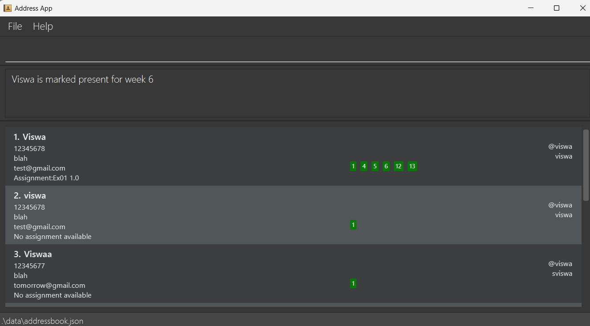
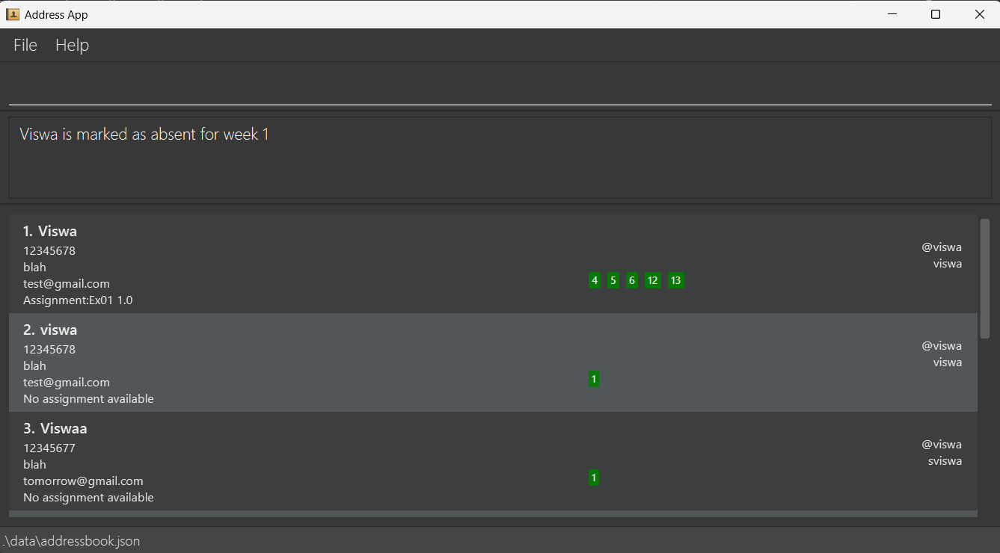

# KonTActs User Guide

konTActs is a **desktop app for managing contacts, optimized for use via a Command Line Interface** (CLI) while still having the benefits of a Graphical User Interface (GUI). If you can type fast, konTActs can get your contact management tasks done faster than traditional GUI apps.

<!-- * Table of Contents -->
<page-nav-print />

--------------------------------------------------------------------------------------------------------------------

## Quick start

1. Ensure you have Java `17` or above installed in your Computer. Refer [here](https://nus-cs2103-ay2425s1.github.io/website/admin/programmingLanguages.html) for the specific version.

1. Download the latest `.jar` file from [here](https://github.com/AY2425S1-CS2103T-T11-2/tp/releases).

1. Copy the file to the folder you want to use as the _home folder_ for your AddressBook.

1. Open a command terminal, `cd` into the folder you put the jar file in, and use the `java -jar addressbook.jar` command to run the application. 
   A GUI similar to the below should appear in a few seconds. Note how the app contains some sample data. 
   

1. Type the command in the command box and press Enter to execute it. e.g. typing **`help`** and pressing Enter will open the help window. 
   Some example commands you can try:

   * `list` : Lists all contacts.

   * `add n/John Doe p/98765432 e/johnd@example.com a/John street, block 123, #01-01` : Adds a contact named `John Doe` to the Address Book.

   * `delete n/John Doe` : Deletes the contact with name `John Doe` if it is shown in the current list.

   * `clear` : Deletes all contacts.

   * `exit` : Exits the app.

1. Refer to the [Features](#features) below for details of each command.

--------------------------------------------------------------------------------------------------------------------

## Features

<box type="info" seamless>

**Notes about the command format:** 

* Words in `UPPER_CASE` are the parameters to be supplied by the user. 
  e.g. in `add n/NAME`, `NAME` is a parameter which can be used as `add n/John Doe`.

* Items in square brackets are optional. 
  e.g `n/NAME [t/TAG]` can be used as `n/John Doe t/friend` or as `n/John Doe`.

* Items with `…`​ after them can be used multiple times including zero times. 
  e.g. `[t/TAG]…​` can be used as ` ` (i.e. 0 times), `t/friend`, `t/friend t/family` etc.

* Parameters can be in any order. 
  e.g. if the command specifies `n/NAME p/PHONE_NUMBER`, `p/PHONE_NUMBER n/NAME` is also acceptable.

* Extraneous parameters for commands that do not take in parameters (such as `help`, `list`, `exit` and `clear`) will be ignored. 
  e.g. if the command specifies `help 123`, it will be interpreted as `help`.

* If you are using a PDF version of this document, be careful when copying and pasting commands that span multiple lines as space characters surrounding line-breaks may be omitted when copied over to the application.
</box>

### Viewing help : `help`

Shows a message explaning how to access the help page.

* The link brings users to this user guide.

Format: `help`

### Adding a person: `add`

Adds a person to the address book.

Format: `add n/NAME p/PHONE_NUMBER e/EMAIL a/ADDRESS telegram/TELEGRAM [t/TAG]…​ github/GITHUB`

<box type="tip" seamless>

**Tip:** A person can have any number of tags (including 0)
</box>

Examples:
* `add n/John Doe p/98765432 e/johnd@example.com a/John street, block 123, #01-01 telegram/@john github/swag-john33`
* `add n/Betsy Crowe t/friend e/betsycrowe@example.com a/Newgate Prison p/1234567 telegram/@Betsy t/criminal github/betsy-29`

### Listing all persons : `list`

Shows a list of all persons in the address book.

Format: `list`

### Editing a person : `edit`

Edits an existing person in the address book.

Format: `edit INDEX [n/NAME] [p/PHONE] [e/EMAIL] [a/ADDRESS] [telegram/TELEGRAM] [t/TAG]…​ [github/GITHUB]`

* Edits the person at the specified `INDEX`. The index refers to the index number shown in the displayed person list. The index **must be a positive integer** 1, 2, 3, …​
* At least one of the optional fields must be provided.
* Existing values will be updated to the input values.
* When editing tags, the existing tags of the person will be removed i.e adding of tags is not cumulative.
* You can remove all the person’s tags by typing `t/` without
    specifying any tags after it.

Examples:
*  `edit 1 p/91234567 e/johndoe@example.com` Edits the phone number and email address of the 1st person to be `91234567` and `johndoe@example.com` respectively.
*  `edit 2 n/Betsy Crower t/` Edits the name of the 2nd person to be `Betsy Crower` and clears all existing tags.
*  `edit 1 github/cool-james12 n/James` Edits the name of the 1st person to `James` and github username to `cool-james12`.
*  `edit 2 telegram/@Mary n/Mary` Edits the name of the 2nd person to `Mary` and telegram ID to `@Mary`.

### Locating persons by name: `find`

Finds persons whose names contain any of the given keywords.

Format: `find KEYWORD [MORE_KEYWORDS]`

* The search is case-insensitive. e.g `hans` will match `Hans`
* The order of the keywords does not matter. e.g. `Hans Bo` will match `Bo Hans`
* Only the name is searched.
* Only full words will be matched e.g. `Han` will not match `Hans`
* Persons matching at least one keyword will be returned (i.e. `OR` search).
  e.g. `Hans Bo` will return `Hans Gruber`, `Bo Yang`

Examples:
* `find John` returns `john` and `John Doe`
* `find alex david` returns `Alex Yeoh`, `David Li` 
  

### Locating persons by tag: `filter`

Finds persons whose names contain any of the given keywords.

Format: `filter t/TAG [t/MORE_TAG]...`

* The search is case-sensitive. e.g `friends` will not match `Friends`
* At least one tag must be provided.
* The order of the keywords does not matter. e.g. `t/friends t/family` will match `t/family t/friends`
* Only the tags is searched.
* Only full tag name will be matched e.g. `friend` will not match `friends`
* Persons matching at least one keyword will be returned (i.e. `OR` search).
  e.g. `t/friends t/family` will return any contact tagged with `friend` or `family`.

Examples:
* `filter t/friend t/family` returns any contact tagged with `friend` or `family` 
  

### Deleting a person : `delete`

Deletes the specified person from the address book.

Format: `delete n/NAME`

* Deletes the person with the specified name.
* The name refers to the full name of the person shown in the displayed person list.
* If a person matches the name but is not shown in the list, it will not be deleted.

Examples:
* `list` followed by `delete n/Betsy` deletes the person with the name `Betsy`.
* `find Betsy` followed by `delete Alex` will not delete the person named `Alex`.
* `delete n/Betsy` deletes the person named `Betsy` if it is shown on the filtered list.

### Launching GitHub repository : `github`

Launches GitHub repository of the specified person on the browser from the address book.

Format: `github n/NAME`

* Launches the GitHub repository of the specified person.
* Person specified needs to have a GitHub username assigned in the Address Book.
* The name refers to the full name of the person shown in the Address Book.

Examples:
* `github n/Betsy` launches the GitHub repository of the person named `Betsy`, using the GitHub username assigned to `Betsy`.

### Viewing a contact's full details : `view`

Opens a window at the side with the full details of the specified person from the address book.

Format: `view [n/NAME]`

* View the full details of the selected contact.
* The name refers to the full name of the person shown in the displayed person list.
* Calling `view` without any name parameter closes any windows previously opened by `view`.

Examples:
* `view n/JohnDoe` opens a window at the side showing the full details of the person named `JohnDoe`.
* Calling `view n/JohnDoe` followed by `view` closes the window showing the full contact details of `JohnDoe`.

### Marking a student as present : `mark`

Marks a student as present for a particular week.

Format: `mark n/NAME w/[WEEK NUMBER]`

* Marks the particular student as present in that week.
* The name and week number is compulsory.
* The name is case-sensitive.

Examples:
* `mark n/Viswa w/1` marks the student named `Viswa` as present for week 1.
  

### Unmarking a student as present : `unmark`

Unmarks a student as present for a particular week. In other words, that student is marked absent.

Format: `unmark n/NAME w/[WEEK NUMBER]`

* Unmarks the particular student as present in that week.
* The name and week number is compulsory.
* The name is case-sensitive.

Examples:
* `unmarks n/John Doe w/1` unmarks the student named `JohnDoe` as present for week 1.
  

### Sorting the displayed lsit : `sort`

Sorts the displayed list based on the given field and order.

Format: `sort FIELD order/ORDER`

* Current FIELD that can be sorted by: `github`, `name`, `telegram`.
* Current ORDER that is accepted: `asc`, `desc`.
* The sort order will persist between commands.
* The sorting is case-insensitive: upper and lower case are treated as the same values.

Examples:
* `sort name order/asc` will sort the displayed list based on their name in ascending order.

### Clearing all entries : `clear`

Clears all entries from the address book.

Format: `clear`

### Importing data from CSV file `import`

Imports contacts based on CSV file

Format:`import path/CSV FILE PATH`

* File path can be relative or absolute

Examples:
* `import path/data/tutorial12.csv` will import the contacts found from the comma separated file (tutorial12.csv from relative path given)

### Exporting data into CSV file `export`

Imports contacts based on CSV file

Format:`export path/DESIRED FILE DESTINATION`

* File path can be relative or absolute

Examples:
* `Export path/data/tutorial12.csv` will export the contacts in the Address book as a csv file (tutorial12.csv at the relative path given)

### Exiting the program : `exit`

Exits the program.

Format: `exit`

### Saving the data

AddressBook data are saved in the hard disk automatically after any command that changes the data. There is no need to save manually.

### Editing the data file

AddressBook data are saved automatically as a JSON file `[JAR file location]/data/addressbook.json`. Advanced users are welcome to update data directly by editing that data file.

<box type="warning" seamless> 

**Caution:**
If your changes to the data file makes its format invalid, AddressBook will discard all data and start with an empty data file at the next run.  Hence, it is recommended to take a backup of the file before editing it. 
Furthermore, certain edits can cause the AddressBook to behave in unexpected ways (e.g., if a value entered is outside the acceptable range). Therefore, edit the data file only if you are confident that you can update it correctly.
</box>

### Archiving data files `[coming in v2.0]`

_Details coming soon ..._

--------------------------------------------------------------------------------------------------------------------

## FAQ

**Q**: How do I transfer my data to another Computer? 
**A**: Install the app in the other computer and overwrite the empty data file it creates with the file that contains the data of your previous AddressBook home folder.

--------------------------------------------------------------------------------------------------------------------

## Known issues

1. **When using multiple screens**, if you move the application to a secondary screen, and later switch to using only the primary screen, the GUI will open off-screen. The remedy is to delete the `preferences.json` file created by the application before running the application again.
2. **If you minimize the Help Window** and then run the `help` command (or use the `Help` menu, or the keyboard shortcut `F1`) again, the original Help Window will remain minimized, and no new Help Window will appear. The remedy is to manually restore the minimized Help Window.

--------------------------------------------------------------------------------------------------------------------

## Command summary

| Action     | Format, Examples                                                                                                                                                                                                                        |
|------------|-----------------------------------------------------------------------------------------------------------------------------------------------------------------------------------------------------------------------------------------|
| **Add**    | `add n/NAME p/PHONE_NUMBER e/EMAIL a/ADDRESS telegram/TELEGRAM [t/TAG]…​ github/GITHUB`   e.g., `add n/James Ho p/22224444 e/jamesho@example.com a/123, Clementi Rd, 1234665 telegram/@James t/friend t/colleague github/james-cool` |
| **Clear**  | `clear`                                                                                                                                                                                                                                 |
| **Delete** | `delete n/NAME`  e.g., `delete n/James`                                                                                                                                                                                              |
| **Edit**   | `edit INDEX [n/NAME] [p/PHONE] [e/EMAIL] [a/ADDRESS] [telegram/TELEGRAM] [t/TAG]…​ [github/GITHUB]`  e.g.,`edit 2 n/James Lee e/jameslee@example.com`                                                                                |
| **Find**   | `find KEYWORD [MORE_KEYWORDS]`  e.g., `find James Jake`                                                                                                                                                                              |
| **Filter** | `filter t/[TAG] t/[MORE_TAG]…​`  e.g., `filter t/friends t/family`                                                                                                                                                                   |
| **List**   | `list`                                                                                                                                                                                                                                  |
| **Help**   | `help`                                                                                                                                                                                                                                  |
| **View**   | `view [n/NAME]`   e.g., `view n/JohnDoe`                                                                                                                                                                                             |
| **GitHub** | `github n/NAME`                                                                                                                                                                                                                         |
| **Mark**   | `mark n/NAME w/WEEK NUMBER`   e.g. `mark n/John Doe w/1`                                                                                                                                                                             |
| **Unmark** | `unmark n/NAME w/WEEK NUMBER`   e.g. `unmark n/John Doe w/1`                                                                                                                                                                         |
| **Sort**   | `sort FIELD order/ORDER`   e.g. `sort name order/asc`                                                                                                                                                                                |
| **Import** | `import path/CSV FILE PATH`   e.g `import path/user/data/xxx.csv`                                                                                                                                                                    |
| **Export** | `export path/DESIRED FILE DESTINATION`   e.g `export path/user/data/xxx.csv`                                                                                                                                                          |
