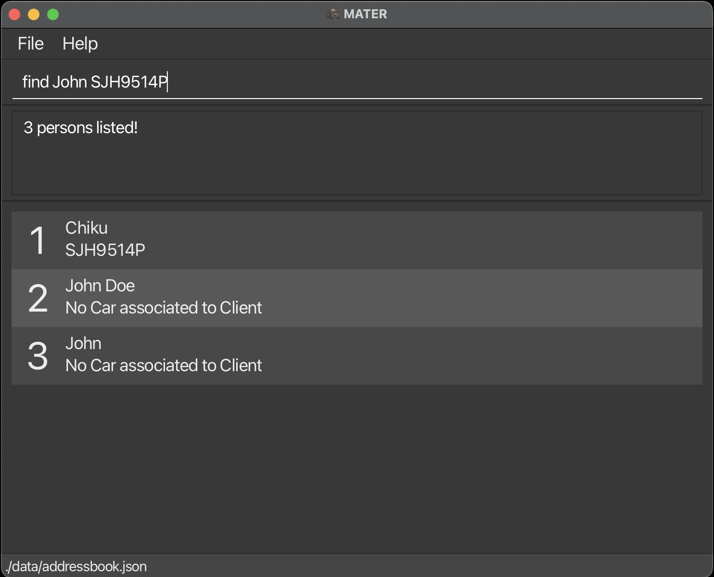
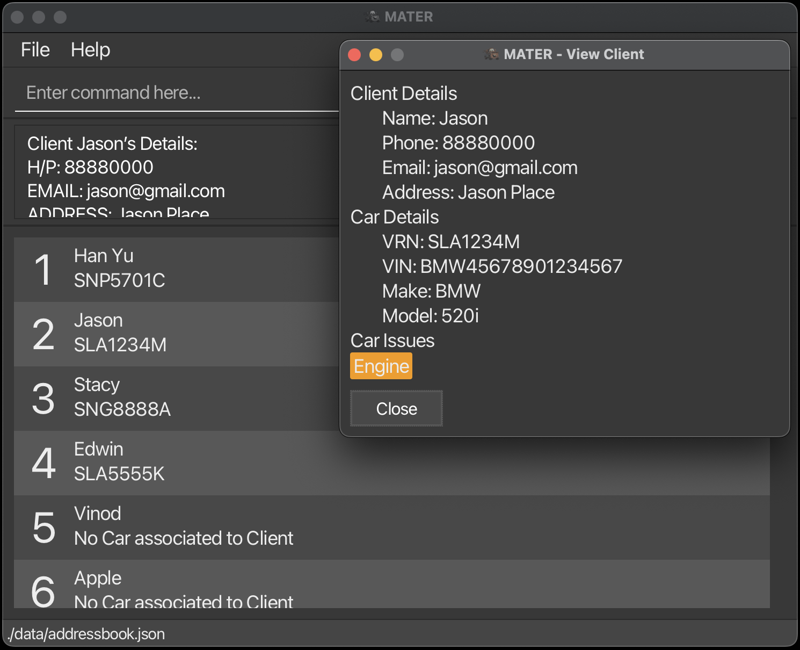

<style>
  .highlight-feature {
    padding: 5px 10px;
    margin-left: 5px;
    border-radius: 15px;
    background-color: #d3d3d3;
    color: #000000;
    transition: background-color 0.3s, color 0.3s;
  }

  .highlight-feature:hover {
    background-color: #b3b3b3;
    cursor: pointer;
  }

  /* New styles for the copied state */
  .highlight-feature.copied {
    background-color: #28a745; /* Green background to indicate success */
    color: #ffffff;
  }

  .highlight-feature.copied::after {
    content: ' ✓ Copied!';
    margin-left: 5px;
    font-weight: bold;
    font-size: 0.4em;
  }

  .icon {
    margin-right: 7px;
  }

</style>

<script>
  function copyToClipboard(text, element) {
    console.log("Copying to clipboard: " + text);
    navigator.clipboard.writeText(text).then(function() {
      // Add 'copied' class to the element
      element.classList.add('copied');

      // Remove the 'copied' class after 1.4 seconds
      setTimeout(function() {
        element.classList.remove('copied');
      }, 1400);
    }, function(err) {
      console.error('Could not copy text: ', err);
    });
  }
</script>


<link rel="stylesheet" href="https://cdnjs.cloudflare.com/ajax/libs/font-awesome/6.0.0-beta3/css/all.min.css">


<h1 style="color: #964B00;"> <i class="fas fa-book icon"></i> MATER User Guide </h1>

MATER is a **desktop app for managing clients and their cars, optimized for use via a Graphical User Interface (GUI).** It is designed for workshops that need to keep track of their clients and their cars. If you can type fast, MATER can get your client management tasks done faster than traditional GUI apps.

<!-- * Table of Contents -->
<page-nav-print />

--------------------------------------------------------------------------------------------------------------------

<h2 style="color: #28B463;"> <i class="fas fa-rocket icon"></i> Quick start</h2>

1. Ensure you have Java 17 or above installed on your Computer.

2. Download the latest .jar file from [here](https://github.com/AY2425S1-CS2103T-T14-3/tp/releases).

3. Copy the file to the folder you want to use as the _home folder_ for your MATER.

4. Open a command terminal, `cd` into the folder you put the jar file in, and use the `java -jar mater.jar` command to run the application.<br>
   A GUI similar to the one below should appear in a few seconds. Note how the app contains some sample data.<br><br>
   

5. In the application window, locate the command box at the bottom.<br>
   Type the command in the command box and press Enter to execute it. For example, typing **help** and pressing Enter will open the help window.<br>
   Some example commands you can try:

   - `list` : Lists all contacts.

   - `add-client n/John Doe p/98765432 e/johnd@example.com a/John street, block 123, #01-01` : Adds a client named John Doe to MATER.

   - `del-client 3` : Deletes the 3rd client shown in the current list.

   - `clear` : Deletes all contacts.

   - `exit` : Exits the app.

6. Refer to the [Features](#features) below for details of each command.

--------------------------------------------------------------------------------------------------------------------

<h2 style="color: #AF7AC5;" id="glossary"> <i class="fas fa-list-alt icon"></i> Glossary</h2>

- **Client:** A person who uses the services of the workshop. In MATER, a client is someone whose personal details are stored and managed.
- **VRN (Vehicle Registration Number):** The unique identifier assigned to a vehicle upon registration. In Singapore, it typically follows the format `XXX1234C`, where:
  - `X` represents an alphabet letter.
  - `1234` represents a four-digit number.
  - `C` represents a checksum letter as defined by the [Land Transport Authority (LTA)](https://en.wikipedia.org/wiki/Vehicle_registration_plates_of_Singapore).
- **VIN (Vehicle Identification Number):** A unique 17-character alphanumeric code assigned to each vehicle by the manufacturer, used to identify individual motor vehicles.
- **Checksum Letter:** The final character in a VRN, calculated based on the other characters to ensure the VRN's validity.
- **Issue:** A problem or maintenance task associated with a client's car. Issues can be recorded in MATER for tracking and management purposes.
- **Command Line Interface (CLI):** A text-based user interface used to interact with MATER by typing commands into a console or terminal.
- **Graphical User Interface (GUI):** A visual interface that allows users to interact with MATER through graphical icons and visual indicators.
- **Command Prefixes:** Short codes used in commands to specify the type of data being entered. For example:
  - `n/` for name
  - `p/` for phone number
  - `e/` for email address
  - `a/` for address
  - `vrn/` for Vehicle Registration Number
  - `vin/` for Vehicle Identification Number
  - `make/` for car make
  - `model/` for car model
  - `i/` for issue
- **Index:** The numerical position of an item in a list, starting from 1. Used in commands like `edit` and `del-client` to specify which client to modify.
- **Field:** An individual piece of data associated with a client or car (e.g., name, phone number, VIN).
- **Optional Field:** A parameter in a command that is not required but can be provided to include additional information. Denoted by square brackets `[]` in command formats.

--------------------------------------------------------------------------------------------------------------------

<h2 id="features" style="color: #000000;"> <i class="fas fa-cogs icon"></i> Features</h2>

<box type="info" seamless>

**Notes about the Command Format:**

- **Parameters in UPPER_CASE** are to be supplied by the user.
  - e.g., in `add-client n/NAME`, `NAME` is a parameter which can be used as `add-client n/John Doe`.
- **Items in square brackets are optional.**
  - e.g., `n/NAME [i/ISSUE]` can be used as `n/John Doe i/oil` or as `n/John Doe`.
- **Items with `...` after them can be used multiple times, including zero times.**
  - e.g., `[i/ISSUE]...` can be used as   (i.e., 0 times), `i/wheel`, `i/steering i/oil`, etc.
- **Parameters can be in any order.**
  - e.g., if the command specifies `n/NAME p/PHONE_NUMBER`, `p/PHONE_NUMBER n/NAME` is also acceptable.
- **Extraneous parameters for commands that do not take in parameters will be ignored.**
  - e.g., if the command is `help`, `help 123` will be interpreted as `help`.
- **Copying commands from PDFs:**
  - If you are using a PDF version of this document, be careful when copying and pasting commands that span multiple lines, as space characters surrounding line-breaks may be omitted when copied over to the application.

</box>

<h3 style="color: #1877F2;">Viewing Help: <span class="highlight-feature" onclick="copyToClipboard(this.textContent, this)">help</span></h3>

Shows a message explaining how to access the help page.

**Format:** `help`

**Parameters:**

Parameter | Requirements | Explanation
--- | --- | ---
*(None)* | *(None)* | The `help` command takes no parameters.


---

<h3 id="adding-a-client-add-client" style="color: #1877F2;">Adding a Client: <span class="highlight-feature" onclick="copyToClipboard(this.textContent, this)">add-client</span></h3>

Adds a client to MATER.

**Format:**

```shell
add-client n/NAME p/PHONE_NUMBER e/EMAIL a/ADDRESS [vrn/CAR_VRN] [vin/CAR_VIN] [make/CAR_MAKE] [model/CAR_MODEL] [i/ISSUE]...​
```

**Parameters:**

Parameter | Requirements | Explanation
--- | --- | ---
`n/NAME` | Required | Client's name.
`p/PHONE_NUMBER` | Required | Client's phone number.
`e/EMAIL` | Required | Client's email address.
`a/ADDRESS` | Required | Client's address.
`vrn/CAR_VRN` | Optional; Required if adding a car; Must follow the [VRN format](#glossary) and be unique | Car's [Vehicle Registration Number](#glossary).
`vin/CAR_VIN` | Optional; Required if adding a car; Must be a unique 17-character alphanumeric string | Car's [Vehicle Identification Number](#glossary).
`make/CAR_MAKE` | Optional; Required if adding a car; First letter must be capitalized | Car's make.
`model/CAR_MODEL` | Optional; Required if adding a car; First letter must be capitalized | Car's model.
`i/ISSUE` | Optional; Multiple entries allowed only if client has a car; Each [Issue](#glossary) must be alphanumeric (max 20 characters) | Issue(s) associated with the car.

**Notes:**

- If adding a client with a car, all car fields (`vrn`, `vin`, `make`, `model`) must be provided.
- If the client does not have a car, these fields should be omitted completely.

<box type="tip" seamless>

**Tip:**

- A client can have any number of issues (including 0).
- A client may be added with or without a car.

</box>

**Examples:**

- `add-client n/John Doe p/98765432 e/johnd@example.com a/John street, block 123, #01-01`
- `add-client n/Betsy Crowe p/92345678 e/betsycrowe@example.com a/Newgate Prison vrn/SJH9514P vin/1G6ABC129P5123456 make/Toyota model/Corolla`

---

<h3 style="color: #1877F2;">Adding a Car to a Client: <span class="highlight-feature" onclick="copyToClipboard(this.textContent, this)">add-car</span></h3>

Adds a car to a client.

**Format:**

```shell
add-car INDEX vrn/CAR_VRN vin/CAR_VIN make/CAR_MAKE model/CAR_MODEL​
```

**Parameters:**

Parameter | Requirements | Explanation
--- | --- | ---
`INDEX` | Required; Must be a positive integer | The [Index](#glossary) of the client in the displayed client list.
`vrn/CAR_VRN` | Required; Must follow the [VRN format](#glossary) and be unique | Car's [Vehicle Registration Number](#glossary).
`vin/CAR_VIN` | Required; Must be a unique 17-character alphanumeric string | Car's [Vehicle Identification Number](#glossary).
`make/CAR_MAKE` | Required; First letter must be capitalized | Car's make.
`model/CAR_MODEL` | Required; First letter must be capitalized | Car's model.

**Notes:**

- The client must not already have a car.

**Examples:**

- `add-car 1 vrn/SJH9514P vin/1G6ABC129P5123456 make/Toyota model/Corolla`

---

<h3 style="color: #1877F2;">Deleting a Car of a Client: <span class="highlight-feature" onclick="copyToClipboard(this.textContent, this)">del-car</span></h3>

Deletes a car from a client.

**Format:**

```shell
del-car INDEX​
```

**Parameters:**

Parameter | Requirements | Explanation
--- | --- | ---
`INDEX` | Required; Must be a positive integer | The [Index](#glossary) of the client in the displayed client list.

**Notes:**

- The client must have a car to delete.
- Issues associated with the car will be removed.

**Examples:**

- `del-car 1`

---

<h3 style="color: #1877F2;">Listing All Clients: <span class="highlight-feature" onclick="copyToClipboard(this.textContent, this)">list</span></h3>

Shows a list of all clients in MATER.

**Format:**

```shell
list
```

**Parameters:**

Parameter | Requirements | Explanation
--- | --- | ---
*(None)* | *(None)* | The `list` command takes no parameters.

---

<h3 style="color: #1877F2;">Editing a Client: <span class="highlight-feature" onclick="copyToClipboard(this.textContent, this)">edit</span></h3>

Edits an existing client in MATER.

**Format:**

```shell
edit INDEX [n/NAME] [p/PHONE] [e/EMAIL] [a/ADDRESS] [vrn/CAR_VRN] [vin/CAR_VIN] [make/CAR_MAKE] [model/CAR_MODEL] [i/ISSUE]...​
```

**Parameters:**

Parameter | Requirements | Explanation
--- | --- | ---
`INDEX` | Required; Must be a positive integer | The [Index](#glossary) of the client in the displayed client list.
`n/NAME` | Optional | New name of the client.
`p/PHONE` | Optional | New phone number of the client.
`e/EMAIL` | Optional | New email address of the client.
`a/ADDRESS` | Optional | New address of the client.
`vrn/CAR_VRN` | Optional; Must follow [VRN format](#glossary) and be unique | New [Vehicle Registration Number](#glossary) of the client's car.
`vin/CAR_VIN` | Optional; Must be a unique 17-character alphanumeric string | New [Vehicle Identification Number](#glossary) of the client's car.
`make/CAR_MAKE` | Optional; First letter must be capitalized | New make of the client's car.
`model/CAR_MODEL` | Optional; First letter must be capitalized | New model of the client's car.
`i/ISSUE` | Optional; Multiple entries allowed only if client has a car; Each [Issue](#glossary) must be alphanumeric (max 20 characters) | Updates list of the client's current issues.

**Notes:**

- At least one of the optional fields must be provided.
- Existing values will be updated to the input values.
- When editing issues, the existing issues of the client will be replaced with the new issues.
- To remove all issues from the client, type `i/` without specifying any issues after it.

**Examples:**

- `edit 1 p/91234567 e/johndoe@example.com`
  Edits the phone number and email address of the 1st client to `91234567` and `johndoe@example.com` respectively.
- `edit 2 n/Betsy Crower i/`
  Edits the name of the 2nd client to `Betsy Crower` and clears all existing issues.

---

<h3 style="color: #1877F2;">Locating Clients by Name or Car VRN: <span class="highlight-feature" onclick="copyToClipboard(this.textContent, this)">find</span></h3>

Finds clients whose names or car VRN contain any of the given keywords.

**Format:**

```shell
find KEYWORD [MORE_KEYWORDS]
```

**Parameters:**

Parameter | Requirements | Explanation
--- | --- | ---
`KEYWORD` | Required | A keyword to search for in client names or car [VRN](#glossary).
`[MORE_KEYWORDS]` | Optional | Additional keywords.

**Notes:**

- The search checks both the client's name and the car's [Vehicle Registration Number (VRN)](#glossary).
- The search is case-insensitive (e.g., `hans` will match `Hans`).
- The order of the keywords does not matter (e.g., `Hans Bo` will match `Bo Hans`).
- Only full words will be matched (e.g., `Han` will not match `Hans`).
- Clients matching at least one keyword will be returned (i.e., an `OR` search).

**Examples:**

- `find John`
  Returns clients with names like `John` and `John Doe`.
- `find alex david`
  Returns `Alex Yeoh`, `David Li`.
- `find SJH9514P`
  Returns client with car [VRN](#glossary) `SJH9514P`.



---

<h3 style="color: #1877F2;">Getting Client's Details: <span class="highlight-feature" onclick="copyToClipboard(this.textContent, this)">view</span></h3>

Views a client's details in MATER.

**Format:**

```shell
view INDEX
```

**Parameters:**

Parameter | Requirements | Explanation
--- | --- | ---
`INDEX` | Required; Must be a positive integer | The [Index](#glossary) of the client in the displayed client list.

**Examples:**

- `view 1`
  Returns client details of the 1st client in MATER.



---

<h3 style="color: #1877F2;">Deleting a Client: <span class="highlight-feature" onclick="copyToClipboard(this.textContent, this)">del-client</span></h3>

Deletes the specified client from MATER.

**Format:**

```shell
del-client INDEX
```

**Parameters:**

Parameter | Requirements | Explanation
--- | --- | ---
`INDEX` | Required; Must be a positive integer | The [Index](#glossary) of the client in the displayed client list.

**Examples:**

- `list`<br>
  `del-client 2`<br>
  Deletes the 2nd client in MATER.
- `find Betsy`<br>
  `del-client 1`<br>
  Deletes the 1st client in the results of the `find` command.

---

<h3 style="color: #1877F2;">Clearing All Entries: <span class="highlight-feature" onclick="copyToClipboard(this.textContent, this)">clear</span></h3>

Clears all entries from MATER.

<box type="warning" seamless>

**Warning:** This command will delete all clients from MATER. This action is irreversible.

</box>

**Format:**

```shell
clear
```

**Parameters:**

Parameter | Requirements | Explanation
--- | --- | ---
*(None)* | *(None)* | The `clear` command takes no parameters.

---

<h3 style="color: #1877F2;">Exiting the Program: <span class="highlight-feature" onclick="copyToClipboard(this.textContent, this)">exit</span></h3>

Closes the MATER application.

**Format:**

```shell
exit
```

**Parameters:**

Parameter | Requirements | Explanation
--- | --- | ---
*(None)* | *(None)* | The `exit` command takes no parameters.

---

<h3 style="color: #1877F2;">Saving the Data</h3>

MATER data are saved automatically in the hard disk after any command that changes the data. There is no need to save manually.

---

<h3 style="color: #1877F2;">Editing the Data File</h3>

MATER data are saved automatically as a JSON file at `[JAR file location]/data/addressbook.json`. Advanced users are welcome to update data directly by editing this data file.

<box type="warning" seamless>

**Caution: FOR EXPERT USERS ONLY**

- If your changes to the data file make its format invalid, MATER will discard all data and start with an empty data file at the next run. It is recommended to take a backup of the file before editing it.
- Certain edits can cause the MATER to behave in unexpected ways (e.g., if a value entered is outside the acceptable range). Therefore, edit the data file only if you are confident that you can update it correctly.

</box>

--------------------------------------------------------------------------------------------------------------------

<h2 style="color: #8E44AD;"> <i class="fas fa-question-circle icon"></i>  FAQ</h2>

**Q**: How do I transfer my data to another Computer?<br>
**A**: Install the app in the other computer and overwrite the empty data file it creates with the file that contains the data of your previous MATER home folder.

**Q**: What happens if I enter an invalid command?<br>
**A**: MATER will display an error message. You can refer to the [Features](#features) section for the correct command format or check the `HELP` section in the app.

**Q**: Can I undo a command?<br>
**A**: No, MATER does not support undoing commands. Please double-check your commands before executing them.

--------------------------------------------------------------------------------------------------------------------

<h2 style="color: #C0392B;"> <i class="fas fa-exclamation-triangle icon"></i> Known issues</h2>

1. **When using multiple screens**, if you move the application to a secondary screen, and later switch to using only the primary screen, the GUI will open off-screen. The remedy is to delete the `preferences.json` file created by the application before running the application again.
2. **If you minimize the Help Window** and then run the `help` command (or use the `Help` menu, or the keyboard shortcut `F1`) again, the original Help Window will remain minimized, and no new Help Window will appear. The remedy is to manually restore the minimized Help Window.

--------------------------------------------------------------------------------------------------------------------

<h2 style="color: #2980B9;"> <i class="fas fa-terminal icon"></i> Command Summary</h2>

Action             | Format & Examples
-------------------|----------------------------------------------------------------------------------------------------------------------------------------------------------
**Add Client**     | `add-client n/NAME p/PHONE_NUMBER e/EMAIL a/ADDRESS [vrn/CAR_VRN] [vin/CAR_VIN] [make/CAR_MAKE] [model/CAR_MODEL] [i/ISSUE]...`<br> e.g., `add-client n/John Doe p/98765432 e/johnd@example.com a/John street, block 123, #01-01`<br> e.g., `add-client n/Betsy Crowe p/92345678 e/betsycrowe@example.com a/Newgate Prison vrn/SJH9514P vin/1G6ABC129P5123456 make/Toyota model/Corolla i/engine i/wheels`
**Add Car**   | `add-car INDEX vrn/CAR_VRN vin/CAR_VIN make/CAR_MAKE model/CAR_MODEL ` <br>e.g., `add-car 1 vrn/SJH9514P vin/1G6ABC129P5123456 make/Toyota model/Corolla`
**Delete Car**   | `del-car INDEX`<br>e.g., `del-car 1`
**List Clients**   | `list`
**Edit Client**    | `edit INDEX [n/NAME] [p/PHONE] [e/EMAIL] [a/ADDRESS] [vrn/CAR_VRN] [vin/CAR_VIN] [make/CAR_MAKE] [model/CAR_MODEL] [i/ISSUE]...`<br>e.g., `edit 1 p/91234567 e/johndoe@example.com`<br>e.g., `edit 2 n/Betsy Crower i/`
**Find Clients**   | `find KEYWORD [MORE_KEYWORDS]`<br>e.g., `find John`<br>e.g., `find SJH9514P`
**View Client**   | `view INDEX`<br>e.g., `view 1`
**Delete Client**  | `del-client INDEX`<br>e.g., `del-client 3`
**Clear**          | `clear`
**Exit**           | `exit`
**Help**           | `help`

Back to Features [section](#features).
