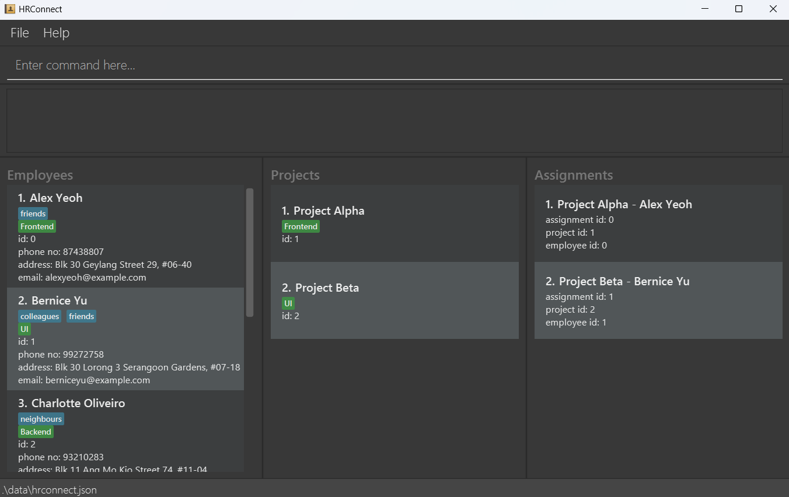
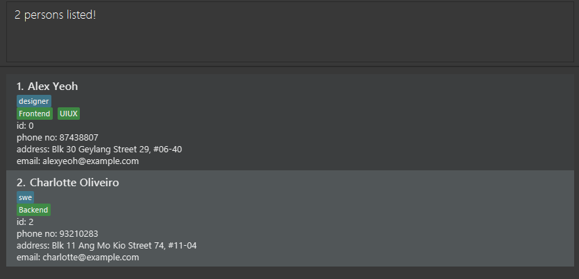
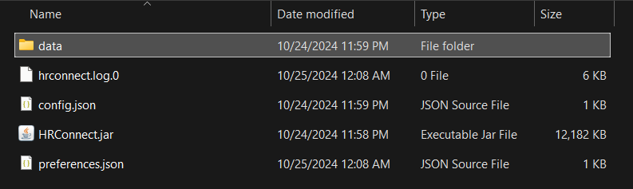

HRConnect is a desktop app for **managing human resources in relation to projects** within a company.

It is optimized for use via typing while still having the benefits of a [Graphical User Interface](#graphical-user-interface) (GUI). If you can type fast, HRConnect can get your HR management tasks done faster than traditional GUI apps.

---

## Note: User Guide Formatting

The user guide contains formatting to highlight important info. The standards used are as follows:

* `code typeface`: Commands or command formats
* **Bold:** Essential information
* **Underline \+ Bold**: Keywords
* RED COLOR: Caution, take note
* *Italics*: Technical terms available in glossary
* Hyperlink: Links to another section of the user guide, or a relevant page.

---

## Table of Contents

- [Quick Start](#quick-start)
- [Features](#features)
  - [Viewing help](#viewing-help--help)
  - [Adding a person](#adding-a-person-add)
  - [Listing all persons](#listing-all-persons--list)
  - [Editing a person](#editing-a-person--edit)
  - [Editing a person](#editing-a-person--edit)
  - [Filtering persons by skills](#filtering-persons-by-skills-filter)
  - [Locating persons by name](#locating-persons-by-name-find)
  - [Deleting a person](#deleting-a-person--delete)
  - [Clearing all entries](#clearing-all-entries--clear)
  - [Adding a project](#adding-a-project--addproject)
  - [Listing all projects](#listing-all-projects--listproject)
  - [Finding projects by name](#finding-projects-by-name--findproject)
  - [Deleting a project](#deleting-a-project--deleteproject)
  - [Clear all project entries](#clear-all-project-entries--clearproject)
  - [Create Assignment](#create-assignment--assign)
  - [List Assignments](#list-assignments--listassignments)
  - [Delete Assignment](#delete-assignment-unassign)
  - [Exiting the program](#exiting-the-program--exit)
- [FAQ](#faq)
- [Known Issues](#known-issues)
- [Command Summary](#command-summary)
- [Glossary](#glossary)

---

## Quick Start

Start here if you are new to HRConnect.

1. Ensure you have **[Java](#java) 17 or above** installed in your computer.

2. Download the latest .jar file from \[here\](https://github.com/AY2425S1-CS2103T-T15-4/tp/releases).

3. Copy the file to the folder you want to use as the home folder for your HRConnect. **This folder will be used to store saved data and preferences.**

4. **Double click the .jar file** in the folder you placed.

A GUI similar to below should appear in a few seconds. Note how the app contains some sample data.

**HRConnect keeps track of Employees, Projects and the assignments between them.** HRConnect commands are tailored for managing these three items easily.

Type the command in the command box and press Enter to execute it. e.g. typing **`help`** and pressing Enter will open the help window. 

### Some commands to get started:

   - `list` : Lists all contacts.

   - `add id/1 n/John Doe p/98765432 e/johnd@example.com a/John street, block 123, #01-01` : Adds a contact named `John Doe` to the Address Book.

   - `delete 3` : Deletes the 3rd contact in the displayed list.

   - `clear` : Deletes all contacts.

   - `listproject`: Lists all projects.

   - `addproject pid/A03 pn/Project Charlie`: Adds a project named `Project Charlie`.

   - `deleteproject 3`: Deletes the 3rd project in the displayed project list.

   - `clearproject` : Deletes all projects.

   - `assign aid/1 pid/A03 id/1` : Assigns `John Doe` to `Project Charlie`.

   - `listassignments` : Lists all assignments.

   - `unassign aid/1 ` : Undoes the assignment with Assignment ID 1.

   - `exit` : Exits the app.

Refer to the [Features](#features) below for details of each command.

[Return to Top](#table-of-contents)

---

## Features

**:information_source: Notes about the command format:** 

- Words in `UPPER_CASE` are the parameters to be supplied by the user. 
  e.g. in `add n/NAME`, `NAME` is a parameter which can be used as `add n/John Doe`.

- Items in square brackets are optional. 
  e.g `n/NAME [t/TAG]` can be used as `n/John Doe t/friend` or as `n/John Doe`.

- Items with `…`​ after them can be used multiple times including zero times. 
  e.g. `[t/TAG]…​` can be used as ` ` (i.e. 0 times), `t/friend`, `t/friend t/family` etc.

- Parameters can be in any order. 
  e.g. if the command specifies `n/NAME p/PHONE_NUMBER`, `p/PHONE_NUMBER n/NAME` is also acceptable.

- Extraneous parameters for commands that do not take in parameters (such as `help`, `list`, `exit` and `clear`) will be ignored. 
  e.g. if the command specifies `help 123`, it will be interpreted as `help`.

- If you are using a PDF version of this document, be careful when copying and pasting commands that span multiple lines as space characters surrounding line-breaks may be omitted when copied over to the application.

### Viewing help : `help`

Shows a message explaning how to access the help page.

Format: `help`

[Return to Top](#table-of-contents)

### Adding a person: `add`

Adds a person to the address book.

Format: `add id/EMPLOYEE_ID n/NAME p/PHONE_NUMBER e/EMAIL a/ADDRESS [t/TAG]… [s/SKILL]…​`
- Employee Id must be: Numeric, no spaces, unique
- Name must be: [Alphanumeric](#alphanumeric), spaces allowed
- Phone Number must be: [Numeric](#numeric), no spaces, at least 3 digits long
- Email must be: A valid email address
- Address must be: Any characters are valid
- Skills and tags must be: [Alphanumeric](#alphanumeric), no spaces

:bulb: **Tip:**
A person can have any number of tags (including 0) and any number of skills (including 0)

Examples:

- `add id/1 n/John Doe p/98765432 e/johnd@example.com a/John street, block 123, #01-01`
- `add id/2 n/Betsy Crowe t/friend e/betsycrowe@example.com a/Newgate Prison p/1234567 t/criminal s/lockpicking`

Expected output:
- System message noting success and details of person edited

[Return to Top](#table-of-contents)

### Listing all persons : `list`

Shows a list of all persons in the address book.

Format: `list`

Expected output:
- System message noting success
- All persons shown in the displayed person list

[Return to Top](#table-of-contents)

### Editing a person : `edit`

Edits an existing person in the address book.

Format: `edit INDEX [n/NAME] [p/PHONE] [e/EMAIL] [a/ADDRESS] [t/TAG]… [s/SKILL]…​`

- Edits the person at the specified `INDEX`. The index refers to the index number shown in the displayed person list. The index **must be a positive integer** 1, 2, 3, …​
- At least one of the optional fields must be provided.
- Existing values will be updated to the input values.
- When editing tags, the existing tags of the person will be removed i.e adding of tags is not cumulative.
- When editing skills, the existing skills of the person will be removed i.e adding of skills is not cumulative.
- You can remove all the person’s tags by typing `t/` without
  specifying any tags after it.
- You can remove all the person’s skills by typing `s/` without
  specifying any skills after it.
- You cannot edit a person's employee id. More specifically, you are not allowed to specify `id/EMPLOYEEID` in the `edit` command.

Examples:

- `edit 1 p/91234567 e/johndoe@example.com` Edits the phone number and email address of the 1st person to be `91234567` and `johndoe@example.com` respectively.
- `edit 2 n/Betsy Crower t/` Edits the projectName of the 2nd person to be `Betsy Crower` and clears all existing tags.

Expected output:
- System message noting success and details of person edited

[Return to Top](#table-of-contents)

### Filtering persons by skills: `filter`

Finds employees who has at least one skill or tag matching at least one of the search items.

Format: `filter [s/SKILL]... [t/TAG]...`

- The search is case-insensitive. e.g `s/webdev` will match `s/WebDev`.
- The order of the search items does not matter. e.g. `s/frontend s/backend t/swe t/devops` will also match contacts with `skills={backend, frontend}` or `tags={devops, swe}`.
- Only the skills and tags are searched.
- Only full words will be matched e.g. `s/database` will not match `skills={databases}`.
- Employees who have at least one skill or tag matching at least one search item will be returned (i.e. `OR` search).
  e.g. `s/frontend t/swe` will return `skills={frontend, uiux}, tags={designer}`, `skills={backend, database, api}, tags={swe, devops}`, and `skills={frontend, backend}, tags={swe}`

Examples:

- `filter s/frontend` returns `skills={frontend}, tags={designer}` and `skills={frontend, uiux}, tags={designer, pm}`
- `filter s/frontend t/swe` returns `skills={Frontend, UIUX}, tags={designer}`, `skills={Backend}, tags={swe}` 
  

Expected output:
- System message noting success
- Persons with skills above shown in the displayed person list

[Return to Top](#table-of-contents)

### Locating persons by name: `find`

Finds persons whose names contain any of the given keywords.

Format: `find KEYWORD [MORE_KEYWORDS]`

- The search is case-insensitive. e.g `hans` will match `Hans`
- The order of the keywords does not matter. e.g. `Hans Bo` will match `Bo Hans`
- Only the name is searched.
- Only full words will be matched e.g. `Han` will not match `Hans`
- Persons matching at least one keyword will be returned (i.e. `OR` search).
  e.g. `Hans Bo` will return `Hans Gruber`, `Bo Yang`

Examples:

- `find John` returns `john` and `John Doe`
- `find alex david` returns `Alex Yeoh`, `David Li` 
  

Expected output:
- System message noting success
- Persons matching criteria above shown in the displayed person list

[Return to Top](#table-of-contents)

### Deleting a person : `delete`

Deletes the specified person from the address book.

Format: `delete INDEX`

- Deletes the person at the specified `INDEX`.
- The index refers to the index number shown in the displayed person list.
- The index **must be a positive integer** 1, 2, 3, …​

Examples:

- `list` followed by `delete 2` deletes the 2nd person in the address book.
- `find Betsy` followed by `delete 1` deletes the 1st person in the results of the `find` command.

Expected output:
- System message noting success
- Deleted person vanishes from displayed person list

[Return to Top](#table-of-contents)

### Clearing all entries : `clear`

Clears all entries from the address book.

Format: `clear`

Expected output:
- System message noting success
- Displayed person list becomes empty

[Return to Top](#table-of-contents)

### Adding a project : `addproject`

**Adds a new project** to HRConnect.

Format: `addproject pid/PROJECT_ID pn/PROJECT_NAME`
- Project Id must be: [Alphanumeric](#alphanumeric), spaces allowed
- Project Name must be: [Alphanumeric](#alphanumeric), spaces allowed

Examples:

- `addproject pid/E0276 pn/Project Alpha`
- `addproject pid/WW2036 pn/Website UI Overhaul`

Expected output:
- System message noting success and id \+ name of project added

[Return to Top](#table-of-contents)

### Listing all projects : `listproject`

Shows a list of **all stored projects**.

Format: `listproject`

Expected output:
- System message noting success
- All projects shown in the displayed project list

[Return to Top](#table-of-contents)

### Finding projects by name : `findproject`

Finds projects whose **names contain any of the given keywords**.

Format: `findproject KEYWORD [MORE_KEYWORDS]`

- The search is case-insensitive. e.g. `Project` will match `project`
- The order of the keywords does not matter. e.g `Project Alpha` will match `Alpha Project`
- Only the project name is searched.
- Only full words will be matched e.g. `Proj` does not match `Project`
- Any project matching at least one keyword will be returned. e.g. `Project` will return `Project Alpha` and `Project Beta`, etc

Examples:

- `findproject project`
- `findproject Alpha Beta`

Expected output:
- System message noting success
- Projects matching criteria above  shown in the displayed project list

[Return to Top](#table-of-contents)

### Deleting a project : `deleteproject`

**Deletes the specified project and all its assignments** from HRConnect.

Format: `deleteproject INDEX`

- Deletes the project at the specified `INDEX`
- The index refers to the **index number shown in the displayed project list.**
- The index must be a positive integer 1, 2, 3, …​

Examples:

- `listproject` followed by `deleteproject 2` deletes the **2nd project shown**.
- `findproject Alpha` followed by `deleteproject 1` deletes the **1st project in the results** of the `findproject` command.

Expected output:

- System message noting success
- Deleted project vanishes from displayed project list

[Return to Top](#table-of-contents)

### Clear all project entries : `clearproject`

**Clears all project entries** from HRConnect. 
This will delete all project records AND their assignments\!

Format: `clearproject`

Expected output:
- System message noting success
- Displayed project list becomes empty

[Return to Top](#table-of-contents)

### Create Assignment : `assign`

**Creates an assignment** between a Person and a Project.

Format: `assign aid/ASSIGNMENT_ID pid/PROJECT_ID id/EMPLOYEE_ID`

- The `PROJECT_ID` must belong to an existing project.
- The `EMPLOYEE_ID` must belong to an existing person.

Examples:

- `assign aid/1 pid/A02 id/1`

Expected output:

- System message noting success and information about assignment added

[Return to Top](#table-of-contents)

### List Assignments : `listassignments`

Shows a list of **all stored assignments**.

Format: `listassignments`

Expected output:

- System message noting success
- All assignments shown in the top display list

[Return to Top](#table-of-contents)

### Delete Assignment: `unassign`

**Deletes an assignment** between a Person and a Project. 
This does not delete the Person nor the Project.

Format: `unassign aid/ASSIGNMENT_ID`

- The `ASSIGNMENT_ID` must belong to an existing assignment.

Examples:

- `unassign aid/1`

Expected output:

- System message noting the `ASSIGNMENT_ID` of the assignment removed.

[Return to Top](#table-of-contents)

### Exiting the program : `exit`

Exits the program.

Format: `exit`

[Return to Top](#table-of-contents)

### Saving the data

HRConnect data are saved in the hard disk automatically after any command that changes the data. There is no need to save manually.

[Return to Top](#table-of-contents)

### Editing the data file

HRConnect data are saved automatically as a JSON file `[JAR file location]/data/addressbook.json`. Advanced users are welcome to update data directly by editing that data file.

:exclamation: **Caution:**
If your changes to the data file makes its format invalid, HRConnect will discard all data and start with an empty data file at the next run. Hence, it is recommended to take a backup of the file before editing it. 
Furthermore, certain edits can cause the HRConnect to behave in unexpected ways (e.g., if a value entered is outside of the acceptable range). Therefore, edit the data file only if you are confident that you can update it correctly.

[Return to Top](#table-of-contents)

---

## FAQ

**Q**: How do I install Java? 
**A**: Download the installer (.exe or .msi) from [here](https://www.oracle.com/sg/java/technologies/downloads/#java17-windows). Click on the downloaded file and follow the instructions to install.

**Q**: Where is my data stored? 
**A**: It is stored in `addressbook.json`. This is located in the `data` subfolder, in the folder you put `HRConnect.jar` in.

**Q**: How do I transfer my data to another Computer? 
**A**: Install the app in the other computer and overwrite the empty data file it creates with the file that contains the data of your previous HRConnect home folder.

**Q**: I don't see this data file anywhere. 
**A**: You may need to run the app for the first time to generate these files.

[Return to Top](#table-of-contents)

---

## Known Issues

1. **When using multiple screens**, if you move the application to a secondary screen, and later switch to using only the primary screen, the GUI will open off-screen. The remedy is to delete the `preferences.json` file created by the application before running the application again.
2. **If you minimize the Help Window** and then run the `help` command (or use the `Help` menu, or the keyboard shortcut `F1`) again, the original Help Window will remain minimized, and no new Help Window will appear. The remedy is to manually restore the minimized Help Window.

[Return to Top](#table-of-contents)

---

## Command Summary

| Action                      | Format, Examples                                                                                                                                                                                                         |
|-----------------------------|--------------------------------------------------------------------------------------------------------------------------------------------------------------------------------------------------------------------------|
| **- Person Commands -**     |                                                                                                                                                                                                                          |
| **Add Person**              | `add id/EMPLOYEEID n/NAME p/PHONE_NUMBER e/EMAIL a/ADDRESS [t/TAG]… [s/SKILL]…​`   e.g., `add id/1 n/James Ho p/22224444 e/jamesho@example.com a/123, Clementi Rd, 1234665 t/friend t/colleague s/database s/backend` |
| **Clear Persons**           | `clear`                                                                                                                                                                                                                  |
| **Delete Person**           | `delete INDEX`  e.g., `delete 3`                                                                                                                                                                                      |
| **Edit Person**             | `edit INDEX [n/NAME] [p/PHONE_NUMBER] [e/EMAIL] [a/ADDRESS] [t/TAG]… [s/SKILL]…​`  e.g.,`edit 2 n/James Lee e/jameslee@example.com`                                                                                   |
| **Filter Persons**          | `filter [s/SKILL]... [t/TAG]...`  e.g., `filter s/frontend t/swe`                                                                                                                                                     |
| **Find Persons**            | `find KEYWORD [MORE_KEYWORDS]`  e.g., `find James Jake`                                                                                                                                                               |
| **List Persons**            | `list`                                                                                                                                                                                                                   |
| **- Project Commands -**    |                                                                                                                                                                                                                          |
| **Add Project**             | `addproject pid/PROJECT_ID pn/PROJECT_NAME`  e.g., `addproject pid/E0276 pn/Project Alpha`                                                                                                                            |
| **Clear Projects**          | `clearproject`                                                                                                                                                                                                           |
| **Delete Project**          | `deleteproject INDEX`  e.g., `deleteproject 2`                                                                                                                                                                        |
| **Find Projects**           | `findproject KEYWORD [MORE_KEYWORDS]`  e.g., `findproject Alpha Beta`                                                                                                                                                 |
| **List Projects**           | `listproject`                                                                                                                                                                                                            |
| **- Assignment Commands -** |                                                                                                                                                                                                                          |
| **Add Assignment**          | `assign aid/ASSIGNMENT_ID pid/PROJECT_ID id/EMPLOYEE_ID`  e.g., `assign aid/1 pid/A02 id/1`                                                                                                                           |
| **Delete Assignment**       | `unassign aid/ASSIGNMENT_ID`  e.g., `unassign aid/1`                                                                                                                                                                                  |
| **List Assignments**        | `listassignments`                                                                                                                                                                                                        |
| **Other Commands**          |                                                                                                                                                                                                                          |
| **Help**                    | `help`                                                                                                                                                                                                                   |

[Return to Top](#table-of-contents)

---

## Glossary

List of certain technical terms / uncommon words used in this user guide.

### Alphanumeric
- Consisting of the letters A to Z (upper/lowercase) and the digits 0 to 9.

### Graphical User Interface
- A digital interface in which a user interacts with graphical components such as icons, buttons, and menus. Example: Windows 11, most websites

### Java
- The programming language HRConnect is based on.
- It has to be downloaded from [here](https://www.oracle.com/sg/java/technologies/downloads/#java17-windows) and installed before attempting to run HRConnect.

### Numeric
- Consisting of the digits 0 to 9.

[Return to Top](#table-of-contents)
